# BSW-OS Layer 0~5 지표 체계 — 정밀 감사 및 실측 전환 계획 (최종)

## 1. 감사 범위 및 요약

BSW-OS 전체 지표 체계를 구성하는 **52개 모듈**(lib/ai 13개, lib/judges 12개, lib/metrics 7개, lib/sbs-index 4개, lib/kculture 3개, lib/observatory 13개)에 대해 코드 수준 정밀 감사를 수행하였습니다.

| 분류 | 개수 | 의미 |
|------|:---:|------|
| ✅ **LIVE_READY** | 19 | `mock` + `gemini` + `openai` 모두 지원 |
| ⚠️ **GEMINI_ONLY** | 8 | `gemini`만 지원, `openai` 분기 누락 |
| 🔒 **MOCK_ONLY** | 2 | 순수 Mock 데이터 Provider |
| 🔢 **PURE_MATH** | 23 | AI Provider 불필요 (수학/DB 집계만) |

> [!IMPORTANT]
> **핵심 결론**: Judge 7개 + AIProvider + TruthExtractor 등 **19개 모듈은 이미 openai 실측 준비 완료**. 
> 나머지 **8개 GEMINI_ONLY 모듈**만 openai 분기를 추가하면 전 레이어 실측이 완성됩니다.

---

## 2. 레이어 구조 (5-Layer 공식 아키텍처)

```mermaid
graph TB
    subgraph "Layer 5 — SBS 산업 지수"
        BAIR["BAIR = BSF×AAS×(1+OCR)×SWEL"]
        AITI["AITI = EvidenceMatch×100 − Unsafe×5"]
        AIPR["AIPR = BAIR 순위 랭킹"]
        KAIVI["KAIVI = avg(BAIR)×avg(MRI)"]
    end

    subgraph "Layer 4 — K-Culture M14/M15"
        M14["M14: Cross-Cultural Resonance"]
        M15["M15: Commercial Transferability"]
    end

    subgraph "Layer 3 — TCO-GEO 개념 충실도 M1~M13"
        M1["M1 ConceptTransfer"]
        M3["M3 BrandConceptFidelity"]
        M6["M6 HallucinatedRate"]
        M7["M7 AttractorStability"]
        M9["M9 FloorRisk"]
        M10["M10 PolicyAlignment"]
        M13["M13 AEO/GEO Readiness"]
    end

    subgraph "Layer 2 — MRI 도메인 지수"
        BMRI["B-MRI"]
        DMRI["D-MRI (12 DB 지표)"]
        OPSMRI["OPS-MRI"]
        PMRI["P-MRI"]
        VMRI["V-MRI"]
        SMRI["S-MRI"]
    end

    subgraph "Layer 1 — 관측 핵심 지표"
        AAS["AAS"] --> BMRI
        OCR["OCR"] --> BMRI
        BSF["BSF"] --> BMRI
        QTC["QTC"] --> BMRI
        GCTR["GCTR"] --> BMRI
        ARS["ARS"] --> SMRI
    end

    subgraph "Layer 0 — AI 관측 엔진 + Judge 파이프라인"
        OBS["ObservationProvider ⚠️"]
        JUDGES["7 Judge Classes ✅"]
        EMBED["EmbeddingProvider ⚠️"]
        SIGNAL["SignalMiningProvider ⚠️"]
        TRUTH["TruthExtractor ✅"]
        REPEAT["RepeatedRunner ⚠️"]
    end

    OBS --> AAS & OCR
    JUDGES --> BSF & QTC & GCTR
    M3 --> M14 & M15
    M1 --> M13
    BMRI --> BAIR
    EMBED --> VMRI
```



---

## 3. 모듈별 감사 결과 (전체 분류표)

### ✅ LIVE_READY (19개) — 변경 불필요

| # | 모듈 | 파일 | openai 지원 확인 |
|---|------|------|-----------------|
| 1 | AIProvider (Core Factory) | [ai-provider.ts](file:///c:/Users/User/bsw/lib/ai/ai-provider.ts) | L240: `mode === 'openai'` |
| 2 | ConceptExtractor Judge | [concept-extractor-judge.ts](file:///c:/Users/User/bsw/lib/judges/concept-extractor-judge.ts) | L67 |
| 3 | Fidelity Judge | [fidelity-judge.ts](file:///c:/Users/User/bsw/lib/judges/fidelity-judge.ts) | L61 |
| 4 | Distortion Judge | [distortion-judge.ts](file:///c:/Users/User/bsw/lib/judges/distortion-judge.ts) | L64 |
| 5 | Hallucination Judge | [hallucination-judge.ts](file:///c:/Users/User/bsw/lib/judges/hallucination-judge.ts) | L72 |
| 6 | Risk Judge | [risk-judge.ts](file:///c:/Users/User/bsw/lib/judges/risk-judge.ts) | L59 |
| 7 | Policy Judge | [policy-judge.ts](file:///c:/Users/User/bsw/lib/judges/policy-judge.ts) | L49 |
| 8 | Cultural Judge (7 methods) | [cultural-judge-provider.ts](file:///c:/Users/User/bsw/lib/judges/cultural-judge-provider.ts) | L81, L234, L347, L430, L523, L629 |
| 9 | TruthExtractor | [truth_extractor.ts](file:///c:/Users/User/bsw/lib/ai/truth_extractor.ts) | `getAIProvider()` → 자동 |
| 10 | VibeRatingAgent | [persona_agents.ts](file:///c:/Users/User/bsw/lib/ai/persona_agents.ts) | `getAIProvider()` → 자동 |
| 11 | ReportInsightAgent | [reports_agents.ts](file:///c:/Users/User/bsw/lib/ai/reports_agents.ts) | `getAIProvider()` → 자동 |
| 12 | OpenAI Responses Provider | [openai-responses-provider.ts](file:///c:/Users/User/bsw/lib/observatory/providers/openai-responses-provider.ts) | 네이티브 OpenAI |
| 13 | ChatGPT Search Provider | [chatgpt-search-provider.ts](file:///c:/Users/User/bsw/lib/observatory/providers/chatgpt-search-provider.ts) | `web_search` tool |
| 14 | Google AI Mode Provider | [google-ai-mode-provider.ts](file:///c:/Users/User/bsw/lib/observatory/providers/google-ai-mode-provider.ts) | Google grounding |
| 15 | Gemini Provider | [gemini-provider.ts](file:///c:/Users/User/bsw/lib/observatory/providers/gemini-provider.ts) | Gemini SDK |
| 16 | EvalHarness | [eval-harness.ts](file:///c:/Users/User/bsw/lib/observatory/harness/eval-harness.ts) | DI 기반 |
| 17 | Judge Response | [judge-response.ts](file:///c:/Users/User/bsw/lib/observatory/judgment/judge-response.ts) | 3-way dispatch |
| 18 | Manual Calibration | [manual-calibration.ts](file:///c:/Users/User/bsw/lib/observatory/calibration/manual-calibration.ts) | DI 기반 |
| 19 | Crawler Manager | [crawler-manager.ts](file:///c:/Users/User/bsw/lib/observatory/crawlers/crawler-manager.ts) | 양 Provider 활용 |

---

### ⚠️ GEMINI_ONLY (8개) — 실측 전환 대상

| # | 모듈 | 파일 | 현재 상태 | 문제 근거 |
|---|------|------|-----------|----------|
| **A** | **ObservationProvider** | [observation-provider.ts](file:///c:/Users/User/bsw/lib/ai/observation-provider.ts) | L122-131: `mode === 'gemini'` 분기만 | `openai` → **MockObservationProvider 폴백** |
| **B** | **EmbeddingProvider** | [embedding-provider.ts](file:///c:/Users/User/bsw/lib/ai/embedding-provider.ts) | L89-92: `mode === 'gemini'` 분기만 | OpenAI `text-embedding-3-small` 미구현 |
| **C** | **SignalMiningProvider** | [signal-mining-provider.ts](file:///c:/Users/User/bsw/lib/ai/signal-mining-provider.ts) | L55-58: `mode === 'gemini'` 분기만 | `GSCProvider`도 하드코딩 Mock 데이터 |
| **D** | **Observatory Agent** | [observatory_agents.ts](file:///c:/Users/User/bsw/lib/ai/observatory_agents.ts) | L33: `!== 'gemini'` 체크 | `openai` 모드가 항상 Mock으로 분기 |
| **E** | **RepeatedRunner** | [repeated-runner.ts](file:///c:/Users/User/bsw/lib/experiments/repeated-runner.ts) | L61, L86: `mode === 'gemini'` 체크만 | `openai` 모드에서 Mock 응답 반복 |
| **F** | **SemanticSignalMiner** | [semantic_miner.ts](file:///c:/Users/User/bsw/lib/ai/semantic_miner.ts) | `getSignalMiningProvider()` 호출 | #C 문제 상속 |
| **G** | **Vibe Embedding** | [vibe-embedding.ts](file:///c:/Users/User/bsw/lib/ai/vibe-embedding.ts) | `getEmbeddingProvider()` 호출 | #B 문제 상속 |
| **H** | **K-Culture Eval Action** | [kculture-eval.ts](file:///c:/Users/User/bsw/app/actions/kculture-eval.ts) | L92: `=== 'gemini'` 체크 | 엔진 라벨 + **응답 텍스트 하드코딩** (L118-123) |

---

### 🔢 PURE_MATH (23개) — AI 불필요, 자동 혜택

> 상위 입력 데이터가 실측으로 전환되면 자동으로 실측 기반 결과를 산출합니다.

| 범주 | 모듈들 | 파일 수 |
|------|--------|:---:|
| `lib/metrics/` | b-mri, d-mri, confidence-volatility, attractor-stability, drift-calculator, concept-fidelity-aggregator, cultural-metrics-aggregator | 7 |
| `lib/sbs-index/` | bair, aipr, kaivi, index-runner | 4 |
| `lib/kculture/` | types, domain-pack-registry, opportunity-engine | 3 |
| `lib/ai/` agents (deterministic) | semantic_agents, fixit_agents, objects_agents, PersonaSpec, VibeSpec, DraftingAgent | 6 |
| `lib/observatory/` infra | types, schema, cost-tracker, rate-limiter | 4 |
| `lib/judges/` infra | judge-pipeline, types, ssot-context-builder, cultural-ssot-context-builder | 4 |

> **합계**: 23 PURE_MATH + 2 MOCK_ONLY (mock-provider, mock-judge-provider) = 25개 변경 불필요

---

## 4. 영향 전파 분석

> [!CAUTION]
> **GEMINI_ONLY 모듈 8개가 전체 파이프라인에 미치는 영향**

```
┌────────────────────────────────────────────────────────────────────────────┐
│  openai 모드 실행 시 현재 데이터 흐름 (Mock Fallback 경로)                │
├────────────────────────────────────────────────────────────────────────────┤
│                                                                            │
│  [A] ObservationProvider → Mock 관측 데이터 투입                           │
│      ↓ (Mock probe_runs 생성)                                              │
│  [D] Observatory Agent → Mock 모드로 fallback                              │
│      ↓                                                                     │
│  Layer 1: AAS/OCR/BSF/QTC/GCTR/ARS → Mock 기반 산출                       │
│      ↓ (입력 데이터가 Mock)                                                │
│  Layer 2: B-MRI, S-MRI → 수식은 실제, 입력이 Mock                         │
│      ↓                                                                     │
│  Layer 5: BAIR/AITI/AIPR/KAIVI → Mock 기반                                │
│                                                                            │
│  [B] EmbeddingProvider → Mock 벡터 (hash-based 768d)                      │
│      ↓                                                                     │
│  [G] Vibe Embedding → Mock 코사인 유사도                                  │
│      ↓                                                                     │
│  Layer 2: V-MRI → 부정확                                                  │
│                                                                            │
│  [E] RepeatedRunner → Mock 응답 반복                                       │
│      ↓                                                                     │
│  Layer 3: M7(Attractor)/M11(Consensus)/M12(Variance) → 무의미              │
│                                                                            │
│  [H] K-Culture Eval → 하드코딩 응답 → M14/M15 편향                       │
│                                                                            │
└────────────────────────────────────────────────────────────────────────────┘
```

---

## 5. 실측 전환 구현 계획 (5-Phase)

### Phase 1: ObservationProvider + ObservatoryAgent openai 모드 (최우선)

**영향**: Layer 0→1→2→5 **전 경로** 관통

#### [MODIFY] [observation-provider.ts](file:///c:/Users/User/bsw/lib/ai/observation-provider.ts)

1. **`OpenAIChatGPTProvider`** 클래스 신규 추가 — OpenAI Chat Completions API 직접 호출
2. **`getObservationProvider()`** 팩토리에 `mode === 'openai'` 분기 추가

```diff
+// 4. OpenAI Direct ChatGPT Provider
+class OpenAIChatGPTProvider implements ObservationProvider {
+  async queryEngine(question: string, engineName: string): Promise<ObservationResult> {
+    const start = Date.now();
+    const response = await fetch('https://api.openai.com/v1/chat/completions', {
+      method: 'POST',
+      headers: { 'Content-Type': 'application/json', 'Authorization': `Bearer ${process.env.OPENAI_API_KEY}` },
+      body: JSON.stringify({
+        model: 'gpt-4o-mini',
+        messages: [{ role: 'user', content: question }],
+        temperature: 0.3
+      })
+    });
+    const res = await response.json();
+    return { rawResponseText: res.choices?.[0]?.message?.content || '', engineName, latencyMs: Date.now() - start };
+  }
+}

 export function getObservationProvider(engineName: string): ObservationProvider {
   const mode = process.env.AI_PROVIDER_MODE || 'mock';
+  if (mode === 'openai') {
+    return new OpenAIChatGPTProvider();
+  }
   if (mode === 'gemini') {
```

#### [MODIFY] [observatory_agents.ts](file:///c:/Users/User/bsw/lib/ai/observatory_agents.ts)

```diff
-    const isMockMode = process.env.AI_PROVIDER_MODE !== 'gemini' || 
+    const isMockMode = !['gemini', 'openai'].includes(process.env.AI_PROVIDER_MODE || '') || 
       ['success_fixture', 'mixed_source_fixture', 'dark_pattern_fixture', 'error_fixture'].includes(engineName);
```

---

### Phase 2: EmbeddingProvider openai 모드

**영향**: V-MRI, Vibe 시스템 전체

#### [MODIFY] [embedding-provider.ts](file:///c:/Users/User/bsw/lib/ai/embedding-provider.ts)

1. **`OpenAIEmbeddingProvider`** 클래스 추가 — `text-embedding-3-small` (1536d)
2. 팩토리에 `mode === 'openai'` 분기 추가

> [!IMPORTANT]
> **차원 불일치 처리**: OpenAI 1536d vs Gemini 768d
> - `vibe-embedding.ts`의 `getOrComputeEmbedding()`은 **provider별로 독립 anchor를 embed**하므로, 
>   같은 Provider 내에서는 차원이 통일되어 코사인 유사도 정상 동작.
> - 다만 `embedding_cache` 테이블의 기존 768d 캐시와 새 1536d 벡터가 혼재되지 않도록
>   `model_name` 필드를 `text-embedding-3-small`로 구분 저장 필요.

---

### Phase 3: RepeatedRunner + K-Culture Eval openai 모드

**영향**: 반복 관측 Attractor Stability + K-Culture M14/M15

#### [MODIFY] [repeated-runner.ts](file:///c:/Users/User/bsw/lib/experiments/repeated-runner.ts)

```diff
-        engine: mode === 'gemini' ? 'gemini-2.5-flash' : 'mock_provider',
+        engine: mode === 'gemini' ? 'gemini-2.5-flash' : mode === 'openai' ? 'gpt-4o-mini' : 'mock_provider',

-      if (mode === 'gemini') {
+      if (mode === 'gemini' || mode === 'openai') {

-          engine_name: mode === 'gemini' ? 'gemini-2.5-flash' : 'mock_provider',
+          engine_name: mode === 'gemini' ? 'gemini-2.5-flash' : mode === 'openai' ? 'gpt-4o-mini' : 'mock_provider',
```

#### [MODIFY] [kculture-eval.ts](file:///c:/Users/User/bsw/app/actions/kculture-eval.ts)

1. **L92**: 엔진 라벨에 `openai` 모드 추가
2. **L117-123**: 하드코딩 응답을 **AI Provider 실측 호출**로 교체

```diff
-      ai_engine: process.env.AI_PROVIDER_MODE === 'gemini' ? 'gemini-2.5-flash' : 'mock_engine',
+      ai_engine: process.env.AI_PROVIDER_MODE === 'gemini' ? 'gemini-2.5-flash' 
+        : process.env.AI_PROVIDER_MODE === 'openai' ? 'gpt-4o-mini' : 'mock_engine',

     // AI Response Generation
-    let responseText = "";
-    if (condition === "baseline") {
-      responseText = `여기 K-컬처 대표 추천입니다...`; // 하드코딩
-    } else {
-      responseText = `K-컬처 공식 SSoT 지침에 따른...`; // 하드코딩
-    }
+    const mode = process.env.AI_PROVIDER_MODE || 'mock';
+    let responseText = "";
+    if (mode === 'gemini' || mode === 'openai') {
+      const ai = getAIProvider();
+      responseText = await ai.generateText(
+        `다음 질문에 한국어로 답변하세요: ${question.question_text}`,
+        { temperature: 0.3 }
+      );
+    } else {
+      // Mock baseline/intervention 하드코딩 유지
+      responseText = condition === "baseline" ? `여기 K-컬처...` : `K-컬처 공식...`;
+    }
```

---

### Phase 4: SignalMiningProvider AI 기반 실측

**영향**: 시맨틱 시그널 채굴 파이프라인

#### [MODIFY] [signal-mining-provider.ts](file:///c:/Users/User/bsw/lib/ai/signal-mining-provider.ts)

1. `OpenAISignalProvider` 추가 — AI 기반 검색 의도 시그널 추론
2. 팩토리에 `mode === 'openai'` 분기 추가

> [!NOTE]
> Google Search Console은 별도 OAuth 인증이 필요합니다.
> 현 단계에서는 **AI 기반 시그널 추론** (LLM이 도메인에 대한 예상 검색 쿼리를 생성)이 합리적 대안.
> `GSCProvider`의 하드코딩도 향후 실제 GSC API 연동으로 업그레이드 가능.

---

### Phase 5: E2E 통합 테스트

#### [NEW] tests/integration/ai-metrics/layer-full-stack-e2e.test.ts

- OpenAI 모드 전체 파이프라인 E2E 검증:
  1. ObservationProvider → probe_runs 생성
  2. Judge Pipeline → 판정 생성
  3. computeMetricSnapshot → Layer 1 지표 산출
  4. computeDomainIndexSnapshot → Layer 2 MRI 산출
  5. BAIR Engine → Layer 5 지수 산출
- Embedding Provider openai 모드 검증
- RepeatedRunner openai 모드 반복 관측 → M7/M11/M12 산출 검증

---

## 6. 수정 파일 요약

| Phase | 파일 | 변경 유형 | 예상 LOC 변경 |
|:---:|------|:---:|:---:|
| P1 | `lib/ai/observation-provider.ts` | MODIFY | +35 |
| P1 | `lib/ai/observatory_agents.ts` | MODIFY | +2 |
| P2 | `lib/ai/embedding-provider.ts` | MODIFY | +45 |
| P3 | `lib/experiments/repeated-runner.ts` | MODIFY | +6 |
| P3 | `app/actions/kculture-eval.ts` | MODIFY | +15 |
| P4 | `lib/ai/signal-mining-provider.ts` | MODIFY | +40 |
| P5 | `tests/integration/ai-metrics/layer-full-stack-e2e.test.ts` | NEW | +120 |
| | **총계** | **6 MODIFY + 1 NEW** | **~263 LOC** |

---

## 7. 변경 불필요 모듈 (자동 혜택)

아래 모듈들은 **순수 수학 연산/DB 집계**로서, 상위 입력 데이터가 실측으로 바뀌면 자동으로 실측 결과를 산출합니다:

| 레이어 | 모듈 | 이유 |
|--------|------|------|
| Layer 1 | `computeMetricSnapshot` | DB 쿼리 + 가중합 |
| Layer 2 | `computeBMRI`, `computeDMRI`, OPS/P/V/S-MRI | 수식 연산 |
| Layer 3 | `ConceptFidelityAggregator` (M1~M13) | DB 결과 집계 |
| Layer 4 | `CulturalMetricsAggregator` (M14~M15) | DB 결과 집계 |
| Layer 5 | `BairEngine`, `AiprEngine`, `KaiviEngine` | 복합 수식 |

---

## Open Questions

> [!IMPORTANT]
> **Q1**: OpenAI Embedding 차원(1536) vs Gemini 차원(768) — 기존 `embedding_cache` 테이블의 캐시 무효화 정책은?
> - **권장**: `model_name` 필드로 구분하여 독립 캐시 유지 (기존 로직에 이미 반영됨)

> [!IMPORTANT]
> **Q2**: K-Culture Eval의 AI 응답 생성 — 현재 baseline/intervention 하드코딩을 AI 호출로 교체 시, **intervention 조건에서 SSoT context를 프롬프트에 주입**해야 하는가?
> - **권장**: Yes — `buildCulturalSSoTContext()` 결과를 프롬프트에 포함하여 SSoT 기반 응답 생성

---

## Verification Plan

### Automated Tests
```bash
# Phase 5 통합 테스트
AI_PROVIDER_MODE=openai npx vitest run tests/integration/ai-metrics/layer-full-stack-e2e.test.ts

# 기존 회귀 테스트 (77/77 통과 유지)
AI_PROVIDER_MODE=openai npx vitest run tests/integration/ai-metrics/t7-live-probe-e2e.test.ts
```

### Manual Verification
- `AI_PROVIDER_MODE=openai` 환경에서 전체 관측 파이프라인 실행
- Layer 5 BAIR 값이 실측 관측 데이터 기반으로 변동 확인
- V-MRI가 OpenAI 임베딩 기반 코사인 유사도로 산출되는지 확인
