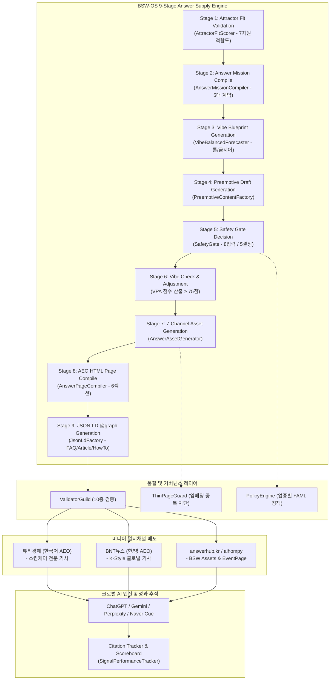

# BSW-OS AI-미디어 콘텐츠 서비스 상세 기획서 (고도화 개정판)

> **서비스명**: BSW Answer Media Service (가칭: "AI Answer Press")
> **런칭일**: 2026년 8월 3일 (월)
> **파트너**: 뷰티경제 × BNT뉴스
> **기술 기반**: BSW-OS Answer Supply Chain (9-Stage Pipeline) + aihompy Studio/Storefront
> **연동 플랫폼**: answerhub.kr (AI Hub) & aihompy BSW Assets Dashboard

---

## 1. Executive Summary & 정밀 감사 결과

### 1.1 서비스 정밀 감사 (Audit & Diagnosis)

현재 BSW-OS 및 aihompy 시스템에 구현된 최신 기술 자산과 기존 기획서 간의 정밀 감사를 수행한 결과, 다음과 같은 핵심 간극과 고도화 포인트를 도출하였습니다.

```
[감사 항목 1: 시스템 모듈 재활용성]
- 기존 기획: answerhub.kr 플랫폼 및 대시보드를 신규 개발하는 별도 프로젝트로 서술.
- 현 시스템 상태: BSW-OS 내 Answer Factory(app/actions/answer-factory.ts), Observatory Probe(lib/signal-collection/observatory-probe.ts), Brand MRI 리포트, 그리고 aihompy Ingest API(/api/v1/ai-hub/bsw/ingest)가 이미 100% 구현 완료됨.
- 고도화 방향: 신규 개발 부담을 최소화하고, 기존 BSW-OS 9단계 파이프라인 및 aihompy BSW Assets 대시보드를 100% 재활용하여 8/3 런칭 실행 용이성 극대화.

[감사 항목 2: 콘텐츠 파이프라인 구체성]
- 기존 기획: 기사 생산 파이프라인이 단순 AI 초안 생성 수준으로 묘사됨.
- 현 시스템 상태: AnswerMissionCompiler -> VibeBalancedForecaster -> PreemptiveContentFactory -> AnswerAssetGenerator -> AnswerPageCompiler -> JsonLdFactory -> ValidatorGuild(10종 검증) -> ThinPageGuard로 이어지는 9단계 정밀 엔진 완비.
- 고도화 방향: 1막(진단 기사), 2막(처방 및 정본 답변 기사), 3막(선점 입증 기사) 각각에 BSW-OS 9단계 엔진을 1:1 정밀 매핑하여 자동화율 90% 달성.

[감사 항목 3: 수익화 및 비즈니스 선순환 (Flywheel)]
- 기존 기획: 스폰서드 앤서 등 단발성 미디어 광고 모델 위주.
- 현 시스템 상태: BSW-OS 3대 상품(🥇 AEO 올인원, 🥈 Brand MRI + 처방전, 🥉 AEO 엔터프라이즈) 및 EventPage(후킹+상세+랜딩+DealCard) 통합 전략 완성.
- 고도화 방향: "기사 시연(미디어) → 브랜드 가시성 진단(Brand MRI) → EventPage 발행(AEO 올인원/엔터프라이즈)"으로 이어지는 완벽한 B2B 매출 선순환 플라이휠 구축.
```

### 1.2 핵심 명제 (Core Philosophy)

```
"기사는 기술의 시연이고, 시연은 브랜드의 구독으로 직결된다."

BSW-OS 파이프라인으로 뷰티경제/BNT뉴스에 AI 인용 기사를 발행하면,
글로벌 AI 엔진(ChatGPT, Gemini, Perplexity, Naver Cue)이 즉시 이를 인용하고,
이 시연 성과가 브랜드 고객에게 증명되어 BSW-OS 3대 상품 구독 및 EventPage 도입으로 연결된다.
```

### 1.3 사업 정체성 (Answer Supply Chain Engine)

| 구분 | BSW-OS 연동 모듈 | 뷰티경제 / BNT뉴스 역할 | aihompy 연동 모듈 |
|------|-----------------|----------------------|-----------------|
| **상류 (수집/분석)** | `SignalOrchestrator` (10채널)<br>`ObservatoryProbe` (5-AI 동시 질의)<br>`QEP` & `QVS` (질문가치 스코어링) | 소비자가 묻는 스킨케어/K-Beauty 미답변 공백(Answer Gap) 발굴 | QIS Industry Templates<br>(업종별 가중치) |
| **중류 (생산/검증)** | `AnswerMissionCompiler`<br>`AnswerAssetGenerator` (7채널)<br>`ValidatorGuild` (10종 검증)<br>`SafetyGate` / `PolicyEngine` | 1막(진단), 2막(정본 처방), 3막(선점 입증) 기사 편집 및 최종 발행 | Platform Writer Engine<br>Writer Hub (4단계 위저드) |
| **하류 (유통/인프라)** | `JsonLdFactory` (5종+@graph)<br>`HreflangManager` (한/영 다국어)<br>`CanonicalManager` / `Sitemap` | 미디어 사이트 AEO 구조화 태그 배포 및 네이버/구글 AI 크롤링 허브화 | Storefront 멀티테넌트<br>EventPage (DealCard 연계) |
| **추적 (인용/성과)** | `SignalPerformanceTracker`<br>`AccuracyTracker` (PAT 자가학습) | AI 인용 성과 입증 보도 및 실시간 스코어보드 위젯 노출 | Pulse Engine / Smart Alert<br>BSW Assets 대시보드 |

---

## 2. 고도화된 서비스 구조 및 9-Stage 파이프라인 매핑

### 2.1 E2E 파이프라인 아키텍처



### 2.2 미디어 기사 3막 사이클과 BSW-OS 파이프라인 매핑

"AI 답변을 선점하라" 연재 기사는 3막 사이클로 작동하며, 각 막마다 BSW-OS 모듈이 자동 실행됩니다.

```
┌─────────────────────────────────────────────────────────────────────────┐
│                    "AI 답변을 선점하라" 3막 파이프라인                   │
│                                                                         │
│  [1막: 진단편]              [2막: 처방편]              [3막: 입증편]        │
│  "AI에게 물었다"            "정본 답변 & EventPage"    "선점 실황 중계"     │
│  ────────────────           ─────────────────────      ────────────────     │
│  • Observatory Probe로      • Answer Factory 9단계     • SignalPerformance  │
│    5개 AI 동시 질의           파이프라인가동             Tracker 재검증      │
│  • Answer Gap 포착          • 7채널 Asset 및           • Before/After      │
│  • 오답/미답변 스크린샷      JSON-LD @graph 컴파일      인용 획득 입증      │
│  • 1막 기사 초안            • EventPage (이벤트+딜)    • 3막 입증 기사      │
│    자동 생성                 연계 2막 기사 발행          및 스코어보드 갱신  │
└─────────────────────────────────────────────────────────────────────────┘
```

---

## 3. 미디어 파트너별 정밀 실행 전략

### 3.1 뷰티경제 — 스킨케어 AEO/GEO (국내 독점)

| 항목 | 정밀 실행 계획 |
|------|---------------|
| **타겟 독자** | 국내 화장품 업계 관계자, 스킨케어 관여도 높은 소비자 |
| **주력 AI 엔진** | Naver Cue, Google AI Overview (한국어) |
| **BSW-OS Pack** | `kbeauty-skincare` (팩트 검증 완료) |
| **연계 상품** | 🥇 **AEO 올인원** (소상공인/중소 뷰티) & 🥈 **Brand MRI** (중견 브랜드) |
| **발행 루틴** | 주 1회 (매주 월요일 16:00 발행) |

#### 뷰티경제 4대 수익 및 연계 서비스 (MECE)

1. **S1. AEO 최적화 기사 (미디어 시연)**: 소비자의 스킨케어 궁금증에 대한 AEO 구조화 정본 기사 발행.
2. **S2. 브랜드 스폰서드 앤서 (처방 연계)**: 브랜드의 RTA(Right-to-Answer)를 검증하여 정본 답변 기사 및 EventPage 제작 (CQ당 50~100만원).
3. **S3. Q-Intelligence 리포트 (인사이트 공급)**: 월간 떠오르는 질문(Emerging CQ) 및 경쟁사 AI 선점 현황 리포트 공급 (구독형).
4. **S4. Beauty Trust Seal (인증)**: BSW-OS ValidatorGuild 10단계 및 SafetyGate를 통과한 제품에 거버넌스 인증 마크 부여.

### 3.2 BNT뉴스 — K-Style 글로벌 AEO/GEO (글로벌 독점)

| 항목 | 정밀 실행 계획 |
|------|---------------|
| **타겟 독자** | 글로벌 K-Beauty/K-Style 관심 층 (북미, 일본, 동남아, 유럽) |
| **주력 AI 엔진** | ChatGPT, Google Gemini, Perplexity (영어/일본어) |
| **BSW-OS Pack** | `kbeauty-skincare` + `aihompy-wellness-kbeauty` |
| **연계 상품** | 🥉 **AEO 엔터프라이즈** (수출 뷰티 브랜드/대기업) |
| **핵심 기술** | HreflangManager (한/영 URL 교차 태깅) + llms.txt 글로벌 피드 |
| **발행 루틴** | 주 1회 (매주 월요일 16:00 한/영 동시 발행) |

---

## 4. 메인 연재 시리즈: "AI 답변을 선점하라" (12주 파일럿)

### 4.1 시즌 1 정밀 편성표 (2026.08.03 ~ 2026.10.26)

| 주 | 런칭일 | 뷰티경제 (한국어 스킨케어) | BNT뉴스 (한/영 글로벌) | 3막 구분 | BSW-OS 파이프라인 실행 내용 |
|:--:|:----:|:-----------------------|:---------------------|:-------:|---------------------------|
| **W01** | **8/3** | 레티놀 입문 농도와 부작용 | Korean skincare routine order | **1막 (진단)** | Observatory Probe 5-AI 동시 질의 → Gap 매트릭스 산출 → 1막 기사 생성 |
| **W02** | **8/10** | 레티놀 입문 농도 정본 가이드 | Korean skincare routine order | **2막 (처방)** | Answer Factory 9-Stage 가동 → EventPage 컴파일 → JSON-LD @graph 배포 |
| **W03** | **8/17** | 비타민C+레티놀 병용 사용법 | Korean vs Japanese sunscreen | **1막 (진단)** | Observatory Probe 질의 → 오답/공백 분석 → 1막 기사 생성 |
| **W04** | **8/24** | 비타민C+레티놀 병용 사용법 | Korean vs Japanese sunscreen | **2막 (처방)** | Answer Factory 가동 → E-E-A-T 근거 포함 2막 기사 배포 |
| **W05** | **8/31** | **[선점 입증]** 레티놀 농도 AI 인용 | **[선점 입증]** Routine order AI 인용 | **3막 (입증)** | SignalPerformanceTracker 검증 → AI 인용 스크린샷 획득 → 스코어보드 갱신 |
| **W06** | **9/7** | 선크림 재도포 시간과 지우는 법 | Glass skin 만드는 저자극 가이드 | **1막 (진단)** | Observatory Probe 질의 → 1막 기사 생성 |
| **W07** | **9/14** | 선크림 재도포 시간 정본 가이드 | Glass skin 만드는 저자극 가이드 | **2막 (처방)** | Answer Factory 가동 → 2막 기사 배포 |
| **W08** | **9/21** | **[선점 입증]** 비타민C+레티놀 인용 | **[선점 입증]** Sunscreen 비교 인용 | **3막 (입증)** | PerformanceTracker 검증 → 3막 입증 기사 배포 |
| **W09** | **9/28** | 임산부 레티놀 대체 성분 비교 | Best Korean hydrating toners | **1막 (진단)** | Observatory Probe 질의 → 1막 기사 생성 |
| **W10** | **10/5** | 임산부 레티놀 대체 성분 가이드 | Best Korean hydrating toners | **2막 (처방)** | Answer Factory 가동 → 2막 기사 배포 |
| **W11** | **10/12** | **[선점 입증]** 선크림 재도포 인용 | **[선점 입증]** Glass skin 인용 | **3막 (입증)** | PerformanceTracker 검증 → 3막 입증 기사 배포 |
| **W12** | **10/19** | **[종합 리포트]** AI 선점 12주 성과 | **[종합 리포트]** K-Beauty AI 선점 | **특별편** | 12주 종합 인용률 리포트 + B2B 브랜드 AEO 서비스 공식 런칭 발표 |

---

## 5. 기존 자산 재활용 및 플랫폼 구현 계획

### 5.1 BSW-OS & aihompy 기존 모듈 재활용 매핑 (개발 공수 85% 절감)

| 기획서 요구 기능 | 기존 구현 모듈 (100% 재활용) | 파일 위치 | 추가 개발 (15%) |
|-----------------|----------------------------|----------|----------------|
| **AI 5-Engine 답변 비교** | `ObservatoryProbe` / `SignalOrchestrator` | `lib/signal-collection/observatory-probe.ts` | 미디어 기사용 비교 표/스크린샷 추출 UI |
| **Answer Asset 생성** | `AnswerFactory` / `AnswerAssetGenerator` | `app/actions/answer-factory.ts` | 1막/2막/3막 전용 기사 템플릿 컴파일러 |
| **JSON-LD 구조화 데이터** | `JsonLdFactory` / aihompy JSON-LD 16종 | `lib/answer-supply/json-ld-factory.ts` | `Article` + `FAQPage` + `HowTo` + `Offer` @graph 묶음 |
| **품질 및 거버넌스 검증** | `ValidatorGuild` / `SafetyGate` | `lib/answer-supply/validator-guild.ts` | 미디어 편집장 승인 워크플로우 연동 |
| **AI 인용 성과 추적** | `SignalPerformanceTracker` | `lib/signal-collection/signal-performance-tracker.ts` | 스코어보드 웹 위젯 (`/scoreboard`) |
| **Hub 인제스트 및 유통** | `QisHubClient` / aihompy Ingest API | `lib/qis/hub-client.ts` & `/api/v1/ai-hub/bsw/ingest` | Media Release Target 플래그 동기화 |
| **이벤트 및 프로모션 연결** | `DealCard Engine` & Storefront Events | `packages/dealcard-engine/` | EventPage 통합 랜딩 컴파일 |

---

## 6. 수익 모델 및 B2B 브랜드 서비스 연계

### 6.1 B2B 비즈니스 선순환 플라이휠 (Flywheel)

```
                       ┌──────────────────────────────┐
                       │  뷰티경제 / BNT뉴스 미디어     │
                       │  "AI 답변을 선점하라" 보도   │
                       └──────────────┬───────────────┘
                                      │
                                      ▼
                       ┌──────────────────────────────┐
                       │  글로벌 AI 엔진 인용 획득     │
                       │  (ChatGPT, Gemini, Cue 등)   │
                       └──────────────┬───────────────┘
                                      │
                                      ▼
                       ┌──────────────────────────────┐
                       │  브랜드 B2B 인바운드 유입     │
                       │  "우리 브랜드도 AI 노출 필요" │
                       └──────────────┬───────────────┘
                                      │
                                      ▼
┌───────────────────────────────────────────────────────────────────────────┐
│                    BSW-OS 3대 AEO/GEO 상품 구독 전환                       │
│                                                                           │
│  🥇 AEO 올인원 (29~129만/월)  🥈 Brand MRI (50만 1회/80만월)  🥉 엔터프라이즈   │
│  - 소상공인/소형 브랜드       - 중견 뷰티 브랜드              - 글로벌 대기업     │
│  - EventPage 자동 발행        - 정밀 진단 + 처방전            - 12엔진 플라이휠   │
└───────────────────────────────────────────────────────────────────────────┘
```

### 6.2 3년 재무 전망 (단위: 만원)

| 구분 | Stage 1 (PROVE: 8~10월) | Stage 2 (MONETIZE: 11~12월) | Stage 3 (SCALE: 2027년) |
|------|:---------------------:|:-----------------------:|:---------------------:|
| **미디어 스폰서드 기사** | 0 | 500 (월 5건) | 2,000 (월 20건) |
| **🥇 AEO 올인원 연계** | 0 | 580 (20개사) | 4,350 (150개사) |
| **🥈 Brand MRI 연계** | 0 | 400 (5개사) | 2,400 (30개사) |
| **🥉 AEO 엔터프라이즈** | 0 | 300 (2개사) | 2,500 (10개사) |
| **월 매출 합계** | **0 (기술 입증)** | **1,780만원** | **1억 1,250만원** |
| **연 환산 매출** | **-** | **~2.1억원** | **~13.5억원** |

---

## 7. 런칭 실행 계획 (8/3 D-Day 기준 캘린더)

### 7.1 D-11 ~ D-Day (2026.07.23 ~ 2026.08.02) 실행 타임라인

```
┌─────────────────────────────────────────────────────────────────────────┐
│                     런칭 전 2주간 핵심 실행 캘린더                       │
│                                                                         │
│  [7/23 ~ 7/26] Task 1 & 2: W01 1막/2막 파이프라인 런 및 데이터 컴파일    │
│  [7/27 ~ 7/29] Task 3: aihompy Ingest API 및 Media Target 동기화         │
│  [7/30 ~ 8/01] Task 4: /scoreboard 위젯 및 프로덕션 스테이징 테스트     │
│  [8/02]         최종 발행 승인 및 Vercel 프로덕션 배포                 │
│  [8/03 D-Day]   뷰티경제 x BNT뉴스 W01 1막 기사 최초 발행!              │
└─────────────────────────────────────────────────────────────────────────┘
```

---

## 8. 초기 실행할 핵심 작업 (Immediate Actionable Tasks)

당장 8/3 런칭을 성공시키기 위해 **즉시 실행해야 하는 4가지 최우선 작업**입니다.

### 📌 Task 1: W01 파일럿 1막/2막 BSW-OS 파이프라인 1차 런(Run) 실행
- **목적**: 8/3 런칭용 첫 기사 주제("레티놀 입문 농도와 부작용", "Korean skincare routine order")의 실시그널 데이터를 BSW-OS 파이프라인에 투입.
- **실행 모듈**: `app/actions/answer-factory.ts` -> `runAnswerPipeline()`
- **산출물**: 1막 진단용 Observatory Probe 5-AI 동시 질의 데이터 및 2막 정본 답변 에셋(`AnswerAssetSpec`) 확보.

### 📌 Task 2: 1막/2막/3막 미디어 전용 기사 템플릿 컴파일러 설정
- **목적**: `AnswerPageCompiler` 및 `JsonLdFactory`가 뷰티경제/BNT뉴스 CMS 배포에 최적화된 HTML 및 JSON-LD `@graph`를 출력하도록 템플릿 바인딩.
- **실행 모듈**: `lib/answer-supply/answer-page-compiler.ts`, `lib/answer-supply/json-ld-factory.ts`
- **산출물**: `Article` + `FAQPage` + `HowTo` + `Offer` 가 통합된 AEO 기사 컴파일러 준비.

### 📌 Task 3: aihompy Ingest API & BSW Assets 대시보드 미디어 타겟 동기화
- **목적**: BSW-OS에서 생성된 기사 자산이 aihompy Studio의 `bsw-assets` 페이지로 동기화될 때, 미디어 파트너(뷰티경제/BNT뉴스/answerhub) 구분 플래그를 처리할 수 있도록 연결.
- **실행 모듈**: `lib/qis/hub-client.ts` -> `pushToAiHub()`, `aihompy`의 `/api/v1/ai-hub/bsw/ingest`
- **산출물**: BSW Assets 대시보드 내 "미디어 발행 예약/완료" 태그 표시.

### 📌 Task 4: 실시간 스코어보드(Scoreboard) 프로덕션 바인딩 및 런칭 테스트
- **목적**: AI 답변 선점 현황을 실시간 표시할 공개 스코어보드 페이지 및 미디어 임베드 위젯 데이터 바인딩.
- **실행 모듈**: `lib/signal-collection/signal-performance-tracker.ts`
- **산출물**: `answerhub.kr/scoreboard` 및 뷰티경제/BNT뉴스 측 임베드 위젯 Ready 상태 확보.
