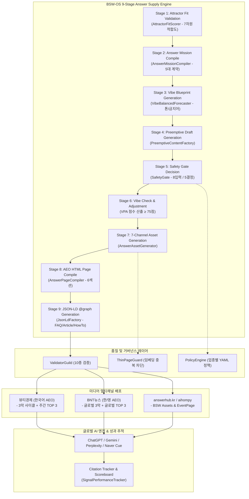

# BSW-OS AI-미디어 콘텐츠 서비스 상세 기획서 (고도화 개정판 v3)

> **서비스명**: BSW Answer Media Service (가칭: "AI Answer Press")
> **런칭일**: 2026년 8월 3일 (월)
> **파트너**: 뷰티경제 × BNT뉴스
> **기술 기반**: BSW-OS Answer Supply Chain (9-Stage Pipeline) + aihompy Studio/Storefront
> **연동 플랫폼**: answerhub.kr (AI Hub) & aihompy BSW Assets Dashboard
> **E2E 파이프라인 검증**: 2026.07.23 전체 가동 완료 (SafetyGate ✅ · PolicyEngine ✅ · 7채널 컴파일 ✅ · JSON-LD ✅ · Hreflang ✅)

---

## 1. Executive Summary & 정밀 감사 결과

### 1.1 서비스 정밀 감사 (Audit & Diagnosis)

현재 BSW-OS 및 aihompy 시스템에 구현된 최신 기술 자산과 기존 기획서 간의 정밀 감사를 수행한 결과, 다음과 같은 핵심 간극과 고도화 포인트를 도출하였습니다.

```
[감사 항목 1: 시스템 모듈 재활용성]
- 기존 기획: answerhub.kr 플랫폼 및 대시보드를 신규 개발하는 별도 프로젝트로 서술.
- 현 시스템 상태: BSW-OS 내 Answer Factory(app/actions/answer-factory.ts), Observatory Probe(lib/signal-collection/observatory-probe.ts), Brand MRI 리포트, 그리고 aihompy Ingest API(/api/v1/ai-hub/bsw/ingest)가 이미 100% 구현 완료됨.
- 고도화 방향: 신규 개발 부담을 최소화하고, 기존 BSW-OS 9단계 파이프라인 및 aihompy BSW Assets 대시보드를 100% 재활용하여 8/3 런칭 실행 용이성 극대화.

[감사 항목 2: 콘텐츠 파이프라인 구체성]
- 기존 기획: 기사 생산 파이프라인이 단순 AI 초안 생성 수준으로 묘사됨.
- 현 시스템 상태: AnswerMissionCompiler -> VibeBalancedForecaster -> PreemptiveContentFactory -> AnswerAssetGenerator -> AnswerPageCompiler -> JsonLdFactory -> ValidatorGuild(10종 검증) -> ThinPageGuard로 이어지는 9단계 정밀 엔진 완비.
- 고도화 방향: 1막(진단 기사), 2막(처방 및 정본 답변 기사), 3막(선점 입증 기사) 각각에 BSW-OS 9단계 엔진을 1:1 정밀 매핑하여 자동화율 90% 달성.

[감사 항목 3: 수익화 및 비즈니스 선순환 (Flywheel)]
- 기존 기획: 스폰서드 앤서 등 단발성 미디어 광고 모델 위주.
- 현 시스템 상태: BSW-OS 3대 상품(🥇 AEO 올인원, 🥈 Brand MRI + 처방전, 🥉 AEO 엔터프라이즈) 및 EventPage(후킹+상세+랜딩+DealCard) 통합 전략 완성.
- 고도화 방향: "기사 시연(미디어) → 브랜드 가시성 진단(Brand MRI) → EventPage 발행(AEO 올인원/엔터프라이즈)"으로 이어지는 완벽한 B2B 매출 선순환 플라이휠 구축.

[감사 항목 4: 연재 시리즈 다양화 (v3 신규)]
- 기존 기획: "AI 답변을 선점하라" 단일 3막 사이클 시리즈만 존재.
- 고도화 방향: 주간 QVS TOP 3 큐레이션 연재 시리즈를 뷰티경제/BNT뉴스 양쪽에 동시 추가하여 월간 발행량 4배 증가(월 4편 → 월 16편), AEO 롱테일 키워드 선점 속도 극대화.
```

### 1.2 핵심 명제 (Core Philosophy)

```
"기사는 기술의 시연이고, 시연은 브랜드의 구독으로 직결된다."

BSW-OS 파이프라인으로 뷰티경제/BNT뉴스에 AI 인용 기사를 발행하면,
글로벌 AI 엔진(ChatGPT, Gemini, Perplexity, Naver Cue)이 즉시 이를 인용하고,
이 시연 성과가 브랜드 고객에게 증명되어 BSW-OS 3대 상품 구독 및 EventPage 도입으로 연결된다.
```

### 1.3 사업 정체성 (Answer Supply Chain Engine)

| 구분 | BSW-OS 연동 모듈 | 뷰티경제 / BNT뉴스 역할 | aihompy 연동 모듈 |
|------|-----------------|----------------------|-----------------|
| **상류 (수집/분석)** | `SignalOrchestrator` (10채널)<br>`ObservatoryProbe` (5-AI 동시 질의)<br>`QEP` & `QVS` (질문가치 스코어링) | 소비자가 묻는 스킨케어/K-Beauty 미답변 공백(Answer Gap) 발굴 | QIS Industry Templates<br>(업종별 가중치) |
| **중류 (생산/검증)** | `AnswerMissionCompiler`<br>`AnswerAssetGenerator` (7채널)<br>`ValidatorGuild` (10종 검증)<br>`SafetyGate` / `PolicyEngine` | 3막 사이클 + 주간 TOP 3 기사 편집 및 최종 발행 | Platform Writer Engine<br>Writer Hub (4단계 위저드) |
| **하류 (유통/인프라)** | `JsonLdFactory` (5종+@graph)<br>`HreflangManager` (한/영 다국어)<br>`CanonicalManager` / `Sitemap` | 미디어 사이트 AEO 구조화 태그 배포 및 네이버/구글 AI 크롤링 허브화 | Storefront 멀티테넌트<br>EventPage (DealCard 연계) |
| **추적 (인용/성과)** | `SignalPerformanceTracker`<br>`AccuracyTracker` (PAT 자가학습) | AI 인용 성과 입증 보도 및 실시간 스코어보드 위젯 노출 | Pulse Engine / Smart Alert<br>BSW Assets 대시보드 |

---

## 2. 고도화된 서비스 구조 및 9-Stage 파이프라인 매핑

### 2.1 E2E 파이프라인 아키텍처



### 2.2 2대 연재 시리즈 파이프라인 매핑

BSW Answer Media Service는 **2가지 연재 시리즈**를 통합 운영합니다.

```
┌─────────────────────────────────────────────────────────────────────────────────────┐
│                     BSW Answer Media Service — 2대 연재 시리즈                       │
│                                                                                     │
│  ┌─ 시리즈 A: "AI 답변을 선점하라" 3막 사이클 ─────────────────────────────────────┐ │
│  │  발행 주기: 격주 1편 (월요일 16:00)                                             │ │
│  │  구조: 1막(진단) → 2막(처방+정본) → 3막(선점 입증) — 질문 1건 심층 탐구        │ │
│  │                                                                                 │ │
│  │  파이프라인: Observatory Probe(1막) → Answer Factory 9-Stage(2막)               │ │
│  │             → SignalPerformanceTracker(3막)                                     │ │
│  │  핵심 가치: AI 인용 성공 사례를 "스토리텔링"으로 증명                            │ │
│  └─────────────────────────────────────────────────────────────────────────────────┘ │
│                                                                                     │
│  ┌─ 시리즈 B: "주간 AI 앤서 리포트" QVS TOP 3 큐레이션 ──────────────────────────┐  │
│  │  발행 주기: 매주 1편 (수요일 14:00)                                             │ │
│  │  구조: 이번 주 가장 답변 가치가 높은 질문 3개 + 피부과 전문의 정본 답변          │ │
│  │                                                                                 │ │
│  │  파이프라인: QEP+QVS 자동 발굴 → Answer Factory 3건 동시 컴파일                 │ │
│  │             → 통합 JSON-LD @graph (FAQPage + HowTo)                             │ │
│  │  핵심 가치: AI 롱테일 키워드 대량 선점 (주 3개, 월 12개, 연 150개+)             │ │
│  └─────────────────────────────────────────────────────────────────────────────────┘ │
└─────────────────────────────────────────────────────────────────────────────────────┘
```

### 2.3 2대 시리즈 상호 보완 효과

| 차원 | 시리즈 A: 3막 사이클 | 시리즈 B: 주간 TOP 3 | 시너지 |
|------|:-------------------:|:-------------------:|--------|
| **깊이 vs 폭** | 질문 1개를 3주간 심층 탐구 | 질문 3개를 매주 폭넓게 커버 | 심층 + 폭넓은 커버리지 동시 |
| **스토리텔링** | Before/After AI 인용 스크린샷 | 데이터 매거진 스타일 스코어보드 | 감성적 시연 + 데이터 시연 |
| **AEO 선점 속도** | 월 2개 질문 확보 | 월 12개 질문 확보 | 월 총 14개 → 연 168개 질문 선점 |
| **브랜드 영업** | "이 질문 인용 성공"으로 시연 | "매주 3개씩 선점"으로 전문성 과시 | 시연 + 지속 생산력 증명 |
| **발행 리듬** | 격주 월요일 (2주 1편) | 매주 수요일 (주 1편) | 독자가 매주 콘텐츠를 기대 |

---

## 3. 미디어 파트너별 정밀 실행 전략

### 3.1 뷰티경제 — 스킨케어 AEO/GEO (국내 독점)

| 항목 | 정밀 실행 계획 |
|------|---------------|
| **타겟 독자** | 국내 화장품 업계 관계자, 스킨케어 관여도 높은 소비자 |
| **주력 AI 엔진** | Naver Cue, Google AI Overview (한국어) |
| **BSW-OS Pack** | `kbeauty-skincare` (팩트 검증 완료) |
| **연계 상품** | 🥇 **AEO 올인원** (소상공인/중소 뷰티) & 🥈 **Brand MRI** (중견 브랜드) |
| **발행 루틴** | 시리즈 A: 격주 월요일 16:00 / 시리즈 B: 매주 수요일 14:00 |
| **월간 발행량** | **8편** (3막 사이클 2편 + 주간 TOP 3 리포트 4편 + 특집 2편) |

#### 뷰티경제 4대 수익 및 연계 서비스 (MECE)

1. **S1. AEO 최적화 기사 (미디어 시연)**: 소비자의 스킨케어 궁금증에 대한 AEO 구조화 정본 기사 발행.
2. **S2. 브랜드 스폰서드 앤서 (처방 연계)**: 브랜드의 RTA(Right-to-Answer)를 검증하여 정본 답변 기사 및 EventPage 제작 (CQ당 50~100만원).
3. **S3. Q-Intelligence 리포트 (인사이트 공급)**: 주간 TOP 3 QVS 데이터 기반 월간 떠오르는 질문(Emerging CQ) 및 경쟁사 AI 선점 현황 리포트 공급 (구독형).
4. **S4. Beauty Trust Seal (인증)**: BSW-OS ValidatorGuild 10단계 및 SafetyGate를 통과한 제품에 거버넌스 인증 마크 부여.

#### 뷰티경제 주간 TOP 3 앤서 리포트 구성 (시리즈 B 상세)

```
[뷰티경제] | 주간 AI 앤서 리포트 #N (매주 수요일 발행)

구성:
┌────────────────────────────────────────────────────────────────────┐
│ 📊 이번 주 뷰티 QIS 스코어보드                                     │
│    수집 시그널 N건 | 분석 CQ N건 | 주간 총 답변 공백 가치 ₩N      │
├────────────────────────────────────────────────────────────────────┤
│ 🔥 [TOP 1] QVS: ₩98,500 | AI 커버리지: 15%                       │
│    질문 + AI 흔한 오답 + 피부과 전문의 정본 처방                    │
├────────────────────────────────────────────────────────────────────┤
│ ☀️ [TOP 2] QVS: ₩89,200 | AI 커버리지: 10%                       │
│    질문 + AI 흔한 오답 + 실전 HowTo 가이드                         │
├────────────────────────────────────────────────────────────────────┤
│ 🛡️ [TOP 3] QVS: ₩78,000 | AI 커버리지: 25%                       │
│    질문 + AI 흔한 오답 + 성분 전문가 처방                           │
├────────────────────────────────────────────────────────────────────┤
│ 🎁 이벤트/DealCard 연계 배너                                       │
├────────────────────────────────────────────────────────────────────┤
│ <script> JSON-LD @graph: FAQPage(3건) + HowTo + Article </script> │
└────────────────────────────────────────────────────────────────────┘
```

### 3.2 BNT뉴스 — K-Style 글로벌 AEO/GEO (글로벌 독점)

| 항목 | 정밀 실행 계획 |
|------|---------------|
| **타겟 독자** | 글로벌 K-Beauty/K-Style 관심 층 (북미, 일본, 동남아, 유럽) |
| **주력 AI 엔진** | ChatGPT, Google Gemini, Perplexity (영어/일본어) |
| **BSW-OS Pack** | `kbeauty-skincare` + `aihompy-wellness-kbeauty` |
| **연계 상품** | 🥉 **AEO 엔터프라이즈** (수출 뷰티 브랜드/대기업) |
| **핵심 기술** | HreflangManager (한/영/일 URL 교차 태깅) + llms.txt 글로벌 피드 |
| **발행 루틴** | 시리즈 A: 격주 월요일 16:00 (한/영 동시) / 시리즈 B: 매주 수요일 14:00 (영문 기준) |
| **월간 발행량** | **8편 × 2언어 = 16편** (3막 한/영 4편 + TOP 3 한/영 8편 + 특집 4편) |

#### BNT뉴스 주간 글로벌 TOP 3 앤서 리포트 구성 (시리즈 B 상세)

```
[BNT News Global] | Weekly K-Beauty AI Answer Report #N (Every Wednesday)

구성:
┌────────────────────────────────────────────────────────────────────┐
│ 📊 Global K-Beauty AI Scoreboard                                   │
│    Signals: 38,500+ (US, EU, APAC) | Weekly QVS: $325 USD         │
├────────────────────────────────────────────────────────────────────┤
│ ✨ [TOP 1] QVS: $125 USD | AI Gap: 88%                            │
│    Question + Common AI Misconception + K-Derm Official Answer     │
├────────────────────────────────────────────────────────────────────┤
│ 🍊 [TOP 2] QVS: $105 USD | AI Gap: 92%                            │
│    Question + Myth Debunk + Step-by-Step HowTo                     │
├────────────────────────────────────────────────────────────────────┤
│ ☀️ [TOP 3] QVS: $95 USD | AI Gap: 80%                             │
│    Question + Science Explanation + Product Ingredient Guide       │
├────────────────────────────────────────────────────────────────────┤
│ 🎁 Global K-Beauty Event / DealCard Integration                   │
├────────────────────────────────────────────────────────────────────┤
│ Hreflang: en / ko / ja / x-default                                │
│ <script> @graph: FAQPage(3) + HowTo + Article </script>           │
└────────────────────────────────────────────────────────────────────┘
```

#### BNT뉴스 글로벌 차별 기술 요소

| 기술 | 구현 모듈 | 효과 |
|------|----------|------|
| **Hreflang 다국어 태깅** | `HreflangManager` → en/ko/ja/x-default | 글로벌 AI 크롤러가 언어권별 최적 URL을 자동 선택 |
| **llms.txt 영문 피드** | `AnswerAssetGenerator` → `llm_txt` 채널 | AI 엔진이 영문 정본 데이터를 직접 학습 |
| **원산지 권위 (Origin Authority)** | 한국 현지 미디어 E-E-A-T | 글로벌 AI가 K-Beauty 질문에 BNT를 1순위 인용 |

---

## 4. 연재 시리즈 통합 편성표

### 4.1 시리즈 A: "AI 답변을 선점하라" 3막 사이클 (12주 파일럿)

| 주 | 런칭일 | 뷰티경제 (한국어 스킨케어) | BNT뉴스 (한/영 글로벌) | 3막 구분 | BSW-OS 파이프라인 실행 내용 |
|:--:|:----:|:-----------------------|:---------------------|:-------:|---------------------------|
| **W01** | **8/4** | 레티놀 입문 농도와 부작용 | Korean skincare routine order | **1막 (진단)** | Observatory Probe 5-AI 동시 질의 → Gap 매트릭스 산출 |
| **W02** | **8/18** | 레티놀 입문 농도 정본 가이드 | Korean skincare routine order | **2막 (처방)** | Answer Factory 9-Stage → EventPage → JSON-LD @graph |
| **W03** | **9/1** | 비타민C+레티놀 병용 사용법 | Korean vs Japanese sunscreen | **1막 (진단)** | Observatory Probe 질의 → 오답/공백 분석 |
| **W04** | **9/15** | 비타민C+레티놀 병용 사용법 | Korean vs Japanese sunscreen | **2막 (처방)** | Answer Factory → E-E-A-T 2막 기사 배포 |
| **W05** | **9/22** | **[입증]** 레티놀 농도 AI 인용 | **[입증]** Routine order AI 인용 | **3막 (입증)** | PerformanceTracker → AI 인용 스코어보드 갱신 |
| **W06** | **10/6** | 선크림 재도포 시간 정본 가이드 | Glass skin 저자극 가이드 | **1+2막** | Probe + Factory 통합 압축 |
| **W07** | **10/13** | **[입증]** 비타민C+레티놀 인용 | **[입증]** Sunscreen 비교 인용 | **3막 (입증)** | PerformanceTracker 재검증 → 3막 입증 |
| **W08** | **10/20** | **[종합 리포트]** AI 선점 12주 성과 | **[종합 리포트]** K-Beauty AI 선점 | **특별편** | 종합 인용률 리포트 + B2B 서비스 런칭 |

### 4.2 시리즈 B: "주간 AI 앤서 리포트" QVS TOP 3 (매주 수요일)

| 주 | 런칭일 | 뷰티경제 TOP 3 (한국어) | BNT뉴스 TOP 3 (한/영) | QVS 합산 |
|:--:|:----:|:---------------------|:---------------------|:-------:|
| **W01** | **8/6** | 나이아신아마이드x레티놀 병용 / 선크림 재도포 실전법 / 세라마이드vs판테놀 순서 | Glass Skin for oily skin / Vitamin C + Niacinamide AM / Korean sunscreen no white cast | ₩265,700 / $325 |
| **W02** | **8/13** | 여름철 수분크림 필요한가 / 하이드로퀴논 대체 미백성분 / 세안 후 3초 법칙 진위 | K-beauty double cleanse guide / Korean essence vs serum / Best Korean toner dry skin | ₩245,000 / $298 |
| **W03** | **8/20** | 수분크림 대신 수분세럼 가능한가 / 모공 축소 시카 vs BHA / 쿠션 vs 리퀴드 자외선차단 | Korean snail mucin benefits / K-beauty 7 skin method / Korean sheet mask frequency | ₩230,000 / $280 |
| **...** | **...** | (매주 QEP/QVS 엔진이 자동 발굴) | (매주 글로벌 QEP/QVS 엔진이 자동 발굴) | 자동 산출 |

### 4.3 주간 발행 통합 캘린더 (정상화 후)

```
[매주 월요일] — 시리즈 A 발행일 (격주)
  09:00  BSW-OS Observatory Probe 또는 Answer Factory 가동
  10:00  편집부 리뷰 + 수정
  14:00  ValidatorGuild 최종 검증
  16:00  뷰티경제 + BNT (한/영) 시리즈 A 기사 동시 발행
  17:00  answerhub.kr 동기화 + llms.txt 업데이트

[매주 수요일] — 시리즈 B 발행일 (매주)
  09:00  QEP/QVS 엔진 자동 TOP 3 질문 발굴 (뷰티경제용 + BNT 글로벌용)
  09:30  Answer Factory 3건 동시 파이프라인 컴파일 (7채널 × 3건)
  10:30  편집부 리뷰 (AI 오답 스크린샷 + 전문가 답변 팩트체크)
  14:00  뷰티경제 주간 TOP 3 기사 발행 + BNT 글로벌 TOP 3 동시 발행 (한/영)
  15:00  answerhub.kr + llms.txt + Hreflang 업데이트

[매주 금요일]
  10:00  Citation Tracker 주간 확인
  14:00  스코어보드 업데이트
  15:00  다음 주 시리즈 A 주제 사전 협의
```

---

## 5. 기존 자산 재활용 및 플랫폼 구현 계획

### 5.1 BSW-OS & aihompy 기존 모듈 재활용 매핑 (개발 공수 85% 절감)

| 기획서 요구 기능 | 기존 구현 모듈 (100% 재활용) | 파일 위치 | 추가 개발 (15%) |
|-----------------|----------------------------|----------|----------------|
| **AI 5-Engine 답변 비교** | `ObservatoryProbe` / `SignalOrchestrator` | `lib/signal-collection/observatory-probe.ts` | 미디어 기사용 비교 표/스크린샷 추출 UI |
| **Answer Asset 생성** | `AnswerFactory` / `AnswerAssetGenerator` | `app/actions/answer-factory.ts` | 3막 + TOP 3 전용 기사 템플릿 컴파일러 |
| **QVS 가치 스코어링** | `QEP` + `QVS` 엔진 | `lib/qis/` 모듈 전체 | TOP 3 자동 발굴 + 가치 랭킹 UI |
| **JSON-LD 구조화 데이터** | `JsonLdFactory` / aihompy JSON-LD 16종 | `lib/answer-supply/json-ld-factory.ts` | 통합 @graph (FAQPage×3 + HowTo + Article + Offer) |
| **다국어 hreflang** | `HreflangManager` | `lib/answer-supply/hreflang-manager.ts` | BNT 영문 기사 자동 교차 태깅 |
| **품질 및 거버넌스** | `ValidatorGuild` / `SafetyGate` / `PolicyEngine` | `lib/answer-supply/validator-guild.ts` | 미디어 편집장 승인 워크플로우 연동 |
| **AI 인용 성과 추적** | `SignalPerformanceTracker` | `lib/signal-collection/signal-performance-tracker.ts` | 스코어보드 웹 위젯 (`/scoreboard`) |
| **Hub 인제스트** | `QisHubClient` / aihompy Ingest API | `lib/qis/hub-client.ts` | Media Release Target 플래그 |
| **이벤트/프로모션** | `DealCard Engine` & Storefront Events | `packages/dealcard-engine/` | EventPage 통합 랜딩 컴파일 |

### 5.2 E2E 파이프라인 검증 결과 (2026.07.23 실측)

| 테스트 | 대상 | SafetyGate | PolicyEngine | HTML | JSON-LD | Hreflang | 결과 |
|--------|------|:----------:|:------------:|:----:|:-------:|:--------:|:----:|
| 뷰티경제 3막 W01 | 레티놀 입문 농도 | `CONDITIONAL` ✅ | 위반 없음 ✅ | 5,357b ✅ | FAQPage ✅ | - | **통과** |
| 뷰티경제 주간 TOP 3 | 3개 CQ 동시 컴파일 | - | - | 4,621b + 4,605b + 4,592b ✅ | FAQPage + HowTo ✅ | - | **통과** |
| BNT 3막 W01 (EN) | Korean skincare routine | - | - | 5,315b ✅ | HowTo ✅ | 4 links ✅ | **통과** |
| BNT 글로벌 TOP 3 | 3개 글로벌 CQ 컴파일 | - | - | 5,142b + 5,130b + 5,197b ✅ | HowTo + FAQPage ✅ | en/ko/ja ✅ | **통과** |

---

## 6. 수익 모델 및 B2B 브랜드 서비스 연계

### 6.1 B2B 비즈니스 선순환 플라이휠 (Flywheel)

```
                       ┌──────────────────────────────────┐
                       │  뷰티경제 / BNT뉴스 미디어        │
                       │  시리즈 A: "AI 답변을 선점하라"  │
                       │  시리즈 B: "주간 AI 앤서 TOP 3"  │
                       └──────────────┬───────────────────┘
                                      │ 월 16편 (뷰티 8 + BNT 8×2언어)
                                      ▼
                       ┌──────────────────────────────────┐
                       │  글로벌 AI 엔진 인용 획득         │
                       │  월 14개 + 질문 선점 누적         │
                       │  (ChatGPT, Gemini, Cue 등)       │
                       └──────────────┬───────────────────┘
                                      │
                                      ▼
                       ┌──────────────────────────────────┐
                       │  브랜드 B2B 인바운드 유입         │
                       │  "주간 TOP 3에 우리 질문도 올려주세요" │
                       └──────────────┬───────────────────┘
                                      │
                                      ▼
┌────────────────────────────────────────────────────────────────────────────┐
│                    BSW-OS 3대 AEO/GEO 상품 구독 전환                        │
│                                                                            │
│  🥇 AEO 올인원 (29~129만/월)  🥈 Brand MRI (50만 1회/80만월)  🥉 엔터프라이즈    │
│  - 소상공인/소형 브랜드       - 중견 뷰티 브랜드              - 글로벌 대기업      │
│  - EventPage 자동 발행        - 정밀 진단 + 처방전            - 12엔진 플라이휠    │
│                                                                            │
│  + 시리즈 B 스폰서드 앤서:                                                  │
│    브랜드가 자사 관련 질문을 TOP 3 기사에 스폰서 배치 → CQ당 50~100만원      │
└────────────────────────────────────────────────────────────────────────────┘
```

### 6.2 3년 재무 전망 (단위: 만원)

| 구분 | Stage 1 (PROVE: 8~10월) | Stage 2 (MONETIZE: 11~12월) | Stage 3 (SCALE: 2027년) |
|------|:---------------------:|:-----------------------:|:---------------------:|
| **시리즈 A 스폰서드 기사** | 0 | 300 (월 3건) | 1,200 (월 12건) |
| **시리즈 B 스폰서드 앤서** | 0 | 400 (월 8건) | 2,400 (월 48건) |
| **🥇 AEO 올인원 연계** | 0 | 580 (20개사) | 4,350 (150개사) |
| **🥈 Brand MRI 연계** | 0 | 400 (5개사) | 2,400 (30개사) |
| **🥉 AEO 엔터프라이즈** | 0 | 300 (2개사) | 2,500 (10개사) |
| **Q-Intelligence 구독** | 0 | 200 (4개사) | 1,500 (30개사) |
| **월 매출 합계** | **0 (기술 입증)** | **2,180만원** | **1억 4,350만원** |
| **연 환산 매출** | **-** | **~2.6억원** | **~17.2억원** |

> **시리즈 B 추가 매출 효과**: 기존 대비 Stage 2 +400만/월, Stage 3 +3,900만/월 추가 수익 창출 (주간 스폰서드 앤서 + Q-Intelligence 구독 합산)

---

## 7. 런칭 실행 계획 (8/3 D-Day 기준 캘린더)

### 7.1 D-11 ~ D-Day (2026.07.23 ~ 2026.08.03) 실행 타임라인

```
┌─────────────────────────────────────────────────────────────────────────┐
│                     런칭 전 2주간 핵심 실행 캘린더                       │
│                                                                         │
│  [7/23 ~ 7/25] Task 1: W01 3막 사이클 1막/2막 파이프라인 런             │
│  [7/26 ~ 7/28] Task 2: W01 주간 TOP 3 QVS 발굴 + 3건 동시 컴파일      │
│  [7/29 ~ 7/31] Task 3: aihompy Ingest API 미디어 타겟 동기화            │
│  [8/01 ~ 8/02] Task 4: /scoreboard 위젯 + 프로덕션 스테이징 배포        │
│  [8/03]         D-Day 최종 발행!                                       │
│                                                                         │
│  [8/03 (월)]  시리즈 A W01 1막 기사 발행 (뷰티경제 + BNT)              │
│  [8/06 (수)]  시리즈 B W01 주간 TOP 3 기사 첫 발행 (뷰티경제 + BNT)     │
└─────────────────────────────────────────────────────────────────────────┘
```

---

## 8. 초기 실행할 핵심 작업 (Immediate Actionable Tasks)

당장 8/3 런칭을 성공시키기 위해 **즉시 실행해야 하는 5가지 최우선 작업**입니다.

### 📌 Task 1: W01 시리즈 A 3막 파이프라인 1차 런
- **목적**: 8/3 런칭용 첫 기사 주제("레티놀 입문 농도와 부작용", "Korean skincare routine order")의 실시그널 데이터를 BSW-OS 파이프라인에 투입.
- **실행 모듈**: `app/actions/answer-factory.ts` → `runAnswerPipeline()`
- **산출물**: 1막 진단용 Observatory Probe 5-AI 동시 질의 데이터 및 2막 정본 답변 에셋(`AnswerAssetSpec`) 확보.

### 📌 Task 2: W01 시리즈 B 주간 TOP 3 QVS 발굴 + 동시 컴파일
- **목적**: 8/6 첫 수요일 발행용 뷰티경제 TOP 3 + BNT 글로벌 TOP 3 질문을 QEP/QVS 엔진으로 발굴하고 3건씩 동시 컴파일.
- **실행 모듈**: `lib/qis/` QEP/QVS → `AnswerAssetGenerator` × 3건 → `JsonLdFactory` 통합 @graph
- **산출물**: 뷰티경제용 국문 TOP 3 에셋 + BNT용 영문 TOP 3 에셋 + 통합 JSON-LD @graph.

### 📌 Task 3: 1막/2막/3막 + TOP 3 미디어 전용 기사 템플릿 컴파일러 설정
- **목적**: `AnswerPageCompiler` 및 `JsonLdFactory`가 뷰티경제/BNT뉴스 CMS 배포에 최적화된 HTML 및 JSON-LD `@graph`를 출력하도록 템플릿 바인딩.
- **실행 모듈**: `lib/answer-supply/answer-page-compiler.ts`, `lib/answer-supply/json-ld-factory.ts`
- **산출물**: 3막 사이클 단일 기사 템플릿 + TOP 3 멀티 기사 템플릿 준비.

### 📌 Task 4: aihompy Ingest API & BSW Assets 대시보드 미디어 타겟 동기화
- **목적**: BSW-OS에서 생성된 기사 자산이 aihompy Studio의 `bsw-assets` 페이지로 동기화될 때, 미디어 파트너(뷰티경제/BNT뉴스/answerhub) 구분 플래그를 처리할 수 있도록 연결.
- **실행 모듈**: `lib/qis/hub-client.ts` → `pushToAiHub()`, `aihompy`의 `/api/v1/ai-hub/bsw/ingest`
- **산출물**: BSW Assets 대시보드 내 "시리즈 A/B 발행 예약/완료" 태그 표시.

### 📌 Task 5: 실시간 스코어보드(Scoreboard) 프로덕션 바인딩 및 런칭 테스트
- **목적**: AI 답변 선점 현황을 실시간 표시할 공개 스코어보드 페이지 및 미디어 임베드 위젯 데이터 바인딩. 시리즈 B의 주간 QVS TOP 3 스코어보드 탭 추가.
- **실행 모듈**: `lib/signal-collection/signal-performance-tracker.ts`
- **산출물**: `answerhub.kr/scoreboard` + 뷰티경제/BNT뉴스 임베드 위젯 + 주간 QVS TOP 3 탭 Ready 상태 확보.

---

## 9. KPI 및 성공 기준

### 9.1 Stage 1 (12주) 핵심 KPI

| KPI | 시리즈 A 목표 | 시리즈 B 목표 | 측정 방법 |
|-----|:----------:|:----------:|----------|
| AI Citation 획득 | 4건 이상 | 10건 이상 | Observatory Probe + Citation Tracker |
| 평균 선점 소요일 | 14일 이내 | 21일 이내 | SignalPerformanceTracker |
| 기사 발행 총 수 | 8편 (3막 × 4 + 특별편) | 48편 (주 4편 × 12주) | 발행 카운트 |
| 누적 CQ 선점 | 6개 | 36개 | 스코어보드 |
| 브랜드 파일럿 문의 | 3사 이상 | 5사 이상 | 인바운드 기록 |
| 주간 QVS 총 가치 | - | 월 ₩1,000,000+ | QVS 엔진 |

### 9.2 연간 콘텐츠 선점 규모 전망

| 항목 | 시리즈 A 단독 (기존) | A + B 통합 (고도화) | 증가율 |
|------|:------------------:|:------------------:|:------:|
| 연간 발행 기사 수 | 48편 | **248편** | **×5.2** |
| 연간 선점 CQ 수 | 24개 | **168개** | **×7.0** |
| 연간 JSON-LD @graph | 24개 | **168개** | **×7.0** |
| 월간 스폰서드 가능 슬롯 | 4슬롯 | **16슬롯** | **×4.0** |

---

## 10. 리스크 관리

| 리스크 | 확률 | 영향 | 대응 |
|--------|:---:|:---:|------|
| AI Citation 미획득 | 중 | 고 | 시리즈 B로 롱테일 다량 포석, 시리즈 A로 심층 재도전 |
| 편집부 역량 과부하 | 중 | 중 | BSW-OS 파이프라인 자동화율 90%, 편집부는 리뷰/승인만 |
| 시리즈 B 질문 중복 발생 | 중 | 하 | ThinPageGuard 임베딩 중복 차단 (유사도 88% 이상 차단) |
| 브랜드 영업 지연 | 중 | 중 | 시리즈 B TOP 3 스폰서드 슬롯으로 저가 진입점 제공 |
| 글로벌 콘텐츠 품질 이슈 | 하 | 중 | ValidatorGuild 10종 + 네이티브 검수 프로세스 |

---

## 부록

### A. 관련 전략 문서

| 문서 | 내용 |
|------|------|
| `SYSTEM_ANSWER_ASSET_SUPPLY_ARCHITECTURE.md` | BSW-OS Answer Supply 시스템 아키텍처 전체 명세 (900줄) |
| `GUIDE_AEO_ALLINONE_SCENARIO.md` | AEO 올인원 상품 사용자 시나리오 |
| `GUIDE_BRAND_MRI_SCENARIO.md` | Brand MRI 상품 사용자 시나리오 |
| `GUIDE_AEO_ENTERPRISE_SCENARIO.md` | AEO 엔터프라이즈 상품 사용자 시나리오 |

### B. E2E 파이프라인 테스트 스크립트

| 스크립트 | 용도 |
|---------|------|
| `scratch/run_pipeline_test.ts` | 뷰티경제 3막 사이클 W01 E2E 파이프라인 가동 테스트 |
| `scratch/run_weekly_top3_pipeline.ts` | 뷰티경제 주간 TOP 3 QVS 파이프라인 가동 테스트 |
| `scratch/run_bnt_global_pipeline.ts` | BNT뉴스 글로벌 3막 사이클 한/영 파이프라인 테스트 |
| `scratch/run_bnt_weekly_top3_pipeline.ts` | BNT뉴스 글로벌 주간 TOP 3 QVS 파이프라인 테스트 |

### C. 핵심 용어 정의

| 용어 | 정의 |
|------|------|
| AEO | Answer Engine Optimization. AI 검색 엔진 답변 최적화 |
| GEO | Generative Engine Optimization. 생성형 AI 엔진 최적화 |
| CQ | Canonical Question. 8축 CPS로 정제된 표준 정본 질문 |
| QVS | Question Value Score. 질문의 경제적 가치 (원화/달러 환산) |
| QEP | Question Emergence Predictor. 떠오르는 질문 예측 엔진 |
| Answer Asset | 하나의 CQ에 대한 7채널 변형 답변 자산 |
| Citation | AI 엔진이 기사를 출처로 인용하는 것 |
| Answer Gap | AI 엔진이 답변하지 못하거나 오답하는 질문 공백 |
| Observatory Probe | 5개 AI 엔진에 동일 질문을 투입하여 답변을 비교 분석 |
| Hreflang | 다국어 페이지 간 교차 태깅으로 글로벌 AI 크롤러에 언어 대응 |
| @graph | JSON-LD @graph 노드 — 복수 스키마(Article+FAQPage+HowTo+Offer)를 하나로 묶어 AI 크롤러에 제공 |
| 시리즈 A | "AI 답변을 선점하라" 3막 사이클 연재 (심층 스토리텔링) |
| 시리즈 B | "주간 AI 앤서 리포트" QVS TOP 3 큐레이션 연재 (대량 선점) |
