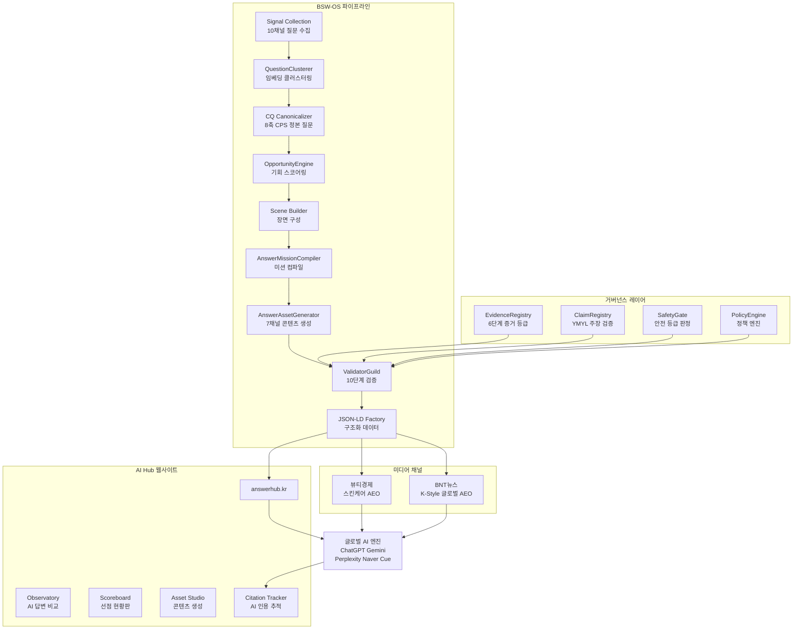

# BSW-OS AI-미디어 콘텐츠 서비스 상세 기획서

> **서비스명**: BSW Answer Media Service (가칭)
> **런칭일**: 2026년 8월 3일 (월)
> **파트너**: 뷰티경제 × BNT뉴스
> **기술 기반**: BSW-OS Answer Supply Chain
> **연동 플랫폼**: answerhub.kr (AI Hub 웹사이트)

---

## 1. Executive Summary

### 1.1 사업 개요

BSW-OS의 Answer Supply Chain 파이프라인을 활용하여, 전문 미디어(뷰티경제, BNT뉴스)와 함께 **AI 엔진이 인용하는 고품질 기사와 앤서카드를 생산·발행**하고, 이를 **AI Hub 웹사이트(answerhub.kr)**에서 통합 관리하는 미디어 콘텐츠 서비스.

### 1.2 핵심 명제

```
"기사가 곧 시연이고, 시연이 곧 영업이다."

BSW-OS 파이프라인으로 생산한 기사를 미디어에 발행하면,
AI 엔진이 이를 인용하기 시작하고,
이 과정 자체가 BSW-OS의 기술력을 증명하며,
브랜드가 같은 서비스를 구매하는 수익 구조가 만들어진다.
```

### 1.3 사업 정체성

BSW Answer Media Service는 **"AI 시대의 답변 공급망(Answer Supply Chain)"** 사업이다.

| 구분 | 설명 |
|------|------|
| 상류 | 소비자 질문 발견 (10채널 시그널 수집 + AI Gap 분석) |
| 중류 | 답변 자산 생산 (Evidence + Safety + 7채널 Asset) |
| 하류 | AI 유통 (JSON-LD + llms.txt + hreflang + Citation 추적) |
| 채널 | 미디어 파트너 (뷰티경제, BNT뉴스) + AI Hub 웹사이트 |

### 1.4 확정된 전략 결정사항

| 항목 | 결정 |
|------|------|
| 미디어 파트너십 | 확보 완료 (뷰티경제, BNT뉴스) |
| 법인 구조 | JV (합작법인) — BSW 60% / 미디어 40% |
| 플랫폼 개발 | 즉시 병행 착수 (Content Track + Platform Track 동시) |
| 런칭일 | 2026년 8월 3일 |

---

## 2. 서비스 구조

### 2.1 전체 아키텍처



### 2.2 서비스 구성요소 (3레이어)

#### Layer 1: AI-미디어 콘텐츠 (Content Layer)

| 채널 | 콘텐츠 유형 | 발행 빈도 | 목표 |
|------|-----------|:--------:|------|
| **뷰티경제** | 스킨케어 AEO 기사 + 앤서카드 | 주 1회 | 한국어 AI 답변 선점 |
| **BNT뉴스** | K-Style 글로벌 AEO 기사 + 앤서카드 | 주 1회 | 영어 AI 답변 선점 |
| **answerhub.kr** | 통합 Answer Asset + llms.txt | 상시 | AI 엔진 크롤링 허브 |

#### Layer 2: AI Hub 웹사이트 (Platform Layer)

| 기능 | 설명 | 대상 |
|------|------|------|
| **Observatory** | AI 5개 엔진 답변 실시간 비교 분석 | 편집부/내부 |
| **Scoreboard** | AI 답변 선점 현황 실시간 스코어보드 | 공개/임베드 |
| **Asset Studio** | CQ에서 Answer Asset 원클릭 생성 | 편집부/브랜드 |
| **Citation Tracker** | AI 인용 추적 + 성과 대시보드 | 전체 |
| **llms.txt Feed** | AI 엔진용 구조화 피드 | AI 엔진 |
| **Brand Portal** | 브랜드별 AI 가시성 대시보드 | 브랜드 고객 (Stage 2) |

#### Layer 3: 데이터 인텔리전스 (Intelligence Layer)

| 산출물 | 설명 | 활용 |
|--------|------|------|
| **Q-Intelligence** | 소비자 질문 트렌드 분석 리포트 | 편집 기획 / 브랜드 영업 |
| **Answer Gap Map** | AI 엔진별 미답변 공백 분석 | 기사 주제 선정 |
| **Citation Analytics** | AI 인용 패턴 분석 | 콘텐츠 최적화 |

---

## 3. 미디어 파트너별 전략

### 3.1 뷰티경제 — 스킨케어 AEO/GEO

| 항목 | 내용 |
|------|------|
| **포지셔닝** | 국내 화장품 업계 최초 AEO 전문 콘텐츠 미디어 |
| **독자** | 국내 화장품 업계 종사자 + 스킨케어 소비자 |
| **E-E-A-T 근원** | 화장품 산업 전문 미디어 권위 |
| **주력 AI** | Naver Cue, Google AI Overview (한국어) |
| **BSW-OS Pack** | `kbeauty-skincare` |

**서비스 유형 (MECE 4가지)**:

| 서비스 | 설명 | 수익 모델 |
|--------|------|----------|
| S1. AEO 최적화 콘텐츠 | 소비자 질문에 대한 권위 있는 답변 기사 | 성과 연동 |
| S2. 브랜드 스폰서드 앤서 | 브랜드의 Right-to-Answer 기반 검증 콘텐츠 | CQ당 과금 / 구독 |
| S3. Q-Intelligence | 소비자 질문 트렌드 인사이트 리포트 | 월정액 구독 |
| S4. Beauty Trust Seal | BSW-OS 거버넌스 통과 인증 마크 | 인증료 |

**콘텐츠 포맷 (5가지)**:

| 포맷 | BSW-OS 채널 | JSON-LD Schema |
|------|:----------:|---------------|
| 심층 가이드 기사 | `homepage` | `Article` + `FAQPage` + `HowTo` |
| 앤서카드 (스니펫) | `answer_card` | `FAQPage` + `QAPage` |
| 전문가 인터뷰 | `chatbot` 변형 | `Article` + `Person` |
| 비주얼 카드뉴스 | `cardnews` | `ImageObject` + `Article` |
| AI 컨텍스트 피드 | `llm_txt` | `Dataset` (llms.txt) |

### 3.2 BNT뉴스 — K-Style 글로벌 AEO/GEO

| 항목 | 내용 |
|------|------|
| **포지셔닝** | K-Style 질문에 대한 "한류 원산지 권위" 미디어 |
| **독자** | 글로벌 K-style 소비자 (북미/일본/동남아) |
| **E-E-A-T 근원** | 한국 현지 전문 미디어 = 원산지 권위 |
| **주력 AI** | ChatGPT, Gemini, Perplexity (영어) |
| **BSW-OS Pack** | `kbeauty-skincare` + `aihompy-wellness-kbeauty` |
| **핵심 차별화** | 다국어(한/영) 동시 발행 + hreflang 연결 |

**서비스 유형 (MECE 4가지)**:

| 서비스 | 설명 | 수익 모델 |
|--------|------|----------|
| S1. K-Style Global AEO | 다국어 AI 답변 선점 | 성과 연동 |
| S2. Hallyu Brand Answer | K-beauty 브랜드 글로벌 AEO 대행 | CQ당 과금 / 구독 |
| S3. K-Trend Intelligence | 글로벌 K-style 질문 트렌드 분석 | 월정액 구독 |
| S4. K-Authority Certification | 한류 콘텐츠 원산지 검증 인증 | 인증료 |

**콘텐츠 도메인 (MECE 4가지)**:

| 도메인 | AI 질문 볼륨 | AEO 기회 | BSW-OS Pack |
|--------|:---------:|:-------:|:----------:|
| K-Beauty | 최대 | 최대 | `kbeauty-skincare` (즉시) |
| K-Fashion | 대 | 블루오션 | 신규 (Phase C) |
| K-Celeb Style | 최대 | 중 | 확장 예정 |
| K-Lifestyle | 중 | 대 | 신규 (Phase C) |

### 3.3 뷰티경제 x BNT 시너지

| 시너지 | 설명 |
|--------|------|
| Evidence 공유 | 뷰티경제 업계 취재를 BNT 영문 기사 근거로 활용 |
| CQ Pool 공유 | 동일 정본 질문, 다른 앵글/언어로 발행하여 비용 50% 절감 |
| AI Citation 교차 | 뷰티경제 한국어 인용 + BNT 영어 인용으로 양면 선점 |
| 브랜드 패키지 | "국내 AEO + 글로벌 AEO" 번들 상품 |

---

## 4. 메인 연재 시리즈: "AI 답변을 선점하라"

### 4.1 시리즈 컨셉

AEO/GEO 선도자 포지셔닝을 위한 메타 시리즈. 기사 자체가 BSW-OS의 능력을 시연하는 구조.

| 항목 | 내용 |
|------|------|
| **시리즈명** | AI 답변을 선점하라 |
| **구조** | 3막 사이클 (진단 -> 처방 -> 입증) |
| **빈도** | 주 1회 (뷰티경제 + BNT 동시) |
| **파일럿** | 시즌 1: 12주 (8/3~10/26) |

### 4.2 3막 사이클

```
1막 "AI에게 물었다" (진단편)
  AI 5개 엔진에 동일 질문을 던지고 답변을 비교하여 오답/공백을 포착
  BSW-OS Observatory Probe 자동 분석

2막 "정본 답변" (처방편)
  BSW-OS 전 파이프라인 가동
  Evidence 기반 구조화된 정본 답변 발행
  JSON-LD + llms.txt + hreflang 동시 배포

3막 "선점 실황 중계" (입증편)
  2막 발행 2~3주 후 AI 엔진 재검증
  Before/After 비교하여 Citation 획득 여부 보도
  스코어보드 업데이트
```

### 4.3 시즌 1 편성표 (8/3~10/26, 12주)

| 주 | 날짜 | 뷰티경제 (한국어) | BNT뉴스 (한/영) | 유형 |
|:--:|:----:|:-------------:|:-------------:|:----:|
| W01 | 8/3 | 레티놀 입문 농도 | Korean skincare routine order | 1막 |
| W02 | 8/10 | 레티놀 입문 농도 | Korean skincare routine order | 2막 |
| W03 | 8/17 | 비타민C+레티놀 동시 사용 | Korean vs Japanese skincare | 1막 |
| W04 | 8/24 | 비타민C+레티놀 동시 사용 | Korean vs Japanese skincare | 2막 |
| W05 | 8/31 | 레티놀 선점 입증 | Routine 선점 입증 | 3막 |
| W06 | 9/7 | 선크림 재도포 타이밍 | Glass skin 가이드 | 1막 |
| W07 | 9/14 | 선크림 재도포 타이밍 | Glass skin 가이드 | 2막 |
| W08 | 9/21 | 비타민C+레티놀 선점 입증 | Korean vs Japanese 선점 입증 | 3막 |
| W09 | 9/28 | 임산부 레티놀 대체 성분 | Korean sunscreen 추천 | 1막 |
| W10 | 10/5 | 임산부 레티놀 대체 성분 | Korean sunscreen 추천 | 2막 |
| W11 | 10/12 | 선크림 선점 입증 | Glass skin 선점 입증 | 3막 |
| W12 | 10/19 | **종합 성과 리포트** | **Global 성과 리포트** | 특별편 |

### 4.4 기사 생산 파이프라인 (1편당)

```
[BSW-OS 자동화 ~30분]
  CQ 확정
  Observatory Probe (5-Engine 비교)
  Answer Gap Score 산출
  기사 초안 자동 생성 (1막/2막 템플릿별)
  JSON-LD + llms.txt 자동 생성
  Validator Guild 10단계 검증

[편집부 작업 ~2시간]
  AI 답변 스크린샷 촬영 (1막)
  기사 리드/맺음 편집
  편집장 최종 승인
  CMS 발행 + answerhub.kr 동기화

[총 소요: 기사 1편당 ~2.5시간]
```

### 4.5 1막 기사 템플릿

```
[매체명] | AI 답변을 선점하라 #[N]

"[질문]"
-- AI 5개에게 물어봤더니, 답이 전부 달랐다

[리드]
AI에게 [주제]를 물으면 답을 준다.
하지만 그 답은 정확한가? ...

[본문]
1. 실험: 동일 질문, 5개 AI, 동일 시점
2. 결과: [N]개 중 [M]개만 맞았다
   (AI 엔진별 답변 비교 테이블 + 스크린샷)
3. 왜 이것이 문제인가
4. 뷰티경제/BNT의 실험 예고

다음 화 예고: "[질문]의 정답은 이것입니다"
```

### 4.6 2막 기사 템플릿

```
[매체명] | AI 답변을 선점하라 #[N]

[질문], 정답은 이것입니다
-- [매체명] x BSW Evidence-Based Answer

1. Direct Answer (AI가 인용할 30초 답변)
   "[핵심 답변 50자 이내]"

2. 근거 (Evidence Registry)
   Level 1: [임상시험/체계적 리뷰]
   Level 2: [학회 가이드라인]
   Level 3: [전문가 합의]

3. 상세 가이드 (HowTo Schema 구조화)
   Step 1~N

4. Safety Gate
   등급: [SAFE/CONDITIONAL/CONSULT_FIRST]

5. 이 기사의 AEO 설계 요소
   JSON-LD / llms.txt / Direct Answer / Evidence / Trust Seal

[JSON-LD 삽입: Article + FAQPage + HowTo]
```

### 4.7 스코어보드

answerhub.kr에 공개 페이지로 운영. 뷰티경제/BNT 사이트에 위젯으로 임베드 가능.

```
AI 답변 선점 현황판 [실시간 업데이트]

선점 성공: N건  진행중: N건  미선점: N건

#01 레티놀 입문 농도 ... Gemini, Perplexity, Cue
#02 Korean skincare routine ... ChatGPT, Perplexity, Gemini

전체 선점률: N%  평균 선점 소요: N일
```

---

## 5. AI Hub 웹사이트 (answerhub.kr)

### 5.1 현재 인프라 상태

| 항목 | 상태 |
|------|:----:|
| 도메인 (answerhub.kr) | 확보 완료 |
| Next.js 프레임워크 | 배포 중 |
| Vercel 호스팅 | 운영 중 |
| Supabase DB | 연동 완료 |
| BSW-OS 37개 모듈 | 구현 완료 |
| 스킨케어 Pack | 가동 중 |
| 제주 소상공인 Pack | 가동 중 |

### 5.2 신규 개발 기능 (8/3 런칭 MVP)

#### 5.2.1 Observatory Dashboard

```
경로: /dashboard/observatory
연동: lib/signal-collection/orchestrator.ts
      lib/answer-supply/validator-guild.ts

기능:
  CQ 입력 -> 5개 AI 동시 질의
  답변 비교 매트릭스 (정확성/출처/완전성)
  Answer Gap Score 자동 산출
  1막 기사 초안 자동 생성
```

#### 5.2.2 Scoreboard

```
경로: /scoreboard (공개)
연동: lib/signal-collection/signal-performance-tracker.ts

기능:
  질문별 선점 상태 (성공/진행중/미선점)
  AI 엔진별 Citation 현황
  평균 선점 소요일
  시계열 추이 차트
  임베드 위젯 (뷰티경제/BNT 사이트용)
```

#### 5.2.3 Answer Asset Studio

```
경로: /studio
연동: lib/answer-supply/answer-asset-generator.ts
      lib/answer-supply/answer-mission-compiler.ts
      lib/answer-supply/json-ld-factory.ts
      lib/governance/ (전체)

기능:
  CQ 입력 -> Scene 구성 -> Evidence 매칭
  7채널 변형 자동 생성
  Validator Guild 검증 결과 표시
  JSON-LD 미리보기 + 코드 복사
  미디어 채널별 발행 포맷 내보내기
```

#### 5.2.4 Citation Tracker

```
경로: /dashboard/citations
연동: lib/signal-collection/signal-performance-tracker.ts

기능:
  기사별 AI 인용 여부 주기적 확인
  Before/After 비교 뷰
  Citation 알림 (이메일/슬랙)
  3막 기사 데이터 자동 수집
```

#### 5.2.5 llms.txt Feed

```
경로: /llms.txt, /llms-full.txt
연동: lib/answer-supply/answer-asset-generator.ts (llm_txt 변형)

기능:
  발행된 모든 Answer Asset의 Q&A 구조화 피드
  실시간 자동 업데이트
  출처 + 검증 정보 + 라이선스 명시
```

### 5.3 Sprint 계획

| 스프린트 | 기간 | 개발 범위 | 우선순위 |
|---------|------|----------|:-------:|
| Pre-launch | 7/21~8/2 | Observatory MVP + Scoreboard MVP + llms.txt | P0 |
| Sprint 1 | 8/3~8/16 | Asset Studio MVP + Citation Tracker 기초 | P0 |
| Sprint 2 | 8/17~8/30 | Citation Tracker 완성 + 스코어보드 위젯 | P0 |
| Sprint 3 | 8/31~9/13 | Brand Portal 기초 + 성과 리포트 자동화 | P1 |
| Sprint 4 | 9/14~9/27 | Brand Portal 완성 + Q-Intelligence | P1 |

---

## 6. 기술 스택 및 BSW-OS 모듈 매핑

### 6.1 기술 스택

| 레이어 | 기술 |
|--------|------|
| Frontend | Next.js (App Router) + TypeScript |
| Styling | Vanilla CSS |
| Backend | Next.js API Routes + Server Actions |
| Database | Supabase (PostgreSQL) |
| Hosting | Vercel |
| LLM | OpenAI API (GPT-4o) + Google Gemini API |
| 검색 | Supabase pgvector (임베딩) |
| 모니터링 | Vercel Analytics |

### 6.2 BSW-OS 핵심 모듈 (37개, 전수 구현 완료)

#### Answer Supply 모듈 (11개)

| 모듈 | 파일 | 역할 |
|------|------|------|
| AnswerAssetGenerator | `lib/answer-supply/answer-asset-generator.ts` | 7채널 콘텐츠 변형 생성 |
| AnswerMissionCompiler | `lib/answer-supply/answer-mission-compiler.ts` | 미션 스펙 컴파일 |
| AnswerPageCompiler | `lib/answer-supply/answer-page-compiler.ts` | 웹 페이지 컴파일 |
| CanonicalManager | `lib/answer-supply/canonical-manager.ts` | Canonical URL 관리 |
| HreflangManager | `lib/answer-supply/hreflang-manager.ts` | 다국어 URL 관리 |
| InternalLinkGraphBuilder | `lib/answer-supply/internal-link-graph-builder.ts` | 내부 링크 그래프 |
| JSON-LD Factory | `lib/answer-supply/json-ld-factory.ts` | 구조화 데이터 생성 |
| SitemapGenerator | `lib/answer-supply/sitemap-generator.ts` | 사이트맵 생성 |
| ThinPageGuard | `lib/answer-supply/thin-page-guard.ts` | 저품질 페이지 차단 |
| ValidatorGuild | `lib/answer-supply/validator-guild.ts` | 10단계 검증 체인 |
| DRO Migration | `lib/answer-supply/dro-migration.ts` | DRO 마이그레이션 |

#### Governance 모듈 (6개)

| 모듈 | 파일 | 역할 |
|------|------|------|
| EvidenceRegistry | `lib/governance/evidence-registry.ts` | 6단계 증거 등급 |
| ClaimRegistry | `lib/governance/claim-registry.ts` | YMYL 주장 검증 |
| SafetyGate | `lib/governance/safety-gate.ts` | 안전 등급 판정 |
| PolicyEngine | `lib/governance/policy-engine.ts` | 정책 엔진 |
| QuestionLifecycleManager | `lib/governance/question-lifecycle-manager.ts` | 질문 생애주기 |
| WeightCalibrator | `lib/governance/weight-calibrator.ts` | 가중치 보정 |

#### Signal Collection 모듈 (16개)

| 모듈 | 파일 | 역할 |
|------|------|------|
| SignalOrchestrator | `lib/signal-collection/orchestrator.ts` | 핵심 오케스트레이터 |
| ExternalCollectors | `lib/signal-collection/external-collectors.ts` | 외부 수집기 |
| CollectionStorage | `lib/signal-collection/collection-storage.ts` | 수집 저장소 |
| SignalBridge | `lib/signal-collection/signal-bridge.ts` | 시그널 브릿지 |
| SignalEvaluator | `lib/signal-collection/signal-evaluator.ts` | 시그널 평가 |
| SemanticDedup | `lib/signal-collection/semantic-dedup.ts` | 의미 중복 제거 |
| VolumeEstimator | `lib/signal-collection/volume-estimator.ts` | 볼륨 추정 |
| ExploratoryChain | `lib/signal-collection/exploratory-chain.ts` | 탐색적 체이닝 |
| RecursiveDeepener | `lib/signal-collection/recursive-deepener.ts` | 재귀적 심화 |
| MetaQuestionEngine | `lib/signal-collection/meta-question-engine.ts` | 메타 질문 엔진 |
| ReverseQuestionEngine | `lib/signal-collection/reverse-question-engine.ts` | 역질문 엔진 |
| PerformanceTracker | `lib/signal-collection/signal-performance-tracker.ts` | 성과 추적 |
| TCOConceptEnricher | `lib/signal-collection/tco-concept-enricher.ts` | TCO 개념 보강 |
| TCOCoverageMetrics | `lib/signal-collection/tco-coverage-metrics.ts` | TCO 커버리지 |
| Types | `lib/signal-collection/types.ts` | 타입 정의 |
| Connectors | `lib/signal-collection/connectors/` | GSC/NSA/VOC 커넥터 |

### 6.3 도메인 Pack (8개)

| Pack | 경로 | 본 서비스 활용 |
|------|------|:------------:|
| `kbeauty-skincare` | `packs/kbeauty-skincare/` | 뷰티경제 + BNT 핵심 |
| `aihompy-wellness-kbeauty` | `packs/aihompy-wellness-kbeauty/` | BNT K-Beauty 확장 |
| `jeju-context-travel` | `packs/jeju-context-travel/` | K-Place Hub 연계 |
| `aihompy-restaurant-cafe` | `packs/aihompy-restaurant-cafe/` | K-Place Hub 연계 |
| `aihompy-accommodation` | `packs/aihompy-accommodation/` | K-Place Hub 연계 |
| `aihompy-experience` | `packs/aihompy-experience/` | K-Place Hub 연계 |
| `aihompy-brand-ssot` | `packs/aihompy-brand-ssot/` | 브랜드 포털 연계 |
| `wedding-studio` | `packs/wedding-studio/` | 별도 사업 |

---

## 7. 수익 모델

### 7.1 Stage별 수익 구조

#### Stage 1: PROVE (8/3~10/26, 12주)

| 항목 | 비용 |
|------|------|
| LLM API (기사당 ~$3 x 24편) | ~$72 (~10만원) |
| 인프라 (Vercel/Supabase) | 기존 비용 내 |
| 인건비 | 기존 인력 활용 |
| **총 추가 비용** | **~10만원** |

#### Stage 2: MONETIZE (10/27~, 12주)

| 상품 | 단가 | 목표 | 월 매출 |
|------|------|------|:------:|
| 스폰서드 앤서 Basic (한국어) | 50만원/CQ | 3사 x 2CQ | 300만원 |
| 스폰서드 앤서 Pro (한+영) | 100만원/CQ | 2사 x 1CQ | 200만원 |
| Citation 성과 보너스 | 10만원/건 | 월 8건 | 80만원 |
| **합계** | | | **580만원** |

#### Stage 3: SCALE (2027 Q1~)

| 상품 | 단가 | 목표 | 월 매출 |
|------|------|------|:------:|
| Starter 구독 (5 CQ/월) | 150만원/월 | 3사 | 450만원 |
| Growth 구독 (15 CQ/월) | 400만원/월 | 2사 | 800만원 |
| Enterprise 구독 (무제한) | 800만원/월 | 1사 | 800만원 |
| 건별 과금 | 50만원/CQ | 10건/월 | 500만원 |
| Citation 성과 연동 | 10만원/건 | 30건/월 | 300만원 |
| **합계** | | | **2,850만원** |

### 7.2 타겟 고객 (MECE 4세그먼트)

| 세그먼트 | 핵심 니즈 | 적합 상품 | 객단가 |
|---------|----------|----------|:------:|
| 대형 브랜드 (아모레, LG생건) | AI 브랜드 가시성 | Enterprise 구독 | 800만/월 |
| 인디 브랜드 (COSRX, 토리든) | 한정 예산 AEO | 건별 + 성과 연동 | 50~100만/건 |
| 글로벌 K-beauty (Laneige 등) | 글로벌 AI 가시성 | Growth 구독 (한+영) | 400만/월 |
| 유통사 (올리브영 등) | 카테고리 AEO | Starter 구독 | 150만/월 |

### 7.3 3년 재무 전망

| 시점 | 월 매출 | 연 환산 |
|------|:------:|:------:|
| Stage 1 (12주) | 0원 | - |
| Stage 2 종료 | 580만원 | ~7,000만원 |
| Stage 3 종료 | 2,850만원 | ~3.4억원 |
| Stage 4 (플랫폼) | 7,500만원 | ~9억원 |
| + K-Place Hub | +3,300만원 | ~4억원 |
| **안정화 (3년)** | **~1억원** | **~13억원** |

---

## 8. 런칭 실행 계획 (D-Day: 8/3)

### 8.1 Pre-Launch Week -2 (7/21~7/27)

| 일 | Content Track | Platform Track | JV Track |
|:--:|:-------------|:-------------|:---------|
| 월 | 첫 번째 질문 확정 + CQ 등록 | Observatory 와이어프레임 | JV Term Sheet 초안 |
| 화 | Observatory Probe 실행 | Scoreboard UI 프로토타입 | |
| 수 | 1막 기사 초안 (뷰티경제) | Observatory 백엔드 API | 미디어사 협의 |
| 목 | 1막 기사 초안 (BNT 한/영) | Scoreboard 백엔드 API | |
| 금 | 편집부 리뷰 + 수정 | llms.txt 엔드포인트 구현 | |

### 8.2 Pre-Launch Week -1 (7/28~8/2)

| 일 | Content Track | Platform Track | JV Track |
|:--:|:-------------|:-------------|:---------|
| 월 | 기사 최종 편집 + Validator 검증 | Observatory 프론트엔드 | Term Sheet 최종 협의 |
| 화 | JSON-LD + llms.txt 생성 확인 | Scoreboard 프론트엔드 | |
| 수 | CMS 테스트 발행 리허설 | 통합 테스트 | JV 계약서 검토 |
| 목 | BNT 영문 기사 네이티브 검수 | 스테이징 배포 + QA | |
| 금 | **발행 최종 승인** | **프로덕션 배포** | |

### 8.3 Launch Week W01 (8/3~8/9)

| 일 | 뷰티경제 | BNT뉴스 | Hub |
|:--:|---------|---------|-----|
| **월 8/3** | **1막 기사 발행** | **1막 기사 발행 (한/영)** | Observatory + Scoreboard 공개 |
| 화 | 소셜 미디어 확산 | 글로벌 소셜 확산 | Citation 모니터링 시작 |
| 수 | 업계 반응 모니터링 | 업계 반응 모니터링 | 데이터 수집 확인 |
| 목 | 2막 기사 초안 작성 시작 | 2막 기사 초안 작성 시작 | |
| 금 | W01 성과 정리 | W01 성과 정리 | 스코어보드 첫 업데이트 |

### 8.4 주간 운영 루틴 (정상화 후)

```
[매주 월요일]
  09:00  BSW-OS 파이프라인 실행 (기사 초안 생성)
  10:00  편집부 리뷰 + 수정
  14:00  Validator Guild 최종 검증
  16:00  기사 발행 (뷰티경제 + BNT 동시)
  17:00  answerhub.kr 동기화 + llms.txt 업데이트

[매주 수요일]
  10:00  Citation Tracker 주간 확인
  14:00  스코어보드 업데이트
  15:00  다음 주 기사 주제 협의 (편집 회의)

[매주 금요일]
  10:00  주간 성과 리포트 생성
  14:00  Q-Intelligence 데이터 분석
  15:00  다음 주 기사 초안 사전 준비
```

---

## 9. KPI 및 성공 기준

### 9.1 Stage 1 (12주) 핵심 KPI

| KPI | 목표 | 측정 방법 |
|-----|------|----------|
| AI Citation 획득 | 4건 이상 | Observatory Probe 추적 |
| 평균 선점 소요일 | 14일 이내 | Citation Tracker |
| 기사 총 발행 | 24편 (뷰티경제 12 + BNT 12) | 발행 카운트 |
| 스코어보드 선점률 | 50% 이상 | 스코어보드 |
| Hub 플랫폼 MVP 완성 | 4대 기능 | Sprint 데모 |
| JV 법인 설립 | 완료 | 사업자등록증 |
| 브랜드 파일럿 문의 | 3사 이상 | 인바운드 기록 |

### 9.2 단계별 마일스톤

| 마일스톤 | 목표 시점 | 성공 기준 |
|---------|----------|----------|
| M1: 첫 기사 발행 | 8/3 | 뷰티경제 + BNT 동시 발행 |
| M2: 첫 AI Citation | 8/31 (W05) | 1개 이상 AI 엔진이 기사 인용 |
| M3: 스코어보드 공개 | 8/3 | answerhub.kr에 라이브 |
| M4: 첫 성공 사례 보도 | 8/31 (W05) | 3막 기사 발행 |
| M5: Hub MVP 완성 | 9/27 | 4대 기능 프로덕션 배포 |
| M6: JV 설립 | 9/14 | 법인 등기 완료 |
| M7: 12주 성과 리포트 | 10/19 | 종합 리포트 + 브랜드 서비스 런칭 |
| M8: 첫 브랜드 매출 | 11/30 | 스폰서드 앤서 첫 과금 |

---

## 10. 운영 조직

### 10.1 초기 운영 체제 (Stage 1)

```
BSW (기술 + 전략):
  파이프라인 운영 + 기사 초안 생성
  Hub 플랫폼 개발
  Citation 모니터링
  브랜드 영업 준비

뷰티경제 (편집 + 발행):
  기사 편집 + 팩트체크
  CMS 발행
  소셜 미디어 확산
  업계 관계 (브랜드 연결)

BNT뉴스 (편집 + 발행):
  기사 편집 + 영문 검수
  CMS 발행 (한/영)
  글로벌 소셜 확산
  K-beauty 브랜드 관계
```

### 10.2 JV 조직 (Stage 2~)

```
BSW Answer Media JV:
  CEO (BSW측)
  편집장 (미디어측)
  기술 리드 (BSW측)
  에디터 2명 (뷰티경제 1 + BNT 1)
  브랜드 영업 1명
  운영/분석 1명
```

### 10.3 JV 구조

```
BSW Answer Media Co. (JV 법인)

  BSW (기술) — 지분 60%
    파이프라인, 플랫폼 개발, AI 기술

  미디어사 — 지분 40%
    편집/발행, 미디어 채널, 브랜드 관계

  수익 배분:
    콘텐츠 매출: BSW 60% / 미디어 40%
    플랫폼 매출: BSW 80% / 미디어 20%
    인증 매출: BSW 50% / 미디어 50%
```

---

## 11. 리스크 관리

| 리스크 | 확률 | 영향 | 대응 |
|--------|:---:|:---:|------|
| AI Citation 미획득 | 중 | 고 | 질문 선정 기준 강화, 다수 질문 동시 도전, 실패도 콘텐츠화 |
| AI 답변 원문 인용 저작권 | 중 | 중 | 공정 이용 법적 검토, 텍스트 비교로 전환 가능 |
| 편집부 역량 부족 | 하 | 중 | BSW-OS 자동 생성하고 편집부는 리뷰/승인만 |
| 경쟁자 모방 | 중 | 중 | 선점 데이터 + 파트너 독점으로 해자 구축 |
| LLM API 비용 급등 | 하 | 하 | 기사당 ~$3, 전체 비용 미미 |
| 브랜드 영업 지연 | 중 | 중 | Stage 1 성과로 자기증명하여 인바운드 유도 |

---

## 12. 확장 로드맵

### 12.1 전문 미디어 확장

```
2026 Q3: 뷰티경제 + BNT (런칭)
2026 Q4: 브랜드 서비스 시작 (Stage 2)
2027 Q1: 구독 전환 + 3개 미디어 확장
2027 Q2: 플랫폼 셀프서비스 (Stage 4)
```

### 12.2 K-Place Hub 연계

```
2027 Q1: K-Place Hub 법인 설립 + 제주 파일럿
2027 Q2: 제주 풀커버 + 충북/부산/강원 확장
2027 Q4: 17개 광역 네트워크 착수
```

### 12.3 통합 비전

```
BSW Answer Supply Network (3년 후):
  전문 미디어 사업 (산업별 AEO):  ~9억/년
  K-Place Hub 사업 (지역별 AEO): ~40억/년
  Answer Supply Console (플랫폼): ~12억/년
  합계:                         ~61억/년
```

---

## 부록

### A. 관련 전략 문서

| 문서 | 내용 |
|------|------|
| `beauty_economy_service_strategy.md` | 뷰티경제 MECE 4축 분석 |
| `bnt_news_service_strategy.md` | BNT K-Style 글로벌 전략 |
| `weekly_series_strategy.md` | AI 답변 선점 시리즈 전략 |
| `business_strategy.md` | 사업화 확정 실행 계획 |
| `kplace_hub_strategy.md` | K-Place Hub 지역 플랫폼 사업 |

### B. BSW-OS 기술 문서

| 문서 | 위치 |
|------|------|
| QIS 시스템 가이드 | `docs/BSW-OS_QIS_SYSTEM_GUIDE.md` |
| Answer Supply SDD | `docs/bsw_os_answer_supply_edition_docs/` |
| AEO/GEO 상품 라인업 | `docs/aeo_geo_product_lineup.md` |
| K-Culture OS PRD/SDD | `docs/kculture_intelligence_os_prd_sdd_v1.md` |
| 파이프라인 감사 보고서 | `docs/pipeline_completeness_audit.md` |

### C. 핵심 용어 정의

| 용어 | 정의 |
|------|------|
| AEO | Answer Engine Optimization. AI 검색 엔진 답변 최적화 |
| GEO | Generative Engine Optimization. 생성형 AI 엔진 최적화 |
| CQ | Canonical Question. 8축 CPS로 정제된 표준 정본 질문 |
| Answer Asset | 하나의 CQ에 대한 7채널 변형 답변 자산 |
| Citation | AI 엔진이 기사를 출처로 인용하는 것 |
| Answer Gap | AI 엔진이 답변하지 못하거나 오답하는 질문 공백 |
| Observatory Probe | 5개 AI 엔진에 동일 질문을 투입하여 답변을 비교 분석 |
| Trust Seal | BSW-OS 거버넌스 파이프라인 통과 인증 마크 (Gold/Silver/Bronze) |
| RTA | Right-to-Answer. 브랜드의 답변 자격 판정 |
| E-E-A-T | Experience, Expertise, Authoritativeness, Trustworthiness |
