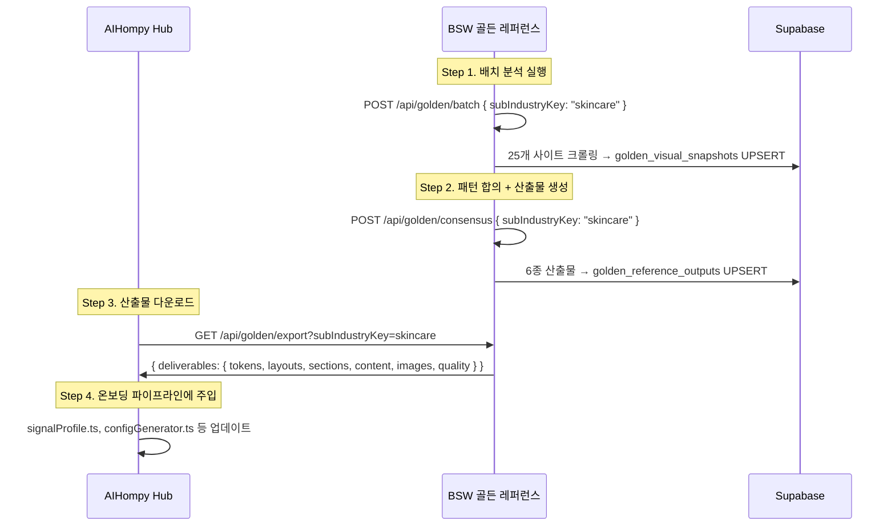

# BSW 골든 레퍼런스 시스템 가이드

> **작성일**: 2026-06-28  
> **대상 독자**: AIHompy Hub 온보딩 파이프라인 팀  
> **BSW 프로덕션 URL**: `https://answerhub.kr`  
> **상태**: Phase 0~3 구현 완료, 프로덕션 배포 완료

---

## 1. 시스템 개요

BSW 골든 레퍼런스 시스템은 **업종별 25개+ 벤치마크 사이트**의 디자인·구조·콘텐츠를 자동 크롤링 → 비주얼 분석 → 통계적 합의(consensus) 계산 → **6종 JSON 산출물**로 정제하는 파이프라인입니다.

```
┌─────────────────────────────────────────────────────────────────┐
│                    BSW Golden Reference Pipeline                │
├─────────────────────────────────────────────────────────────────┤
│                                                                 │
│  reference-sites-registry.ts       5개 추출 모듈                │
│  (업종별 25+ 사이트 목록)          ┌──────────────────────────┐ │
│          ↓                         │ DesignTokenExtractor     │ │
│  WebsiteCrawler.crawl()            │ LayoutStructureAnalyzer  │ │
│  (rawHtml + images + meta)         │ SectionSequenceDetector  │ │
│          ↓                         │ ContentTemplateHarvester │ │
│  ┌───────────────────┐             │ ImageReferenceCataloger  │ │
│  │ CrawledPage[]     │────────────→└──────────────────────────┘ │
│  └───────────────────┘                       ↓                  │
│                                    VisualAnalysisSnapshot        │
│                                    (사이트당 1개, DB 저장)       │
│                                              ↓                  │
│                              PatternConsensusEngine              │
│                              (통계적 합의값 도출)                │
│                                              ↓                  │
│                              GoldenJsonBuilder.buildAll()        │
│                                              ↓                  │
│                              ┌──────────────────────────────┐   │
│                              │ 6종 JSON 산출물               │   │
│                              │ ① tokens  ② layouts          │   │
│                              │ ③ sections ④ content          │   │
│                              │ ⑤ images  ⑥ quality          │   │
│                              └──────────────────────────────┘   │
│                                              ↓                  │
│                              /api/golden/export                  │
│                              (Hub 다운로드 엔드포인트)           │
└─────────────────────────────────────────────────────────────────┘
```

---

## 2. 지원 업종 (SubIndustryKey)

| Key | 한국어명 | 벤치마크 사이트 수 | 상태 |
|-----|---------|-------------------|------|
| `skincare` | 스킨케어/뷰티 | 25개 | ✅ Phase 1 완료 |
| `wedding` | 웨딩 | 25개 | ✅ 등록 완료 |
| `medical_clinic` | 병원/클리닉 | 예정 | 🔲 Phase 2 |
| `restaurant_cafe` | 식당/카페 | 예정 | 🔲 Phase 2 |
| `hotel` | 호텔/숙박 | 예정 | 🔲 Phase 2 |
| `place_brand` | 지역 브랜드 | 예정 | 🔲 Phase 2 |

---

## 3. API 엔드포인트 사양

### 3.1 단일 사이트 분석

**`POST /api/golden/analyze`**

단일 사이트를 크롤링 + 5개 모듈 분석 → DB 저장.

```jsonc
// 요청
{
  "url": "https://sulwhasoo.com",
  "brandName": "설화수",
  "subIndustryKey": "skincare",
  "positioning": "luxury"   // optional: luxury | premium | standard | poor
}
```

```jsonc
// 응답
{
  "ok": true,
  "snapshot": {
    "url": "https://sulwhasoo.com",
    "brand_name": "설화수",
    "positioning": "luxury",
    "design_tokens": { /* DesignTokenSnapshot */ },
    "layout_structure": { /* LayoutStructureSnapshot */ },
    "section_sequence": { /* SectionSequenceSnapshot */ },
    "content_templates": { /* ContentTemplateSnapshot */ },
    "image_references": { /* ImageReferenceSnapshot */ },
    "analyzed_at": "2026-06-28T01:00:00Z"
  }
}
```

**`GET /api/golden/analyze?url=https://sulwhasoo.com&subIndustryKey=skincare`**

기존 분석 결과 조회 (없으면 404).

---

### 3.2 배치 분석

**`POST /api/golden/batch`**

업종 전체 사이트 순차 배치 분석 (Vercel 300초 타임아웃 준수).

```jsonc
// 요청
{
  "subIndustryKey": "skincare"
}
```

```jsonc
// 응답
{
  "ok": true,
  "subIndustryKey": "skincare",
  "totalSites": 25,
  "analyzedCount": 23,
  "failedCount": 2,
  "results": [
    { "url": "https://sulwhasoo.com", "brandName": "설화수", "ok": true },
    { "url": "https://example.com", "brandName": "실패사이트", "ok": false, "error": "timeout" }
  ]
}
```

**`GET /api/golden/batch?subIndustryKey=skincare`**

현재 분석 상태 조회 (분석된 사이트 수, 미분석 사이트 목록).

---

### 3.3 패턴 합의 + 6종 JSON 생성

**`POST /api/golden/consensus`**

분석된 스냅샷들의 패턴 합의를 계산하고, 6종 산출물 JSON을 생성하여 DB에 저장.

```jsonc
// 요청
{
  "subIndustryKey": "skincare"
}
```

```jsonc
// 응답
{
  "ok": true,
  "subIndustryKey": "skincare",
  "sampleCount": 23,
  "generatedAt": "2026-06-28T01:30:00Z",
  "outputs": {
    "tokens": { /* GoldenTokensOutput */ },
    "layouts": { /* GoldenLayoutsOutput */ },
    "sections": { /* GoldenSectionsOutput */ },
    "content": { /* GoldenContentOutput */ },
    "images": { /* GoldenImagesOutput */ },
    "quality": { /* GoldenQualityOutput */ }
  },
  "consensus": {
    "colorClusterCount": 3,
    "topFontPairs": ["Noto Sans KR×Pretendard", ...],
    "primaryRadius": "8px",
    "topSectionTypes": ["hero", "service_grid", "testimonial_carousel", ...]
  }
}
```

**`GET /api/golden/consensus?subIndustryKey=skincare`**

마지막으로 저장된 산출물을 조회.

---

### 3.4 산출물 내보내기 (Hub 연동용)

> [!IMPORTANT]
> **Hub 팀은 이 엔드포인트를 통해 골든 레퍼런스 데이터를 가져갑니다.**

**`GET /api/golden/export`**

| 파라미터 | 타입 | 필수 | 설명 |
|---------|------|------|------|
| `subIndustryKey` | string | ✅ | 업종 키 (e.g., `skincare`) |
| `deliverable` | string | - | 특정 산출물만 (`tokens`, `layouts`, `sections`, `content`, `images`, `quality`) 또는 `all` (기본) |

**전체 번들 다운로드:**
```
GET https://answerhub.kr/api/golden/export?subIndustryKey=skincare
```

**단일 산출물 다운로드:**
```
GET https://answerhub.kr/api/golden/export?subIndustryKey=skincare&deliverable=tokens
```

**응답 형태:**
```jsonc
// deliverable=all (기본)
{
  "subIndustryKey": "skincare",
  "exportedAt": "2026-06-28T01:30:00Z",
  "deliverables": {
    "tokens": { /* GoldenTokensOutput */ },
    "layouts": { /* GoldenLayoutsOutput */ },
    "sections": { /* GoldenSectionsOutput */ },
    "content": { /* GoldenContentOutput */ },
    "images": { /* GoldenImagesOutput */ },
    "quality": { /* GoldenQualityOutput */ }
  }
}

// deliverable=tokens
{
  "subIndustryKey": "skincare",
  "exportedAt": "2026-06-28T01:30:00Z",
  "deliverables": {
    "tokens": { /* GoldenTokensOutput 단일 */ }
  }
}
```

---

## 4. 6종 산출물 상세 스키마

### 4.1 산출물 #1: Design Token Consensus (`tokens`)

> Hub 파이프라인 → `designConfig` 기본값 보정, CSS 변수 주입

```typescript
interface GoldenTokensOutput {
  deliverableType: 'tokens';
  subIndustryKey: SubIndustryKey;
  generatedAt: string;
  sampleCount: number;

  // ── 색상 합의 ──
  colorConsensus: {
    primary:   ColorConsensusEntry;  // 주 색상
    secondary: ColorConsensusEntry;  // 보조 색상
    bg:        ColorConsensusEntry;  // 배경색
    text:      ColorConsensusEntry;  // 본문 텍스트
    accent:    ColorConsensusEntry;  // 강조/CTA
    border:    ColorConsensusEntry;  // 경계선
    sampleCount: number;
  };

  // ── 타이포그래피 합의 ──
  typographyConsensus: {
    topPairs: FontPairConsensus[];  // 빈도순 Top-N 페어링
    consensusPair: {
      headingFamily: string;       // e.g. "Noto Sans KR"
      bodyFamily: string;          // e.g. "Pretendard"
    };
    sampleCount: number;
  };

  // ── 형상(Shape) 합의 ──
  shapeConsensus: {
    modeBorderRadiusPx: number;    // 최빈 border-radius (px)
    modeButtonRadiusPx: number;
    modeCardRadiusPx: number;
    borderRadiusDistribution: Record<string, number>;
  };

  // ── 모션 합의 ──
  motionConsensus: {
    dominantLevel: 'minimal' | 'subtle' | 'expressive';
    avgTransitionMs: number;
    levelDistribution: Record<string, number>;
  };

  // ── 즉시 사용 가능한 CSS 변수 ──
  cssVariables: Record<string, string>;
  // 예: { "color-primary": "#1a2b3c", "font-heading": "Noto Sans KR", ... }
}

// 개별 색상 합의 엔트리
interface ColorConsensusEntry {
  value: string;            // 합의 hex 값 (e.g., "#2d3436")
  frequency: number;        // 해당 색상 사용 사이트 수
  ratio: number;            // 전체 대비 비율 (0~1)
  alternatives: {           // 차순위 후보 (최대 3개)
    value: string;
    frequency: number;
  }[];
}
```

**Hub 사용 예시:**
```typescript
// Hub: signalProfile.ts
const tokens = await fetch('https://answerhub.kr/api/golden/export?subIndustryKey=skincare&deliverable=tokens').then(r => r.json());
const { colorConsensus, cssVariables } = tokens.deliverables.tokens;

// CSS 변수 직접 주입
const designConfig = {
  primaryColor: colorConsensus.primary.value,    // "#2d3436"
  backgroundColor: colorConsensus.bg.value,       // "#fafafa"
  fontHeading: cssVariables['font-heading'],      // "Noto Sans KR"
  fontBody: cssVariables['font-body'],            // "Pretendard"
  borderRadius: `${tokens.deliverables.tokens.shapeConsensus.modeBorderRadiusPx}px`,
};
```

---

### 4.2 산출물 #2: Layout Blueprint Atlas (`layouts`)

> Hub 파이프라인 → Shell 타입, GNB 구성, Footer 레이아웃, Hero 템플릿 보정

```typescript
interface GoldenLayoutsOutput {
  deliverableType: 'layouts';
  subIndustryKey: SubIndustryKey;
  generatedAt: string;
  sampleCount: number;

  // ── GNB 합의 ──
  gnbConsensus: {
    dominantStyle: GnbStyle;      // 'transparent_overlay' | 'minimal_text' | 'classic_bordered'
    avgItemCount: number;          // 평균 메뉴 수 (e.g., 6.2)
    topMenuItems: {
      label: string;               // 정규화된 메뉴 라벨
      frequency: number;
      avgPosition: number;         // 평균 배치 순서
    }[];
    searchRatio: number;           // 검색창 보유 비율
    ctaRatio: number;              // CTA 버튼 보유 비율
    stickyRatio: number;           // 고정 GNB 비율
    sampleCount: number;
  };

  // ── Shell 합의 ──
  shellConsensus: {
    avgMaxWidthPx: number;
    dominantColumnLayout: 'single' | 'two_column' | 'three_column' | 'asymmetric';
    sidebarRatio: number;
  };

  // ── Footer 합의 ──
  footerConsensus: {
    avgColumnCount: number;
    socialLinksRatio: number;
    newsletterRatio: number;
    topLinkGroups: string[];       // e.g., ["고객센터", "회사소개", "이용약관"]
  };

  // ── Hero 합의 ──
  heroConsensus: {
    dominantLayout: 'full_bleed' | 'split' | 'centered' | 'minimal';
    dominantBgType: 'image' | 'video' | 'gradient' | 'solid';
    avgCtaCount: number;
    subtaglineRatio: number;
    avgViewportHeight: number;     // vh 단위 (e.g., 90)
  };
}
```

**Hub 사용 예시:**
```typescript
// Hub: configGenerator.ts
const layouts = goldenRef.layouts;

const defaultGnb = {
  style: layouts.gnbConsensus.dominantStyle,
  menuItems: layouts.gnbConsensus.topMenuItems
    .filter(m => m.frequency >= 0.6)
    .sort((a, b) => a.avgPosition - b.avgPosition)
    .map(m => m.label),
  hasSearch: layouts.gnbConsensus.searchRatio > 0.5,
  hasCta: layouts.gnbConsensus.ctaRatio > 0.5,
};

const defaultHero = {
  layout: layouts.heroConsensus.dominantLayout,
  bgType: layouts.heroConsensus.dominantBgType,
  height: `${layouts.heroConsensus.avgViewportHeight}vh`,
};
```

---

### 4.3 산출물 #3: Section Sequence Canon (`sections`)

> Hub 파이프라인 → `puckConfig` 기본 구성, 홈페이지 섹션 순서, 심리 플로우 보정

```typescript
interface GoldenSectionsOutput {
  deliverableType: 'sections';
  subIndustryKey: SubIndustryKey;
  generatedAt: string;
  sampleCount: number;

  sectionConsensus: {
    // 각 섹션 타입의 출현 빈도 (빈도 내림차순)
    sectionFrequency: {
      type: SectionType;           // 21가지 중 하나
      frequency: number;          // 출현 사이트 수
      ratio: number;              // 전체 대비 비율
      avgPosition: number;        // 평균 배치 순서 (0-based)
      psychologyLayer: PsychologyLayer;
    }[];

    // Top-3 전체 홈페이지 시퀀스 패턴
    topSequences: {
      sequence: SectionType[];
      frequency: number;
    }[];

    // 합의 심리 레이어 순서
    consensusPsychologyFlow: PsychologyLayer[];
    // e.g., ['attention', 'value', 'proof', 'trust', 'action']

    avgSectionCount: number;      // 평균 홈페이지 섹션 수
    sampleCount: number;
  };

  // ── 즉시 사용 가능한 추천 시퀀스 ──
  recommendedHomepageSequence: {
    position: number;              // 배치 순서 (1-based)
    type: SectionType;
    psychologyLayer: PsychologyLayer;
    mandatory: boolean;            // true = 80%+ 사이트에 존재
    reason: string;
  }[];

  // ── 필수 서브페이지 ──
  requiredSubPages: {
    path: string;                  // e.g., "/about", "/services"
    pageRole: string;
    prevalenceRatio: number;
  }[];
}
```

**21가지 SectionType:**

| SectionType | 심리 레이어 | 한국어 설명 |
|-------------|------------|------------|
| `hero` | attention | 메인 비주얼 |
| `trust_strip` | proof | 인증/파트너 배지 스트립 |
| `service_grid` | value | 서비스/시술 그리드 |
| `before_after_gallery` | proof | 시술 전후 갤러리 |
| `testimonial_carousel` | proof | 후기/리뷰 캐러셀 |
| `team_profiles` | trust | 팀/의료진 소개 |
| `faq_grid` | value | FAQ 아코디언 |
| `cta_banner` | action | CTA 배너/예약 유도 |
| `map_contact` | action | 지도/연락처 |
| `stats_band` | proof | 수치 통계 밴드 |
| `video_showcase` | attention | 동영상 쇼케이스 |
| `process_steps` | value | 과정/프로세스 스텝 |
| `brand_philosophy` | trust | 브랜드 철학/스토리 |
| `certification_badges` | trust | 인증/수상 배지 |
| `newsletter_signup` | action | 뉴스레터 구독 |
| `pricing_table` | value | 가격표 |
| `blog_feed` | value | 블로그/뉴스 피드 |
| `product_grid` | value | 제품 그리드 |
| `partner_logos` | proof | 파트너 로고 |
| `timeline` | trust | 타임라인/연혁 |
| `comparison_table` | value | 비교 테이블 |

**6가지 PsychologyLayer:**

| Layer | 역할 | 배치 가이드 |
|-------|------|------------|
| `attention` | 주목 유도 | 페이지 최상단 (Hero) |
| `value` | 가치 전달 | 서비스·기능 소개 영역 |
| `proof` | 사회적 증거 | 후기·통계·인증 영역 |
| `trust` | 신뢰 구축 | 팀·브랜드스토리 영역 |
| `action` | 행동 유도 | CTA·예약·연락처 영역 |
| `neutral` | 중립 | 보조 정보 영역 |

---

### 4.4 산출물 #4: Content Template Pack (`content`)

> Hub 파이프라인 → AI 콘텐츠 생성 few-shot 레퍼런스

```typescript
interface GoldenContentOutput {
  deliverableType: 'content';
  subIndustryKey: SubIndustryKey;
  generatedAt: string;
  sampleCount: number;

  // ── Hero 카피 패턴 ──
  heroCopyConsensus: {
    topHeadlinePatterns: { pattern: string; frequency: number }[];
    // e.g., "당신의 피부에 과학을 더하다" (clinical), "자연의 순수함을 담다" (warm)
    avgWordCountRange: { min: number; max: number };
    subtaglineRatio: number;
  };

  // ── FAQ 패턴 ──
  faqConsensus: {
    topQuestionTypes: {
      type: string;              // e.g., "시술_기간", "부작용", "가격"
      frequency: number;
      exampleQuestion: string;
    }[];
    avgFaqCount: number;
    sourceDistribution: Record<string, number>;
  };

  // ── 신뢰 요소 패턴 ──
  trustElementConsensus: {
    topTypes: {
      type: 'statistic' | 'certification' | 'disclaimer' | 'award';
      frequency: number;
      exampleText: string;       // e.g., "시술 10,000건+", "FDA 승인"
    }[];
    answerFirstRatio: number;
  };

  // ── 콘텐츠 전략 ──
  contentStrategy: {
    consensusPsychologyFlow: PsychologyLayer[];
    mustIncludeElements: string[];    // e.g., ["Hero CTA", "FAQ 5개+", "통계 3개+"]
    mustAvoidPatterns: string[];      // e.g., ["과장 표현", "비교 광고"]
  };
}
```

---

### 4.5 산출물 #5: Image Reference Atlas (`images`)

> Hub 파이프라인 → AI 이미지 프롬프트 보정, 이미지 체크리스트

```typescript
interface GoldenImagesOutput {
  deliverableType: 'images';
  subIndustryKey: SubIndustryKey;
  generatedAt: string;
  sampleCount: number;

  heroImageConsensus: {
    dominantType: ImageType;       // e.g., 'product' or 'hero'
    humanRatio: number;            // 인물 사진 비율
    avgAspectRatio: number | null; // 16:9 = 1.778, 4:3 = 1.333
    topSrcPatterns: string[];      // URL 경로 패턴
  };

  overallImageConsensus: {
    avgTotalImages: number;         // 사이트당 평균 이미지 수
    typeDistribution: Record<ImageType, number>;
    antiPatternPrevalence: {
      issue: 'no-alt' | 'broken-src' | 'too-small';
      ratio: number;
    }[];
  };

  imageChecklist: string[];
  // e.g., ["Hero 이미지 1장 (16:9)", "제품 이미지 6장+", "팀 사진 3장+"]

  minRecommendedImageCount: number;
}
```

**9가지 ImageType:**
`hero` | `product` | `team` | `space_interior` | `before_after` | `logo` | `icon` | `background` | `other`

---

### 4.6 산출물 #6: Quality Benchmark Set (`quality`)

> Hub 파이프라인 → DryRun 채점 기준 보정, A- 등급 임계값

```typescript
interface GoldenQualityOutput {
  deliverableType: 'quality';
  subIndustryKey: SubIndustryKey;
  generatedAt: string;
  sampleCount: number;

  // ── A- 등급 임계값 (P75 기반) ──
  aMinusThresholds: {
    minSectionCount: number;       // 최소 홈페이지 섹션 수
    minFaqCount: number;           // 최소 FAQ 수
    minImageCount: number;         // 최소 이미지 수
    minTrustElements: number;      // 최소 신뢰 요소 수
    heroCtaRequired: boolean;      // Hero CTA 필수 여부
  };

  // ── 필수 / 권장 섹션 ──
  mandatorySections: SectionType[];    // ≥80% 사이트에 존재
  recommendedSections: SectionType[];  // 50~79% 사이트에 존재

  // ── 심리 레이어 완성도 ──
  requiredPsychologyLayers: PsychologyLayer[];
  // ≥60% 사이트에 출현하는 레이어

  // ── 안전 게이트 ──
  safetyGate: 'medical' | 'financial' | 'standard';

  // ── 기대/금지 ──
  expectedLayer: {
    mustInclude: string[];         // e.g., ["의료 면허 표시", "부작용 고지"]
    mustNotDo: string[];           // e.g., ["허위 비교 광고", "과장 수치"]
  };
}
```

---

## 5. Hub 연동 운용 절차

### 5.1 초기 연동 (1회)



### 5.2 갱신 주기

| 갱신 조건 | 방법 |
|----------|------|
| 벤치마크 사이트 변경 | BSW UI → 사이트 추가/제거 → 배치 재분석 → 합의 재생성 |
| 분기별 정기 갱신 | BSW Cron 또는 수동 → 배치 + 합의 재실행 |
| Hub 신규 업종 온보딩 | BSW에 해당 업종 사이트 등록 → 배치 + 합의 → export |

### 5.3 Hub 측 fetch 코드 예시

```typescript
// hub/lib/golden-reference-client.ts

const BSW_API = 'https://answerhub.kr';

export async function fetchGoldenReference(industry: string) {
  const res = await fetch(
    `${BSW_API}/api/golden/export?subIndustryKey=${industry}`
  );
  
  if (!res.ok) {
    throw new Error(`Golden Reference fetch failed: ${res.status}`);
  }
  
  const data = await res.json();
  return data.deliverables;
  // → { tokens, layouts, sections, content, images, quality }
}

// 단일 산출물만 가져오기
export async function fetchGoldenTokens(industry: string) {
  const res = await fetch(
    `${BSW_API}/api/golden/export?subIndustryKey=${industry}&deliverable=tokens`
  );
  const data = await res.json();
  return data.deliverables.tokens;
}
```

---

## 6. DB 스키마

### 6.1 golden_visual_snapshots

```sql
CREATE TABLE golden_visual_snapshots (
  id                UUID PRIMARY KEY DEFAULT gen_random_uuid(),
  sub_industry_key  TEXT NOT NULL,
  url               TEXT NOT NULL,
  brand_name        TEXT NOT NULL,
  positioning       TEXT DEFAULT 'standard',
  design_tokens     JSONB,           -- DesignTokenSnapshot
  layout_structure  JSONB,           -- LayoutStructureSnapshot
  section_sequence  JSONB,           -- SectionSequenceSnapshot
  content_templates JSONB,           -- ContentTemplateSnapshot
  image_references  JSONB,           -- ImageReferenceSnapshot
  vibe_vector       JSONB,
  analyzed_at       TIMESTAMPTZ NOT NULL DEFAULT NOW(),
  analysis_version  TEXT DEFAULT 'v1.0',
  created_at        TIMESTAMPTZ NOT NULL DEFAULT NOW(),
  UNIQUE(sub_industry_key, url)
);
```

### 6.2 golden_reference_outputs

```sql
CREATE TABLE golden_reference_outputs (
  id                 UUID PRIMARY KEY DEFAULT gen_random_uuid(),
  sub_industry_key   TEXT NOT NULL,
  deliverable_type   TEXT NOT NULL,     -- 'tokens'|'layouts'|'sections'|'content'|'images'|'quality'
  output_data        JSONB NOT NULL,    -- 해당 산출물 전체 JSON
  sample_count       INTEGER NOT NULL DEFAULT 0,
  generated_at       TIMESTAMPTZ NOT NULL DEFAULT NOW(),
  UNIQUE(sub_industry_key, deliverable_type)
);
```

---

## 7. 비주얼 추출 모듈 상세

BSW의 5개 추출 모듈은 `CrawledPage` (rawHtml + images + ogMetadata)를 입력으로 받아 각각의 스냅샷을 생성합니다.

| 모듈 | 파일 | 입력 | 출력 | 핵심 기법 |
|------|------|------|------|----------|
| **DesignTokenExtractor** | `lib/golden/design-token-extractor.ts` | rawHtml | DesignTokenSnapshot | CSS 파싱, inline `<style>` + 외부 CSS 3개까지 fetch, rgb/hsl→hex 변환, 폰트 구분(heading/body) |
| **LayoutStructureAnalyzer** | `lib/golden/layout-structure-analyzer.ts` | rawHtml | LayoutStructureSnapshot | `<nav>`/`<header>` GNB 추출, max-width Shell 분류, `<footer>` 소셜/뉴스레터 감지, Hero 타입 감지 |
| **SectionSequenceDetector** | `lib/golden/section-sequence-detector.ts` | rawHtml[] | SectionSequenceSnapshot | class/id/aria-label 키워드 매칭 × 21가지 규칙, 심리 레이어 매핑 |
| **ContentTemplateHarvester** | `lib/golden/content-template-harvester.ts` | rawHtml[] | ContentTemplateSnapshot | H1 + P 추출, JSON-LD FAQ, 신뢰요소(숫자+단위) 패턴, 톤 분류 |
| **ImageReferenceCataloger** | `lib/golden/image-reference-cataloger.ts` | images[] + rawHtml | ImageReferenceSnapshot | 9가지 이미지 타입 분류, og:image Hero, Anti-pattern 감지 |

---

## 8. 합의 엔진 (PatternConsensusEngine)

`lib/golden/pattern-consensus-engine.ts`

25개+ 사이트의 스냅샷에서 **통계적 합의값**을 도출합니다:

| 분석 대상 | 합의 기법 |
|----------|----------|
| 색상 | 6개 semantic 포지션별 hex 빈도수 → Top-1 + 대안 3개 |
| 폰트 | heading×body 페어링 빈도 → Top-N 페어 |
| Shape | border-radius 최빈값 (mode) |
| 모션 | transition 평균 ms, 레벨 분류 (minimal/subtle/expressive) |
| GNB | 메뉴 라벨 정규화 → 빈도순 공통 메뉴, 스타일 최빈 |
| 섹션 | 21가지 SectionType 출현 빈도, 시퀀스 패턴 Top-3, 심리 플로우 |
| 콘텐츠 | Hero 헤드라인 패턴, FAQ 질문 유형, 신뢰 요소 유형 |
| 이미지 | 타입 분포, Hero 이미지 패턴, Anti-pattern 빈도 |

---

## 9. UI 접근 경로

BSW 대시보드에서 직접 골든 레퍼런스를 관리할 수 있습니다:

```
사이드바 → 💎 골든 레퍼런스 [GR]
├── 대시보드     → /golden-reference         (배치 분석 + 합의 실행)
├── 비주얼 분석  → /golden-reference/analysis (사이트별 상세 분석 결과)
└── 산출물 뷰어  → /golden-reference/outputs  (6종 JSON 비주얼 + 다운로드)
```

### 운용 순서

1. **대시보드** → 업종 선택 (e.g., 스킨케어/뷰티) → "🔄 배치 분석 실행" 클릭
2. 진행 표시기 100% 도달 대기 (25개 사이트 × 약 5~10초 = 약 2~4분)
3. "🧪 패턴 합의 + JSON 생성" 클릭 → 6종 산출물 자동 생성
4. **산출물 뷰어** 탭 → 각 산출물 카드 클릭 → JSON 복사 또는 다운로드
5. **Hub 팀**에 `/api/golden/export?subIndustryKey=skincare` URL 전달

---

## 10. 에러 핸들링 & 제한 사항

| 제한 | 값 | 비고 |
|------|-----|------|
| Vercel 함수 타임아웃 | 300초 (Pro 플랜) | 배치 분석 시 `maxDuration = 300` 설정 |
| 외부 CSS fetch 제한 | 최대 3파일 × 100KB | 5초 타임아웃 |
| 배치 사이트 간 지연 | 1초 | rate limiting 준수 |
| 크롤링 실패 사이트 | skip & 로그 | 전체 배치는 중단되지 않음 |
| 합의 최소 샘플 수 | 1개 | 5개 이상 권장 |

### 오류 응답 형태

```jsonc
{
  "error": "subIndustryKey 필수",  // 또는 상세 오류 메시지
  "ok": false
}
```

---

## 11. 향후 로드맵

| Phase | 내용 | 상태 |
|-------|------|------|
| Phase 0~3 | 기반 + 추출 + 합의 + UI | ✅ 완료 |
| Phase 4 | 자동 갱신 Cron (월 1회) | 🔲 예정 |
| Phase 5 | Hub 자동 Pull (웹훅) | 🔲 예정 |
| Phase 6 | 신규 업종 확장 (의료/카페/호텔) | 🔲 예정 |
| Phase 7 | 포지셔닝별 클러스터 분리 (luxury/premium/standard) | 🔲 예정 |
| Phase 8 | AI 기반 골든 레퍼런스 자동 보정 (drift detection) | 🔲 예정 |

---

## 부록 A: 빠른 시작 (Quick Start)

```bash
# 1. BSW 프로덕션에서 skincare 골든 레퍼런스 가져오기
curl "https://bsw-os.vercel.app/api/golden/export?subIndustryKey=skincare" \
  -o skincare_golden_reference.json

# 2. 특정 산출물만 가져오기
curl "https://bsw-os.vercel.app/api/golden/export?subIndustryKey=skincare&deliverable=tokens" \
  -o skincare_golden_tokens.json

# 3. 배치 분석 트리거 (수동)
curl -X POST "https://bsw-os.vercel.app/api/golden/batch" \
  -H "Content-Type: application/json" \
  -d '{"subIndustryKey":"skincare"}'

# 4. 합의 계산 + 6종 생성 트리거
curl -X POST "https://bsw-os.vercel.app/api/golden/consensus" \
  -H "Content-Type: application/json" \
  -d '{"subIndustryKey":"skincare"}'
```

---

## 부록 B: 파일 구조

```
bsw/
├── lib/golden/
│   ├── types.ts                       # 800줄 전역 타입
│   ├── design-token-extractor.ts      # CSS 토큰 추출
│   ├── layout-structure-analyzer.ts   # DOM 레이아웃 분석
│   ├── section-sequence-detector.ts   # 섹션 타입 감지
│   ├── content-template-harvester.ts  # 콘텐츠 수집
│   ├── image-reference-cataloger.ts   # 이미지 분류
│   ├── pattern-consensus-engine.ts    # 통계 합의 엔진
│   ├── golden-json-builder.ts         # 6종 JSON 빌더
│   └── index.ts                       # Barrel export
├── app/api/golden/
│   ├── analyze/route.ts               # 단일 사이트 분석
│   ├── batch/route.ts                 # 배치 분석
│   ├── consensus/route.ts             # 합의 + 산출물 생성
│   └── export/route.ts               # JSON 다운로드
├── app/[locale]/(workspace)/[workspace_slug]/golden-reference/
│   ├── layout.tsx                     # 서브 네비게이션
│   ├── page.tsx                       # 대시보드
│   ├── analysis/page.tsx              # 사이트별 분석 상세
│   └── outputs/page.tsx               # 산출물 뷰어
└── supabase/migrations/
    └── 0018_golden_reference.sql      # DB 스키마
```

---

> [!TIP]
> Hub 팀이 처음 연동할 때는 **부록 A의 curl 명령어**로 JSON을 먼저 다운로드하여 스키마를 확인한 후, `golden-reference-client.ts` 모듈을 구현하는 것을 권장합니다.
