# BSW Metric 통합 가이드북 — Part 1: Foundation & Definitions

> **Version:** v2.0  
> **System:** Brand Semantic Website OS (BSW-OS)  
> **Scope:** TCO-GEO Concept Fidelity Metrics (M1~M13) + Legacy Observatory Metrics + Composite Indices  
> **Last Updated:** 2026-05-28

---

## 목차

1. [메트릭 체계 개요](#1-메트릭-체계-개요)
2. [이론적 기반: Semantic Attractor Dynamics](#2-이론적-기반-semantic-attractor-dynamics)
3. [Legacy Observatory Metrics (1세대)](#3-legacy-observatory-metrics-1세대)
4. [TCO-GEO Concept Fidelity Metrics (2세대, M1~M13)](#4-tco-geo-concept-fidelity-metrics-2세대-m1m13)
5. [Composite Indices (복합 지표)](#5-composite-indices-복합-지표)
6. [MRI 서브-인덱스 체계](#6-mri-서브-인덱스-체계)
7. [측정 인프라: 6-Judge LLM Pipeline](#7-측정-인프라-6-judge-llm-pipeline)
8. [메트릭 간 관계 맵](#8-메트릭-간-관계-맵)

---

## 1. 메트릭 체계 개요

BSW-OS는 **"AI 검색 시대에 브랜드의 핵심 개념이 얼마나 정확하고, 안정적이며, 안전하게 재구성되는가?"** 라는 핵심 질문에 답하기 위해 **3계층 메트릭 아키텍처**를 운영합니다.

```
┌─────────────────────────────────────────────────────────┐
│                    Layer 3: Composite Indices            │
│     BAIR · AITI · KAIVI · AIPR · AEO/GEO Readiness     │
├─────────────────────────────────────────────────────────┤
│              Layer 2: TCO-GEO Metrics (M1~M13)          │
│  Concept Transfer · Fidelity · Distortion · Stability  │
│  Hallucination · Drift · Floor Risk · Policy · Readiness│
├─────────────────────────────────────────────────────────┤
│            Layer 1: Legacy Observatory Metrics           │
│         AAS · OCR · BSF · QTC · GCTR · ARS · SWEL       │
└─────────────────────────────────────────────────────────┘
```

### 1.1 설계 원칙

| 원칙 | 설명 |
|:---|:---|
| **Distribution-First** | LLM 응답을 단일 포인트가 아닌 **확률 분포**로 취급합니다. 반복 관측을 통해 분산, 합의, 드리프트를 측정합니다. |
| **Concept-Centric** | 키워드 매칭이 아닌 **개념 단위(Concept Entity)** 추출 및 정합성을 평가합니다. |
| **Evidence-Bound** | 모든 주장은 Brand SSoT의 **검증된 근거(Evidence)**와 바인딩 여부를 추적합니다. |
| **Safety-First** | 왜곡(Distortion), 환각(Hallucination), 바닥 리스크(Floor Risk)를 별도 차원으로 분리하여 측정합니다. |
| **Proxy-Transparent** | 모든 관측 메트릭에 **프록시 경고문(Proxy Caveat)**을 의무 부착합니다. |

---

## 2. 이론적 기반: Semantic Attractor Dynamics

BSW-OS의 메트릭 체계는 세 가지 이론 레이어 위에 구축됩니다.

### 2.1 Semantic Attractor Dynamics (의미 끌개 역학)

브랜드/고객/트렌드/거래의 의미를 **끌개(Attractor)**, **공명(Resonance)**, **소멸(Cancellation)**, **경계(Boundary)**, **드리프트(Drift)**, **상태 전이(State Transition)**로 해석합니다.

```
                    ┌─── Resonance Zone ───┐
                    │                       │
     Boundary ◄─── │   Brand Attractor    │ ───► Drift Direction
     (Suppression)  │   (Core Concepts)    │     (M8 measures)
                    │                       │
                    └─── Cancellation ─────┘
                          (Distortion)
```

- **끌개 안정성 (M7)**: 반복 관측 시 동일 질문에 대해 핵심 개념이 얼마나 일관되게 재현되는가
- **공명**: 브랜드 SSoT 개념이 AI 응답에서 강화되는 정도
- **소멸/왜곡**: 개념이 변형, 약화, 또는 경쟁사 개념으로 대체되는 정도 (M4)
- **경계 억제**: 금지 표현(Forbidden Expression)이 성공적으로 차단되는 정도

### 2.2 Tensor Concept Ontology (TCO)

단어와 주장을 **개념 엔티티(Concept Entity)**, **컨텍스트 텐서(Context Tensor)**, **개념 영역(Concept Region)**, **관계 연산자(Relation Operator)**, **근거(Evidence)**, **행동 정책(Action Policy)**으로 정규화합니다.

| TCO 요소 | BSW-OS 구현체 | 측정 연관 메트릭 |
|:---|:---|:---|
| Concept Entity | `brand_strategic_truths`, `brand_operational_truths` | M1, M3, M5 |
| Evidence Binding | `brand_truth_evidence` → `verification_status` | M2 |
| Forbidden Expression | `concept_boundaries` | M4, M10 |
| Relation Operator | `extracted_relations` (Judge 1 출력) | M7, M11 |
| Action Policy | `policy_judgments` (Judge 6 출력) | M10 |

### 2.3 Probabilistic Eval Harness (확률적 평가 장치)

LLM 출력을 분포로 취급하며, 반복 실행의 **분산(Variance)**, **드리프트(Drift)**, **합의(Consensus)**, **바닥 리스크(Floor Risk)**를 측정합니다.

---

## 3. Legacy Observatory Metrics (1세대)

> **구현 위치**: `app/actions/observatory.ts` → `computeMetricSnapshot()`  
> **데이터 소스**: `probe_runs` + `response_judgments` 테이블

1세대 메트릭은 키워드 매칭 기반의 빠른 관측 지표로, Probe Panel 관측 완료 시 자동 계산됩니다.

---

### 3.1 AAS — AI Answer Share (AI 응답 점유율)

| 항목 | 내용 |
|:---|:---|
| **정의** | Probe 질문 응답 중 브랜드 키워드가 언급된 비율 (%) |
| **수식** | `AAS = (브랜드 키워드 포함 응답 수 / 전체 Probe 응답 수) × 100` |
| **범위** | 0 ~ 100 |
| **측정 방법** | `raw_response_text`에서 브랜드명 substring 매칭 (case-insensitive) |
| **의의** | AI 검색 결과에서 브랜드의 기본적인 **존재 여부**를 확인하는 1차 필터. GEO/AEO 최적화의 출발점. |
| **한계** | 단순 키워드 매칭이므로 동음이의어, 부분 매칭 오류 가능. TCO-GEO M1(Concept Transfer Rate)이 이를 정밀화. |

**사례 예시**:
- PureBarrier 스킨케어: Probe 50문항 중 35문항에서 "PureBarrier" 언급 → AAS = 70%
- 의미: AI 검색 영역의 70%에서 브랜드가 노출되고 있음

---

### 3.2 OCR — Official Citation Rate (공식 인용률)

| 항목 | 내용 |
|:---|:---|
| **정의** | AI 응답에서 브랜드 공식 소스(URL, 문서)가 인용된 비율 (%) |
| **수식** | `OCR = (공식 인용 포함 응답 수 / 전체 응답 수) × 100` |
| **범위** | 0 ~ 100 |
| **측정 방법** | `response_judgments.is_citation_found` 필드 집계 |
| **의의** | AI가 브랜드 정보를 **공식 출처에서 가져오는지** 판별. 높은 OCR = 브랜드 웹사이트가 AI의 신뢰 소스로 인정됨. |
| **TCO-GEO 대응** | M2 (Citation-Backed Rate)가 개념 단위로 정밀화 |

**사례 예시**:
- OCR 30% → 응답 10건 중 3건만 공식 URL 인용 → Answer Card 배포로 인용률 개선 필요

---

### 3.3 BSF — Brand Semantic Fidelity (브랜드 의미 충실도)

| 항목 | 내용 |
|:---|:---|
| **정의** | AI 응답이 브랜드의 원래 의미를 얼마나 정확하게 전달하는지의 평균 점수 |
| **수식** | `BSF = Σ(각 응답의 brand_semantic_fidelity_score) / 판정 건수` |
| **범위** | 0 ~ 100 |
| **측정 방법** | `response_judgments.brand_semantic_fidelity_score` 평균 |
| **의의** | 키워드 매칭(AAS) 이상의 **의미적 정확성**을 측정. "언급은 되지만 왜곡된" 케이스를 포착. |
| **TCO-GEO 대응** | M3 (Brand Concept Fidelity)가 개념 단위 LLM Judge로 정밀화 |

---

### 3.4 QTC — Question Territory Coverage (질문 영역 커버리지)

| 항목 | 내용 |
|:---|:---|
| **정의** | AI 응답이 질문의 핵심 의도 영역을 적절히 다루고 있는 비율 (%) |
| **수식** | `QTC = (영역 커버 응답 수 / 전체 응답 수) × 100` |
| **범위** | 0 ~ 100 |
| **측정 방법** | `response_judgments.question_territory_covered` 불리언 집계 |
| **의의** | 브랜드가 **전략적 질문 영역**을 AI 응답에서 점유하고 있는지 판별. QIS 시스템과 연계하여 Question Capital 효과를 측정. |

**사례 예시**:
- 웨딩홀 도메인: "웨딩홀 패키지 비교" 관련 10문항 중 8문항에서 브랜드가 비교 영역 커버 → QTC = 80%

---

### 3.5 GCTR — GEO Concept Transfer Rate (GEO 개념 전달률)

| 항목 | 내용 |
|:---|:---|
| **정의** | AI 응답에서 브랜드의 핵심 GEO 개념이 성공적으로 전달된 비율 (%) |
| **수식** | `GCTR = (GEO 개념 전달 성공 응답 수 / 전체 응답 수) × 100` |
| **범위** | 0 ~ 100 |
| **측정 방법** | `response_judgments.geo_concept_transferred` 불리언 집계 |
| **의의** | Generative Engine에서 브랜드 핵심 개념의 **구조적 전달 성공률**을 측정. |
| **TCO-GEO 대응** | M1 (Concept Transfer Rate)이 개념별 정밀도·재현율로 정밀화 |

---

### 3.6 ARS — AEO Readiness Score (AEO 준비 점수)

| 항목 | 내용 |
|:---|:---|
| **정의** | 1세대 메트릭의 가중 복합 점수. 브랜드의 AEO 최적화 종합 준비도. |
| **수식** | `ARS = AAS×0.2 + OCR×0.2 + BSF×0.3 + QTC×0.1 + GCTR×0.2` |
| **범위** | 0 ~ 100 |
| **가중치 근거** | BSF(의미 충실도)에 가장 큰 가중치. 단순 노출보다 정확한 의미 전달이 중요. |
| **의의** | **1세대 복합 점수**로서, S-MRI 및 BAIR의 입력값으로 활용됨. |

**ARS 가중치 구조**:
```
ARS = ┌─ AAS × 0.20 ──── AI 존재감
      ├─ OCR × 0.20 ──── 공식 인용
      ├─ BSF × 0.30 ──── 의미 충실도 (최대 가중치)
      ├─ QTC × 0.10 ──── 영역 커버리지
      └─ GCTR × 0.20 ─── 개념 전달률
```

---

### 3.7 SWEL — Semantic Website Exposure Lift (시맨틱 웹사이트 노출 증가율)

| 항목 | 내용 |
|:---|:---|
| **정의** | 시맨틱 웹사이트 배포 전후 AI 노출의 변화율 |
| **수식** | `SWEL = (배포 후 AAS / 배포 전 AAS)` |
| **범위** | 0.0 ~ ∞ (1.0 = 변화 없음, >1.0 = 증가) |
| **의의** | 시맨틱 웹사이트 최적화의 **ROI를 직접 증명**하는 전후 비교 지표 |

---

## 4. TCO-GEO Concept Fidelity Metrics (2세대, M1~M13)

> **구현 위치**: `lib/metrics/concept-fidelity-aggregator.ts`  
> **데이터 소스**: 6-Judge LLM Pipeline 출력 → `concept_extraction_results`, `fidelity_judgments`, `distortion_judgments`, `hallucination_judgments`, `risk_judgments`, `policy_judgments`

2세대 메트릭은 **6종 LLM Judge Pipeline**을 통해 개념 단위의 정밀 측정을 수행합니다.

---

### 4.1 M1: Concept Transfer Rate (개념 전달률)

| 항목 | 내용 |
|:---|:---|
| **정의** | Brand SSoT에 정의된 핵심 개념이 AI 응답에 정확하게 재현된 평균 비율 |
| **수식** | `M1 = Σ(각 질문별 present_concepts / total_concepts) / 질문 수` |
| **범위** | 0.0 ~ 1.0 |
| **데이터 소스** | Judge 1 (ConceptExtractorJudge) → `extracted_concepts[].present`, `accuracy` |
| **기본값** | 0.80 (데이터 부족 시) |

**측정 프로세스**:
1. ConceptExtractorJudge가 AI 응답에서 개념 추출
2. 각 추출된 개념의 `present` (존재 여부) + `accuracy` (정확도) 평가
3. 질문별 가중 평균 산출 후 전체 평균

**사례 예시**:
```
질문: "민감성 피부에 좋은 레티놀 사용법은?"
Brand SSoT 핵심 개념: [레티놀 농도, 사용 빈도, 민감성 테스트, 보습 병행]

AI 응답 평가:
  - 레티놀 농도 (present=true, accuracy=0.95) ✓
  - 사용 빈도 (present=true, accuracy=0.80) ✓
  - 민감성 테스트 (present=false) ✗
  - 보습 병행 (present=true, accuracy=0.90) ✓

질문별 M1 = (0.95 + 0.80 + 0 + 0.90) / 4 = 0.6625
```

**비즈니스 해석**:
- M1 ≥ 0.85 → **우수**: 대부분의 핵심 개념이 AI에 의해 정확히 재현됨
- M1 0.60~0.85 → **개선 필요**: Answer Card 보강으로 누락 개념 보완 필요
- M1 < 0.60 → **위험**: 브랜드 SSoT와 AI 응답 간 심각한 갭 존재

---

### 4.2 M2: Citation-Backed Rate (인용 검증률)

| 항목 | 내용 |
|:---|:---|
| **정의** | AI 응답에 존재하는 개념 중 공식 근거(Evidence)에 바인딩된 비율 |
| **수식** | `M2 = Σ(evidence_bound 개념 수) / Σ(present 개념 수)` |
| **범위** | 0.0 ~ 1.0 |
| **데이터 소스** | Judge 1 → `extracted_concepts[].evidence_bound` |
| **기본값** | 0.85 |
| **Legacy 대응** | OCR의 개념 단위 정밀화 버전 |

**핵심 차이점 (OCR vs M2)**:

| 비교 축 | OCR (1세대) | M2 (2세대) |
|:---|:---|:---|
| 단위 | 응답 전체 | 개별 개념 |
| 판정 방식 | URL 존재 여부 | 개념-근거 바인딩 |
| 정밀도 | 응답에 하나라도 인용 → True | 각 개념별 독립 평가 |

**비즈니스 응용**:
- M2가 낮은 개념 식별 → 해당 개념에 대한 Brand Truth Evidence 보강
- BAIR 계산 시 OCR을 M2로 **자동 업그레이드** (snapshot 존재 시)

---

### 4.3 M3: Brand Concept Fidelity (브랜드 개념 충실도)

| 항목 | 내용 |
|:---|:---|
| **정의** | AI 응답이 브랜드 SSoT의 원래 의미를 얼마나 충실하게 재현하는지의 종합 점수 |
| **수식** | `M3 = Σ(fidelity_judgments.brand_concept_fidelity) / 판정 건수` |
| **범위** | 0.0 ~ 1.0 |
| **데이터 소스** | Judge 2 (FidelityJudge) → `brand_concept_fidelity` |
| **기본값** | 0.82 |
| **Legacy 대응** | BSF의 LLM Judge 기반 정밀화. BAIR의 BSF를 BCF로 업그레이드. |

**측정 차원**:
- **정확성**: 개념의 사실적 정확도
- **완전성**: 핵심 속성이 빠짐없이 전달되었는지
- **맥락 적절성**: 질문 의도에 맞는 맥락으로 전달되었는지
- **톤 정합성**: 브랜드 Vibe Spec과의 일치도

**비즈니스 해석**:
- M3 ≥ 0.85 → 브랜드 메시지가 AI를 통해 **충실하게 전달**됨
- M3 < 0.70 → AI가 브랜드 메시지를 **재해석/변형**하고 있음 → Vibe Spec 조정 필요

---

### 4.4 M4: Concept Distortion Rate (개념 왜곡률)

| 항목 | 내용 |
|:---|:---|
| **정의** | AI 응답에서 브랜드 개념이 과장, 축소, 또는 잘못 분류된 비율 |
| **수식** | `M4 = Σ(distortion_judgments.concept_distortion_rate) / 판정 건수` |
| **범위** | 0.0 ~ 1.0 (낮을수록 좋음) |
| **데이터 소스** | Judge 3 (DistortionJudge) → `concept_distortion_rate`, `distortions[]` |
| **기본값** | 0.05 |

**왜곡 유형 분류**:

| 왜곡 유형 | 설명 | 예시 |
|:---|:---|:---|
| `exaggeration` | 효과/성능 과대 표현 | "99% 효과" → "100% 완벽한 효과" |
| `minimization` | 핵심 특성 축소 | "임상 검증 성분" → "일반 보습 성분" |
| `misclassification` | 카테고리 오분류 | "의약외품" → "화장품" |
| `competitor_merge` | 경쟁사 개념과 혼합 | 자사 특허 성분이 경쟁사 제품에 귀속 |

**AI Brand MRI Report 출력 예시**:
```markdown
- [exaggeration] Concept `retinol_concentration` (Severity: 4/5)
  * Response expression: "세계 최초 최고 농도 레티놀"
  * Correct definition: "0.1% 저자극 레티놀 (국내 최초 저자극 인증)"
  * Reason: 근거 없는 '세계 최초', '최고 농도' 수식어 추가
```

---

### 4.5 M5: Missing Concept Gap Count (누락 개념 갭 수)

| 항목 | 내용 |
|:---|:---|
| **정의** | Recall Rate가 임계값(80%) 미만인 핵심 개념의 개수 |
| **수식** | `M5 = Count(concepts where recall_rate < 0.8)` |
| **범위** | 0 ~ N (정수, 낮을수록 좋음) |
| **임계값** | recall_rate < 0.80 |
| **심각도 분류** | `critical_gap` (recall < 0.4) / `moderate_gap` (0.4 ≤ recall < 0.8) |

**Gap 데이터 구조** (DB: `missing_concept_gaps`):

| 필드 | 설명 |
|:---|:---|
| `concept_id` | 누락된 개념 ID |
| `concept_label` | 개념 라벨 |
| `recall_rate` | 전체 질문 대비 재현률 |
| `threshold` | 판정 임계값 (0.80) |
| `importance` | `critical` / `important` |
| `gap_severity` | `critical_gap` / `moderate_gap` |
| `suggested_action` | 자동 생성된 개선 제안 |

**비즈니스 응용**:
- M5 개념 목록 → **Answer Card 백로그 자동 생성**
- Critical Gap 개념 → Fix-It 우선 패치 대상

---

### 4.6 M6: Hallucinated Concept Rate (환각 개념률)

| 항목 | 내용 |
|:---|:---|
| **정의** | AI가 Brand SSoT에 없는 개념을 마치 사실인 것처럼 생성한 비율 |
| **수식** | `M6 = Σ(hallucination_judgments.hallucinated_concept_rate) / 판정 건수` |
| **범위** | 0.0 ~ 1.0 (낮을수록 좋음) |
| **데이터 소스** | Judge 4 (HallucinationJudge) → `hallucinated_concept_rate`, `claims[]` |
| **기본값** | 0.03 |

**환각 유형 분류**:

| 유형 | 위험도 | 예시 |
|:---|:---|:---|
| `unsupported_claim` | 높음 | "FDA 승인 성분" (실제 미승인) |
| `fabricated_feature` | 높음 | "AI 맞춤 배합" (해당 기능 없음) |
| `false_association` | 중간 | "유명 피부과 전문의 추천" (추천 사실 없음) |
| `outdated_info` | 낮음 | 단종된 제품을 현행 제품으로 소개 |

**YMYL 도메인 특별 주의**:
- 의료, 법률, 금융 분야에서 환각률 > 5%는 **즉각 대응** 필요
- Floor Risk (M9)와 연계하여 법적 리스크 평가에 활용

---

### 4.7 M7: Attractor Stability (끌개 안정성)

| 항목 | 내용 |
|:---|:---|
| **정의** | 동일 질문을 반복 관측했을 때, 핵심 개념 구조가 일관되게 재현되는 정도 |
| **수식** | `M7 = 0.40×RecallConsistency + 0.20×RankStability + 0.20×RelationStability + 0.20×BoundarySuppression` |
| **범위** | 0.0 ~ 1.0 |
| **데이터 소스** | `AttractorStabilityCalculator.computeMetrics()` |
| **기본값** | 0.88 (단일 실행 시 1.0) |

**4개 하위 구성요소**:

```
M7 Attractor Stability
  ├── 40% Recall Consistency
  │     = 1 - 4 × avg(p × (1-p))  // Bernoulli 분산 기반
  ├── 20% Rank Stability
  │     = avg(1 / (1 + rank_variance))  // 순위 변동 안정성
  ├── 20% Relation Stability
  │     = avg(1 - 4 × p(1-p))  // 관계 재현 일관성
  └── 20% Boundary Suppression
        = 0.95 (기본값)  // 금지 표현 억제율
```

**해석 가이드**:
- M7 ≥ 0.90 → **매우 안정**: 브랜드 의미가 AI 응답에서 강한 끌개를 형성
- M7 0.70~0.90 → **보통**: 일부 개념의 출현/소멸 변동 존재
- M7 < 0.70 → **불안정**: AI 응답의 개념 구성이 실행마다 크게 달라짐

---

### 4.8 M8: Drift Score (드리프트 점수)

| 항목 | 내용 |
|:---|:---|
| **정의** | Baseline 대비 Intervention 조건에서 개념 리콜 분포의 변화량 |
| **수식** | `M8 = 1 - cosine_similarity(baseline_dist, current_dist)` (Cosine Distance) |
| **범위** | 0.0 ~ 1.0 (0 = 변화 없음, 1 = 완전 변화) |
| **대안 방법** | L1 Normalized Manhattan Distance |
| **방향성** | `positive` (개선) / `negative` (악화) / `neutral` |
| **기본값** | 0.0 (baseline 조건에서) |

**측정 로직** (`DriftCalculator`):
```typescript
// 개념별 recall_rate를 벡터화
vecA = [concept1_recall_baseline, concept2_recall_baseline, ...]
vecB = [concept1_recall_current, concept2_recall_current, ...]

// Cosine Distance
drift = 1 - (dotProduct(A, B) / (norm(A) × norm(B)))

// 방향 판정
direction = sum(B) - sum(A) > 0.02 ? 'positive' : (< -0.02 ? 'negative' : 'neutral')
```

**비즈니스 응용**:
- **Baseline → Intervention 실험**에서 M8이 positive drift이면 개선 효과 입증
- Monthly Monitoring에서 M8 negative drift 감지 시 **자동 알림** 트리거

---

### 4.9 M9: Floor Risk (바닥 리스크)

| 항목 | 내용 |
|:---|:---|
| **정의** | 상위 10% 최악 응답의 평균 리스크 점수. Worst-case 대비 안전성 지표. |
| **수식** | `M9 = avg(top 10% highest risk_score values)` |
| **범위** | 0.0 ~ 1.0 (낮을수록 안전) |
| **데이터 소스** | Judge 5 (RiskJudge) → `risk_score` |
| **기본값** | 0.05 |

**측정 로직**:
```typescript
const sortedRisks = risks.map(r => r.risk_score).sort(desc);
const top10Count = Math.max(1, Math.ceil(sortedRisks.length * 0.1));
M9 = avg(sortedRisks.slice(0, top10Count));
```

**리스크 평가 차원**:
- YMYL 위반 (의료/법률/금융 관련 미검증 주장)
- 다크 패턴 (구매 유도, 긴급성 조작)
- 규제 위반 가능성 (광고법, 소비자보호법)

**비즈니스 해석**:
- M9 ≤ 0.10 → **안전**: 최악 응답도 수용 가능 범위
- M9 0.10~0.30 → **주의**: 일부 고위험 응답에 대한 대응 필요
- M9 > 0.30 → **위험**: 법적/규제 리스크 즉시 대응 필요

---

### 4.10 M10: Policy Alignment (정책 정합성)

| 항목 | 내용 |
|:---|:---|
| **정의** | AI 응답이 브랜드의 톤, CTA 형식, 안전 요구사항 등 정책을 준수하는 정도 |
| **수식** | `M10 = Σ(policy_judgments.policy_alignment) / 판정 건수` |
| **범위** | 0.0 ~ 1.0 |
| **데이터 소스** | Judge 6 (PolicyJudge) → `policy_alignment`, `violations[]` |
| **기본값** | 0.90 |

**정책 위반 유형**:

| 정책 | 설명 | 심각도 |
|:---|:---|:---|
| `tone_mismatch` | Vibe Spec과 불일치하는 톤 | 2~3/5 |
| `unauthorized_cta` | 허가되지 않은 CTA 포함 | 3~4/5 |
| `safety_violation` | YMYL 안전 규정 위반 | 4~5/5 |
| `boundary_breach` | 금지 표현 사용 | 5/5 |

---

### 4.11 M11: Consensus Score (합의 점수)

| 항목 | 내용 |
|:---|:---|
| **정의** | 반복 관측 시 응답 간 개념 집합의 유사도 (Jaccard Similarity 평균) |
| **수식** | `M11 = avg(Jaccard(run_i, run_j)) for all pairs (i,j)` |
| **범위** | 0.0 ~ 1.0 |
| **데이터 소스** | `AttractorStabilityCalculator` |
| **기본값** | 0.90 (단일 실행 시 1.0) |

**Jaccard Similarity 계산**:
```
Jaccard(A, B) = |A ∩ B| / |A ∪ B|

여기서 A, B = 각 실행에서 present=true인 개념 ID 집합
```

**M11 vs M7 차이**:
- M11은 **개념 집합의 구성 유사도**만 측정 (어떤 개념이 나타나는가)
- M7은 **구성 + 순위 + 관계 + 경계**를 종합적으로 측정

---

### 4.12 M12: Variance Score (분산 점수)

| 항목 | 내용 |
|:---|:---|
| **정의** | 반복 관측 시 개별 개념의 출현/소멸 분산 총합 |
| **수식** | `M12 = Σ(p_c × (1 - p_c))` for each concept c |
| **범위** | 0.0 ~ ∞ (낮을수록 안정) |
| **데이터 소스** | `AttractorStabilityCalculator` |
| **기본값** | 0.05 (단일 실행 시 0.0) |

**해석**:
- 각 개념 c의 recall probability `p_c`에 대한 Bernoulli 분산 `p(1-p)` 합산
- p=0 또는 p=1 → 분산 0 (항상 나타나거나 항상 안 나타남 = 안정)
- p=0.5 → 분산 0.25 (최대 불확실성)

---

### 4.13 M13: AEO/GEO Readiness Score (AEO/GEO 준비도 점수)

| 항목 | 내용 |
|:---|:---|
| **정의** | TCO-GEO 메트릭을 가중 결합한 최종 복합 준비도 점수 |
| **범위** | 0.0 ~ 1.0 |
| **등급** | A (≥0.85) / B (≥0.70) / C (≥0.55) / D (≥0.40) / F (<0.40) |

**가중 수식**:
```
M13 = 0.15 × SSoT_Completeness       (Brand SSoT 완성도)
    + 0.15 × Answer_Coverage          (Answer Card 커버리지)
    + 0.10 × M2_Citation_Backed       (인용 검증률)
    + 0.10 × Technical_Structure      (기술적 구조 점수)
    + 0.15 × M1_Concept_Transfer      (개념 전달률)
    + 0.15 × M3_Brand_Fidelity        (브랜드 충실도)
    + 0.10 × M10_Policy_Alignment     (정책 정합성)
    + 0.10 × (1.0 - M9_Floor_Risk)    (안전성)
```

**등급 체계**:

| 등급 | 범위 | 해석 |
|:---|:---|:---|
| **A** | ≥ 85% | 우수 — AI 검색 답변 영역에서 전략적 우위 확보 |
| **B** | 70~84% | 양호 — 대부분의 핵심 개념이 안정적으로 전달됨 |
| **C** | 55~69% | 개선 필요 — 주요 갭과 리스크가 존재 |
| **D** | 40~54% | 미흡 — 구조적 개선 없이 AEO/GEO 효과 기대 어려움 |
| **F** | < 40% | 실패 — Brand SSoT부터 재구축 필요 |

---

## 5. Composite Indices (복합 지표)

### 5.1 BAIR — Brand AI Reputation Index (브랜드 AI 평판 지수)

> **구현 위치**: `lib/sbs-index/bair.ts` → `BairEngine.computeBAIR()`

| 항목 | 내용 |
|:---|:---|
| **정의** | 브랜드의 AI 검색 환경 내 종합 평판 점수 |
| **수식** | `BAIR = BSF × AAS × (1 + OCR) × SWEL` |
| **범위** | 0 ~ ∞ (상대적 점수) |

**TCO-GEO 통합 업그레이드**:
- `concept_fidelity_snapshots` 존재 시:
  - BSF → **BCF (M3 × 100)** 자동 교체
  - OCR → **Citation-Backed Rate (M2)** 자동 교체

```typescript
// 자동 업그레이드 로직 (bair.ts L94-L103)
if (latestSnapshot && latestSnapshot.length > 0) {
  bsf = Math.round(Number(snap.brand_concept_fidelity) * 100); // BCF
  ocr = Number(snap.citation_backed_rate);                       // M2
}
```

---

### 5.2 AITI — AI Trust Index (AI 신뢰 지수)

> **구현 위치**: `lib/sbs-index/bair.ts` → `BairEngine.computeAITI()`

| 항목 | 내용 |
|:---|:---|
| **정의** | 브랜드의 AI 응답 신뢰도 종합 점수 |
| **수식** | `AITI = (Evidence Match Rate × 100) - (Unsafe Wording Count × 5)` |
| **범위** | 0 ~ 100 |
| **데이터 소스** | `brand_truth_evidence.verification_status` + `unsafe_wording_findings` |

---

### 5.3 AIPR — AI Power Ranking (AI 파워 랭킹)

> **구현 위치**: `lib/sbs-index/aipr.ts` → `AiprEngine.computeAIPR()`

| 항목 | 내용 |
|:---|:---|
| **정의** | 산업별 경쟁사 대비 브랜드의 AI 검색 순위 |
| **수식** | 각 브랜드별 BAIR 점수 → 내림차순 정렬 |
| **출력** | `[{rank, brand, bairScore, details}]` |

---

### 5.4 KAIVI — Korea AI Visibility Index (한국 AI 가시성 지수)

> **구현 위치**: `lib/sbs-index/kaivi.ts` → `KaiviEngine.computeKAIVI()`

| 항목 | 내용 |
|:---|:---|
| **정의** | 전 산업 평균 AI 가시성 종합 지수 |
| **수식** | `KAIVI = Avg(산업별 Top BAIR) × Avg(MRI)` |
| **범위** | 0 ~ 100 |
| **MRI** | Meaning Readiness Index = 승인된 Brand Truth 비율 |

---

## 6. MRI 서브-인덱스 체계

> **구현 위치**: `app/actions/observatory.ts` → `computeDomainIndexSnapshot()`

Domain Index Snapshot은 **6개 MRI 서브-인덱스**를 동적으로 계산합니다.

| MRI 서브-인덱스 | 정의 | 수식/데이터 소스 |
|:---|:---|:---|
| **OPS-MRI** | 운영 의미 준비도 | `avg(delta_severity) + avg(vibe_MSA)` — Truth Delta + Vibe 진단 기반 |
| **B-MRI** | 브랜드 의미 준비도 | `computeBMRI(AAS, OCR, BSF, QTC, GCTR, ARS, competitorAAS, penalties)` |
| **D-MRI** | 데이터 의미 준비도 | `computeDMRI(workspaceId)` — 데이터 완성도/품질 기반 |
| **P-MRI** | 페르소나 의미 준비도 | `(미완료 Persona Eval 수 / 전체) × 100` |
| **V-MRI** | 바이브 의미 준비도 | `100 - avg(VPA)` — Vibe Alignment 부족분 |
| **S-MRI** | 시맨틱 의미 준비도 | `ARS×0.4 + BSF×0.3 + QTC×0.3` |

---

## 7. 측정 인프라: 6-Judge LLM Pipeline

> **구현 위치**: `lib/judges/judge-pipeline.ts` → `JudgePipeline`

### 7.1 파이프라인 아키텍처

```
raw_response_text
       │
       ▼
┌──────────────────┐
│ Judge 1: Concept │ ──── concept_extraction_results
│   Extractor      │       ├── extracted_concepts[]
│                  │       └── extracted_relations[]
└──────┬───────────┘
       │ (upstream concepts)
       ├──────────────────────────────┐
       │              │               │
       ▼              ▼               ▼
┌────────────┐ ┌─────────────┐ ┌───────────────┐
│ Judge 2:   │ │ Judge 3:    │ │ Judge 4:      │
│ Fidelity   │ │ Distortion  │ │ Hallucination │
└─────┬──────┘ └──────┬──────┘ └───────┬───────┘
      │               │               │
      ▼               ▼               ▼
 fidelity_       distortion_     hallucination_
 judgments       judgments        judgments

       │
       ├──── raw_response_text (직접)
       │
       ▼              ▼
┌────────────┐ ┌────────────┐
│ Judge 5:   │ │ Judge 6:   │
│ Risk       │ │ Policy     │
└─────┬──────┘ └──────┬─────┘
      │               │
      ▼               ▼
 risk_judgments   policy_judgments
```

### 7.2 Judge별 역할 요약

| Judge | 역할 | 입력 | 출력 | 연관 메트릭 |
|:---|:---|:---|:---|:---|
| **1. ConceptExtractor** | 응답에서 개념 추출 및 SSoT 대조 | response + SSoT | concepts[], relations[] | M1, M2, M5, M7, M8 |
| **2. Fidelity** | 개념 충실도 평가 | concepts + SSoT | brand_concept_fidelity | M3 |
| **3. Distortion** | 왜곡 탐지 및 분류 | concepts + SSoT | distortion_rate, distortions[] | M4 |
| **4. Hallucination** | 환각 탐지 및 분류 | concepts + SSoT | hallucination_rate, claims[] | M6 |
| **5. Risk** | 응답 리스크 평가 | response + SSoT | risk_score | M9 |
| **6. Policy** | 정책 준수 평가 | response + SSoT | policy_alignment, violations[] | M10 |

### 7.3 파이프라인 실행 모드

| 모드 | 설명 | 호출 경로 |
|:---|:---|:---|
| **단일 Probe Run** | 1개 질문 응답 평가 | `pipeline.runForProbeRun(workspaceId, probeRunId)` |
| **Observation Run 전체** | 관측 실행 내 모든 질문 순차 평가 | `pipeline.runForObservationRun(workspaceId, runId, onProgress)` |
| **Repeated Runner** | 동일 질문 N회 반복 실행 (M7/M11/M12용) | `RepeatedRunner.run()` |

---

## 8. 메트릭 간 관계 맵

```mermaid
graph TB
    subgraph "Layer 1: Legacy"
        AAS["AAS<br/>AI Answer Share"]
        OCR_L["OCR<br/>Official Citation Rate"]
        BSF_L["BSF<br/>Brand Semantic Fidelity"]
        QTC["QTC<br/>Question Territory Coverage"]
        GCTR["GCTR<br/>GEO Concept Transfer Rate"]
        ARS["ARS<br/>AEO Readiness Score"]
        SWEL["SWEL<br/>Exposure Lift"]
    end

    subgraph "Layer 2: TCO-GEO"
        M1["M1: Concept Transfer Rate"]
        M2["M2: Citation-Backed Rate"]
        M3["M3: Brand Concept Fidelity"]
        M4["M4: Distortion Rate"]
        M5["M5: Missing Concept Gaps"]
        M6["M6: Hallucination Rate"]
        M7["M7: Attractor Stability"]
        M8["M8: Drift Score"]
        M9["M9: Floor Risk"]
        M10["M10: Policy Alignment"]
        M11["M11: Consensus Score"]
        M12["M12: Variance Score"]
        M13["M13: AEO/GEO Readiness"]
    end

    subgraph "Layer 3: Composite"
        BAIR["BAIR<br/>Brand AI Reputation Index"]
        AITI["AITI<br/>AI Trust Index"]
        AIPR["AIPR<br/>AI Power Ranking"]
        KAIVI["KAIVI<br/>Korea AI Visibility Index"]
    end

    AAS --> ARS
    OCR_L --> ARS
    BSF_L --> ARS
    QTC --> ARS
    GCTR --> ARS

    M3 -->|"upgrades BSF"| BAIR
    M2 -->|"upgrades OCR"| BAIR
    AAS --> BAIR
    SWEL --> BAIR

    M1 --> M13
    M2 --> M13
    M3 --> M13
    M9 --> M13
    M10 --> M13

    BAIR --> AIPR
    BAIR --> KAIVI
    AITI --> KAIVI
```



### 메트릭 진화 관계 (Legacy → TCO-GEO)

| Legacy 메트릭 | TCO-GEO 정밀화 | 진화 내용 |
|:---|:---|:---|
| AAS (키워드 매칭) | → M1 (개념 전달률) | 키워드 → 개념 단위, 정밀도·재현율 기반 |
| OCR (URL 인용) | → M2 (인용 검증률) | 응답 단위 → 개념 단위, Evidence Binding |
| BSF (스코어 평균) | → M3 (개념 충실도) | 수동 스코어 → LLM Judge 자동 평가 |
| GCTR (불리언 전달) | → M1 + M5 조합 | 개별 개념 재현율 + 갭 분석 |
| — (신규) | M4 (왜곡률) | 왜곡 유형별 분류 및 심각도 평가 |
| — (신규) | M6 (환각률) | 미검증 주장 탐지 |
| — (신규) | M7~M12 (안정성 계열) | 반복 관측 기반 통계적 안정성 측정 |
| ARS (가중 복합) | → M13 (준비도 점수) | 6개 차원 → 8개 차원, 안전성·정책 포함 |

---

> **다음**: [Part 2: Business Application & Optimization](./BSW_Metrics_Guide_Part2_Application.md)에서 비즈니스 응용, 실험 프레임워크, 최적화 워크플로우, 실제 사례 시나리오를 상세히 다룹니다.
