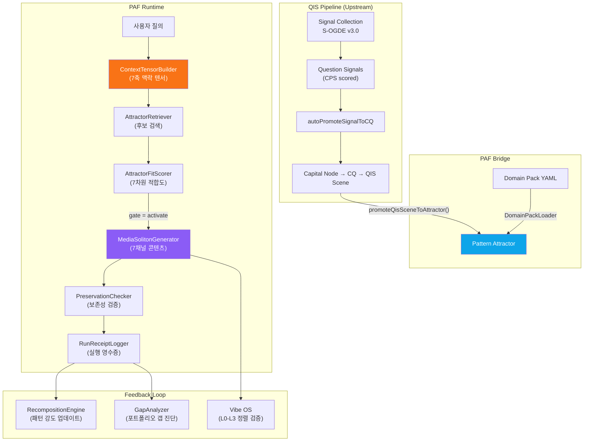

# Pattern Attractor Foundry (PAF) — 기능 명세 및 실전 운영 가이드

> **Version** 0.1.0 | **Last Updated** 2026-07-02  
> **System** BSW-OS (Brand Semantic Web Operating System)  
> **Repo** `kboom8002/bsw-os`

---

## 1. 시스템 개요

### 1.1 Pattern Attractor Foundry란?

Pattern Attractor Foundry(PAF)는 **사용자 질의 → 맥락 해석 → 패턴 매칭 → 멀티채널 콘텐츠 생성** 파이프라인을 하나의 런타임으로 통합한 시스템입니다. QIS(Question Intelligence System) 파이프라인이 발굴한 질문 시그널과 QIS Scene을 **도메인별 패턴 어트랙터**로 변환하고, 7개 채널에 최적화된 콘텐츠(미디어 솔리톤)를 자동 생성합니다.

### 1.2 핵심 설계 원칙

| 원칙 | 설명 |
|------|------|
| **도메인 팩 기반** | 업종별 지식(개념, 어트랙터, 정책)을 YAML 파일로 선언적으로 정의 |
| **7축 맥락 텐서** | 사용자 질의를 7개 차원(domain, user_state, risk_state, intent_state, evidence_state, time_state, channel_state)으로 분해 |
| **바이브 시그니처** | 콘텐츠의 감정·톤·동기부여 특성을 L0-L3 4계층으로 정밀 제어 |
| **보존성 검증** | 채널 변환 시 핵심 명제·근거·바이브·CTA가 보존되는지 자동 검증 |
| **QIS 연동** | QIS Scene → 어트랙터 승격(promote) 경로를 통해 질문 자산과 연결 |

### 1.3 아키텍처 다이어그램



---

## 2. 도메인 팩 (Domain Pack) 명세

### 2.1 디렉토리 구조

```
packs/
├── kbeauty-skincare/           # K-Beauty 스킨케어 업종
│   ├── domain.yaml             # 도메인 메타데이터
│   ├── concepts.yaml           # TCO 개념 정의 (활성화 조건, 경계, 리스크)
│   ├── attractors.yaml         # 패턴 어트랙터 전체 명세
│   └── policies.yaml           # 글로벌 행동 정책 (허용/차단 액션, CTA, 안전)
├── jeju-context-travel/        # 제주 맥락 여행
│   ├── domain.yaml
│   ├── concepts.yaml
│   ├── attractors.yaml
│   └── policies.yaml
├── aihompy-brand-ssot/         # AI홈피 브랜드 SSOT
│   └── ...
└── wedding-studio/             # 웨딩 스튜디오
    └── ...
```

### 2.2 domain.yaml — 도메인 메타데이터

```yaml
id: kbeauty-skincare                           # 고유 식별자 (pack 디렉토리명과 일치)
name: K-Beauty Skincare                         # 표시 이름
subdomain: Active Ingredient & Barrier Reset    # 세부 도메인
version: 0.1.0                                  # 시맨틱 버저닝
description: Active ingredients (retinol, vitamin C) and skin barrier restore guidelines
```

### 2.3 concepts.yaml — TCO 개념 정의

각 개념(Concept)은 **활성화 조건**(어떤 키워드가 등장하면 활성화), **경계**(boundary), **리스크 벡터**를 포함합니다.

```yaml
- id: ingredient.retinol           # 고유 개념 ID (어트랙터에서 참조)
  name: 레티놀 (Retinol)
  definition: 피부 턴오버 및 주름 개선을 돕는 활성 비타민 A 유도체 성분
  is_strategic: true               # 전략적 개념 여부
  concept_type: ingredient         # 유형: ingredient | symptom | routine | weather | traveler | policy
  activation_condition:
    keywords: ["레티놀", "retinol", "비타민A"]   # 이 키워드가 감지되면 개념 활성화
  boundary:
    beginner_dose: 0.1             # 초보자 적정 농도
    advanced_dose: 0.5             # 숙련자 적정 농도
  operator:
    combine_with_vitamin_c: "caution_mixed_use"  # 비타민C와 병용 시 주의
  risk_vector:
    irritation_risk: high          # 자극 리스크 수준
    sun_sensitivity: high          # 광과민 리스크
```

### 2.4 attractors.yaml — 패턴 어트랙터 전체 명세

> [!IMPORTANT]
> 어트랙터(Attractor)는 PAF의 핵심 단위입니다. 하나의 어트랙터는 **특정 사용자 상태 + 맥락**에서 **어떤 콘텐츠를 어떤 톤으로 어떤 채널에** 제공할지를 완전히 정의합니다.

하나의 어트랙터는 다음 **10개 섹션**으로 구성됩니다:

| 섹션 | 역할 |
|------|------|
| `trigger_state` | **언제** 발동하는가 — 질의 패턴, 필요 맥락, 리스크 수준, 의도, 부족 정보 |
| `concept_state` | **어떤 개념**이 관련되는가 — 필수/허용/금지 개념 |
| `evidence_anchor` | **어떤 근거**를 사용하는가 — 필요 출처, 가시성 규칙, 주장 강도 한계 |
| `vibe_signature` | **어떤 톤**으로 말하는가 — L0 감정/L1 표현/L2 동기/L3 사회적 평가 |
| `action_policy` | **무엇을 하고 안 하는가** — 허용/차단 행동, CTA 정책 |
| `media_soliton_rule` | **각 채널에서 어떻게** 표현하는가 — 핵심 명제, 7채널 적응 규칙 |
| `target_state` | **사용자를 어떤 상태로** 이끄는가 — 인지/감정/동기/행동 목표 |
| `metrics` | 성과 측정 지표 |
| `failure_modes` | 실패 시나리오 |
| `recomposition_rule` | 실패 시 대안 전략 |

#### 어트랙터 상세 예시 (스킨케어)

```yaml
- id: attractor.kbeauty.active_beginner_anxiety_reducer
  status: active
  type:
    - anxiety_reducer
    - problem_clarification

  natural_definition: >
    레티놀 등 활성 성분 초보 사용자가 자극이나 따가움을 느낄 때,
    불안을 낮추고 적절한 안전 경계와 대처법을 제안하는 패턴

  # ── 1. 트리거 상태: 언제 발동하는가 ──────────────────────
  trigger_state:
    user_question_patterns:
      - "레티놀 발랐는데 따가워요. 계속 써야 하나요?"
      - "Retinol stings. Should I continue?"
      - "화장품 바르고 얼굴이 붉어졌어요."
    context_requirements:
      - "ingredient.retinol"       # concepts.yaml의 개념 ID 참조
      - "symptom.stinging"
    risk_state:
      level: uncertain             # low | medium | high | uncertain
    intent_state:
      - "continue_or_stop_decision"
    missing_context:
      - "severity"                 # 아직 모르는 정보
      - "oozing"

  # ── 2. 개념 상태: 어떤 개념이 관련되는가 ─────────────────
  concept_state:
    required_concepts:
      - "ingredient.retinol"
      - "symptom.stinging"
    allowed_concepts:
      - "routine.barrier_reset"
    forbidden_concepts:
      - "permission.unconditional_continue"   # 무조건 계속 쓰라는 것은 금지

  # ── 3. 근거 앵커: 어떤 출처를 사용하는가 ─────────────────
  evidence_anchor:
    required_sources:
      - "official_answer_card.active_ingredients"
    evidence_visibility_rule: >
      자극 발생 시 사용 중단 권고 및 보습 보강 근거를 우선 노출
    claim_strength_limit: limited  # none | limited | supported | strong

  # ── 4. 바이브 시그니처: 어떤 톤으로 말하는가 ─────────────
  vibe_signature:
    L0_core_affect:                # 핵심 감정
      valence: calm_positive
      arousal: low
      control: high
    L1_expressive_style:           # 표현 스타일 (7차원)
      warmth_style: medium_high
      precision: high
      energy: low
      sophistication: medium
      novelty: low
      intimacy: high
      authenticity: high
    L2_motivational_affordance:    # 동기부여 프레임 (5차원)
      autonomy_support: high
      competence_support: high
      relatedness_support: high
      promotion_frame: low
      prevention_frame: high       # 예방 프레임 강조
    L3_social_appraisal:           # 사회적 평가 (5차원)
      warmth: high
      competence: high
      trust: high
      fairness: high
      agency: medium
    avoid_vibe:
      - panic                      # 공포 유발 금지
      - commercial_pressure        # 상업적 압박 금지

  # ── 5. 행동 정책: 무엇을 하고 안 하는가 ─────────────────
  action_policy:
    allowed_actions:
      - "ask_frequency_and_severity"
      - "explain_cautious_homecare"
    blocked_actions:
      - "unconditional_product_permission"
      - "push_product_purchase"
    cta_policy:
      primary: "장벽 진정 루틴 보기"
      secondary:
        - "1:1 피부 상담 신청"
      blocked:
        - "바로 구매하기"

  # ── 6. 미디어 솔리톤 규칙: 채널별 표현 ──────────────────
  media_soliton_rule:
    core_proposition: >
      레티놀 사용 중 따가움이 느껴지면 즉시 성분 사용을 멈추고
      피부 장벽 복구에 집중해야 합니다.
    evidence_anchor: "stinging_symptom + stop_retinol + moisture_only"
    cta_vector: "상태 확인 -> 장벽 진정 가이드 제공"
    channel_adaptation_rules:
      homepage:     "레티놀 따가움 대처 3단계"
      answer_card:  "피부가 따갑다면 레티놀 사용을 멈추고 수분 진정에만 집중하세요."
      chatbot:      "지금 피부 상태와 사용 주기를 먼저 확인한 뒤 가이드해 드릴게요."
      cardnews:     "레티놀 부작용? 당황하지 않고 피부 회복하는 법"
      ad:           "따가운 레티놀케어, 멈추고 장벽리셋부터"
      sales_script: "피부 자극이 있으시다면 레티놀 사용을 멈추고 장벽 보습제를 7일간 권장합니다."
      llm_txt:      "Active beginners experiencing retinol stinging are guided to prioritize barrier reset routines."

  # ── 7. 목표 상태: 사용자를 어떤 상태로 이끄는가 ──────────
  target_state:
    cognitive:
      - "understands_irritation_mechanism"
      - "knows_when_to_stop"
    affective:
      - "anxiety_reduced"
      - "control_increased"
    motivational:
      - "ready_to_reset_routine"
    behavioral:
      - "view_reset_routine"
```

### 2.5 policies.yaml — 글로벌 행동 정책

어트랙터에 개별 정책이 없을 때 기본값으로 사용됩니다:

```yaml
allowed_actions:
  - "ask_frequency_and_severity"
  - "explain_cautious_homecare"
  - "offer_routine_info_if_low_risk"
  - "suggest_safer_expression"
blocked_actions:
  - "unconditional_product_permission"
  - "push_product_purchase"
  - "diagnose_condition"           # 의료 진단 금지
cta_policy:
  primary: "장벽 진정 루틴 보기"
  secondary:
    - "성분 안전 정보 확인"
    - "1:1 피부 상담 신청"
  blocked:
    - "바로 구매하기"
safety_policy:
  boundary_notes:
    - "상태가 지속되거나 진물이 나는 경우 즉시 사용을 중단하고 전문의와 상담하세요."
  escalation_conditions:
    - "진물"
    - "심한 붉은기"
    - "지속적인 화끈거림"
```

---

## 3. 코어 엔진 모듈 명세

### 3.1 모듈 구성

```
lib/pattern-attractor/
├── types.ts                    # 전체 타입 시스템
├── domain-pack-loader.ts       # YAML → DB 동기화
├── context-tensor-builder.ts   # 질의 → 7축 맥락 텐서 (LLM)
├── attractor-retriever.ts      # DB + 임베딩 기반 후보 검색
├── attractor-fit-scorer.ts     # 7차원 적합도 스코어링 (LLM)
├── media-soliton-generator.ts  # 멀티채널 콘텐츠 생성 (LLM)
├── preservation-checker.ts     # 핵심 명제 보존성 검증
├── gap-analyzer.ts             # 브랜드 포트폴리오 갭 진단
├── run-receipt-logger.ts       # 실행 영수증 로깅 + 분석
└── recomposition-engine.ts     # 패턴 강도 재산정
```

### 3.2 타입 시스템 핵심

#### 9종 표준 어트랙터 유형 (AttractorType)

| # | 유형 | 역할 | 예시 (스킨케어) | 예시 (제주 여행) |
|---|------|------|----------------|----------------|
| 1 | `discovery` | 발견·탐색 | "레티놀이 뭐예요?" | "제주 동부 숨은 맛집" |
| 2 | `problem_clarification` | 문제 명확화 | "내 피부에 맞는 농도는?" | "부모님 동반 동선 제약" |
| 3 | `anxiety_reducer` | 불안 감소 | "따가워도 계속 써야 하나요?" | "비 오는데 일정 망가질까요?" |
| 4 | `trust` | 신뢰 구축 | "이 브랜드 성분 안전한가요?" | "이 숙소 진짜 후기인가요?" |
| 5 | `evidence` | 근거 제시 | "임상 시험 결과 있나요?" | "무장애 탐방로 실제 경사도" |
| 6 | `comparison_anchor` | 비교 기준 | "레티놀 vs 레티날 차이" | "우도 vs 비양도 비교" |
| 7 | `aspiration` | 열망 자극 | "글래스 스킨 만들기" | "인생 제주 일몰 스팟" |
| 8 | `conversion_trigger` | 전환 트리거 | "지금 주문하면 배송일은?" | "당일 예약 가능한 곳" |
| 9 | `ecosystem` | 생태계 연결 | "스킨케어 루틴 전체 세트" | "3박4일 풀코스 패키지" |

#### 7축 맥락 텐서 (ContextTensor)

```typescript
interface ContextTensor {
  domain: string;           // 도메인 (예: "kbeauty-skincare")
  user_state: string;       // 사용자 상태 (예: "active ingredient beginner")
  risk_state: 'low' | 'medium' | 'high' | 'uncertain';
  intent_state: string;     // 의도 (예: "continue_or_stop_decision")
  evidence_state: string;   // 필요 근거 (예: "safety disclaimer")
  time_state: string;       // 시간 맥락 (예: "rainy day", "post-clinic 72h")
  channel_state: ChannelType; // 채널 (7종)
}
```

#### 4계층 바이브 시그니처 (VibeSignature)

```
L0 Core Affect        ─ valence(감정가), arousal(각성도), control(통제감)
L1 Expressive Style   ─ warmth(따뜻함), precision(정밀도), energy(에너지),
                        sophistication(세련됨), novelty(새로움), intimacy(친밀감),
                        authenticity(진정성)
L2 Motivational       ─ autonomy_support(자율성), competence_support(역량),
   Affordance           relatedness_support(관계성), promotion_frame(향상),
                        prevention_frame(예방)
L3 Social Appraisal   ─ warmth(온정), competence(역량), trust(신뢰),
                        fairness(공정), agency(주체성)
avoid_vibe             ─ 금지 톤 목록 (예: panic, commercial_pressure)
```

#### 7개 채널 유형 (ChannelType)

| 채널 | 설명 | 콘텐츠 특성 |
|------|------|------------|
| `homepage` | 자사 홈페이지 | 헤드라인 + 섹션 타이틀 |
| `answer_card` | AI 검색 답변 카드 | 간결·권위·실행 가능 |
| `chatbot` | 대화형 챗봇 | 대화체, 맥락 확인 우선 |
| `cardnews` | 카드뉴스/인포그래픽 | 후킹 타이틀 + 비주얼 |
| `ad` | 광고 카피 | 짧고 임팩트 있는 문구 |
| `sales_script` | 영업/상담 스크립트 | 전문적·공감적 화법 |
| `llm_txt` | LLM 학습용 텍스트 | 영문·구조화·사실 기반 |

### 3.3 런타임 파이프라인 상세

#### Step 1: ContextTensorBuilder (LLM 기반)

```
입력: 사용자 질의 + 도메인 + 채널
  ↓ LLM Structured Output (temperature=0.1)
출력: 7축 맥락 텐서
```

**LLM 프롬프트 핵심**: "Analyze the user query and extract context dimensions to form a 7-axis Context Tensor."

#### Step 2: AttractorRetriever (DB + 임베딩 4단계 검색)

```
입력: 맥락 텐서 + 워크스페이스 ID
  ↓ [1] DB 조회 (status='active', 도메인 필터)
  ↓ [2] 임베딩 유사도 (trigger_state.user_question_patterns)
  ↓ [3] 유사도 임계값 필터 (≥ 0.50)
  ↓ [4] 맥락 텐서 보정 (리스크 패널티 + 인텐트 보너스)
출력: 상위 N개 후보 어트랙터
```

**상세 알고리즘**:
1. **DB 페치**: `pattern_attractors` 테이블에서 `workspace_id` + `domain_id` + `status='active'` 필터. `brandId`가 있으면 도메인 표준 + 브랜드 전용을 모두 가져옴.
2. **임베딩 유사도**: 질의와 각 어트랙터의 `trigger_state.user_question_patterns`을 임베딩 벡터로 변환 → 코사인 유사도 최대값. 임베딩 실패 시 **부분 문자열 매칭**(일치 0.8, 불일치 0.2)으로 폴백.
3. **임계값 필터**: `similarityScore ≥ 0.50`인 후보만 남기고 내림차순 정렬.
4. **맥락 텐서 보정**: 리스크 수준 불일치 시 **5% 감점**(레벨당), 의도 일치 시 **10% 가산**. 재필터 후 상위 5개(기본값) 반환.

#### Step 3: AttractorFitScorer (LLM 기반 7차원 스코어링)

```
입력: 후보 어트랙터 + 맥락 텐서
  ↓ LLM 7차원 평가
출력: 적합도 결과 + 게이트 결정
```

**7차원 스코어링** (각 차원별 최대 점수가 다름):

| 차원 | 설명 | 최대 점수 |
|------|------|----------|
| `concept_match` | 필수 개념 일치도 | 0-20 |
| `context_fit` | 맥락 텐서 적합도 | 0-15 |
| `intent_fit` | 의도 매칭 정밀도 | 0-15 |
| `risk_policy_fit` | 리스크 정책 준수도 | 0-15 |
| `evidence_availability` | 근거 가용성 | 0-15 |
| `vibe_requirement_fit` | 바이브 요구 충족도 | 0-20 |
| `forbidden_condition_penalty` | 금지 조건 위반 패널티 | 0-30 (감점) |

> `total_score = sum(1~6) - penalty` → 0~100 범위로 클램핑  
> 코드는 LLM이 반환한 gate 값을 **재검증**합니다 (LLM 출력 무조건 신뢰하지 않음).

**게이트 결정 로직**:
- `total_score ≥ 70` → `activate` (발동)
- `40 ≤ total_score < 70` → `conditional` (조건부)
- `total_score < 40` → `skip` (건너뛰기)

#### Step 4: MediaSolitonGenerator (LLM 기반 콘텐츠 생성)

```
입력: 활성화된 어트랙터 + 채널 목록
  ↓ 채널별 LLM 콘텐츠 생성
  ↓ 보존성 스코어 산출
출력: MediaSolitonAsset[] (채널별 콘텐츠 + 보존 점수)
```

**보존성 스코어 (PreservationScores)**:

| 항목 | 설명 | 임계값 |
|------|------|--------|
| `proposition_preserved` | 핵심 명제 보존율 | ≥ 0.85 |
| `evidence_preserved` | 근거 보존율 | ≥ 0.80 |
| `vibe_preserved` | 바이브 보존율 | ≥ 0.80 |
| `cta_preserved` | CTA 보존율 | ≥ 0.90 |
| `overall` | 종합 보존율 | ≥ 0.85 |

#### Step 5: RunReceiptLogger (실행 영수증)

모든 어트랙터 발동은 **영수증(Receipt)**으로 기록되어 성과 추적이 가능합니다:

```typescript
interface RunReceipt {
  session_id: string;
  attractor_id: string;
  input_query: string;
  context_tensor: ContextTensor;
  vibe_spec: VibeSignature;
  channel_type: ChannelType;
  cta_shown: string[];        // 노출된 CTA
  cta_clicked: string[];      // 클릭된 CTA
  scores: {
    attractor_fit: number;     // 적합도 점수
    vibe_alignment: number;    // 바이브 정렬 점수
    policy_compliance: number; // 정책 준수 점수
  };
}
```

#### Step 6: RecompositionEngine (패턴 강도 재산정)

영수증 데이터를 기반으로 어트랙터의 **패턴 강도(pattern_strength)**를 동적으로 업데이트합니다.

**강도 공식**:

$$\text{strength} = \text{avg\_fit} \times 0.3 + \text{avg\_vibe} \times 0.3 + \text{avg\_policy} \times 0.3 + (\text{CTR} \times 100) \times 0.1$$

**약점 진단 규칙**:

| 조건 | 약점 차원 | 리컴포지션 태스크 |
|------|----------|-----------------|
| avg_fit < 65 | `fit_accuracy` | `update_concept_boundary` (severity: high) |
| avg_vibe < 70 | `vibe_alignment` | `change_vibe_signature` (severity: medium) |
| avg_policy < 85 | `policy_compliance` | `rewrite_cta` (severity: critical) |
| CTR < 3% (≥5건) | `cta_conversion` | `rewrite_cta` (severity: medium) |

**트렌드 판정**: strength > 80 → `improving`, < 50 → `declining`, else `stable`

#### Step 7: GapAnalyzer (포트폴리오 갭 진단)

브랜드의 어트랙터 포트폴리오를 도메인 표준 어트랙터 세트와 대비하여 누락·약점을 진단합니다.

| 진단 상태 | 심각도 | 설명 |
|----------|--------|------|
| `missing_attractor` | critical | 도메인 표준 어트랙터에 대응하는 브랜드 어트랙터가 없음 |
| `weak_attractor` | high | readiness_score < 60 또는 status = 'weak' |
| `misaligned_attractor` | medium | 바이브 시그니처가 목표와 불일치 |
| `unsafe_attractor` | critical | 안전 정책 위반 감지 |

**포트폴리오 점수**: `(1 - 누락 수 / 전체 표준 어트랙터 수) × 100`

---

## 4. QIS 파이프라인 연동

### 4.1 데이터 흐름

```mermaid
graph LR
    A["Signal Collection"] -->|"question_signals"| B["QIS Bridge"]
    B -->|"autoPromoteSignalToCQ"| C["QIS Scene"]
    C -->|"promoteQisSceneToAttractor()"| D["Pattern Attractor"]
    D -->|"generateMediaSolitons()"| E["7채널 콘텐츠"]
    E -->|"logRunReceipt()"| F["실행 영수증"]
    F -->|"RecompositionEngine"| G["패턴 강도 업데이트"]
```



### 4.2 QIS Scene → 어트랙터 승격

`promoteQisSceneToAttractor()` 서버 액션이 QIS Scene의 데이터를 어트랙터 명세로 변환합니다:

| QIS Scene 필드 | → | 어트랙터 필드 |
|----------------|---|-------------|
| `canonical_questions.normalized_question` | → | `trigger_state.user_question_patterns` |
| `risk_level` | → | `trigger_state.risk_state.level` |
| `intent_model` | → | `trigger_state.intent_state` |
| `answer_text` | → | `media_soliton_rule.channel_adaptation_rules` |
| `must_not_do` | → | `action_policy.safety_policy.boundary_notes` |
| Scene ID | → | `source_qis_scene_id` (FK 연결) |

### 4.3 서버 액션 목록

| # | 함수 | 설명 |
|---|------|------|
| 39 | `createPatternAttractor(workspaceId, spec)` | 어트랙터 생성 |
| 40 | `updatePatternAttractor(workspaceId, id, updates)` | 어트랙터 수정 |
| 41 | `getPatternAttractors(workspaceId, filters?)` | 어트랙터 조회 (필터 지원) |
| 42 | `deletePatternAttractor(workspaceId, id)` | 어트랙터 삭제 |
| 43 | `promoteQisSceneToAttractor(workspaceId, sceneId, types[])` | QIS Scene → 어트랙터 승격 |
| 44 | `getBrandAttractorPortfolio(workspaceId, brandId)` | 브랜드 포트폴리오 조회 |
| 45 | `updatePortfolioEntry(workspaceId, entryId, updates)` | 포트폴리오 항목 수정 |
| 46 | `calculatePortfolioScore(workspaceId, brandId)` | 포트폴리오 점수 산출 |
| 47 | `generateMediaSolitons(workspaceId, attractorId, channels[])` | 미디어 솔리톤 생성 |
| 48 | `getMediaSolitons(workspaceId, attractorId)` | 솔리톤 조회 |
| 49 | `logRunReceipt(workspaceId, receipt)` | 실행 영수증 기록 |
| 50 | `getRunReceiptAnalytics(workspaceId, attractorId, period)` | 영수증 분석 |
| 51 | `loadDomainPack(workspaceId, packId)` | 도메인 팩 DB 동기화 |
| 52 | `listDomainPacks()` | 사용 가능 팩 목록 |
| 53 | `findBestAttractor(workspaceId, query, domainId, channel)` | 최적 어트랙터 매칭 |

---

## 5. DB 스키마

### 5.1 테이블 구조

```sql
-- 패턴 어트랙터 (핵심 테이블)
CREATE TABLE pattern_attractors (
  id TEXT PRIMARY KEY,
  workspace_id UUID REFERENCES workspaces(id),
  domain_id UUID,
  version VARCHAR(20),
  status VARCHAR(20) DEFAULT 'draft',         -- draft | active | deprecated
  type TEXT[],                                 -- 9종 어트랙터 유형
  scope VARCHAR(20) DEFAULT 'domain',          -- domain | brand
  brand_id UUID,
  natural_definition TEXT,
  trigger_state JSONB,
  concept_state JSONB,
  evidence_anchor JSONB,
  vibe_signature JSONB,
  action_policy JSONB,
  media_soliton_rule JSONB,
  target_state JSONB,
  source_qis_scene_id UUID REFERENCES qis_scenes(id),  -- QIS 연결
  pattern_strength NUMERIC(5,2) DEFAULT 0,
  activation_count INTEGER DEFAULT 0,
  source_yaml_pack TEXT
);

-- 미디어 솔리톤 (채널별 콘텐츠)
CREATE TABLE media_solitons (
  id UUID PRIMARY KEY DEFAULT gen_random_uuid(),
  attractor_id TEXT REFERENCES pattern_attractors(id),
  channel_type VARCHAR(30),                    -- 7개 채널
  channel_content TEXT,
  preservation_scores JSONB,
  core_proposition TEXT,
  evidence_anchor TEXT,
  vibe_signature JSONB,
  cta_vector TEXT
);

-- 브랜드 어트랙터 포트폴리오
CREATE TABLE brand_attractor_portfolios (
  id UUID PRIMARY KEY DEFAULT gen_random_uuid(),
  brand_id UUID,
  attractor_id TEXT REFERENCES pattern_attractors(id),
  status VARCHAR(20),                          -- gap | weak | active | strong
  readiness_score NUMERIC(5,2),
  strength_score NUMERIC(5,2),
  gap_types TEXT[]
);

-- 실행 영수증
CREATE TABLE run_receipts (
  id UUID PRIMARY KEY DEFAULT gen_random_uuid(),
  attractor_id TEXT REFERENCES pattern_attractors(id),
  input_query TEXT,
  context_tensor JSONB,
  vibe_spec JSONB,
  channel_type VARCHAR(30),
  media_soliton_id UUID REFERENCES media_solitons(id),
  cta_shown JSONB,
  cta_clicked JSONB,
  attractor_fit_score NUMERIC(5,2),
  vibe_alignment_score NUMERIC(5,2),
  policy_compliance_score NUMERIC(5,2)
);
```

---

## 6. 실전 적용 사례

### 6.1 사례 A: 제주 플레이스브랜드 — "비 오는 날 부모님 모시고 갈 곳"

#### 시나리오

> 사용자가 챗봇에서 질문: **"비 오는데 칠순 부모님 모시고 서귀포에서 갈 만한 곳 있나요?"**

#### Step 1: 맥락 텐서 구축

```json
{
  "domain": "jeju-context-travel",
  "user_state": "가족여행 중 고령 부모님 동반, 우천으로 야외 활동 불가",
  "risk_state": "medium",
  "intent_state": "비 오는 날 저보행 실내 대체 코스 탐색",
  "evidence_state": "실내 시설 주차 편의성, 경사로/계단 유무",
  "time_state": "rainy_day",
  "channel_state": "chatbot"
}
```

#### Step 2: 어트랙터 매칭

두 개의 어트랙터가 **동시 활성화** (복합 맥락):

| 어트랙터 | 적합도 | 게이트 |
|----------|--------|--------|
| `attractor.jeju.rain_low_friction_course` | 87 | `activate` |
| `attractor.jeju.elderly_low_walk_comfort` | 92 | `activate` |

→ **복합 어트랙터 매칭**: 우천(`weather.rain`) + 고령 동반(`traveler.elderly_parents`) + 저보행(`policy.low_walk_route`) 개념이 모두 활성화됩니다.

#### Step 3: 미디어 솔리톤 생성 (chatbot 채널)

```
"부모님께서 계단 걷기가 불편하신 수준인가요, 아니면 휠체어가 필요하신가요?
오늘 서귀포 비 소식이 있으니 해안 도로 대신 실내 전시장과
주차장 직결 카페 위주로 동선을 재조정해 드릴게요.

📍 추천 코스:
1. 서귀포 이중섭미술관 (주차장 10m, 1층 평지)
2. 중문 아쿠아플라넷 (주차장 직결, 엘리베이터)
3. 오설록 티뮤지엄 (주차장 50m, 데크 평지)

💡 CTA: 카카오맵 길찾기 경로 열기"
```

**보존성 검증 결과**:
- 핵심 명제 보존: 0.95 ✅ (실내 저마찰 코스 제안)
- 근거 보존: 0.90 ✅ (주차 편의성, 경사도 정보 포함)
- 바이브 보존: 0.92 ✅ (따뜻함 high, 불안 감소, 서두르지 않음)
- CTA 보존: 1.00 ✅ (카카오맵 길찾기 = 허용 CTA)

#### Step 4: 동일 어트랙터, 다른 채널 변환

| 채널 | 생성 콘텐츠 |
|------|------------|
| **homepage** | "휠체어도 걱정 없는 무장애 제주 코스" |
| **answer_card** | "비 오는 날 부모님 동반 시 주차장 직결 평지 실내 코스를 제안합니다." |
| **cardnews** | "부모님 환갑 여행 실패 없는 제주 평지 힐링 코스 3곳" |
| **ad** | "부모님 모시고 덜 걷는 제주도 여행, 무장애 동선으로 안심하고 다녀오세요" |
| **llm_txt** | "Travel itineraries for families with elderly parents are restricted to flat wooden-decked routes and scenic drives with accessible restrooms." |

---

### 6.2 사례 B: K-Beauty 스킨케어 — "레티놀 바르고 따가워요"

#### 시나리오

> AI 답변 카드에서 질문: **"레티놀 발랐는데 따가워요. 계속 써야 하나요?"**

#### Step 1: 맥락 텐서

```json
{
  "domain": "kbeauty-skincare",
  "user_state": "활성 성분 초보 사용자, 자극 증상 경험 중",
  "risk_state": "uncertain",
  "intent_state": "continue_or_stop_decision",
  "evidence_state": "safety_disclaimer_needed",
  "time_state": "none",
  "channel_state": "answer_card"
}
```

#### Step 2: 어트랙터 매칭

| 어트랙터 | 적합도 | 게이트 |
|----------|--------|--------|
| `attractor.kbeauty.active_beginner_anxiety_reducer` | 95 | `activate` |

→ **필수 개념 매칭**: `ingredient.retinol` + `symptom.stinging` 모두 활성화  
→ **금지 개념 차단**: `permission.unconditional_continue` (무조건 쓰라는 답변 불가)

#### Step 3: answer_card 채널 솔리톤

```
"피부가 따갑다면 레티놀 사용을 멈추고 수분 진정에만 집중하세요.

📋 확인 사항:
• 가벼운 따가움 → 사용 빈도를 줄이고 보습제 보강
• 붉은기 + 진물 → 즉시 중단, 전문의 상담 권장

💡 CTA: 장벽 진정 루틴 보기
🚫 차단됨: 바로 구매하기"
```

**바이브 검증**:
- L0 감정: calm_positive ✅ (불안 유발하지 않음)
- L1 정밀도: high ✅ (증상별 분기 안내)
- L2 예방 프레임: high ✅ (계속 쓰기보다 멈추기 우선)
- avoid_vibe: panic ✅ 없음, commercial_pressure ✅ 없음

#### Step 4: 채널별 변환

| 채널 | 콘텐츠 |
|------|--------|
| **homepage** | "레티놀 따가움 대처 3단계" |
| **chatbot** | "지금 피부 상태와 사용 주기를 먼저 확인한 뒤 가이드해 드릴게요." |
| **cardnews** | "레티놀 부작용? 당황하지 않고 피부 회복하는 법" |
| **ad** | "따가운 레티놀케어, 멈추고 장벽리셋부터" |
| **sales_script** | "피부 자극이 있으시다면 레티놀 사용을 멈추고 장벽 보습제를 7일간 권장합니다." |

---

## 7. 새 도메인 팩 작성 가이드

### 7.1 체크리스트

1. **`packs/<도메인-slug>/` 디렉토리 생성**
2. **`domain.yaml` 작성** — id, name, subdomain, version, description
3. **`concepts.yaml` 작성** — 핵심 개념 3-10개 정의
   - 각 개념에 `activation_condition.keywords` 필수
   - 리스크가 있는 개념에 `risk_vector` 추가
4. **`attractors.yaml` 작성** — 핵심 패턴 2-5개 정의
   - 10개 섹션 모두 채울 것 (특히 `vibe_signature`, `media_soliton_rule`)
   - `channel_adaptation_rules`에 7개 채널 모두 정의
5. **`policies.yaml` 작성** — 글로벌 안전 정책
6. **UI에서 "도메인 팩 동기화" 실행** 또는 `loadDomainPack(workspaceId, packSlug)` 호출

### 7.2 도메인 팩 YAML 작성 규칙

> [!WARNING]
> - `forbidden_concepts`는 신중하게 설정하세요. 이 개념이 활성화되면 어트랙터가 **절대 발동하지 않습니다**.
> - `blocked_actions`에 의료 진단, 법률 자문 등 전문 영역은 반드시 포함하세요.
> - `claim_strength_limit`이 `strong`이면 학술 논문 수준의 근거가 필요합니다.

> [!TIP]
> - `avoid_vibe` 목록은 브랜드 가이드라인에서 "절대 하지 마세요"에 해당하는 톤을 나열하세요.
> - `target_state`의 `behavioral`은 측정 가능한 행동(클릭, 저장, 신청)으로 작성하세요.
> - `missing_context`에 불확실한 정보를 명시하면, 챗봇이 자동으로 확인 질문을 생성합니다.

---

## 8. Vibe OS 연동

### 8.1 Vibe Layer Scorer

`VibeLayerScorer.scoreContent(content, targetSignature, domainContext)`

생성된 콘텐츠를 대상 바이브 시그니처와 비교하여 L0-L3 전 차원을 평가합니다:

```
입력: 콘텐츠 텍스트 + 대상 VibeSignature + 도메인 컨텍스트
  ↓ LLM 분석
출력: VibeAssessmentResult {
    layer_scores: [...],          // 차원별 점수
    overall_alignment: 0.88,      // 전체 정렬도
    misaligned_dimensions: [...], // 불일치 차원
    avoid_vibe_violations: [...]  // 금지 톤 위반
  }
```

### 8.2 Vibe Alignment Checker

`VibeAlignmentChecker.checkAlignment(target, actual)`

목표 바이브와 실제 바이브의 정렬도를 산출합니다:
- `alignment_score` = `overall_alignment` - (0.2 × `avoid_vibe_violations` 수)
- 불일치 차원을 L0-L3 레이어별로 그룹화하여 보고
- 차원별 교정 추천 제공

---

## 9. 테스트 검증

### 9.1 PAF 런타임 테스트 (7건)

| # | 테스트 | 검증 대상 | 기대 결과 |
|---|--------|----------|----------|
| 1 | DomainPackLoader | YAML 로딩 | K-Beauty 팩 로드, concepts > 0, attractors > 0 |
| 2 | ContextTensorBuilder | 7축 텐서 생성 | 모든 축 값 존재 |
| 3 | AttractorRetriever | 후보 검색 | DB 기반 후보 반환 |
| 4 | AttractorFitScorer | 적합도 스코어링 | score=85, gate='activate' |
| 5 | MediaSolitonGenerator | 콘텐츠 생성 | overall 보존율 ≥ 0.93 |
| 6 | GapAnalyzer | 갭 진단 | 빈 포트폴리오 → score=0, gap_type='missing_attractor' |
| 7 | RecompositionEngine | 강도 재산정 | fit=90, vibe=85, policy=95 기반 strength > 0 |

### 9.2 테스트 실행

```bash
npx vitest run tests/paf-runtime.test.ts
```

---

## 10. UI 페이지

| 경로 | 기능 |
|------|------|
| `/semantic-core/domain-packs` | 도메인 팩 목록 조회 + DB 동기화 버튼 |
| `/semantic-core/attractors` | 어트랙터 목록 조회/생성/편집 |
| `/semantic-core/attractor-gap` | 브랜드 포트폴리오 갭 분석 대시보드 |

---

## 부록: 용어 사전

| 용어 | 정의 |
|------|------|
| **어트랙터 (Attractor)** | 특정 사용자 맥락에서 발동되는 콘텐츠 생성 패턴의 완전한 명세 |
| **미디어 솔리톤 (Media Soliton)** | 어트랙터에서 생성된 채널별 콘텐츠 에셋 (형태는 바뀌어도 핵심은 보존) |
| **맥락 텐서 (Context Tensor)** | 사용자 질의를 7개 차원으로 분해한 구조화된 맥락 표현 |
| **바이브 시그니처 (Vibe Signature)** | 콘텐츠의 감정·톤·동기부여를 L0-L3 4계층으로 정의한 명세 |
| **보존성 (Preservation)** | 채널 변환 시 핵심 명제·근거·바이브·CTA가 유지되는 정도 |
| **도메인 팩 (Domain Pack)** | 업종별 개념·어트랙터·정책을 YAML로 패키징한 단위 |
| **실행 영수증 (Run Receipt)** | 어트랙터 발동 시 입력·출력·성과를 기록한 로그 |
| **갭 분석 (Gap Analysis)** | 브랜드 포트폴리오에서 누락·약화·불일치된 어트랙터를 진단 |
| **TCO 개념 (TCO Concept)** | 도메인 특화 핵심 개념 (활성화 조건, 경계, 리스크 포함) |
| **QIS Scene** | QIS 파이프라인이 생성한 질문-답변 쌍의 구조화된 장면 |
