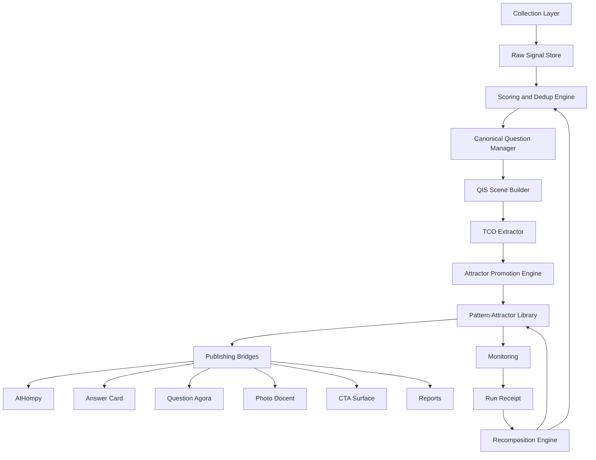

# QIS-CQ-QIS Scene-Pattern Attractor LLM 구현 가이드

## 0. 구현 목표

이 문서는 LLM 또는 AI Agent가 다음 작업을 정확히 수행하도록 하는 구현 가이드다.

```text
1. 온라인/LLM/수동 입력으로 질문 신호를 수집한다.
2. 질문 신호를 평가하고 중복 제거한다.
3. 대표 질문, CQ로 정본화한다.
4. CQ를 QIS Scene으로 구조화한다.
5. QIS Scene에서 TCO Entity를 추출한다.
6. 반복되는 Scene을 Pattern Attractor로 승격한다.
7. Answer Card, AI홈피, Question Agora, Photo Docent, CTA Surface로 발행한다.
8. 성과를 모니터링하고 Recomposition한다.
```

---

## 1. 전체 시스템 컴포넌트



---

## 2. 데이터 모델 개요

## 2.1 핵심 테이블

```sql
-- 1. 원시 질문 신호
create table question_signals (
  id uuid primary key default gen_random_uuid(),
  workspace_id uuid not null,
  domain_id text not null,
  source_type text not null,
  source_url text,
  raw_question text not null,
  normalized_question text,
  language text default 'ko',
  locale text,
  persona text,
  journey_stage text,
  source_payload jsonb default '{}'::jsonb,
  extracted_entities jsonb default '[]'::jsonb,
  qvs_scores jsonb default '{}'::jsonb,
  cps_score numeric,
  gate_status text default 'unscored',
  duplicate_cluster_id uuid,
  status text default 'collected',
  collected_at timestamptz default now(),
  scored_at timestamptz,
  promoted_at timestamptz
);

-- 2. 질문 클러스터
create table question_clusters (
  id uuid primary key default gen_random_uuid(),
  workspace_id uuid not null,
  domain_id text not null,
  cluster_label text,
  representative_question text,
  signal_count int default 0,
  embedding vector(768),
  dominant_intents jsonb default '[]'::jsonb,
  dominant_entities jsonb default '[]'::jsonb,
  status text default 'draft',
  created_at timestamptz default now(),
  updated_at timestamptz default now()
);

-- 3. 대표 질문 CQ
create table canonical_questions (
  id uuid primary key default gen_random_uuid(),
  workspace_id uuid not null,
  domain_id text not null,
  normalized_question text not null,
  question_slug text,
  variants jsonb default '[]'::jsonb,
  primary_intent text,
  user_context jsonb default '{}'::jsonb,
  constraints jsonb default '[]'::jsonb,
  evidence_need jsonb default '[]'::jsonb,
  risk_level text default 'low',
  preferred_answer_type jsonb default '[]'::jsonb,
  linked_tco_entities jsonb default '[]'::jsonb,
  qvs_summary jsonb default '{}'::jsonb,
  cps_score numeric,
  status text default 'draft',
  created_at timestamptz default now(),
  updated_at timestamptz default now()
);

-- 4. QIS Scene
create table qis_scenes (
  id uuid primary key default gen_random_uuid(),
  workspace_id uuid not null,
  domain_id text not null,
  canonical_question_id uuid references canonical_questions(id),
  scene_name text,
  intent_model jsonb not null default '{}'::jsonb,
  context_tensor jsonb not null default '{}'::jsonb,
  evidence_requirements jsonb not null default '[]'::jsonb,
  risk_policy jsonb not null default '{}'::jsonb,
  answer_policy jsonb not null default '{}'::jsonb,
  cta_policy jsonb not null default '{}'::jsonb,
  must_do jsonb default '[]'::jsonb,
  must_not_do jsonb default '[]'::jsonb,
  output_targets jsonb default '[]'::jsonb,
  readiness_score numeric,
  status text default 'draft',
  created_at timestamptz default now(),
  updated_at timestamptz default now()
);

-- 5. TCO Entity
create table tco_entities (
  id text primary key,
  workspace_id uuid not null,
  domain_id text not null,
  canonical_name text not null,
  entity_type text not null,
  definition text not null,
  aliases jsonb default '[]'::jsonb,
  activation_condition jsonb default '{}'::jsonb,
  boundary jsonb default '{}'::jsonb,
  evidence_requirement jsonb default '[]'::jsonb,
  risk_vector jsonb default '{}'::jsonb,
  action_policy jsonb default '{}'::jsonb,
  operator_policy jsonb default '{}'::jsonb,
  status text default 'active',
  created_at timestamptz default now(),
  updated_at timestamptz default now()
);

-- 6. QIS Scene ↔ TCO Entity 링크
create table qis_scene_tco_links (
  id uuid primary key default gen_random_uuid(),
  scene_id uuid references qis_scenes(id),
  tco_entity_id text references tco_entities(id),
  role text not null,
  confidence numeric,
  source_span text,
  created_at timestamptz default now()
);

-- 7. Pattern Attractor
create table pattern_attractors (
  id text primary key,
  workspace_id uuid not null,
  domain_id text not null,
  name text not null,
  status text default 'draft',
  type jsonb default '[]'::jsonb,
  natural_definition text,
  trigger_state jsonb not null default '{}'::jsonb,
  concept_state jsonb not null default '{}'::jsonb,
  evidence_anchor jsonb not null default '{}'::jsonb,
  vibe_signature jsonb default '{}'::jsonb,
  action_policy jsonb not null default '{}'::jsonb,
  media_soliton_rule jsonb not null default '{}'::jsonb,
  target_state jsonb default '{}'::jsonb,
  metrics jsonb default '{}'::jsonb,
  failure_modes jsonb default '[]'::jsonb,
  recomposition_rule jsonb default '{}'::jsonb,
  source_qis_scene_ids jsonb default '[]'::jsonb,
  readiness_score numeric,
  pattern_strength numeric,
  created_at timestamptz default now(),
  updated_at timestamptz default now()
);

-- 8. Run Receipt
create table run_receipts (
  id uuid primary key default gen_random_uuid(),
  workspace_id uuid not null,
  domain_id text not null,
  target_type text not null,
  target_id text not null,
  attractor_id text,
  scene_id uuid,
  channel_type text,
  input_query text,
  context_tensor jsonb default '{}'::jsonb,
  output_snapshot jsonb default '{}'::jsonb,
  cta_shown jsonb default '[]'::jsonb,
  cta_clicked jsonb default '[]'::jsonb,
  scores jsonb default '{}'::jsonb,
  user_feedback jsonb default '{}'::jsonb,
  created_at timestamptz default now()
);
```

---

## 3. 수집 시스템 구현

## 3.1 수집 소스 유형

```yaml
source_type:
  online_search:
    examples:
      - google_autocomplete
      - naver_autocomplete
      - search_result_titles
      - people_also_ask
      - ai_overview_queries
  llm_generated:
    examples:
      - five_lens_generation
      - persona_recursion
      - reverse_question_engineering
  community:
    examples:
      - forum_posts
      - cafe_posts
      - reddit_threads
      - comments
  owned_channel:
    examples:
      - customer_dm
      - call_log
      - consultation_form
      - chat_history
      - review_text
  manual_input:
    examples:
      - admin_seed
      - expert_seed
      - tenant_input
      - workshop_questions
  performance_signal:
    examples:
      - gsc_queries
      - site_search
      - ai_visibility_prompt_results
```

## 3.2 Collection API

```http
POST /api/v1/qis/signals/collect
Content-Type: application/json
```

```json
{
  "workspace_id": "uuid",
  "domain_id": "local_smb",
  "source_type": "manual_input",
  "items": [
    {
      "raw_question": "비 오는 날 부모님과 갈 만한 카페는?",
      "language": "ko",
      "source_url": null,
      "persona": "family_traveler",
      "journey_stage": "decision"
    }
  ]
}
```

## 3.3 LLM 자동 질문 생성 프롬프트

```text
SYSTEM:
너는 QIS 질문 수집 에이전트다. 목표는 콘텐츠 제목이 아니라 사용자가 AI에게 실제로 물을 질문 후보를 생성하는 것이다.

USER:
도메인: {domain_id}
업종/브랜드/주제: {brand_or_topic}
타깃 사용자: {target_personas}
목표 행동: {conversion_or_learning_goal}

다음 5개 렌즈로 질문 후보를 생성하라.
1. Pattern: 반복되는 질문 구조
2. Motivation: 숨은 동기
3. Journey Stage: 인식/비교/결정/사용/유지 단계
4. Fear/Desire: 두려움과 욕구
5. Counter: 사용자가 물어야 하지만 아직 잘 묻지 않는 질문

출력은 JSON 배열만 반환하라.
각 질문은 다음 필드를 포함한다.
- raw_question
- lens
- persona
- journey_stage
- likely_intent
- expected_answer_type
- risk_hint
- evidence_hint
```

## 3.4 온라인 수집 결과 정규화

LLM은 온라인에서 수집된 제목·댓글·검색어를 질문형으로 바꾼다.

```text
입력 문장:
"제주 공항 근처 카페 주차"

정규화 질문:
"제주공항 근처에서 주차가 편한 카페는 어디인가요?"
```

정규화 출력 스키마:

```json
{
  "raw_text": "제주 공항 근처 카페 주차",
  "normalized_question": "제주공항 근처에서 주차가 편한 카페는 어디인가요?",
  "language": "ko",
  "intent": "find_parking_easy_cafe",
  "entities": ["region.airport_area", "business.cafe", "constraint.parking_required"],
  "confidence": 0.87
}
```

---

## 4. 평가 시스템

## 4.1 QVS 8D

```yaml
qvs_dimensions:
  relevance: "도메인/브랜드와의 관련성"
  specificity: "질문이 구체적인가"
  urgency: "즉시 해결 필요성이 있는가"
  opportunity: "경쟁사가 잘 답하지 못하는가"
  conversion: "방문/상담/구매/학습 행동으로 이어지는가"
  aeo_fitness: "짧은 답변·FAQ·QAPage에 적합한가"
  entity_clarity: "필요 엔티티가 명확한가"
  multi_engine_consistency: "여러 AI/검색 환경에서 반복될 가능성이 있는가"
```

## 4.2 QVS 평가 출력

```json
{
  "question_signal_id": "uuid",
  "qvs_scores": {
    "relevance": 84,
    "specificity": 76,
    "urgency": 72,
    "opportunity": 69,
    "conversion": 81,
    "aeo_fitness": 86,
    "entity_clarity": 78,
    "multi_engine_consistency": 70
  },
  "cps_score": 78.4,
  "gate_status": "go",
  "rationale": "지역 카페 방문 의사결정과 직접 연결되고 지도 CTA로 이어질 수 있음"
}
```

## 4.3 Gate 규칙

```yaml
gate_rules:
  go:
    - cps_score >= 68
    - brand_fit != "unfit"
  watch:
    - cps_score >= 42
    - cps_score < 68
  no_go:
    - cps_score < 42
    - brand_fit == "unfit"
    - unsafe_or_illegal == true
```

---

## 5. 중복 제거와 CQ 승격

## 5.1 중복 제거 로직

```text
1. normalized_question을 임베딩한다.
2. cosine similarity >= 0.85이면 같은 클러스터 후보로 묶는다.
3. 클러스터 내 가장 대표성이 높은 질문을 CQ 후보로 선택한다.
4. 대표 질문은 간결성, 의도 명확성, 검색/답변 적합성 기준으로 LLM이 개선한다.
```

## 5.2 CQ 생성 프롬프트

```text
SYSTEM:
너는 Canonical Question 정본화 에이전트다.
비슷한 질문 묶음에서 사용자가 AI에게 물을 대표 질문 하나를 만들어라.

RULES:
- 너무 마케팅 문구처럼 쓰지 말 것.
- 사용자가 실제로 물을 자연어 질문으로 쓸 것.
- 지역/업종/상황/의도 중 핵심 제약을 포함할 것.
- 하나의 질문에 너무 많은 조건을 넣지 말 것.
- 출력은 JSON만 반환할 것.

INPUT:
질문 클러스터:
{question_cluster}

OUTPUT_SCHEMA:
{
  "canonical_question": "...",
  "variants": ["..."],
  "primary_intent": "...",
  "user_context": {},
  "constraints": [],
  "evidence_need": [],
  "risk_level": "low|medium|high|critical",
  "preferred_answer_type": [],
  "linked_tco_candidate_ids": [],
  "confidence": 0.0
}
```

---

## 6. QIS Scene 생성

## 6.1 Scene Builder 입력

```yaml
input:
  canonical_question:
  variants:
  domain_pack:
  known_tco_entities:
  business_or_brand_profile:
  risk_policies:
  target_channels:
```

## 6.2 Scene Builder 프롬프트

```text
SYSTEM:
너는 QIS Scene Builder다.
대표 질문을 실행 가능한 장면으로 변환하라.
QIS Scene은 답변 생성 지침이 아니라, 답변·근거·리스크·CTA·발행 채널을 제어하는 구조화 명세다.

RULES:
- 질문에 직접 답하기 전에 필요한 맥락을 구조화한다.
- 근거 요구사항과 금지 행동을 반드시 명시한다.
- 지도/전화/예약/구매/상담/저장 등 CTA 정책을 포함한다.
- 의료/법률/금융/접근성/가격/계약/효능 표현 등 리스크가 있으면 risk_policy를 강화한다.
- 출력은 JSON만 반환한다.

OUTPUT_SCHEMA:
{
  "scene_name": "...",
  "intent_model": {
    "primary_intent": "...",
    "secondary_intents": []
  },
  "context_tensor": {
    "domain_axis": "...",
    "user_state_axis": {},
    "intent_axis": {},
    "evidence_axis": {},
    "risk_axis": {},
    "temporal_axis": {},
    "channel_axis": {}
  },
  "evidence_requirements": [],
  "risk_policy": {
    "risk_level": "low|medium|high|critical",
    "blocked_claims": [],
    "required_disclaimers": [],
    "verification_required": []
  },
  "answer_policy": {
    "short_answer_rule": "...",
    "detail_structure": [],
    "comparison_required": false,
    "safe_phrasing": []
  },
  "cta_policy": {
    "primary": "...",
    "secondary": [],
    "blocked": []
  },
  "must_do": [],
  "must_not_do": [],
  "output_targets": [],
  "readiness_score": 0
}
```

---

## 7. TCO Entity 추출

## 7.1 추출 대상

LLM은 QIS Scene에서 다음 유형의 TCO Entity를 추출한다.

```yaml
tco_entity_types:
  - user_context
  - situation
  - intent
  - constraint
  - evidence_requirement
  - risk_policy
  - place_or_business_role
  - product_or_service
  - comparison_criterion
  - cta_action
  - content_channel
  - expert_role
```

## 7.2 추출 프롬프트

```text
SYSTEM:
너는 TCO Entity Distillation Agent다.
QIS Scene에서 운영적으로 의미 있는 개념만 추출하라.
단순 태그를 출력하지 말고, 답변 내용·추천 로직·리스크 정책·근거 요구·CTA 라우팅을 바꿀 수 있는 개념만 출력하라.

OUTPUT_SCHEMA:
{
  "entities": [
    {
      "proposed_id": "constraint.parking_required",
      "canonical_name": "주차 필요",
      "entity_type": "constraint",
      "definition": "사용자가 차량 방문 가능성과 주차 편의성을 주요 선택 기준으로 삼는 상태",
      "source_spans": ["주차 편한"],
      "activation_condition": {
        "keywords": ["주차", "parking"],
        "semantic_triggers": ["차로 방문", "부모님 동반"]
      },
      "evidence_requirement": ["parking_info", "parking_photo_or_official_answer"],
      "risk_vector": {
        "misleading_claim_risk": "medium"
      },
      "action_policy": {
        "primary_cta_boost": ["open_map", "call_business"],
        "blocked_claims": ["주차 완벽"]
      },
      "candidate_role": "required",
      "extraction_confidence": 0.91,
      "novelty": "existing_or_new"
    }
  ]
}
```

---

## 8. QIS Scene → Pattern Attractor 승격

## 8.1 승격 조건

```yaml
promotion_criteria:
  repeated_tco_combination: true
  cluster_size_min: 5
  avg_cps_min: 68
  matching_or_cta_possible: true
  evidence_attachable: true
  business_or_content_value: true
```

## 8.2 승격 점수

```text
Attractor Promotion Score
= QIS_CPS × 0.25
+ CQ_Cluster_Size_Percentile × 0.20
+ TCO_Repetition × 0.15
+ Matching_Feasibility × 0.15
+ Evidence_Availability × 0.10
+ CTA_Potential × 0.10
+ Strategic_Value × 0.05
```

## 8.3 승격 출력 스키마

```json
{
  "id": "attractor.local.parking_easy_cafe",
  "name": "주차 편한 카페 추천",
  "status": "draft",
  "type": ["comparison_anchor", "trust", "conversion_trigger"],
  "natural_definition": "차량 방문자가 주차 편의성을 기준으로 카페를 선택할 때, 주차 근거와 지도/전화 CTA를 제공하는 패턴",
  "trigger_state": {
    "user_question_patterns": ["주차 편한 카페", "차로 가기 좋은 카페"],
    "context_requirements": ["business.cafe", "constraint.parking_required"],
    "risk_state": {"level": "medium"},
    "intent_state": ["visit_decision"],
    "missing_context": ["parking_capacity", "peak_time_congestion"]
  },
  "concept_state": {
    "required_concepts": ["business.cafe", "constraint.parking_required"],
    "allowed_concepts": ["companion.elderly_parents", "time.airport_buffer"],
    "forbidden_concepts": ["claim.parking_perfect_without_evidence"]
  },
  "evidence_anchor": {
    "required_sources": ["official_answer", "parking_photo", "map_link"],
    "claim_strength_limit": "limited"
  },
  "action_policy": {
    "allowed_actions": ["show_map", "show_parking_note", "suggest_call_confirmation"],
    "blocked_actions": ["guarantee_parking"],
    "cta_policy": {
      "primary": "open_map",
      "secondary": ["call_business", "save_course"]
    }
  },
  "media_soliton_rule": {
    "core_proposition": "주차 편의성은 사진과 공식 답변으로 확인한 뒤 방문하는 것이 좋습니다.",
    "channel_adaptation_rules": {
      "homepage": "주차 편하게 들르기 좋은 카페",
      "answer_card": "주차 정보와 입구 동선을 확인할 수 있는 카페를 우선 추천합니다.",
      "chatbot": "차로 방문하신다면 주차 가능 여부를 먼저 확인해드릴게요.",
      "cardnews": "차로 가기 좋은 로컬 카페 체크리스트",
      "llm_txt": "Parking-easy cafe recommendations require official parking information and visual evidence."
    }
  },
  "metrics": {
    "primary": ["map_click_rate", "call_click_rate"],
    "secondary": ["faq_view_rate", "photo_evidence_view_rate"]
  }
}
```

---

## 9. 발행 브릿지

## 9.1 Answer Card Bridge

입력:

```yaml
qis_scene
pattern_attractor
linked_tco_entities
business_or_brand_profile
evidence_assets
```

출력:

```yaml
answer_card:
  question:
  short_answer:
  selection_criteria:
  evidence:
  caution:
  recommended_actions:
  cta:
  schema:
```

## 9.2 AIHompy Bridge

출력:

```yaml
aihompy_sections:
  hero:
  situation_chips:
  official_answers:
  faq:
  photo_docent_blocks:
  cta_blocks:
  local_schema_or_product_schema:
```

## 9.3 Question Agora Bridge

출력:

```yaml
agora_thread:
  canonical_question_id:
  title:
  ai_synthesis_seed:
  expert_request:
  tenant_official_request:
  community_prompt:
  evidence_requirements:
```

## 9.4 Photo Docent Bridge

출력:

```yaml
photo_docent_mission:
  required_photo_types:
  visual_evidence_fields:
  related_questions:
  answer_card_links:
  cta_links:
  review_required:
```

---

## 10. 도메인 팩 구조

```text
packs/
├── local-smb/
│   ├── domain.yaml
│   ├── concepts.yaml
│   ├── collection_sources.yaml
│   ├── qvs_weights.yaml
│   ├── scene_templates.yaml
│   ├── attractors.yaml
│   ├── policies.yaml
│   └── surfaces.yaml
├── wedding/
├── skincare-cosmetics/
├── book-sunzi/
└── ai-productivity-taskflow/
```

## 10.1 domain.yaml

```yaml
id: local-smb
name: Local SMB Place-Linked AI Presence
version: 0.1.0
primary_goal: "지역 고객의 방문·전화·예약 행동 유도"
primary_ctas:
  - open_map
  - call_business
  - book_reservation
  - save_route
```

## 10.2 qvs_weights.yaml

```yaml
weights:
  relevance: 0.15
  specificity: 0.10
  urgency: 0.10
  opportunity: 0.10
  conversion: 0.20
  aeo_fitness: 0.15
  entity_clarity: 0.10
  multi_engine_consistency: 0.10
```

## 10.3 scene_templates.yaml

```yaml
- id: scene.local.place_action
  required_fields:
    - location
    - opening_hours
    - primary_cta
    - evidence_requirements
  default_must_not_do:
    - "영업시간을 최신 확인 없이 단정하지 말 것"
    - "접근성 가능 여부를 사진 없이 단정하지 말 것"
```

---

## 11. 모니터링 시스템

## 11.1 KPI

```yaml
collection_kpi:
  - raw_signals_collected
  - unique_clusters
  - source_diversity
  - manual_input_ratio
  - llm_generated_ratio

quality_kpi:
  - avg_qvs_score
  - go_rate
  - duplicate_rate
  - cq_approval_rate
  - scene_readiness_score

asset_kpi:
  - cq_count
  - qis_scene_count
  - tco_entity_count
  - pattern_attractor_count
  - answer_card_count
  - official_answer_count
  - photo_docent_count

performance_kpi:
  - answer_card_view_rate
  - map_click_rate
  - call_click_rate
  - booking_click_rate
  - consultation_lead_rate
  - ai_visibility_mention_rate

trust_kpi:
  - expert_review_rate
  - official_answer_coverage
  - evidence_coverage
  - unsafe_attractor_count
  - policy_violation_count
```

## 11.2 Dashboard 화면

```yaml
dashboards:
  signal_collection:
    cards:
      - total_signals
      - new_today
      - by_source
      - by_domain
      - pending_score
  cq_manager:
    cards:
      - cq_count
      - approval_queue
      - duplicate_clusters
      - high_cps_candidates
  scene_manager:
    cards:
      - scene_count
      - needs_evidence
      - high_risk_scenes
      - ready_for_attractor
  attractor_library:
    cards:
      - active_attractors
      - weak_attractors
      - missing_standard_attractors
      - unsafe_attractors
  performance_monitor:
    cards:
      - cta_clicks
      - ai_mentions
      - answer_card_views
      - recomposition_tasks
```

---

## 12. Recomposition 규칙

```yaml
recomposition_rules:
  low_cta_click:
    condition: "cta_click_rate < 0.03 and impressions >= 100"
    action:
      - rewrite_cta
      - test_secondary_cta
  weak_answer_engagement:
    condition: "answer_card_view_rate < threshold"
    action:
      - improve_short_answer
      - add_comparison_table
  missing_evidence:
    condition: "evidence_coverage < 0.6"
    action:
      - create_photo_docent_mission
      - request_tenant_official_answer
  unsafe_claim:
    condition: "policy_violation_count > 0"
    action:
      - unpublish_asset
      - require_human_review
  low_ai_visibility:
    condition: "ai_mention_rate < target"
    action:
      - create_answer_surface
      - improve_entity_clarity
      - add_external_evidence_candidates
```

---

## 13. LLM 안전 규칙

LLM은 다음을 지켜야 한다.

```yaml
safety_rules:
  - 근거 없는 보장 표현을 만들지 말 것.
  - 의료·법률·금융·효능·접근성·가격·계약 정보는 경계 문구와 근거 요구사항을 포함할 것.
  - 사진 근거가 없으면 가능 여부를 단정하지 말 것.
  - 테넌트 공식 답변이 필요한 항목은 draft 상태로 두고 승인 요청을 생성할 것.
  - 사용자 질문을 광고 문구로 왜곡하지 말 것.
  - CQ는 자연스러운 질문으로 작성할 것.
  - Pattern Attractor는 반드시 trigger, concept, evidence, action, CTA, metrics를 포함할 것.
```

---

## 14. Acceptance Criteria

```yaml
mvp_acceptance_criteria:
  collection:
    - 온라인/LLM/수동 입력 질문을 모두 question_signals에 저장할 수 있다.
    - 각 signal은 source_type과 source_payload를 가진다.
  scoring:
    - QVS 8D와 CPS가 계산된다.
    - Go/Watch/No-Go가 자동 부여된다.
  cq:
    - 중복 질문 클러스터에서 CQ를 생성할 수 있다.
    - 운영자가 CQ를 승인/수정/반려할 수 있다.
  scene:
    - CQ에서 QIS Scene을 생성할 수 있다.
    - Scene은 evidence, risk, answer, cta 정책을 가진다.
  tco:
    - Scene에서 TCO Entity 후보를 추출하고 기존 Entity와 매칭할 수 있다.
  attractor:
    - Scene을 Pattern Attractor 후보로 승격할 수 있다.
    - Attractor는 Domain Pack YAML로 export/import 가능해야 한다.
  publishing:
    - Answer Card, AIHompy FAQ, Question Agora Thread 중 최소 2개 이상으로 발행할 수 있다.
  monitoring:
    - Run Receipt가 저장된다.
    - 대시보드에서 weak/missing/unsafe attractor를 볼 수 있다.
```

---

## 15. 최종 구현 원칙

1. 질문은 반드시 원천과 함께 저장한다.
2. LLM 생성 질문과 실제 수집 질문을 구분한다.
3. CQ는 운영자가 수정할 수 있어야 한다.
4. QIS Scene은 모든 위험과 근거 요구사항을 명시해야 한다.
5. TCO Entity는 태그가 아니라 정책 객체다.
6. Pattern Attractor는 채널별 출력 규칙과 CTA를 반드시 가진다.
7. 모든 발행물은 Run Receipt로 추적한다.
8. 성과가 낮거나 위험한 패턴은 Recomposition 대상이 된다.
