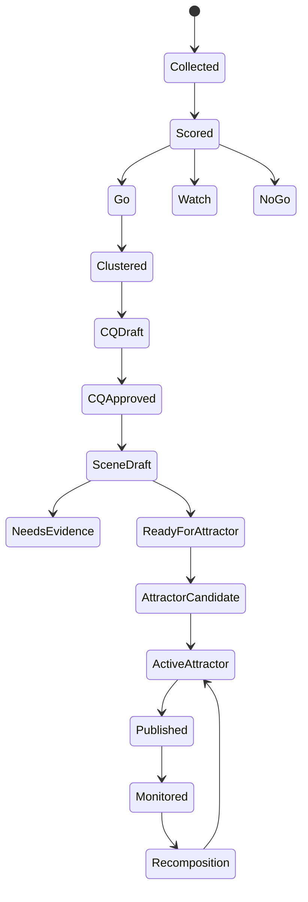

# Question & Pattern Asset Management System PRD

## 0. 제품 한 문장 정의

**Question Pattern Asset OS(QPA-OS)**는 온라인·LLM·수동 입력으로 질문 신호를 수집하고, 이를 QIS 평가·중복 제거·CQ 정본화·QIS Scene 구조화·TCO Entity 추출·Pattern Attractor 승격·발행·모니터링·재구성까지 관리하는 질문 및 패턴 자산 운영 시스템이다.

---

## 1. 배경과 문제 정의

## 1.1 시장/운영 배경

AI검색 시대에는 브랜드·지역·업종·도서·업무 생산성 서비스가 단순 콘텐츠를 많이 보유하는 것만으로는 충분하지 않다. 사람들이 AI에게 실제로 묻는 질문을 자산화하고, 그 질문에 대한 구조화된 답변과 근거, 공식 정보, 사진 근거, 전문가 검수, CTA를 연결해야 한다.

## 1.2 해결해야 할 문제

```text
1. 질문이 흩어져 있다.
검색어, 댓글, 상담 문의, 리뷰, 커뮤니티, LLM 생성 질문이 서로 분리되어 있다.

2. 질문의 가치 평가가 어렵다.
무엇이 매출·방문·상담·학습·AI Visibility에 중요한 질문인지 판단하기 어렵다.

3. 중복 질문이 많다.
표현은 다르지만 같은 의도의 질문이 많다.

4. 질문이 콘텐츠로만 소비된다.
질문을 FAQ 제목으로만 쓰고, 근거·리스크·CTA·패턴 자산으로 확장하지 못한다.

5. 발행 이후 성과 추적이 약하다.
어떤 질문과 패턴이 클릭·상담·예약·구매·AI 언급으로 이어졌는지 모른다.

6. LLM 자동 생성물이 검수 없이 확산된다.
의료·효능·접근성·가격·계약·영업시간 등 리스크가 있는 영역에서 위험하다.
```

---

## 2. 제품 목표

## 2.1 Business Goals

```yaml
business_goals:
  - AI홈피/포털/Answer Card 생성을 위한 질문 자산 공급망 구축
  - 지역·업종·도서·AI Productivity 포털의 공통 질문 엔진 제공
  - 테넌트 무료 Attractor Pack과 월 구독 전환을 지원
  - AI Visibility/AEO/GEO 대응 콘텐츠 자산을 지속 생성
  - 전문가/리뷰어 TrustOps와 연결된 검수 워크플로우 제공
```

## 2.2 Product Goals

```yaml
product_goals:
  - 질문 수집 자동화
  - 질문 품질 평가와 우선순위화
  - CQ/QIS Scene/TCO/Attractor 자산 관리
  - 발행 채널별 출력 자동화
  - 성과 모니터링과 Recomposition 자동화
```

## 2.3 Non-Goals

```yaml
non_goals:
  - 모든 AI검색 노출을 보장하지 않는다.
  - 모든 질문을 자동 발행하지 않는다.
  - 전문가 검수가 필요한 고위험 질문을 자동 승인하지 않는다.
  - 범용 SEO 순위 추적 도구를 대체하지 않는다.
```

---

## 3. 대상 사용자

| 사용자 | 목표 |
|---|---|
| 포털 운영자 | 질문 수집·정제·발행·성과 관리 |
| 브랜드/테넌트 관리자 | 고객 질문, FAQ, 공식 답변, AI홈피 개선 |
| 마케터/SEO/AEO/GEO 담당자 | AI Visibility 질문 포트폴리오와 Answer Surface 관리 |
| 전문가/리뷰어 | 고위험 질문·답변·사진·패턴 검수 |
| 콘텐츠 에디터 | CQ/Scene 기반 Answer Card, FAQ, 카드뉴스 제작 |
| LLM Agent | 질문 정규화, Scene 생성, Attractor 승격 자동 수행 |
| 개발자 | API, DB, 워크플로우, 대시보드 구현 |

---

## 4. 핵심 사용자 시나리오

## 4.1 온라인 자동 수집

```text
운영자가 도메인과 키워드 시드를 등록한다.
시스템이 검색 자동완성, 검색 결과, 커뮤니티, 리뷰, GSC, 사이트 검색어를 수집한다.
LLM이 이를 질문형으로 정규화한다.
QVS/CPS 평가 후 Go/Watch/No-Go로 분류한다.
```

## 4.2 LLM 자동 생성

```text
운영자가 업종, 브랜드, 타깃 고객, 목표 CTA를 입력한다.
LLM이 5-Lens, 멀티페르소나, 역방향 질문 역공학으로 질문 후보를 생성한다.
생성 질문은 source_type = llm_generated로 저장된다.
```

## 4.3 수동 입력

```text
스탭, 테넌트, 전문가가 직접 질문을 입력한다.
입력 시 출처, 업종, 고객 유형, 중요도, 실제 상담 여부를 함께 등록한다.
시스템이 기존 CQ와 중복 여부를 제안한다.
```

## 4.4 CQ 정본화

```text
운영자가 질문 클러스터를 확인한다.
LLM이 대표 질문을 제안한다.
운영자가 수정 후 승인한다.
승인된 CQ는 QIS Scene 생성 후보가 된다.
```

## 4.5 QIS Scene 생성

```text
LLM이 CQ에서 의도, 맥락, 제약, 근거, 리스크, CTA 정책을 추출한다.
고위험 항목은 needs_review 상태로 둔다.
Scene readiness score가 기준 이상이면 Attractor 승격 후보가 된다.
```

## 4.6 Pattern Attractor 승격

```text
반복되는 QIS Scene과 TCO 조합을 시스템이 감지한다.
Promotion Score가 기준 이상이면 Pattern Attractor 후보를 생성한다.
운영자 또는 전문가가 승인하면 Domain Pack에 등록된다.
```

## 4.7 발행과 모니터링

```text
Attractor는 Answer Card, AI홈피, Question Agora, Photo Docent, CTA Surface, 리포트로 발행된다.
사용자의 조회, 클릭, 저장, 전화, 예약, 투표, 전문가 검수 결과를 Run Receipt로 저장한다.
성과가 낮거나 위험한 패턴은 Recomposition Queue로 이동한다.
```

---

## 5. 제품 범위

## 5.1 MVP 범위

| 모듈 | 포함 기능 |
|---|---|
| Collection | 수동 입력, LLM 생성, CSV import, 기본 온라인 수집 커넥터 |
| Signal Store | 원시 질문 저장, source_type, source_payload |
| Scoring | QVS 8D, CPS, Go/Watch/No-Go |
| Dedup | 임베딩 기반 클러스터링, 대표 질문 제안 |
| CQ Manager | CQ 승인/수정/반려, variants 관리 |
| Scene Builder | QIS Scene 자동 생성, risk/evidence/CTA 정책 |
| TCO Extractor | TCO 후보 추출, 기존 Entity 매칭 |
| Attractor Manager | Attractor 후보 생성, 승인, YAML export |
| Publishing | Answer Card, AI홈피 FAQ, Question Agora Thread 생성 |
| Monitoring | 기본 KPI, Run Receipt, Recomposition Queue |

## 5.2 V1 범위

| 모듈 | 포함 기능 |
|---|---|
| Online Collectors | Google/Naver autocomplete, GSC, site search, community import |
| AI Visibility Probe | 플랫폼별 프롬프트 실행 결과 수집 |
| Domain Pack Studio | concepts/attractors/policies/surfaces UI 편집 |
| Expert Review | 전문가/리뷰어 작업 큐 연결 |
| Photo Docent Mission | 질문 기반 사진 근거 요청/생성/검수 |
| Advanced Monitoring | Attractor strength, missing/weak/unsafe 진단 |
| Multi-Locale | ko/en/ja/zh 질문 묶음과 hreflang 전략 |

## 5.3 V2 범위

| 모듈 | 포함 기능 |
|---|---|
| Full Web Crawling | 도메인별 웹 크롤러와 자동 질문 추출 |
| Real-Time Trend Detection | 급상승 질문 탐지 |
| Simulation | AI 답변 내 브랜드 언급/경쟁사 비교 시뮬레이션 |
| Auto Recomposition | CTA/Answer/Scene 자동 A/B 개선 |
| Marketplace | 전문가/리뷰어/테넌트 미션 마켓 |
| Revenue Attribution | 질문/패턴별 리드·매출 기여 추적 |

---

## 6. 핵심 정보 구조

## 6.1 주요 객체

```yaml
objects:
  question_signal:
    description: "원시 질문 후보"
  question_cluster:
    description: "의미적으로 유사한 질문 묶음"
  canonical_question:
    description: "대표 질문, CQ"
  qis_scene:
    description: "CQ의 실행 맥락 명세"
  tco_entity:
    description: "운영 가능한 개념·근거·정책 객체"
  pattern_attractor:
    description: "반복 가능한 질문→답변→CTA 패턴"
  answer_card:
    description: "질문형 발행 콘텐츠"
  agora_thread:
    description: "Question Agora 스레드"
  photo_docent_mission:
    description: "사진 근거 생성/검수 미션"
  run_receipt:
    description: "실행 결과 기록"
  recomposition_task:
    description: "개선 작업"
```

## 6.2 상태 전이



---

## 7. 기능 요구사항

## 7.1 Collection Module

### FR-COL-001: 수동 질문 입력

운영자는 질문을 직접 입력할 수 있어야 한다.

필드:

```yaml
manual_question_input:
  raw_question: required
  domain_id: required
  source_type: manual_input
  source_detail: optional
  persona: optional
  journey_stage: optional
  priority_hint: optional
  tenant_id: optional
  expert_id: optional
```

### FR-COL-002: LLM 질문 생성

운영자는 도메인/브랜드/타깃/목표 CTA를 입력하고 LLM 질문 생성을 실행할 수 있어야 한다.

생성 방식:

```yaml
llm_generation_methods:
  - five_lens
  - persona_recursion
  - reverse_question_engineering
  - blindspot_generation
```

### FR-COL-003: 온라인 수집 커넥터

MVP에서는 최소 CSV/URL import를 지원하고, V1에서 자동 수집을 확장한다.

```yaml
online_collectors_mvp:
  - csv_import
  - url_text_import
  - gsc_query_import_manual
  - review_text_import

online_collectors_v1:
  - search_autocomplete
  - gsc_api
  - site_search_log
  - community_rss_or_scrape
  - ai_visibility_probe
```

---

## 7.2 Scoring Module

### FR-SCO-001: QVS 8D 평가

각 question_signal은 QVS 8차원 점수를 가져야 한다.

### FR-SCO-002: CPS 계산

시스템은 QVS, 볼륨 프록시, TCO match, KG coverage, 리스크 가중치를 통합해 CPS를 계산한다.

### FR-SCO-003: Gate 판정

시스템은 Go/Watch/No-Go를 자동 판정하고, 운영자가 재판정할 수 있어야 한다.

---

## 7.3 Dedup & CQ Module

### FR-CQ-001: 임베딩 중복 제거

의미 유사도 기준으로 question_signal을 클러스터링해야 한다.

### FR-CQ-002: CQ 제안

LLM은 각 cluster에서 대표 질문과 variants를 제안해야 한다.

### FR-CQ-003: CQ 승인 워크플로우

운영자는 CQ를 승인, 수정, 반려, 병합, 분리할 수 있어야 한다.

### FR-CQ-004: CQ URL/Slug 생성

승인된 CQ는 질문 페이지, Answer Card, QAPage URL에 사용할 slug를 가져야 한다.

---

## 7.4 QIS Scene Module

### FR-SCN-001: Scene 자동 생성

LLM은 CQ에서 QIS Scene을 생성해야 한다.

필수 필드:

```yaml
required_scene_fields:
  - intent_model
  - context_tensor
  - evidence_requirements
  - risk_policy
  - answer_policy
  - cta_policy
  - must_do
  - must_not_do
  - output_targets
```

### FR-SCN-002: Readiness Score

Scene은 발행/승격 준비도를 점수화해야 한다.

```text
readiness_score
= evidence_ready 25
+ risk_policy_ready 20
+ cta_ready 20
+ tco_link_ready 20
+ output_target_ready 15
```

### FR-SCN-003: Evidence Gap 자동 감지

Scene이 필요로 하는 근거가 없으면 시스템은 작업 미션을 생성해야 한다.

```yaml
evidence_gap_actions:
  - request_tenant_official_answer
  - create_photo_docent_mission
  - request_expert_review
  - mark_as_needs_evidence
```

---

## 7.5 TCO Module

### FR-TCO-001: TCO 후보 추출

LLM은 Scene에서 TCO Entity 후보를 추출해야 한다.

### FR-TCO-002: 기존 Entity 매칭

시스템은 alias, definition, activation, action_policy, evidence_requirement 유사도를 계산해 기존 Entity와 매칭해야 한다.

### FR-TCO-003: Entity 승인

운영자는 신규 Entity를 승인/병합/반려할 수 있어야 한다.

---

## 7.6 Pattern Attractor Module

### FR-ATR-001: 승격 후보 탐지

시스템은 반복되는 TCO 조합과 고점 QIS Scene을 자동으로 Attractor 후보로 제안해야 한다.

### FR-ATR-002: Attractor 명세 생성

LLM은 다음 10개 섹션을 가진 Attractor를 생성해야 한다.

```yaml
required_attractor_sections:
  - trigger_state
  - concept_state
  - evidence_anchor
  - vibe_signature
  - action_policy
  - media_soliton_rule
  - target_state
  - metrics
  - failure_modes
  - recomposition_rule
```

### FR-ATR-003: Domain Pack Export

Attractor는 YAML로 export/import 가능해야 한다.

### FR-ATR-004: 상태 관리

```yaml
attractor_status:
  - draft
  - active
  - weak
  - unsafe
  - deprecated
  - recomposed
```

---

## 7.7 Publishing Module

### FR-PUB-001: Answer Card 생성

QIS Scene과 Attractor에서 Answer Card를 생성해야 한다.

### FR-PUB-002: AIHompy 반영

AI홈피의 FAQ, Hero, CTA, Photo Docent, Official Answer 섹션에 반영할 수 있어야 한다.

### FR-PUB-003: Question Agora Thread 생성

CQ를 기반으로 Question Agora Thread를 생성해야 한다.

### FR-PUB-004: Photo Docent Mission 생성

사진 근거가 필요한 Scene/Attractor는 Photo Docent Mission을 생성해야 한다.

### FR-PUB-005: Report Item 생성

지역/업종/AI Visibility 리포트 항목으로 변환할 수 있어야 한다.

---

## 7.8 Monitoring Module

### FR-MON-001: Run Receipt 저장

모든 발행물은 노출, 클릭, 피드백, CTA, 검수 결과를 Run Receipt로 저장해야 한다.

### FR-MON-002: Attractor Strength 계산

```text
strength
= avg_fit × 0.30
+ avg_vibe × 0.20
+ avg_policy × 0.25
+ evidence_coverage × 0.15
+ cta_performance × 0.10
```

### FR-MON-003: Gap Analyzer

시스템은 다음 상태를 자동 진단해야 한다.

```yaml
gap_status:
  - missing_attractor
  - weak_attractor
  - misaligned_attractor
  - unsafe_attractor
  - missing_evidence
  - missing_official_answer
  - missing_photo_docent
```

### FR-MON-004: Recomposition Queue

성과가 낮거나 위험한 자산은 개선 큐에 들어가야 한다.

---

## 8. UI/UX 요구사항

## 8.1 주요 화면

```yaml
pages:
  /qis/signals:
    purpose: "질문 신호 수집·목록·필터"
  /qis/clusters:
    purpose: "중복 클러스터와 CQ 후보 관리"
  /qis/canonical-questions:
    purpose: "CQ 승인·수정·상태 관리"
  /qis/scenes:
    purpose: "QIS Scene 생성·검수·근거 Gap 관리"
  /tco/entities:
    purpose: "TCO Entity 관리"
  /patterns/attractors:
    purpose: "Pattern Attractor Library"
  /patterns/domain-packs:
    purpose: "Domain Pack YAML 관리"
  /publishing/queue:
    purpose: "Answer Card, AIHompy, Agora 발행 큐"
  /monitoring:
    purpose: "성과·Run Receipt·Gap Analyzer"
  /recomposition:
    purpose: "개선 작업 큐"
```

## 8.2 Signal Table 필터

```yaml
filters:
  - domain_id
  - source_type
  - gate_status
  - qvs_score_range
  - cps_score_range
  - status
  - language
  - persona
  - journey_stage
  - collected_date
```

## 8.3 CQ Editor

필수 기능:

```text
원시 질문 클러스터 보기
대표 질문 수정
variants 관리
의도/제약/근거 태그 수정
CQ 승인/반려/병합/분리
Scene 생성 버튼
```

## 8.4 Scene Editor

필수 탭:

```text
Intent
Context Tensor
Evidence
Risk Policy
Answer Policy
CTA Policy
Output Targets
TCO Links
Readiness
```

## 8.5 Attractor Editor

필수 탭:

```text
Trigger
Concepts
Evidence
Vibe
Action Policy
Media Soliton
Metrics
Failure Modes
Recomposition
YAML Preview
```

---

## 9. 도메인별 적용 요구사항

## 9.1 Local SMB

```yaml
required_outputs:
  - place_linked_answer_card
  - map_cta
  - call_cta
  - official_answer
  - photo_docent_mission
  - local_business_schema
key_risks:
  - opening_hours
  - parking_claim
  - accessibility_claim
```

## 9.2 Wedding

```yaml
required_outputs:
  - portfolio_docent
  - consultation_faq
  - quote_request_cta
  - contract_risk_checklist
key_risks:
  - additional_fee
  - refund_policy
  - original_delivery
  - retouching_claim
```

## 9.3 Skincare/Cosmetics

```yaml
required_outputs:
  - ingredient_faq
  - routine_card
  - claim_guard_report
  - product_photo_docent
key_risks:
  - medical_claim
  - functional_claim_without_evidence
  - before_after_overclaim
  - irritation_warning_missing
```

## 9.4 Book / Sunzi

```yaml
required_outputs:
  - interpretation_card
  - modern_application_card
  - discussion_questions
  - workshop_cta
key_risks:
  - historical_overclaim
  - unethical_application
  - quote_source_confusion
```

## 9.5 AI Productivity / TASKFLOW

```yaml
required_outputs:
  - taskflow_template
  - prompt_template
  - output_checklist
  - expert_review_cta
key_risks:
  - confidential_data
  - hallucinated_facts
  - legal_medical_financial_advice
```

---

## 10. API 요구사항

```yaml
api_endpoints:
  - POST /api/v1/qis/signals/collect
  - POST /api/v1/qis/signals/generate
  - POST /api/v1/qis/signals/score
  - POST /api/v1/qis/signals/deduplicate
  - POST /api/v1/qis/clusters/{id}/promote-to-cq
  - POST /api/v1/qis/canonical-questions/{id}/build-scene
  - POST /api/v1/qis/scenes/{id}/extract-tco
  - POST /api/v1/qis/scenes/{id}/promote-attractor
  - POST /api/v1/patterns/attractors/{id}/publish
  - GET /api/v1/monitoring/run-receipts
  - POST /api/v1/recomposition/tasks/{id}/apply
```

---

## 11. 권한 모델

```yaml
roles:
  admin:
    permissions:
      - all
  operator:
    permissions:
      - collect
      - score
      - approve_cq
      - build_scene
      - publish
  expert:
    permissions:
      - review_scene
      - review_answer
      - add_evidence
  reviewer:
    permissions:
      - review_photo_docent
      - verify_evidence
      - flag_risk
  tenant:
    permissions:
      - submit_questions
      - approve_official_answers
      - upload_photos
  viewer:
    permissions:
      - view_published_assets
```

---

## 12. 성공 지표

## 12.1 30일 MVP KPI

```yaml
mvp_30d_kpi:
  question_signals_collected: 1500
  qvs_scored: 800
  canonical_questions: 150
  qis_scenes: 80
  tco_entities_linked: 120
  pattern_attractors: 25
  answer_cards: 200
  published_assets: 100
  run_receipts_logged: 500
```

## 12.2 품질 KPI

```yaml
quality_kpi:
  duplicate_reduction_rate: ">= 50%"
  cq_approval_rate: ">= 60%"
  scene_readiness_avg: ">= 70"
  evidence_coverage: ">= 60%"
  unsafe_asset_publication: "0"
```

## 12.3 사업 KPI

```yaml
business_kpi:
  free_pack_generated: 100
  tenant_onboarded: 50
  paid_conversion: 10
  cta_click_rate: ">= 3%"
  expert_review_completed: 50
```

---

## 13. 리스크와 대응

| 리스크 | 설명 | 대응 |
|---|---|---|
| LLM 환각 | 질문/근거/답변을 꾸며낼 수 있음 | source_type, evidence hash, HITL |
| 과장 표현 | 효능·성과·접근성·가격 보장 | Policy Guard |
| 중복 폭증 | 유사 질문이 너무 많음 | embedding clustering |
| 운영 과부하 | 검수 큐 증가 | priority score, batching |
| 무가치 질문 축적 | 전환과 무관한 질문 누적 | QVS/CPS gate |
| AI Visibility 보장 오해 | AI 노출을 보장한다고 오해 | Readiness 중심 표현 |

---

## 14. 출시 로드맵

## Phase 0. Internal Alpha, 2주

```text
수동 입력
LLM 생성
QVS/CPS
CQ Manager
Scene Builder
Attractor Draft
Answer Card Draft
```

## Phase 1. MVP, 30일

```text
온라인 import
중복 클러스터
TCO Extractor
Attractor Manager
AIHompy/Answer Card/Agora 발행
기본 Monitoring
```

## Phase 2. Growth, 60~90일

```text
AI Visibility Probe
Photo Docent Mission
Expert TrustOps 연동
Domain Pack Studio
Recomposition Queue
```

## Phase 3. Platform, 6개월

```text
다국어 질문 자산
자동 트렌드 감지
Revenue Attribution
Expert Marketplace
Cross-Portal Pattern Library
```

---

## 15. 최종 제품 정의

**Question Pattern Asset OS**는 질문을 콘텐츠 소재가 아니라 AI검색 시대의 핵심 운영 자산으로 다룬다. 이 시스템은 질문을 수집하고, 평가하고, 정본화하고, 실행 장면으로 구조화하고, TCO Entity와 Pattern Attractor로 승격하며, AI홈피·Answer Card·Question Agora·Photo Docent·CTA Surface로 발행하고, 성과 데이터를 기반으로 지속적으로 재구성한다.
