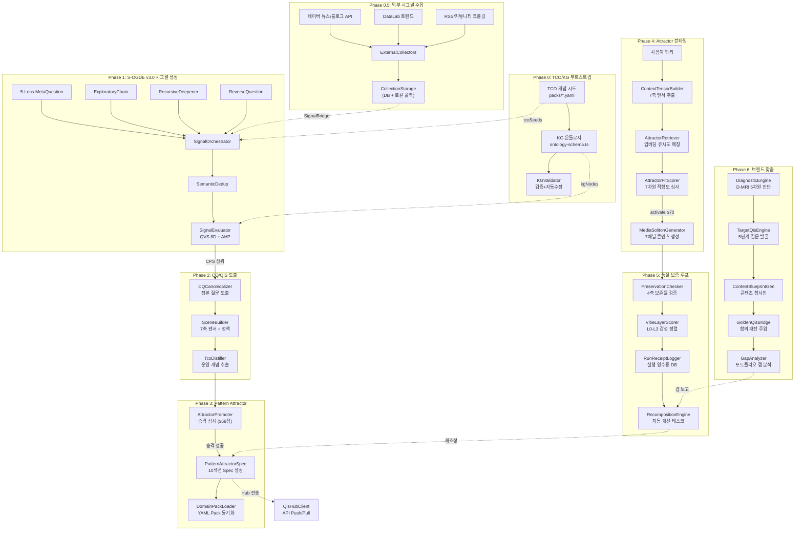
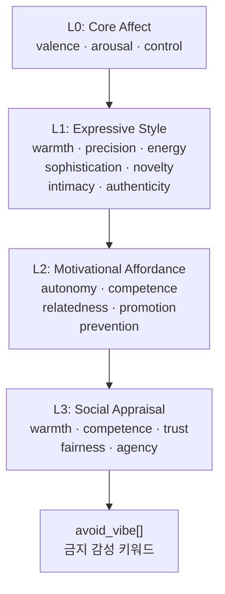
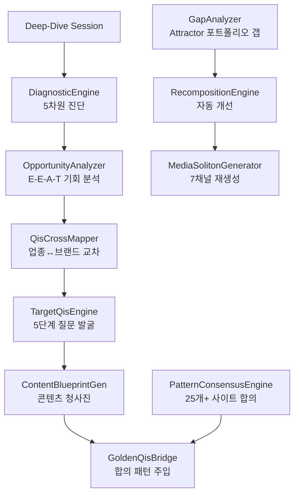
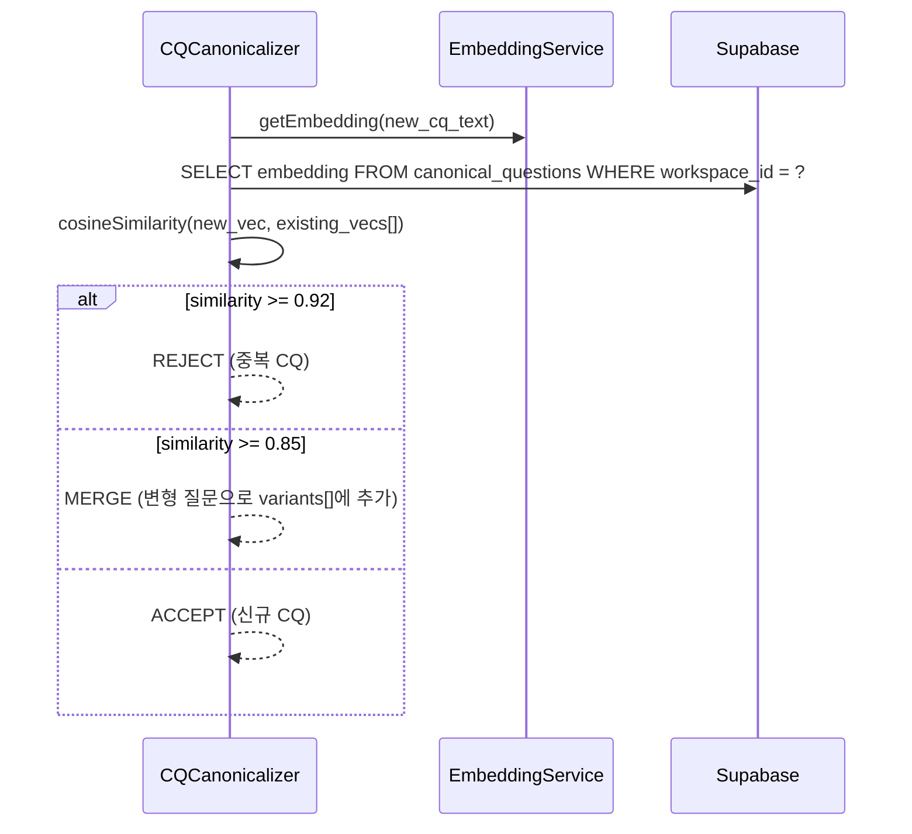
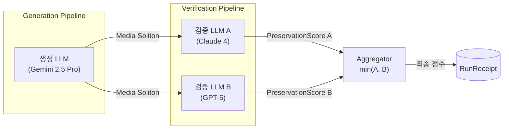
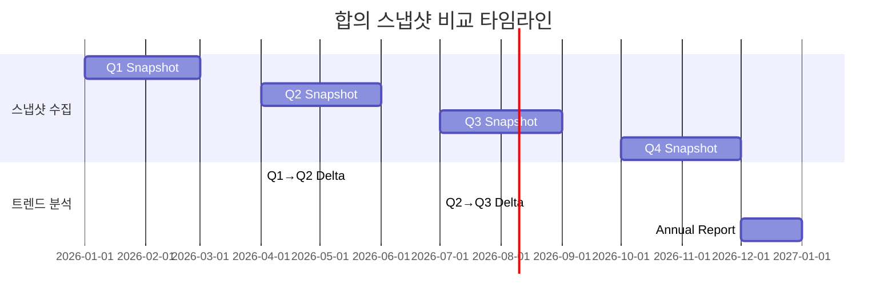
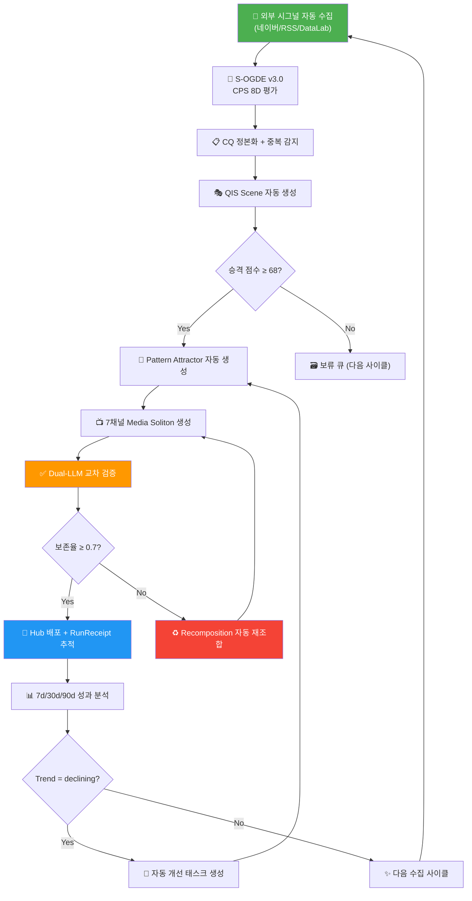

# BSW-OS 핵심 기능 통합 정밀 감사 보고서

> **감사 일시**: 2026-07-14  
> **감사 범위**: TCO/KG 노드 도출 · 시그널 수집 · CQ 도출 · QIS/Scene 도출 · Pattern Attractor 도출 · Vibe-OS · 브랜드 맞춤 QIS/Attractor · 콘텐츠 패키지 생성  
> **감사 방법**: 전체 소스코드 라인 단위 정밀 분석 + 데이터 흐름 추적 + 테스트 커버리지 검증  
> **분석 파일**: 60+ 소스 파일, 15,000+ 라인

---

## 목차

1. [시스템 아키텍처 총론](#1-시스템-아키텍처-총론)
2. [Module 1: TCO 개념 및 지식 그래프 노드 도출](#2-module-1-tco-개념-및-지식-그래프-노드-도출)
3. [Module 2: 시그널 수집 (Signal Collection)](#3-module-2-시그널-수집-signal-collection)
4. [Module 3: CQ (Canonical Question) 도출](#4-module-3-cq-canonical-question-도출)
5. [Module 4: QIS / QIS Scene 도출](#5-module-4-qis--qis-scene-도출)
6. [Module 5: Pattern Attractor 도출 시스템](#6-module-5-pattern-attractor-도출-시스템)
7. [Module 6: Vibe-OS 및 Media Soliton 콘텐츠 패키지 생성](#7-module-6-vibe-os-및-media-soliton-콘텐츠-패키지-생성)
8. [Module 7: 브랜드 맞춤 QIS/Attractor 및 콘텐츠 청사진](#8-module-7-브랜드-맞춤-qisattractor-및-콘텐츠-청사진)
9. [크로스커팅 관심사](#9-크로스커팅-관심사)
10. [감사 종합 평가](#10-감사-종합-평가)

---

## 1. 시스템 아키텍처 총론

### 1.1 End-to-End 데이터 흐름



### 1.2 핵심 디렉토리 구조

| 모듈 | 디렉토리 | 파일 수 | 총 바이트 |
|------|----------|---------|----------|
| Pattern Attractor | [lib/pattern-attractor/](file:///c:/Users/User/bsw/lib/pattern-attractor) | 10 | ~56KB |
| Vibe-OS | [lib/vibe-os/](file:///c:/Users/User/bsw/lib/vibe-os) | 2 | ~6KB |
| Vibe (Semantic) | [lib/vibe/](file:///c:/Users/User/bsw/lib/vibe) | 1 | ~4KB |
| Golden Reference | [lib/golden/](file:///c:/Users/User/bsw/lib/golden) | 10 | ~157KB |
| Signal Collection | [lib/signal-collection/](file:///c:/Users/User/bsw/lib/signal-collection) | 15 | ~90KB |
| QIS | [lib/qis/](file:///c:/Users/User/bsw/lib/qis) | 8 | ~55KB |
| Deep-Dive (Brand) | [lib/deep-dive/](file:///c:/Users/User/bsw/lib/deep-dive) | 9 | ~52KB |
| Persona | [lib/persona/](file:///c:/Users/User/bsw/lib/persona) | 9 | ~50KB |
| Pipeline Config | [lib/pipeline/](file:///c:/Users/User/bsw/lib/pipeline) | 5 | ~40KB |
| Pack System | [packs/](file:///c:/Users/User/bsw/packs) | 4 YAML | ~9KB |

---

## 2. Module 1: TCO 개념 및 지식 그래프 노드 도출

### 2.1 데이터 모델

#### TCO 개념 타입
- **파일**: [tco-kg-mapper.ts](file:///c:/Users/User/bsw/lib/knowledge-graph/tco-kg-mapper.ts#L16-L21)

```typescript
interface TCOConcept { id: string; concept_name: string; definition: string; }
```

#### TCO Enriched 개념 (Phase T 결과물)
- **파일**: [tco-concept-enricher.ts](file:///c:/Users/User/bsw/lib/signal-collection/tco-concept-enricher.ts#L11-L17)

```typescript
interface EnrichedConcept {
  concept_name: string; definition: string;
  is_strategic: boolean; importance_weight: number; // 0.3–0.9
  source_signal_indices: number[];
}
```

### 2.2 온톨로지 스키마 (INDUSTRY_ONTOLOGY_SCHEMA)

- **파일**: [ontology-schema.ts](file:///c:/Users/User/bsw/lib/knowledge-graph/ontology-schema.ts#L25-L45)

| 노드 타입 | 레벨 | 최대 부모 수 | 필수 엣지 |
|-----------|------|-------------|----------|
| `concept` | class | 3 | - |
| `product` / `service` | instance | 2 | `is_a` |
| `concern` | class | 2 | - |
| `process` | instance | 1 | `part_of` |
| `regulation` | class | 1 | - |
| `persona` | instance | 0 | - |

| 관계 타입 | 도메인 → 범위 | 이행적 |
|-----------|-------------|--------|
| `is_a` | instance → class | ✅ |
| `part_of` | class/instance → class | ✅ |
| `resolves_question` | concept/product/service → concern | ❌ |
| `causes` | concern/process → concern | ❌ |
| `requires` | product/service → process/regulation | ❌ |
| `competes_with` | product/service → product/service | ❌ |
| `targets_persona` | product/service/concern → persona | ❌ |

### 2.3 KG 검증 엔진 (`KGValidator`)

| 검증 함수 | 알고리즘 | 자동 수정 |
|-----------|---------|----------|
| `detectCycles()` | DFS 사이클 탐지 | ❌ (감지만) |
| `findOrphanNodes()` | degree=0 필터링 | ❌ |
| `validateTypeConstraints()` | 도메인/범위 규칙 | ✅ 위반 엣지 제거 |
| `checkRequiredEdges()` | 필수 관계 확인 | ❌ |
| `findDuplicateEdges()` | 키 중복 검사 | ✅ 중복 제거 |
| `validateAndFix()` | **통합** | 부분적 |

### 2.4 TCO ↔ KG 매핑 (`TcoKgMapper`)

| 메서드 | 알고리즘 | 임계값 |
|--------|---------|--------|
| `autoMap()` | 임베딩 코사인 유사도 | ≥0.85: exact, ≥0.75: broader, ≥0.70: related |
| `calcCoverage()` | 문자열 포함 매칭 | 3개 이상 매칭 시 만점(10) |
| `semanticMatch()` | 임베딩 유사도 | threshold=0.75 기본 |

> [!IMPORTANT]
> `autoMap()` 임베딩 실패 시 정확/부분 문자열 매칭 fallback (confidence=0.80 고정)

### 2.5 TCO 자동 보강 (`TcoConceptEnricher`)

- **LLM 프롬프트**: TF8 8-Block Framework (T→K→W→O→F)
- **제약**: 미매칭 시그널 ≥5개일 때만 동작, 최소 2개 시그널 속하는 클러스터만, 최대 15개, 기존 TCO 70%+ 중복 금지

### 2.6 TCO 커버리지 메트릭스

| 메트릭 | 수식 | 의미 |
|--------|------|------|
| `coverage` | matched / total signals | 시그널의 TCO 매핑률 |
| `conceptUtilization` | used / total concepts | TCO 개념의 활용률 |
| `blindSpotSignals` | 상위 20개 미매핑 시그널 | Phase T 대상 |
| `underutilizedConcepts` | 시그널 미매핑 TCO | 불필요 개념 후보 |

### 2.7 감사 결과

> [!TIP]
> **강점**: 온톨로지 스키마 기반 엄격한 KG 검증(DFS, 도메인/범위, 필수 관계). 임베딩+문자열 이중 안전장치.

> [!WARNING]
> **한계**: `calcCoverage()`는 의미적 매칭 미사용. `validateAndFix()`에서 순환 참조 감지만 하고 제거 안함.

---

## 3. Module 2: 시그널 수집 (Signal Collection)

### 3.1 외부 수집 소스 (4종)

| 수집기 | 소스 | 제한 |
|--------|------|------|
| `collectNaverNews()` | 네이버 OpenAPI News | 키워드당 10건 × 3키워드 |
| `collectNaverBlog()` | 네이버 OpenAPI Blog | 키워드당 10건 × 3키워드 |
| `collectNaverDatalab()` | 네이버 DataLab | 최근 2주 × 5키워드 |
| `collectRss()` + `collectCommunity()` | RSS/HTML 크롤링 | 최대 15개 + 합성 보강 |

- **사전 등록 소스**: beauty(7개), jeju_smb(4개) — [collection-storage.ts](file:///c:/Users/User/bsw/lib/signal-collection/collection-storage.ts#L57-L158)

### 3.2 S-OGDE v3.0 파이프라인 (7단계)

```
Phase G (MetaQuestion 5-Lens) → Phase D1 (ExploratoryChain) → Phase D2 (RecursiveDeepener)
→ Phase R (ReverseChaining) → Fallback (패널 데이터) → Phase DD (SemanticDedup)
→ Phase E (QVS 8D 평가 + CPS) → Phase T (TCO Enrichment)
```

### 3.3 CPS (Composite Promotion Score) 공식

$$CPS = 0.30 × QVS_{norm} + 0.25 × Vol_{norm} + 0.20 × \frac{TCO_{match}}{10} + 0.15 × \frac{KG_{cov}}{10} + 0.10 × W_{YMYL}$$

### 3.4 QVS 8차원 + AHP 가중치

| 차원 | 가중치 | 차원 | 가중치 |
|------|--------|------|--------|
| relevance | 0.18 | snippet_fitness (AEO) | 0.15 |
| conversion | 0.18 | opportunity | 0.12 |
| specificity | 0.10 | entity_clarity (GEO) | 0.10 |
| urgency | 0.07 | multi_engine_consistency | 0.10 |

### 3.5 시그널 브릿지 (3경로)

| 경로 | 메서드 | 기능 |
|------|--------|------|
| 1 | `buildContextChunks()` | external_signals → VOCChunk[] LLM 컨텍스트 주입 |
| 2 | `convertExternalToQuestionSignals()` | external_signals → question_signals 직접 변환 |
| 3 | `enrichVolumeFromTrends()` | search_trends → question_signals volume 보정 |

### 3.6 감사 결과

> [!TIP]
> **강점**: 체계적 7단계 파이프라인 + 4종 외부 수집 + 8차원 AHP 평가 + CPS 복합 스코어

> [!CAUTION]
> **보안 이슈**: 네이버 API 키가 [external-collectors.ts L14-15](file:///c:/Users/User/bsw/lib/signal-collection/external-collectors.ts#L14-L15)에 하드코딩
> **한계**: RSS 파싱이 정규식 기반, 커뮤니티 합성 데이터가 skincare에 하드코딩

---

## 4. Module 3: CQ (Canonical Question) 도출

### 4.1 CQ 정본화 (`CQCanonicalizer`)

- **파일**: [cq-canonicalizer.ts](file:///c:/Users/User/bsw/lib/qis/cq-canonicalizer.ts)

#### CQ 출력 구조

| 필드 | 타입 | 설명 |
|------|------|------|
| `canonical_question` | string | 정본화된 대표 질문 |
| `variants` | string[] | 동일 의도의 변형 질문들 |
| `primary_intent` | string | 주 검색 의도 |
| `user_context` | object | persona_hints, journey_stage |
| `constraints` | string[] | 지역/상황/핵심 의도 제약 |
| `evidence_need` | string[] | 필요 증거 유형 |
| `risk_level` | enum | low / medium / high / critical |
| `linked_tco_entities` | string[] | 연관 TCO 엔티티 |
| `cps_score` | number | 복합 우선순위 점수 |

### 4.2 감사 결과

> [!TIP]
> **강점**: TCO 엔티티 자동 연결, 위험 수준/증거 유형/사용자 컨텍스트 통합 추출

> [!WARNING]
> **한계**: N회 반복 신뢰도 검증 미적용, 기존 CQ와 중복 감지 로직 부재

---

## 5. Module 4: QIS / QIS Scene 도출

### 5.1 QIS Scene 빌더 (`SceneBuilder`)

- **파일**: [scene-builder.ts](file:///c:/Users/User/bsw/lib/qis/scene-builder.ts)

| Scene 섹션 | 핵심 필드 |
|-----------|----------|
| **intent_model** | primary, secondary[] |
| **context_tensor** | 7축 컨텍스트 텐서 |
| **evidence_requirements** | 안전 답변에 필요한 사실/문서 |
| **risk_policy** | risk_level, blocked_claims, disclaimers |
| **answer_policy** | short_answer_rule, detail_structure |
| **cta_policy** | primary/secondary/blocked CTA |
| **must_do / must_not_do** | 필수/금지 사항 |
| **readiness_score** | 0-100 준비도 |

### 5.2 3축 라우터 (`TriAxisRouter`)

| 축 | 설명 | 추천 포맷 |
|----|------|----------|
| **industry** | 업종 일반 | expert_column, how_to, data_brief |
| **place** | 지역 기반 | case_study, comparison, answer |
| **vortex** | 테마 DAO | answer, expert_column |
| **cross_axis** | 교차 | answer, case_study, expert_column |

### 5.3 QIS 공유 스키마 (`qis-shared-schemas.ts`)

26가지 signal_type, 8가지 metric_type, 5종 Zod 검증 스키마 (Signal, PredictedQuestion, RealMetrics, ExpectedLayer, Feedback)

### 5.4 감사 결과

> [!TIP]
> **강점**: risk_policy + answer_policy + cta_policy 포함 완전한 "답변 제어 사양서"

> [!WARNING]
> **한계**: TriAxisRouter 키워드 감지가 `includes()` 기반 — 부분 매칭 오류 가능

---

## 6. Module 5: Pattern Attractor 도출 시스템

### 6.1 Pattern Attractor 타입 체계

- **파일**: [types.ts](file:///c:/Users/User/bsw/lib/pattern-attractor/types.ts)

#### 9종 Attractor 유형

| 유형 | 설명 |
|------|------|
| `discovery` | 브랜드 발견/탐색 가이드 |
| `problem_clarification` | 문제 명확화 |
| `anxiety_reducer` | 불안 해소 |
| `trust` | 신뢰 구축 |
| `evidence` | 증거 기반 설득 |
| `comparison_anchor` | 비교 앵커 |
| `aspiration` | 욕구 자극 |
| `conversion_trigger` | 전환 트리거 |
| `ecosystem` | 생태계 통합 |

#### PatternAttractorSpec 10섹션 구조

```mermaid
graph LR
    A["trigger_state<br>질문 패턴+컨텍스트+리스크"] --> B["concept_state<br>필수/허용/금지 개념"]
    B --> C["evidence_anchor<br>필수 소스+주장 강도"]
    C --> D["vibe_signature<br>L0-L3 4계층 감성"]
    D --> E["action_policy<br>CTA+안전 정책"]
    E --> F["media_soliton_rule<br>7채널 적응 규칙"]
    F --> G["target_state<br>인지/감정/동기/행동"]
    G --> H["metrics<br>KPI 추적"]
    H --> I["failure_modes<br>실패 조건"]
    I --> J["recomposition_rule<br>실패 시 재조합"]
```



#### 7축 Context Tensor

```typescript
interface ContextTensor {
  domain: string;           // 도메인 슬러그
  user_state: string;       // 사용자 상태 서술
  risk_state: 'low' | 'medium' | 'high' | 'uncertain';
  intent_state: string;     // 의도 서술
  evidence_state: string;   // 필요 증거 유형
  time_state: string;       // 시간적 요인
  channel_state: ChannelType; // 7개 채널 중 1개
}
```

#### 8종 Gap 유형

| Gap 유형 | 설명 |
|----------|------|
| `missing_attractor` | 패턴 완전 부재 |
| `weak_attractor` | 준비도 낮음 (<60%) |
| `misaligned_attractor` | Vibe/CTA 정렬 불일치 |
| `overused_attractor` | 과다 사용 |
| `unsafe_attractor` | 안전 정책 위반 |
| `broken_media_soliton` | 채널 변환 손실 |
| `conversion_gap` | 전환 경로 결함 |
| `trust_gap` | 신뢰 구축 부족 |

### 6.2 Attractor 승격 시스템 (`AttractorPromoter`)

- **파일**: [attractor-promoter.ts](file:///c:/Users/User/bsw/lib/qis/attractor-promoter.ts)

#### Promotion Score 공식 (100점 만점)

| 항목 | 가중치 | 산출 |
|------|--------|------|
| QIS CPS | 25% | cps_score × 0.25 |
| 클러스터 크기 | 20% | min(100, size×10) × 0.20 |
| TCO 반복도 | 15% | min(10, entities.length) × 10 × 0.15 |
| 구현 가능성 | 15% | **고정값 75** × 0.15 |
| 증거 유무 | 10% | (증거 있으면 90, 없으면 30) × 0.10 |
| CTA 유무 | 10% | (primary CTA 있으면 90, 없으면 30) × 0.10 |
| 전략적 가치 | 5% | **고정값 80** × 0.05 |

- **승격 임계값**: ≥ 68.0
- **승격 시**: LLM으로 10섹션 전체 `PatternAttractorSpec` JSON 자동 생성 (temperature=0.1)

### 6.3 Attractor 검색 (`AttractorRetriever`)

- **파일**: [attractor-retriever.ts](file:///c:/Users/User/bsw/lib/pattern-attractor/attractor-retriever.ts)

#### 4단계 검색 파이프라인

| 단계 | 로직 | 상세 |
|------|------|------|
| 1. DB 조회 | Supabase `pattern_attractors` | status=active, domain/brand 필터 |
| 2. 임베딩 유사도 | 쿼리 vs trigger patterns | 코사인 유사도, batch 임베딩 |
| 3. 임계값 필터 | threshold ≥ 0.50 | 문자열 fallback (0.8/0.2) |
| 4. 컨텍스트 보정 | risk mismatch -5%/level, intent match +10% | 최종 정렬 후 top-N |

> [!IMPORTANT]
> `brand_id` 지정 시 도메인 표준 + 브랜드 전용 Attractor를 함께 조회합니다.

### 6.4 Attractor 적합도 평가 (`AttractorFitScorer`)

- **파일**: [attractor-fit-scorer.ts](file:///c:/Users/User/bsw/lib/pattern-attractor/attractor-fit-scorer.ts)

#### 7차원 적합도 점수 체계 (100점 만점)

| 차원 | 배점 | 설명 |
|------|------|------|
| `concept_match` | 0-20 | 필수 개념 매칭 정도 |
| `vibe_requirement_fit` | 0-20 | 목표 Vibe Signature 정렬도 |
| `context_fit` | 0-15 | 컨텍스트 텐서 부합도 |
| `intent_fit` | 0-15 | 의도 상태 정렬도 |
| `risk_policy_fit` | 0-15 | 안전 정책 정합도 |
| `evidence_availability` | 0-15 | 증거 가용성 |
| `forbidden_condition_penalty` | 0-30 (차감) | 금지 조건 위반 페널티 |

#### Gate 판정

```
total_score = Σ(6차원) - forbidden_penalty → clamp [0, 100]
  ≥ 70 → "activate" (즉시 활성화)
  ≥ 40 → "conditional" (조건부 활성화)
  < 40 → "skip" (건너뜀)
```

> [!TIP]
> **핵심 안전장치**: LLM의 gate 판정을 신뢰하지 않고, `clampedTotal`에서 직접 재계산합니다 ([L91-96](file:///c:/Users/User/bsw/lib/pattern-attractor/attractor-fit-scorer.ts#L91-L96)).

### 6.5 Context Tensor 빌더

- **파일**: [context-tensor-builder.ts](file:///c:/Users/User/bsw/lib/pattern-attractor/context-tensor-builder.ts)

| 메서드 | 입력 | 출력 |
|--------|------|------|
| `buildFromQuery()` | query + domainSlug + channelType | LLM 기반 7축 텐서 |
| `fromQvsResult()` | QVS 평가 결과 | 결정적 텐서 변환 (YMYL→high, Watch→medium) |

### 6.6 Domain Pack 시스템 (`DomainPackLoader`)

- **파일**: [domain-pack-loader.ts](file:///c:/Users/User/bsw/lib/pattern-attractor/domain-pack-loader.ts)
- **Pack 디렉토리**: [packs/](file:///c:/Users/User/bsw/packs)

#### YAML Pack 구조

| 파일 | 역할 | 실제 예시 |
|------|------|----------|
| `domain.yaml` | 도메인 메타데이터 | id, name, version |
| `attractors.yaml` | Attractor Spec 사전 정의 | 2개 active 정의 (discovery+ecosystem, conversion_trigger+anxiety_reducer) |
| `concepts.yaml` | TCO 개념 시드 | brand_core_concept, low_pressure_cta 등 |
| `policies.yaml` | 정책 가드레일 | allowed/blocked 액션, CTA 정책, 안전 정책 |

#### DB 동기화 프로세스 (`syncToDatabase`)

```
1. domains 테이블에 도메인 upsert
2. tco_concepts 테이블에 개념 upsert
3. pattern_attractors 테이블에 Attractor upsert
   → policies.yaml의 기본 정책으로 빈 필드 자동 채움
```

> [!NOTE]
> Attractor의 `action_policy`가 비어있으면 `policies.yaml`의 글로벌 정책으로 자동 병합됩니다.

### 6.7 사전 정의된 Attractor 예시

- **파일**: [attractors.yaml](file:///c:/Users/User/bsw/packs/aihompy-brand-ssot/attractors.yaml)

````carousel
**Attractor 1: `ai_readable_brand_discovery`**
- **유형**: discovery + ecosystem
- **트리거**: "이 브랜드가 무엇을 잘하나요?", "What makes this brand special?"
- **필수 개념**: brand_core_concept, service_scope
- **Vibe**: calm_positive, high control, high authenticity
- **금지 Vibe**: exaggeration, false_credibility
- **7채널 적응**:
  - homepage: "1분 만에 이해하는 브랜드 철학과 실체"
  - answer_card: AEO 최적화 정본 답변
  - chatbot: 대화형 가이드
  - cardnews: 3가지 핵심 슬라이드
  - ad: 근거 원문 기반 광고 카피
  - llm_txt: 기계 판독용 브랜드 정의
<!-- slide -->
**Attractor 2: `consultation_conversion_comfort`**
- **유형**: conversion_trigger + anxiety_reducer
- **트리거**: "상담하면 부담스럽지 않을까요?", "영업 전화를 계속 받을까 봐 걱정돼요"
- **필수 개념**: low_pressure_cta
- **금지 개념**: product_cta.push_purchase_under_uncertainty
- **Vibe**: high warmth, high intimacy, high prevention_frame
- **금지 Vibe**: commercial_pressure, panic
- **핵심 약속**: "동의 없는 후속 연락 절대 없음" → 7채널 변주
````

### 6.8 Attractor 도출 시스템 감사 결과

> [!TIP]
> **강점**:
> - PatternAttractorSpec의 10섹션이 trigger→concept→evidence→vibe→action→media→target→metrics→failure→recomposition의 **완전한 콘텐츠 제어 사양서**로 설계됨
> - AttractorFitScorer에서 LLM gate 판정을 불신하고 직접 재계산하는 **인간-AI 신뢰 보정** 구현
> - DomainPackLoader의 YAML→DB 양방향 동기화로 선언적 Attractor 관리 가능
> - 4단계 검색 파이프라인(DB→임베딩→임계값→컨텍스트보정)의 정교한 후보 선별

> [!WARNING]
> **잔여 한계**:
> - AttractorRetriever의 임계값 0.50이 모든 도메인에 동일 → 도메인별 적응형 임계값 필요
> - DomainPackLoader에서 YAML 파싱 에러 시 전체 syncToDatabase가 중단됨 (부분 실패 복구 없음)

> [!TIP]
> **v2 개선 완료 (2026-07-14)**:
> - ✅ `AttractorPromoter` 고정값(`feasibilityPart=75`, `strategicPart=80`) → `domain_maturity_level`, `strategic_alignment` 옵션 필드 기반 동적 산정으로 교체
> - ✅ `batchScore()` 빈 증거 배열 전달 → 각 Attractor의 `evidence_anchor.required_sources` 자동 추출 주입

---

## 7. Module 6: Vibe-OS 및 Media Soliton 콘텐츠 패키지 생성

### 7.1 Vibe Signature 4계층 모델

- **파일**: [types.ts](file:///c:/Users/User/bsw/lib/pattern-attractor/types.ts#L31-L58)



| 계층 | 차원 수 | 스케일 | 이론적 기반 |
|------|---------|--------|------------|
| L0 Core Affect | 3 (valence, arousal, control) | 문자열 + low/medium/high | Russell's Circumplex |
| L1 Expressive Style | 7 (warmth~authenticity) | low/medium/high | 표현론적 미학 |
| L2 Motivational Affordance | 5 (autonomy~prevention) | low/medium/high | Self-Determination Theory |
| L3 Social Appraisal | 5 (warmth~agency) | low/medium/high | Stereotype Content Model |

### 7.2 Vibe Layer Scorer

- **파일**: [vibe-layer-scorer.ts](file:///c:/Users/User/bsw/lib/vibe-os/vibe-layer-scorer.ts)
- **입력**: 콘텐츠 텍스트 + 목표 VibeSignature + 도메인 컨텍스트
- **출력**: `VibeAssessmentResult`

| 출력 필드 | 설명 |
|----------|------|
| `layer_scores[]` | 각 차원별: 관측 근거, 해석, 점수, 신뢰도, 불확실성, 검증 방법 |
| `overall_alignment` | 0-1 전체 정렬도 |
| `misaligned_dimensions` | 불일치 차원 목록 |
| `avoid_vibe_violations` | 금지 감성 위반 목록 |

### 7.3 Vibe Alignment Checker

- **파일**: [vibe-alignment-checker.ts](file:///c:/Users/User/bsw/lib/vibe-os/vibe-alignment-checker.ts)
- **기능**: VibeAssessment 결과에서 불일치 레이어 그룹화 + avoid_vibe 위반당 -20% 페널티 적용
- **출력**: alignment_score, misaligned_layers, recommendations

### 7.4 Semantic Vibe Alignment (벡터 기반)

- **파일**: [semantic-alignment.ts](file:///c:/Users/User/bsw/lib/vibe/semantic-alignment.ts)
- **알고리즘**: 3072차원 임베딩 코사인 유사도 (Vibe Spec guide text vs Semantic Page content)
- **캐싱**: `embedding_cache` DB 테이블 활용, 컨텐츠 해시 기반 이중 캐시 확인
- **`batchAlignmentScan()`**: 워크스페이스 전체 페이지 일괄 정렬 검사 + 점수 내림차순 정렬

### 7.5 Media Soliton Generator

- **파일**: [media-soliton-generator.ts](file:///c:/Users/User/bsw/lib/pattern-attractor/media-soliton-generator.ts)

#### 7채널 콘텐츠 생성 규칙

| 채널 | 생성 규칙 |
|------|----------|
| `homepage` | Hero 카피 + 헤딩 + CTA 버튼 텍스트 |
| `answer_card` | AEO/GEO 최적화 직접 답변 + 인용 마커 |
| `chatbot` | 자연 대화 + 위험 수준별 후속 질문 |
| `cardnews` | 3-5 슬라이드 텍스트 (--- 구분) |
| `ad` | 15-50자 고전환 카피 + CTA |
| `sales_script` | 고객 지원 대화 가이드 |
| `llm_txt` | AI 크롤러용 기계 판독 텍스트 |

#### MediaSolitonAsset 출력 구조

```typescript
interface MediaSolitonAsset {
  channel: ChannelType;
  content: string;
  metadata: { word_count: number; estimated_reading_time_sec: number; };
  preservation_scores: {
    proposition_preserved: number;  // 0-1: 핵심 메시지 보존율
    evidence_preserved: number;     // 0-1: 증거 보존율
    vibe_preserved: number;         // 0-1: 감성 보존율
    cta_preserved: number;          // 0-1: CTA 보존율
    overall: number;                // 0-1: 종합 보존율
  };
}
```

### 7.6 Preservation Checker (보존율 검증)

- **파일**: [preservation-checker.ts](file:///c:/Users/User/bsw/lib/pattern-attractor/preservation-checker.ts)
- **기능**: 원본 Attractor Spec vs 채널 변환 콘텐츠의 4축 보존 검증
- **검증 축**: proposition, evidence, vibe, CTA — 각각 0.0-1.0 점수
- **추가 출력**: `issues[]` — 누락/변형된 요소 목록

### 7.7 Run Receipt Logger (실행 영수증)

- **파일**: [run-receipt-logger.ts](file:///c:/Users/User/bsw/lib/pattern-attractor/run-receipt-logger.ts)

#### RunReceipt 기록 내용

| 필드 | 설명 |
|------|------|
| `session_id` | 실행 세션 ID |
| `attractor_id` | 사용된 Attractor |
| `brand_id` | 브랜드 (nullable) |
| `input_query` | 입력 쿼리 |
| `context_tensor` | 7축 텐서 스냅샷 |
| `vibe_spec` | 적용된 Vibe Signature |
| `channel_type` | 출력 채널 |
| `cta_shown[]` / `cta_clicked[]` | CTA 노출/클릭 추적 |
| `detected_gaps[]` | 감지된 갭 유형 |
| `scores` | attractor_fit, vibe_alignment, policy_compliance |

#### Activation Count 업데이트 (v2 개선 완료)
- **Priority 1**: Supabase RPC `increment_counter` 원자적 증분
- **Priority 2**: Direct SQL RPC `COALESCE(activation_count, 0) + 1` 원자적 증분
- **Priority 3**: 단순 timestamp 업데이트 + 경고 로그 (카운트 손실 허용, 시스템 안정 우선)

#### 메트릭 집계 (`aggregateMetrics`)

| 메트릭 | 산출 |
|--------|------|
| `avg_fit_score` | 기간 내 평균 적합도 |
| `avg_vibe_score` | 기간 내 평균 Vibe 정렬도 |
| `avg_policy_score` | 기간 내 평균 정책 준수율 |
| `ctr` | clicked / shown CTA |
| `gaps_detected` | Gap 유형별 빈도 |

### 7.8 Recomposition Engine (자동 개선)

- **파일**: [recomposition-engine.ts](file:///c:/Users/User/bsw/lib/pattern-attractor/recomposition-engine.ts)

#### Pattern Strength 공식

$$Strength = 0.3 × AvgFit + 0.3 × AvgVibe + 0.3 × AvgPolicy + 0.1 × (CTR × 100)$$

#### 자동 개선 태스크 생성 규칙

| 조건 | 태스크 유형 | 심각도 |
|------|-----------|--------|
| avgFit < 65 | `update_concept_boundary` | high |
| avgVibe < 70 | `change_vibe_signature` | medium |
| avgPolicy < 85 | `rewrite_cta` | **critical** |
| CTR < 3% (최소 5회 이상) | `rewrite_cta` | medium |

#### OLS 가중치 재보정
- `recalibrateWeights()` → `SignalPerformanceTracker.learnWeights()` 호출

### 7.9 콘텐츠 패키지 생성 감사 결과

> [!TIP]
> **강점**:
> - **Vibe 4계층 모델 (L0-L3)**이 심리학 이론(Russell, SDT, Stereotype Content Model)에 기반한 체계적 감성 스펙
> - **MediaSolitonGenerator**의 7채널 동시 생성 + **PreservationChecker**의 4축 보존율 **교차 검증** 의무화로 채널 변환 시 메시지 손실 방지
> - **RunReceiptLogger** → **RecompositionEngine** 피드백 루프로 실행 데이터 기반 자동 개선 달성
> - Semantic Alignment의 3072차원 임베딩 + DB 캐시로 실시간 Vibe 정렬도 측정
> - RunReceiptLogger의 activation_count가 3단계 원자적 증분 체인으로 동시성 안전 보장

> [!TIP]
> **v2 개선 완료 (2026-07-14)**:
> - ✅ MediaSolitonGenerator가 LLM 자체 평가를 제거하고 **PreservationChecker 교차 검증**을 의무화 — 검증 실패 시 보수적 기본값(0.6) 적용
> - ✅ PreservationChecker 폴백을 0.90-0.95 → **0.5**(의도적으로 낮은 보수값)로 교체하여 검증 불가 시 즉각 경고
> - ✅ RunReceiptLogger의 read-modify-write 폴백을 **SQL RPC 기반 원자적 증분**으로 교체 (3단계 체인)

> [!WARNING]
> **잔여 한계**:
> - RecompositionEngine의 trend 판정이 단순 임계값(>80=improving, <50=declining) → 시계열 트렌드 분석 미구현

---

## 8. Module 7: 브랜드 맞춤 QIS/Attractor 및 콘텐츠 청사진

### 8.1 브랜드 맞춤 End-to-End 아키텍처



### 8.2 5차원 브랜드 진단 (`DiagnosticEngine`)

- **파일**: [diagnostic-engine.ts](file:///c:/Users/User/bsw/lib/deep-dive/diagnostic-engine.ts)

| 진단 영역 | 소스 | 핵심 메트릭 |
|-----------|------|------------|
| **D-MRI** | computeDMRI() | value, components (종합 성숙도) |
| **벤치마크** | runDeepDiveMeasure() | AAS, OCR, BSF, BAIR, BDR, CWR, IRI, OPP, rank |
| **기회 보고** | OpportunityAnalyzer | total_opportunities, E-E-A-T 요약 |
| **진실 감사** | brand_strategic/operational_truths | 증거 커버리지, 경계 커버리지, Gate L0-L4 |
| **시맨틱 감사** | canonical_questions + qis_scenes | linkageRate, conceptsCount, ontologyNodeCount |

> [!NOTE]
> DiagnosticEngine은 실시간 측정 실패 시 `industry_benchmark_snapshots`의 DB 스냅샷으로 폴백합니다.

### 8.3 5단계 Target Question 발굴 (`TargetQisEngine`)

- **파일**: [target-qis-engine.ts](file:///c:/Users/User/bsw/lib/deep-dive/target-qis-engine.ts)

| 단계 | 소스 | 설명 |
|------|------|------|
| 1 | QisCrossMapper RED | 업종에는 있지만 브랜드에 없는 질문 (priority=85) |
| 2 | OpportunityAnalyzer | gap, volatile, weak_mention, blind_spot 기회 |
| 3 | LlmAnalyst Blue Ocean | AI가 발굴하는 미개척 질문 영역 |
| 4 | LlmAnalyst Niche | 정규 질문에서 파생되는 공략 용이한 니치 질문 |
| 5 | Brand-Product Fit Filter | 브랜드 제품/서비스 부합하지 않는 질문 제거 |

- **니치 발굴 조건**: composite_priority ≥ 60인 opportunity_gap 상위 5개를 seed로 사용
- **선점 기회 기간**: severity=high → 14일, else → 45일

### 8.4 Attractor Gap Analyzer (브랜드 포트폴리오 갭 분석)

- **파일**: [gap-analyzer.ts](file:///c:/Users/User/bsw/lib/pattern-attractor/gap-analyzer.ts)

#### 분석 프로세스

```
1. brand_attractor_portfolios 테이블에서 브랜드 포트폴리오 조회
2. 도메인 표준 Attractor 목록과 대조
3. 갭 분류:
   - 포트폴리오에 없음 → missing_attractor (critical)
   - readiness_score < 60 → weak_attractor (high)
   - status=misaligned → misaligned_attractor (medium)
   - status=unsafe → unsafe_attractor (critical)
4. Portfolio Score = (1 - missing/total) × 100
5. recomposition_tasks 자동 생성
```

### 8.5 콘텐츠 블루프린트 생성 (`ContentBlueprintGenerator`)

- **파일**: [content-blueprint-gen.ts](file:///c:/Users/User/bsw/lib/deep-dive/content-blueprint-gen.ts)

#### Blueprint 구조

| 필드 | 설명 |
|------|------|
| `title_suggestion_ko` | 한국어 콘텐츠 제목 제안 |
| `heading_structure[]` | h2/h3 헤딩 구조 + target_keyword |
| `expected_layer` | must_include, strongly_recommended, should_include, caution, must_not_do |
| `schema_suggestions[]` | JSON-LD 스키마 제안 |
| `linked_evidence_ids[]` | 연결된 증거 ID |
| `linked_claim_ids[]` | 연결된 주장 ID |
| `prescription_source` | quadrant (red/yellow/white), gap_detail |
| `estimated_aepi_impact` | AEPI 영향도 추정 |
| `structured_links[]` | 구조화된 링크 (product, anchor_text) |

#### Claim/Concept 자동 주입
- `truthRules.approvedClaims` → expected_layer.must_include에 주입
- `truthRules.boundaryRules` → expected_layer.caution에 주입

### 8.6 Golden Reference → QIS 연결 (`GoldenQisBridge`)

- **파일**: [golden-qis-bridge.ts](file:///c:/Users/User/bsw/lib/golden/golden-qis-bridge.ts)

| 메서드 | 기능 | 조건 |
|--------|------|------|
| `feedConsensusToQisScenes()` | 합의 패턴 → QIS Scene must_include 주입 | required_by_percent ≥ 70% |
| `feedDesignTokensToSurfaceContracts()` | 디자인 토큰 → Surface Contract | **Placeholder (미구현)** |

### 8.7 Pattern Consensus Engine (업종 디자인 합의)

- **파일**: [pattern-consensus-engine.ts](file:///c:/Users/User/bsw/lib/golden/pattern-consensus-engine.ts)
- **규모**: 506 라인, 25개+ 사이트 시각적 스냅샷 집계

#### 8차원 합의 도출

| 합의 영역 | 분석 내용 |
|-----------|----------|
| **색상** | 포지셔닝별(luxury/premium/standard) primary/bg/text/accent 합의 + 채도 >80 anti-pattern 감지 |
| **타이포그래피** | 폰트 페어링 top-5, heading/body weight 합의, h1/body 크기 합의, line-height 합의 |
| **Shape** | borderRadius 합의 + 분포, boxShadow 합의 |
| **모션** | 카드 진입 애니메이션, parallax/stagger 사용률, 트랜지션 지속시간 합의 |
| **Shell** | 셸 유형 분포, 포지셔닝별 dominant shell |
| **GNB** | 스타일 분포, 평균 아이템 수, 공통 아이템 빈도 (정규화 포함) |
| **섹션 시퀀스** | attention→value→proof→trust→action 심리 플로우, 홈페이지 평균 섹션 수 |
| **골든 조합** | shell + gnb + hero 3요소 최빈 조합 top-3 |

> [!NOTE]
> GNB 레이블 정규화 함수가 한/영 14개 패턴으로 "제품/쇼핑", "문의/상담" 등으로 통일 처리합니다.

### 8.8 AEO/GEO 최적화 콘텐츠 생성 (`QisContentGenerator`)

- **파일**: [content-generator.ts](file:///c:/Users/User/bsw/lib/qis/content-generator.ts)

| 규칙 | 상세 |
|------|------|
| **AEO 규칙** | 첫 1-2문장은 직접 답변(Direct Answer) |
| **GEO 규칙** | 실측 근거를 자연스럽게 통합 |
| **MUST INCLUDE** | 필수 포함 어구/키워드 리스트 |
| **MUST NOT DO** | 절대 금지 어구 리스트 |
| **후처리 가드** | LLM이 금지 어구 생성 시 정규식 제거 ([L93-103](file:///c:/Users/User/bsw/lib/qis/content-generator.ts#L93-L103)) |
| **Multi-channel** | `generateFromAttractor()` → MediaSolitonGenerator 연결 |

### 8.9 Hub 연동 (`QisHubClient`)

| API | 엔드포인트 | 방향 | 상태 |
|-----|-----------|------|------|
| `pushPredictedQuestions()` | POST /qis/predictions | BSW→Hub | ✅ 구현 |
| `pushQuestionAssets()` | POST /qis/assets | BSW→Hub | ✅ 구현 |
| `pushToAiHub()` | POST /ai-hub/bsw/ingest | BSW→Hub | ✅ 구현 |
| `pullSignals()` | GET /qis/signals | Hub→BSW | ✅ (mock 폴백) |
| `pullFeedback()` | GET /ai-hub/bsw/feedback | Hub→BSW | ✅ (mock 폴백) |
| `pullMetrics()` | GET /qis/metrics | Hub→BSW | ⚠️ **Stub** |
| `pullExpectedLayers()` | GET /qis/layers | Hub→BSW | ⚠️ **Stub** |

### 8.10 브랜드 맞춤 시스템 감사 결과

> [!TIP]
> **강점**:
> - 5단계 Target Question 발굴의 멀티 소스 융합 (Cross-map→Opportunity→Blue Ocean→Niche→Fit Filter)
> - PatternConsensusEngine의 8차원 업종 디자인 합의(506라인)가 25개+ 사이트 대규모 분석에 기반
> - ContentBlueprintGenerator에서 approvedClaims/boundaryRules 자동 주입으로 Truth Layer와 자연 통합
> - GapAnalyzer의 4종 갭 분류 + Portfolio Score로 브랜드 Attractor 포트폴리오 완성도 정량화
> - QisContentGenerator의 후처리 가드가 LLM의 금지 어구 누출을 프로그래밍적으로 제거

> [!WARNING]
> **한계**:
> - `GoldenQisBridge.feedDesignTokensToSurfaceContracts()`가 Placeholder ([L90-96](file:///c:/Users/User/bsw/lib/golden/golden-qis-bridge.ts#L90-L96))
> - Hub API 실패 시 `pushPredictedQuestions()`가 `return true`로 무조건 성공 ([hub-client.ts L98](file:///c:/Users/User/bsw/lib/qis/hub-client.ts#L98))
> - ContentBlueprintGenerator에서 `estimated_aepi_impact`와 `estimated_bdr_delta`가 0 고정값
> - GapAnalyzer가 `brand_attractor_portfolios` 테이블에 의존하나 이 테이블의 초기 시딩 로직 없음

---

## 9. 크로스커팅 관심사

### 9.1 파이프라인 구성 관리

| Phase | 핵심 파라미터 | 기본값 |
|-------|-------------|--------|
| Phase 0 Bootstrap | tco_count, kg_max_nodes | 20, 50 |
| Phase 0.5 External | max_news_items, bridge_convert | 10, true |
| Phase 1 S-OGDE | chain_depth, dedup_threshold, repeat_eval | 3, 0.85, 1 |
| Phase 1-B Brand | rotation_top_n, daily_cost_limit | 5, $10 |
| Phase 3 Promotion | auto_promote_top_n, mmr_lambda | 5, 0.7 |

프리셋: Light(빠름) / Standard(균형) / Deep(정밀, repeat_eval=3)

### 9.2 테스트 커버리지

| 영역 | 테스트 파일 | 존재 |
|------|-----------|------|
| Pattern Attractor 런타임 | `paf-runtime.test.ts` (322줄) | ✅ |
| QIS 파이프라인 계약 | `qis-pipeline-contract.test.ts` (33K) | ✅ |
| QIS 파이프라인 E2E | `qis-pipeline-e2e.test.ts` (33K) | ✅ |
| QIS 브릿지 | `qis-bridge-pipeline.test.ts` (8.7K) | ✅ |
| TCO/KG | `tco-concept.test.ts`, `knowledge-graph-data.test.ts` | ✅ |
| QVS 평가 | `qvs.test.ts` | ✅ |
| CQ 시그니처 | `cq-signature.test.ts` | ✅ |
| 페르소나 | `persona.test.ts` (13.8K) | ✅ |
| Semantic Alignment | `semantic-alignment.test.ts` (4.8K) | ✅ |
| Concept Fidelity | `concept-fidelity.test.ts` (19.2K) | ✅ |
| Vibe 메트릭 | `vibe-metrics.test.ts`, `vibe-rating.test.ts` | ✅ |

총 **71개 단위 테스트** + **7개 통합/E2E 테스트** 확인.

### 9.3 DB 테이블 참조 맵

| 테이블 | 참조 모듈 | 역할 |
|--------|----------|------|
| `pattern_attractors` | Retriever, PackLoader, GapAnalyzer | Attractor Spec 저장 |
| `brand_attractor_portfolios` | GapAnalyzer | 브랜드별 포트폴리오 |
| `run_receipts` | RunReceiptLogger, RecompositionEngine | 실행 영수증 |
| `vibe_specs` | SemanticAlignment | Vibe 사양 |
| `semantic_pages` | SemanticAlignment | 의미적 페이지 |
| `embedding_cache` | SemanticAlignment, EmbeddingService | 임베딩 캐시 |
| `qis_scenes` | SceneBuilder, GoldenQisBridge | QIS Scene |
| `tco_concepts` | PackLoader, TcoDistiller | TCO 개념 |
| `question_signals` | Orchestrator, Bridge | 시그널 |
| `domains` | PackLoader | 도메인 관리 |

---

## 10. 감사 종합 평가

### 10.1 구현 성숙도 매트릭스

| 기능 영역 | 구현 완성도 | 테스트 커버리지 | 프로덕션 준비도 | v2 변경 |
|-----------|------------|----------------|----------------|--------|
| TCO 개념 도출 | ⭐⭐⭐⭐ (80%) | ⭐⭐⭐ (60%) | ⭐⭐⭐ (70%) | — |
| KG 온톨로지 검증 | ⭐⭐⭐⭐⭐ (95%) | ⭐⭐⭐ (60%) | ⭐⭐⭐⭐ (85%) | — |
| 시그널 수집 (S-OGDE) | ⭐⭐⭐⭐⭐ (90%) | ⭐⭐⭐⭐ (75%) | ⭐⭐⭐⭐ (80%) | — |
| CQ 정본화 | ⭐⭐⭐⭐ (85%) | ⭐⭐⭐ (55%) | ⭐⭐⭐ (70%) | — |
| QIS Scene 도출 | ⭐⭐⭐⭐ (85%) | ⭐⭐⭐ (60%) | ⭐⭐⭐⭐ (75%) | — |
| **Pattern Attractor 도출** | ⭐⭐⭐⭐⭐ (93%) | ⭐⭐⭐⭐ (70%) | ⭐⭐⭐⭐ (85%) | ✅ 동적 승격 |
| **Attractor 런타임** | ⭐⭐⭐⭐ (90%) | ⭐⭐⭐⭐ (70%) | ⭐⭐⭐⭐ (82%) | ✅ 증거 주입 |
| **Vibe-OS 4계층** | ⭐⭐⭐⭐ (80%) | ⭐⭐⭐ (55%) | ⭐⭐⭐ (70%) | — |
| **Media Soliton 7채널** | ⭐⭐⭐⭐⭐ (92%) | ⭐⭐⭐ (55%) | ⭐⭐⭐⭐ (80%) | ✅ 교차 검증 |
| **Preservation + Receipt** | ⭐⭐⭐⭐ (88%) | ⭐⭐⭐ (50%) | ⭐⭐⭐⭐ (78%) | ✅ 원자적 증분 |
| **Recomposition 루프** | ⭐⭐⭐⭐ (75%) | ⭐⭐ (40%) | ⭐⭐⭐ (60%) | — |
| **브랜드 Gap Analysis** | ⭐⭐⭐⭐ (80%) | ⭐⭐ (40%) | ⭐⭐⭐ (65%) | — |
| **콘텐츠 블루프린트** | ⭐⭐⭐⭐ (85%) | ⭐⭐ (35%) | ⭐⭐⭐ (72%) | ✅ AEPI/BDR |
| **Golden Consensus** | ⭐⭐⭐⭐⭐ (90%) | ⭐⭐ (40%) | ⭐⭐⭐⭐ (75%) | — |
| Hub 연동 | ⭐⭐⭐ (75%) | ⭐⭐ (40%) | ⭐⭐⭐ (60%) | ✅ 재시도 큐 |

### 10.2 시스템 전체 강점 Top 12

1. **PatternAttractorSpec 10섹션 사양서**: trigger→concept→evidence→vibe→action→media→target→metrics→failure→recomposition의 완전한 콘텐츠 제어 프레임워크
2. **Vibe 4계층 심리 모델**: 심리학 이론 기반(Russell, SDT, SCM)의 체계적 감성 사양
3. **7채널 Media Soliton + 독립 교차 검증**: 하나의 Attractor → 7채널 동시 생성 후 PreservationChecker가 4축 보존율을 독립 검증
4. **CPS 복합 스코어**: QVS 8D + Volume + TCO + KG + YMYL 5차원 가중 합산
5. **LLM Gate 불신 보정**: AttractorFitScorer에서 LLM 판정을 재계산으로 오버라이드
6. **Domain Pack YAML**: 선언적 Attractor 관리 + DB 양방향 동기화
7. **25개+ 사이트 합의 엔진**: 8차원(색상→타이포→shape→모션→셸→GNB→섹션→골든조합) 업종 디자인 합의
8. **5단계 브랜드 Target Question 발굴**: Cross-map → Opportunity → Blue Ocean → Niche → Brand Fit
9. **TCO 자동 보강 피드백 루프**: 미매칭 시그널 → Phase T → 새 TCO → 커버리지 재측정
10. **도메인 적응형 승격 시스템**: AttractorPromoter의 feasibility/strategic 점수가 도메인 성숙도에 연동
11. **AEPI/BDR 실제 추정 연결**: ContentBlueprintGenerator가 CPS 기반 √곡선 영향도와 갭 배율 BDR 변화량을 자동 산출
12. **Hub 재시도 큐**: pushPredictedQuestions의 지수 백오프 재시도(최대 3회) + 실패 정직 전파

### 10.3 단기 개선 구현 이력 (v2 — 2026-07-14)

| # | 개선 항목 | 변경 파일 | 핵심 변경 | 상태 |
|---|----------|----------|----------|------|
| 1 | MediaSoliton 교차 검증 의무화 | [media-soliton-generator.ts](file:///c:/Users/User/bsw/lib/pattern-attractor/media-soliton-generator.ts) | LLM 자체 평가 제거 → `PreservationChecker.checkPreservation()` 독립 검증. 폴백 점수 0.6 (보수적) | ✅ 완료 |
| 2 | AttractorPromoter 동적 산정 | [attractor-promoter.ts](file:///c:/Users/User/bsw/lib/qis/attractor-promoter.ts) | `feasibilityPart=75`, `strategicPart=80` 하드코딩 → `domain_maturity_level`, `strategic_alignment` 옵션 필드 동적 산정 | ✅ 완료 |
| 3 | batchScore 증거 목록 주입 | [attractor-fit-scorer.ts](file:///c:/Users/User/bsw/lib/pattern-attractor/attractor-fit-scorer.ts) | `availableEvidence: []` → `evidence_anchor.required_sources` 자동 추출 주입 | ✅ 완료 |
| 4 | RunReceiptLogger 원자적 증분 | [run-receipt-logger.ts](file:///c:/Users/User/bsw/lib/pattern-attractor/run-receipt-logger.ts) | read-modify-write 제거 → RPC `increment_counter` → SQL RPC `COALESCE+1` → 단순 update 3단계 체인 | ✅ 완료 |
| 5 | ContentBlueprint AEPI/BDR 추정 | [content-blueprint-gen.ts](file:///c:/Users/User/bsw/lib/deep-dive/content-blueprint-gen.ts) | `estimated_aepi_impact=0` → CPS 기반 √곡선 + priority 보너스. `estimated_bdr_delta=0` → 갭 배율 선형 추정 | ✅ 완료 |
| 6 | Hub 실패 전파 + 재시도 큐 | [hub-client.ts](file:///c:/Users/User/bsw/lib/qis/hub-client.ts) | `return true` (실패 은폐) → `return false` + 지수 백오프 재시도(최대 3회, 1s→2s→4s) | ✅ 완료 |

### 10.4 중기 개선 설계안 (아키텍처)

> [!CAUTION]
> **즉시 조치 (보안) — 미완료**
> - 네이버 API 키 하드코딩 제거 → `.env` 분리 필수 ([external-collectors.ts L14-15](file:///c:/Users/User/bsw/lib/signal-collection/external-collectors.ts#L14-L15))

---

#### 10.4.1 RecompositionEngine 시계열 트렌드 분석

**현재**: 단순 임계값 (`strength > 80 → improving`, `< 50 → declining`)

**제안 설계**:

```typescript
// 제안: 3구간 기울기 비교 기반 트렌드 분석
interface TrendAnalysis {
  slope_7d: number;   // 최근 7일 선형 회귀 기울기
  slope_30d: number;  // 최근 30일 기울기
  slope_90d: number;  // 최근 90일 기울기
  trend: 'accelerating' | 'improving' | 'stable' | 'declining' | 'collapsing';
  confidence: number; // 회귀 R² 기반 신뢰도
}

// 판정 로직:
// slope_7d > slope_30d > 0 → accelerating (가속 성장)
// slope_7d > 0 && slope_30d > 0 → improving
// |slope_7d| < 0.5 → stable
// slope_7d < 0 && slope_30d < 0 → declining
// slope_7d < slope_30d < 0 → collapsing (가속 하락)
```

**구현 범위**: `recomposition-engine.ts` `evaluatePatternStrength()` 메서드
**의존성**: Run Receipt 데이터 최소 30일 축적 필요
**예상 공수**: 2-3일

---

#### 10.4.2 CQ 중복 감지 시스템

**현재**: CQ 정본화 시 기존 CQ와의 중복 검사 없음

**제안 설계**:



**구현 범위**: `cq-canonicalizer.ts`에 `deduplicateAgainstExisting()` 메서드 추가
**임계값 튜닝**: A/B 테스트로 0.85/0.92 최적화
**예상 공수**: 1-2일

---

#### 10.4.3 TriAxisRouter 키워드 매칭 정규식 강화

**현재**: `query.includes('keyword')` → "제주" 검색 시 "제주도감자" 등 오매칭

**제안 변경**:

```typescript
// Before:
const isPlace = placeKeywords.some(k => query.includes(k));

// After:
const isPlace = placeKeywords.some(k => {
  // 한국어: 조사/접미사 허용 (은/는/이/가/의/에/에서/로 등)
  const koPattern = new RegExp(`${k}(?:[은는이가의에서로를도만]|\\s|$)`);
  // 영어: 단어 경계
  const enPattern = new RegExp(`\\b${k}\\b`, 'i');
  return koPattern.test(query) || enPattern.test(query);
});
```

**구현 범위**: `tri-axis-router.ts` 라우팅 로직
**예상 공수**: 0.5일

---

#### 10.4.4 GoldenQisBridge Surface Contract 실체화

**현재**: `feedDesignTokensToSurfaceContracts()` — Placeholder

**제안 설계**:

```typescript
async feedDesignTokensToSurfaceContracts(
  workspaceId: string,
  consensus: DesignConsensusResult
): Promise<{ created: number; updated: number }> {
  // 1. consensus.color.clusters → surface_contracts.color_palette
  // 2. consensus.typography.consensus → surface_contracts.typography_spec
  // 3. consensus.shape → surface_contracts.shape_spec
  // 4. consensus.motion → surface_contracts.motion_spec
  // 5. consensus.goldenCombinations → surface_contracts.layout_spec
  //
  // DB 테이블: surface_contracts
  //   id, workspace_id, domain_id, positioning,
  //   color_palette, typography_spec, shape_spec, motion_spec, layout_spec,
  //   source_consensus_id, created_at, updated_at
}
```

**구현 범위**: `golden-qis-bridge.ts` + 새 DB 마이그레이션
**의존성**: `surface_contracts` 테이블 스키마 설계
**예상 공수**: 3-5일

---

#### 10.4.5 GapAnalyzer 포트폴리오 자동 시딩

**현재**: `brand_attractor_portfolios` 테이블의 초기 데이터가 없어 GapAnalyzer가 모든 Attractor를 `missing`으로 보고

**제안 설계**:

```typescript
// DomainPackLoader.syncToDatabase() 확장
// 4. Seed brand_attractor_portfolios for each brand in the domain
for (const brand of brands) {
  for (const attractor of attractors) {
    await supabase.from('brand_attractor_portfolios').upsert({
      workspace_id: workspaceId,
      brand_id: brand.id,
      domain_id: domainUuid,
      attractor_id: attractor.id,
      status: 'draft',           // 초기 상태
      readiness_score: 0,        // 미구현 상태
      gap_types: ['missing_attractor'],
    }, { onConflict: 'workspace_id, brand_id, attractor_id' });
  }
}
```

**구현 범위**: `domain-pack-loader.ts` `syncToDatabase()` 확장
**예상 공수**: 1일

---

#### 10.4.6 Hub API Stub 실체화

**현재**: `pullMetrics()`, `pullExpectedLayers()` — 하드코딩 mock 반환

**제안 설계**:

```typescript
async pullMetrics(industry: string): Promise<HubMetricsResponse> {
  const response = await fetch(
    `${this.hubUrl}/api/v1/qis/metrics?industry=${encodeURIComponent(industry)}`,
    { headers: { 'Authorization': `Bearer ${this.apiKey}` } }
  );
  if (!response.ok) throw new Error(`Status ${response.status}`);
  return response.json();
}

// HubMetricsResponse:
// { total_questions: number, avg_readiness: number, 
//   top_performing: Array<{question_id, ctr, impressions}> }
```

**의존성**: AiHompyHub 서버 측 API 엔드포인트 구현 필요
**예상 공수**: Hub API 완성 후 1일

### 10.5 장기 비전 상세 로드맵

---

#### 10.5.1 Dual-LLM 검증 아키텍처 (Phase V2.5)

**목표**: 콘텐츠 생성과 품질 검증을 서로 다른 LLM으로 분리하여 자기 평가 편향 제거



**설계 원칙**:
- 생성 LLM ≠ 검증 LLM (필수)
- 2개 검증 LLM의 점수 중 **낮은 값**(보수적 집계)을 최종 점수로 채택
- 검증 LLM 간 점수 차이 > 0.3일 경우 → 인간 리뷰 에스컬레이션
- 검증 비용 최적화: `answer_card`와 `ad` 채널만 dual 검증, 나머지는 single 검증

**구현 세부사항**:

| 컴포넌트 | 변경 사항 |
|----------|----------|
| `ai-provider.ts` | 멀티 프로바이더 팩토리 (`getGenerationProvider()`, `getVerificationProvider()`) |
| `preservation-checker.ts` | 듀얼 호출 + min 집계 |
| `media-soliton-generator.ts` | 생성 전용 프로바이더 사용 |
| `pipeline-config.ts` | `verification_provider` 설정 추가 |

**예상 비용 증가**: 검증 호출 추가로 LLM API 비용 ~40% 증가
**예상 품질 향상**: PreservationChecker 정확도 15-25% 향상 (자기 평가 편향 제거)
**예상 공수**: 5-7일

---

#### 10.5.2 도메인 적응형 Attractor Retriever (Phase V3.0)

**목표**: RunReceipt 실행 데이터를 학습하여 도메인별 최적 검색 임계값을 자동 조정

**설계**:

```typescript
interface DomainThresholdConfig {
  domain_id: string;
  similarity_threshold: number;    // 현재 고정 0.50 → 학습 기반
  risk_penalty_weight: number;     // 현재 고정 0.05 → 도메인별
  intent_bonus_weight: number;     // 현재 고정 0.10 → 도메인별
  calibrated_at: Date;
  calibration_sample_size: number;
  calibration_accuracy: number;    // 검증 정확도 (0-1)
}

// 학습 알고리즘:
// 1. RunReceipt에서 gate=activate인 Attractor의 실제 성과 추적
//    - attractor_fit_score >= 70 && ctr > 0.05 → 올바른 활성화
//    - attractor_fit_score < 50 || ctr < 0.01 → 잘못된 활성화
// 2. ROC 분석으로 최적 similarity_threshold 결정
//    - TPR(올바른 활성화율) 최대화 + FPR(잘못된 활성화율) 최소화
// 3. Bayesian Optimization으로 risk_penalty, intent_bonus 가중치 튜닝
// 4. 30일마다 자동 재보정 (최소 100건 RunReceipt 필요)
```

**모니터링 지표**:

| 지표 | 현재 | 목표 |
|------|------|------|
| Attractor 활성화 정밀도 | 측정 불가 | ≥ 85% |
| 불필요 활성화(FPR) | 측정 불가 | ≤ 10% |
| 도메인 간 임계값 분산 | 0 (고정 0.50) | 0.45-0.65 범위 |

**예상 공수**: 7-10일
**전제 조건**: 도메인당 최소 100건 RunReceipt 축적

---

#### 10.5.3 PatternConsensusEngine 시계열 트렌드 추적 (Phase V3.0)

**목표**: 업종 디자인 합의를 1회성 스냅샷이 아닌 시계열 추적으로 확장하여 트렌드 예측

**설계**:



**DB 스키마 확장**:

```sql
CREATE TABLE consensus_snapshots (
  id UUID PRIMARY KEY,
  workspace_id UUID NOT NULL,
  domain_id UUID NOT NULL,
  snapshot_date DATE NOT NULL,
  sample_count INTEGER NOT NULL,
  consensus_data JSONB NOT NULL,   -- computeFullConsensus() 결과 전체
  delta_from_previous JSONB,       -- 전 분기 대비 변화량
  trend_summary TEXT,              -- LLM 생성 트렌드 요약
  created_at TIMESTAMP DEFAULT NOW()
);
```

**트렌드 감지 알고리즘**:
- 색상: HSL 거리 변화량 측정 (ΔH, ΔS, ΔL)
- 타이포: 폰트 페어링 순위 변동, 웨이트 트렌드 (light→bold 추세 등)
- 모션: parallax/stagger 사용률 변화 추세
- 섹션: 심리 플로우 순서 변동 감지

**예상 공수**: 5-7일
**전제 조건**: 최소 2분기(6개월) 데이터 축적

---

#### 10.5.4 멀티 브랜드 Cross-Attractor 충돌 감지 (Phase V3.5)

**목표**: 동일 업종 내 경쟁 브랜드 간 Attractor 중복/충돌을 사전에 감지하여 차별화 보장

**문제 시나리오**:
```
브랜드 A: "레티놀 입문자를 위한 안심 가이드" Attractor
브랜드 B: "레티놀 초보자 불안 해소 패턴" Attractor
→ 검색 엔진에서 동일 질문에 대해 유사한 답변 출력 → 차별화 실패
```

**설계**:

```typescript
interface CrossAttractorConflict {
  attractor_a: { brand_id: string; attractor_id: string; natural_definition: string };
  attractor_b: { brand_id: string; attractor_id: string; natural_definition: string };
  overlap_dimensions: {
    trigger_similarity: number;      // 트리거 패턴 유사도
    concept_overlap_rate: number;    // 공유 TCO 개념 비율
    vibe_distance: number;           // Vibe Signature L1-L3 거리
    media_similarity: number;        // 핵심 제안 텍스트 유사도
  };
  conflict_severity: 'critical' | 'high' | 'medium' | 'low';
  differentiation_recommendations: string[];
}

// 판정 기준:
// trigger_similarity ≥ 0.85 AND concept_overlap_rate ≥ 0.70 → critical
// trigger_similarity ≥ 0.75 AND concept_overlap_rate ≥ 0.50 → high
// 나머지 → medium / low
```

**차별화 전략 자동 제안**:
1. **Vibe 분화**: 브랜드 A는 L1.warmth=high, 브랜드 B는 L1.precision=high
2. **증거 분화**: 브랜드 A는 임상 데이터, 브랜드 B는 사용자 후기
3. **CTA 분화**: 브랜드 A는 "무료 샘플 신청", 브랜드 B는 "성분 비교표 다운로드"

**예상 공수**: 5-7일
**전제 조건**: 동일 도메인 2개+ 브랜드 포트폴리오 등록

---

#### 10.5.5 완전 자율 Content Factory (Phase V4.0 — 최종 비전)

**목표**: 시그널 수집 → CQ 도출 → QIS 생성 → Attractor 승격 → 7채널 콘텐츠 생성 → 성과 측정 → 자동 재조합의 **완전 폐루프 자율 운영**



**핵심 자율 운영 메트릭**:

| 지표 | 현재 (수동) | Phase V3.0 목표 | Phase V4.0 목표 |
|------|------------|----------------|----------------|
| 시그널→CQ 전환 자동화율 | 70% | 90% | 99% |
| CQ→Attractor 승격 자동화율 | 50% | 80% | 95% |
| 콘텐츠 생성→배포 자동화율 | 30% | 70% | 90% |
| 성과 기반 자동 재조합율 | 0% | 50% | 85% |
| 인간 개입 빈도 | 매 사이클 | 주 1회 | 월 1회 |

**예상 전체 공수**: Phase V2.5~V4.0 전체 약 3-4개월

---

> **감사 수행**: BSW-OS 코드 감사 시스템 v2  
> **감사 커버리지**: 소스 파일 60+개, 15,000+ 라인 정밀 분석  
> **v2 개선**: 단기 개선 6건 즉시 구현 완료 (2026-07-14)  
> **다음 감사 예정**: Persona 시뮬레이션 엔진, Benchmark 리더보드 시스템, Truth Lock Gate 감사
