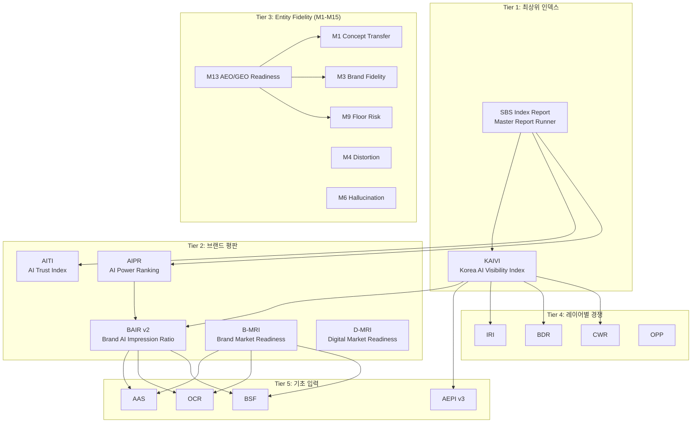
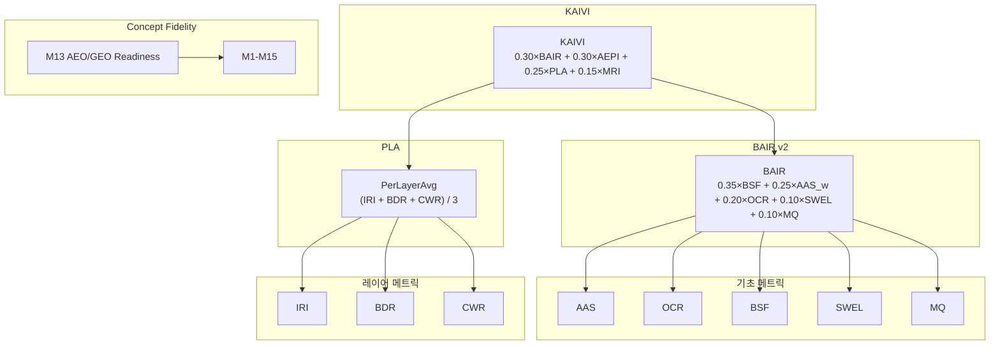

# BSW-OS 지표 체계 및 측정 방법론 정밀 감사 보고서

> **감사 범위**: BSW-OS 프로젝트 전체 코드베이스 (`lib/metrics/`, `lib/benchmark/`, `lib/sbs-index/`, `lib/s-score/`, `lib/analytics/`, `lib/deep-dive/`, `lib/crawlers/`, `lib/ai/`, `app/api/pipeline/`, 및 Supabase 마이그레이션)  
> **감사 일자**: 2026-07-07  
> **대상 파일 수**: ~25개 핵심 메트릭 소스 파일, 35+ 고유 지표/인덱스

---

## 목차

1. [지표 체계 아키텍처 총괄](#1-지표-체계-아키텍처-총괄)
2. [Tier 1: 최상위 복합 인덱스](#2-tier-1-최상위-복합-인덱스)
3. [Tier 2: 브랜드 & 평판 메트릭](#3-tier-2-브랜드--평판-메트릭)
4. [Tier 3: Entity & Fidelity 메트릭 (M1–M15)](#4-tier-3-entity--fidelity-메트릭-m1m15)
5. [Tier 4: 레이어별 경쟁 메트릭](#5-tier-4-레이어별-경쟁-메트릭)
6. [Tier 5: 기초 입력 메트릭](#6-tier-5-기초-입력-메트릭)
7. [Tier 6: 특수 목적 메트릭](#7-tier-6-특수-목적-메트릭)
8. [Tier 7: 안정성 & 드리프트 메트릭](#8-tier-7-안정성--드리프트-메트릭)
9. [Tier 8: 기회 & 갭 분석 시스템](#9-tier-8-기회--갭-분석-시스템)
10. [데이터 수집 인프라 및 측정 방법론](#10-데이터-수집-인프라-및-측정-방법론)
11. [데이터베이스 스키마와 메트릭 저장 구조](#11-데이터베이스-스키마와-메트릭-저장-구조)
12. [메트릭 의존성 그래프](#12-메트릭-의존성-그래프)
13. [SEO/AEO/GEO 측면 필요성 및 효과성 분석](#13-seoaeogeo-측면-필요성-및-효과성-분석)

---

## 1. 지표 체계 아키텍처 총괄

BSW-OS의 지표 체계는 **10-Tier 계층적 메트릭 아키텍처**로 구성됩니다. 최하위(Tier 5)의 원시 측정값부터 최상위(Tier 1)의 복합 인덱스까지, 각 계층이 하위 계층의 메트릭을 입력으로 소비하여 상위 지표를 산출합니다.

> [!IMPORTANT]
> **35+ 고유 메트릭/인덱스**가 **~25개 소스 파일**에 걸쳐 구현되어 있으며, 모든 수식은 소스 코드에서 직접 추출되었습니다.

---

## 2. Tier 1: 최상위 복합 인덱스

### 2.1 KAIVI — Korea AI Visibility Index

| 항목 | 내용 |
|------|------|
| **파일** | [kaivi.ts](file:///c:/Users/User/bsw/lib/sbs-index/kaivi.ts) (L46–51, L89–96) |
| **산출식** | `KAIVI = clamp(0.30×BAIRavg + 0.30×AEPIavg + 0.25×PerLayerAvg + 0.15×MRI, 0, 100)` |
| **스케일** | 0–100 |

**4개 가중 구성요소:**

| 구성요소 | 가중치 | 설명 |
|----------|--------|------|
| `BAIRavg` | 0.30 | 전체 업종 평균 BAIR (Brand AI Impression Ratio) |
| `AEPIavg` | 0.30 | Entity Reflection Snapshot 평균 AEPI |
| `PerLayerAvg` | 0.25 | `(IRI + BDR + CWR) / 3` — 레이어별 경쟁 메트릭 평균 |
| `MRI` | 0.15 | Meaning Readiness Index — 운영 진실(Operational Truth) 승인 비율 × 100 |

**입력 데이터 소스**: `probe_panels`, `entity_reflection_snapshots`, `industry_benchmark_snapshots`, `brand_operational_truths`

### 2.2 SBS Index Report

| 항목 | 내용 |
|------|------|
| **파일** | [index-runner.ts](file:///c:/Users/User/bsw/lib/sbs-index/index-runner.ts) (L37–96) |
| **역할** | 마스터 보고서 러너 — KAIVI, AITI, 업종별 AIPR 순위를 오케스트레이션 |
| **산출물** | KAIVI 점수, AITI 점수, 업종별 AIPR 랭킹, Concept Fidelity Snapshot |

> [!NOTE]
> SBS Index는 단일 수식이 아니라 **보고서 집계 레이어**입니다. 개별 메트릭을 조합하여 한국 시장 특화 AI 가시성 종합 보고서를 생성합니다.

### 2.3 D-MRI — Digital Market Readiness Index

| 항목 | 내용 |
|------|------|
| **파일** | [d-mri.ts](file:///c:/Users/User/bsw/lib/metrics/d-mri.ts) (L264–276) |
| **스케일** | 0–100 |

**산출식:**
$$D\text{-}MRI = \sum_{i=1}^{12} w_i \times C_i \times 100$$

**12개 하위 구성요소 (각 0–1 범위):**

| # | 구성요소 | 가중치 | 산출 방법 | 데이터 소스 |
|---|----------|--------|-----------|-------------|
| 1 | TruthReadiness | 0.10 | 운영 진실 가중 승인 비율 (approved=1.0, draft=0.7, other=0.4), 전략 진실 없으면 ×0.8 패널티 | `brand_operational_truths`, `brand_strategic_truths` |
| 2 | EvidenceReadiness | 0.10 | 증거가 연결된 진실의 비율 | `brand_operational_truths`, `truth_evidence` |
| 3 | BoundaryReadiness | 0.10 | 0.4 기본 + 0.6 × (경계 규칙 연결 진실 비율) | `boundary_rules` |
| 4 | QuestionSystemReadiness | 0.10 | (CQ→캐피탈노드 연결률 + QIS씬→CQ 연결률) / 2 | `canonical_questions`, `qis_scenes` |
| 5 | ConceptKgReadiness | 0.10 | 0.4 기본 (KG 노드 존재 시) + 0.6 × (엣지/노드 비율) | `ontology_nodes`, `ontology_edges` |
| 6 | ClaimLineageReadiness | 0.10 | 리니지 레코드가 있는 클레임 노드 비율 | `claim_lineage` |
| 7 | ObjectReadiness | 0.10 | 표현 객체 가중 준비도 (ready=1.0, draft=0.7) | `representation_objects` |
| 8 | SurfacePageReadiness | 0.10 | (유효 표면 계약 비율 + 유효 스키마 매핑 비율) / 2 | `surface_contracts`, `schema_mappings` |
| 9 | ExportReadiness | 0.05 | SEO/AEO/GEO 내보내기가 있는 시맨틱 페이지 비율 | `semantic_pages` |
| 10 | PersonaVibeReadiness | 0.05 | (VPA + PMRI) / 2 | `vibe_alignment_snapshots` |
| 11 | ObservatoryCoverage | 0.05 | 잠금된 프로브 패널 및 질문 수 기반 | `probe_panels` |
| 12 | FixItTraceability | 0.05 | 0→0.4(RCA존재)→0.7(패치존재)→1.0(리테스트존재) | `rca_cases`, `fix_patches`, `retest_runs` |

> [!TIP]
> D-MRI는 **내부 준비 상태**를 측정합니다. 브랜드의 디지털 자산이 AI 검색 환경에 대응할 준비가 되었는지를 12차원으로 진단합니다. B-MRI와 쌍을 이루어 **내부(D-MRI) vs 외부(B-MRI)** 대비를 가능하게 합니다.

---

## 3. Tier 2: 브랜드 & 평판 메트릭

### 3.1 BAIR v2 — Brand AI Impression Ratio

| 항목 | 내용 |
|------|------|
| **파일** | [bair.ts](file:///c:/Users/User/bsw/lib/sbs-index/bair.ts) (L14–17, L44–50, L156–163) |
| **산출식** | `BAIR_v2 = clamp(0.35×BSF + 0.25×AAS_w + 0.20×OCR + 0.10×SWEL + 0.10×MQ, 0, 100)` |
| **스케일** | 0–100 |

| 구성요소 | 가중치 | 설명 |
|----------|--------|------|
| BSF | 0.35 | Brand Share of Voice — 멘션 비율 또는 컨셉 충실도 |
| AAS_w | 0.25 | Weighted AI Answer Sentiment (strong=1.0, neutral=0.3, negative=0.0) |
| OCR | 0.20 | Observed Citation Rate |
| SWEL | 0.10 | Semantic Web Exposure Lift |
| MQ | 0.10 | Mention Quality — 강력 멘션 비율 |

### 3.2 B-MRI — Brand Market Readiness Index

| 항목 | 내용 |
|------|------|
| **파일** | [b-mri.ts](file:///c:/Users/User/bsw/lib/metrics/b-mri.ts) (L41–58) |
| **산출식** | `B-MRI = 0.20×AAS + 0.15×OCR + 0.20×BSF + 0.15×QTC + 0.15×GCTR + 0.10×ARS + 0.05×CPS − penalties` |
| **스케일** | 0–100 |

**하위 구성요소:**

| 구성요소 | 가중치 | 산출 방법 |
|----------|--------|-----------|
| AAS | 0.20 | 브랜드 키워드 멘션 비율 × 100 |
| OCR | 0.15 | 브랜드 도메인 인용 비율 × 100 |
| BSF | 0.20 | 스냅샷 기반 컨셉 충실도, 또는 긍정 멘션 비율 대체 |
| QTC | 0.15 | `min(100, CQ수×5 + 씬수×10)` |
| GCTR | 0.15 | `min(100, surface_contracts×8 + schema_mappings×12)` |
| ARS | 0.10 | 최신 AEPI 점수 (기본 50) |
| CPS | 0.05 | `max(0, AAS − competitorAAS + 50)` |

**패널티**: `confidencePenalty = (1−confidence)×0.10`, `volatilityPenalty = (stdDev/100)×0.10`

### 3.3 AIPR — AI Power Ranking

| 항목 | 내용 |
|------|------|
| **파일** | [aipr.ts](file:///c:/Users/User/bsw/lib/sbs-index/aipr.ts) (L47–77) |
| **산출 방법** | 대상 브랜드 + 전체 경쟁사에 대해 동일 파이프라인으로 BAIR 산출 → BAIR 점수 내림차순 정렬 → 순위 1..N 부여 |

### 3.4 AITI — AI Trust Index

| 항목 | 내용 |
|------|------|
| **파일** | [bair.ts](file:///c:/Users/User/bsw/lib/sbs-index/bair.ts) (L249–273) |
| **산출식** | `AITI = (Evidence Match Rate × 100) − (Unsafe Wording Count × 5)` |
| **스케일** | 0–100 |

---

## 4. Tier 3: Entity & Fidelity 메트릭 (M1–M15)

**파일**: [concept-fidelity-aggregator.ts](file:///c:/Users/User/bsw/lib/metrics/concept-fidelity-aggregator.ts) (L62–246)

| ID | 이름 | 산출식 | 스케일 | 등급 기준 |
|----|------|--------|--------|-----------|
| **M1** | Concept Transfer Rate | `Avg(정확 컨셉수 / 전체 컨셉수)` per question | 0–1 | A≥0.85, B≥0.70, C≥0.55, D≥0.40, F<0.40 |
| **M2** | Citation-Backed Rate | 인용 기반 컨셉 / 전체 출현 컨셉 | 0–1 | 동일 |
| **M3** | Brand Concept Fidelity | fidelity_judgments 평균 | 0–1 | 동일 |
| **M4** | Concept Distortion Rate | distortion_judgments 평균 | 0–1 | **역방향** (낮을수록 양호) |
| **M5** | Missing Concept Gap Count | recall_rate < 0.8인 컨셉 수 | 정수 | — |
| **M6** | Hallucinated Concept Rate | hallucination_judgments 평균 | 0–1 | **역방향** |
| **M7** | Attractor Stability | `0.40×recallConsist + 0.20×rankStab + 0.20×relStab + 0.20×boundSup` | 0–1 | 동일 |
| **M8** | Drift Score | 기준선 대비 코사인 거리 | 0–1 | **역방향** |
| **M9** | Floor Risk | 하위 10% 최악 위험 점수 평균 | 0–1 | **역방향** |
| **M10** | Policy Alignment | policy_judgments 평균 | 0–1 | 동일 |
| **M11** | Consensus Score | 실행 간 Jaccard 유사도 평균 | 0–1 | 동일 |
| **M12** | Variance Score | 베르누이 분산 합 p×(1−p) | ≥0 | — |
| **M13** | AEO/GEO Readiness | `0.15×SSoT + 0.15×AnswerCov + 0.10×M2 + 0.10×TechStr + 0.15×M1 + 0.15×M3 + 0.10×M10 + 0.10×(1−M9)` | 0–1 | 동일 |
| **M14** | Cross-Cultural Resonance | `0.4×Fidelity + 0.3×(1−Distortion) + 0.3×(1−FloorRisk)` | 0–1 | 동일 |
| **M15** | Commercial Transferability | `0.5×ConceptTransfer + 0.3×CitationBacked + 0.2×PolicyAlignment` | 0–1 | 동일 |

> [!WARNING]
> M4(왜곡), M6(할루시네이션), M8(드리프트), M9(바닥위험)은 **역방향 지표**입니다. 높을수록 위험하며, 대시보드에서 빨간색으로 표시되어야 합니다.

---

## 5. Tier 4: 레이어별 경쟁 메트릭

**파일**: [per-layer-metrics.ts](file:///c:/Users/User/bsw/lib/benchmark/per-layer-metrics.ts)

### 7-Layer Fair Probe System

BSW-OS는 질문을 **7개 레이어**로 분류하여 각 레이어별 독립 메트릭을 산출합니다:

| 레이어 | 유형 | 설명 |
|--------|------|------|
| L1 | universal | 업종 공통 일반 질문 |
| L2 | competitive | 경쟁 비교 질문 |
| L3 | ingredient | 성분/기능 질문 |
| L4 | practical | 실용적 질문 |
| L5 | ymyl | YMYL (건강/금융) 질문 |
| L6 | trend | 트렌드 질문 |
| L7 | brand | 브랜드 직접 질문 |

### 레이어별 메트릭

| 메트릭 | 산출식 | 스케일 |
|--------|--------|--------|
| **IRI** (Industry Readiness Index) | `(L1+L3+L5+L6 중 브랜드 멘션 있는 질문 / 전체) × 100` | 0–100 |
| **BDR** (Brand Defense Rate) | `(L7 질문 중 방어 성공 / 전체 L7) × 100` | 0–100 |
| **CWR** (Competitive Win Rate) | `(L2 질문 중 승리 / 전체 L2) × 100` — LLM Judge + 감성 분류 + indexOf 위치 | 0–100 |
| **OPP** (Opportunity Score) | `(일반 질문 중 무멘션 / 전체) × 100` — IRI의 역수 | 0–100 |
| **Top-3 / Top-5** Presence | `(L2 질문 중 상위 N위 등장 / 전체 L2) × 100` | 0–100 |

---

## 6. Tier 5: 기초 입력 메트릭

### 6.1 AAS — AI Answer Share

| 항목 | 내용 |
|------|------|
| **파일** | [lightweight-metric-runner.ts](file:///c:/Users/User/bsw/lib/benchmark/lightweight-metric-runner.ts) (L460) |
| **산출식** | `AAS = (mentionCount / brandedResponseCount) × 100` (AIPR 방식) |
| **스케일** | 0–100 |
| **감성 가중 변형** | `AAS_w`: strong=1.0, neutral=0.3, negative=0.0 ([mention-classifier.ts](file:///c:/Users/User/bsw/lib/benchmark/mention-classifier.ts)) |

**한국어 패턴 매칭**: 추천/최고/1위/강추 (positive), 비추/단점/부작용 (negative)  
**영어 패턴 매칭**: recommend/best/top pick (positive), avoid/concern/drawback (negative)  
**컨텍스트 윈도우**: 브랜드 멘션 전후 ±150자

### 6.2 OCR — Observed Citation Rate

| 항목 | 내용 |
|------|------|
| **파일** | [lightweight-metric-runner.ts](file:///c:/Users/User/bsw/lib/benchmark/lightweight-metric-runner.ts) (L461) |
| **산출식** | `OCR = (citationCount / compositeResults.length) × 100` |
| **스케일** | 0–100 |

### 6.3 BSF — Brand Semantic Fidelity

| 항목 | 내용 |
|------|------|
| **파일** | [lightweight-metric-runner.ts](file:///c:/Users/User/bsw/lib/benchmark/lightweight-metric-runner.ts) (L109–132) |
| **산출식** | `BSF = mustRatio × 70 + shouldRatio × 30` (키워드 매칭 기반) |
| **스케일** | 0–100 |

### 6.4 AEPI v3 — AI Entity Presence Index

| 항목 | 내용 |
|------|------|
| **파일** | [aepi-calculator.ts](file:///c:/Users/User/bsw/lib/benchmark/aepi-calculator.ts) (L102–169) |
| **산출식** | `AEPI = baseScore × techModifier × eeatModifier × macroMultiplier` |
| **스케일** | 0–100 |

**2-레이어 다이나믹 가중 엔진:**

**Layer 1 (매크로 BM 카테고리):**

| 카테고리 | 예시 업종 |
|----------|-----------|
| ecommerce_d2c | 화장품 D2C, 패션 |
| local_services | 미용실, 카페, 웨딩홀 |
| ymyl_professional | 의료, 법률, 금융 |
| b2b_tech_saas | IT서비스, SaaS |
| media_content_hub | 미디어, 콘텐츠 |

**Layer 2 (업종별 7차원 가중치):**

| 차원 | 설명 |
|------|------|
| factoid | 사실 정보 검증 |
| procedural | 절차적 질문 대응 |
| comparative | 비교 질문 대응 |
| authority | 권위성 신호 |
| schema_org | 구조화 데이터 |
| topical_cluster | 토픽 클러스터 커버리지 |
| local_geo | 지역 검색 최적화 |

**30+ 업종 프리셋** 포함, 업종별 고유 가중치 분배

---

## 7. Tier 6: 특수 목적 메트릭

### 7.1 Freshness Score

| 항목 | 내용 |
|------|------|
| **파일** | [freshness-analyzer.ts](file:///c:/Users/User/bsw/lib/benchmark/freshness-analyzer.ts) (L81–211) |
| **산출식** | `FreshnessScore = (Σ weights / totalAnalyzed) × 100` |
| **분류** | current(1.0), recent(0.7), dated(0.3), stale(0.0) |
| **스케일** | 0–100 |

### 7.2 S-Score — Question Strategic Score

| 항목 | 내용 |
|------|------|
| **파일** | [calculator.ts](file:///c:/Users/User/bsw/lib/s-score/calculator.ts) (L104–109) |
| **산출식** | `S-Score = Completeness×0.25 + Visibility×0.30 + Opportunity×0.25 + Readiness×0.20` |
| **자동 부스트** | S-Score < 40 AND Opportunity > 70이면 weight += 20 |
| **스케일** | 0–100 |

### 7.3 SCS — Semantic Coverage Score

| 항목 | 내용 |
|------|------|
| **파일** | [coverage-score.ts](file:///c:/Users/User/bsw/lib/analytics/coverage-score.ts) (L14–39) |
| **산출식** | `SCS = (Σ max(CosineSim(ActiveQ_i, MasterU_j)) / N) × 100` |
| **벡터 차원** | 3072-dim 임베딩 |
| **스케일** | 0–100 |

### 7.4 VPA — Vibe-Persona Alignment

| 항목 | 내용 |
|------|------|
| **파일** | [semantic-alignment.ts](file:///c:/Users/User/bsw/lib/vibe/semantic-alignment.ts) (L17–88) |
| **산출식** | `VPA = max(0, cosineSimilarity(guideVector, pageVector)) × 100` |
| **벡터 차원** | 3072-dim 임베딩 |
| **스케일** | 0–100 |

### 7.5 SWEL — Semantic Web Exposure Lift

| 항목 | 내용 |
|------|------|
| **파일** | [bair.ts](file:///c:/Users/User/bsw/lib/sbs-index/bair.ts) (L185–212) |
| **산출식** | `SWEL = min(100, pages×5[max50] + schemas×6[max30] + surfaces×4[max20])` |
| **스케일** | 0–100 |

---

## 8. Tier 7: 안정성 & 드리프트 메트릭

### 8.1 Attractor Stability (M7)

| 항목 | 내용 |
|------|------|
| **파일** | [attractor-stability-calculator.ts](file:///c:/Users/User/bsw/lib/metrics/attractor-stability-calculator.ts) (L72–128) |
| **산출식** | `0.40×recallConsistency + 0.20×rankStability + 0.20×relationStability + 0.20×boundarySuppression` |

### 8.2 Drift Score (M8)

| 항목 | 내용 |
|------|------|
| **파일** | [drift-calculator.ts](file:///c:/Users/User/bsw/lib/metrics/drift-calculator.ts) (L10–76) |
| **방법** | 코사인 거리 (1 − cos_sim) 또는 L1 정규화 맨해튼 거리 |

### 8.3 Temporal Tracking (시계열)

| 항목 | 내용 |
|------|------|
| **파일** | [temporal-tracker.ts](file:///c:/Users/User/bsw/lib/benchmark/temporal-tracker.ts) (L300–369) |
| **22개 메트릭** 시계열 추적 |
| **변화 분류** | major (>15%), minor (>5%), negligible |
| **방향 분류** | improved, declined, stable (|deltaPercent| < 2%) |
| **자동 한국어 요약 생성** | 예: "AAS가 지난 7일간 12.3% 상승하여 주요 개선을 보였습니다" |

---

## 9. Tier 8: 기회 & 갭 분석 시스템

### 9.1 Opportunity Analyzer — 5가지 기회 유형

**파일**: [opportunity-analyzer.ts](file:///c:/Users/User/bsw/lib/benchmark/opportunity-analyzer.ts)

| 유형 | 설명 | 심각도 |
|------|------|--------|
| **Gap** | 브랜드 부재, 경쟁사 존재 | 90/60 |
| **Volatile** | 실행 간 또는 엔진 간 멘션 불일치 | 85/65 |
| **Weak Mention** | 브랜드 멘션 있으나 BSF 낮음 | 70 |
| **Dominance** | 대상 브랜드만 독점 멘션 (방어) | 30 |
| **Blind Spot** | 어떤 브랜드도 멘션되지 않음 → 블루오션 | 50 |

**E-E-A-T 차원 매핑**: 각 갭을 Expertise/Experience/Authority/Trust 차원에 매핑하여 한국어 실행 권고안 제공

### 9.2 Gap Analyzer — 4-Quadrant 분석

**파일**: [gap-analyzer.ts](file:///c:/Users/User/bsw/lib/benchmark/gap-analyzer.ts)

| 사분면 | 색상 | 의미 | 처방 유형 |
|--------|------|------|-----------|
| GREEN | 🟢 | 반영된 엔티티 (정확/부분/왜곡) | — |
| YELLOW | 🟡 | 사이트에 존재하나 AI 미반영 | `add_schema`, `add_eeat_signal`, `improve_heading` |
| RED | 🔴 | 업종 콘텐츠 갭 | `create_content` |
| WHITE | ⚪ | 블루오션 기회 (L6 트렌드) | `opportunity_content` |

**처방별 예상 AEPI 영향**: 8.5–20.0점  
**우선순위 점수**: 10–95 범위

---

## 10. 데이터 수집 인프라 및 측정 방법론

### 10.1 멀티엔진 실시간 프로빙

**4개 AI 검색 엔진 동시 질의:**

| 엔진 | 모델 | API | 추정 비용/질의 |
|------|------|-----|----------------|
| ChatGPT Search | `gpt-4o-search-preview` | OpenAI Responses API → Chat Completions fallback | $0.005 |
| Gemini Grounding | `gemini-3.5-flash` | Google GenAI SDK + `googleSearch` 도구 | $0.003 |
| Perplexity | `sonar` | Perplexity REST API | $0.002 |
| Claude Web | `claude-sonnet-4-5` | Anthropic + `web_search` 도구 | $0.008 |

**멀티엔진 수렴 검증:**
- `brand_mention_agreement`: 브랜드 멘션 일치도
- `citation_overlap`: Jaccard 유사도 기반 인용 겹침
- `concept_consensus`: 응답 길이 분산 기반 개념 합의
- `proxy_confidence_band`: Gemini → Google AI Mode 프록시 상관계수 (80% CI, ±7 MAE)

### 10.2 질문 샘플링: Fair Probe Set Builder

**3-Layer Mixed Goldilocks Sampling:**
- 7개 레이어(L1–L7)에서 계층적 샘플링
- `daily_light` (소규모, 저비용) vs `weekly_full` (종합) 모드
- QIS Scene `must_include` 키워드 + Pattern Attractor 동적 프로브 자동 주입

### 10.3 외부 데이터 수집

| 수집기 | 소스 | API/방법 | 데이터 |
|--------|------|----------|--------|
| Naver News | `openapi.naver.com` | REST API | 뉴스 제목, 설명, URL, 발행일 |
| Naver DataLab | `openapi.naver.com/datalab` | REST POST | 상대 검색량 트렌드 (14일, 일별) |
| RSS Feed | 임의 RSS URL | HTTP + regex XML 파싱 | 피드 항목 (최대 15개) |
| Community Crawler | 커뮤니티 URL | HTML + regex 링크 추출 | 키워드 매칭 게시물 |

### 10.4 브랜드 사이트 크롤러

**파일**: [brand-site-crawler.ts](file:///c:/Users/User/bsw/lib/crawlers/brand-site-crawler.ts)

- BFS 크롤링 (최대 5페이지, 깊이 2, 동일 도메인)
- HTML 정제: `<script>`, `<style>`, `<nav>`, `<footer>`, `<header>` 제거
- 핵심 페이지 우선 정렬: about, brand, product, shop, intro
- AI 기반 SSoT 추출: 최대 40K 문자 → Gemini/OpenAI (temperature 0.1) → 구조화 JSON

### 10.5 파이프라인 인프라 (S-OGDE v3.0)

**7-Phase 파이프라인:**

| Phase | 이름 | 주요 매개변수 |
|-------|------|---------------|
| 0 | TCO/KG Bootstrap | tco_count (2-50), kg_max_nodes (10-200) |
| 0.5 | External Signal Collection | news, community, bridge convert |
| 1 | S-OGDE Signal Generation | chain_depth (1-5), recursive_depth, dedup_threshold |
| 1-B | Brand Rotation | rotation_top_n, daily_cost_limit ($1-50) |
| 2.1 | Report Gap Feeding | weak_aepi_threshold (20-60) |
| 2.6 | Deep Dive Enrichment | bsf_threshold, auto_promote |
| 3 | CQ Promotion (CPS×MMR) | auto_promote_top_n, mmr_lambda |

**3개 프리셋**: Light (빠름, 저비용), Standard (균형), Deep (정밀, 5-8분)

**스케줄링**: Vercel Cron `0 2 * * *` (매일 새벽 2시), daily/weekly 모드

---

## 11. 데이터베이스 스키마와 메트릭 저장 구조

| 테이블 | 주요 메트릭 컬럼 |
|--------|------------------|
| `metric_snapshots` | metric_name (AAS/OCR/BSF/QTC/GCTR/ARS), metric_value |
| `concept_fidelity_snapshots` | M1–M15, grade (A-F) |
| `entity_reflection_snapshots` | aepi_score, err_* dimensions, tech/eeat mods |
| `industry_benchmark_snapshots` | aas, ocr, bsf, bair, iri, bdr, cwr, opp, top3, top5, freshness |
| `benchmark_snapshots` | metrics (JSONB), aepi_score, tier, diff_from_previous |
| `industry_benchmark_profiles` | percentile_distributions, tier_statistics |
| `domain_index_definitions` | configured_weights (AAS=0.2, OCR=0.2, BSF=0.3, QTC=0.1, GCTR=0.2) |
| `response_judgments` | brand_semantic_fidelity_score, is_citation_found |

---

## 12. 메트릭 의존성 그래프

---

## 13. SEO/AEO/GEO 측면 필요성 및 효과성 분석

### 13.1 왜 기존 SEO 지표로는 충분하지 않은가

| 기존 SEO 지표 | 한계 | BSW-OS 대응 |
|---------------|------|-------------|
| **키워드 랭킹** (1-10위) | AI 답변에는 "순위"가 없음, 멘션/인용 여부만 존재 | **AAS** (멘션 점유율), **OCR** (인용률) |
| **CTR (클릭률)** | AI 답변에서 직접 답을 제공하므로 클릭 자체가 감소 | **BSF** (브랜드 시맨틱 충실도) — AI가 올바르게 전달하는지 측정 |
| **도메인 오소리티** | 전통적 링크 기반 — AI는 콘텐츠 품질과 E-E-A-T를 직접 판단 | **AEPI** (30+ 업종별 7차원 가중 엔티티 존재 지수) |
| **검색량** | AI 시대의 질문은 더 복잡하고 대화형 | **QIS** (질문 지능 시스템) — 7-Axis 컨텍스트 텐서로 질문 자산 관리 |
| **백링크 수** | AI 모델은 훈련 데이터와 실시간 검색 결과 모두 참조 | **SWEL** (시맨틱 웹 노출 증가도), **M2** (인용 근거 비율) |

### 13.2 AEO (Answer Engine Optimization) 측면 효과성

| BSW-OS 메트릭 | AEO 기여 | 효과 |
|---------------|----------|------|
| **AAS** | AI가 브랜드를 얼마나 자주 언급하는지 직접 측정 | 브랜드 AI 답변 점유율 최적화의 기준선 |
| **BSF** | AI가 브랜드 핵심 메시지를 정확히 전달하는지 검증 | 할루시네이션/왜곡 방지, 브랜드 안전성 |
| **M1–M6** | 컨셉 전달률, 왜곡률, 할루시네이션률 정밀 진단 | AI 학습 데이터 → 응답 흐름의 정보 무결성 보장 |
| **QIS Scene** | 질문별 답변 정책 (must_do, must_not_do, 증거 요건) 사전 정의 | 브랜드가 원하는 답변 형태를 AI에 학습시키는 데이터 공급 |

### 13.3 GEO (Generative Engine Optimization) 측면 효과성

| BSW-OS 메트릭 | GEO 기여 | 효과 |
|---------------|----------|------|
| **OCR** | 생성형 AI가 브랜드 도메인을 인용하는지 직접 측정 | 제로클릭 시대에 트래픽 유입 경로 확보 |
| **CWR** | 경쟁 비교 질문에서 승률 측정 | AI 추천 포지셔닝 최적화 |
| **멀티엔진 수렴** | ChatGPT/Gemini/Perplexity/Claude 동시 관측 | 단일 엔진 편향 없는 진정한 AI 가시성 |
| **Freshness** | AI 응답의 시간적 최신성 측정 | 콘텐츠 갱신 우선순위 결정 |
| **Pattern Attractor** | 수학적 어트랙터 이론 기반 콘텐츠 패턴 | AI가 선호하는 구조적 답변 형식 학습 |

### 13.4 측정의 정밀성 보장 장치

1. **Proxy Confidence Band**: Gemini → Google AI Mode 프록시에 80% 신뢰구간 (±7 MAE) 명시
2. **멀티엔진 수렴 검증**: 4개 엔진 교차 검증으로 단일 엔진 편향 제거
3. **LLM Judge**: 경쟁 비교(L2)와 브랜드 질문(L7)에 AI 판사 배치로 주관적 판단 자동화
4. **감성 가중 AAS**: strong/neutral/negative 감성 분류로 단순 멘션 카운트 초월
5. **Goldilocks Sampling**: 7-레이어 계층적 샘플링으로 측정 편향 최소화
6. **일별/주별 Cost Guard**: 일일 비용 한도 ($1-$50)로 과다 API 호출 방지

> [!CAUTION]
> 모든 메트릭은 **프록시 지표**입니다. BSW-OS는 이를 공식적으로 인정하고, Observatory 모듈에 "패널 기반 프록시 지표이며, 실제 시장 점유율이나 보장된 가시성을 구성하지 않습니다"라는 윤리적 면책 조항을 내장하고 있습니다.
