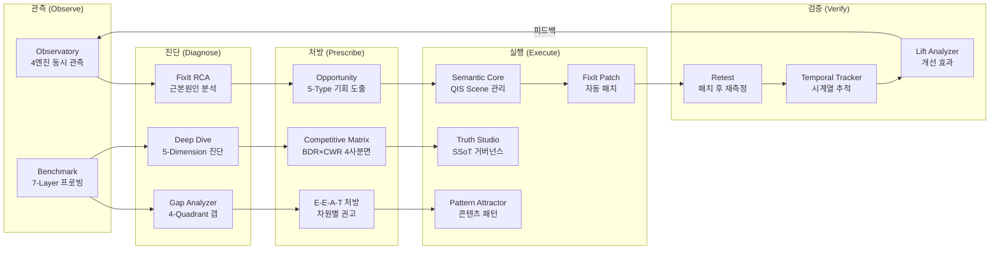
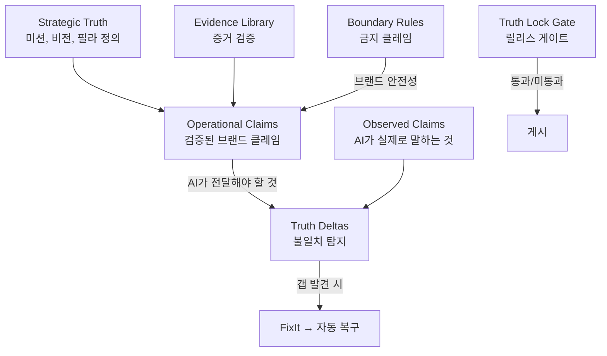
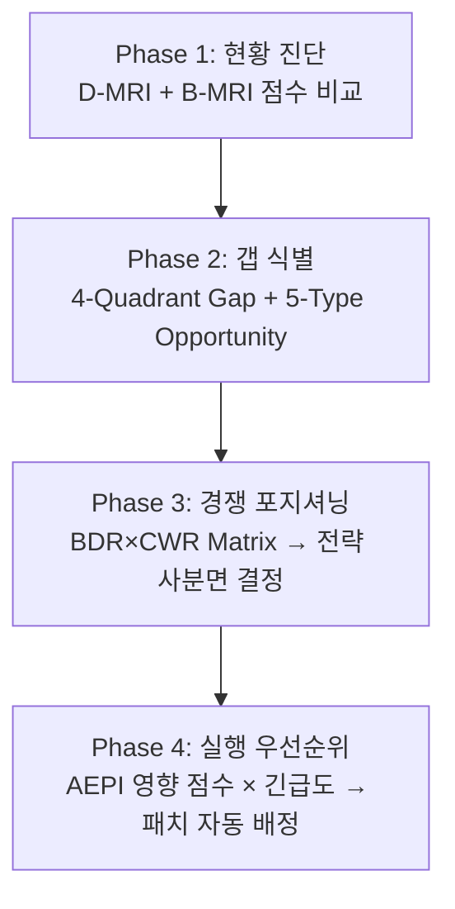

# BSW-OS 지표 기반 브랜드 SEO/AEO/GEO 전략 수립 및 실행 기여 감사 보고서

> **감사 범위**: BSW-OS의 14+ 모듈이 브랜드의 SEO/AEO/GEO 전략 수립과 실행에 어떻게 기여하는지에 대한 정밀 분석  
> **감사 일자**: 2026-07-07  
> **핵심 발견**: 관측→진단→처방→실행→검증의 **완전 폐쇄 루프** 시스템이 구축되어 있으며, 업계 기존 도구와 본질적으로 다른 **AI-네이티브 전략 프레임워크** 제공

---

## 목차

1. [전략적 가치 체계 총괄](#1-전략적-가치-체계-총괄)
2. [모듈별 전략 기여 심층 분석](#2-모듈별-전략-기여-심층-분석)
3. [폐쇄 루프 최적화 시스템](#3-폐쇄-루프-최적화-시스템)
4. [업계 SOTA 대비 차별성 분석](#4-업계-sota-대비-차별성-분석)
5. [Unfair Advantage 분석](#5-unfair-advantage-분석)
6. [지표 기반 전략 수립 프레임워크](#6-지표-기반-전략-수립-프레임워크)

---

## 1. 전략적 가치 체계 총괄

BSW-OS는 단순한 SEO 분석 도구가 아닌, **AI 시대 브랜드 디지털 전략 운영체제**입니다. 14개 모듈이 하나의 통합 전략 파이프라인을 구성합니다:



> [!IMPORTANT]
> **핵심 가치 제안**: 기존 SEO 도구가 "무엇이 잘못되었는지" 보여주는 데 그치는 반면, BSW-OS는 "왜 잘못되었고, 어떻게 고쳐야 하며, 고친 결과가 실제로 개선되었는지"까지 자동화합니다.

---

## 2. 모듈별 전략 기여 심층 분석

### 2.1 Benchmark Dashboard — AI 가시성 벤치마킹

**SEO/AEO/GEO 전략 기여:**
- **AAS 추적**: 브랜드의 AI 답변 점유율을 시간에 따라 추적하여 전략 효과 측정
- **7-Layer Fair Probe**: 질문 유형별 (일반/비교/브랜드방어/트렌드 등) 차별화된 성과 진단
- **업종별 AEPI**: 30+ 업종 특화 가중치로 업종 맥락에 맞는 정확한 벤치마킹

**실행 가능한 인사이트:**
- "L2(경쟁 비교) 질문에서 CWR 35% → Schema markup 추가 필요"
- "L7(브랜드 방어) BDR 72% → 브랜드 진실(SSoT) 보강 권고"
- "Freshness Score 41 → 콘텐츠 업데이트 시급"

### 2.2 Observatory — AI 검색 관측소

**SEO/AEO/GEO 전략 기여:**
- **6개 서브모듈**이 체계적 관측 체계를 구성
  1. **AI Probe Panels**: QIS 컨텍스트에 매핑된 버전 관리형 검색 질의 컬렉션
  2. **AI Observation Runs**: 잠금된 패널 위에서 샌드박스 크롤 실행
  3. **Response Judgments**: 인용 링크, 시맨틱 정확도, 후보 점수 승인/거부
  4. **AI Search Metrics**: AAS, OCR, SWEL 비교 산출
  5. **MRI Indices**: OPS-MRI(운영 진단)와 B-MRI(경쟁 외부 검색) 병렬 비교
  6. **Methodology Disclosures**: 프록시 주의사항, 한계 경고, 법적 안전 선언

**전략적 독창성:** 의무적 프록시 면책 조항 — "패널 기반 프록시 지표이며, 진정한 시장 점유율이나 보장된 가시성을 구성하지 않습니다"라는 **윤리적 컴플라이언스 레이어** 내장

### 2.3 FixIt Studio — 폐쇄 루프 최적화 엔진

**SEO/AEO/GEO 전략 기여:**

**7-Step 자동 복구 파이프라인:**

| 단계 | 구성요소 | 기능 |
|------|----------|------|
| 1 | **Anomaly Detector** | M1 개념 전달 <0.60, M4 왜곡 >0.15, M6 할루시네이션 >0.10 등 규칙 기반 이상 탐지 |
| 2 | **RCA Generator** | AI 기반 근본원인 가설 생성 (최대 3개/실행), SSoT/변경이력/과거 RCA 컨텍스트 활용 |
| 3 | **Patch Executor** | 7가지 패치 유형 자동 실행 |
| 4 | **Regression Guard** | 패치로 인한 회귀 방지 |
| 5 | **Retest Scheduler** | 패치 후 검증 크롤 스케줄링 |
| 6 | **Cooldown Config** | 과잉 패칭 방지 |
| 7 | **Playbook Rules** | 메트릭 임계값 → 자동 RCA 트리거 |

**7가지 자동 패치 유형:**
```
ssot_update        → brand_operational_truths UPDATE
answer_card_create → semantic_pages INSERT
answer_card_update → semantic_pages UPDATE
boundary_rule_add  → boundary_rules INSERT
expected_layer_update → observation runs metadata
content_restructure → semantic_pages + page_sections complex
schema_markup_fix  → (계획)
```

**전체 롤백 지원**: `original_payload` 보존으로 언제든 패치 취소 가능

### 2.4 Semantic Core (QPA-OS) — 시맨틱 지능 백본

**SEO/AEO/GEO 전략 기여:**

**16개 서브모듈이 브랜드의 "시맨틱 DNA"를 관리합니다:**

| 서브모듈 | 전략적 역할 |
|----------|-------------|
| **Signals** | 검색 트렌드에서 질문 시그널 채굴 (mined→promoted→ignored 라이프사이클) |
| **Question Capital** | 구조화된 질문 자산 노드 |
| **Canonical Questions** | 정규화, 중복 제거된 마스터 질문 세트 |
| **QIS Scenes** | AI 답변 생성 정책 (의도 모델, 증거 요건, 리스크 정책, CTA 정책, must_do/must_not_do) |
| **TCO Concepts** | Topic Conceptual Ownership 노드 |
| **Brand Ontology KG** | 지식 그래프 노드 |
| **Claim Lineage** | 증거 기반 클레임 추적 + 리니지 게이트 |
| **QVS × AEPI Matrix** | 4-Quadrant 질문 자산 시각화 (가치 vs 성과) |
| **Pattern Attractors** | 도메인 표준 + 브랜드 고유 패턴 어트랙터, 멀티채널 미디어 솔리톤 생성 |
| **Attractor Gap Diagnosis** | 도메인 표준 vs 브랜드 포트폴리오 갭 식별 |
| **Domain Pack Management** | YAML 기반 업종 표준 어트랙터/TCO 온톨로지 DB 동기화 |
| **QIS 3-Axis Hub Sync** | 업종 트렌드/질의 장소/포탈 간 실시간 시그널 동기화 |
| **Signal Performance Feedback** | 프로모션된 시그널 검색 성과 추적, OLS 회귀로 QVS 가중치 조정 |
| **Pipeline Orchestration** | One-Click E2E Pipeline (phase1→1.5→2→2.5→3) |

**핵심 전략 가치**: QIS Scene은 **"브랜드가 AI에게 원하는 답변 방식을 사전 정의"**하는 유일한 체계적 방법입니다. 7-Axis 컨텍스트 텐서로 질문의 의도, 위험, 증거 요건을 구조화합니다.

### 2.5 Brand Truth Studio — 브랜드 진실 거버넌스

**SEO/AEO/GEO 전략 기여:**



**전략적 가치**: 
- 브랜드가 정의한 것(Strategic/Operational) vs AI가 말하는 것(Observed) 간의 **Delta(불일치)를 자동 탐지**
- 불일치 발견 시 FixIt 파이프라인으로 자동 연결 → **진실 기반 폐쇄 루프**

### 2.6 Industry Report — 경쟁 포지셔닝

**BDR × CWR 4-Quadrant Competitive Position Matrix:**

| 사분면 | 조건 | 전략 처방 | 긴급도 |
|--------|------|-----------|--------|
| **AI Leader** | 높은 BDR + 높은 CWR | OPP 기회 선점으로 지배력 유지 | Monitor |
| **Competitive Warrior** | 낮은 BDR + 높은 CWR | **긴급**: 브랜드 방어력 강화 | Urgent |
| **Steady Defender** | 높은 BDR + 낮은 CWR | **중요**: 비교 질문 공략 | Important |
| **Vulnerable** | 낮은 BDR + 낮은 CWR | **치명적**: AI 가시성 기반 구축 | Critical |

각 사분면별 **한국어 전략 처방**과 우선순위 수준 제공

### 2.7 Golden Reference — 경쟁사 역공학

**6개 표준화된 산출물:**

| # | 산출물 | 내용 |
|---|--------|------|
| 1 | Design Tokens | 색상, 폰트, 형태, 모션 |
| 2 | Layout Blueprints | GNB, Shell, Grid, Footer |
| 3 | Section Sequences | 섹션 배치순서, 심리적 흐름 |
| 4 | Content Templates | Hero 카피, FAQ, CTA |
| 5 | Image References | Hero, 제품, 팀 이미지 |
| 6 | Quality Benchmark | 10차원 품질 점수 |

**6개 지원 업종**: 스킨케어/뷰티, 웨딩, 의료/클리닉, 레스토랑/카페, 호텔, 장소 브랜드

**Pattern Consensus Engine**: 25+ 웹사이트 스냅샷을 집계하여 업종 전체 골든 스탠다드 도출

### 2.8 Sales Automation — B2B 세일즈 자동화

**5개 구성요소:**

| 구성요소 | 기능 |
|----------|------|
| Portal Gap Aggregator | 질문 수요 vs 어트랙터 커버리지 집계, 미충족 세그먼트 식별 |
| Business Question Matcher | 비즈니스를 갭 기회에 매칭 |
| Gap-Product Mapper | 갭을 BSW 제품에 매핑 (예: "비오는날 AI홈피 팩", "외국인 친화 페이지 팩") |
| Outreach Message Generator | AI 기반 개인화 B2B 세일즈 메시지 (한국어 프리미엄 제안서) |

**전략적 독창성**: 세일즈 메시지가 **데이터 기반** — 특정 트렌드 검색 쿼리와 갭 데이터를 인용하여 수요를 실증적으로 증명

### 2.9 Reports — 거버닝 퍼블리싱

**Safety Release Gates (보고서 게시 전 필수 통과):**
1. ✅ Unsafe Wording Scanner — 위험 문구 스캔
2. ✅ Methodology Appendix — 방법론 부록 첨부
3. ✅ Proxy Caveat — 프록시 면책 조항 
4. ✅ Manual Review Gate — 수동 검토

**AI Brand MRI 보고서 자동 생성 (10개 섹션):**
1. Executive Summary (AEO/GEO Readiness, BCF, Floor Risk, Policy Alignment)
2. Concept Transfer Analysis (M1)
3. Brand Concept Fidelity (M3)
4. Concept Distortion Report (M4) + 상위 왜곡 사례
5. Hallucination Alert (M6) + 미지원 클레임
6. Missing Concept Gap (M5) + Gap Analysis Table
7. Floor Risk Analysis (M9)
8. Policy Alignment (M10) + 위반 로그
9. Stability & Drift (M7, M8, M11, M12)
10. Priority Improvement Roadmap (실행 단계)

---

## 3. 폐쇄 루프 최적화 시스템

BSW-OS의 가장 강력한 전략적 가치는 **완전 폐쇄 루프**입니다:

```
 ┌──────────────────────────────────────────────────────────────┐
 │                    BSW-OS 폐쇄 루프                          │
 │                                                              │
 │  ① 관측 (Observatory/Benchmark)                             │
 │     ↓ AAS, OCR, BSF, CWR, BDR 실측                         │
 │  ② 진단 (FixIt Anomaly → RCA)                              │
 │     ↓ 근본원인 가설 3개 + E-E-A-T 차원 매핑                  │
 │  ③ 처방 (Gap/Opportunity → Prescription)                    │
 │     ↓ AEPI 영향 점수 + 우선순위 + 경쟁사 긴급도               │
 │  ④ 실행 (Patch Executor → 7가지 자동 패치)                   │
 │     ↓ SSoT 업데이트, Answer Card 생성, Schema 수정            │
 │  ⑤ 검증 (Retest → Temporal Tracker → Lift Analyzer)         │
 │     ↓ 패치 전후 메트릭 차이 정량화 (예: +12.4% ARS)           │
 │  ⑥ 피드백 → ① 재관측                                       │
 └──────────────────────────────────────────────────────────────┘
```

**업계에서 이런 자동 폐쇄 루프를 제공하는 도구는 거의 없습니다.** Semrush, Ahrefs, Moz 등 기존 도구는 ①②③까지만 제공하고, ④⑤⑥은 사용자가 수동으로 수행해야 합니다.

---

## 4. 업계 SOTA 대비 차별성 분석

### 4.1 기존 SEO 도구 비교

| 기능 영역 | Semrush / Ahrefs / Moz | Ottimo / Surfer | **BSW-OS** |
|-----------|------------------------|-----------------|------------|
| **측정 대상** | 전통 SERP 순위, 백링크, DA | 전통 SERP + 일부 AI 멘션 | **4개 AI 엔진 동시 관측** |
| **메트릭 수** | 10-15개 표준 메트릭 | 15-20개 | **35+ 고유 메트릭** |
| **업종 특화** | 일반적 | 콘텐츠 최적화 중심 | **30+ 업종 프리셋, 7차원 가중치** |
| **진단 깊이** | 기술 SEO 감사 | 콘텐츠 점수 | **M1-M15 컨셉 충실도, 15차원 진단** |
| **폐쇄 루프** | ❌ 진단까지만 | ❌ 콘텐츠 제안까지만 | **✅ 관측→진단→패치→검증 자동** |
| **브랜드 안전성** | ❌ | ❌ | **✅ 할루시네이션/왜곡 탐지 + 경계 규칙** |
| **질문 온톨로지** | ❌ | ❌ | **✅ QIS 7-Axis 컨텍스트 텐서** |
| **경쟁 포지셔닝** | 키워드 경쟁 분석 | ❌ | **✅ BDR×CWR 4사분면 + LLM Judge** |
| **B2B 세일즈 연동** | ❌ | ❌ | **✅ 측정→갭→세일즈 메시지 자동** |

### 4.2 AEO/GEO 전문 도구 비교

| 기능 영역 | Profound (AEO) | Authoritas | **BSW-OS** |
|-----------|----------------|------------|------------|
| **AI 멘션 추적** | ChatGPT만 | Google AI Overviews | **4개 엔진 동시** |
| **멀티엔진 수렴** | ❌ | ❌ | **✅ Jaccard 유사도, 합의 점수** |
| **신뢰구간** | ❌ | ❌ | **✅ 80% CI Proxy Band** |
| **감성 분류** | 단순 멘션 | 단순 멘션 | **✅ strong/neutral/negative 가중** |
| **브랜드 SSoT** | ❌ | ❌ | **✅ Strategic/Operational/Observed 3층 진실 거버넌스** |
| **자동 교정** | ❌ | ❌ | **✅ 7가지 패치 + 롤백 + 리테스트** |
| **한국 시장 특화** | ❌ (영어권) | ❌ (영어권) | **✅ 한국어 NLP, 네이버 DataLab, 한국어 감성 패턴** |

---

## 5. Unfair Advantage 분석

BSW-OS가 경쟁 도구 대비 보유한 **구조적 경쟁 우위**:

### 5.1 🔬 관측의 깊이 — "무엇을" 넘어 "어떻게"

| Unfair Advantage | 설명 |
|------------------|------|
| **7-Layer Fair Probe System** | 질문을 7개 레이어로 분류하여 각각 독립 성과 측정. 경쟁 도구는 모든 질문을 동일하게 취급 |
| **LLM Judge** | 경쟁 비교(L2)와 브랜드(L7) 질문에 AI 판사를 배치하여 주관적 판단을 정량화. 단순 멘션 카운트를 초월 |
| **Goldilocks Sampling** | 3-Layer Mixed Sampling으로 측정 편향 최소화. 통계적 엄밀성 |

### 5.2 🧬 시맨틱 DNA — 질문의 "왜"

| Unfair Advantage | 설명 |
|------------------|------|
| **QIS Scene 시스템** | 각 질문에 대해 AI가 답변해야 할 방식을 사전 정의 (must_do, must_not_do, 증거 요건, CTA 정책). 업계 유일 |
| **7-Axis Context Tensor** | 질문의 의도, 위험, 증거 요건을 7차원으로 구조화. 평면적 키워드 분석을 초월 |
| **Pattern Attractor Theory** | 수학적 어트랙터 이론을 콘텐츠 최적화에 적용. AI가 "끌려가는" 콘텐츠 구조 설계 |

### 5.3 🔄 폐쇄 루프 — "고치고 증명"

| Unfair Advantage | 설명 |
|------------------|------|
| **7-Type Auto Patch** | 진단 결과를 7가지 유형의 자동 패치로 즉시 실행. 수동 개입 최소화 |
| **Regression Guard** | 패치가 다른 지표를 악화시키지 않는지 자동 검증 |
| **Lift Analyzer** | 패치 전후 메트릭 변화를 정량화 (예: +12.4% ARS). ROI 즉시 증명 |
| **Factory Reuse** | 검증된 패치를 재사용 가능한 템플릿으로 전환. 학습하는 시스템 |

### 5.4 🇰🇷 한국 시장 특화

| Unfair Advantage | 설명 |
|------------------|------|
| **네이버 DataLab 통합** | 한국 검색 트렌드 14일 실시간 반영 |
| **한국어 감성 패턴** | 추천/최고/1위/강추 (긍정), 비추/단점/부작용 (부정) 고유 패턴 |
| **한국어 자동 요약** | 모든 시계열 변화에 대한 한국어 자연어 요약 자동 생성 |
| **6개 한국 업종 프리셋** | 스킨케어, 웨딩, 의료, 카페, 호텔, 장소 브랜드 |

### 5.5 🛡️ 브랜드 안전성 — "하면 안 되는 것"

| Unfair Advantage | 설명 |
|------------------|------|
| **3-Layer Truth Governance** | Strategic → Operational → Observed 3층 진실 구조 |
| **Boundary Rules** | "브랜드가 주장하면 안 되는 것" 명시적 정의 + 자동 집행 |
| **Hallucination Detection (M6)** | AI가 만들어낸 허위 클레임 자동 탐지 |
| **Unsafe Wording Scanner** | 보고서 게시 전 위험 문구 자동 스캔 |
| **Proxy Caveat Compliance** | 측정 한계에 대한 윤리적 면책 조항 강제 삽입 |

---

## 6. 지표 기반 전략 수립 프레임워크

### 6.1 전략 수립 4단계



### 6.2 메트릭 → 전략 결정 매핑

| 진단 결과 | 전략 결정 | 실행 모듈 |
|-----------|-----------|-----------|
| AAS < 30% | 브랜드 AI 존재감 기초 구축 | Semantic Core → QIS Scene 생성 |
| OCR < 20% | 인용 가능 콘텐츠 확충 | Truth Studio → Evidence 강화 |
| BSF < 50% | 브랜드 메시지 정확도 개선 | Truth Studio → Operational Claims 보강 |
| CWR < 40% | 경쟁 비교 질문 대응 강화 | Pattern Attractor → 비교 우위 패턴 |
| BDR < 60% | 브랜드 방어력 강화 | Truth Studio → Boundary Rules + SSoT |
| M4 > 0.15 | 왜곡 정보 긴급 교정 | FixIt → 자동 RCA + Patch |
| M6 > 0.10 | 할루시네이션 긴급 대응 | FixIt → Boundary Rule + Answer Card |
| Freshness < 50 | 콘텐츠 최신성 업데이트 | Semantic Core → 콘텐츠 갱신 |
| D-MRI vs B-MRI 갭 > 20 | 내부 준비 대비 외부 인식 불일치 | Deep Dive → 5-Dimension 진단 |

### 6.3 QVS × AEPI Strategy Matrix 활용

| 사분면 | QVS | AEPI | 전략 | 긴급도 |
|--------|-----|------|------|--------|
| **Core** | ≥50 | ≥50 | 유지 관리, 경쟁 감시 | — |
| **Threat** | ≥50 | <50 | 높은 가치의 질문인데 성과 부진 → 긴급 최적화 | ≤3일 |
| **Maintain** | <50 | ≥50 | 성과는 좋으나 전략적 가치 낮음 → 현행 유지 | — |
| **Ignore** | <50 | <50 | 가치도 낮고 성과도 낮음 → 후순위 | >7일 |

> [!TIP]
> **Threat 사분면**의 질문이 가장 높은 ROI를 제공합니다. QVS(질문 가치)가 높은데 AEPI(AI 엔티티 존재감)가 낮다는 것은, 시장 수요는 있지만 브랜드가 AI에서 보이지 않는다는 의미입니다.

### 6.4 Funnel Conversion Metrics — 파이프라인 효율

**6-Stage Signal Funnel:**

```
intake → analyzed → observed → predicted → content_created → measured
```

**병목 자동 탐지**: 연속 단계 간 가장 낮은 전환율을 식별하여 파이프라인 최적화 포인트 제시

---

> [!IMPORTANT]
> **결론**: BSW-OS의 35+ 메트릭은 단순한 수치 보고가 아닌, **각 메트릭이 구체적 전략 결정과 자동 실행 액션에 직접 연결**됩니다. 관측→진단→처방→실행→검증의 완전 폐쇄 루프가 이를 가능하게 하며, 이것이 기존 SEO/AEO 도구와의 본질적 차이입니다.
