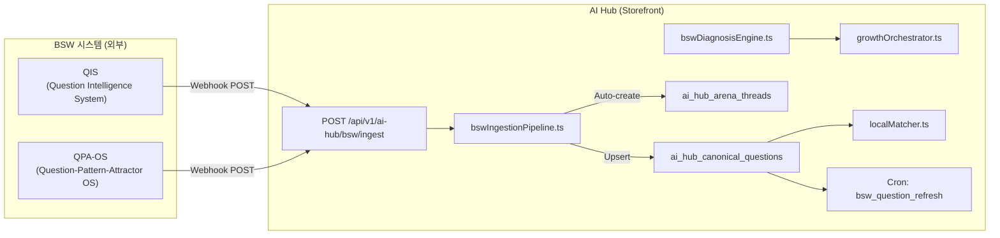

# BSW 시스템 연계 — 질문 자산 인제스트 파이프라인 현황 분석

> **최종 분석일**: 2026-07-05  
> **분석 대상**: `apps/storefront` (AI Hub Storefront)  
> **관련 시스템**: BSW (Brand Search Winning) → AI Hub (제주 AI 검색 허브)

---

## 1. 아키텍처 개요

BSW 시스템과 AI Hub의 연동은 **질문 자산(Canonical Questions)을 BSW에서 생성하여 AI Hub로 주입**하는 단방향 파이프라인으로 설계되어 있습니다.



---

## 2. 구현 완료된 컴포넌트 (Component Inventory)

### 2.1 Webhook API 엔드포인트

| 파일 | 경로 | HTTP 메서드 | 구현 상태 |
|------|------|------------|----------|
| [route.ts](file:///c:/Users/User/aihompyhub/apps/storefront/app/api/v1/ai-hub/bsw/ingest/route.ts) | `/api/v1/ai-hub/bsw/ingest` | `POST` | ✅ 완전 구현 |
| [route.ts](file:///c:/Users/User/aihompyhub/apps/storefront/app/api/v1/ai-hub/bsw/ingest/route.ts) | `/api/v1/ai-hub/bsw/ingest` | `GET` | ✅ 완전 구현 |
| [route.ts](file:///c:/Users/User/aihompyhub/apps/storefront/app/api/v1/ai-hub/cron/route.ts) | `/api/v1/ai-hub/cron?job=bsw_question_refresh` | `GET` | ✅ 완전 구현 |
| [route.ts](file:///c:/Users/User/aihompyhub/apps/storefront/app/api/v1/ai-hub/merchant/diagnose/route.ts) | `/api/v1/ai-hub/merchant/diagnose` | `POST` | ✅ 완전 구현 |

### 2.2 핵심 라이브러리 모듈

| 파일 | 역할 | 구현 상태 |
|------|------|----------|
| [bswIngestionPipeline.ts](file:///c:/Users/User/aihompyhub/apps/storefront/lib/ai-hub/bswIngestionPipeline.ts) | BSW → CQ 인제스트 + Arena 자동 생성 | ✅ 완전 구현 |
| [bswDiagnosisEngine.ts](file:///c:/Users/User/aihompyhub/apps/storefront/lib/ai-hub/bswDiagnosisEngine.ts) | 7축 AI검색 준비도 진단 (Gemini + Heuristic) | ✅ 완전 구현 |
| [growthOrchestrator.ts](file:///c:/Users/User/aihompyhub/apps/storefront/lib/ai-hub/growthOrchestrator.ts) | 소상공인 성장 미션 생성 + DB 저장 | ✅ 완전 구현 |
| [localMatcher.ts](file:///c:/Users/User/aihompyhub/apps/storefront/lib/ai-hub/localMatcher.ts) | TCO+@Context → 소상공인 매칭 (Vec7D Cosine) | ✅ 완전 구현 |
| [types.ts](file:///c:/Users/User/aihompyhub/apps/storefront/lib/ai-hub/types.ts) | BSW 관련 타입 정의 | ✅ 완전 구현 |

### 2.3 DB 스키마

| 테이블 | 역할 | 구현 상태 |
|--------|------|----------|
| `ai_hub_domains` | 허브 도메인 메타 (slug, region_code, config) | ✅ DDL 작성 완료 |
| `ai_hub_canonical_questions` | BSW로부터 수신한 질문 자산 SSoT | ✅ DDL + 인덱스 |
| `ai_hub_arena_threads` | CQ 기반 자동 생성 토론 스레드 | ✅ DDL + UNIQUE |
| `ai_hub_arena_replies` | 4-layer 답변 (AI/Expert/Merchant/Community) | ✅ DDL |
| `ai_hub_merchants` | 소상공인 프로필 + 진단 결과 | ✅ DDL |
| `ai_hub_growth_missions` | 성장 미션 트래킹 | ✅ DDL |

> 스키마 파일: [ai_hub_schema.sql](file:///c:/Users/User/aihompyhub/apps/storefront/lib/migrations/ai_hub_schema.sql)

---

## 3. 데이터 흐름 상세

### 3.1 BSW → AI Hub 질문 인제스트 (POST)

```
BSW QIS/QPA-OS
  │
  ├── HTTP POST /api/v1/ai-hub/bsw/ingest
  │     Headers: { x-bsw-secret: <BSW_WEBHOOK_SECRET> }
  │     Body:    { region: "jeju", questions: BSWQuestion[] }
  │
  ├── [route.ts] 인증 검증 + 입력 유효성 검사
  │     ├── secret 불일치 → 401 UNAUTHORIZED
  │     ├── region 누락 → 400 MISSING_REGION
  │     ├── questions 비어있음 → 400 MISSING_QUESTIONS
  │     ├── questions > 500 → 400 TOO_MANY_QUESTIONS
  │     └── question.text 2자 미만 → 400 INVALID_QUESTION_SHAPE
  │
  ├── [bswIngestionPipeline.ts] ingestBSWQuestions()
  │     ├── ai_hub_domains에서 regionSlug → hubDomainId 해석
  │     ├── 50건씩 배치 처리
  │     ├── ai_hub_canonical_questions에 UPSERT
  │     │     onConflict: (hub_domain_id, question_text)
  │     │     → 기존 질문은 업데이트, 신규 질문은 삽입
  │     └── ingested > 0 이면 autoCreateArenaThreads() 호출
  │
  └── [bswIngestionPipeline.ts] autoCreateArenaThreads()
        ├── hub_domain_id 기준 active 질문 상위 20건 조회
        │     (competitor_count ASC 정렬 — 선점 기회 높은 순)
        ├── question_text → slug 변환 (한글 유지, 80자 제한)
        ├── slug 중복 확인 → 이미 존재하면 skip
        └── ai_hub_arena_threads에 INSERT (cq_id FK 연결)
```

### 3.2 BSWQuestion 인터페이스

```typescript
// 파일: bswIngestionPipeline.ts L4-L12
export interface BSWQuestion {
  id: string;
  text: string;                              // 질문 본문 (필수, 2자 이상)
  industry_type: string;                     // 업종 구분
  tco_entities?: Record<string, string>;     // TCO 엔티티 (시간/맥락/목적)
  at_context?: Record<string, string>;       // @컨텍스트 (동행/날씨/교통)
  search_volume_trend?: string;              // 검색량 추이 ("+180%" 등)
  source: string;                            // 출처 (기본: 'bsw_auto')
}
```

### 3.3 CQ → DB 매핑 테이블

| BSWQuestion 필드 | DB 컬럼 | 변환 | 기본값 |
|-----------------|---------|------|--------|
| `(자동)` | `hub_domain_id` | regionSlug → UUID 해석 | — |
| `text` | `question_text` | 그대로 | — |
| `tco_entities` | `tco_entities` | 그대로 (JSONB) | `{}` |
| `at_context` | `at_context` | 그대로 (JSONB) | `{}` |
| `search_volume_trend` | `search_volume_trend` | 그대로 | `null` |
| `(미사용)` | `competitor_count` | 하드코딩 | `0` |
| `source` | `source` | 그대로 | `'bsw_auto'` |
| `(자동)` | `status` | 하드코딩 | `'active'` |

---

## 4. BSW 진단 엔진 (bswDiagnosisEngine)

### 4.1 7축 진단 모델

```
                ┌─────────────────┐
                │ aiSearchReadiness│ ← 7축 평균
                └────────┬────────┘
                         │
    ┌────────────────────┼────────────────────┐
    │                    │                    │
┌───┴───┐ ┌─────┴──────┐ ┌────┴─────┐ ┌─────┴──────┐
│질문명확│ │답변완성도  │ │증거가시성│ │경계안전성  │
│성     │ │            │ │          │ │            │
└───────┘ └────────────┘ └──────────┘ └────────────┘
    ┌────────────────────┼────────────────────┐
    │                    │                    │
┌───┴───┐ ┌─────┴──────┐ ┌────┴─────┐
│CTA강도│ │미디어준비도│ │ZFAC준비도│
│       │ │            │ │          │
└───────┘ └────────────┘ └──────────┘
```

| 축 | 필드명 | Heuristic 계산식 | 범위 |
|----|--------|-----------------|------|
| 1 | `questionClarity` | `min(100, officialAnswerCount × 15 + (amenityCount > 3 ? 15 : 0))` | 0–100 |
| 2 | `answerCompleteness` | `min(100, officialAnswerCount × 20)` | 0–100 |
| 3 | `proofVisibility` | `min(100, photoCount × 10)` | 0–100 |
| 4 | `boundarySafety` | 고정 `80` | 80 |
| 5 | `ctaStrength` | `amenityCount > 3 ? 65 : amenityCount > 1 ? 40 : 20` | 20–65 |
| 6 | `mediaReadiness` | `min(100, photoCount × 8 + (officialAnswerCount > 0 ? 20 : 0))` | 0–100 |
| 7 | `zfacReadiness` | `officialAnswerCount > 2 ? 70 : officialAnswerCount > 0 ? 40 : 15` | 15–70 |

### 4.2 이중 실행 전략

```
                   ┌────────────────────┐
                   │ GEMINI_API_KEY ?   │
                   └────────┬───────────┘
                     ┌──────┴──────┐
                    Yes           No
                     │             │
              ┌──────┴──────┐  ┌──┴──────────┐
              │ Gemini LLM  │  │  Heuristic  │
              │ (temp=0.2)  │  │  Fallback   │
              └──────┬──────┘  └─────────────┘
                     │
              ┌──────┴──────┐
              │ JSON 파싱   │
              │ 성공?       │
              └──────┬──────┘
                ┌────┴────┐
               Yes       No
                │         │
         ┌──────┴──────┐  └──→ Heuristic Fallback
         │ LLM 결과    │
         │ 반환        │
         └─────────────┘
```

- **LLM 모드**: Gemini API 키가 존재하면 `AI_MODELS.standard` 모델로 실시간 진단 수행
- **Heuristic 모드**: API 키 없거나 LLM 호출 실패 시 규칙 기반 점수 계산으로 폴백
- **출력 타입**: `BSWDiagnosisResult` (7축 점수 + 어트랙터팩 + 즉각 개선 조치)

### 4.3 Attractor Pack — 질문 선점 기회

진단 결과에는 소상공인에게 제안할 **어트랙터 질문 세트**가 포함됩니다:

```typescript
export interface AttractorPack {
  questions: AttractorQuestion[];   // 선점 가능 질문 목록
  totalExpectedGain: number;        // 전체 예상 준비도 상승 합계
}

export interface AttractorQuestion {
  text: string;                     // "제주 OOO 주차 공간 넉넉한가요?"
  searchVolumeTrend: string;        // "+180%"
  competitorCount: number;          // 경쟁자 수
  firstMoverOpportunity: boolean;   // 선점 기회 여부
  expectedReadinessGain: number;    // 이 질문 답변 시 예상 준비도 상승
}
```

---

## 5. 질문 자산 소비자 (Downstream Consumers)

인제스트된 Canonical Questions는 다음 컴포넌트에서 소비됩니다:

### 5.1 AI Hub 메인 페이지

| 파일 | 용도 |
|------|------|
| [page.tsx](file:///c:/Users/User/aihompyhub/apps/storefront/app/%5Blocale%5D/ai-hub/%5Bregion%5D/page.tsx) | 홈 화면에 상위 6개 인기 질문 카드 표시 (`competitor_count ASC`) |

### 5.2 Arena (질문 토론 시스템)

| 파일 | 용도 |
|------|------|
| [arena/page.tsx](file:///c:/Users/User/aihompyhub/apps/storefront/app/%5Blocale%5D/ai-hub/%5Bregion%5D/arena/page.tsx) | 토론 스레드 목록 — CQ에서 자동 생성된 스레드 표시 |

### 5.3 Cron Job (정기 갱신)

| 파일 | 용도 |
|------|------|
| [cron/route.ts](file:///c:/Users/User/aihompyhub/apps/storefront/app/api/v1/ai-hub/cron/route.ts) | `bsw_question_refresh` Job — 활성 CQ 개수 점검 |

### 5.4 소상공인 진단 API

| 파일 | 용도 |
|------|------|
| [diagnose/route.ts](file:///c:/Users/User/aihompyhub/apps/storefront/app/api/v1/ai-hub/merchant/diagnose/route.ts) | SSE 스트리밍 진단 — BSW 진단 엔진 호출 → 결과 DB 저장 |

### 5.5 Growth Orchestrator (성장 미션)

| 파일 | 용도 |
|------|------|
| [growthOrchestrator.ts](file:///c:/Users/User/aihompyhub/apps/storefront/lib/ai-hub/growthOrchestrator.ts) | 진단 결과 기반 성장 미션 자동 생성 (사진 업로드, 답변 작성 등) |

---

## 6. 인증 및 보안

| 항목 | 구현 방식 | 상태 |
|------|----------|------|
| Webhook 인증 | `x-bsw-secret` 헤더 vs `BSW_WEBHOOK_SECRET` 환경변수 | ✅ |
| 빈 시크릿 허용 | 환경변수 미설정 시 인증 우회 (`BSW_WEBHOOK_SECRET ?? ''`) | ⚠️ |
| 입력 크기 제한 | 최대 500건/요청 | ✅ |
| 입력 유효성 검사 | `text` 필드 존재 + 2자 이상 + string 타입 | ✅ |
| Rate Limiting | **미구현** | ❌ |
| Cron 인증 | `CRON_SECRET` Bearer 토큰 | ✅ |

> [!WARNING]
> `BSW_WEBHOOK_SECRET`이 설정되지 않으면 인증 없이 누구나 질문을 주입할 수 있습니다.
> Vercel 환경변수에 반드시 설정 필요.

---

## 7. 환경변수 요구사항

| 변수명 | 용도 | 필수 여부 |
|--------|------|----------|
| `BSW_WEBHOOK_SECRET` | BSW → AI Hub 웹훅 인증 시크릿 | ⚠️ 강력 권장 |
| `GEMINI_API_KEY` | BSW 진단 엔진 LLM 호출 | 선택 (미설정 시 Heuristic) |
| `GOOGLE_GENERATIVE_AI_API_KEY` | `GEMINI_API_KEY` 대체 | 선택 |
| `CRON_SECRET` | Cron Job 인증 | ⚠️ 강력 권장 |
| `NEXT_PUBLIC_SUPABASE_URL` | DB 접속 | ✅ 필수 |
| `SUPABASE_SERVICE_ROLE_KEY` | DB Admin 접속 | ✅ 필수 |

---

## 8. 테스트 가능한 API 호출 예시

### 8.1 질문 인제스트 (POST)

```bash
curl -X POST https://your-domain.com/api/v1/ai-hub/bsw/ingest \
  -H "Content-Type: application/json" \
  -H "x-bsw-secret: YOUR_SECRET" \
  -d '{
    "region": "jeju",
    "questions": [
      {
        "id": "q-001",
        "text": "제주 카페 주차 넓은 곳 추천",
        "industry_type": "cafe",
        "tco_entities": { "context": "주차 필요", "objective": "카페" },
        "at_context": { "transport": "자차" },
        "search_volume_trend": "+220%",
        "source": "bsw_auto"
      },
      {
        "id": "q-002",
        "text": "비 오는 날 제주 실내 관광지",
        "industry_type": "attraction",
        "tco_entities": { "context": "비 오는 날", "objective": "관광지" },
        "at_context": { "weather": "비" },
        "search_volume_trend": "+450%",
        "source": "bsw_auto"
      }
    ]
  }'
```

### 8.2 인제스트 상태 조회 (GET)

```bash
curl "https://your-domain.com/api/v1/ai-hub/bsw/ingest?region=jeju"
```

**응답 예시:**
```json
{
  "ok": true,
  "data": {
    "totalQuestions": 142,
    "bswSourced": 128,
    "lastIngestedAt": "2026-07-04T12:30:00Z"
  }
}
```

### 8.3 소상공인 진단 (SSE)

```bash
curl -N -X POST https://your-domain.com/api/v1/ai-hub/merchant/diagnose \
  -H "Content-Type: application/json" \
  -d '{ "merchantId": "uuid-here" }'
```

---

## 9. 현재 미구현 / 개선 필요 사항

### 9.1 미구현 (Not Yet Implemented)

| 항목 | 설명 | 우선도 |
|------|------|--------|
| **BSW → AI Hub 역방향 피드백** | AI Hub에서 수집된 사용자 검색 패턴을 BSW로 환류 | High |
| **실시간 검색량 추이 업데이트** | `search_volume_trend` 필드가 BSW 주입 시점 스냅샷만 저장 | Medium |
| **CQ 중복 제거 AI** | 의미적으로 유사한 질문 자동 병합 (현재 텍스트 exact match만) | Medium |
| **Rate Limiting** | BSW 웹훅 API에 Rate Limit 미적용 | High |
| **Webhook 재시도 + DLQ** | 실패한 인제스트 요청의 Dead Letter Queue 미구현 | Low |
| **CQ → Pattern Attractor 자동 클러스터링** | `ai_hub_pattern_attractors` 테이블 존재하나 자동 생성 로직 미구현 | Medium |

### 9.2 개선 권장 사항

| 항목 | 현재 | 권장 |
|------|------|------|
| `competitor_count` | 항상 `0`으로 하드코딩 | BSW에서 실제 경쟁자 수 전달 필요 |
| Arena 자동 생성 | 상위 20건만 | `search_volume_trend` 기반 필터링 + 우선순위 로직 |
| Upsert 충돌 키 | `(hub_domain_id, question_text)` 텍스트 매칭 | `(hub_domain_id, bsw_question_id)` 원본 ID 매칭으로 변경 권장 |
| 빈 시크릿 허용 | `BSW_WEBHOOK_SECRET ?? ''` | 빈 문자열 시 요청 거부로 변경 |

---

## 10. 관련 문서 참조

| 문서 | 경로 |
|------|------|
| BSW-OS QIS 시스템 가이드 | [BSW-OS_QIS_SYSTEM_GUIDE.md](file:///c:/Users/User/aihompyhub/docs/bsw/BSW-OS_QIS_SYSTEM_GUIDE.md) |
| AI Hub 구현 계획 v3.1 | [implementation_plan_v3.1.md](file:///c:/Users/User/aihompyhub/docs/ai-hub/implementation_plan_v3.1.md) |
| AI Hub SOTA 전략 | [jeju_ai_hub_sota_strategy.md](file:///c:/Users/User/aihompyhub/docs/ai-hub/jeju_ai_hub_sota_strategy.md) |
| AI Hub DB 스키마 | [ai_hub_schema.sql](file:///c:/Users/User/aihompyhub/apps/storefront/lib/migrations/ai_hub_schema.sql) |
| TCO 실험 계획 | [implementation_plan_TCO 실험.md](file:///c:/Users/User/aihompyhub/docs/bsw/implementation_plan_TCO%20실험.md) |

---

## 11. 파일 위치 맵

```
apps/storefront/
├── app/api/v1/ai-hub/
│   ├── bsw/ingest/route.ts          ← Webhook 엔드포인트 (POST + GET)
│   ├── cron/route.ts                ← bsw_question_refresh Job
│   └── merchant/diagnose/route.ts   ← SSE 소상공인 진단
├── lib/ai-hub/
│   ├── bswIngestionPipeline.ts      ← 인제스트 + Arena 자동 생성
│   ├── bswDiagnosisEngine.ts        ← 7축 진단 (Gemini + Heuristic)
│   ├── growthOrchestrator.ts        ← 성장 미션 생성
│   ├── localMatcher.ts              ← TCO+@Context → 소상공인 매칭
│   ├── types.ts                     ← BSWDiagnosisResult 등 타입 정의
│   └── aiHubConfig.ts               ← Hub 도메인 설정 로드
└── lib/migrations/
    └── ai_hub_schema.sql            ← DB 스키마 DDL
```

---

## 12. 요약 평가

| 평가 축 | 점수 | 근거 |
|---------|------|------|
| **API 설계** | 8/10 | REST 규약 준수, 에러 코드 체계적, 입력 검증 완비 |
| **데이터 모델** | 7/10 | TCO/AtContext JSONB 유연성 우수, 다만 외부 ID 연결 부재 |
| **보안** | 5/10 | 시크릿 인증 있으나 빈 값 허용, Rate Limit 없음 |
| **자동화** | 7/10 | Arena 자동 생성 우수, Pattern Attractor 미구현 |
| **확장성** | 8/10 | 배치 처리(50건), 모듈 분리 양호 |
| **모니터링** | 6/10 | 상태 조회 API 있으나 알림/로깅 미비 |

> **종합 성숙도**: **Phase 2 (기능 구현 완료, 운영 안정화 단계 진입 전)**  
> BSW 연동의 핵심 파이프라인(인제스트 → CQ 저장 → Arena 생성 → 진단 → 성장 미션)은 완전히 구현되어 있으나, 역방향 피드백 루프, Rate Limiting, 의미적 중복 제거 등 운영 수준 기능이 미비합니다.
