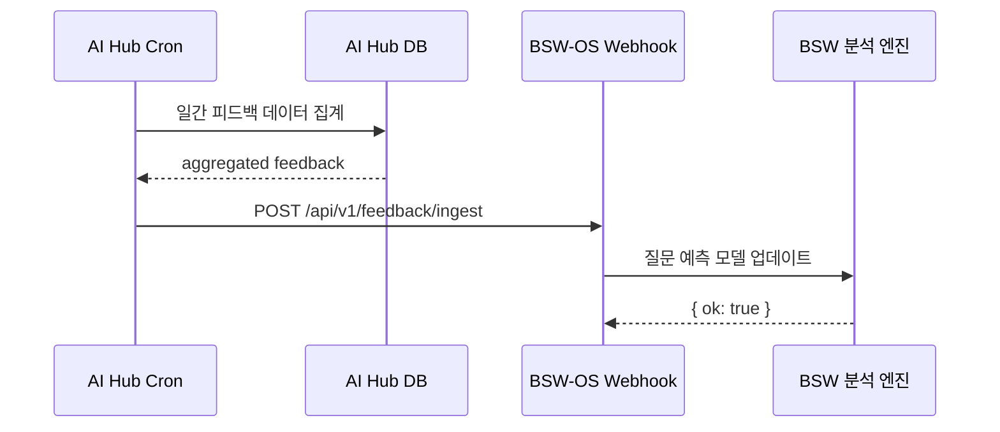

# BSW 역방향 피드백 및 미구현 기능 구현 방안

> **작성일**: 2026-07-05  
> **참조**: [bsw_integration.md](file:///c:/Users/User/aihompyhub/docs/test/bsw_integration.md) §9 미구현 사항  
> **목적**: BSW ↔ AI Hub 간 양방향 데이터 순환을 완성하고 운영 수준 기능을 보강

---

## 1. 역방향 피드백 시스템 (AI Hub → BSW)

### 1.1 문제 정의

현재 BSW → AI Hub는 단방향 파이프라인입니다. AI Hub에서 수집되는 **사용자 검색 패턴, Arena 투표 결과, CQ 소비 데이터**가 BSW로 환류되지 않아 BSW의 질문 예측 및 진단 정확도가 향상되지 않습니다.

```
현재: BSW ──CQ/Scene──→ AI Hub  (단방향)
목표: BSW ←──Feedback──→ AI Hub  (양방향 폐쇄 루프)
```

### 1.2 피드백 데이터 분류 (MECE)

| 피드백 유형 | 데이터 원천 | BSW 활용 목적 | 우선도 |
|------------|-----------|-------------|--------|
| **검색 패턴** | `ai_hub_run_receipts` | QIS 질문 예측 정확도 향상 | 🔴 High |
| **CQ 소비 히트맵** | `ai_hub_canonical_questions` view count | CPS 점수 보정 | 🔴 High |
| **Arena 투표 결과** | `ai_hub_arena_replies` helpful/unhelpful | 답변 품질 벤치마크 | 🟡 Medium |
| **소상공인 진단 결과** | `ai_hub_merchants.diagnosis_result` | 업종별 준비도 통계 | 🟡 Medium |
| **전환 이벤트** | `ai_hub_run_receipts.cta_clicks` | ROI 측정 + 상위 CQ 식별 | 🟢 Low |

### 1.3 구현 방안

#### Option A: Push API (AI Hub → BSW 웹훅) — **권장**



**새 파일**: `app/api/v1/ai-hub/cron/route.ts` 에 `feedback_push` Job 추가

```typescript
case 'feedback_push': {
  // 1. 최근 24시간 검색 패턴 집계
  const { data: receipts } = await supabaseAdmin
    .from('ai_hub_run_receipts')
    .select('query, tco_parsed, at_context_parsed, matched_merchants, cta_clicks, resolved')
    .eq('hub_domain_id', hubId)
    .gte('created_at', new Date(Date.now() - 86400_000).toISOString())
    .limit(500);

  // 2. CQ 소비 히트맵
  const { data: topCqs } = await supabaseAdmin
    .from('ai_hub_canonical_questions')
    .select('bsw_question_id, question_text, competitor_count')
    .eq('hub_domain_id', hubId)
    .eq('status', 'active')
    .order('competitor_count', { ascending: true })
    .limit(50);

  // 3. Arena 투표 상위 답변
  const { data: topReplies } = await supabaseAdmin
    .from('ai_hub_arena_replies')
    .select('thread_id, layer, helpful_count, unhelpful_count, elo_score')
    .eq('status', 'active')
    .order('elo_score', { ascending: false })
    .limit(20);

  // 4. BSW 웹훅으로 전송
  const bswWebhookUrl = process.env.BSW_FEEDBACK_WEBHOOK_URL;
  if (bswWebhookUrl) {
    await fetch(bswWebhookUrl, {
      method: 'POST',
      headers: {
        'Content-Type': 'application/json',
        'x-hub-secret': process.env.BSW_FEEDBACK_SECRET ?? '',
      },
      body: JSON.stringify({
        region, hubDomainId: hubId, date: today,
        searchPatterns: receipts ?? [],
        topCqs: topCqs ?? [],
        arenaVotes: topReplies ?? [],
      }),
    });
  }
  return NextResponse.json({ ok: true, job, pushed: (receipts ?? []).length });
}
```

**새 환경변수:**

| 변수 | 용도 |
|------|------|
| `BSW_FEEDBACK_WEBHOOK_URL` | BSW-OS 피드백 수신 엔드포인트 |
| `BSW_FEEDBACK_SECRET` | 역방향 인증 시크릿 |

#### Option B: Pull API (BSW가 AI Hub에서 가져감)

**새 파일**: `app/api/v1/ai-hub/bsw/feedback/route.ts`

```typescript
// GET /api/v1/ai-hub/bsw/feedback?region=jeju&since=2026-07-04
// BSW가 polling으로 조회
export async function GET(request: NextRequest) {
  // x-bsw-secret 인증
  // since 기준 검색 패턴 + CQ 히트맵 + Arena 데이터 반환
}
```

> **권장**: Option A (Push)와 Option B (Pull)를 **모두** 구현하여 BSW가 선택할 수 있게 합니다.
> Push는 Cron에서 매일 새벽 자동 실행, Pull은 BSW가 필요 시 즉시 조회.

### 1.4 피드백 페이로드 규격

```json
{
  "version": "1.0",
  "region": "jeju",
  "hub_domain_id": "uuid",
  "date": "2026-07-05",
  "search_patterns": [
    {
      "query": "제주 비 오는 날 실내 카페",
      "tco": { "context": "비 오는 날", "objective": "카페" },
      "at_ctx": { "weather": "비" },
      "matched_count": 3,
      "resolved": true,
      "cta_clicks": { "naver_map": 2, "tabling": 1 }
    }
  ],
  "top_cqs": [
    {
      "bsw_question_id": "cq-uuid-001",
      "question_text": "제주 흑돼지 맛집 주차",
      "view_count_24h": 142,
      "arena_thread_reply_count": 8
    }
  ],
  "arena_top_answers": [
    {
      "thread_title": "제주 카페 주차 넓은 곳",
      "best_layer": "merchant_official",
      "elo_score": 1450,
      "helpful_ratio": 0.92
    }
  ],
  "diagnosis_summary": {
    "avg_readiness": 42,
    "merchants_diagnosed": 28,
    "top_deficit_axis": "proofVisibility"
  }
}
```

---

## 2. CQ 의미적 중복 제거

### 2.1 문제 정의

현재 upsert 충돌 키가 `(hub_domain_id, question_text)` 텍스트 exact match입니다.
"제주 카페 주차 넓은 곳" vs "제주 카페 주차장 넓은 카페" 같은 의미적 동일 질문이 중복 저장됩니다.

### 2.2 구현 방안

#### 2단계 중복 제거 전략

```
Step 1: 텍스트 정규화 (즉시 적용)
  ├── 한글 자모 분리 정규화
  ├── 조사/어미 제거 (형태소 분석 없이 규칙 기반)
  ├── 불용어 제거 ("제주", "추천", "곳" 등)
  └── 정규화된 텍스트로 upsert 키 생성

Step 2: 임베딩 유사도 (추후 적용)
  ├── CQ text → 임베딩 벡터 생성 (Gemini embedding)
  ├── 코사인 유사도 > 0.92 → 중복 후보
  ├── 중복 후보 그룹의 대표 CQ 선정 (가장 높은 CPS 점수)
  └── 나머지 CQ는 status='merged' + merged_into_id 설정
```

#### 새 파일: `lib/ai-hub/cqDeduplicator.ts`

```typescript
export interface DeduplicationResult {
  duplicatesFound: number;
  merged: number;
  representativeCqIds: string[];
}

/**
 * 1단계: 텍스트 정규화 기반 중복 제거
 */
export function normalizeCQText(text: string): string {
  return text
    .replace(/\s+/g, ' ')
    .replace(/[?？!！.。,，]/g, '')
    .replace(/(은|는|이|가|을|를|의|에|에서|로|으로|와|과|도|만|까지|부터)(\s|$)/g, ' ')
    .replace(/제주(도)?/g, '')
    .replace(/(추천|곳|어디|뭐|좀|좋은)/g, '')
    .trim()
    .toLowerCase();
}

/**
 * 2단계: 임베딩 유사도 기반 중복 제거 (Gemini embedding)
 */
export async function deduplicateByEmbedding(
  hubDomainId: string,
  threshold: number = 0.92
): Promise<DeduplicationResult> {
  // 구현: Gemini text-embedding-005로 벡터 생성 후 코사인 유사도 비교
}
```

#### DB 변경

```sql
ALTER TABLE ai_hub_canonical_questions
  ADD COLUMN IF NOT EXISTS normalized_text TEXT,
  ADD COLUMN IF NOT EXISTS merged_into_id UUID REFERENCES ai_hub_canonical_questions(id);

CREATE INDEX IF NOT EXISTS idx_aihub_cq_normalized 
  ON ai_hub_canonical_questions (hub_domain_id, normalized_text);
```

---

## 3. Pattern Attractor 자동 클러스터링

### 3.1 문제 정의

`ai_hub_pattern_attractors` 테이블은 DDL이 존재하지만, CQ를 자동으로 클러스터링하여 Pattern Attractor를 생성하는 로직이 없습니다.

### 3.2 구현 방안

#### 새 파일: `lib/ai-hub/patternAttractorEngine.ts`

```typescript
/**
 * CQ들을 TCO 엔티티 + 업종 기준으로 클러스터링하여 Pattern Attractor를 생성합니다.
 * 
 * 클러스터링 기준:
 * 1. objective(목적) 동일 → 같은 attractor
 * 2. context(맥락) 동일 → 같은 attractor
 * 3. industry_type × context 교차 → cross-industry attractor
 * 
 * 예시:
 * CQ: "비 오는 날 카페", "비 올 때 관광지", "비 오는 날 맛집"
 * → Pattern Attractor: "비 오는 날" (matched_cq_ids: [cq1, cq2, cq3])
 */
export async function generatePatternAttractors(hubDomainId: string): Promise<{
  created: number;
  updated: number;
}> {
  // 1. 모든 active CQ의 tco_entities.context 추출
  // 2. 빈도 상위 컨텍스트별 CQ 그룹핑
  // 3. 그룹 크기 >= 3 → Pattern Attractor 생성/업데이트
  // 4. 관련 소상공인 매칭 (localMatcher.ts 활용)
}
```

#### Cron 통합

```typescript
case 'pattern_attractor_refresh': {
  const result = await generatePatternAttractors(hubId);
  return NextResponse.json({ ok: true, job, ...result });
}
```

---

## 4. Rate Limiting

### 4.1 문제 정의

BSW 인제스트 API에 Rate Limit이 없어 악의적 또는 잘못된 클라이언트가 대량 요청을 보낼 수 있습니다.

### 4.2 구현 방안

#### Option A: 인메모리 Token Bucket (외부 의존성 없음) — **권장**

```typescript
// lib/ai-hub/rateLimit.ts
const RATE_LIMITS = new Map<string, { tokens: number; lastRefill: number }>();

export function checkRateLimit(
  key: string, 
  maxTokens: number = 20, 
  refillIntervalMs: number = 60_000
): { allowed: boolean; remaining: number } {
  const now = Date.now();
  const bucket = RATE_LIMITS.get(key) ?? { tokens: maxTokens, lastRefill: now };
  
  // Refill tokens
  const elapsed = now - bucket.lastRefill;
  const refills = Math.floor(elapsed / refillIntervalMs);
  if (refills > 0) {
    bucket.tokens = Math.min(maxTokens, bucket.tokens + refills * maxTokens);
    bucket.lastRefill = now;
  }
  
  if (bucket.tokens <= 0) {
    RATE_LIMITS.set(key, bucket);
    return { allowed: false, remaining: 0 };
  }
  
  bucket.tokens--;
  RATE_LIMITS.set(key, bucket);
  return { allowed: true, remaining: bucket.tokens };
}
```

#### 적용 위치

```typescript
// ingest/route.ts 상단
const rateCheck = checkRateLimit(`bsw_ingest_${region}`, 20, 60_000);
if (!rateCheck.allowed) {
  return NextResponse.json(
    { ok: false, code: 'RATE_LIMIT_EXCEEDED', retryAfter: 60 },
    { status: 429, headers: { 'Retry-After': '60' } }
  );
}
```

#### Option B: Upstash Redis (분산 환경)

Vercel Serverless에서 인메모리 Rate Limit은 인스턴스 간 공유 안 됨.
Upstash Redis를 사용하면 글로벌 Rate Limit 가능.

> 초기에는 Option A (인메모리)로 시작하고, Vercel 스케일링 이후 Option B로 전환 권장.

---

## 5. Webhook 재시도 + DLQ (Dead Letter Queue)

### 5.1 문제 정의

BSW에서 인제스트 요청이 실패하면 데이터가 유실됩니다.

### 5.2 구현 방안

#### BSW 측 (송신자) — 재시도 전략

```
1회 실패 → 5초 후 재시도
2회 실패 → 30초 후 재시도  
3회 실패 → 5분 후 재시도
4회 이상 → DLQ 저장 + 관리자 알림
```

#### AI Hub 측 (수신자) — DLQ 테이블

```sql
CREATE TABLE IF NOT EXISTS ai_hub_ingest_dlq (
  id            UUID PRIMARY KEY DEFAULT gen_random_uuid(),
  hub_domain_id UUID NOT NULL REFERENCES ai_hub_domains(id),
  payload       JSONB NOT NULL,
  error_message TEXT,
  retry_count   INT NOT NULL DEFAULT 0,
  max_retries   INT NOT NULL DEFAULT 3,
  status        TEXT NOT NULL DEFAULT 'pending',
  created_at    TIMESTAMPTZ NOT NULL DEFAULT now(),
  next_retry_at TIMESTAMPTZ
);
```

#### DLQ 처리 Cron Job

```typescript
case 'dlq_retry': {
  const { data: pending } = await supabaseAdmin
    .from('ai_hub_ingest_dlq')
    .select('*')
    .eq('status', 'pending')
    .lte('next_retry_at', new Date().toISOString())
    .limit(10);

  let retried = 0;
  for (const item of (pending ?? []) as Array<Record<string, unknown>>) {
    const payload = item.payload as { region: string; questions: unknown[]; scenes?: unknown[] };
    const result = await ingestBSWQuestions(
      payload.region, 
      payload.questions as BSWQuestion[], 
      payload.scenes as BSWScene[] | undefined
    );
    
    if (result.errors.length === 0) {
      await supabaseAdmin.from('ai_hub_ingest_dlq')
        .update({ status: 'resolved' }).eq('id', item.id);
    } else {
      const retryCount = (item.retry_count as number) + 1;
      if (retryCount >= (item.max_retries as number)) {
        await supabaseAdmin.from('ai_hub_ingest_dlq')
          .update({ status: 'failed', retry_count: retryCount }).eq('id', item.id);
      } else {
        const backoff = Math.pow(2, retryCount) * 60_000;
        await supabaseAdmin.from('ai_hub_ingest_dlq')
          .update({ 
            retry_count: retryCount, 
            next_retry_at: new Date(Date.now() + backoff).toISOString() 
          }).eq('id', item.id);
      }
    }
    retried++;
  }
  return NextResponse.json({ ok: true, job, retried });
}
```

---

## 6. CQ 실시간 검색량 추이 업데이트

### 6.1 문제 정의

`search_volume_trend` 필드가 BSW 주입 시점의 스냅샷만 저장합니다. AI Hub에서 실제로 관측된 검색 빈도를 반영하지 않습니다.

### 6.2 구현 방안

#### 새 Cron Job: `cq_trend_update`

```typescript
case 'cq_trend_update': {
  // 1. 최근 7일 run_receipts에서 CQ별 매칭 빈도 집계
  const { data: receipts } = await supabaseAdmin
    .from('ai_hub_run_receipts')
    .select('query')
    .eq('hub_domain_id', hubId)
    .gte('created_at', new Date(Date.now() - 7 * 86400_000).toISOString());

  // 2. CQ question_text와 query 매칭 (정규화된 텍스트 비교)
  // 3. 매칭 빈도 → search_volume_trend 업데이트
  //    - 이전 7일 대비 증가율 계산
  //    - "+150%", "-30%", "stable" 등으로 표시
  // 4. competitor_count도 Arena reply 수 기반으로 보정
}
```

---

## 구현 우선순위 로드맵

| 우선순위 | 영역 | 기간 | 설명 |
|---------|------|------|------|
| **P0** (즉시) | Rate Limiting | 1일 | 인메모리 Token Bucket |
| **P0** (즉시) | 보안 강화 | 1일 | 빈 시크릿 차단 |
| **P1** (1주) | 역방향 피드백 Push/Pull | 3일 | Cron Push + Pull API |
| **P1** (1주) | CQ 텍스트 정규화 | 2일 | 규칙 기반 중복 제거 |
| **P2** (2주) | Pattern Attractor | 3일 | TCO 기반 자동 클러스터링 |
| **P2** (2주) | CQ 추이 업데이트 | 2일 | run_receipts 기반 보정 |
| **P3** (3주) | Webhook DLQ | 3일 | 재시도 + Dead Letter Queue |
| **P3** (3주) | 임베딩 중복 제거 | 3일 | Gemini embedding 코사인 유사도 |

---

## 파일 변경 요약

| 우선순위 | 영역 | 파일 | 변경 유형 |
|---------|------|------|----------|
| P0 | Rate Limiting | `lib/ai-hub/rateLimit.ts` | **NEW** |
| P0 | 보안 | `app/api/v1/ai-hub/bsw/ingest/route.ts` | MODIFY |
| P1 | 역방향 피드백 | `app/api/v1/ai-hub/bsw/feedback/route.ts` | **NEW** |
| P1 | 역방향 Cron | `app/api/v1/ai-hub/cron/route.ts` | MODIFY |
| P1 | 중복 제거 | `lib/ai-hub/cqDeduplicator.ts` | **NEW** |
| P1 | 중복 DB | `lib/migrations/ai_hub_schema_v3.sql` | **NEW** |
| P2 | Attractor | `lib/ai-hub/patternAttractorEngine.ts` | **NEW** |
| P2 | 추이 업데이트 | `app/api/v1/ai-hub/cron/route.ts` | MODIFY |
| P3 | DLQ | `lib/migrations/ai_hub_schema_v3.sql` | MODIFY |
| P3 | DLQ Cron | `app/api/v1/ai-hub/cron/route.ts` | MODIFY |
| P3 | 임베딩 | `lib/ai-hub/cqDeduplicator.ts` | MODIFY |

---

## 환경변수 추가 요약

| 변수 | 용도 | 필수 여부 |
|------|------|----------|
| `BSW_FEEDBACK_WEBHOOK_URL` | BSW-OS 피드백 수신 엔드포인트 | P1에서 필요 |
| `BSW_FEEDBACK_SECRET` | 역방향 인증 시크릿 | P1에서 필요 |
| `UPSTASH_REDIS_REST_URL` | Rate Limit Redis (Option B) | P0B 전환 시 |
| `UPSTASH_REDIS_REST_TOKEN` | Rate Limit Redis (Option B) | P0B 전환 시 |
