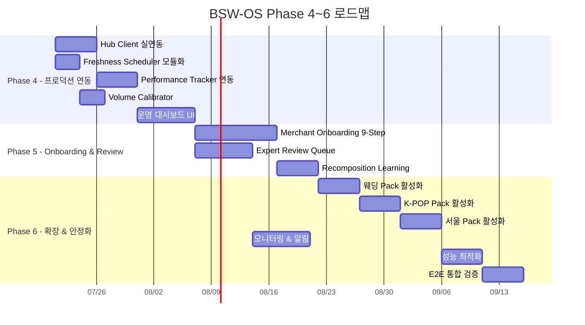

# BSW-OS Phase 4~6 고도화 구현 계획 v3.0

> 기준: 2026-07-18 현황 기반 전면 개정  
> 선행 Phase 0~3 완료 상태 반영

---

## 현황 진단: 무엇이 완료되었고, 무엇이 남았나

### ✅ 구현 완료 (Phase 0~3 + 감사 완료)

| Phase | 모듈 | 파일 | 상태 |
|-------|------|------|------|
| **P0** | 보안·데이터 무결성 | `external-collectors.ts` | ✅ API 키 환경변수화, 합성 데이터 추적 |
| **P1** | GSC 커넥터 | `connectors/gsc-connector.ts` | ✅ Service Account JWT 서명 |
| **P1** | Naver SA 커넥터 | `connectors/naver-sa-connector.ts` | ✅ |
| **P1** | VOC 커넥터 (4종) | `connectors/voc-connector.ts` | ✅ PII Redaction 내장 |
| **P1** | QuestionDetector 다층 감지 | `signal-bridge.ts` | ✅ Rule→Embedding→LLM 3단계 |
| **P2** | 임베딩 클러스터링 | `question-clusterer.ts` (437줄) | ✅ Agglomerative + Silhouette + Zero-Vector 필터 |
| **P2** | 하이브리드 CQ 정규화 | `cq-canonicalizer.ts` | ✅ 8-axis CPS 결정론적 산출 |
| **P2** | 결정론적 Scene Builder | `scene-builder.ts` | ✅ Rule Engine + LLM 보강 |
| **P2** | Semantic Tri-Axis Router | `tri-axis-router.ts` | ✅ multiAxisClassify 포함 |
| **P2** | Semantic Brand Assigner | `brand-assigner.ts` (9.3KB) | ✅ JOINT_ANSWER 지원 |
| **P3** | Opportunity Engine | `opportunity-engine.ts` (6KB) | ✅ 10축 스코어링 |
| **P4** | Evidence Registry | `evidence-registry.ts` (13.4KB) | ✅ 6-level hierarchy |
| **P4** | Claim Registry | `claim-registry.ts` (8.7KB) | ✅ YMYL 14개 금지어 |
| **P4** | Safety Gate | `safety-gate.ts` (8.5KB) | ✅ 8입력→5출력 CTA 조정 |
| **P4** | Policy Engine | `policy-engine.ts` (10.1KB) | ✅ 동적 Vertical 발견 |
| **P4** | Right-to-Answer Router | `right-to-answer-router.ts` (8KB) | ✅ Hub/Tenant/Joint |
| **P5** | Answer Mission Compiler | `answer-mission-compiler.ts` (11.3KB) | ✅ CQ+Scene+Evidence+Policy 조립 |
| **P5** | Answer Asset Generator | `answer-asset-generator.ts` (13.7KB) | ✅ 7채널 변형 + Fallback |
| **P5** | Validator Guild (10개) | `validator-guild.ts` (15KB) | ✅ 10단계 체인 검증 |
| **P5** | Thin Page Guard | `thin-page-guard.ts` (7.9KB) | ✅ 중복 감지 + 병합 제안 |
| **P6** | JSON-LD Factory | `json-ld-factory.ts` (5.7KB) | ✅ Content drift detection |
| **P6** | Sitemap Generator | `sitemap-generator.ts` (4.8KB) | ✅ |
| **P6** | Canonical Manager | `canonical-manager.ts` (4.8KB) | ✅ |
| **P6** | hreflang Manager | `hreflang-manager.ts` (3.7KB) | ✅ |
| **P6** | Internal Link Graph | `internal-link-graph-builder.ts` (10KB) | ✅ 9 Node + 8 Edge Type |
| **P6** | Answer Page Compiler | `answer-page-compiler.ts` (8.4KB) | ✅ SSR/SSG |
| **P7** | DR.O Migration | `dro-migration.ts` (12.7KB) | ✅ 10단계 파이프라인 |
| **P9** | Jeju E2E | `jeju-e2e.test.ts` (10.6KB) | ✅ 10/10 PASS |
| **P9** | Skincare E2E | `skincare-e2e.test.ts` (18KB) | ✅ 10/10 PASS |
| **인프라** | Pipeline State Manager | `pipeline-state-manager.ts` (14KB) | ✅ Checkpoint/Resume/Pause |
| **인프라** | Freshness Cron | `app/api/cron/freshness/route.ts` (7.6KB) | ✅ 엔드포인트 존재 |
| **인프라** | Pipeline E2E API | `app/api/pipeline/e2e/route.ts` | ✅ |
| **인프라** | 수집 관리 UI | `semantic-core/signals/page.tsx` | ✅ Sources 탭 |

> [!TIP]
> **기존 10-Phase 계획의 Phase 0~9 핵심 모듈이 사실상 모두 구현 완료되었습니다.**
> 남은 작업은 "프로덕션 운영 수준으로의 격상"과 "실 연동 배선"입니다.

---

### ⚠️ 미완성 / 미연동 영역 (Phase 4~6 대상)

| 영역 | 현재 상태 | 필요 작업 |
|------|----------|----------|
| **Hub 실연동** | `hub-client.ts` stub 메서드 (pullMetrics→10, pushAnswerAsset→로그만) | 실 API 배선 |
| **Freshness Scheduler 운영화** | Cron 엔드포인트 존재, `lib/` 모듈 미존재 | 스케줄링 로직 모듈화 |
| **Merchant Onboarding** | DR.O Migration만 구현, 신규 가맹점 온보딩 워크플로우 없음 | 9-Step UI + API |
| **Expert Review Workflow** | HumanReviewGate 플래그만 존재, 실제 큐/승인 UI 없음 | Review Queue UI |
| **Signal Performance Tracker** | 프레임워크만 존재, 실 GSC 데이터 연동 없음 | 학습 루프 배선 |
| **Volume Calibrator** | 프록시 계수 미검증 | GSC 실측 기반 회귀 분석 |
| **Recomposition Engine** | Pattern 강도 평가만, Asset 성과 피드백 없음 | 성과→재생산 루프 |
| **다도메인 확장** | 제주/스킨케어 2개만 | 웨딩/K-POP/서울맛집 Pack 활성화 |
| **운영 대시보드** | 파이프라인 실행 로그 기본 뷰만 | 실시간 모니터링 + 알림 |

---

## Phase 4 — 프로덕션 연동 & 운영화 (3주)

> **목표**: 구축 완료된 파이프라인을 실 프로덕션 환경에서 자율 운영 가능하도록 배선

---

### 4-A: Hub Client 실연동 (AiHompyHub ↔ BSW)

#### [MODIFY] [hub-client.ts](file:///c:/Users/User/bsw/lib/qis/hub-client.ts)

현재 stub 메서드들을 실 API 호출로 교체:

```typescript
// 현재 (stub)
async pullMetrics(region: string): Promise<number> { return 10; }
async pushAnswerAsset(asset: AnswerAssetSpec): Promise<void> { console.log('pushed'); }

// 교체 대상 메서드:
// 1. pushAnswerAsset() → Hub REST API POST /api/v1/answer-assets
// 2. pullMetrics() → Hub REST API GET /api/v1/metrics/{region}
// 3. pullFeedback() → Hub REST API GET /api/v1/feedback/{region}
// 4. pushCQRegistration() → Hub REST API POST /api/v1/canonical-questions
// 5. syncVerticalPack() → Hub REST API PUT /api/v1/packs/{packId}
```

- Hub URL은 `process.env.AIHOMPY_HUB_URL`로 설정
- 인증은 `process.env.AIHOMPY_HUB_API_KEY` Bearer Token
- Rate limiting: 60 req/min, Retry with exponential backoff
- Hub 미연결 시 graceful degradation (현재 로그 출력 유지)

---

### 4-B: Freshness Scheduler 모듈화

#### [NEW] `lib/answer-supply/freshness-scheduler.ts`

현재 `app/api/cron/freshness/route.ts`에 인라인된 로직을 독립 모듈로 추출:

```typescript
class FreshnessScheduler {
  // TTL 정책 (Vertical Pack별)
  // 제주: F0(1일), F1(30일), F2(90일), F3(1년)
  // 스킨케어: Product(90일), Regulatory(즉시), Expert(1년), Post-procedure(6개월)
  
  async scanExpiredAssets(workspaceId: string): Promise<ExpiredAsset[]>;
  async createRefreshQueue(expired: ExpiredAsset[]): Promise<RefreshQueueItem[]>;
  async notifyOwners(items: RefreshQueueItem[]): Promise<void>;
  
  // 자동 갱신: Evidence가 변경된 Asset 재생성
  async autoRefresh(item: RefreshQueueItem): Promise<RefreshedAsset | null>;
  
  // Vercel Cron 연동
  static cronHandler(req: Request): Promise<Response>;
}
```

#### [MODIFY] `app/api/cron/freshness/route.ts`
- 인라인 로직 → `FreshnessScheduler.cronHandler()` 위임
- Vercel Cron 설정: `vercel.json`에 `"crons": [{ "path": "/api/cron/freshness", "schedule": "0 3 * * *" }]`

---

### 4-C: Signal Performance Tracker 실 연동

#### [MODIFY] [signal-performance-tracker.ts](file:///c:/Users/User/bsw/lib/signal-collection/signal-performance-tracker.ts)

```typescript
class SignalPerformanceTracker {
  // GSC 데이터에서 Signal별 실제 Impressions/Clicks 매핑
  async ingestFromGSC(workspaceId: string): Promise<number>;
  // Observatory AI Probe 결과에서 Mention/Citation 매핑
  async ingestFromProbes(workspaceId: string): Promise<number>;
  // Answer Asset 발행 후 성과 추적 (클릭률, 체류시간)
  async trackAssetPerformance(assetId: string): Promise<PerformanceSnapshot>;
  // 학습: 단순 상관관계 → Ridge Regression으로 교체
  async learnWeightsV2(workspaceId: string): Promise<CalibratedWeights>;
}
```

---

### 4-D: Volume Estimator GSC 캘리브레이션

#### [MODIFY] [volume-estimator.ts](file:///c:/Users/User/bsw/lib/signal-collection/volume-estimator.ts)

```typescript
class VolumeCalibrator {
  // GSC 실측 볼륨과 프록시 추정값 쌍으로 회귀 분석
  async calibrate(workspaceId: string): Promise<CalibratedCoefficients>;
  // R² 및 MAPE(Mean Absolute Percentage Error) 보고
  async reportAccuracy(): Promise<CalibrationReport>;
  // 캘리브레이션된 계수 DB 저장 + 버전 관리
  async saveCoefficients(coeffs: CalibratedCoefficients): Promise<void>;
}
```

---

### 4-E: 파이프라인 운영 대시보드

#### [NEW] `app/[locale]/(workspace)/[workspace_slug]/answer-supply/page.tsx`

Answer Supply 전용 운영 대시보드:

| 섹션 | 기능 |
|------|------|
| **Pipeline Runs** | 실행 이력, 상태(running/paused/completed/failed), Phase별 진행률 |
| **Answer Assets** | 발행된 에셋 목록, 채널별 변형 미리보기, 검증 상태 |
| **Freshness Queue** | 만료 예정/만료된 에셋 목록, 자동/수동 갱신 트리거 |
| **Signal Health** | 수집 채널별 상태, 합성 데이터 비율 경고, 최근 수집량 추이 |
| **Hub Sync** | Hub 연동 상태, 최근 Push/Pull 로그, 실패 건 재시도 |

---

## Phase 5 — Merchant Onboarding & Expert Review (3주)

> **목표**: 가맹점(Tenant) 자율 온보딩 + 전문가 검토 워크플로우 구축

---

### 5-A: Merchant Onboarding 9-Step Workflow

#### [NEW] `lib/merchant/merchant-onboarding.ts`

```typescript
// Jeju Pack §17 기반 9단계 온보딩
enum OnboardingStep {
  BUSINESS_PROFILE,      // 1. 업체 기본 정보
  OPERATING_FACTS,       // 2. 운영 Fact Pack (주차, 유아의자, 인증 등)
  EVIDENCE_UPLOAD,       // 3. 증빙 자료 업로드 (사진, 인증서)
  BRAND_IDENTITY,        // 4. 브랜드 아이덴티티 입력
  FAQ_IMPORT,            // 5. 기존 Q&A 가져오기 (DR.O Migration)
  RTA_SCOPE_SETUP,       // 6. Right-to-Answer 범위 설정
  POLICY_AGREEMENT,      // 7. 정책 동의 (YMYL, 금지어)
  PREVIEW_REVIEW,        // 8. 생성 에셋 미리보기 + 수정
  PUBLISH_APPROVAL,      // 9. 최종 발행 승인
}

class MerchantOnboarding {
  async initiate(workspaceId: string, merchantData: MerchantProfile): Promise<OnboardingSession>;
  async progressStep(sessionId: string, step: OnboardingStep, data: any): Promise<StepResult>;
  async getProgress(sessionId: string): Promise<OnboardingProgress>;
  async completeOnboarding(sessionId: string): Promise<OnboardingResult>;
}
```

#### [NEW] `app/[locale]/(workspace)/[workspace_slug]/merchant/onboarding/page.tsx`
- 9단계 스텝퍼 UI (진행률 표시)
- 각 단계별 양식 + 실시간 검증
- Step 8에서 생성된 에셋 미리보기 카드

---

### 5-B: Expert Review Queue & Approval UI

#### [NEW] `lib/answer-supply/expert-review-queue.ts`

```typescript
class ExpertReviewQueue {
  // HumanReviewGate에서 플래그된 에셋을 큐에 추가
  async enqueue(assetId: string, reason: string, assignee?: string): Promise<string>;
  // 전문가가 검토 후 승인/거절/수정 요청
  async approve(reviewId: string, expertId: string, notes?: string): Promise<void>;
  async reject(reviewId: string, expertId: string, reason: string): Promise<void>;
  async requestRevision(reviewId: string, expertId: string, feedback: string): Promise<void>;
  // 큐 조회 (대기중/검토중/완료)
  async getQueue(workspaceId: string, status?: ReviewStatus): Promise<ReviewItem[]>;
  // SLA 모니터링 (48시간 내 미검토 시 에스컬레이션)
  async checkSLA(workspaceId: string): Promise<SLAReport>;
}
```

#### [NEW] `app/[locale]/(workspace)/[workspace_slug]/answer-supply/reviews/page.tsx`
- 검토 대기 목록 (우선순위 정렬)
- 에셋 원문 + Safety Gate 결과 + Evidence 출처 통합 뷰
- 인라인 승인/거절/수정요청 액션

---

### 5-C: Recomposition Engine 성과 학습 루프

#### [MODIFY] [recomposition-engine.ts](file:///c:/Users/User/bsw/lib/pattern-attractor/recomposition-engine.ts)

```typescript
// 기존: Pattern 강도 평가만
// 확장: Answer Asset 성과 → 재생산 파이프라인

class RecompositionEngine {
  // 1. 성과 피드백 수집 (GSC 노출/클릭, Hub 피드백, 사용자 반응)
  async collectPerformanceFeedback(workspaceId: string): Promise<PerformanceFeedback[]>;
  
  // 2. 저성과 에셋 식별 (CTR < 기대치, 체류시간 < 30초)
  async identifyUnderperformers(workspaceId: string): Promise<UnderperformerReport>;
  
  // 3. PRD §M10의 11개 Recomposition Action 실행
  async executeActions(report: UnderperformerReport): Promise<RecompositionResult>;
  // Actions: STRENGTHEN_EVIDENCE, ADD_VISUAL, SIMPLIFY_LANGUAGE, MERGE_THIN,
  //          SPLIT_OVERLOADED, UPDATE_CTA, REFRESH_STATS, ADD_COMPARISON,
  //          LOCALIZE_DEEPER, CROSS_LINK, DEPRECATE_STALE
  
  // 4. CasePack 생성 (성공/실패 사례 DB 축적)
  async createCasePack(assetId: string, outcome: 'success' | 'failure'): Promise<CasePack>;
}
```

---

## Phase 6 — 다도메인 확장 & 운영 안정화 (3주)

> **목표**: 제주/스킨케어 이외 도메인으로 확장 + 전체 시스템 안정화

---

### 6-A: 추가 Vertical Pack 활성화

이미 YAML Pack이 정의되어 있으나 파이프라인 미연결된 도메인들:

| Pack | 파일 | 활성화 작업 |
|------|------|-----------|
| 웨딩 스튜디오 | `packs/wedding-studio/` | 수집 소스 등록 + E2E 테스트 작성 |
| K-POP 아이돌 | `packs/kpop-idol-ko/` | 수집 소스 등록 + E2E 테스트 작성 |
| 서울 맛집/핫플 | `packs/seoul-district-ko/` | 수집 소스 등록 + E2E 테스트 작성 |

각 도메인별:
1. `collection-storage.ts`에 수집 소스 추가 (네이버 API + RSS + 커뮤니티)
2. `INDUSTRY_KEYWORDS`에 도메인 키워드 추가
3. `BENCHMARK_DOMAINS`에 브랜드 프로파일 추가
4. E2E 테스트 파일 작성 (MVP 수용 기준 10항목)
5. 파이프라인 1회 구동 + 산출물 품질 검증

---

### 6-B: 운영 모니터링 & 알림 체계

#### [NEW] `lib/monitoring/pipeline-monitor.ts`

```typescript
class PipelineMonitor {
  // 1. 파이프라인 실행 상태 모니터링
  async checkHealth(workspaceId: string): Promise<HealthReport>;
  
  // 2. 이상 탐지 (실행 시간 이상, 에러율 급증, 합성 데이터 비율 초과)
  async detectAnomalies(workspaceId: string): Promise<Anomaly[]>;
  
  // 3. 알림 발송 (Slack Webhook / Email)
  async sendAlert(anomaly: Anomaly): Promise<void>;
  
  // 4. 일일 운영 리포트 자동 생성
  async generateDailyReport(workspaceId: string): Promise<DailyReport>;
}
```

#### [NEW] `app/api/cron/daily-report/route.ts`
- 매일 09:00 KST 자동 실행
- 전일 수집 시그널 수, 생성 에셋 수, 만료 에셋 수, Hub 동기화 상태 요약

---

### 6-C: E2E 통합 검증 확장

#### [NEW] `tests/e2e/wedding-e2e.test.ts`
#### [NEW] `tests/e2e/kpop-e2e.test.ts`
#### [NEW] `tests/e2e/seoul-e2e.test.ts`

각 10개 MVP Acceptance Criteria + 도메인 특화 검증 항목

---

### 6-D: 성능 최적화 & 비용 관리

```typescript
// Cost Guard 고도화
class CostGuardV2 {
  // 일일 LLM 호출 비용 리포트
  async getDailyReport(workspaceId: string): Promise<CostReport>;
  // 도메인별 비용 한도 설정
  async setDomainLimit(domain: string, limitUSD: number): Promise<void>;
  // 비용 초과 시 Fallback 모드 자동 전환 (LLM → 결정론적 템플릿)
  async shouldUseFallback(workspaceId: string, domain: string): Promise<boolean>;
}
```

---

## 타임라인



---

## User Review Required

> [!IMPORTANT]
> ### 핵심 결정 1: Hub 실연동 범위
> AiHompyHub와의 실 API 연동을 Phase 4에서 진행합니다. Hub API 엔드포인트 스펙과 인증 정보(API Key)가 준비되어 있는지 확인이 필요합니다.
> - **Option A**: Hub REST API 완전 연동 (Push Asset + Pull Feedback + Sync CQ)
> - **Option B**: Push Asset만 우선 연동, Pull은 이후 단계

> [!IMPORTANT]
> ### 핵심 결정 2: 추가 도메인 우선순위
> Phase 6에서 활성화할 도메인 우선순위를 정해주세요:
> - 웨딩 스튜디오 (스드메 시장)
> - K-POP 아이돌 (팬덤 시장)
> - 서울 맛집/핫플 (로컬 시장)

> [!WARNING]
> ### 핵심 결정 3: Expert Review SLA
> 고위험(YMYL) 에셋의 전문가 검토 SLA를 설정해야 합니다:
> - **48시간** (스킨케어 의료 관련) → 미처리 시 발행 차단 유지
> - **72시간** (일반 YMYL) → 미처리 시 에스컬레이션

> [!NOTE]
> ### 비용 예상
> - Phase 4: LLM 호출 증가 없음 (배선/연동 중심), 인프라 비용만
> - Phase 5: Merchant 온보딩 시 DR.O Migration + Asset 생성으로 LLM 호출 증가
> - Phase 6: 도메인당 초기 부트스트랩 시 ~$5-10 LLM 비용

---

## Verification Plan

### Automated Tests
```bash
# Phase 4: Hub 연동 검증
npx vitest run lib/qis/hub-client             # Hub API 호출 모킹 테스트
npx vitest run lib/answer-supply/freshness    # Freshness 스케줄링 검증

# Phase 5: Onboarding 검증
npx vitest run lib/merchant/                  # 9-Step 워크플로우 단위 테스트
npx vitest run lib/answer-supply/expert-review # Review Queue 검증

# Phase 6: 다도메인 E2E
npx vitest run tests/e2e/wedding-e2e          # 웨딩 10/10
npx vitest run tests/e2e/kpop-e2e             # K-POP 10/10
npx vitest run tests/e2e/seoul-e2e            # 서울 10/10

# 전체 통합
npx vitest run                                # 모든 테스트 통과 확인
```

### Manual Verification
- Phase 4 완료 후: Hub로 에셋 Push 성공 확인, Freshness Cron 1회 수동 실행
- Phase 5 완료 후: 테스트 가맹점 1개 온보딩 → 에셋 발행까지 E2E 검증
- Phase 6 완료 후: 5개 도메인 파이프라인 동시 구동 → 산출물 품질 검토
