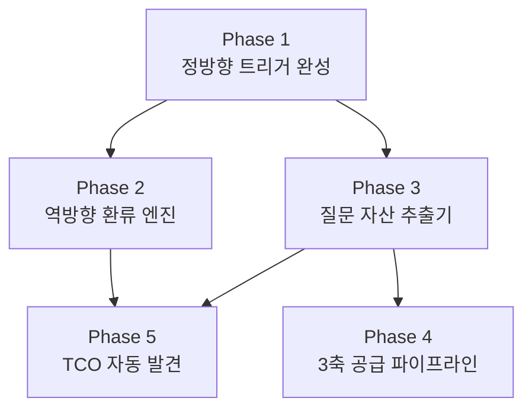

# Probe ↔ QIS/PA 폐쇄 루프 고도화 구현 계획

> **목표:** 현재 열린 루프(Open Loop)인 프로브셋 ↔ QIS/PA 연계를 **완전 폐쇄 루프(Closed Loop)**로 전환하여, 벤치마크 실측이 "단순 측정"에서 **"질문 자산 생산 엔진"**으로 격상되게 합니다.

---

## Phase 1 — 정방향 자동 트리거 완성

> 이미 구현된 정방향 파이프라인의 **끊어진 3개 연결점**을 복원합니다.

### [MODIFY] [run-benchmark.ts](file:///c:/Users/User/bsw/scripts/run-benchmark.ts)

**변경 내용:** 벤치마크 종료 후 자동으로 QIS Bridge를 호출하는 코드 추가.

현재 `main()` 함수의 끝에 DB insert 후 곧바로 종료되는데, 여기에 다음 로직을 삽입합니다:

```typescript
// ── Phase 1: 정방향 자동 트리거 ──
// 1. OpportunityAnalyzer로 모든 브랜드의 GAP/BlindSpot 추출
// 2. auto_generated_signals를 feedBenchmarkOpportunitiesToSignals()에 전달
// 3. 상위 N개 시그널을 autoPromoteSignalToCQ()로 자동 승격
```

핵심 로직:
- `result.question_details`에서 브랜드별 `OpportunityAnalyzer.analyze()` 실행
- 각 브랜드 Opportunity의 `auto_generated_signals` 수집·병합
- `feedBenchmarkOpportunitiesToSignals(workspace, signals)` 호출
- 시그널 중 `priority_score ≥ 80`인 항목을 `autoPromoteSignalToCQ()` 자동 승격

---

### [MODIFY] [opportunity-analyzer.ts](file:///c:/Users/User/bsw/lib/benchmark/opportunity-analyzer.ts)

**변경 내용:** LLM Judge 결과를 GAP 판정 로직에 반영.

현재 GAP 판정은 `brands_mentioned` 키워드 매칭만으로 이루어지지만, `QuestionDetail`에 이미 `llm_cwr_winner`와 `llm_bsf_score`가 포함되어 있습니다. 이를 활용하여:

```diff
 // 1. GAP Detection
-if (!mentionedInCurrentAnyEngine && competitorsPresent.length > 0) {
+if (!mentionedInCurrentAnyEngine && competitorsPresent.length > 0) {
+  // LLM Judge가 명시적으로 경쟁사 우위를 판정한 경우 severity 상향
+  const llmConfirmsCompetitorWin = Object.values(q.per_engine).some(
+    e => e.llm_cwr_winner && e.llm_cwr_winner !== targetBrandName && e.llm_cwr_winner !== 'tie'
+  );
+  const severity = isHighIntent || llmConfirmsCompetitorWin ? 'high' : 'medium';
```

추가로 `weak_mention` 판정에도 `llm_bsf_score`를 활용:
```diff
-if (avgBsf < 30) {
+const llmBsf = Object.values(q.per_engine)
+  .map(e => e.llm_bsf_score)
+  .filter((s): s is number => s !== undefined);
+const effectiveBsf = llmBsf.length > 0 ? Math.min(avgBsf, ...llmBsf) : avgBsf;
+if (effectiveBsf < 30) {
```

---

## Phase 2 — 역방향 환류 엔진 (핵심 신규 개발)

> QIS/PA에서 축적된 운영 지식이 다음 벤치마크의 프로브 질문 품질을 자동 향상시키는 역방향 루프를 구축합니다.

### [NEW] [probe-enricher.ts](file:///c:/Users/User/bsw/lib/benchmark/probe-enricher.ts)

역방향 환류 4개 채널을 하나의 모듈로 통합합니다:

```typescript
export interface EnrichmentResult {
  qis_injected_must_include: string[];    // 채널①: Scene → must_include
  pa_dynamic_probes: FairProbeTemplate[]; // 채널②: PA → 신규 프로브
  hub_priority_weights: Map<string, number>; // 채널③: Hub → 가중치
  tco_discovered_keywords: string[];      // 채널④: 실측 → TCO
}

export class ProbeEnricher {
  // 채널①: QIS Scene의 must_include/must_not_do를 프로브 검증 기준에 자동 주입
  async enrichFromQisScenes(workspaceId: string, domainSlug: string): Promise<string[]>
  
  // 채널②: PA의 user_question_patterns를 L2/L7 프로브 질문으로 변환
  async generateDynamicProbesFromPA(workspaceId: string): Promise<FairProbeTemplate[]>
  
  // 채널③: Hub에서 수요 신호를 수신하여 프로브 샘플링 가중치 조정
  async pullHubPriorityWeights(industryKey: string): Promise<Map<string, number>>
  
  // 채널④: 이전 실측의 search_queries + LLM Judge reasoning에서 TCO 후보 추출
  async discoverTcoFromBenchmarkResults(questionDetails: QuestionDetail[]): Promise<string[]>
  
  // 통합 실행
  async enrich(workspaceId: string, domainSlug: string, 
               previousResults?: QuestionDetail[]): Promise<EnrichmentResult>
}
```

**채널① 상세 — QIS Scene `must_include` 환류:**
- DB의 `qis_scenes` 테이블에서 해당 도메인의 활성 Scene 조회
- Scene별 `must_include` 키워드를 수집
- 이를 `fair-probe-templates.ts`의 `must_include_templates`에 동적 병합
- 예: Scene에 "주차 가능 여부" TCO가 있으면, 프로브의 `must_include`에 `['주차']` 자동 추가

**채널② 상세 — PA `user_question_patterns` → 프로브 변환:**
- DB의 `pattern_attractors` 테이블에서 활성 PA 조회
- `trigger_state.user_question_patterns`를 파싱
- 각 패턴을 L7(브랜드 방어) 또는 L2(경쟁 비교) `FairProbeTemplate`으로 구조 변환
- 예: PA 패턴 `"제주 흑돼지 맛집 어디가 좋아?"` → L2 비교 프로브로 동적 추가

---

### [MODIFY] [fair-probe-templates.ts](file:///c:/Users/User/bsw/lib/benchmark/fair-probe-templates.ts)

**변경 내용:** `buildFairProbeSet()` 및 `buildForIndustryReport()` 함수에 `EnrichmentResult` 수용 로직 추가.

```diff
 export function buildForIndustryReport(
   genericQuestions: any[],
   brands: { name: string; keywords: string[]; slug: string; comparative_pairs?: string[] }[],
-  options: IndustryReportProbeOptions = {}
+  options: IndustryReportProbeOptions = {},
+  enrichment?: EnrichmentResult
 ): { probes: any[]; hash: string }
```

- `enrichment.qis_injected_must_include`가 있으면 모든 프로브의 `must_include`에 병합
- `enrichment.pa_dynamic_probes`가 있으면 L2/L7 프로브 풀에 동적 추가
- `enrichment.hub_priority_weights`가 있으면 샘플링 시 가중치 적용

---

### [MODIFY] [lightweight-metric-runner.ts](file:///c:/Users/User/bsw/lib/benchmark/lightweight-metric-runner.ts)

**변경 내용:** `run()` 메서드가 실행 전에 `ProbeEnricher`를 호출하여 프로브셋을 자동 강화.

```diff
 async run(domainConfig, questions, measurementType) {
+  // 역방향 환류: QIS/PA/Hub에서 프로브 강화 데이터 수집
+  const enricher = new ProbeEnricher();
+  const enrichment = await enricher.enrich(
+    workspaceId, domainConfig.slug, this.previousResults
+  );
+  
   const sampledQuestions = this._sampleQuestions(
-    questions, sampleCount, domainConfig
+    questions, sampleCount, domainConfig, enrichment
   );
```

---

## Phase 3 — 질문 자산 추출기 (신규 모듈)

> 벤치마크 실측에서 자연 발생하는 4종 질문 자산을 체계적으로 추출·분류·저장합니다.

### [NEW] [benchmark-asset-extractor.ts](file:///c:/Users/User/bsw/lib/benchmark/benchmark-asset-extractor.ts)

```typescript
export type QuestionAssetType = 'discovery_signal' | 'gap_question' | 'volatile_pattern' | 'cwr_winner_insight';

export interface QuestionAsset {
  type: QuestionAssetType;
  question_text: string;
  brand_slug?: string;
  insight: string;                        // 자산의 의미 요약
  evidence: {
    engine: string;
    raw_snippet: string;                   // AI 응답 근거 텍스트
    search_queries?: string[];             // Gemini가 사용한 검색 쿼리
    llm_judge_reasoning?: string;          // LLM Judge 판정 근거
  };
  priority: number;                        // 0-100
  target_axis: 'industry' | 'place' | 'vortex' | 'cross_axis';
  supply_targets: ('hub_industry' | 'hub_place' | 'brand_deep_dive')[];
}

export class BenchmarkAssetExtractor {
  // QuestionDetail[]에서 4종 자산을 일괄 추출
  static extract(
    details: QuestionDetail[],
    brands: BrandConfig[],
    domainSlug: string,
    historicalDetails?: QuestionDetail[]
  ): QuestionAsset[]
  
  // 자산을 DB(question_assets 테이블)에 저장
  static async persist(
    workspaceId: string,
    assets: QuestionAsset[]
  ): Promise<{ saved: number }>
}
```

**추출 로직 상세:**

| 자산 유형 | 추출 조건 | priority 기준 |
|----------|----------|--------------|
| Discovery Signal | `brands_mentioned`에 패널 미등록 브랜드명 발견 | 검출 빈도 × 엔진 수 |
| GAP Question | OpportunityAnalyzer에서 type='gap' + severity='high' | `priority_score` 그대로 |
| Volatile Pattern | 이전 실측 대비 `brands_mentioned` 변동 (추가/삭제) | 변동 브랜드 수 × 10 |
| CWR Winner Insight | `llm_cwr_winner`가 특정 브랜드이고 `reasoning`이 존재 | `llm_bsf_score` |

---

## Phase 4 — 3축 자산 공급 파이프라인

> 추출된 질문 자산을 업종 허브/지역 허브/개별 브랜드에 적절히 분배합니다.

### [MODIFY] [hub-client.ts](file:///c:/Users/User/bsw/lib/qis/hub-client.ts)

**변경 내용:** 스텁을 실제 API 호출로 교체.

```typescript
export class QisHubClient {
  // 기존 스텁 → 실제 구현
  async pushQuestionAssets(
    assets: QuestionAsset[],
    targetAxis: 'industry' | 'place' | 'vortex'
  ): Promise<{ pushed: number; errors: string[] }>
  
  // Hub에서 수요 시그널 수신 (역방향 채널③용)
  async pullDemandSignals(
    industryKey: string
  ): Promise<{ query: string; volume: number; urgency: string }[]>
}
```

### [MODIFY] [tri-axis-router.ts](file:///c:/Users/User/bsw/lib/qis/tri-axis-router.ts)

**변경 내용:** `QuestionAsset`에 `target_axis`와 `supply_targets`를 자동 부여하는 함수 추가.

```typescript
// 기존 함수들은 유지하고 추가
export function classifyAssetAxis(asset: QuestionAsset): AxisClassification
export function routeAssetsToTargets(assets: QuestionAsset[]): {
  industry: QuestionAsset[];
  place: QuestionAsset[];
  vortex: QuestionAsset[];
  brand: Map<string, QuestionAsset[]>;
}
```

---

## Phase 5 — 실측 키워드 → TCO 자동 발견

> Gemini가 사용한 `search_queries`와 LLM Judge의 `reasoning`에서 새로운 TCO 개념을 자동 발견합니다.

### [NEW] [tco-auto-discoverer.ts](file:///c:/Users/User/bsw/lib/benchmark/tco-auto-discoverer.ts)

```typescript
export interface TcoCandidate {
  keyword: string;
  frequency: number;            // 실측 중 등장 빈도
  source_questions: string[];   // 어떤 질문에서 발견되었는지
  novelty: 'new' | 'enrichment'; // 신규 TCO vs 기존 TCO 보강
  confidence: number;            // 0-100
}

export class TcoAutoDiscoverer {
  // 실측 결과에서 TCO 후보 추출
  static discover(
    questionDetails: QuestionDetail[],
    existingTcoKeywords: string[]
  ): TcoCandidate[]
  
  // 후보를 DB의 tco_concepts에 반영 (novelty='new'이면 insert, 'enrichment'면 update)
  static async apply(
    workspaceId: string,
    candidates: TcoCandidate[]
  ): Promise<{ created: number; enriched: number }>
}
```

**발견 로직:**
1. 모든 `QuestionDetail`의 `search_queries`를 수집하여 키워드 빈도 분석
2. `llm_judge.reasoning` 텍스트에서 명사구 추출 (한국어 형태소 분석 or 정규식)
3. 기존 TCO 키워드와 대조하여 `novelty` 분류
4. `frequency ≥ 3` 이상인 후보만 승격

---

## 구현 순서 및 의존성



| Phase | 예상 변경 | 의존성 | 우선순위 |
|-------|----------|--------|---------|
| **1** | 2 파일 수정 | 없음 (독립 실행 가능) | 🔴 최우선 |
| **2** | 1 파일 신규, 2 파일 수정 | Phase 1 (정방향이 작동해야 역방향 데이터 존재) | 🔴 최우선 |
| **3** | 1 파일 신규 | Phase 1 (실측 결과 필요) | 🟡 높음 |
| **4** | 2 파일 수정 | Phase 3 (자산이 있어야 공급 가능) | 🟡 높음 |
| **5** | 1 파일 신규 | Phase 1 + 3 (search_queries 데이터 필요) | 🟢 중간 |

---

## 검증 계획

### 자동화 테스트
```bash
# Phase 1 검증: 벤치마크 실행 후 시그널 자동 등록 확인
npx tsx scripts/run-benchmark.ts --domain skincare --limit 1

# Phase 2 검증: 역방향 환류 후 프로브셋 변화 비교
npx tsx scripts/test-probe-enrichment.ts --domain skincare

# Phase 3 검증: 질문 자산 추출 결과 확인
npx tsx scripts/test-asset-extraction.ts --domain skincare
```

### 정합성 검증 기준
- **폐쇄 루프 완성도:** 실측 1회 실행 → 자동으로 시그널 등록 → CQ 승격 → 다음 실측 프로브에 반영되는지 E2E 확인
- **역방향 환류 효과:** 환류 전/후 프로브셋의 `must_include` 키워드 수 비교 (최소 15% 증가 목표)
- **자산 추출 정확도:** 수동 라벨링과 자동 추출 결과 비교 (F1 ≥ 0.8 목표)
- **TCO 발견율:** 실측 1회당 신규 TCO 후보 ≥ 3개 발견 목표

> [!IMPORTANT]
> Phase 1(정방향 트리거)과 Phase 2(역방향 환류)가 완성되면, 벤치마크를 반복 실행할수록 프로브 질문의 품질이 **자기 강화(Self-Reinforcing)**되는 구조가 만들어집니다. 이것이 이 고도화의 핵심 가치입니다.
