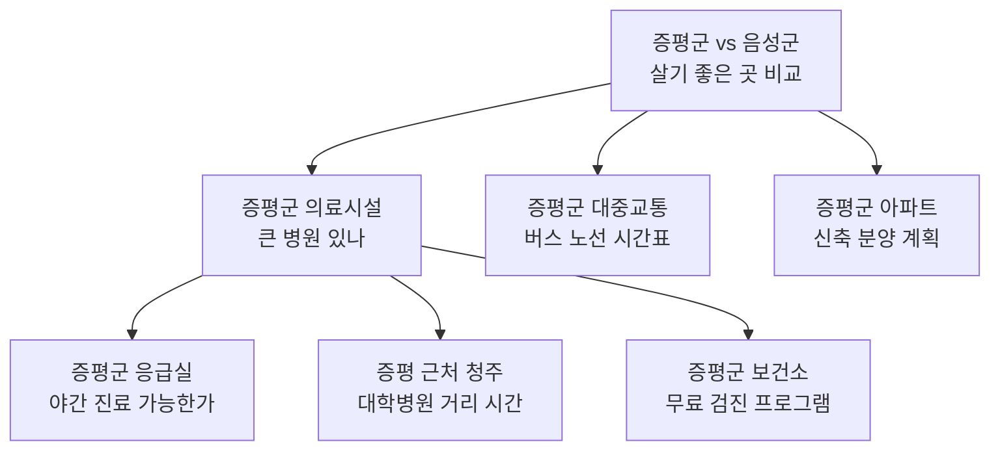

# 증평군 임팩트 질문 도출 가이드 — S-OGDE 방법론 적용

> **S-OGDE** = Signal · Observe · Generate · Deepen · Evaluate  
> AI 검색 시대에 **"시민과 잠재 방문객이 AI에게 어떤 질문을 할 것인가?"**를 역추적·예측·발굴하는 질문 발견 파이프라인

---

## 목차

1. [왜 S-OGDE인가? — 지자체 맥락의 질문 발견](#1-왜-s-ogde인가)
2. [Phase G: 5-Lens 메타질문 생성](#2-phase-g-5-lens-메타질문-생성)
3. [Phase D1: Search-Grounded 탐색 체인](#3-phase-d1-search-grounded-탐색-체인)
4. [Phase D2: Multi-Persona 재귀 심화](#4-phase-d2-multi-persona-재귀-심화)
5. [Phase R: Reverse Chaining (USP→질문 역추적)](#5-phase-r-reverse-chaining)
6. [Phase DD: 시맨틱 중복 제거](#6-phase-dd-시맨틱-중복-제거)
7. [Phase E: 평가 및 우선순위 결정](#7-phase-e-평가-및-우선순위-결정)
8. [도출된 예시 질문 목록](#8-도출된-예시-질문-목록)
9. [실행 체크리스트](#9-실행-체크리스트)

---

## 1. 왜 S-OGDE인가?

### 기존 방식의 한계

| 기존 방식 | 문제점 |
|-----------|--------|
| 키워드 플래너 | 이미 검색량이 잡히는 질문만 발견 → **블루오션 질문을 놓침** |
| 브레인스토밍 | 담당자의 경험 범위 내에서만 도출 → **시민 관점 부재** |
| 경쟁 지자체 벤치마크 | 남의 질문을 따라감 → **증평군만의 차별화 불가** |

### S-OGDE가 해결하는 것

```
"시민이 AI에게 물어볼 수 있는 질문"을 능동적으로 발굴
    → 그 질문에 대한 최적의 답변을 증평군이 먼저 확보
        → AI 검색 결과에서 증평군이 인용되는 빈도 증가
            → 유입·인지도·정책 전달력 향상
```

### 증평군 적용 시 핵심 도메인 설정

```
도메인(domainName): "지방자치단체 / 소도시 정주·관광"
브랜드(brandName): "증평군"
브랜드 USP: "충북 중심부 교통 요충지, 스마트 콤팩트 시티,
            인삼·홍삼 산업 중심, 좌구산 자연 휴양, 에듀팜 특구"
```

---

## 2. Phase G: 5-Lens 메타질문 생성

### 원리

5가지 심리·행동 렌즈로 **"증평군에 대해 사람들이 궁금해할 수 있는 질문의 유형"**을 먼저 분석합니다. 각 렌즈마다 5개의 실제 질문을 생성하여 총 25개의 씨앗 질문을 확보합니다.

### LLM 프롬프트

```
당신은 소비자 심리 분석 전문가입니다.
"증평군"에 대해 시민, 이주 희망자, 관광객이 AI 검색엔진에 입력할 수 있는
질문을 분석합니다.

아래 5가지 관점에서 각각 5개의 검색 질문을 생성하세요:

1. pattern (구조 패턴):
   반복되는 질문 구조 — "비교", "vs", "순위", "추천" 등
2. motivation (숨겨진 동기):
   검색 뒤에 숨겨진 진짜 이유 — 불안, 기대, 호기심
3. journey_stage (의사결정 여정):
   awareness → consideration → decision → retention 단계별 질문
4. fear_desire (공포/욕망):
   정주·관광에서의 걱정 또는 강한 기대
5. counter (블라인드 스팟):
   아무도 묻지 않지만 반드시 물어야 할 질문

증평군 컨텍스트:
- 인구 ~36,700명, 충북 중심부, 1인 가구 40%
- 스마트 콤팩트 시티 비전, 제3·4산업단지
- 인삼골축제, 좌구산 휴양랜드, 에듀팜 특구(블랙스톤 벨포레)
- 귀농·귀촌 지원(정착자금 최대 400만원, 청춘농담누리)
- 20분 생활권, 행복 돌봄, 복합문화예술회관 건립 중
```

### 기대 출력 예시

| 렌즈 | 예시 질문 |
|------|-----------|
| **pattern** | "증평군 vs 음성군 살기 좋은 곳 비교" |
| **pattern** | "충북 소도시 정주여건 순위" |
| **motivation** | "증평군으로 이사하면 후회할까" |
| **motivation** | "서울에서 증평군까지 출퇴근 현실적인가" |
| **journey_stage** | "증평군 어떤 곳이야 (awareness)" |
| **journey_stage** | "증평군 전입신고 절차 서류 (decision)" |
| **fear_desire** | "증평군 대중교통 없으면 차 없이 생활 가능한가" |
| **fear_desire** | "증평군 아이 키우기 좋은 환경인가" |
| **counter** | "증평군 빈집 매입 리모델링 지원 있나" |
| **counter** | "증평군 1인 가구 안전 시스템 어떻게 되어 있나" |

---

## 3. Phase D1: Search-Grounded 탐색 체인

### 원리

Phase G에서 선택한 **씨앗 질문 1개**를 실제 AI 검색 엔진에 입력하고, 답변 속의 **정보 갭(Information Gap)**을 파악하여 후속 질문을 연쇄적으로 추출합니다.

> [!IMPORTANT]
> **핵심 혁신**: LLM이 답변을 "상상"하지 않습니다. **실제 AI 검색 결과**를 읽고, 그 안에서 빠져 있거나 불충분한 정보를 찾아 후속 질문을 도출합니다.

### 실행 절차

```
Depth 1: 씨앗 "증평군 살기 좋은 곳인가"
    → AI 검색 실행 → 실제 답변 수신
    → LLM: "이 답변에서 소비자가 추가로 궁금해할 것 3가지?"
        ├─ "증평군 교육 인프라 수준은?"
        ├─ "증평군 의료시설 대형병원 접근성은?"
        └─ "증평군 아파트 매매 시세 추이는?"

Depth 2: 첫 번째 후속 → "증평군 교육 인프라 수준은?"
    → AI 검색 실행 → 실제 답변 수신
    → LLM: "이 답변에서 추가로 궁금해할 것?"
        ├─ "증평군 고등학교 대학 진학률?"
        ├─ "증평군 방과후 학원가 있나?"
        └─ "증평군 대안학교나 특성화 교육?"

Depth 3: "증평군 고등학교 대학 진학률?"
    → AI 검색 실행 → 최종 후속 질문 추출
```

### LLM 프롬프트 (각 Depth에서)

```
아래는 "{query}"에 대한 실제 AI 검색 결과입니다:

---
{실제 검색 결과 텍스트, 최대 2,000자}
---

이 답변을 읽은 소비자가 추가로 궁금해할 후속 질문을 정확히 3개 생성하세요.
규칙:
1. 답변에서 빠져 있거나 불충분한 정보를 기반으로 하세요.
2. 실제 소비자가 검색창에 입력할 법한 자연어 질문이어야 합니다.
3. 이전 질문과 중복되지 않아야 합니다.
```

### 증평군 체인 예시 (씨앗: `pattern` 렌즈 첫 번째)



---

## 4. Phase D2: Multi-Persona 재귀 심화

### 원리

3가지 소비자 페르소나가 **각각 다른 관점**에서 질문을 생성합니다. 이를 통해 질문 지형도의 **폭(Breadth)**을 극대화합니다.

### 증평군 맞춤 페르소나 정의

| 페르소나 | 증평군 맥락에서의 역할 | 관점 초점 |
|----------|----------------------|-----------|
| 🔍 **팩트체커 (Skeptic)** | 정책의 실효성을 따지는 시민/언론인 | 통계, 실적, 예산 집행률, 타 지자체 비교 |
| 💰 **가성비파 (Pragmatist)** | 이주를 고려하는 실용적 가장 | 실제 생활비, 통근 시간, 집값, 지원금 대비 효과 |
| 🌱 **초보자 (Novice)** | 증평군을 처음 알게 된 관광객/귀농 희망자 | 기초 정보, 위치, 접근법, 안전성, 축제 일정 |

### LLM 프롬프트 (각 페르소나별)

#### 팩트체커

```
당신은 비판적 시민(Skeptic)입니다.
통계, 실적 데이터, 예산 집행률, 정확한 수치를 따지는 관점에서
"증평군 스마트 콤팩트 시티 실현 가능한가" 이후에
추가로 궁금해할 핵심 질문 1개를 생성하세요.

→ 예: "증평군 스마트시티 예산 대비 실제 집행률은?"
```

#### 가성비파

```
당신은 실용적 가장(Pragmatist)입니다.
실제 생활비, 통근 시간, 대안 비교, 지원금 대비 효과를 따지는 관점에서
"증평군 스마트 콤팩트 시티 실현 가능한가" 이후에
추가로 궁금해할 핵심 질문 1개를 생성하세요.

→ 예: "증평군 이주 지원금 실수령액 세금 공제 후 얼마?"
```

#### 초보자

```
당신은 증평군을 처음 알게 된 초보자(Novice)입니다.
기초 정보, 위치, 접근법, 생활 편의성을 중심으로
"증평군 스마트 콤팩트 시티 실현 가능한가" 이후에
추가로 궁금해할 핵심 질문 1개를 생성하세요.

→ 예: "스마트 콤팩트 시티가 뭔가요? 증평군 생활이 뭐가 달라지나요?"
```

### 재귀 트리 예시

```
씨앗: "증평군 귀농 지원 정책 알려줘" (depth 1)
│
├── 🔍 팩트체커 (depth 2):
│   "증평군 귀농 정착자금 실제 수혜 인원 몇 명?"
│   ├── 🔍 "최근 3년 증평군 귀농 성공률 통계?"
│   ├── 💰 "귀농 실패 시 정착자금 반환해야 하나?"
│   └── 🌱 "귀농이 처음인데 증평군에서 뭘 재배할 수 있나?"
│
├── 💰 가성비파 (depth 2):
│   "증평군 귀농 지원금 vs 괴산군 지원금 어디가 더 많나?"
│   ├── 🔍 "충북 다른 군 귀농 지원 비교표 있나?"
│   ├── 💰 "증평군 귀농 주택 융자 이율 시중은행 대비?"
│   └── 🌱 "귀농 융자 신청 절차가 어떻게 되나요?"
│
└── 🌱 초보자 (depth 2):
    "귀농하려면 농지가 있어야 하나요?"
    ├── 🔍 "증평군 농지 평균 가격 평당 얼마?"
    ├── 💰 "농지 없이 시작할 수 있는 스마트팜 모델 있나?"
    └── 🌱 "체류형 스마트팜이 뭔가요?"
```

---

## 5. Phase R: Reverse Chaining

### 원리

기존 Phase G~D2는 **순방향** (질문 → 후속 질문). Phase R은 **역방향** — 증평군의 USP(핵심 강점)에서 출발하여, **"이 답변에 도달하려면 소비자가 어떤 질문을 해야 하는가?"**를 역추적합니다.

### LLM 프롬프트

```
당신은 검색 행동 역설계 전문가입니다.

증평군의 핵심 USP:
"충북 중심부 교통 요충지, 스마트 콤팩트 시티 비전,
인삼·홍삼 산업의 메카, 좌구산 자연 휴양, 
에듀팜 특구(블랙스톤 벨포레) 체험형 관광"

이 USP가 최적의 답변이 되려면, 소비자가 AI 검색에
어떤 질문을 입력해야 하는지 역추적하세요.

출력:
1. entry_questions (5개): 소비자가 처음 검색할 법한 질문
2. reasoning_paths (3개): 각 경로는 3단계 질문 체인
   step1 → step2 → step3 → USP 답변에 도달
```

### 기대 출력 예시

```yaml
entry_questions:
  - "충북에서 당일치기 가족 나들이 어디 갈까"
  - "서울 근교 아닌 숨은 관광지 추천"
  - "인삼 먹을 수 있는 축제 있나"
  - "충북 소도시 중에 교통 편한 곳 어디"
  - "귀촌하기 좋은 충북 소도시 순위"

reasoning_paths:
  - path_1:
      step1: "가을 충북 축제 추천"
      step2: "증평 인삼골축제 일정 프로그램"
      step3: "증평 인삼골축제 근처 숙소 관광코스"
      → USP: 좌구산 + 에듀팜 연계 체류형 관광
      
  - path_2:
      step1: "2026 충북 귀촌 지원금 비교"
      step2: "증평군 귀농 정착자금 조건"
      step3: "증평군 스마트팜 체험 프로그램 있나"
      → USP: 스마트팜 + 청춘농담누리
      
  - path_3:
      step1: "충북 신규 산업단지 채용 정보"
      step2: "증평군 제3산업단지 입주 기업 목록"
      step3: "증평군 산업단지 근처 주거 환경"
      → USP: 스마트 콤팩트 시티 + 20분 생활권
```

---

## 6. Phase DD: 시맨틱 중복 제거

### 원리

Phase G~R에서 총 50~80개의 질문이 수집됩니다. 이 중 **의미적으로 동일한 질문**을 임베딩 벡터 코사인 유사도로 자동 클러스터링하고, 각 클러스터에서 가장 간결한 질문을 대표로 선정합니다.

### 중복 제거 예시

| 원본 질문들 | 코사인 유사도 | 대표 질문 |
|------------|:------------:|-----------|
| "증평군 아파트 분양 일정" / "증평군 신축 아파트 언제 나오나" / "증평 신규 분양 계획" | 0.91 | **"증평군 아파트 분양 일정"** |
| "증평군 버스 노선" / "증평군 대중교통 시간표" | 0.88 | **"증평군 버스 노선"** |
| "증평군 인삼축제 날짜" / "증평 인삼골축제 언제" / "2026 증평 축제 일정" | 0.93 | **"증평군 인삼축제 날짜"** |

### 기준

- **유사도 ≥ 0.85** → 동일 의도로 판정 → 같은 클러스터
- **대표 선정 규칙**: 클러스터 내 가장 짧은(간결한) 질문
- **가중치(weight)**: 클러스터 크기 = 해당 의도의 **전략적 중요도 프록시** (많이 중복될수록 중요)

---

## 7. Phase E: 평가 및 우선순위 결정

### QVS 5차원 평가

각 대표 질문을 LLM이 자동 평가합니다:

| 차원 | 약어 | 가중치 | 증평군 평가 기준 |
|------|------|--------|-----------------|
| **적합성** | V_rel | ×3 (30%) | 증평군 정책·관광·정주와 얼마나 관련? |
| **구체성** | V_spec | ×2 (20%) | 롱테일인가, 너무 광범위한가? |
| **긴급성** | V_urg | ×1 (10%) | 시민의 즉각적 니즈인가? |
| **경쟁도** | V_comp | ×1 (10%) | 다른 지자체도 답변하고 있는가? |
| **전환력** | V_conv | ×3 (30%) | 실제 방문/이주/참여로 이어지는가? |

$$QVS = V_{rel} \times 3 + V_{spec} \times 2 + V_{urg} \times 1 + V_{comp} \times 1 + V_{conv} \times 3$$

### Gate 결정

| 조건 | 상태 | 행동 |
|------|------|------|
| QVS ≥ 70 AND 적합 | ✅ **Go** | 즉시 콘텐츠 제작 착수 |
| QVS 40~69 | 👀 **Watch** | 모니터링 후 시즌/이슈에 맞춰 대응 |
| QVS < 40 OR 부적합 | ❌ **No-Go** | 자동 제외 |

### 평가 예시

| 질문 | V_rel | V_spec | V_urg | V_comp | V_conv | QVS | Gate |
|------|:-----:|:------:|:-----:|:------:|:------:|:---:|:----:|
| 증평군 귀농 정착자금 신청 조건 | 10 | 9 | 8 | 4 | 9 | **86** | ✅ Go |
| 증평군 인삼골축제 2026 일정 | 10 | 10 | 9 | 5 | 8 | **88** | ✅ Go |
| 증평군 좌구산 등산 코스 난이도 | 9 | 8 | 5 | 3 | 7 | **69** | 👀 Watch |
| 충북 날씨 오늘 | 2 | 3 | 10 | 10 | 1 | **32** | ❌ No-Go |

---

## 8. 도출된 예시 질문 목록

S-OGDE 6단계를 증평군에 적용하여 도출한 **임팩트 질문** 카탈로그입니다.

### 🟢 Tier 1: 즉시 답변 확보 필요 (QVS ≥ 70)

#### 정주·이주

| # | 질문 | 페르소나 | 여정 단계 |
|---|------|----------|-----------|
| 1 | 증평군 귀농 정착자금 신청 조건과 실수령액 | 💰 가성비파 | Decision |
| 2 | 증평군 전입 지원금 축하금 얼마인가 | 💰 가성비파 | Decision |
| 3 | 증평군 아파트 매매 전세 시세 추이 | 💰 가성비파 | Consideration |
| 4 | 증평군 vs 음성군 vs 괴산군 살기 좋은 곳 비교 | 🔍 팩트체커 | Consideration |
| 5 | 서울에서 증평군까지 출퇴근 가능한가 시간 거리 | 💰 가성비파 | Consideration |
| 6 | 증평군 1인 가구 생활 편의시설 충분한가 | 🌱 초보자 | Fear |
| 7 | 증평군 어린이집 유치원 대기 기간 | 💰 가성비파 | Fear/Desire |
| 8 | 증평군 빈집 매입 리모델링 지원 정책 | 🔍 팩트체커 | Counter |

#### 관광·축제

| # | 질문 | 페르소나 | 여정 단계 |
|---|------|----------|-----------|
| 9 | 증평 인삼골축제 2026 일정 장소 프로그램 | 🌱 초보자 | Awareness |
| 10 | 증평 인삼골축제 주차 교통 셔틀버스 | 💰 가성비파 | Decision |
| 11 | 증평군 좌구산 휴양랜드 예약 방법 가격 | 🌱 초보자 | Decision |
| 12 | 증평군 에듀팜 특구 블랙스톤 벨포레 체험 종류 | 🌱 초보자 | Consideration |
| 13 | 증평 인삼축제 먹거리 홍삼포크 삼겹살 가격 | 💰 가성비파 | Decision |
| 14 | 증평군 1박2일 관광 코스 추천 | 🌱 초보자 | Consideration |
| 15 | 증평군 가을 단풍 명소 좌구산 시기 | 🌱 초보자 | Awareness |

#### 산업·일자리

| # | 질문 | 페르소나 | 여정 단계 |
|---|------|----------|-----------|
| 16 | 증평군 제3산업단지 입주 기업 채용 정보 | 💰 가성비파 | Decision |
| 17 | 증평군 청년 일자리 지원 정책 뭐가 있나 | 💰 가성비파 | Awareness |
| 18 | 증평군 지식산업센터 입주 조건 임대료 | 🔍 팩트체커 | Decision |
| 19 | 증평군 스마트팜 창업 교육 프로그램 | 🌱 초보자 | Consideration |
| 20 | 증평군 소상공인 지원 보조금 종류 | 💰 가성비파 | Decision |

#### 생활·복지

| # | 질문 | 페르소나 | 여정 단계 |
|---|------|----------|-----------|
| 21 | 증평군 출생 축하금 육아 지원 정책 | 💰 가성비파 | Decision |
| 22 | 증평군 보건소 무료 건강검진 항목 일정 | 🌱 초보자 | Awareness |
| 23 | 증평군 행복 돌봄 서비스 신청 방법 | 🌱 초보자 | Decision |
| 24 | 증평군 노인 요양 시설 현황 | 🔍 팩트체커 | Consideration |
| 25 | 증평군 반려동물 등록 동물병원 현황 | 🌱 초보자 | Awareness |

---

### 🟡 Tier 2: 시즌·이슈별 대응 (QVS 40~69)

| # | 질문 | 적합 시기 |
|---|------|-----------|
| 26 | 증평군 고등학교 대학 진학률 | 입시 시즌 (11-2월) |
| 27 | 증평군 겨울 눈 제설 도로 상태 | 동절기 (12-2월) |
| 28 | 증평군 여름 물놀이 수영장 계곡 | 하절기 (6-8월) |
| 29 | 증평군 전통시장 5일장 날짜 | 상시 |
| 30 | 증평군 도서관 위치 운영시간 | 상시 |
| 31 | 증평군 복합문화예술회관 개관 일정 | 개관 전후 |
| 32 | 증평군 주말농장 텃밭 분양 | 봄 (3-4월) |
| 33 | 증평군 장마 침수 피해 이력 | 장마 시즌 (7-8월) |
| 34 | 증평군 독감 코로나 예방접종 일정 | 가을 (9-10월) |
| 35 | 증평군 민원 온라인 처리 가능한 것들 | 상시 |

---

### 🔵 Reverse Chaining 도출 질문 (USP→질문 역추적)

| # | 진입 질문 (Step 1) | 중간 질문 (Step 2) | USP 도달 질문 (Step 3) |
|---|-------------------|-------------------|----------------------|
| 36~38 | "충북 가족 나들이 어디 갈까" | "증평군 에듀팜 특구 뭐가 있어" | "블랙스톤 벨포레 루지 양떼목장 이용료" |
| 39~41 | "귀촌 지원금 많은 곳 어디" | "증평군 귀농 정착자금 조건" | "증평군 청춘농담누리 체험 신청" |
| 42~44 | "충북 산업단지 취업 정보" | "증평군 제3산업단지 입주 현황" | "증평군 산단 근처 원룸 전세 가격" |
| 45~47 | "힐링 여행 수도권 아닌 곳" | "좌구산 휴양랜드 숙소 예약" | "좌구산 명상 구름다리 짚라인 체험" |
| 48~50 | "소도시 스마트시티 사례" | "증평군 스마트 콤팩트 시티 뭔가" | "증평군 20분 생활권 실제로 가능한가" |

---

## 9. 실행 체크리스트

### 준비 단계

- [ ] **도메인 설정**: `domainName = "지방자치단체/소도시 정주·관광"`, `brandName = "증평군"`
- [ ] **USP 정리**: 증평군 핵심 강점 5가지 문장으로 정리
- [ ] **VOC 데이터 수집** (선택): 증평군 관련 네이버 카페 게시글, 블로그 후기, 민원 게시판에서 실제 시민의 어휘·불만·기대를 텍스트로 수집 → `contextChunks`로 Phase G에 주입

### 실행 단계

- [ ] **Phase G**: 위 프롬프트로 5-Lens 메타질문 25개 생성
- [ ] **Phase D1**: `pattern` 렌즈 첫 번째 질문을 씨앗으로 Search-Grounded 체인 (depth 3)
- [ ] **Phase D2**: `counter` 렌즈 첫 번째 질문을 씨앗으로 Multi-Persona 트리 (depth 3)
- [ ] **Phase R**: USP를 입력하여 역추적 질문 도출 (entry 5개 + path 3개)
- [ ] **Phase DD**: 전체 후보를 임베딩 → 코사인 유사도 ≥ 0.85 클러스터링 → 대표 선정
- [ ] **Phase E**: QVS 5차원 평가 → Go / Watch / No-Go 분류

### 활용 단계

- [ ] **Go 질문** (Tier 1): 증평군 공식 웹사이트, 블로그, 유튜브에 **최적화된 답변 콘텐츠** 즉시 제작
- [ ] **Watch 질문** (Tier 2): 시즌 캘린더에 매핑하여 **적시 콘텐츠** 제작 일정 수립
- [ ] **Reverse 질문**: AI 검색 결과에서 증평군이 인용되도록 **역추적 경로상의 중간 질문**에도 답변 배치
- [ ] **월 1회 파이프라인 재실행**: 새로운 정책·이슈·시즌에 맞춰 질문 풀 갱신

---

> [!TIP]
> **효과성의 핵심**: S-OGDE는 "이미 검색량이 있는 질문"이 아니라 **"아직 아무도 체계적으로 답변하지 않은 질문"**을 선제적으로 발굴합니다. 증평군이 이 질문들에 대한 최적의 답변을 먼저 확보하면, AI 검색 결과에서 증평군이 권위 있는 출처(Authority Source)로 인용될 확률이 비약적으로 높아집니다.
