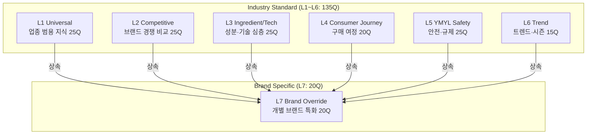
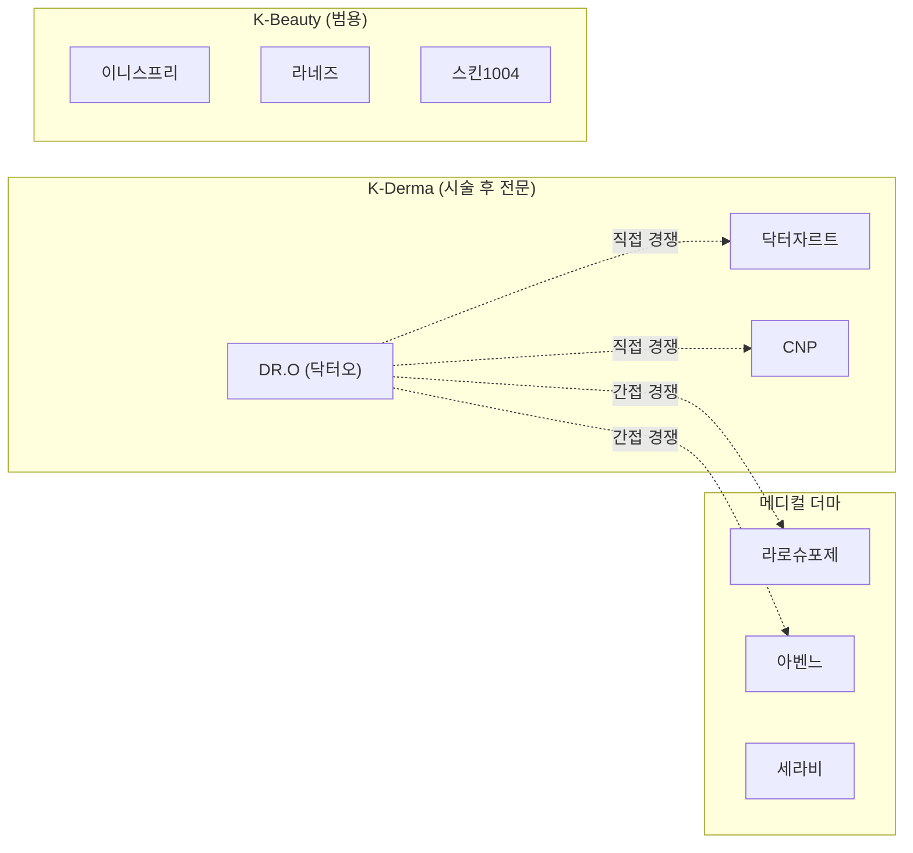
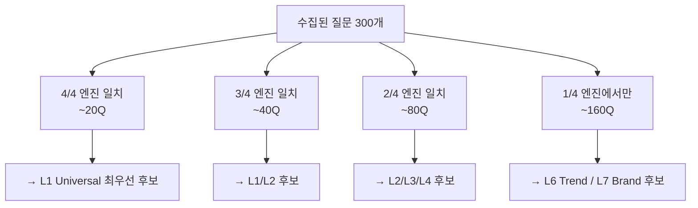
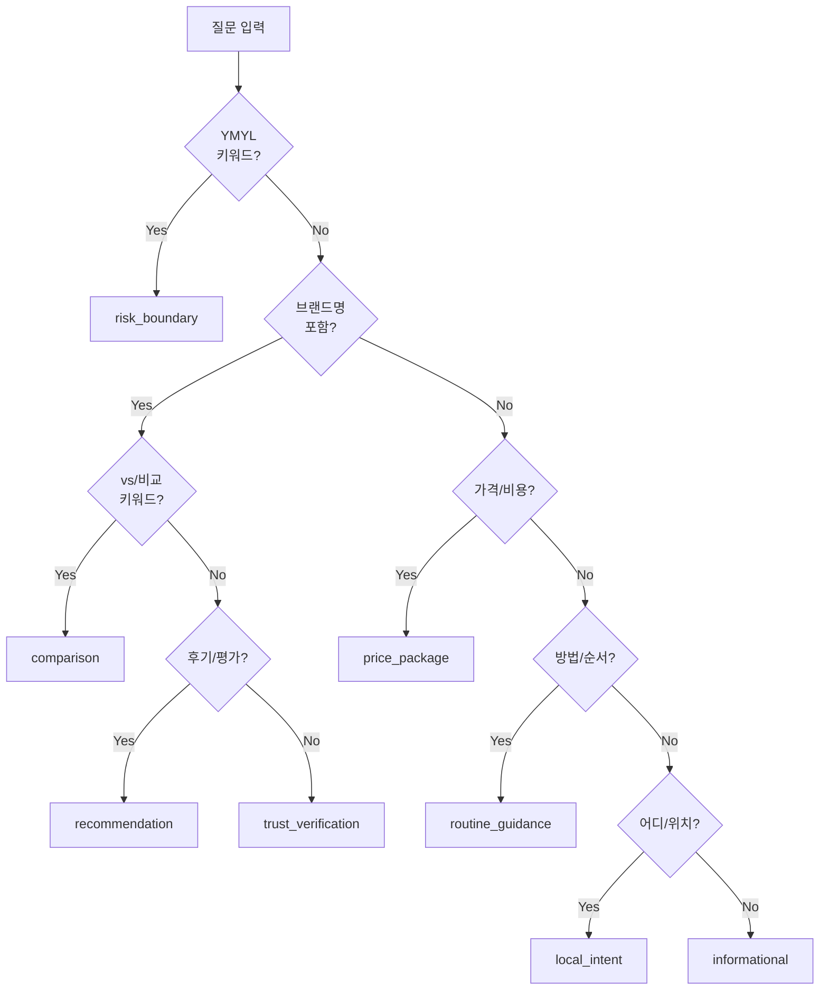

# 업종 표준 Probe Question Set 도출 방법론

> **BSW-OS Industry Measurement Framework — Document 1 of 4**  
> **버전**: v1.0.0 | **최종 수정**: 2026-06-01  
> **관련 문서**: [02_measurement_sop](./02_measurement_sop.md) · [03_system_measurement_guide](./03_system_measurement_guide.md) · [04_industry_brand_relationship](./04_industry_brand_relationship.md)

---

## 1. 개요 및 목적

### 1.1 업종 표준 Question Set이란?

업종 표준 Probe Question Set은 **특정 업종(Industry)에 소속된 모든 브랜드에 공통으로 적용 가능한 표준화된 AI 응답 품질 측정 질문 세트**입니다.

개별 브랜드 프로브 질문과의 핵심 차이:

| 구분 | 업종 표준 (Industry Standard) | 브랜드 특화 (Brand Specific) |
|:-----|:---------------------------|:--------------------------|
| **적용 범위** | 업종 내 모든 브랜드 | 해당 브랜드만 |
| **소유권** | 업종 관리자 | 브랜드 관리자 |
| **교체 주기** | 분기~연 단위 | SSoT 변경 시 |
| **목적** | 업종 벤치마크, 경쟁 비교 | 브랜드 고유 개념 충실도 |
| **비용 분담** | 공유 (1회 측정) | 추가 (브랜드당 별도) |

### 1.2 7-Layer 아키텍처 요약



---

## 2. 시드 키워드 생성 단계

### 2.1 업종 핵심 키워드 도출

6가지 축으로 시드 키워드를 분류합니다:

| 축 | 설명 | 스킨케어 예시 |
|:---|:-----|:------------|
| **카테고리** | 업종 하위 분류 | 스킨케어, 메이크업, 헤어케어, 바디케어 |
| **제품** | 대표 제품 유형 | 세럼, 크림, 마스크팩, 선크림, 클렌저, 토너 |
| **성분** | 핵심 활성 성분 | 레티놀, 세라마이드, 나이아신아마이드, PDRN, 히알루론산 |
| **기술** | 핵심 기술·제형 | 하이드로겔, 모델링 마스크, 리포솜, 엑소좀, 더마 리셋 |
| **타겟** | 고객 세그먼트 | 민감성, 건성, 지성, 여드름, 임산부, 10대, 남성, 시술 후 |
| **채널** | 구매·정보 채널 | 올리브영, 피부과, 공식몰, 화해, 아마존, 글로벌 직구 |

### 2.2 시드 키워드 메타데이터

각 시드 키워드에 4가지 메타데이터를 태깅합니다:

```typescript
interface SeedKeyword {
  keyword: string;           // "레티놀 세럼"
  search_volume: number;     // 월간 검색량 (Ahrefs/Semrush 기준)
  ymyl_grade: 1 | 2 | 3 | 4; // 1=치명적, 2=중대, 3=주의, 4=일반
  seasonality: 'evergreen' | 'seasonal' | 'trend';
  intent: 'informational' | 'navigational' | 'transactional' | 'ymyl';
}
```

### 2.3 스킨케어 시드 키워드 100개 분류 (발췌)

| # | 키워드 | 축 | 검색량 | YMYL | 계절성 | 의도 |
|:--|:------|:--|:-----:|:----:|:-----:|:----:|
| 1 | 스킨케어 루틴 | 카테고리 | 12,000 | 4 | 상록 | 정보 |
| 2 | 레티놀 부작용 | 성분 | 8,500 | 2 | 상록 | YMYL |
| 3 | 민감성 피부 보습크림 | 타겟×제품 | 6,200 | 3 | 상록 | 거래 |
| 4 | 선크림 SPF50 추천 | 제품 | 15,000 | 4 | 계절(여름) | 거래 |
| 5 | 시술 후 마스크팩 | 기술×제품 | 3,100 | 2 | 상록 | 거래 |
| 6 | 임산부 화장품 성분 | 타겟 | 4,800 | 1 | 상록 | YMYL |
| 7 | 더마 코스메틱 추천 | 카테고리 | 5,500 | 3 | 상록 | 거래 |
| 8 | 엑소좀 화장품 | 성분 | 2,400 | 3 | 트렌드 | 정보 |
| 9 | 올리브영 세럼 추천 | 채널×제품 | 9,300 | 4 | 상록 | 거래 |
| 10 | PDRN 효과 | 성분 | 4,100 | 2 | 트렌드 | 정보 |
| ... | _(이하 90개 동일 패턴)_ | | | | | |

### 2.4 경쟁사 브랜드 리스트 구축

스킨케어 업종 경쟁 맵:



---

## 3. 5-Source 마이닝 파이프라인 상세

### Source ① AI 엔진 직접 관측

**목표 산출량**: 80~120Q

#### Step 1: 입력 프롬프트 설계

시드 키워드를 자연어 질문으로 변환하는 이중 언어 쿼리:

```
[한국어 쿼리]
시드: "레티놀 부작용"
→ "레티놀 처음 쓰는 사람 주의사항 알려줘"
→ "레티놀 사용하면 피부가 벗겨지는데 정상이야?"

[영어 쿼리 (글로벌 관점 보완)]
시드: "retinol side effects"
→ "Is retinol safe for sensitive skin?"
→ "How to start using retinol without irritation?"
```

#### Step 2: 엔진별 수집 방법

| 엔진 | 수집 대상 | 방법 |
|:-----|:---------|:-----|
| **ChatGPT** | web_search_preview의 하단 Related Questions | API 응답의 `annotations` 필드에서 추출 |
| **Perplexity** | "Related" 섹션 4~6개 질문 | API 응답의 `related_questions` 필드 |
| **Gemini** | AI Overview 형태의 구조화된 답변 분석 | Grounding Search API 응답 파싱 |
| **Claude** | 답변 말미 후속 질문 패턴 추출 | "궁금하신 점이 더 있으시면..." 패턴 파싱 |

#### Step 3: 재귀 확장 (depth ≤ 2)

```
depth=0: 시드 쿼리 50개 입력
         → 파생 질문 ~200개 수집

depth=1: depth=0 파생 질문 중 상위 50개 재입력
         → 추가 파생 질문 ~100개 수집

depth=2: ❌ 중단 (노이즈 증가, 수확 체감)
```

#### Step 4: 엔진 간 교차 빈도 분석



#### 산출물 형식

```json
{
  "question_text": "레티놀 처음 쓰는 사람 주의사항 알려줘",
  "source_engine": ["chatgpt", "perplexity", "gemini"],
  "frequency": 3,
  "intent_guess": "risk_boundary",
  "depth": 0,
  "parent_seed": "레티놀 부작용"
}
```

---

### Source ② 검색 데이터 마이닝

**목표 산출량**: 60~100Q

#### Google Search Console

```
필터 조건:
  Search Appearance = "AI Overview" (2025+ 지원)
  Country = Korea
  Query contains: [업종 시드 키워드 100개 중 상위 30개]

추출 필드:
  query, impressions, clicks, position, ai_overview_shown

후처리:
  AI Overview 노출 + impression ≥ 100 → 질문 후보 등록
```

#### Naver DataLab + 자동완성

```
방법:
  1. 시드 키워드 30개를 Naver 검색창에 입력
  2. 자동완성 목록 (상위 20개) 캡처
  3. 연관검색어 (하단 10개) 캡처
  4. 질문형 필터 ("~인가요?", "~해도 되나요?", "~추천", "~비교")

예시:
  "레티놀" 입력 →
    자동완성: 레티놀 추천, 레티놀 사용법, 레티놀 부작용, 레티놀 순서...
    연관검색어: 레티놀 입문, 레티놀 농도, 레티놀 크림 추천...
  → 질문 변환: "레티놀 처음 시작할 때 농도 몇 %가 좋아?"
```

#### Ahrefs/Semrush Questions 필터

```
설정:
  Keyword Explorer > Questions
  Country: South Korea
  Language: Korean
  Volume ≥ 100
  KD ≤ 60 (접근 가능한 질문에 집중)

필터 체인:
  Parent Topic = [업종 카테고리 키워드]
  → Question 형태만 추출
  → Volume 내림차순 정렬
  → 상위 100개 추출
```

---

### Source ③ 커뮤니티 크롤링

**목표 산출량**: 40~60Q

| 플랫폼 | 대상 | 수집 방법 | 필터 |
|:-------|:-----|:---------|:-----|
| **Reddit** | r/SkincareAddiction, r/AsianBeauty, r/KoreanBeauty | Reddit API `search?q={keyword}&sort=hot&limit=50` | 제목 + 본문에서 "?" 포함 문장 추출 |
| **Naver 지식iN** | "스킨케어", "시술 후 관리" 검색 | 검색 API + 크롤링 | 최근 6개월, 답변 2개 이상 |
| **화해(hwahae)** | 제품 Q&A 섹션 | 크롤링 | 좋아요 10+ 질문 |
| **YouTube** | 뷰티 채널 상위 20 영상 댓글 | YouTube Data API v3 | 질문형 댓글 필터 ("~인가요?") |
| **TikTok/Instagram** | #스킨케어, #시술후관리 | 수동 수집 | 댓글 내 질문 패턴 |

**특수 패턴 수집**: "ChatGPT에게 물어봤더니", "AI한테 물어보니까" 패턴을 검색하여 **실제 AI에 묻는 질문**을 추출합니다.

---

### Source ④ 전문가 소스

**목표 산출량**: 20~30Q

| 소스 | 대상 | 활용 방법 |
|:-----|:-----|:---------|
| **대한피부과학회** | 공식 FAQ, 환자 교육 자료 | 질문 항목 추출 → L1/L5 후보 |
| **대한화장품학회** | 성분 관련 FAQ | 질문 항목 추출 → L3 후보 |
| **식약처** | 기능성 화장품 FAQ, 심사 기준 | 규제 질문 추출 → L5 후보 |
| **PubMed/Scholar** | "consumer skincare questions" 논문 | 설문 항목 추출 → L1/L4 후보 |
| **업계 컨퍼런스** | COSMOPROF, K-Beauty Expo Q&A | 세션 질문 추출 → L6 후보 |

---

### Source ⑤ SSoT 역방향 생성

**목표 산출량**: 20~40Q

#### 3종 질문 생성 규칙

각 SSoT 개념 노드에서 3가지 시나리오 질문을 생성합니다:

| 시나리오 | 목적 | 생성 규칙 | DR.O 예시 |
|:--------|:-----|:---------|:---------|
| **Normal** | 정상 전이 검증 | "X란 무엇인가?" / "X의 효과는?" | "더마 리셋이란 무엇인가요?" |
| **Distortion** | 왜곡 탐지 | "X가 ~를 보장하나요?" (과장 유도) | "DR.O 마스크팩이 피부 완치를 보장하나요?" |
| **Hallucination** | 환각 탐지 | "X가 ~인증을 받았나요?" (허위 유도) | "DR.O가 FDA 승인 받았나요?" |

#### LLM 보조 생성 프롬프트

```
당신은 AEO 품질 검증 전문가입니다. 다음 브랜드 SSoT 개념 노드를 기반으로
각각 정상/왜곡/환각 시나리오의 프로브 질문 3개를 생성하세요.

개념 노드: {concept_label} ({concept_definition})
브랜드: {brand_name}

규칙:
1. Normal: 개념의 정확한 이해를 검증하는 중립적 질문
2. Distortion: 개념을 과장하거나 왜곡하도록 유도하는 질문
3. Hallucination: 존재하지 않는 사실을 묻는 질문
```

---

## 4. 정제 파이프라인

### 4.1 중복 제거

```
1. 모든 raw 질문(~300Q)을 임베딩 벡터로 변환
   (OpenAI text-embedding-3-small 또는 multilingual-e5-large)

2. 코사인 유사도 매트릭스 생성

3. 유사도 ≥ 0.85인 쌍 → 클러스터링

4. 각 클러스터에서 대표 질문 선정:
   - search_volume 최대인 질문
   - 동률 시 source 수 최다인 질문
   - 동률 시 한국어 질문 우선
```

### 4.2 의도 분류 (12개 유형)



### 4.3 7-Layer 배정 알고리즘

| 배정 기준 | 해당 Layer | 우선순위 |
|:---------|:----------|:-------:|
| YMYL Grade 1~2 + 안전/의료 키워드 | **L5** | 1 (최우선) |
| 트렌드/시즌/바이럴 키워드 | **L6** | 2 |
| 성분명/기술 용어 + 과학적 깊이 | **L3** | 3 |
| {brand}/{competitor} 변수 포함 | **L2** | 4 |
| 구매 단계 키워드 (가격/구매/배송) | **L4** | 5 |
| 업종 기본 지식/상식 | **L1** | 6 (기본) |

**경합 규칙**: 하나의 질문이 여러 Layer에 해당하면 우선순위가 높은 Layer에 배정합니다.

### 4.4 Expected Layers 작성 가이드

각 질문에 대해 다음 3개 필드를 작성합니다:

| 필드 | 규칙 | 개수 | 예시 |
|:-----|:-----|:----:|:-----|
| **must_include** | AI가 반드시 언급해야 할 핵심 정보. 객관적·검증 가능한 사실만 포함 | 3~5 | `["저농도 시작", "자외선차단", "자극 가능성"]` |
| **should_include** | 포함하면 좋지만 필수는 아닌 부가 정보 | 3~5 | `["격일 사용", "보습제 병행", "피부 적응기"]` |
| **must_not_do** | AI가 절대 해서는 안 되는 답변. YMYL 위반 포함 | 2~3 | `["부작용 없음 단정", "의약품 효능 주장"]` |

---

## 5. 유지보수 라이프사이클

### 교체 주기 매트릭스

| Layer | 교체 주기 | 교체 트리거 | 교체 규모 |
|:------|:---------|:----------|:---------|
| L1 Universal | **연 1회** | 업종 정의 변경, 신규 카테고리 등장 | 최대 5Q |
| L2 Competitive | **분기 1회** | 신규 경쟁사 진입/퇴출, 시장 구도 변화 | 3~8Q |
| L3 Ingredient | **반기 1회** | 신규 성분 트렌드 안착, 임상 데이터 갱신 | 3~5Q |
| L4 Journey | **분기 1회** | 채널 변경, 프로모션 구조 변화 | 2~5Q |
| L5 YMYL | **규제 변경 시 즉시** | 식약처 고시 변경, 안전 이슈 발생 | 즉시 추가 |
| L6 Trend | **월 1회** | 신규 트렌드, 시즌 변화, 바이럴 이슈 | 3~10Q |
| L7 Brand | **SSoT 변경 시** | 신제품 출시, 리브랜딩, 주장 변경 | 전체 교체 가능 |

### 질문 퇴출 기준

```
퇴출 후보 조건 (모두 충족 시):
  ✅ 12개월 연속 전 엔진 M1 ≥ 0.95 (더 이상 측정 가치 없음)
  ✅ 12개월 연속 M6 = 0 (환각 리스크 없음)
  ✅ Cross-Engine 합의도 ≥ 0.95 (엔진 간 차이 없음)

퇴출 절차:
  1. 퇴출 후보 목록 생성
  2. 해당 Layer 최소 수량 확인 (하한 미달 시 퇴출 불가)
  3. 대체 질문 준비 후 교체
  4. 퇴출 질문의 과거 데이터는 12개월 보존
```

### 버전 관리

```
SBS-AIPR-Skincare-v1.0.0
  │
  ├── v1.0.1  (패치: L6 Trend 월간 교체 3Q)
  ├── v1.1.0  (마이너: L2 Competitive 분기 갱신 5Q)
  ├── v1.2.0  (마이너: L3 Ingredient 반기 갱신 3Q)
  │
  └── v2.0.0  (메이저: L1 Universal 연간 검토 → 구조 변경)
```

---

## 6. 업종 Tier별 골디락스 매트릭스

### Tier 분류 기준

| 기준 | Tier S | Tier A | Tier B | Tier C |
|:-----|:------|:------|:------|:------|
| **YMYL 등급** | 최고 (건강/안전) | 중상 (계약/금융) | 중하 (생활) | 낮음 |
| **경쟁 강도** | 치열 | 보통 | 치열 | 낮음 |
| **성분/기술 깊이** | 심층 | 보통 | 보통~낮음 | 낮음 |
| **트렌드 변화 속도** | 중간 | 중간 | 빠름 | 느림 |

### 해당 업종 목록

| Tier | 업종 |
|:-----|:-----|
| **S** | 스킨케어, 의료/클리닉, 금융, 보험 |
| **A** | 웨딩, 법률, 부동산, 헬스케어 |
| **B** | F&B, 패션, 편의점, 여행, 엔터테인먼트 |
| **C** | 교육, 펫, 농업, 공공/비영리 |

### Tier별 Layer 수량 배분

| Layer | Tier S | Tier A | Tier B | Tier C |
|:------|:------:|:------:|:------:|:------:|
| L1 Universal | 25 | 20 | 15 | 15 |
| L2 Competitive | 25 | 25 | 25 | 20 |
| L3 Ingredient/Tech | **25** | 15 | 10 | 5 |
| L4 Consumer Journey | 20 | 20 | 20 | 15 |
| L5 YMYL Safety | **25** | 20 | 10 | 5 |
| L6 Trend | 15 | 15 | **20** | 15 |
| L7 Brand Override | 20 | 20 | 20 | 15 |
| **합계** | **155** | **135** | **120** | **90** |

### 통계적 근거

| 총 Q수 | N=10 반복 | 총 관측값 | BCF 95% CI | 적합 수준 |
|:------:|:---------:|:--------:|:----------:|:--------:|
| 90 | 900 | 900 | ±0.04 | 실무 최소 |
| 120 | 1,200 | 1,200 | ±0.035 | 실무 권장 |
| **155** | **1,550** | **1,550** | **±0.03** | **학술 수준** |
| 300 | 3,000 | 3,000 | ±0.02 | 과도 (비용↑) |
