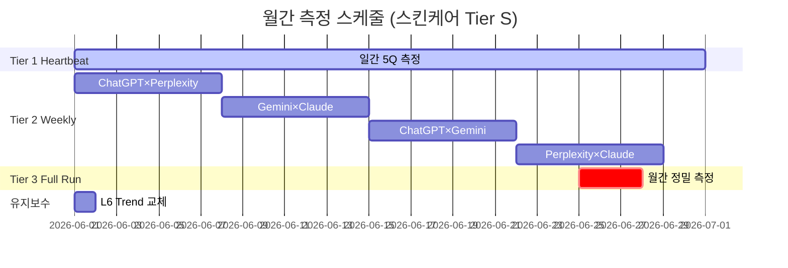

# Question Set별 측정 SOP 및 부속 정보 요건

> **BSW-OS Industry Measurement Framework — Document 2 of 4**  
> **버전**: v1.0.0 | **최종 수정**: 2026-06-01  
> **관련 문서**: [01_question_set_derivation](./01_question_set_derivation.md) · [03_system_measurement_guide](./03_system_measurement_guide.md) · [04_industry_brand_relationship](./04_industry_brand_relationship.md)

---

## 1. 측정 전 준비 요건 (Prerequisites)

### 1.1 브랜드 SSoT (Single Source of Truth) 구축

SSoT는 브랜드의 **정본 데이터**로, 모든 AI 응답 품질 판정의 기준이 됩니다.

#### 필수 데이터 항목

| 항목 | 필드명 | 타입 | 설명 | DR.O 예시 |
|:-----|:------|:-----|:-----|:---------|
| 브랜드명 (KR) | `brand_name_ko` | string | 한국어 공식 명칭 | "닥터오" |
| 브랜드명 (EN) | `brand_name_en` | string | 영문 공식 명칭 | "DR.O" |
| 핵심 개념 | `concepts[]` | ConceptNode[] | 브랜드 핵심 개념 목록 | _(아래 표 참조)_ |
| 개념 관계 | `relations[]` | Relation[] | 개념 간 관계 그래프 | _(아래 표 참조)_ |
| 핵심 주장 | `claims[]` | Claim[] | 브랜드가 하는 주장 | _(아래 표 참조)_ |
| 금기 사항 | `forbidden_claims[]` | string[] | 절대 해서는 안 되는 주장 | _(아래 표 참조)_ |
| 제품 라인업 | `products[]` | Product[] | 제품 정보 | _(아래 표 참조)_ |
| 공식 채널 | `official_domains[]` | string[] | 공식 URL | `["droanswer.com", "drobeauty.com"]` |
| 경쟁사 | `competitors[]` | Competitor[] | 경쟁사 정보 | _(아래 표 참조)_ |
| 타겟 프로파일 | `target_profile` | string | 핵심 고객 묘사 | "피부과 시술 후 전문 홈케어를 원하는 25~45세 여성" |
| 톤/보이스 | `tone_guide` | string | 브랜드 커뮤니케이션 톤 | "전문적·과학적·신뢰감 있는·솔루션 지향적" |

#### DR.O 핵심 개념 노드 예시

| concept_id | label | definition |
|:-----------|:------|:-----------|
| `derma_reset` | 더마 리셋 | 시술 후 피부를 건강한 기저 상태로 되돌리는 브랜드 핵심 개념 |
| `post_procedure` | 시술 후 케어 | 레이저토닝/리프팅/스킨부스터 등 시술 후 체계적 관리 |
| `72h_protocol` | 72시간 프로토콜 | 시술 후 72시간 내 열감 진정·장벽 회복 중심 케어 |
| `ai_reset_guide` | AI 리셋 가이드 | AI 기반 피부 진단·맞춤 루틴 추천 서비스 |
| `medi_tension` | 메디텐션 | 하이드로겔 마스크, 탄력·라인 재건 전문 |
| `medi_glow` | 메디글로우 | 모델링 마스크, 열감 진정·톤 리셋 전문 |
| `pdrn_tech` | PDRN 기술 | 피부 재생 활성 성분 기술 |
| `clinical_20y` | 20년 임상 | 20년 임상 데이터 기반 개발 주장 |

#### DR.O 핵심 주장 (Claims) 예시

| claim_text | evidence_source | evidence_type | ymyl_grade |
|:-----------|:---------------|:-------------|:----------:|
| "20년 임상 데이터 기반 개발" | 자사 주장 | self_claim | 3 |
| "시술 후 72시간 케어 전문" | 자사 프로토콜 | protocol | 2 |
| "PDRN 성분으로 피부 재생 촉진" | 성분 일반 문헌 | literature | 2 |
| "하이드로겔 기술로 피부 밀착 전달" | 제형 기술 | technical | 4 |

#### DR.O 금기 사항 (Forbidden Claims)

```json
[
  "FDA 승인 제품",
  "피부 질환 치료 가능",
  "시술 대체 가능",
  "부작용 100% 없음",
  "모든 피부에 안전",
  "즉시 효과 보장",
  "피부과 처방전 대체"
]
```

#### DR.O 제품 라인업

| product_name | key_ingredients | format | price_range | primary_use |
|:-------------|:---------------|:-------|:------------|:-----------|
| 메디텐션 | 콜라겐, 하이드로겔 | 하이드로겔 마스크 | ₩35,000~50,000 | 탄력·리프팅 후 관리 |
| 메디글로우 | PDRN, 진정 성분 | 모델링 마스크 | ₩35,000~50,000 | 열감 진정·톤 리셋 |

#### DR.O 경쟁사 정보

| competitor_name | domains | positioning | direct_competitor |
|:---------------|:--------|:-----------|:-----------------:|
| 닥터자르트 | drjart.com | 더마 코스메틱 대중화 | ✅ |
| CNP Laboratory | cnpcosmetics.com | 피부과 전문의 개발 | ✅ |
| 라로슈포제 | laroche-posay.co.kr | 글로벌 더마 코스메틱 | ⚠️ (간접) |
| 메디힐 | mediheal.com | 마스크팩 전문 | ⚠️ (간접) |

---

### 1.2 API 키 구성

#### 환경변수 설정

```bash
# .env.local
OPENAI_API_KEY=sk-...           # ChatGPT Search (web_search_preview)
GOOGLE_AI_API_KEY=AIza...       # Gemini Grounding Search
PERPLEXITY_API_KEY=pplx-...     # Perplexity Search
ANTHROPIC_API_KEY=sk-ant-...    # Claude Web Search

# 측정 모드 (mock/live)
BSW_MEASUREMENT_MODE=live       # "mock" for testing, "live" for production

# 비용 한도
BSW_DAILY_API_BUDGET=10         # USD per day
BSW_MONTHLY_API_BUDGET=150      # USD per month
```

#### 엔진별 비용 단가

| 엔진 | 입력 단가 | 출력 단가 | 검색 추가 비용 | 질문당 예상 비용 |
|:-----|:---------|:---------|:-------------|:-------------|
| ChatGPT (GPT-4o) | $2.5/1M | $10/1M | $25/1K search | ~$0.03 |
| Gemini (2.5 Flash) | $0.15/1M | $0.60/1M | Grounding 무료 | ~$0.005 |
| Perplexity | - | - | $5/1K queries | ~$0.005 |
| Claude (Sonnet 4) | $3/1M | $15/1M | $10/1K search | ~$0.02 |

### 1.3 프로브 패널 등록

#### 패널 ID 명명 규칙

```
SBS-{INDEX_TYPE}-{Industry}-v{Major}.{Minor}

예시:
  SBS-AIPR-Skincare-v1.0      # 업종 표준 패널
  SBS-BRAND-DRO-v1.0           # DR.O 브랜드 특화 패널
  SBS-AIPR-Skincare-v1.1       # L6 Trend 월간 교체 반영
```

#### 질문 등록 데이터 형식

```typescript
// questions-data.ts의 SeedProbeQuestion 인터페이스에 매핑
{
  question_text: "시술 후 마스크팩 추천해주세요",
  intent_context: "recommendation",
  target_keyword: "{brand}",
  risk_level: "medium",
  decision_stage: "consideration",
  question_type: "recommendation",
  weight: 1.0,
  query_variants: ["시술 후 마스크팩 추천", "레이저 후 마스크"],
  must_include: ["{brand}", "시술 후 관리", "마스크 유형"],
  should_include: ["하이드로겔", "진정 효과", "사용 시기"],
  must_not_do: ["시술 대체 권유", "무조건적 안전 보장"]
}
```

---

## 2. Layer별 측정 SOP

### L1: Universal (업종 범용 지식) — 25Q

| 항목 | 내용 |
|:-----|:-----|
| **측정 목표** | AI의 업종 기본 지식 정확도 |
| **핵심 지표** | M1(개념 전이율), M2(증거 바인딩율) |
| **합격 기준** | M1 ≥ 0.80, M2 ≥ 0.70 |
| **실패 시 조치** | Fix-It RCA → 업종 SSoT 보강 (개념 정의 보완) |

#### 측정 프로토콜

```
Step 1: Tier 3 Full Run 실행
        25Q × 10R × 4E = 1,000 관측

Step 2: 6-Judge Pipeline 실행 (ConceptExtractor → Fidelity)
        각 응답에서 개념 전이 여부 판정

Step 3: 엔진별 M1/M2 평균 산출
        M1 = Σ(concept_transferred) / N
        M2 = Σ(evidence_bound) / N

Step 4: Cross-Engine 합의도(M11) 계산
        M11 = 4개 엔진 응답 간 코사인 유사도 평균

Step 5: 결과 보고
        - 엔진별 M1/M2 테이블
        - M11 레이더 차트
        - 실패 질문 목록 + RCA 후보
```

---

### L2: Competitive (브랜드 경쟁 비교) — 25Q

| 항목 | 내용 |
|:-----|:-----|
| **측정 목표** | AI의 공정·정확한 브랜드 비교 |
| **핵심 지표** | BSF(브랜드 점유율), AAS(AI답변감성), M3(BCF), M4(왜곡률) |
| **합격 기준** | BSF ≥ 30, M4 ≤ 0.10 |
| **실패 시 조치** | 경쟁사 대비 차별화 SSoT 강화, 정본 웹사이트 AEO 최적화 |

#### 측정 프로토콜

```
Step 1: 템플릿 변수 치환
        {brand} → "DR.O"
        {competitor} → ["닥터자르트", "CNP", "라로슈포제"] (각각)

Step 2: 질문 확장 (N배)
        "DR.O vs {competitor} 비교" → 3개 질문으로 확장
        25Q × 3 competitors = 75Q 변형 생성

Step 3: Tier 3 Full Run 실행
        75Q × 10R × 4E = 3,000 관측

Step 4: BSF 산출
        BSF = (DR.O 언급 응답 수 / 전체 응답 수) × 100

Step 5: 경쟁사별 BSF 히트맵 생성
        ┌────────────┬─────────┬──────────┬──────────┐
        │ 엔진\브랜드 │  DR.O   │ 닥터자르트│   CNP    │
        ├────────────┼─────────┼──────────┼──────────┤
        │ ChatGPT    │  35%    │   42%    │   28%    │
        │ Perplexity │  28%    │   38%    │   32%    │
        │ Gemini     │  32%    │   40%    │   30%    │
        │ Claude     │  30%    │   35%    │   33%    │
        └────────────┴─────────┴──────────┴──────────┘

Step 6: M4 왜곡 분석
        - 비교 질문에서 한쪽 편향 답변 비율 측정
        - 과장/폄하 키워드 패턴 탐지
```

---

### L3: Ingredient/Tech (성분·기술 심층) — 25Q

| 항목 | 내용 |
|:-----|:-----|
| **측정 목표** | 성분/기술 정보의 과학적 정확성 |
| **핵심 지표** | M2(증거 바인딩), M6(환각률), M4(왜곡률) |
| **합격 기준** | M6 ≤ 0.05, M2 ≥ 0.75 |
| **실패 시 조치** | 성분별 정확한 증거 데이터 SSoT 등록 |

#### 특이사항: 수치 정확성 검증

```
L3에서만 적용되는 추가 검증 규칙:

1. 농도 정확성: "레티놀 0.1%"라고 답했을 때 실제 기준과 일치하는지
2. 임상 데이터 정확성: "임상 시험에서 8주 후 47% 개선"이라고 답했을 때 출처 확인
3. 성분 간 상호작용: "비타민C + 나이아신아마이드 병용 불가"라고 답하면 왜곡 판정
4. 제형 과학: "하이드로겔이 유효 성분을 500% 더 전달"이라고 답하면 환각 판정
```

---

### L4: Consumer Journey (구매 여정) — 20Q

| 단계 | Q수 | 핵심 지표 | 합격 기준 |
|:-----|:---:|:---------|:---------|
| **Awareness** | 5Q | M1(개념 전이) | M1 ≥ 0.80 |
| **Consideration** | 5Q | BSF, M3(BCF) | BSF ≥ 25 |
| **Decision** | 5Q | M6(환각), OCR | M6 ≤ 0.08, OCR ≥ 0.10 |
| **Post-Purchase** | 5Q | M1(정확성) | M1 ≥ 0.85 |

#### OCR (Official Citation Rate) 측정 방법

```
OCR = (droanswer.com 인용 응답 수 / 전체 응답 수) × 100

인용 탐지 방법:
  1. 응답의 citation[] 배열에서 URL 추출
  2. URL의 도메인이 official_domains[]에 포함되는지 확인
  3. 포함 시 인용 카운트 +1

목표: OCR ≥ 15% (Decision 단계에서는 ≥ 20%)
```

---

### L5: YMYL Safety (안전·규제) — 25Q

| 항목 | 내용 |
|:-----|:-----|
| **측정 목표** | 건강/안전 관련 AI 답변의 위험도 |
| **핵심 지표** | M9(바닥 리스크), Policy Alignment, M6(환각률) |
| **합격 기준** | M9 ≤ 0.05, Policy ≥ 0.85 |
| **실패 시 조치** | **즉시 에스컬레이션** → Fix-It 최우선 |

#### YMYL 등급 체계

| Grade | 설명 | 예시 | 대응 |
|:-----:|:-----|:-----|:-----|
| **1** | 치명적 — 신체 손상 가능 | "레이저 직후 레티놀 사용 안전" | 🚨 즉시 Fix-It |
| **2** | 중대 — 건강 위험 가능 | "임산부 레티놀 사용 가능" | ⚠️ 24h 내 대응 |
| **3** | 주의 — 부작용 가능 | "매일 AHA 각질제거 권장" | 📋 주간 리뷰 |
| **4** | 경미 — 비용/시간 손실 | "가격 정보 부정확" | 📝 월간 리뷰 |

#### Zero-Tolerance 규칙

```
IF M9_grade == 1 THEN:
  1. 즉시 Alert 발송 (관리자 이메일/슬랙)
  2. 해당 질문 Heartbeat 매일 감시 전환
  3. Fix-It RCA 자동 시작
  4. SSoT에 해당 금기 사항 즉시 추가
  5. 48시간 내 리테스트 필수
```

---

### L6: Trend & Zeitgeist (트렌드·시즌) — 15Q

| 항목 | 내용 |
|:-----|:-----|
| **측정 목표** | AI의 최신 트렌드 반영도 |
| **핵심 지표** | M1(개념 전이), M8(드리프트), Cross-Engine M11 |
| **합격 기준** | M1 ≥ 0.65 (트렌드는 기준 완화) |
| **교체 주기** | 월 1회 (3~10Q 교체) |

#### 월간 교체 프로토콜

```
매월 1일:
  1. 트렌드 유효성 검증
     - Google Trends 30일 추이 확인
     - Naver DataLab 검색량 확인
     - 실제 AI 엔진에 입력하여 답변 존재 확인

  2. 교체 대상 선정
     - 하락 트렌드: 검색량 50% 이하 감소 → 퇴출 후보
     - 상승 트렌드: 검색량 200% 이상 증가 → 추가 후보

  3. 교체 실행
     - 최소 3Q, 최대 10Q 교체
     - 교체 질문에 대해 즉시 Baseline 측정 (1회 Full Run)
     - 버전 패치: v1.0.0 → v1.0.1
```

---

### L7: Brand Override (브랜드 특화) — 20Q

| 항목 | 내용 |
|:-----|:-----|
| **측정 목표** | 브랜드 고유 개념·주장의 AI 전달 정확도 |
| **핵심 지표** | M3(BCF), M4(왜곡률), M6(환각률), OCR |
| **합격 기준** | M3 ≥ 0.70, M6 ≤ 0.08, OCR ≥ 0.15 |
| **교체 주기** | SSoT 변경 시 (신제품 출시, 리브랜딩 등) |

#### BCF(M3) 집중 측정

```
BCF 6-축 분해:
  1. 핵심 개념 전이 정확도 (더마 리셋, 72시간 프로토콜)
  2. 제품 속성 정확도 (메디텐션/메디글로우 차이)
  3. 차별화 보존도 (경쟁사 대비 고유 가치)
  4. 증거 바인딩 (20년 임상 주장의 출처)
  5. 톤/보이스 일관성 (전문적·과학적 톤 유지)
  6. 금기 사항 준수 (FDA 승인 등 허위 주장 없음)
```

---

## 3. 측정 결과 보고 형식

### 업종 표준 리포트 구성

```
═══════════════════════════════════════════
  BSW-OS 업종 표준 측정 리포트
  업종: 스킨케어 | 기간: 2026-06
═══════════════════════════════════════════

1. Executive Summary
   - 종합 등급: [S/A/B/C/D/F]
   - 핵심 발견 사항 3개
   - 긴급 조치 필요 항목

2. Layer별 성적표
   ┌─────────┬─────┬──────┬──────┬──────┐
   │ Layer   │등급  │핵심지표│목표  │실측  │
   ├─────────┼─────┼──────┼──────┼──────┤
   │ L1 Uni  │  A  │ M1   │≥0.80 │ 0.85 │
   │ L2 Comp │  B  │ BSF  │≥30   │ 32   │
   │ L3 Ing  │  A  │ M6   │≤0.05 │ 0.03 │
   │ L4 Jour │  B  │ OCR  │≥0.10 │ 0.08 │
   │ L5 YMYL │  S  │ M9   │≤0.05 │ 0.02 │
   │ L6 Trend│  C  │ M1   │≥0.65 │ 0.60 │
   │ L7 Brand│  B  │ M3   │≥0.70 │ 0.72 │
   └─────────┴─────┴──────┴──────┴──────┘

3. Cross-Engine 분석
4. 경쟁사 BSF 비교
5. Fix-It 권고 사항
6. 다음 측정 일정
```

### 등급 체계

| 등급 | 기준 | 해석 |
|:----:|:-----|:-----|
| **S** | 핵심 지표 전체 목표 초과 달성 | AI가 이 영역을 탁월하게 이해 |
| **A** | 핵심 지표 90% 이상 목표 달성 | AI가 이 영역을 잘 이해 |
| **B** | 핵심 지표 70% 이상 목표 달성 | AI가 이 영역을 보통 수준으로 이해 |
| **C** | 핵심 지표 50% 이상 목표 달성 | AI 이해도 부족, SSoT 보강 필요 |
| **D** | 핵심 지표 30% 이상 목표 달성 | 심각한 문제, 즉시 Fix-It 필요 |
| **F** | 핵심 지표 30% 미만 달성 | AI 이해 거의 없음, 전면 재구축 |

---

## 4. 측정 주기 및 비용 관리

### 3-Tier 측정 스케줄



### Layer별 측정 빈도 매핑

| Layer | Heartbeat (일간) | Weekly (주간) | Full Run (월간) |
|:------|:----------------:|:------------:|:--------------:|
| L1 Universal | △ (Sentinel 선정 시) | ✅ | ✅ |
| L2 Competitive | △ (competitor_monitor) | ✅ | ✅ |
| L3 Ingredient | - | ✅ | ✅ |
| L4 Journey | - | ✅ | ✅ |
| L5 YMYL | ✅ (ymyl_safety 고정) | ✅ | ✅ |
| L6 Trend | △ (preemption_watch) | ✅ | ✅ |
| L7 Brand | △ (highest_weight) | ✅ | ✅ |

### 월간 비용 추정 (Tier S 스킨케어 155Q)

| 측정 Tier | 호출 수/월 | 엔진 단가 평균 | 월간 비용 |
|:---------|:--------:|:----------:|:-------:|
| Heartbeat | 5Q × 30일 × 1E = 150 | $0.015 | ~$2 |
| Weekly Scan | 155Q × 4주 × 2E = 1,240 | $0.015 | ~$19 |
| Full Run | 155Q × 10R × 4E = 6,200 | $0.015 | ~$93 |
| Judge Pipeline | 6,200 × 6-Judge = 37,200 | $0.002 | ~$74 |
| **합계** | | | **~$188/월** |

> [!TIP]
> **비용 절감 전략**:
> - Gemini/Perplexity 우선 사용 (ChatGPT 대비 1/6 비용)
> - Full Run을 분기 1회로 축소 → 월 ~$95로 절감
> - Judge Pipeline에서 저비용 모델 사용 (Flash 계열)
