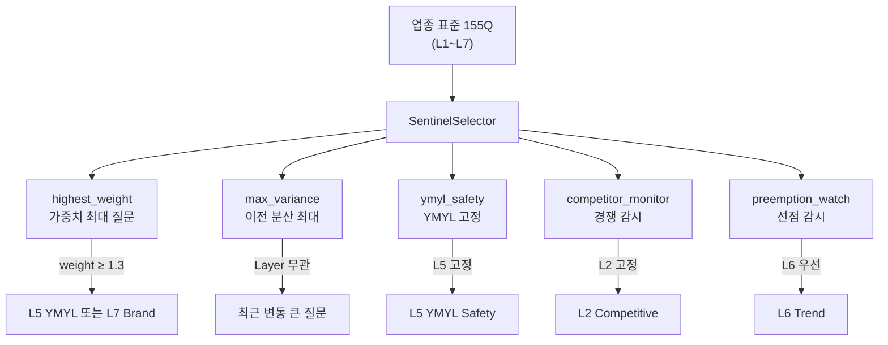
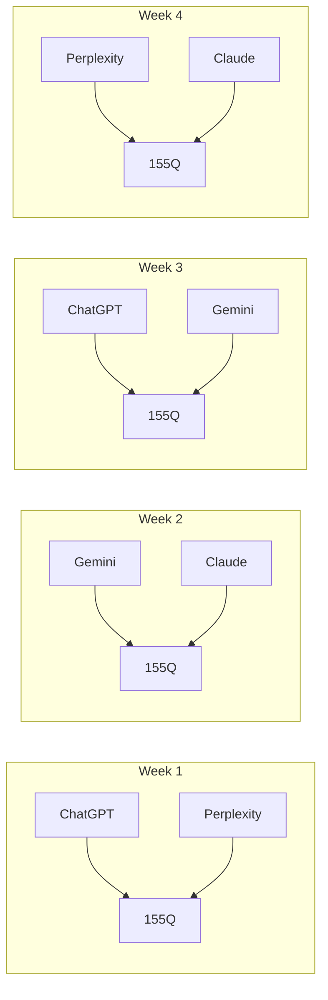
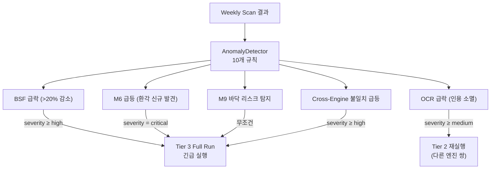
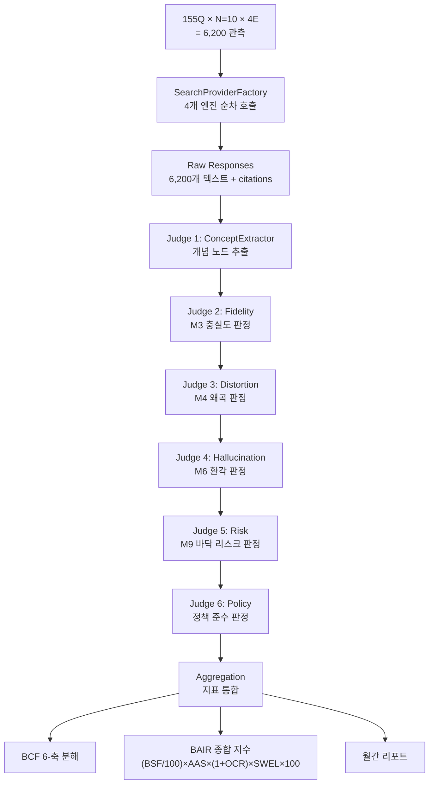
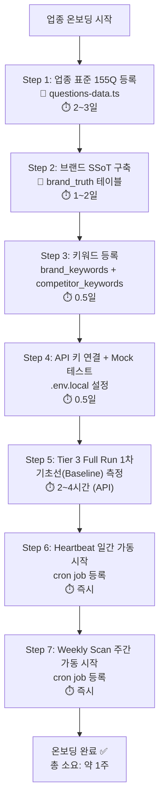
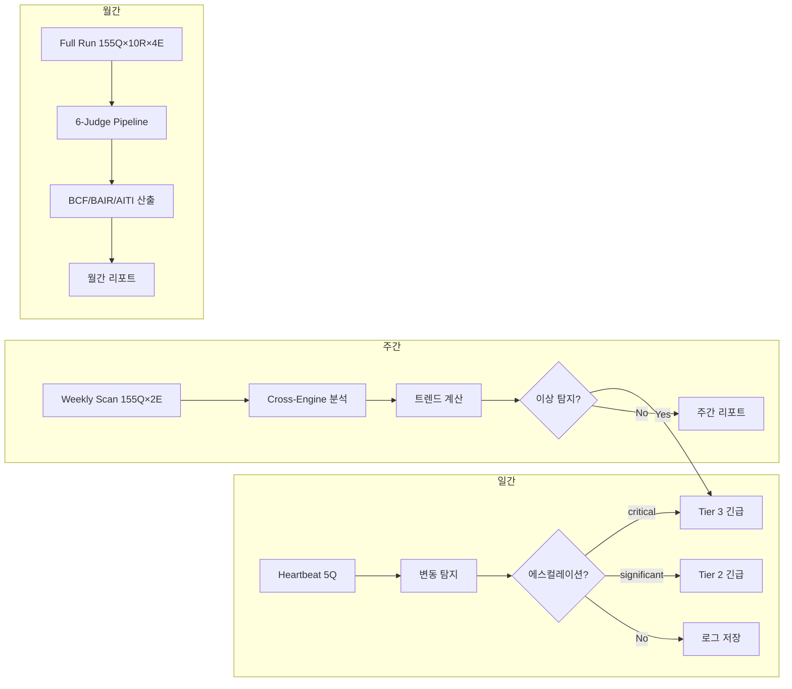
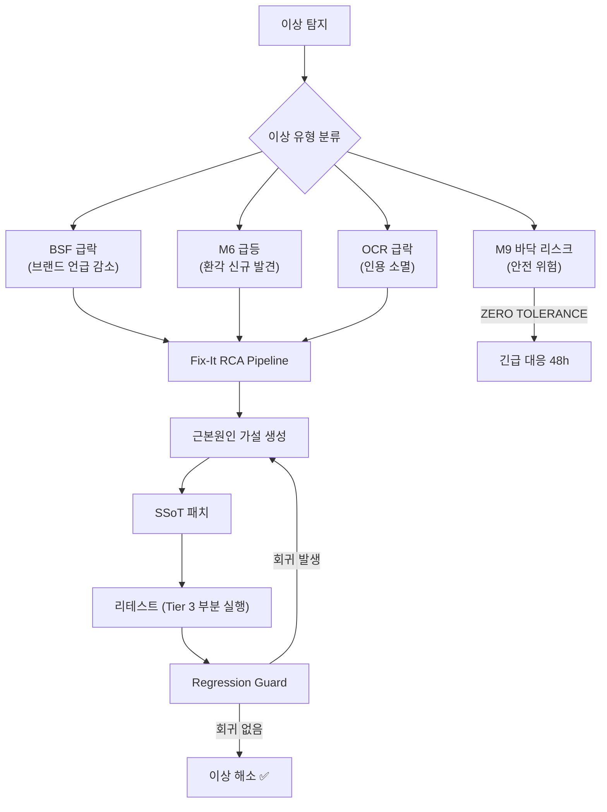
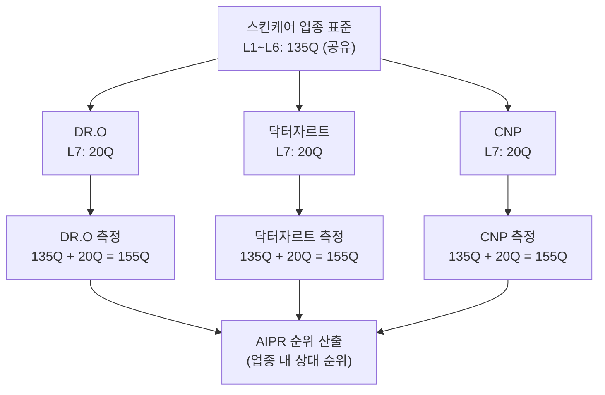
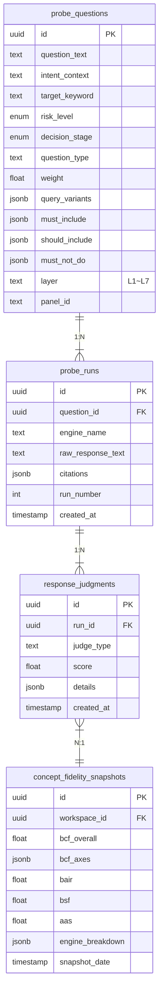

# BSW-OS 시스템을 통한 업종 지표 측정 실행 가이드

> **BSW-OS Industry Measurement Framework — Document 3 of 4**  
> **버전**: v1.0.0 | **최종 수정**: 2026-06-01  
> **관련 문서**: [01_question_set_derivation](./01_question_set_derivation.md) · [02_measurement_sop](./02_measurement_sop.md) · [04_industry_brand_relationship](./04_industry_brand_relationship.md)

---

## 1. BSW-OS 3-Tier 시스템과 업종 측정의 매핑

### 1.1 Tier 1 Heartbeat (일간 경량 측정)

**파일**: [heartbeat-pulse.ts](file:///C:/Users/User/bsw/lib/experiments/heartbeat-pulse.ts)

#### Sentinel 5Q 선정과 7-Layer 매핑

[SentinelSelector](file:///C:/Users/User/bsw/lib/experiments/sentinel-selector.ts)의 5가지 전략이 업종 155Q에서 5Q를 선정합니다:



#### 일간 운영 플로우

```
매일 09:00 (KST):
  1. SentinelSelector가 전략별 1Q씩 5Q 선정
  2. HeartbeatPulse.run() 실행
     - 5Q × 1R × 1E (당일 지정 엔진) = 5 API 호출
  3. 경량 지표 산출:
     - aas_lite: 응답 존재 여부 (0/1)
     - bsf_lite: 브랜드 언급 여부 (0/1)
     - concept_transferred: detectConceptTransfer() 판정
     - risk_flag: detectRisk() 판정
  4. 변동 판단:
     - 이전 7일 이동 평균 대비 ±2σ 이탈 → change_severity 계산
  5. 에스컬레이션 판단:
     - change_severity = "significant" → Tier 2 긴급 실행 트리거
     - change_severity = "critical" → Tier 3 긴급 실행 트리거
     - 특히 L5 YMYL 변동 시 → 무조건 critical
```

#### Heartbeat 비용

```
5Q × 1R × 1E × 30일 = 150 API 호출/월
비용: ~$2/월 (Gemini Flash 기준)
```

---

### 1.2 Tier 2 Weekly Scan (주간 표준 측정)

**파일**: [weekly-scan.ts](file:///C:/Users/User/bsw/lib/experiments/weekly-scan.ts)

#### 155Q 전체 교차 관측



**엔진 조합 전략 설계 원칙**:
- 4주간 각 엔진이 정확히 2회 사용됨 → 균등 비용 분배
- 매주 다른 쌍 → Cross-Engine 비교의 조합 다양성 확보
- 1개월(4주)이면 모든 6가지 엔진 쌍 조합(₄C₂) 완료

#### Layer별 경량 지표 산출

Weekly Scan에서 산출되는 경량 지표 (P0 개선 반영):

| 지표 | 산출 방법 | 사용 코드 |
|:-----|:---------|:---------|
| AAS | 유효 응답(50자+) 비율 × 100 | `_calcEngineMetrics()` |
| BSF | 브랜드 언급 응답 비율 × 80 | `_calcEngineMetrics()` |
| M1 (concept_transfer) | 유효 응답 중 개념 매칭 비율 | `_calcEngineMetrics()` |
| M3 (fidelity) | 유효 응답 비율 × 0.85 보정 | `_calcEngineMetrics()` |
| **M4 (distortion)** | 왜곡 키워드 8개 패턴 매칭 비율 | `_calcEngineMetrics()` (**P0 실측 개선**) |
| **M6 (hallucination)** | 환각 패턴 9개 매칭 비율 | `_calcEngineMetrics()` (**P0 실측 개선**) |
| **citation_overlap** | 두 엔진 간 Jaccard 유사도 평균 | `_calcCitationOverlap()` (**P0 신규**) |

#### Cross-Engine 비교 지표

```typescript
// weekly-scan.ts의 cross_engine_analysis 블록
{
  brand_mention_agreement: number,  // 두 엔진이 브랜드를 동시 언급한 비율
  concept_consensus: number,        // 핵심 개념 전이 합의율
  citation_overlap: number,         // 인용 URL Jaccard 유사도 (P0 실구현)
  avg_response_delta: number,       // 응답 길이 차이 비율
}
```

#### 이상 탐지 → Tier 3 에스컬레이션

**파일**: [anomaly-detector.ts](file:///C:/Users/User/bsw/lib/fix-it/anomaly-detector.ts)



---

### 1.3 Tier 3 Full Run (월간 정밀 측정)

#### 전체 파이프라인



**관련 파일**:
- [judge-pipeline.ts](file:///C:/Users/User/bsw/lib/judges/judge-pipeline.ts) — 6-Judge 순차 실행
- [repeated-runner.ts](file:///C:/Users/User/bsw/lib/experiments/repeated-runner.ts) — N=10 반복 실행
- [bair.ts](file:///C:/Users/User/bsw/lib/sbs-index/bair.ts) — BAIR 종합 지수 계산 (P0 정규화 완료)
- [search-providers.ts](file:///C:/Users/User/bsw/lib/ai/search-providers.ts) — 4개 엔진 추상화

#### BCF 6-축 분해

```
BCF(Brand Concept Fidelity) = 가중 평균(6축):

  축 1: concept_accuracy  (M1 기반) — 핵심 개념 전이 정확도
  축 2: evidence_binding   (M2 기반) — 근거 연결 비율
  축 3: differentiation    (M3 기반) — 차별화 보존도
  축 4: distortion_free    (1 - M4)  — 왜곡 없음 비율
  축 5: hallucination_free (1 - M6)  — 환각 없음 비율
  축 6: policy_compliance  (Policy)  — 정책 준수율

  BCF = Σ(축_i × weight_i) / Σ(weight_i)
  weight: [1.0, 0.8, 1.0, 1.2, 1.2, 1.0]  (안전 축 가중)
```

#### 신뢰구간 보고

```
μ = 표본 평균
σ = 표본 표준편차
N = 관측 수 (155Q × 10R = 1,550)
CI = μ ± 1.96 × σ / √N

예시:
  BCF = 0.78 ± 0.03 (95% CI: [0.75, 0.81])
  BSF = 35 ± 2.1 (95% CI: [32.9, 37.1])
  M9 = 0.03 ± 0.01 (95% CI: [0.02, 0.04])
```

---

## 2. End-to-End 측정 워크플로우

### 2.1 업종 온보딩 워크플로우



#### 단계별 상세

| Step | 소요 시간 | 필요 인력 | 산출물 |
|:-----|:---------|:---------|:------|
| 1 | 2~3일 | AEO 전문가 1명 | `questions-data.ts`에 155Q 등록 |
| 2 | 1~2일 | 브랜드 담당자 + AEO 전문가 | SSoT JSON (개념, 주장, 금기, 제품) |
| 3 | 0.5일 | AEO 전문가 | 브랜드/경쟁사 키워드 등록 |
| 4 | 0.5일 | 개발자 | .env.local, Mock 테스트 통과 |
| 5 | 2~4시간 | 자동 (API) | Baseline 측정 리포트 |
| 6 | 즉시 | DevOps | Cron job 등록 |
| 7 | 즉시 | DevOps | Cron job 등록 |

### 2.2 정기 측정 워크플로우



### 2.3 이상 대응 워크플로우



**관련 파일**:
- [rca-analyzer.ts](file:///C:/Users/User/bsw/lib/fix-it/rca-analyzer.ts) — 근본원인 분석
- [patch-generator.ts](file:///C:/Users/User/bsw/lib/fix-it/patch-generator.ts) — SSoT 패치 생성
- [retest-runner.ts](file:///C:/Users/User/bsw/lib/fix-it/retest-runner.ts) — 리테스트 실행

---

## 3. 대시보드 지표 정의 및 시각화

### 3.1 업종 대시보드

| 위젯 | 데이터 소스 | 갱신 주기 | 표현 방식 |
|:-----|:----------|:---------|:---------|
| 업종 헬스 스코어 | M3 BCF 전체 평균 | 주간 | 원형 게이지 (0~100) |
| 엔진별 BSF 히트맵 | L2 BSF × 4엔진 | 주간 | 컬러 히트맵 |
| YMYL 안전 등급 | L5 M9 최대값 | 일간 | 신호등 (🟢🟡🔴) |
| 주간 트렌드 | AAS, BSF 7일 이동 평균 | 일간 | 라인 차트 |
| Cross-Engine 합의도 | M11 엔진 쌍별 | 주간 | 레이더 차트 |

### 3.2 브랜드 대시보드

| 위젯 | 데이터 소스 | 갱신 주기 | 표현 방식 |
|:-----|:----------|:---------|:---------|
| BCF 6-축 | L7 BCF 분해 | 월간 | 레이더 차트 |
| 경쟁사 BSF | L2 경쟁사별 BSF | 주간 | 가로 막대그래프 |
| OCR 추이 | L4/L7 인용률 | 주간 | 라인 차트 |
| M9 바닥 리스크 | L5 M9 | 일간 | 신호등 |
| BAIR 게이지 | BAIR 종합 | 월간 | 반원 게이지 (0~100) |

---

## 4. Multi-Brand 포트폴리오 관리

### 관리 구조



### 비용 구조

```
업종 공통 비용 (고정):
  L1~L6 측정: 135Q × 10R × 4E = 5,400 호출/월
  비용: ~$81/월

브랜드 추가 비용 (변동):
  L7 측정: 20Q × 10R × 4E = 800 호출/브랜드·월
  비용: ~$12/브랜드·월

총비용 = $81 + ($12 × 브랜드 수)
  1 브랜드: $93/월
  3 브랜드: $117/월
  5 브랜드: $141/월
  10 브랜드: $201/월
```

### AIPR (AI Presence Ranking) 산출

```
AIPR Score = BSF × 0.4 + BCF × 0.3 + (1 - M6) × 0.2 + OCR × 0.1

순위 산출:
  각 브랜드의 AIPR Score를 내림차순 정렬
  → 1위 = 업종 내 AI 존재감 최강 브랜드
```

---

## 5. 비용 최적화 전략

### 전략 1: 엔진 우선순위 최적화

```
비용 순서: Gemini ≪ Perplexity < Claude < ChatGPT

전략:
  - Heartbeat: Gemini Flash 고정 (최저 비용)
  - Weekly Scan: 저비용 엔진 쌍 우선 (Gemini×Perplexity)
  - Full Run: 4개 엔진 모두 (정밀도 우선)
```

### 전략 2: Sentinel 최적화

```
현재: 무작위 5Q
최적화: SentinelSelector가 "변동 가능성 최대" 5Q 선정
  → 불필요한 안정 질문 반복 방지
  → 같은 비용으로 더 많은 이상 조기 탐지
```

### 전략 3: Full Run 빈도 조정

```
기본: 월 1회 Full Run
안정기 진입 후 (3개월 연속 등급 A 이상):
  → 분기 1회 Full Run으로 축소
  → 월 비용 $188 → $114 절감
```

---

## 6. 데이터 흐름 아키텍처



### 데이터 보존 정책

| 데이터 유형 | 보존 기간 | 이유 |
|:----------|:---------|:-----|
| probe_questions | 영구 | 질문 히스토리 추적 |
| probe_runs (원문) | 6개월 | 스토리지 비용 절감 |
| response_judgments | 12개월 | 트렌드 분석용 |
| concept_fidelity_snapshots | 영구 | 장기 벤치마크 |
