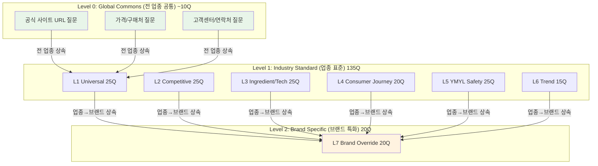
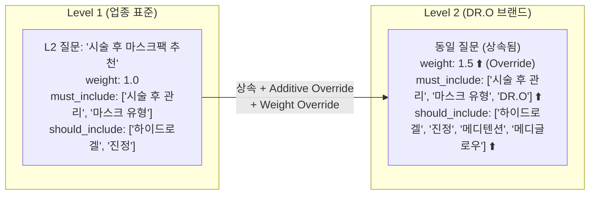
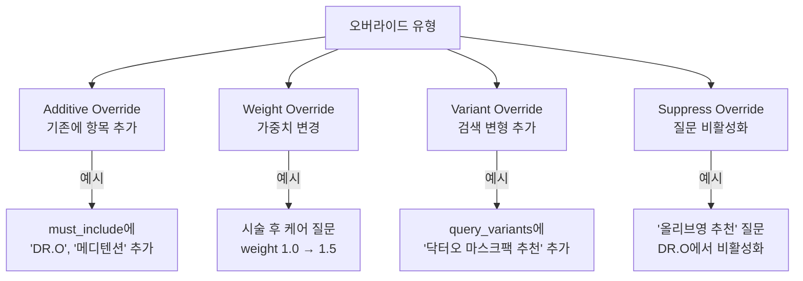
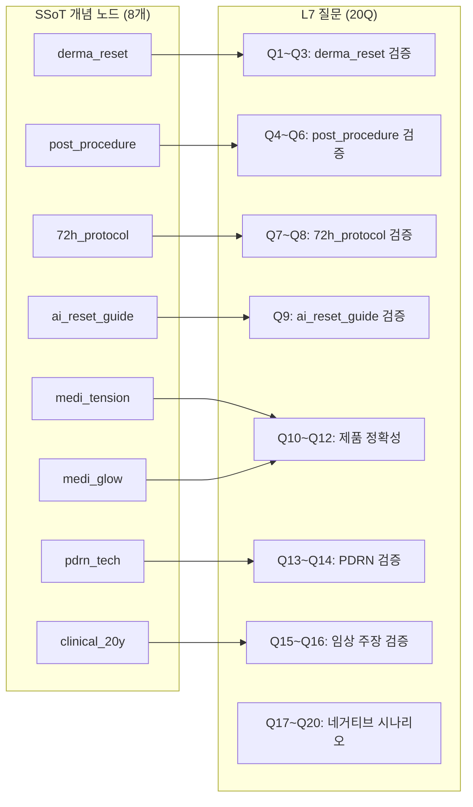
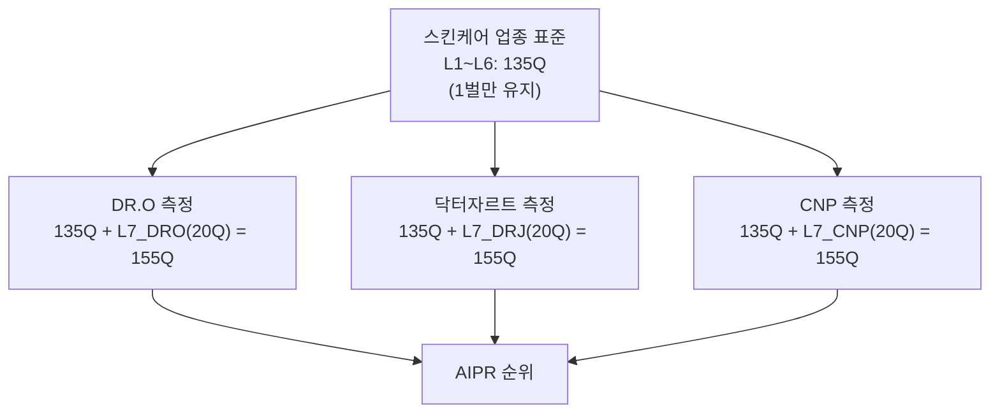
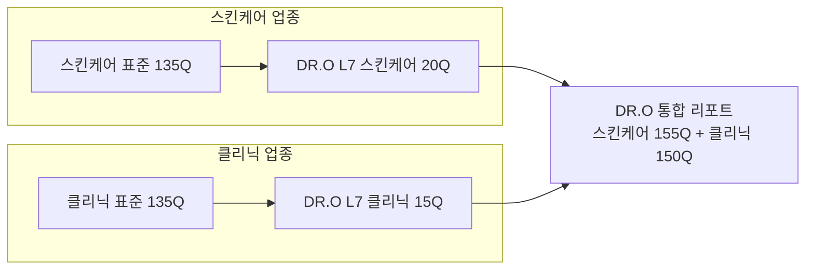
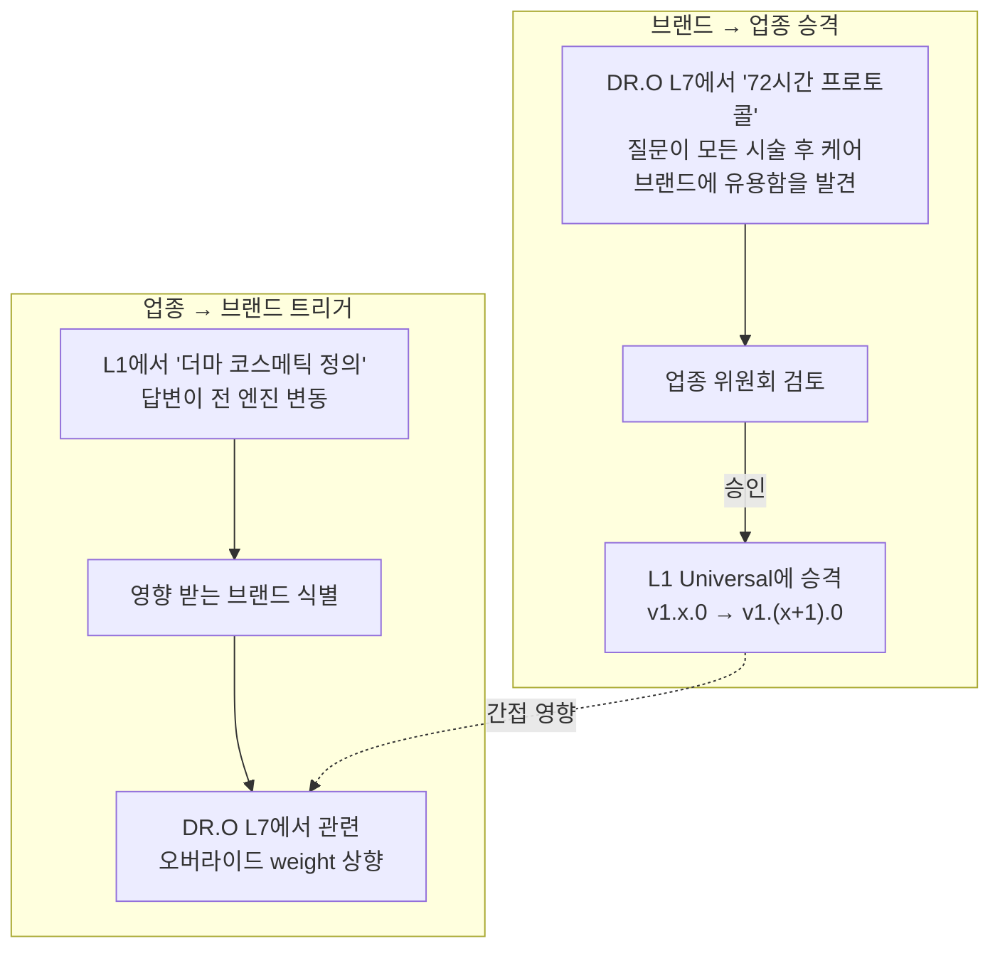

# 업종 표준 Question Set과 브랜드 Probe Question Set의 관계 모델

> **BSW-OS Industry Measurement Framework — Document 4 of 4**  
> **버전**: v1.0.0 | **최종 수정**: 2026-06-01  
> **관련 문서**: [01_question_set_derivation](./01_question_set_derivation.md) · [02_measurement_sop](./02_measurement_sop.md) · [03_system_measurement_guide](./03_system_measurement_guide.md)

---

## 1. 계층적 Question Set 아키텍처

### 1.1 3-Level 계층 모델



#### 각 Level의 소유권과 관리 책임

| Level | 소유 | 관리 주체 | 변경 승인 | 비용 분담 |
|:------|:-----|:---------|:---------|:---------|
| **Level 0** | BSW-OS 플랫폼 | 플랫폼 팀 | 플랫폼 팀장 | 플랫폼 비용 (무료) |
| **Level 1** | 업종 커뮤니티 | AEO 전문가 | 업종 위원회 | 업종 공통 비용 분담 |
| **Level 2** | 개별 브랜드 | 브랜드 AEO 담당 | 브랜드 관리자 | 브랜드 추가 비용 |

#### Level 0: Global Commons 질문 예시

모든 업종에 공통 적용되는 기본 질문 (~10Q):

| # | 질문 | 측정 지표 | 변수 |
|:--|:-----|:---------|:-----|
| G01 | {brand} 공식 사이트 주소 알려줘 | OCR | {brand}, {official_url} |
| G02 | {brand} 제품 가격대 알려줘 | M6 (환각) | {brand} |
| G03 | {brand} 고객센터 연락처 | M6 (환각) | {brand} |
| G04 | {brand} 가까운 매장 어디야? | M6 + local | {brand} |
| G05 | {brand}에 대해 간단히 소개해줘 | M1 (개념 전이) | {brand} |
| G06 | {brand} 제품 종류 알려줘 | M1 | {brand} |
| G07 | {brand} 최근 뉴스 있어? | M8 (드리프트) | {brand} |
| G08 | {brand} 후기나 평판 어때? | M3 (BCF) | {brand} |
| G09 | {brand} 대표 제품 추천해줘 | BSF | {brand} |
| G10 | {brand} 할인이나 이벤트 있어? | M6 (환각) | {brand} |

---

### 1.2 템플릿 변수 시스템

#### 변수 정의

| 변수 | 소스 | 치환 방법 | 확장 효과 |
|:-----|:-----|:---------|:---------|
| `{brand}` | SSoT.brand_name | 1:1 직접 치환 | 없음 |
| `{competitor}` | SSoT.competitors[] | 1:N 순차 치환 | 질문 수 N배 |
| `{product}` | SSoT.products[] | 1:N 순차 치환 | 질문 수 N배 |
| `{ingredient}` | SSoT.concepts[].ingredients | 1:N 순차 치환 | 질문 수 N배 |
| `{official_url}` | SSoT.official_domains[0] | 1:1 직접 치환 | 없음 |

#### 치환 예시: DR.O 적용

원본 질문:
```
"{brand} vs {competitor} 보습크림 비교 어떤 게 좋아?"
```

치환 결과 (경쟁사 3개 × 1 = 3개 관측):
```
"DR.O vs 닥터자르트 보습크림 비교 어떤 게 좋아?"
"DR.O vs CNP 보습크림 비교 어떤 게 좋아?"
"DR.O vs 라로슈포제 보습크림 비교 어떤 게 좋아?"
```

#### 조합 폭발 방지 전략

```
위험 사례:
  "{brand} {product}와 {competitor} {product} 비교"
  → 2 products × 3 competitors × 2 products = 12 조합!

방지 규칙:
  1. 단일 질문에 변수 최대 2개
  2. {competitor}와 {product}를 동시에 사용하면 
     {competitor}만 확장, {product}는 대표 1개 고정
  3. 확장 후 총 관측 수 ≤ 5 × 원본 Q 수
```

---

## 2. 상속과 오버라이드 메커니즘

### 2.1 상속 규칙



**상속 원칙**:
1. L1~L6의 모든 질문은 브랜드로 **100% 상속**됩니다
2. 브랜드는 상속받은 질문의 **expected_layers를 오버라이드** 가능
3. 질문 텍스트(question_text) 자체는 **수정 불가** (업종 표준 유지)
4. {brand} 변수만 브랜드별로 치환됨

### 2.2 오버라이드 유형 4가지



#### 오버라이드 데이터 구조

```typescript
interface BrandOverride {
  question_id: string;       // 업종 표준 질문 ID
  brand_id: string;          // 브랜드 ID
  override_type: 'additive' | 'weight' | 'variant' | 'suppress';
  
  // Additive Override
  additional_must_include?: string[];
  additional_should_include?: string[];
  additional_must_not_do?: string[];
  
  // Weight Override
  weight_multiplier?: number;  // 원본 weight × multiplier
  
  // Variant Override
  additional_variants?: string[];
  
  // Suppress Override
  suppressed?: boolean;
  suppress_reason?: string;
}
```

#### DR.O 오버라이드 예시 (스킨케어 업종)

| 업종 질문 | Override 유형 | 변경 내용 | 이유 |
|:---------|:------------|:---------|:-----|
| "시술 후 마스크팩 추천" | **Weight** + **Additive** | weight ×1.5, must_include에 'DR.O' 추가 | DR.O 핵심 포지셔닝 |
| "하이드로겔 마스크 vs 시트 마스크" | **Additive** | should_include에 '메디텐션' 추가 | 제품 연관 |
| "PDRN 성분 효과" | **Weight** + **Additive** | weight ×1.3, must_include에 'DR.O' 추가 | 핵심 성분 |
| "올리브영 세럼 추천" | **Suppress** | 비활성화 | DR.O 비해당 채널 |
| "비건 화장품 추천" | **Suppress** | 비활성화 | DR.O 비건 미인증 |

### 2.3 L7 Brand Override 질문 설계 원칙

#### SSoT 개념 노드 1:1 매핑



**규칙**: 각 개념 노드에 대해 최소 2~3Q를 배정하되, **정상 1 + 왜곡 1 + 환각 1** 3종 세트를 기본으로 합니다.

#### 네거티브 시나리오 포함 규칙

L7의 마지막 20%는 반드시 **부정적 검색** 시나리오를 포함합니다:

```
예시:
  "닥터오 효과 없다는데 진짜야?" (네거티브 검증)
  "DR.O 부작용 사례 있어?" (안전 검증)
  "닥터오가 과대 광고라는 평가가 있던데?" (평판 리스크)
  "droanswer.com이 사기 사이트야?" (신뢰도 검증)

측정 목표:
  AI가 부정적 질문에 대해:
  ✅ 균형 잡힌 답변을 하는지 (M4 왜곡 = 0)
  ✅ 허위 부정 정보를 생성하지 않는지 (M6 환각 = 0)
  ✅ 브랜드를 과도하게 방어하지 않는지 (M4 역왜곡 탐지)
```

---

## 3. 측정 지표의 업종-브랜드 이중 산출

### 3.1 업종 수준 지표 (Industry Metrics)

```
산출 범위: L1~L6 (135Q)만 사용
목적: "스킨케어 업종에서 AI가 기본 지식을 얼마나 정확히 전달하는가"
특성: 브랜드 무관한 객관적 벤치마크
```

| 지표 | 산출 공식 | 해석 |
|:-----|:---------|:-----|
| Industry M1 | Σ(L1~L6 concept_transferred) / N | 업종 기본 지식 전이율 |
| Industry M2 | Σ(L1~L6 evidence_bound) / N | 업종 증거 바인딩율 |
| Industry M6 | Σ(L1~L6 hallucination) / N | 업종 환각 발생률 |
| Industry M9 | max(L5 risk_score) | 업종 안전 최악 케이스 |
| Industry Health | weighted_avg(M1, M2, 1-M6, 1-M9) | 업종 종합 건강도 |

### 3.2 브랜드 수준 지표 (Brand Metrics)

```
산출 범위: L1~L7 (155Q) 전체 사용
목적: "DR.O에 대해 AI가 얼마나 정확히 답변하는가"
특성: 브랜드 고유 성과 측정
```

| 지표 | 산출 공식 | 해석 |
|:-----|:---------|:-----|
| Brand BCF (M3) | 6-축 가중 평균 | 브랜드 개념 충실도 |
| Brand BSF | brand_mention / total × 100 | 브랜드 AI 존재감 |
| Brand OCR | official_citation / total × 100 | 공식 사이트 인용률 |
| Brand M6 | Σ(L1~L7 hallucination) / N | 브랜드 관련 환각률 |
| **BAIR** | (BSF/100)×AAS×(1+OCR)×SWEL×100 | 종합 AI 평판 지수 |

### 3.3 차등 분석 (Differential Analysis)

```
Brand Premium = Brand_Metric - Industry_Average

예시:
  DR.O M1 = 0.82
  스킨케어 업종 M1 평균 = 0.78
  → Brand Premium = +0.04 (양수 = AI가 DR.O를 잘 이해)

  DR.O M6 = 0.07
  스킨케어 업종 M6 평균 = 0.04
  → Brand Premium = +0.03 (양수 = DR.O 환각이 평균보다 높음 → 개선 필요)
```

#### 경쟁사 차등 분석 매트릭스

```
┌──────────┬───────┬─────────┬───────┬──────────┐
│ 지표\브랜드│ DR.O  │닥터자르트│  CNP  │ 업종 평균 │
├──────────┼───────┼─────────┼───────┼──────────┤
│ M1       │ 0.82  │  0.85   │ 0.79  │  0.78    │
│ BSF      │  32   │   42    │  28   │   25     │
│ BCF      │ 0.72  │  0.78   │ 0.70  │  0.68    │
│ M6       │ 0.07  │  0.03   │ 0.05  │  0.04    │
│ OCR      │ 0.08  │  0.18   │ 0.12  │  0.10    │
│ BAIR     │  68   │   82    │  65   │   62     │
├──────────┼───────┼─────────┼───────┼──────────┤
│ Premium  │ +6.0  │ +20.0   │ +3.0  │   -      │
└──────────┴───────┴─────────┴───────┴──────────┘

인사이트:
  - DR.O: BSF/OCR이 닥터자르트 대비 낮음 → AEO 최적화 필요
  - DR.O: M6이 업종 평균보다 높음 → 환각 Fix-It 우선
  - 닥터자르트: 모든 지표에서 업종 평균 초과 → 벤치마크 대상
```

---

## 4. Multi-Brand 시나리오

### 4.1 같은 업종 내 N개 브랜드 관리



**핵심**: L1~L6 측정은 **1회만 실행**하고 결과를 공유합니다. L7만 브랜드별 추가 실행합니다.

### 4.2 다업종 브랜드 관리

DR.O가 스킨케어(1차) + 클리닉 홈케어(2차)에 걸치는 경우:



**규칙**: 업종별로 독립 측정 후, 브랜드 통합 리포트에서 합산합니다.

### 4.3 AIPR 순위 산출

```
AIPR = BSF × 0.4 + BCF × 0.3 + (1 - M6) × 100 × 0.2 + OCR × 100 × 0.1

순위 변동 추적:
  Week 1: DR.O 3위, 닥터자르트 1위, CNP 2위
  Week 2: DR.O 2위 ⬆️, 닥터자르트 1위, CNP 3위 ⬇️
  ...

알림 트리거:
  순위 2단계 이상 하락 → 즉시 Alert
  순위 1위 변동 → 주간 리포트 하이라이트
```

---

## 5. 질문 세트 진화 관리

### 5.1 버전 관리 체계

```
Industry Panel:
  SBS-AIPR-Skincare-v1.0.0  (초기)
  SBS-AIPR-Skincare-v1.0.1  (L6 월간 교체)
  SBS-AIPR-Skincare-v1.1.0  (L2 분기 갱신)
  SBS-AIPR-Skincare-v2.0.0  (L1 구조 변경)

Brand Panel:
  SBS-BRAND-DRO-v1.0.0      (초기)
  SBS-BRAND-DRO-v1.1.0      (신제품 추가)
  SBS-BRAND-DRO-v2.0.0      (리브랜딩)

호환성 매트릭스:
  ┌───────────────────┬────────────┬────────────┐
  │ Industry\Brand    │ DRO v1.0   │ DRO v1.1   │
  ├───────────────────┼────────────┼────────────┤
  │ Skincare v1.0     │    ✅      │    ✅      │
  │ Skincare v1.1     │    ✅      │    ✅      │
  │ Skincare v2.0     │    ⚠️      │    ✅      │
  └───────────────────┴────────────┴────────────┘
  ⚠️ = 오버라이드 재검토 필요
```

### 5.2 질문 마이그레이션

```
L6 Trend 월간 교체 시:

  퇴출 질문:
    - question_id = "T001"
    - status → "retired"
    - 과거 데이터: 12개월 보존 후 아카이브

  추가 질문:
    - question_id = "T015" (신규 발번)
    - status → "active"
    - 즉시 Baseline 측정 1회 실행
    - 다음 주기부터 정규 측정에 포함

  연속성 유지:
    - L6 평균 지표 산출 시, 퇴출 질문 데이터는 제외
    - 트렌드 차트에서 교체 시점 수직선 표시
    - "교체 전/후" 비교 불가 표기
```

### 5.3 업종 ↔ 브랜드 피드백 루프



**승격 기준**:
1. 브랜드 L7 질문이 3개 이상의 브랜드에서 동일 패턴으로 추가됨
2. 업종 위원회 과반 승인
3. 승격 후 L7에서는 자동 제거 (중복 방지)

---

## 6. 스킨케어 × DR.O 실전 적용 시나리오

### 시나리오 A: 신규 브랜드 온보딩

```
전제: 스킨케어 업종 표준 155Q가 이미 등록됨

Day 1: DR.O SSoT 구축
  - droanswer.com 크롤링 → 개념 노드 8개 추출
  - 제품 2개(메디텐션, 메디글로우) 정보 등록
  - 경쟁사 4개(닥터자르트, CNP, 라로슈포제, 메디힐) 등록
  - 금기 사항 7개 등록

Day 2: L7 Brand Override 20Q 작성
  - SSoT 개념 노드 8개 × ~2.5Q = 20Q
  - 정상/왜곡/환각 3종 세트 포함
  - 네거티브 시나리오 4Q 포함
  - weight 오버라이드 5개 설정

Day 3: L1~L6 오버라이드 설정
  - Additive Override: 시술 후 관련 질문에 'DR.O' must_include 추가
  - Weight Override: 시술 후 케어 관련 5Q weight ×1.5
  - Suppress Override: 비건/올리브영 비해당 2Q 비활성화

Day 4: Baseline 측정
  - Tier 3 Full Run 1차 실행 (155Q × 10R × 4E)
  - 소요 시간: ~3시간
  - 초기 BCF/BSF/BAIR 산출 → Baseline 보고서

Day 5~: 정규 운영 시작
  - Heartbeat 일간 가동
  - Weekly Scan 주간 가동
```

### 시나리오 B: 경쟁사 추가

```
기존: DR.O만 측정 중
추가: '아벤느'를 경쟁사로 추가

변경 사항:
  1. SSoT.competitors[]에 '아벤느' 추가
  2. L2 Competitive의 {competitor} 확장: 3 → 4개
  3. L2 관측 수: 25Q × 4 = 100Q (기존 75Q에서 증가)

추가 비용:
  Full Run: +25Q × 10R × 4E = 1,000 추가 호출/월
  비용: ~$15/월 추가

추가 인사이트:
  - 아벤느 vs DR.O BSF 비교
  - 글로벌 더마 vs K-Derma 포지셔닝 차이 측정
```

### 시나리오 C: 신제품 출시

```
기존: 메디텐션, 메디글로우 2개 제품
추가: 'Medi-Hydra' 신제품 출시

변경 사항:
  1. SSoT.products[]에 Medi-Hydra 추가
     - key_ingredients: 히알루론산, PDRN
     - format: 워터 젤 크림
     - primary_use: 수분 장벽 강화

  2. SSoT.concepts[]에 'medi_hydra' 노드 추가
     - definition: "수분 장벽 강화 전문 워터 젤 크림"

  3. L7 Brand Override 질문 추가 (4Q):
     - "메디하이드라 사용법 알려줘" (Normal)
     - "메디하이드라가 보습 100% 보장한다던데?" (Distortion)
     - "메디하이드라 피부과 처방전이 필요해?" (Hallucination)
     - "메디텐션 vs 메디글로우 vs 메디하이드라 차이" (Comparison)

  4. 기존 L7에서 2Q 퇴출 (총 수 유지: 20Q)

  5. 버전 업데이트: SBS-BRAND-DRO-v1.0 → v1.1.0

절차:
  Day 1: SSoT 업데이트 + L7 갱신
  Day 2: Baseline 측정 (변경된 4Q만 부분 Full Run)
  Day 3~: 정규 운영에 통합
```

### 시나리오 D: 트렌드 변화 대응

```
상황: '엑소좀'이 K-뷰티 트렌드 성분으로 부상

Phase 1: L6 Trend 월간 교체 (즉시)
  - 퇴출: "작년 트렌드 스킨케어 성분" 질문 (더 이상 트렌드 아님)
  - 추가: "엑소좀 화장품 효과 있어?" (신규 트렌드)
  - 버전: v1.0.x → v1.0.(x+1)

Phase 2: Monitoring (1~3개월)
  - 엑소좀 질문의 M1, Cross-Engine M11 추적
  - 엑소좀 관련 답변 품질이 엔진 간 불일치가 크면
    → 추가 L3 질문 후보로 표시

Phase 3: L3 Ingredient 반기 교체 (안착 시)
  - 엑소좀이 3개월 이상 트렌드 유지 확인
  - L6에서 L3으로 영구 이관
  - "엑소좀 vs PDRN 효과 비교" L3 질문 추가
  - 버전: v1.x.0 → v1.(x+1).0

Phase 4: DR.O L7 영향 평가
  - DR.O가 엑소좀 제품을 출시하면 → L7 질문 추가
  - 출시하지 않으면 → L2 경쟁 모니터링만 유지
```

---

## 부록: 용어 정리

| 약어 | 풀네임 | 설명 |
|:-----|:------|:-----|
| **SSoT** | Single Source of Truth | 브랜드 정본 데이터 |
| **BCF** | Brand Concept Fidelity | 브랜드 개념 충실도 (M3) |
| **BSF** | Brand Share of AI Response | AI 답변 내 브랜드 점유율 |
| **BAIR** | Brand AI Reputation Index | 종합 AI 평판 지수 |
| **AAS** | AI Answer Sensitivity | AI 답변 감성도 |
| **OCR** | Official Citation Rate | 공식 사이트 인용률 |
| **AIPR** | AI Presence Ranking | AI 존재감 순위 |
| **YMYL** | Your Money or Your Life | 건강/안전/금융 고위험 카테고리 |
| **RCA** | Root Cause Analysis | 근본 원인 분석 |
| **AEO** | AI Engine Optimization | AI 엔진 최적화 |
| **GEO** | Generative Engine Optimization | 생성형 엔진 최적화 |
