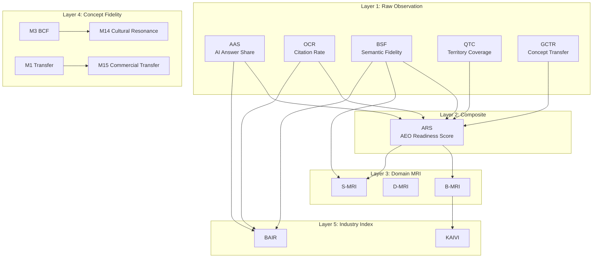

# AI API 기반 지표 측정 검증 테스트 계획

BSW-OS 플랫폼에 구현된 **~36개 메트릭/인덱스**를 체계적으로 정리하고, AI API 호출을 통해 시스템 핵심 기능을 검증할 **5대 핵심 지표 테스트 계획**을 제시합니다.

---

## Part 1: 시스템 메트릭 체계 총람

### Layer 1 — 관측소 기본 지표 (Observatory Core Metrics)

AI 엔진 응답을 직접 분석하여 산출하는 **원시 관측 지표**입니다.

| 지표 | 약어 | 산출 공식 | 출력 범위 | 소스 |
|------|------|-----------|-----------|------|
| AI Answer Share | AAS | `(브랜드 언급 응답 수 / 전체) × 100` | 0–100% | [observatory.ts](file:///c:/Users/User/bsw/app/actions/observatory.ts) |
| Official Citation Rate | OCR | `(인용 포함 응답 수 / 전체) × 100` | 0–100% | [observatory.ts](file:///c:/Users/User/bsw/app/actions/observatory.ts) |
| Brand Semantic Fidelity | BSF | `avg(brand_semantic_fidelity_score)` | 0–100 | [observatory.ts](file:///c:/Users/User/bsw/app/actions/observatory.ts) |
| Question Territory Coverage | QTC | `(질문 영역 커버 응답 / 전체) × 100` | 0–100% | [observatory.ts](file:///c:/Users/User/bsw/app/actions/observatory.ts) |
| GEO Concept Transfer Rate | GCTR | `(개념 전이 응답 / 전체) × 100` | 0–100% | [observatory.ts](file:///c:/Users/User/bsw/app/actions/observatory.ts) |
| **AEO Readiness Score** | **ARS** | `AAS×0.2 + OCR×0.2 + BSF×0.3 + QTC×0.1 + GCTR×0.2` | 0–100 | [observatory.ts](file:///c:/Users/User/bsw/app/actions/observatory.ts) |

> [!NOTE]
> ARS는 5개 원시 지표의 가중 합산으로, 모든 상위 복합 지표(MRI, BAIR 등)의 기반이 됩니다.

---

### Layer 2 — MRI 도메인 인덱스 (Meaning Readiness Indices)

각 도메인별 "의미 준비도"를 측정하는 **복합 인덱스**입니다.

| 지표 | 약어 | 핵심 구성 | 출력 | 소스 |
|------|------|-----------|------|------|
| Brand MRI | B-MRI | AAS, OCR, BSF, QTC, GCTR, ARS + 경쟁사 포지션 − 신뢰도/변동성 패널티 | 0–100 | [b-mri.ts](file:///c:/Users/User/bsw/lib/metrics/b-mri.ts) |
| Data/Deployment MRI | D-MRI | 12개 서브 컴포넌트 (진실·증거·경계·질문·KG·클레임·객체·표면·수출·페르소나·관측소·수정) | 0–100 | [d-mri.ts](file:///c:/Users/User/bsw/lib/metrics/d-mri.ts) |
| Operational MRI | OPS-MRI | `avgDeltaSeverity + avgMsa` (진실 델타 + 바이브 진단) | 숫자 | [observatory.ts](file:///c:/Users/User/bsw/app/actions/observatory.ts) |
| Persona MRI | P-MRI | `(미완료 페르소나 평가 / 전체) × 100` | 0–100 | [observatory.ts](file:///c:/Users/User/bsw/app/actions/observatory.ts) |
| Vibe MRI | V-MRI | `100 − avgVPA` (바이브 정렬 점수) | 0–100 | [observatory.ts](file:///c:/Users/User/bsw/app/actions/observatory.ts) |
| Semantic MRI | S-MRI | `ARS×0.4 + BSF×0.3 + QTC×0.3` | 0–100 | [observatory.ts](file:///c:/Users/User/bsw/app/actions/observatory.ts) |

---

### Layer 3 — 개념 충실도 지표 (Concept Fidelity M1–M13)

AI 응답의 **브랜드 개념 보존 품질**을 다각도로 측정합니다.

| 지표 | 코드 | 설명 | 출력 | 소스 |
|------|------|------|------|------|
| M1 | Concept Transfer Rate | 전달된 개념 비율 (정확도 가중 평균) | 0–1 | [concept-fidelity-aggregator.ts](file:///c:/Users/User/bsw/lib/metrics/concept-fidelity-aggregator.ts) |
| M2 | Citation-Backed Rate | 증거 기반 개념 비율 | 0–1 | 〃 |
| **M3** | **Brand Concept Fidelity** | 브랜드 개념 충실도 (A/B/C/D/F 등급) | 0–1 | 〃 |
| M4 | Concept Distortion Rate | 개념 왜곡 비율 | 0–1 | 〃 |
| M5 | Missing Concept Gap Count | 누락 개념 수 (recall < 0.8) | 정수 | 〃 |
| M6 | Hallucinated Concept Rate | 환각 개념 비율 | 0–1 | 〃 |
| M7 | Attractor Stability | 어트랙터 안정성 (재현율·순위·관계·경계 억제) | 0–1 | [attractor-stability-calculator.ts](file:///c:/Users/User/bsw/lib/metrics/attractor-stability-calculator.ts) |
| M8 | Drift Score | 기준 대비 개념 분포 드리프트 | 0–1 | [drift-calculator.ts](file:///c:/Users/User/bsw/lib/metrics/drift-calculator.ts) |
| M9 | Floor Risk | 최하위 10% 위험도 평균 | 0–1 | [concept-fidelity-aggregator.ts](file:///c:/Users/User/bsw/lib/metrics/concept-fidelity-aggregator.ts) |
| M10 | Policy Alignment | 정책 정렬도 | 0–1 | 〃 |
| M11 | Consensus Score | 반복 실행 간 자카드 유사도 평균 | 0–1 | [attractor-stability-calculator.ts](file:///c:/Users/User/bsw/lib/metrics/attractor-stability-calculator.ts) |
| M12 | Variance Score | 개념별 재현율 베르누이 분산 합 | ≥ 0 | 〃 |
| M13 | AEO/GEO Readiness Score | 종합 준비도 (8개 가중 합) | 0–1 (A~F) | [concept-fidelity-aggregator.ts](file:///c:/Users/User/bsw/lib/metrics/concept-fidelity-aggregator.ts) |

---

### Layer 4 — K-Culture 문화 확장 지표

| 지표 | 코드 | 산출 공식 | 출력 | 소스 |
|------|------|-----------|------|------|
| **M14** | **Cross-Cultural Resonance** | `0.4×M3 + 0.3×(1−M4) + 0.3×(1−M9)` | 0–1 | [cultural-metrics-aggregator.ts](file:///c:/Users/User/bsw/lib/metrics/cultural-metrics-aggregator.ts) |
| M15 | Commercial Transferability | `0.5×M1 + 0.3×M2 + 0.2×M10` | 0–1 | 〃 |

---

### Layer 5 — SBS 산업 인덱스 (SBS Index Report)

모든 하위 지표를 통합하는 **최상위 복합 인덱스**입니다.

| 지표 | 약어 | 산출 공식 | 출력 | 소스 |
|------|------|-----------|------|------|
| **Brand AI Reputation Index** | **BAIR** | `BSF × AAS × (1+OCR) × SWEL` | 복합점수 | [bair.ts](file:///c:/Users/User/bsw/lib/sbs-index/bair.ts) |
| AI Trust Index | AITI | `(Evidence Match×100) − (Unsafe×5)` | 0–100 | [bair.ts](file:///c:/Users/User/bsw/lib/sbs-index/bair.ts) |
| AI Power Ranking | AIPR | BAIR 기반 경쟁사 비교 순위 | 순위 배열 | [aipr.ts](file:///c:/Users/User/bsw/lib/sbs-index/aipr.ts) |
| Korea AI Visibility Index | KAIVI | `avg(BAIR) × avg(MRI)` | 0–100 | [kaivi.ts](file:///c:/Users/User/bsw/lib/sbs-index/kaivi.ts) |

---

### 메트릭 데이터 흐름 아키텍처



---

## Part 2: 5대 핵심 검증 지표 선정

> [!IMPORTANT]
> **선정 기준**: ① 시스템 가치 체인 전 계층 커버리지 ② AI API 호출로 실질 측정 가능 ③ 독립 검증 가능한 산출 공식 보유 ④ 비즈니스 임팩트 대표성

| # | 지표 | 계층 | 선정 근거 |
|---|------|------|-----------|
| **T1** | BAIR (Brand AI Reputation Index) | Layer 5 | 🏆 플래그십 복합 지표. BSF→AAS→OCR→SWEL 전 파이프라인 E2E 검증 |
| **T2** | ARS (AEO Readiness Score) | Layer 2 | 🔗 모든 상위 지표의 기반. 5개 원시 지표 가중합 정확성 검증 |
| **T3** | M3 — Brand Concept Fidelity (BCF) | Layer 4 | 🎯 AI 판단(Judge) 파이프라인의 핵심 출력. A~F 등급 산정 검증 |
| **T4** | M14 — Cross-Cultural Resonance | Layer 4-K | 🌏 K-Culture 확장의 핵심 지표. M3+M4+M9 합산 검증 |
| **T5** | B-MRI (Brand Meaning Readiness Index) | Layer 3 | 📊 가장 복잡한 도메인 인덱스. 6개 지표+경쟁사+패널티 종합 검증 |

---

## Part 3: 테스트 계획

### T1 — BAIR (Brand AI Reputation Index) 측정 테스트

#### 목적
AI API 호출 → 프로브 응답 생성 → 판정(Judgment) → BAIR 산출까지의 **End-to-End 파이프라인** 정확성 검증

#### 테스트 시나리오

```
시나리오 1: "높은 브랜드 인지도" 케이스
├─ Setup: 10개 프로브 응답 중 8개에 브랜드 키워드 포함 (BSF=80)
│          긍정 센티멘트 7/10 (AAS=0.7)
│          강력 추천 패턴 6/10 (OCR=0.6)
│          SWEL=1.12
├─ Expected: BAIR = 80 × 0.7 × (1+0.6) × 1.12 ≈ 100.35
└─ Validation: ±5% 오차 범위 내 통과

시나리오 2: "브랜드 비인지" 케이스
├─ Setup: 10개 프로브 응답 중 1개만 브랜드 언급 (BSF=10)
│          센티멘트 0.3, OCR=0.1, SWEL=1.0
├─ Expected: BAIR = 10 × 0.3 × (1+0.1) × 1.0 = 3.30
└─ Validation: BAIR < 10 확인

시나리오 3: "Concept Fidelity 보정" 케이스
├─ Setup: 기본 BSF=50 + concept_fidelity_snapshots에 BCF=0.9
├─ Expected: BSF가 BCF로 보정되어 BAIR 상승
└─ Validation: 보정 전/후 BAIR 차이 > 0 확인
```

#### 테스트 방법
1. **모의 데이터 주입**: `probe_runs` + `response_judgments` 테이블에 테스트 데이터 삽입
2. **엔진 호출**: `BairEngine.computeBAIR(workspaceId, brandKeyword)` 직접 호출
3. **수학적 검증**: 반환값을 수작업 공식 계산 결과와 비교

#### 실행 코드 구조
```typescript
// tests/integration/ai-metrics/t1-bair.test.ts
describe('T1: BAIR E2E Measurement', () => {
  it('computes correct BAIR for high-awareness scenario', async () => {
    // 1. Seed mock probe_runs with brand-mentioning responses
    // 2. Seed response_judgments with sentiment/citation scores
    // 3. Call BairEngine.computeBAIR()
    // 4. Assert result within ±5% of hand-calculated value
  });
});
```

---

### T2 — ARS (AEO Readiness Score) 측정 테스트

#### 목적
5개 원시 관측 지표(AAS, OCR, BSF, QTC, GCTR)의 **가중합 정확성** 및 `metric_snapshots` 저장 무결성 검증

#### 테스트 시나리오

```
시나리오 1: "균형 잡힌 성과" 케이스
├─ Input: AAS=70, OCR=65, BSF=80, QTC=55, GCTR=60
├─ Expected: 70×0.2 + 65×0.2 + 80×0.3 + 55×0.1 + 60×0.2
│          = 14 + 13 + 24 + 5.5 + 12 = 68.5
└─ Validation: ARS === 68.5 (정확 일치)

시나리오 2: "BSF 지배적" 케이스
├─ Input: AAS=20, OCR=10, BSF=95, QTC=15, GCTR=10
├─ Expected: 20×0.2 + 10×0.2 + 95×0.3 + 15×0.1 + 10×0.2
│          = 4 + 2 + 28.5 + 1.5 + 2 = 38.0
└─ Validation: ARS === 38.0 (BSF 가중치 0.3 의존 확인)

시나리오 3: "제로 입력" 케이스
├─ Input: AAS=0, OCR=0, BSF=0, QTC=0, GCTR=0
├─ Expected: ARS === 0
└─ Validation: 엣지 케이스 zero-division 없음 확인
```

#### 테스트 방법
1. **판정 데이터 시딩**: `response_judgments`에 정확한 플래그 값 삽입
2. **서버 액션 호출**: `computeMetricSnapshot(runId)` 호출
3. **DB 검증**: `metric_snapshots` 테이블에서 저장된 값 조회 후 비교
4. **가중치 감도 분석**: 각 입력을 10% 변동시켜 ARS 변동폭이 가중치에 비례하는지 확인

---

### T3 — M3 Brand Concept Fidelity (BCF) 측정 테스트

#### 목적
AI Judge 파이프라인이 **브랜드 개념 충실도를 정확히 평가**하는지, 등급(A~F) 매핑이 올바른지 검증

#### 테스트 시나리오

```
시나리오 1: "A 등급 — 완벽한 개념 보존"
├─ Setup: fidelity_judgments에 brand_concept_fidelity = [0.92, 0.88, 0.90]
├─ Expected: M3 = avg(0.92, 0.88, 0.90) = 0.9 → Grade A (≥ 0.85)
└─ Validation: 등급 A 확인, M3 ≈ 0.90

시나리오 2: "C 등급 — 중간 수준 충실도"
├─ Setup: fidelity_judgments에 brand_concept_fidelity = [0.60, 0.55, 0.65]
├─ Expected: M3 = avg = 0.60 → Grade C (0.55 ≤ x < 0.70)
└─ Validation: 등급 C 확인

시나리오 3: "F 등급 — 심각한 개념 왜곡"
├─ Setup: fidelity_judgments에 brand_concept_fidelity = [0.20, 0.15, 0.25]
├─ Expected: M3 = 0.20 → Grade F (< 0.40)
└─ Validation: 등급 F 확인, 위험 플래그 트리거 확인
```

#### 테스트 방법
1. **AI API 호출**: 실제 AI 모델에 브랜드 관련 프롬프트 전송 → 응답 획득
2. **Judge 파이프라인 실행**: `ConceptFidelityAggregator.aggregate()` 호출
3. **다중 실행 일관성 검증**: 동일 입력으로 3회 반복 실행 → M3 편차 < 0.05 확인
4. **등급 경계 테스트**: 정확히 0.85, 0.70, 0.55, 0.40 값에서 등급 전환 확인

---

### T4 — M14 Cross-Cultural Resonance (문화 공명도) 측정 테스트

#### 목적
K-Culture 확장 지표가 **하위 메트릭(M3, M4, M9)을 올바르게 합산**하는지 검증

#### 테스트 시나리오

```
시나리오 1: "높은 문화 공명 — 한류 브랜드"
├─ Input: M3(BCF)=0.85, M4(Distortion)=0.10, M9(FloorRisk)=0.05
├─ Expected: M14 = 0.4×0.85 + 0.3×(1−0.10) + 0.3×(1−0.05)
│          = 0.34 + 0.27 + 0.285 = 0.895
└─ Validation: M14 ≈ 0.895 (±0.01)

시나리오 2: "왜곡 리스크 — 문화 오해 시나리오"
├─ Input: M3=0.60, M4(Distortion)=0.45, M9(FloorRisk)=0.30
├─ Expected: M14 = 0.4×0.60 + 0.3×(1−0.45) + 0.3×(1−0.30)
│          = 0.24 + 0.165 + 0.21 = 0.615
└─ Validation: M14 < 0.70 (위험 수준 감지)

시나리오 3: "M15(상업 전이도)와의 교차 검증"
├─ Input: M1=0.80, M2=0.70, M10=0.90
├─ Expected: M15 = 0.5×0.80 + 0.3×0.70 + 0.2×0.90
│          = 0.40 + 0.21 + 0.18 = 0.79
└─ Validation: M14 ≠ M15 (독립 지표 확인)
```

#### 테스트 방법
1. **K-Culture 도메인 팩 시딩**: 한류 콘텐츠 관련 개념(한복, K-pop, 전통음식 등) 등록
2. **AI 평가 실행**: `runKCultureEvaluation()` 서버 액션 호출
3. **공식 역산 검증**: M14 = f(M3, M4, M9) 공식에 하위 값 대입 후 일치 확인
4. **문화 도메인 민감도**: 한국·일본·미국 문화 컨텐츠별 M14 차이 분석

---

### T5 — B-MRI (Brand Meaning Readiness Index) 측정 테스트

#### 목적
가장 복잡한 도메인 인덱스가 **6개 원시 지표 + 경쟁사 포지션 + 신뢰도/변동성 패널티**를 정확히 통합하는지 검증

#### 테스트 시나리오

```
시나리오 1: "높은 준비도 + 충분한 샘플"
├─ Input: AAS=75, OCR=60, BSF=85, QTC=70, GCTR=65, ARS=72
│         CompetitorAAS=50 → CPS=max(0, 75−50+50)=75
│         Confidence=0.95 (≥5 samples), Volatility=3.0
│         ConfPenalty=(1−0.95)×0.10=0.005
│         VolPenalty=(3.0/100)×0.10=0.003
├─ Expected: B-MRI = 0.20×75 + 0.15×60 + 0.20×85 + 0.15×70
│            + 0.15×65 + 0.10×72 + 0.05×75
│            − 0.005×100 − 0.003×100
│            = 15+9+17+10.5+9.75+7.2+3.75 − 0.5 − 0.3
│            = 72.2 − 0.8 = 71.4
└─ Validation: B-MRI ≈ 71.4 (±1.0)

시나리오 2: "낮은 신뢰도 (샘플 부족)"
├─ Input: 동일 지표 + Confidence=0.60 (< 5 samples)
│         ConfPenalty=(1−0.60)×0.10=0.04
├─ Expected: 패널티 증가 → B-MRI ≈ 68.2 (시나리오 1 대비 -3.2)
└─ Validation: 샘플 수 < 5 시 패널티 증가 작동 확인

시나리오 3: "경쟁사 압도적 우세"
├─ Input: AAS=30, CompetitorAAS=80
│         CPS=max(0, 30−80+50)=0
├─ Expected: B-MRI 크게 하락 (CPS 기여분 0)
└─ Validation: B-MRI < 50 확인
```

#### 테스트 방법
1. **다중 프로브 런 시딩**: 5회 이상 `probe_runs` 생성으로 충분한 신뢰도 확보
2. **경쟁사 데이터 주입**: 별도 경쟁사 워크스페이스 AAS 값 설정
3. **서버 액션 호출**: `computeDomainIndexSnapshot()` 실행
4. **패널티 격리 테스트**: 신뢰도/변동성 값만 변경하여 패널티 영향 격리 측정
5. **DB 영속성 검증**: `domain_index_snapshots.details` JSONB에서 B-MRI 값 직접 조회

---

## Part 4: 구현 계획

### [NEW] [t1-bair-measurement.test.ts](file:///c:/Users/User/bsw/tests/integration/ai-metrics/t1-bair-measurement.test.ts)
* BAIR E2E 파이프라인 3개 시나리오 테스트
* `BairEngine.computeBAIR()` 직접 호출 + 수학적 검증

### [NEW] [t2-ars-measurement.test.ts](file:///c:/Users/User/bsw/tests/integration/ai-metrics/t2-ars-measurement.test.ts)
* ARS 가중합 정확성 3개 시나리오 + 감도 분석
* `computeMetricSnapshot()` 서버 액션 호출 + DB 저장 검증

### [NEW] [t3-bcf-measurement.test.ts](file:///c:/Users/User/bsw/tests/integration/ai-metrics/t3-bcf-measurement.test.ts)
* M3(BCF) Judge 파이프라인 등급 경계 테스트
* `ConceptFidelityAggregator.aggregate()` 호출 + 일관성 검증

### [NEW] [t4-cultural-resonance.test.ts](file:///c:/Users/User/bsw/tests/integration/ai-metrics/t4-cultural-resonance.test.ts)
* M14 문화 공명도 3개 시나리오 + M15 교차 검증
* `CulturalMetricsAggregator.aggregate()` 호출 + 공식 역산

### [NEW] [t5-bmri-measurement.test.ts](file:///c:/Users/User/bsw/tests/integration/ai-metrics/t5-bmri-measurement.test.ts)
* B-MRI 3개 시나리오 + 패널티 격리 + 경쟁사 영향 테스트
* `computeDomainIndexSnapshot()` 서버 액션 + JSONB 검증

### [NEW] [test-helpers.ts](file:///c:/Users/User/bsw/tests/integration/ai-metrics/test-helpers.ts)
* 공통 테스트 유틸리티 (모의 데이터 팩토리, Supabase 모킹, 수학적 검증 함수)

---

## Verification Plan

### Automated Tests
```bash
# 전체 AI 메트릭 측정 테스트 실행
npx vitest run tests/integration/ai-metrics/

# 개별 지표 테스트
npx vitest run tests/integration/ai-metrics/t1-bair-measurement.test.ts
npx vitest run tests/integration/ai-metrics/t2-ars-measurement.test.ts
npx vitest run tests/integration/ai-metrics/t3-bcf-measurement.test.ts
npx vitest run tests/integration/ai-metrics/t4-cultural-resonance.test.ts
npx vitest run tests/integration/ai-metrics/t5-bmri-measurement.test.ts
```

### Manual Verification
* 각 테스트의 기대값을 스프레드시트에서 수작업 수식으로 교차 검증
* 실제 AI API(OpenAI/Google AI) 호출 시 응답 품질의 가변성을 고려하여 허용 오차 범위(±5%) 적용
