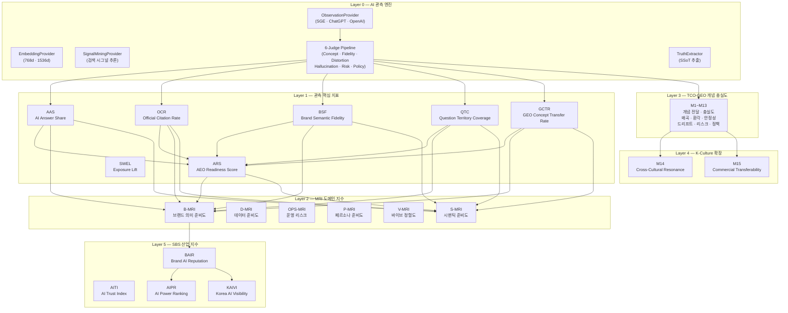
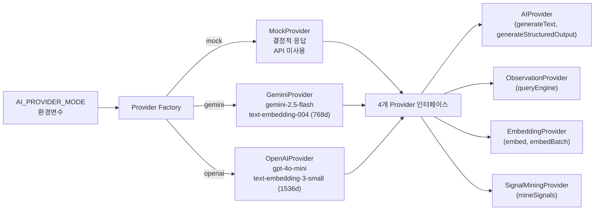
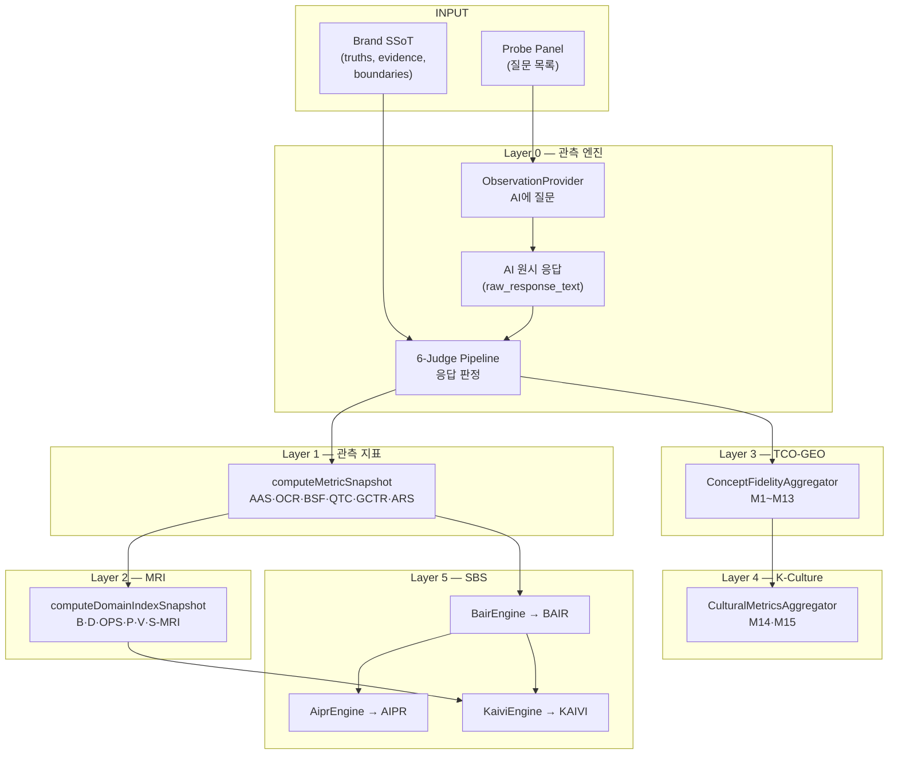

# BSW-OS 지표 체계 매뉴얼 Vol.1 — 아키텍처 총론

> **Version:** v1.0  
> **System:** Brand Semantic Website OS (BSW-OS)  
> **대상 독자:** 전체 (전략가 · 운영자 · 개발자)  
> **Last Updated:** 2026-06-01

---

## 목차

1. [설계 철학](#1-설계-철학)
2. [6-Layer 아키텍처](#2-6-layer-아키텍처)
3. [이론적 기반](#3-이론적-기반)
4. [데이터 흐름도](#4-데이터-흐름도)
5. [용어 사전](#5-용어-사전)
6. [모듈 인벤토리](#6-모듈-인벤토리)

---

## 1. 설계 철학

BSW-OS 지표 체계는 다음 6가지 원칙 위에 설계되었습니다.

| # | 원칙 | 핵심 질문 | 설명 |
|:---:|:---|:---|:---|
| 1 | **Distribution-First** | "한 번의 관측은 신뢰할 수 있는가?" | LLM 응답을 단일 포인트가 아닌 **확률 분포**로 취급합니다. 반복 관측을 통해 분산(M12), 합의(M11), 드리프트(M8)를 측정합니다. |
| 2 | **Concept-Centric** | "키워드 매칭만으로 충분한가?" | 키워드 존재 여부가 아닌 **개념 단위(Concept Entity)** 추출 및 의미 정합성을 평가합니다. AAS(키워드) → M1(개념)으로 진화. |
| 3 | **Evidence-Bound** | "AI의 주장에 근거가 있는가?" | 모든 주장은 Brand SSoT의 **검증된 근거(Evidence)**와 바인딩 여부를 추적합니다. M2(Citation-Backed Rate)로 측정. |
| 4 | **Safety-First** | "AI가 브랜드를 위험에 빠뜨리지는 않는가?" | 왜곡(M4), 환각(M6), 바닥 리스크(M9)를 별도 차원으로 분리하여 측정합니다. |
| 5 | **Proxy-Transparent** | "이 수치를 그대로 믿어도 되는가?" | 모든 관측 메트릭에 **프록시 경고문(Proxy Caveat)**을 의무 부착합니다. AI 관측은 실제 사용자 경험의 근사치임을 명시합니다. |
| 6 | **B-MRI ↔ D-MRI 분리** | "외부 관측과 내부 준비도를 합산해도 되는가?" | **절대 합산 금지.** B-MRI는 "AI가 보는 우리"(외부 관측), D-MRI는 "우리가 준비한 것"(내부 데이터 완성도). 둘의 갭이 곧 개선 기회입니다. |

---

## 2. 6-Layer 아키텍처

### 2.1 전체 구조



### 2.2 Layer별 역할 요약

| Layer | 이름 | 역할 | 지표 수 | AI 의존 |
|:---:|:---|:---|:---:|:---:|
| **0** | AI 관측 엔진 | AI에 질문하고, 응답을 수집하고, 판정(Judge)하는 인프라 | — | ✅ |
| **1** | 관측 핵심 지표 | AI 응답에서 추출한 1차 관측값 (빠른 스냅샷) | 7개 | 일부 |
| **2** | MRI 도메인 지수 | 6개 차원의 준비도/건강도 종합 인덱스 | 6개 | 일부 |
| **3** | TCO-GEO 충실도 | 개념 단위 정밀 측정 (6-Judge 기반) | 13개 | ✅ |
| **4** | K-Culture 확장 | 한국 문화 콘텐츠 AI 전달의 문화적 충실도 | 2개 | ✅ |
| **5** | SBS 산업 지수 | 산업/경쟁사 비교를 위한 복합 지수 | 4개 | ❌ |

### 2.3 Layer 0 상세 — 6-Judge Pipeline

```
raw_response_text (AI 원시 응답)
       │
       ▼
┌──────────────────┐
│ Judge 1: Concept │ ───► concept_extraction_results
│   Extractor      │       ├── extracted_concepts[]
│                  │       └── extracted_relations[]
└──────┬───────────┘
       │ (upstream concepts)
       ├──────────────┬───────────────┐
       ▼              ▼               ▼
┌────────────┐ ┌─────────────┐ ┌───────────────┐
│ Judge 2:   │ │ Judge 3:    │ │ Judge 4:      │
│ Fidelity   │ │ Distortion  │ │ Hallucination │
│   → M3     │ │   → M4      │ │   → M6        │
└────────────┘ └─────────────┘ └───────────────┘

       │ (raw_response_text 직접)
       ├──────────────┐
       ▼              ▼
┌────────────┐ ┌────────────┐
│ Judge 5:   │ │ Judge 6:   │
│ Risk → M9  │ │ Policy→M10 │
└────────────┘ └────────────┘
```

| Judge | 역할 | 입력 | 핵심 출력 | 연관 메트릭 |
|:---:|:---|:---|:---|:---|
| 1 | **ConceptExtractor** | 응답 + SSoT | concepts[], relations[] | M1, M2, M5, M7, M8 |
| 2 | **Fidelity** | concepts + SSoT | brand_concept_fidelity | M3 |
| 3 | **Distortion** | concepts + SSoT | distortion_rate, distortions[] | M4 |
| 4 | **Hallucination** | concepts + SSoT | hallucination_rate, claims[] | M6 |
| 5 | **Risk** | 응답 + SSoT | risk_score | M9 |
| 6 | **Policy** | 응답 + SSoT | policy_alignment, violations[] | M10 |

### 2.4 AI Provider 아키텍처



**모드별 비교:**

| 특성 | `mock` | `gemini` | `openai` |
|:---|:---|:---|:---|
| API 호출 | ❌ 없음 | ✅ Google AI | ✅ OpenAI |
| 비용 | 무료 | 종량제 | 종량제 |
| 응답 특성 | 결정적 | 확률적 | 확률적 |
| 텍스트 모델 | — | gemini-2.5-flash | gpt-4o-mini |
| 임베딩 모델 | — (768d 더미) | text-embedding-004 (768d) | text-embedding-3-small (1536d) |
| 용도 | 로컬 테스트 | SGE 시뮬레이션 | ChatGPT 실측 |

---

## 3. 이론적 기반

### 3.1 Semantic Attractor Dynamics (의미 끌개 역학)

브랜드의 의미를 **동역학 시스템**으로 모델링합니다.

```
                    ┌─── Resonance Zone ───┐
                    │                       │
     Boundary ◄─── │   Brand Attractor    │ ───► Drift Direction
     (Suppression)  │   (Core Concepts)    │     (M8 measures)
                    │                       │
                    └─── Cancellation ─────┘
                          (Distortion)
```

| 개념 | 정의 | 측정 메트릭 |
|:---|:---|:---|
| **끌개 (Attractor)** | AI 응답에서 반복적으로 재현되는 핵심 개념 구조 | M7 (Attractor Stability) |
| **공명 (Resonance)** | SSoT 개념이 AI 응답에서 강화되는 현상 | M1, M3 (높을수록 공명) |
| **소멸 (Cancellation)** | 개념이 변형·약화·대체되는 현상 | M4 (Distortion Rate) |
| **경계 (Boundary)** | 금지 표현이 억제되는 정도 | M10 (Policy Alignment) |
| **드리프트 (Drift)** | Baseline→Intervention 간 개념 분포 변화 | M8 (Drift Score) |
| **상태 전이** | 등급 변화 (C→B→A) | M13 등급 추이 |

### 3.2 Tensor Concept Ontology (TCO)

단어와 주장을 **정규화된 개념 체계**로 변환합니다.

| TCO 요소 | BSW-OS 구현체 | 측정 연관 메트릭 |
|:---|:---|:---|
| Concept Entity | `brand_strategic_truths`, `brand_operational_truths` | M1, M3, M5 |
| Evidence Binding | `brand_truth_evidence` → `verification_status` | M2 |
| Forbidden Expression | `boundary_rules` | M4, M10 |
| Relation Operator | `extracted_relations` (Judge 1 출력) | M7, M11 |
| Action Policy | `policy_judgments` (Judge 6 출력) | M10 |

### 3.3 Probabilistic Eval Harness (확률적 평가 장치)

LLM 출력을 분포로 취급하며, **반복 실행** 기반 통계를 수집합니다.

| 통계량 | 수식 | 메트릭 | 의미 |
|:---|:---|:---|:---|
| **Recall Consistency** | `1 − 4 × avg(p(1−p))` | M7의 40% | 개념 출현 일관성 |
| **Rank Stability** | `avg(1/(1+rank_var))` | M7의 20% | 순위 안정성 |
| **Consensus** | `avg(Jaccard(run_i, run_j))` | M11 | 실행 간 개념 집합 유사도 |
| **Variance** | `Σ(p_c × (1−p_c))` | M12 | 개별 개념 불확실성 총합 |
| **Drift** | `1 − cosine_sim(A, B)` | M8 | 개입 전후 분포 변화 |

---

## 4. 데이터 흐름도

### 4.1 전체 파이프라인 (Layer 0 → Layer 5)



### 4.2 Layer별 입력/출력

| Layer | 입력 | 처리 | 출력 | DB 테이블 |
|:---|:---|:---|:---|:---|
| **0** | Probe 질문 + SSoT | AI 호출 + Judge 판정 | 판정 결과 6종 | `probe_runs`, `*_judgments` |
| **1** | Judge 판정 결과 | 집계 (평균, 비율) | AAS~ARS 7개 | `metric_snapshots` |
| **2** | L1 지표 + SSoT 데이터 | 가중 합산 + DB 쿼리 | 6개 MRI | `domain_index_snapshots` |
| **3** | Judge 상세 결과 | 개념 단위 집계 | M1~M13 | `concept_fidelity_snapshots` |
| **4** | M1~M10 | 가중 조합 | M14, M15 | `concept_fidelity_snapshots` |
| **5** | L1 지표 + L2 MRI | 복합 수식 | BAIR, AITI, AIPR, KAIVI | 인메모리 |

---

## 5. 용어 사전

### 5.1 Layer 1 지표

| 약어 | 영문명 | 한국어명 | 범위 |
|:---|:---|:---|:---:|
| **AAS** | AI Answer Share | AI 응답 점유율 | 0~100% |
| **OCR** | Official Citation Rate | 공식 인용률 | 0~100% |
| **BSF** | Brand Semantic Fidelity | 브랜드 의미 충실도 | 0~100 |
| **QTC** | Question Territory Coverage | 질문 영역 커버리지 | 0~100% |
| **GCTR** | GEO Concept Transfer Rate | GEO 개념 전달률 | 0~100% |
| **ARS** | AEO Readiness Score | AEO 준비 점수 | 0~100 |
| **SWEL** | Semantic Website Exposure Lift | 시맨틱 웹사이트 노출 증가율 | 0~∞ |

### 5.2 Layer 2 MRI 지수

| 약어 | 영문명 | 한국어명 | 측정 대상 |
|:---|:---|:---|:---|
| **B-MRI** | Brand Meaning Readiness Index | 브랜드 의미 준비도 | 외부 관측 (AI가 보는 브랜드) |
| **D-MRI** | Data Meaning Readiness Index | 데이터 의미 준비도 | 내부 완성도 (SSoT/KG/Evidence) |
| **OPS-MRI** | Operations MRI | 운영 의미 준비도 | Truth Delta + Vibe 진단 |
| **P-MRI** | Persona MRI | 페르소나 의미 준비도 | 페르소나 Eval 완료율 |
| **V-MRI** | Vibe MRI | 바이브 의미 준비도 | Vibe Alignment 부족분 |
| **S-MRI** | Semantic MRI | 시맨틱 의미 준비도 | ARS+BSF+QTC 종합 |

### 5.3 Layer 3 TCO-GEO (M1~M13)

| 코드 | 영문명 | 한국어명 | 범위 | 방향 |
|:---|:---|:---|:---:|:---:|
| **M1** | Concept Transfer Rate | 개념 전달률 | 0~1 | ↑ 좋음 |
| **M2** | Citation-Backed Rate | 인용 검증률 | 0~1 | ↑ 좋음 |
| **M3** | Brand Concept Fidelity | 브랜드 개념 충실도 | 0~1 | ↑ 좋음 |
| **M4** | Concept Distortion Rate | 개념 왜곡률 | 0~1 | ↓ 좋음 |
| **M5** | Missing Concept Gap Count | 누락 개념 갭 수 | 0~N | ↓ 좋음 |
| **M6** | Hallucinated Concept Rate | 환각 개념률 | 0~1 | ↓ 좋음 |
| **M7** | Attractor Stability | 끌개 안정성 | 0~1 | ↑ 좋음 |
| **M8** | Drift Score | 드리프트 점수 | 0~1 | 방향 중요 |
| **M9** | Floor Risk | 바닥 리스크 | 0~1 | ↓ 좋음 |
| **M10** | Policy Alignment | 정책 정합성 | 0~1 | ↑ 좋음 |
| **M11** | Consensus Score | 합의 점수 | 0~1 | ↑ 좋음 |
| **M12** | Variance Score | 분산 점수 | 0~∞ | ↓ 좋음 |
| **M13** | AEO/GEO Readiness | AEO/GEO 준비도 | 0~1 | ↑ 좋음 |

### 5.4 Layer 4 K-Culture

| 코드 | 영문명 | 한국어명 | 수식 |
|:---|:---|:---|:---|
| **M14** | Cross-Cultural Resonance | 문화간 공명도 | `0.4×M3 + 0.3×(1−M4) + 0.3×(1−M9)` |
| **M15** | Commercial Transferability | 상업적 전환 가능성 | `0.5×M1 + 0.3×M2 + 0.2×M10` |

### 5.5 Layer 5 산업 지수

| 약어 | 영문명 | 한국어명 | 수식 |
|:---|:---|:---|:---|
| **BAIR** | Brand AI Reputation Index | 브랜드 AI 평판 지수 | `BSF × AAS × (1+OCR) × SWEL` |
| **AITI** | AI Trust Index | AI 신뢰 지수 | `EvidenceMatch×100 − UnsafeCount×5` |
| **AIPR** | AI Power Ranking | AI 파워 랭킹 | BAIR 내림차순 순위 |
| **KAIVI** | Korea AI Visibility Index | 한국 AI 가시성 지수 | `avg(TopBAIR) × avg(MRI)` |

### 5.6 시스템 용어

| 용어 | 정의 |
|:---|:---|
| **SSoT** | Single Source of Truth — 브랜드 핵심 진실의 단일 정본. `brand_strategic_truths` + `brand_operational_truths` |
| **TCO** | Tensor Concept Ontology — 개념을 엔티티·관계·근거·정책으로 정규화하는 온톨로지 |
| **GEO** | Generative Engine Optimization — AI 생성 엔진에 대한 최적화 |
| **AEO** | Answer Engine Optimization — 답변 엔진에 대한 최적화 |
| **Probe** | AI에 보내는 탐사 질문 |
| **Panel** | 관련 Probe를 묶은 질문 세트 |
| **Judge** | AI 응답을 평가하는 LLM 판정 파이프라인 |
| **Attractor** | 반복 관측 시 안정적으로 재현되는 개념 구조 (의미 끌개) |
| **Drift** | Baseline→Intervention 간 개념 분포의 방향성 변화 |
| **Floor Risk** | 상위 10% 최악 응답의 평균 리스크 (Worst-case 안전성) |
| **Answer Card** | 브랜드 SSoT를 AI가 참조할 수 있도록 구조화한 콘텐츠 |
| **Vibe Spec** | 브랜드 톤·스타일·CTA 형식 가이드라인 |
| **Fix-It RCA** | Root Cause Analysis — 문제 발견 시 근본 원인 분석 및 패치 |

---

## 6. 모듈 인벤토리

### 6.1 분류 요약

전체 52개 모듈을 AI Provider 의존성 기준으로 분류합니다.

```
전환 전: 19 LIVE_READY + 8 GEMINI_ONLY + 23 PURE_MATH + 2 MOCK_ONLY
전환 후: 27 LIVE_READY + 0 GEMINI_ONLY + 23 PURE_MATH + 2 MOCK_ONLY
```

| 분류 | 설명 | 모듈 수 | 상태 |
|:---|:---|:---:|:---:|
| **LIVE_READY** | mock/gemini/openai 3모드 모두 지원 | 27 | ✅ |
| **PURE_MATH** | AI 호출 없이 수식만으로 동작 | 23 | ✅ |
| **MOCK_ONLY** | 외부 API가 필요하나 현재 mock만 지원 | 2 | ⚠️ |

### 6.2 LIVE_READY 모듈 (27개)

| # | 모듈 | 파일 경로 | 역할 |
|:---:|:---|:---|:---|
| 1 | AIProvider (Core) | `lib/ai/ai-provider.ts` | 텍스트 생성, 구조적 출력 |
| 2 | ObservationProvider | `lib/ai/observation-provider.ts` | AI 엔진 질의 |
| 3 | EmbeddingProvider | `lib/ai/embedding-provider.ts` | 텍스트 임베딩 |
| 4 | SignalMiningProvider | `lib/ai/signal-mining-provider.ts` | 검색 시그널 추론 |
| 5 | ObservatoryAgents | `lib/ai/observatory_agents.ts` | 관측 에이전트 오케스트레이션 |
| 6 | RepeatedRunner | `lib/experiments/repeated-runner.ts` | 반복 관측 실행기 |
| 7 | K-Culture Eval | `app/actions/kculture-eval.ts` | K-Culture 평가 |
| 8 | JudgePipeline | `lib/judges/judge-pipeline.ts` | 6-Judge 오케스트레이션 |
| 9~14 | Judge 1~6 | `lib/judges/*.ts` | 개별 Judge |
| 15~19 | Observatory Providers | `lib/observatory/providers/*.ts` | 차세대 관측 Provider |
| 20~22 | Crawlers | `lib/observatory/crawlers/*.ts` | 듀얼 크롤러 |
| 23~27 | Judgment System | `lib/observatory/judgment/*.ts` | 차세대 Judge 시스템 |

### 6.3 PURE_MATH 모듈 (23개)

| # | 모듈 | 파일 경로 | 수식/역할 |
|:---:|:---|:---|:---|
| 1 | B-MRI Calculator | `lib/metrics/b-mri.ts` | 가중 합산 수식 |
| 2 | D-MRI Calculator | `lib/metrics/d-mri.ts` | 12개 서브-컴포넌트 DB 쿼리 |
| 3 | ConceptFidelityAggregator | `lib/metrics/concept-fidelity-aggregator.ts` | M1~M13 집계 |
| 4 | CulturalMetricsAggregator | `lib/metrics/cultural-metrics-aggregator.ts` | M14, M15 계산 |
| 5 | AttractorStabilityCalculator | `lib/metrics/attractor-stability-calculator.ts` | M7, M11, M12 통계 |
| 6 | DriftCalculator | `lib/metrics/drift-calculator.ts` | M8 Cosine Distance |
| 7 | BairEngine | `lib/sbs-index/bair.ts` | BAIR, AITI 복합 수식 |
| 8 | AiprEngine | `lib/sbs-index/aipr.ts` | 경쟁사 순위 정렬 |
| 9 | KaiviEngine | `lib/sbs-index/kaivi.ts` | 산업 평균 × MRI |
| 10~14 | computeMetricSnapshot 내부 | `app/actions/observatory.ts` | AAS~ARS 집계 로직 |
| 15~18 | computeDomainIndexSnapshot 내부 | `app/actions/observatory.ts` | MRI 산출 로직 |
| 19~23 | M13 준비도/등급 산출 | `lib/metrics/` | 가중 복합 점수 |

### 6.4 MOCK_ONLY 모듈 (2개)

| # | 모듈 | 파일 경로 | 미전환 사유 |
|:---:|:---|:---|:---|
| 1 | TruthExtractor | `lib/ai/truth-extractor.ts` | URL 크롤링 → AI 추출 (웹 크롤링 의존) |
| 2 | SSoTCrawler | `lib/observatory/crawlers/ssot-crawler.ts` | 실시간 SSoT 동기화 (외부 시스템 연동) |

---

### 메트릭 진화 관계 (Legacy → TCO-GEO)

| Legacy 메트릭 | TCO-GEO 진화 | 진화 내용 |
|:---|:---|:---|
| AAS (키워드 매칭) | → **M1** (개념 전달률) | 키워드 → 개념 단위, 정밀도·재현율 기반 |
| OCR (URL 인용) | → **M2** (인용 검증률) | 응답 단위 → 개념 단위, Evidence Binding |
| BSF (스코어 평균) | → **M3** (개념 충실도) | 수동 스코어 → LLM Judge 자동 평가 |
| GCTR (불리언 전달) | → **M1 + M5** 조합 | 개별 개념 재현율 + 갭 분석 |
| — (신규) | **M4** (왜곡률) | 왜곡 유형별 분류 및 심각도 평가 |
| — (신규) | **M6** (환각률) | 미검증 주장 탐지 |
| — (신규) | **M7~M12** (안정성 계열) | 반복 관측 기반 통계적 안정성 측정 |
| ARS (가중 복합) | → **M13** (준비도 점수) | 6개 차원 → 8개 차원, 안전성·정책 포함 |

---

> **관련 문서:**
> - [Vol.2 — 지표 레퍼런스 사전](./metrics-manual-reference.md)
> - [Vol.3 — 측정 실행 매뉴얼](./metrics-manual-operations.md)
> - [Vol.4 — 결과 해석 및 활용 가이드](./metrics-manual-interpretation.md)
> - [Vol.5 — API 및 함수 레퍼런스](./metrics-manual-api.md)
