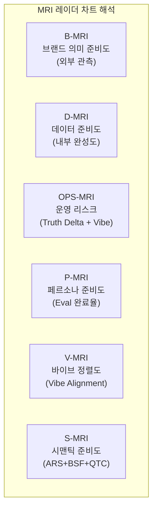
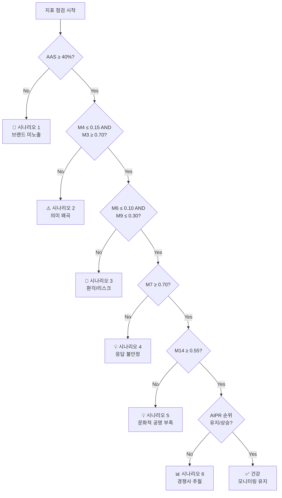
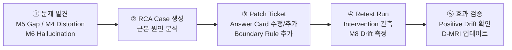

# BSW-OS 지표 체계 매뉴얼 Vol.4 — 결과 해석 및 활용 가이드

> **Version:** v1.0  
> **System:** Brand Semantic Website OS (BSW-OS)  
> **대상 독자:** 전략가 · 경영진 · 마케터  
> **Last Updated:** 2026-06-01

---

## 목차

1. [대시보드 읽는 법](#1-대시보드-읽는-법)
2. [등급 체계 및 임계값](#2-등급-체계-및-임계값)
3. [시나리오별 의사결정 프레임워크](#3-시나리오별-의사결정-프레임워크)
4. [벤치마크 기준](#4-벤치마크-기준)
5. [Fix-It RCA 워크플로우](#5-fix-it-rca-워크플로우)
6. [월간 모니터링 체크리스트](#6-월간-모니터링-체크리스트)

---

## 1. 대시보드 읽는 법

### 1.1 Layer 1 — 관측 핵심 지표 대시보드

Layer 1은 AI 검색 관측의 **1차 스냅샷**입니다. 6개 지표를 한 눈에 파악하세요.

```
┌──────────────────────────────────────────────────────────────┐
│                Layer 1 — 관측 핵심 지표                       │
├───────────┬──────────┬──────────┬──────────┬──────────┬──────┤
│  AAS      │  OCR     │  BSF     │  QTC     │  GCTR    │  ARS │
│  78%      │  42%     │  85      │  65%     │  72%     │  71  │
│  ■■■■■■░░ │ ■■■■░░░░ │ ■■■■■■■░ │ ■■■■■░░░ │ ■■■■■■░░ │ ■■■■│
│  양호     │  미흡    │  우수    │  양호    │  양호    │  양호│
└───────────┴──────────┴──────────┴──────────┴──────────┴──────┘
```

**핵심 리딩 순서:**

| 순서 | 지표 | 질문 | 판단 기준 |
|:---:|:---|:---|:---|
| ① | **AAS** | 브랜드가 AI에 나타나는가? | ≥60% → OK, <40% → 긴급 |
| ② | **BSF** | 의미가 정확한가? | ≥80 → OK, <60 → 왜곡 위험 |
| ③ | **OCR** | 공식 소스를 인용하는가? | ≥50% → OK, <30% → 인용 부족 |
| ④ | **GCTR** | 핵심 개념이 전달되는가? | ≥70% → OK, <50% → 개념 누락 |
| ⑤ | **QTC** | 전략 영역을 점유하는가? | ≥60% → OK, <40% → 영역 이탈 |
| ⑥ | **ARS** | 종합 준비도는? | ≥70 → 양호, <55 → 개선 필요 |

> [!TIP]
> **AAS는 높은데 BSF가 낮다면?** → 브랜드가 자주 언급되지만 의미가 왜곡되고 있다는 의미입니다. M4(왜곡률) 확인이 필요합니다.

---

### 1.2 Layer 2 — MRI 레이더 차트

6개 MRI 서브-인덱스는 **레이더 차트**로 시각화할 때 가장 효과적입니다. 각 축의 의미:



| MRI | 측정 대상 | 핵심 질문 | 데이터 원천 |
|:---|:---|:---|:---|
| **B-MRI** | 외부에서 본 브랜드 의미 | AI가 우리를 어떻게 보는가? | AAS, OCR, BSF, QTC, GCTR, ARS |
| **D-MRI** | 내부 데이터 완성도 | SSoT/KG/Evidence가 충분한가? | 12개 서브-컴포넌트 |
| **OPS-MRI** | 운영 리스크 | Truth 변경과 Vibe 진단 이슈는? | truth_delta + vibe_diagnoses |
| **P-MRI** | 페르소나 커버리지 | 타겟 페르소나 평가가 완료되었나? | persona_eval_runs |
| **V-MRI** | 바이브 정렬도 | 브랜드 톤이 일관적인가? | vibe_alignment_snapshots |
| **S-MRI** | 시맨틱 종합 | 시맨틱 최적화 전반의 건강도? | ARS, BSF, QTC |

> [!IMPORTANT]
> **B-MRI와 D-MRI는 절대 합산하지 마세요.** B-MRI는 "AI가 보는 우리"(외부), D-MRI는 "우리가 준비한 것"(내부)입니다. 둘의 **갭**이 곧 개선 기회입니다.

**갭 해석 프레임워크:**

| B-MRI | D-MRI | 해석 | 우선 조치 |
|:---:|:---:|:---|:---|
| 높음 | 높음 | ✅ 이상적 — 잘 준비하고, 잘 전달됨 | 모니터링 유지 |
| 높음 | 낮음 | ⚠️ 취약 — 현재는 좋지만 기반이 약함 | D-MRI 강화 (SSoT/KG 보강) |
| 낮음 | 높음 | 💡 기회 — 잘 준비했지만 아직 미전달 | Answer Card 배포, 관측 강화 |
| 낮음 | 낮음 | 🚨 위기 — 준비도 낮고 전달도 안 됨 | SSoT 재구축부터 시작 |

---

### 1.3 Layer 3 — TCO-GEO M1~M13 해석

M1~M13은 **3개 그룹**으로 나누어 읽으면 효율적입니다:

| 그룹 | 지표 | 의미 | 핵심 질문 |
|:---|:---|:---|:---|
| **전달 품질** | M1, M2, M3 | 개념이 정확하게 전달되는가? | "AI가 우리 이야기를 제대로 하는가?" |
| **안전성** | M4, M5, M6, M9, M10 | 위험 요소가 있는가? | "AI가 우리를 위험하게 만들지는 않는가?" |
| **안정성** | M7, M8, M11, M12 | 시간이 지나도 일관적인가? | "AI가 매번 같은 이야기를 하는가?" |
| **종합** | M13 | 최종 등급 | "GEO/AEO 준비가 되었는가?" |

**위험 신호 우선순위:**

```
🚨 CRITICAL (즉시 대응):  M6 > 0.10 또는 M9 > 0.30
⚠️ WARNING (이번 주 대응): M4 > 0.15 또는 M7 < 0.70
💡 IMPROVE (이번 달 대응):  M1 < 0.70 또는 M3 < 0.70
📊 MONITOR (지속 관찰):    M8 negative drift
```

---

### 1.4 Layer 5 — SBS 산업 지수

| 지수 | 보는 관점 | 핵심 질문 |
|:---|:---|:---|
| **BAIR** | 브랜드 개별 평판 | "AI 검색에서 우리 평판은?" |
| **AITI** | AI 신뢰도 | "AI가 우리를 신뢰 소스로 인정하는가?" |
| **AIPR** | 경쟁사 비교 순위 | "동종 업계에서 몇 위인가?" |
| **KAIVI** | 국가 AI 가시성 | "한국 산업 전체에서의 위치는?" |

---

## 2. 등급 체계 및 임계값

### 2.1 TCO-GEO 등급 체계 (M3/M13)

| 등급 | 범위 | 해석 | 대응 |
|:---:|:---:|:---|:---|
| **A** | ≥ 0.85 | 🟢 **우수** — AI 검색 답변에서 전략적 우위 확보 | 모니터링 + 경쟁사 벤치마킹 |
| **B** | 0.70 ~ 0.84 | 🔵 **양호** — 핵심 개념의 안정적 전달 | 부분 최적화 (M5 Gap 해소) |
| **C** | 0.55 ~ 0.69 | 🟡 **개선 필요** — 주요 갭과 리스크 존재 | Answer Card 보강 + Judge 리뷰 |
| **D** | 0.40 ~ 0.54 | 🟠 **미흡** — 구조적 개선 없이 효과 기대 어려움 | SSoT 재점검 + Vibe Spec 재설정 |
| **F** | < 0.40 | 🔴 **실패** — Brand SSoT 재구축 필요 | 전면 재설계 |

### 2.2 관측 핵심 지표 등급

| 등급 | AAS / OCR / BSF / QTC / GCTR (%) | 해석 |
|:---:|:---:|:---|
| 🟢 우수 | ≥ 80 | 목표 달성 — 유지 관리 |
| 🔵 양호 | 60 ~ 79 | 순조로운 진행 — 부분 최적화 |
| 🟡 미흡 | 40 ~ 59 | 관심 필요 — 구조적 개선 검토 |
| 🔴 위험 | < 40 | 즉시 대응 — 근본 원인 분석 필요 |

### 2.3 안전성 지표 임계값

| 지표 | 🟢 안전 | 🟡 주의 | 🔴 위험 | YMYL 특별 기준 |
|:---|:---:|:---:|:---:|:---|
| **M4** (왜곡률) | ≤ 0.05 | 0.05 ~ 0.15 | > 0.15 | > 0.10 → 경고 |
| **M6** (환각률) | ≤ 0.03 | 0.03 ~ 0.10 | > 0.10 | > 0.05 → 긴급 대응 |
| **M9** (바닥 리스크) | ≤ 0.10 | 0.10 ~ 0.30 | > 0.30 | > 0.15 → 긴급 대응 |
| **M10** (정책 정합성) | ≥ 0.90 | 0.75 ~ 0.89 | < 0.75 | < 0.85 → 경고 |

> [!CAUTION]
> **YMYL(Your Money Your Life) 도메인** — 의료, 법률, 금융 분야는 일반 기준보다 **엄격한 임계값**이 적용됩니다. 환각률 5% 초과 시 즉각 대응이 필요합니다.

### 2.4 안정성 지표 임계값

| 지표 | 🟢 안정 | 🟡 보통 | 🔴 불안정 |
|:---|:---:|:---:|:---:|
| **M7** (끌개 안정성) | ≥ 0.90 | 0.70 ~ 0.89 | < 0.70 |
| **M11** (합의 점수) | ≥ 0.85 | 0.65 ~ 0.84 | < 0.65 |
| **M12** (분산 점수) | ≤ 0.10 | 0.10 ~ 0.30 | > 0.30 |

### 2.5 B-MRI 등급

| 등급 | 점수 | 해석 |
|:---:|:---:|:---|
| 🏆 프리미엄 | ≥ 90 | AI 검색 영역에서 강력한 브랜드 의미 구축 |
| 🟢 양호 | 75 ~ 89 | 안정적 브랜드 의미 전달 |
| 🟡 보통 | 60 ~ 74 | 부분적 개선 필요 |
| 🔴 위험 | < 60 | 구조적 브랜드 의미 재건 필요 |

---

## 3. 시나리오별 의사결정 프레임워크

### 의사결정 흐름도



---

### 시나리오 1: 브랜드가 AI에서 전혀 노출되지 않는 경우

**진단 지표:**
- AAS < 20%
- M1 (Concept Transfer Rate) < 0.30
- GCTR < 30%

**근본 원인:**
- Brand SSoT가 미구축이거나 빈약함
- Answer Card / Semantic Page가 배포되지 않음
- 도메인 권위도(Domain Authority)가 낮음

**조치 로드맵:**

| 단계 | 기간 | 조치 | 기대 효과 |
|:---:|:---:|:---|:---|
| 1 | 1~2주 | Brand SSoT 구축 (핵심 개념 20개 이상 정의) | D-MRI 30+ → 60+ |
| 2 | 2~3주 | Answer Card 10~20장 배포 | AAS 20% → 50%+ |
| 3 | 3~4주 | Probe Panel 재관측 + M8 Drift 측정 | M8 positive drift 확인 |
| 4 | 지속 | 주간 모니터링 | AAS 60%+ 안정화 |

---

### 시나리오 2: 노출되지만 의미가 왜곡된 경우

**진단 지표:**
- AAS > 60% (노출은 됨)
- M4 (Distortion Rate) > 0.15
- M3 (Brand Concept Fidelity) < 0.70

**근본 원인:**
- SSoT 정의가 모호하여 AI가 재해석
- 경쟁사 개념과 혼동 (`competitor_merge` 왜곡)
- Vibe Spec이 브랜드 톤과 불일치

**조치 로드맵:**

| 단계 | 기간 | 조치 | 기대 효과 |
|:---:|:---:|:---|:---|
| 1 | 즉시 | M4 distortion_type 분류 분석 | 왜곡 원인 식별 |
| 2 | 1주 | SSoT 정의 강화 (모호한 개념 재정의) | M3 0.70 → 0.80+ |
| 3 | 1~2주 | Boundary Rule 추가 (금지 표현 정의) | M4 0.15 → 0.05 이하 |
| 4 | 2주 | Intervention 조건 재관측 | M8 positive drift |

**왜곡 유형별 대응:**

| 왜곡 유형 | 대응 방법 |
|:---|:---|
| `exaggeration` (과장) | SSoT에 정확한 수치/범위 명시 |
| `minimization` (축소) | 핵심 차별점 강조 Answer Card 추가 |
| `misclassification` (오분류) | 카테고리 정의 명확화 |
| `competitor_merge` (경쟁사 혼합) | 독점 용어/성분 명칭 강화 |

---

### 시나리오 3: 환각 콘텐츠가 생성된 경우

**진단 지표:**
- M6 (Hallucination Rate) > 0.10
- M9 (Floor Risk) > 0.30

**긴급도: 🚨 즉시 대응**

**조치 로드맵:**

| 단계 | 기간 | 조치 | 기대 효과 |
|:---:|:---:|:---|:---|
| 1 | 즉시 | `hallucination_judgments.claims[]` 분석 | 환각 주장 목록 확보 |
| 2 | 1~3일 | Boundary Rule 추가 (환각 주장 명시적 금지) | M10 policy 강화 |
| 3 | 1주 | 관련 Evidence 보강 (`brand_truth_evidence` 추가) | M2 Citation Rate 상승 |
| 4 | 1주 | Fix-It RCA Case 생성 + Retest | M6 0.10 → 0.03 이하 |

> [!WARNING]
> **YMYL 도메인에서 M6 > 0.05**는 법적 리스크를 수반합니다. "FDA 승인", "의사 추천" 등 미검증 환각 주장은 즉시 대응하세요.

---

### 시나리오 4: 응답 안정성이 낮은 경우

**진단 지표:**
- M7 (Attractor Stability) < 0.70
- M12 (Variance Score) > 0.30

**근본 원인:**
- LLM의 확률적 특성으로 인한 개념 출현/소멸 변동
- 핵심 개념의 Attractor 강도가 약함
- 관측 횟수가 부족하여 통계적 신뢰도가 낮음

**조치 로드맵:**

| 단계 | 기간 | 조치 | 기대 효과 |
|:---:|:---:|:---|:---|
| 1 | 즉시 | 반복 관측 횟수 5 → 10회로 증가 | 통계적 신뢰도 확보 |
| 2 | 1주 | p ≈ 0.5인 불안정 개념 식별 (M12 분해) | 타겟 개념 목록 |
| 3 | 1~2주 | 불안정 개념에 대한 Answer Card 보강 | M7 0.70 → 0.85+ |
| 4 | 2주 | 재관측으로 안정성 확인 | M11 consensus 0.85+ |

---

### 시나리오 5: K-Culture 문화적 공명 부족

**진단 지표:**
- M14 (Cross-Cultural Resonance) < 0.55

**근본 원인:**
- AI가 한국 문화 콘텐츠를 스테레오타입적으로 표현
- Cultural SSoT에 과학적 근거가 부족
- 신비주의/오리엔탈리즘 표현이 억제되지 않음

**조치 로드맵:**

| 단계 | 기간 | 조치 | 기대 효과 |
|:---:|:---:|:---|:---|
| 1 | 1주 | K-Culture baseline 분석 (스테레오타입 유형 분류) | 문제 패턴 식별 |
| 2 | 1~2주 | Cultural SSoT 강화 (과학적 근거 + 발효 영양학) | M3 Fidelity 향상 |
| 3 | 2주 | Boundary Rule 추가 ("신비한", "이국적" 등 금지) | M4 Distortion 감소 |
| 4 | 2~3주 | Intervention 조건 재실행 + M14 재측정 | M14 0.55 → 0.70+ |

---

### 시나리오 6: 경쟁사 대비 순위 하락

**진단 지표:**
- AIPR 순위 하락
- 자사 BAIR < 경쟁사 BAIR

**조치 로드맵:**

| 단계 | 기간 | 조치 | 기대 효과 |
|:---:|:---:|:---|:---|
| 1 | 즉시 | AIPR 상세 분석 (경쟁사별 BAIR 분해) | 갭 영역 식별 |
| 2 | 1주 | B-MRI Competitive Position Score 분석 | 차별화 기회 |
| 3 | 1~2주 | 차별화 개념 Answer Card 집중 배포 | AAS/BSF 개선 |
| 4 | 2~3주 | SWEL (Exposure Lift) 개선 캠페인 | BAIR 상승 |

---

## 4. 벤치마크 기준

### 4.1 산업별 평균 기준값 (참고)

| 산업 | ARS 평균 | BAIR 평균 | M3 평균 | M13 평균 |
|:---|:---:|:---:|:---:|:---:|
| 뷰티/화장품 | 55~65 | 2,000~4,000 | 0.65~0.75 | 0.55~0.70 |
| F&B/식품 | 50~60 | 1,500~3,000 | 0.60~0.70 | 0.50~0.65 |
| 패션/럭셔리 | 45~55 | 1,200~2,500 | 0.55~0.65 | 0.45~0.60 |
| IT/테크 | 60~70 | 3,000~5,000 | 0.70~0.80 | 0.60~0.75 |
| 의료/제약 (YMYL) | 40~50 | 1,000~2,000 | 0.50~0.65 | 0.45~0.60 |

> [!NOTE]
> 위 수치는 참고용 예시입니다. 실제 벤치마크는 BSW-OS 운영 데이터 축적에 따라 정밀화됩니다.

### 4.2 성숙도 단계별 목표

| 단계 | 기간 | B-MRI 목표 | M13 목표 | 핵심 활동 |
|:---|:---:|:---:|:---:|:---|
| **Phase 0** 진입 | 0~1개월 | 40+ | 0.40+ | SSoT 구축 + 첫 관측 |
| **Phase 1** 기반 | 1~3개월 | 60+ | 0.55+ | Answer Card 배포 + Fix-It |
| **Phase 2** 성장 | 3~6개월 | 75+ | 0.70+ | 반복 관측 + 안정성 강화 |
| **Phase 3** 최적화 | 6~12개월 | 85+ | 0.80+ | K-Culture + 경쟁사 벤치마킹 |
| **Phase 4** 리더십 | 12개월+ | 90+ | 0.85+ | AIPR Top 3 유지 |

---

## 5. Fix-It RCA 워크플로우

### 5.1 전체 흐름



### 5.2 단계별 상세

**① 문제 발견**

| 탐지 소스 | 지표 | 데이터 위치 |
|:---|:---|:---|
| 누락 개념 | M5 (`missing_concept_gaps`) | `gap_severity`: critical_gap / moderate_gap |
| 왜곡 | M4 (`distortion_judgments.distortions[]`) | `distortion_type`, `severity` |
| 환각 | M6 (`hallucination_judgments.claims[]`) | `claim_type`, `risk_level` |

**② RCA Case 생성**

각 문제에 대해 다음을 분석합니다:
- **What**: 어떤 개념/주장이 문제인가?
- **Why**: 왜 이런 결과가 나왔는가? (SSoT 부족? 경쟁사 간섭? LLM 특성?)
- **How**: 어떻게 수정할 것인가?

**③ Patch Ticket**

| 문제 유형 | Patch 유형 | 대상 테이블 |
|:---|:---|:---|
| 누락 개념 (M5) | Answer Card 추가 | `brand_operational_truths` |
| 왜곡 (M4) | SSoT 정의 강화 | `brand_strategic_truths` |
| 환각 (M6) | Boundary Rule 추가 | `boundary_rules` |
| 정책 위반 (M10) | Vibe Spec 수정 | `vibe_spec` |

**④ Retest Run**

```
Baseline Run → [Patch 적용] → Intervention Run → M8 Drift 측정
```

- M8 positive drift = 개선 효과 입증
- M8 neutral = 효과 미비, 추가 조치 필요
- M8 negative drift = 패치가 역효과, 롤백 필요

**⑤ 효과 검증**

- D-MRI Fix-It Traceability 컴포넌트 자동 업데이트
- 해결된 Gap/Distortion/Hallucination 항목 마킹
- 월간 리포트에 Fix-It 이력 포함

---

## 6. 월간 모니터링 체크리스트

### 6.1 권장 측정 스케줄

| 빈도 | 활동 | 대상 지표 |
|:---|:---|:---|
| **주간** | Quick Probe Run (10~20문항 핵심 패널) | AAS, BSF, OCR |
| **격주** | Full Panel Observation (전체 패널) | 전체 Layer 1 + Layer 2 |
| **월간** | Repeated Run (5~10회 반복) | M7, M11, M12 |
| **월간** | Competitive Benchmark (AIPR 갱신) | BAIR, AIPR |
| **분기** | K-Culture Evaluation | M14, M15 |
| **분기** | D-MRI 심층 감사 | D-MRI 12개 서브-컴포넌트 |

### 6.2 주요 감시 지표 및 알람 기준

| 지표 | 🟢 정상 | 🟡 경고 (알림) | 🔴 긴급 (즉시 대응) |
|:---|:---:|:---:|:---:|
| AAS | ≥ 60% | 40~59% (주간 리뷰) | < 40% (48시간 내 대응) |
| M3 (BCF) | ≥ 0.75 | 0.60~0.74 (주간 리뷰) | < 0.60 (72시간 내 대응) |
| M4 (왜곡률) | ≤ 0.05 | 0.05~0.15 (주간 리뷰) | > 0.15 (48시간 내 대응) |
| M6 (환각률) | ≤ 0.03 | 0.03~0.10 (주간 리뷰) | > 0.10 (24시간 내 대응) |
| M9 (Floor Risk) | ≤ 0.10 | 0.10~0.30 (주간 리뷰) | > 0.30 (24시간 내 대응) |
| B-MRI | ≥ 75 | 60~74 (월간 리뷰) | < 60 (주간 리뷰) |
| M8 Drift | neutral/positive | — | negative drift (48시간 내 원인 분석) |

### 6.3 월간 리포트 템플릿

```
┌────────────────────────────────────────────────┐
│         BSW-OS 월간 브랜드 AI 건강 리포트        │
│         [브랜드명] — [YYYY년 MM월]               │
├────────────────────────────────────────────────┤
│                                                │
│  📊 종합 등급: [A/B/C/D/F]  (M13: 0.XX)        │
│  🏆 B-MRI: XX / 100                           │
│  📈 BAIR: X,XXX  (전월 대비 ±XX%)              │
│  🏅 AIPR: #X위 (XX개 브랜드 중)                 │
│                                                │
│  ─── Layer 1 핵심 지표 ───                      │
│  AAS: XX%  OCR: XX%  BSF: XX                   │
│  QTC: XX%  GCTR: XX%  ARS: XX                  │
│                                                │
│  ─── 안전성 지표 ───                            │
│  M4 왜곡률: 0.XX  M6 환각률: 0.XX              │
│  M9 Floor Risk: 0.XX  M10 Policy: 0.XX        │
│                                                │
│  ─── 안정성 지표 ───                            │
│  M7 안정성: 0.XX  M11 합의: 0.XX               │
│  M12 분산: 0.XX  M8 Drift: [방향]              │
│                                                │
│  ─── Fix-It 이력 ───                           │
│  해결됨: X건  진행 중: X건  신규: X건           │
│                                                │
│  ─── 이번 달 조치 사항 ───                      │
│  1. [조치 내용]                                 │
│  2. [조치 내용]                                 │
│                                                │
└────────────────────────────────────────────────┘
```

### 6.4 경영진 보고 시 핵심 메시지 프레임

| 지표 | 경영진 언어로 표현 |
|:---|:---|
| AAS 70% | "AI 검색 시 **10번 중 7번** 우리 브랜드가 언급됩니다" |
| BSF 85 | "AI가 전달하는 브랜드 메시지의 **정확도가 85%**입니다" |
| M4 0.03 | "AI 왜곡 위험이 **3%로 안전 범위**입니다" |
| M6 0.01 | "AI 환각(거짓 정보) 생성률이 **1%로 매우 안전**합니다" |
| AIPR #2 | "뷰티 업계 AI 검색에서 **2위**입니다" |
| M8 positive | "지난 달 최적화로 AI 응답이 **개선 방향으로 변화**했습니다" |
| B-MRI 82 | "AI가 인식하는 브랜드 의미의 **건강도가 82/100**입니다" |

---

> **관련 문서:**
> - [Vol.1 — 아키텍처 총론](./metrics-manual-architecture.md)
> - [Vol.2 — 지표 레퍼런스 사전](./metrics-manual-reference.md)
> - [Vol.3 — 측정 실행 매뉴얼](./metrics-manual-operations.md)
> - [Vol.5 — API 및 함수 레퍼런스](./metrics-manual-api.md)
