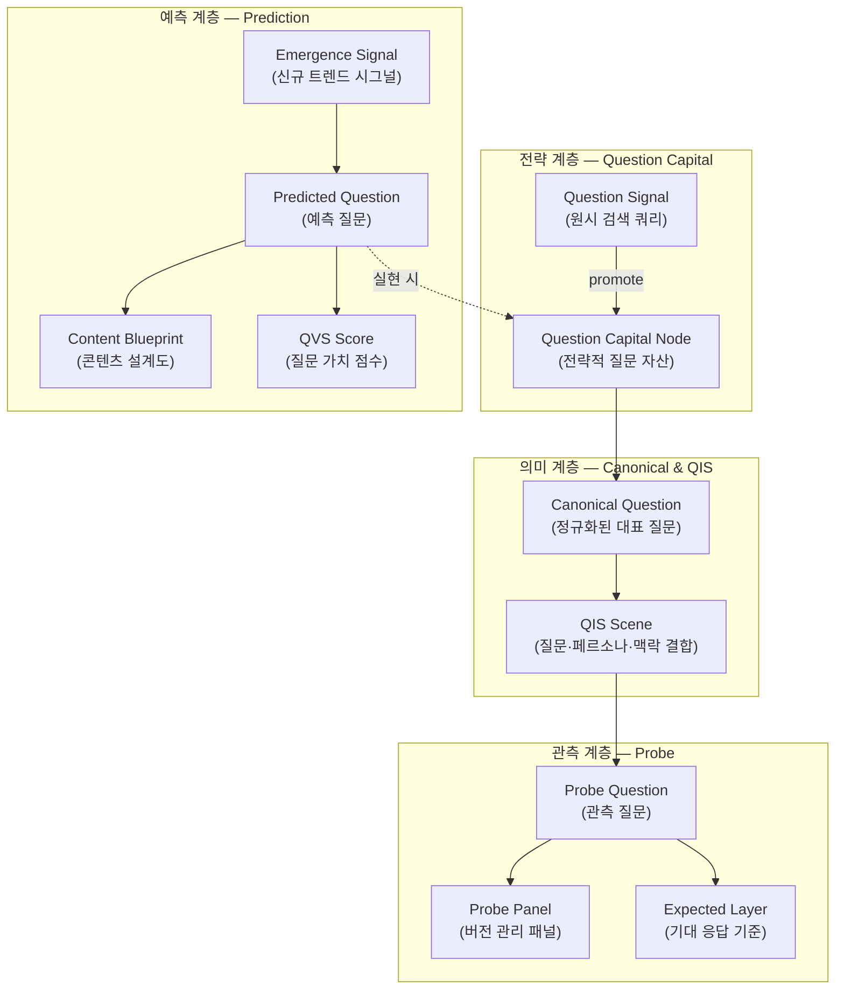
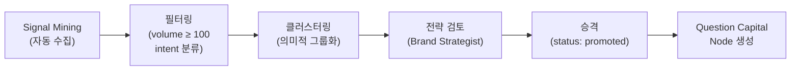
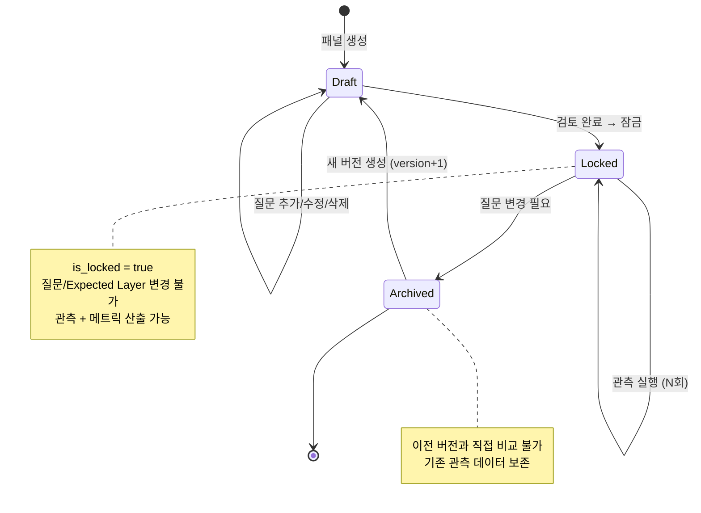
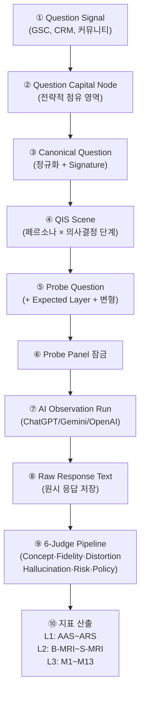

# BSW-OS 지표 체계 매뉴얼 Vol.6 — Question Capital 아키텍처

> **Version:** v1.0  
> **System:** Brand Semantic Website OS (BSW-OS)  
> **대상 독자:** 전략가 · 시맨틱 설계자 · 개발자  
> **Last Updated:** 2026-06-01

---

## 목차

1. [Question 자산 체계 개요](#1-question-자산-체계-개요)
2. [4계층 Question 데이터 모델](#2-4계층-question-데이터-모델)
3. [Question Capital Node](#3-question-capital-node)
4. [Canonical Question (CQ)](#4-canonical-question-cq)
5. [QIS Scene](#5-qis-scene)
6. [Probe Panel & Question](#6-probe-panel--question)
7. [Expected Layer](#7-expected-layer)
8. [계층 간 데이터 흐름](#8-계층-간-데이터-흐름)
9. [Question이 지표 체계에 미치는 영향](#9-question이-지표-체계에-미치는-영향)
10. [DB 스키마 레퍼런스](#10-db-스키마-레퍼런스)

---

## 1. Question 자산 체계 개요

### 1.1 왜 Question이 BSW-OS의 핵심인가?

AI 시대의 브랜드 가시성은 **"어떤 질문에 대해 AI가 우리를 언급하는가"**로 결정됩니다.

```
SEO 시대: 키워드 → 검색 순위 → CTR → 전환
AEO 시대: 질문 → AI 응답 → 브랜드 인용 → 신뢰 → 전환
```

BSW-OS에서 Question은 3가지 역할을 수행합니다:

| 역할 | 설명 | 데이터 흐름 |
|:---|:---|:---|
| **① 전략 자산** | 브랜드가 점유해야 할 질문 영역 정의 | Question Capital → CQ |
| **② 관측 도구** | AI 응답 품질 측정의 입력 데이터 | Probe Question → AI → Judge |
| **③ 예측 무기** | 아직 도래하지 않은 질문을 선점 | Emergence Signal → Predicted Question |

> [!IMPORTANT]
> **Question Capital은 SSoT와 대등한 전략 자산입니다.** SSoT가 "우리가 말하고 싶은 것"이라면, Question Capital은 "고객이 물어보는 것"입니다. 이 두 축의 교차점이 AEO/GEO 최적화의 핵심입니다.

### 1.2 전체 아키텍처



### 1.3 핵심 개념 정의

| 개념 | 정의 | 비유 |
|:---|:---|:---|
| **Question Signal** | 원시 검색 쿼리 (GSC, AI 자동완성, CRM 등에서 수집) | 광석 |
| **Question Capital** | 전략적으로 점유해야 할 질문 영역 (계층적 트리 구조) | 금괴 |
| **Canonical Question** | 의미적으로 대표하는 정규화된 질문 (중복 제거) | 금화 |
| **QIS Scene** | CQ에 페르소나·의사결정 단계·표면 타겟을 결합한 시나리오 | 거래 장면 |
| **Probe Question** | AI에 실제 전송하여 응답을 관측하는 측정 질문 | 탐사 프로브 |
| **Expected Layer** | 각 질문에 대한 이상적 AI 응답의 기대 조건 3계층 | 채점 기준표 |
| **Predicted Question** | 아직 도래하지 않은, AI가 예측한 미래 질문 | 선행 투자 |
| **QVS** | Question Value Score — 질문의 경제적 가치 종합 점수 | 주식 밸류에이션 |

---

## 2. 4계층 Question 데이터 모델

### 2.1 계층 관계도

```
                    ┌──────────────────────────────────┐
                    │  Question Signal (원시 쿼리)      │
 수집/마이닝 ───────│  volume · intent · status         │
                    │  status: mined → promoted         │
                    └───────────────┬──────────────────┘
                                    │ promote
                    ┌───────────────▼──────────────────┐
                    │  Question Capital Node            │
 전략 자산 ─────────│  title · slug · strategic_weight  │
                    │  parent_id (계층 트리)            │
                    └───────────────┬──────────────────┘
                                    │ 1:N
                    ┌───────────────▼──────────────────┐
                    │  Canonical Question               │
 정규화 ────────────│  normalized_question · signature  │
                    │  question_capital_node_id (FK)    │
                    └───────────────┬──────────────────┘
                                    │ 1:N
                    ┌───────────────▼──────────────────┐
                    │  QIS Scene                        │
 시나리오 ──────────│  scene_name · query_template      │
                    │  intent_model · risk_level        │
                    │  canonical_question_id (FK)       │
                    └───────────────┬──────────────────┘
                                    │ 변환
                    ┌───────────────▼──────────────────┐
                    │  Probe Question (관측 질문)        │
 관측/측정 ─────────│  question_text · intent_context   │
                    │  target_keyword · weight · 변형   │
                    │  Expected Layer (3계층 기대 기준)  │
                    └──────────────────────────────────┘
```

### 2.2 계층별 역할과 소유자

| 계층 | 담당자 | 활동 | 산출물 |
|:---|:---|:---|:---|
| **Signal** | 자동 수집 (AI/GSC) | 원시 쿼리 마이닝 | 100~500개 raw queries |
| **Capital** | Brand Strategist | 전략적 질문 영역 선정 | 10~30개 전략 질문 트리 |
| **CQ/QIS** | Semantic Architect | 정규화 + 시나리오 설계 | 30~50개 CQ, 50~100개 QIS |
| **Probe** | Observatory Operator | 관측 패널 조립 + 실행 | 15~30개 측정 질문 패널 |

---

## 3. Question Capital Node

### 3.1 정의

Question Capital Node는 **브랜드가 전략적으로 점유해야 할 질문 영역**을 정의하는 최상위 전략 자산입니다.

### 3.2 스키마

```typescript
// lib/schema.ts — #19 Question Capital Node
export const questionCapitalNodeSchema = z.object({
  id: z.string().uuid().optional(),
  workspace_id: z.string().uuid(),
  title: z.string().min(2).max(255),           // 전략 질문 영역명
  slug: z.string().min(2).max(100),             // URL-safe 식별자
  strategic_weight: z.number().min(0).max(100), // 전략적 중요도 (0~100)
  parent_id: z.string().uuid().optional(),      // 상위 노드 (계층 트리)
  created_at: z.string().optional(),
  updated_at: z.string().optional(),
});
```

### 3.3 계층 트리 예시 (K-Beauty)

```
Question Capital Tree (K-Beauty)
━━━━━━━━━━━━━━━━━━━━━━━━━━━━━━━

├── 🌿 성분 안전성 (strategic_weight: 95)
│   ├── 민감성 피부 성분 (weight: 90)
│   ├── 레티놀 안전성 (weight: 85)
│   ├── 임산부 안전 성분 (weight: 80)
│   └── 성분 궁합/상호작용 (weight: 75)
│
├── 💊 루틴 가이드 (strategic_weight: 80)
│   ├── 스킨케어 순서 (weight: 85)
│   ├── 아침/저녁 루틴 차이 (weight: 70)
│   └── 피부 타입별 루틴 (weight: 75)
│
├── 🏥 전문가 신뢰 (strategic_weight: 85)
│   ├── 피부과 추천 근거 (weight: 90)
│   ├── 임상 시험 결과 (weight: 85)
│   └── FDA/KFDA 승인 (weight: 80)
│
├── 🔬 브랜드 차별화 (strategic_weight: 90)
│   ├── 독점 특허 성분 (weight: 95)
│   ├── 경쟁사 비교 우위 (weight: 85)
│   └── 가격 대비 가치 (weight: 70)
│
└── ⚠️ YMYL 경계 (strategic_weight: 100)
    ├── 부작용 고지 의무 (weight: 100)
    ├── 치료 효과 표현 제한 (weight: 100)
    └── 의학적 조언 면책 (weight: 95)
```

### 3.4 Signal → Capital 승격 프로세스



**구현:**

```typescript
// app/actions/semantic.ts — promoteSignalToQuestionCapital()
async function promoteSignalToQuestionCapital(
  workspaceId: string,
  signalId: string,
  title: string,
  strategicWeight: number,
  parentId?: string
): Promise<QuestionCapitalNode>
```

**승격 기준:**

| 기준 | 임계값 | 설명 |
|:---|:---:|:---|
| 검색 볼륨 | ≥ 100/월 | 충분한 수요 |
| 전략 정렬 | Brand SSoT와 관련 | 핵심 사업 영역 |
| 경쟁 공백 | 경쟁사 미점유 | 선점 기회 |
| YMYL 해당 | risk_level ≥ medium | 안전 필수 영역 |

### 3.5 D-MRI 연결

D-MRI의 **Question System** 서브-컴포넌트(가중치 0.10)는 다음을 측정합니다:

```typescript
// lib/metrics/d-mri.ts — Question System 컴포넌트
const cqs = await supabase
  .from('canonical_questions')
  .select('question_capital_node_id')
  .eq('workspace_id', workspaceId);

// CQ가 Question Capital Node에 연결된 비율
const cqLinked = cqs.filter(cq => cq.question_capital_node_id !== null).length / cqs.length;
```

| D-MRI 점수 | CQ → QC 연결률 | 의미 |
|:---:|:---:|:---|
| 1.0 | 100% | Question Capital, CQ, QIS 완전 연결 |
| 0.5 | ~50% | 일부 CQ가 Capital 미연결 |
| 0.0 | 0% | Question 체계 미구축 |

---

## 4. Canonical Question (CQ)

### 4.1 정의

Canonical Question은 여러 유사 질문을 **의미적으로 대표하는 정규화된 질문**입니다. 중복을 제거하고, 하나의 CQ가 여러 원시 쿼리를 대표합니다.

### 4.2 스키마

```typescript
// lib/schema.ts — #20 Canonical Question
export const canonicalQuestionSchema = z.object({
  id: z.string().uuid().optional(),
  workspace_id: z.string().uuid(),
  question_capital_node_id: z.string().uuid().optional().nullable(), // FK → QC Node
  normalized_question: z.string().min(5),    // 정규화된 질문 텍스트
  slug: z.string().min(5).max(255),          // URL-safe 식별자
  signature: z.string().min(5).max(64),      // 의미적 해시 (중복 검출)
  created_at: z.string().optional(),
});
```

### 4.3 정규화 규칙

| 규칙 | 원시 질문 | 정규화 결과 |
|:---|:---|:---|
| **구어체 → 표준어** | "민감성 피부 크림 뭐가 좋아?" | "민감성 피부에 적합한 보습크림의 성분과 추천 기준" |
| **중복 통합** | "예민한 피부 보습 크림", "피부 예민할 때 쓸 수 있는 크림" | 동일 CQ로 통합 |
| **Signature 생성** | — | SHA-256(slug) 앞 64자 |

### 4.4 CQ Signature의 역할

```
원시 질문 A: "민감성 피부 보습크림 추천"
원시 질문 B: "예민한 피부에 좋은 크림"
원시 질문 C: "피부 예민할 때 쓸 크림"

      │ AI 클러스터링 + 인간 검토
      ▼

CQ: "민감성 피부에 적합한 보습크림의 성분과 추천 기준"
Slug: "sensitive-skin-moisturizer-recommendation"
Signature: "a3f7c9e2..." (SHA-256 앞 64자)

      │ 중복 질문 추가 시 Signature로 자동 검출
      ▼

⚠️ "민감성 피부 보습 크림 추천해줘" → 동일 Signature → 기존 CQ에 병합
```

---

## 5. QIS Scene

### 5.1 정의

QIS Scene은 CQ에 **페르소나·의사결정 단계·표면 타겟·위험 수준**을 결합하여 구체적인 관측 시나리오를 정의합니다.

### 5.2 스키마

```typescript
// lib/schema.ts — #21 QIS Scene
export const qisSceneSchema = z.object({
  id: z.string().uuid().optional(),
  workspace_id: z.string().uuid(),
  canonical_question_id: z.string().uuid(),    // FK → CQ
  scene_name: z.string().min(3).max(255),      // 시나리오명
  query_template: z.string().min(3),           // 질의 원형
  intent_model: z.string().min(2),             // 의도 모델
  scenario_context: z.string().min(5),         // 시나리오 맥락 설명
  risk_level: z.enum(['low', 'medium', 'high', 'critical']).default('medium'),
  created_at: z.string().optional(),
});
```

### 5.3 CQ → QIS 확장 예시

```
CQ: "민감성 피부에 적합한 보습크림의 성분과 추천 기준"
  │
  ├── QIS Scene 1: "민감성 피부 보습크림 비교 (Awareness)"
  │   query_template: "민감성 피부에 좋은 보습크림 성분 알려줘"
  │   intent_model: informational
  │   risk_level: medium
  │
  ├── QIS Scene 2: "민감성 보습크림 추천 (Consideration)"
  │   query_template: "민감성 피부 보습크림 추천해줘"
  │   intent_model: recommendation
  │   risk_level: medium
  │
  └── QIS Scene 3: "[브랜드명] 민감성 크림 리뷰 (Decision)"
      query_template: "[브랜드명] 크림이 민감성 피부에 맞나요?"
      intent_model: product_fit
      risk_level: low
```

### 5.4 QIS와 다른 모듈의 연결

QIS Scene은 BSW-OS의 여러 모듈에서 **참조점(Reference)**으로 사용됩니다:

| 참조하는 모듈 | 필드 | 용도 |
|:---|:---|:---|
| Representation Object | `qis_refs: UUID[]` | 어떤 QIS에 대한 답변용 객체인지 |
| Surface Contract | `qis_refs: UUID[]` | 어떤 QIS에 대응하는 표면인지 |
| Semantic Page | `qis_refs: UUID[]` | 어떤 QIS에 최적화된 페이지인지 |
| Vibe Assignment | `target_id` (type: qis) | QIS별 톤/스타일 정의 |

---

## 6. Probe Panel & Question

### 6.1 Probe Panel 정의

Probe Panel은 **관측 질문의 버전 관리 단위**입니다. 잠금(Lock) 후에만 관측을 실행할 수 있습니다.

### 6.2 Probe Panel 스키마

```typescript
// lib/schema.ts — #51 Probe Panel
export const probePanelSchema = z.object({
  id: z.string().uuid().optional(),
  workspace_id: z.string().uuid(),
  panel_name: z.string().min(2).max(255),
  slug: z.string().min(2).max(100),
  description: z.string().max(2000).optional().nullable(),
  version: z.number().int().positive().default(1),
  is_locked: z.boolean().default(false),        // 잠금 후 관측 가능
  industry: z.string().max(100).optional(),      // 업종 분류
  panel_type: z.string().max(50).default('standard'),
  sbs_index_target: z.string().max(50).optional(),
  parent_panel_id: z.string().uuid().optional(), // 이전 버전 참조
  is_active: z.boolean().default(true),
  created_at: z.string().optional(),
  updated_at: z.string().optional(),
});
```

**Panel Type 분류:**

| panel_type | 설명 | 용도 |
|:---|:---|:---|
| `standard` | 업종 표준 패널 | 업종 벤치마크 비교 |
| `brand_specific` | 특정 브랜드 맞춤 패널 | 자사 심층 분석 |
| `competitor_benchmark` | 경쟁사 비교 패널 | AIPR 산출 |
| `retest` | Fix-It 리테스트 패널 | SWEL/M8 측정 |

### 6.3 Probe Question 스키마

```typescript
// lib/schema.ts — #52 Probe Question
export const probeQuestionSchema = z.object({
  id: z.string().uuid().optional(),
  workspace_id: z.string().uuid(),
  probe_panel_id: z.string().uuid(),
  question_text: z.string().min(5),              // 질문 원문
  intent_context: z.string().min(2).max(255),    // 의도 유형
  target_keyword: z.string().min(2).max(255),    // 타겟 키워드
  risk_level: z.enum(['low', 'medium', 'high']), // YMYL 위험 수준
  decision_stage: z.string().max(50).optional(),  // awareness/consideration/decision
  question_type: z.string().max(50).optional(),
  weight: z.number().default(1.00),              // 지표 산출 시 가중치
  query_variants: z.array(z.string()).default([]), // 의미 동등 변형 목록
  
  // Lifecycle 관리
  lifecycle_status: z.enum(['draft','review','active','deprecated','archived']),
  ttl_expires_at: z.string().optional(),         // 시간 민감 질문의 만료일
  is_time_sensitive: z.boolean().default(false),
  
  // 가중치 캘리브레이션
  base_weight: z.number().default(1.00),
  calibrated_weight: z.number().optional(),      // 실측 기반 보정 가중치
  last_calibrated_at: z.string().optional(),
  
  // Funnel & YMYL
  funnel_stage: z.string().max(50).default('intake'),
  is_ymyl: z.boolean().default(false),
  regulatory_ref_id: z.string().uuid().optional(), // YMYL 규정 참조
  
  created_at: z.string().optional(),
  updated_at: z.string().optional(),
});
```

### 6.4 패널 생명주기



---

## 7. Expected Layer

### 7.1 정의

Expected Layer는 각 Probe Question에 대해 **"이상적 AI 응답은 무엇을 포함하고 무엇을 피해야 하는가"**를 사전 정의하는 3계층 기대 기준입니다.

### 7.2 3계층 구조

```
┌─────────────────────────────────────────────────────┐
│  must_include (반드시 포함)                           │
│  ───────────────────────────                        │
│  AI 응답에 반드시 포함되어야 하는 핵심 사실.            │
│  누락 시 BSF/GCTR/M1/M3 감점.                       │
│                                                      │
│  도출 근거: Brand Truth (brand_strategic_truths,      │
│            brand_operational_truths)                  │
├─────────────────────────────────────────────────────┤
│  should_include (포함 권장)                           │
│  ───────────────────────────                        │
│  포함되면 보너스를 주지만 필수는 아닌 부가 정보.        │
│                                                      │
│  도출 근거: TCO Concept, EEAT 요소                   │
├─────────────────────────────────────────────────────┤
│  must_not_do (절대 금지)                             │
│  ───────────────────────────                        │
│  AI 응답에 포함 시 감점 또는 경고 플래그.               │
│                                                      │
│  도출 근거: Boundary Rules, YMYL 규정                │
│            (boundary_rules.forbidden_terms)           │
└─────────────────────────────────────────────────────┘
```

### 7.3 스키마

```sql
CREATE TABLE expected_layers (
  id UUID PRIMARY KEY DEFAULT gen_random_uuid(),
  workspace_id UUID REFERENCES workspaces(id) ON DELETE CASCADE NOT NULL,
  probe_question_id UUID REFERENCES probe_questions(id) ON DELETE CASCADE NOT NULL,
  must_include TEXT[] DEFAULT '{}'::TEXT[] NOT NULL,
  should_include TEXT[] DEFAULT '{}'::TEXT[] NOT NULL,
  must_not_do TEXT[] DEFAULT '{}'::TEXT[] NOT NULL,
  expected_layer_version INTEGER DEFAULT 1 NOT NULL,
  UNIQUE(workspace_id, probe_question_id)
);
```

### 7.4 Expected Layer ↔ 메트릭 매핑

| Expected Layer | 충족 조건 | 영향 지표 | 방향 |
|:---|:---|:---|:---:|
| `must_include` 충족 | 필수 사실 존재 | BSF ↑, GCTR ↑, M1 ↑, M3 ↑ | + |
| `should_include` 충족 | 부가 정보 존재 | ARS ↑ (보너스) | + |
| `must_not_do` **위반** | 금지 표현 발견 | BSF ↓, AAS 경고, M4 ↑, M9 ↑ | − |

### 7.5 자동 채점 로직

```typescript
function evaluateExpectedLayer(
  rawResponse: string,
  expectedLayer: ExpectedLayer
): LayerScore {
  const mustHits = expectedLayer.must_include.filter(
    term => rawResponse.toLowerCase().includes(term.toLowerCase())
  );
  const mustScore = mustHits.length / expectedLayer.must_include.length;

  const shouldHits = expectedLayer.should_include.filter(
    term => rawResponse.toLowerCase().includes(term.toLowerCase())
  );
  const shouldScore = shouldHits.length / expectedLayer.should_include.length;

  const violations = expectedLayer.must_not_do.filter(
    term => rawResponse.toLowerCase().includes(term.toLowerCase())
  );
  const violationPenalty = violations.length * 0.15;  // 위반당 15% 감점

  return {
    mustScore,            // → BSF, GCTR에 반영
    shouldScore,          // → ARS 보너스에 반영
    violationPenalty,     // → BSF 감점, AAS 경고에 반영
    compositeScore: (mustScore * 0.6 + shouldScore * 0.3) - violationPenalty
  };
}
```

---

## 8. 계층 간 데이터 흐름

### 8.1 전체 파이프라인 (Question Capital → 지표)



### 8.2 DB 테이블 관계도

```
question_signals
    │ promote
    ▼
question_capital_nodes
    │ 1:N
    ▼
canonical_questions
    │ 1:N
    ▼
qis_scenes ───────────────────────► representation_objects.qis_refs
    │                               surface_contracts.qis_refs
    │ 변환                          semantic_pages.qis_refs
    ▼
probe_questions ◄──── probe_panels
    │                     │
    ├──── expected_layers  │
    │                      │
    └──── probe_runs ◄── ai_observation_runs
              │
              └──── response_judgments
              └──── concept_extraction_results
              └──── fidelity_judgments
              └──── distortion_judgments
              └──── hallucination_judgments
              └──── risk_judgments
              └──── policy_judgments
```

---

## 9. Question이 지표 체계에 미치는 영향

### 9.1 Question 품질 → 지표 품질

> [!CAUTION]
> **질문의 품질이 지표의 품질을 결정합니다.** 잘못 설계된 질문세트로 측정한 지표는 브랜드의 실제 AI 가시성을 왜곡합니다.

| Question 품질 요소 | 영향을 받는 지표 | 왜곡 위험 |
|:---|:---|:---|
| 질문 수 부족 (<10개) | 전체 L1 지표 | 통계적 유의성 부족 |
| 의도 유형 편향 | QTC | 특정 영역 과대/과소 대표 |
| YMYL 질문 누락 | M9, M10 | 안전성 리스크 미탐지 |
| Expected Layer 미정의 | BSF, GCTR | 채점 기준 부재 → 주관적 평가 |
| 변형(Variant) 미생성 | M7, M11, M12 | AI 응답 변동성 미측정 |
| 패널 버전 불일치 | SWEL, M8 | 전후 비교 무효 |

### 9.2 QTC (Question Territory Coverage) 상세

```
QTC = 커버된 QIS 시나리오 수 / 전체 목표 QIS 시나리오 수 × 100
```

QTC는 **질문 영역 점유율**을 측정합니다:

| QTC | 해석 | 조치 |
|:---:|:---|:---|
| ≥ 80% | 🟢 핵심 질문 영역 대부분 점유 | 유지 + 신규 영역 탐색 |
| 60~79% | 🔵 주요 영역 점유, 갭 일부 존재 | 누락 영역 Answer Card 보강 |
| 40~59% | 🟡 상당한 영역이 미점유 | QIS 설계 재검토 |
| < 40% | 🔴 대부분의 영역 미점유 | Question Capital 재구축 |

---

## 10. DB 스키마 레퍼런스

### 10.1 전체 Question 관련 테이블

| 테이블 | 계층 | 주요 필드 | FK 관계 |
|:---|:---:|:---|:---|
| `question_signals` | Signal | query, volume, intent, status | — |
| `question_capital_nodes` | Capital | title, slug, strategic_weight, parent_id | parent → self |
| `canonical_questions` | CQ | normalized_question, signature | → question_capital_nodes |
| `qis_scenes` | QIS | scene_name, query_template, intent_model | → canonical_questions |
| `probe_panels` | Panel | panel_name, version, is_locked, industry | parent → self |
| `probe_questions` | Probe | question_text, intent_context, weight, query_variants | → probe_panels |
| `expected_layers` | EL | must_include[], should_include[], must_not_do[] | → probe_questions |
| `ai_observation_runs` | Run | run_name, run_status, run_metadata | → probe_panels |
| `probe_runs` | Result | engine_name, raw_response_text | → observation_runs, probe_questions |
| `question_value_scores` | QVS | qvs_composite, estimated_monthly_value | → probe_questions |
| `predicted_questions` | Pred | question_text, confidence, preemption_urgency | → emergence_signals |
| `emergence_signals` | Pred | source_type, raw_text, predicted_impact | — |
| `content_blueprints` | Pred | recommended_structure, draft_content | → predicted_questions |
| `question_funnel_events` | Funnel | from_stage, to_stage | → probe_questions, predicted_questions |

---

> **관련 문서:**
> - [Vol.7 — QIS Probe 질문세트 설계](./metrics-manual-question-design.md)
> - [Vol.8 — 질문 예측 및 QVS 엔진](./metrics-manual-question-prediction.md)
> - [Vol.1 — 아키텍처 총론](./metrics-manual-architecture.md)
> - [Vol.3 — 측정 실행 매뉴얼](./metrics-manual-operations.md)
