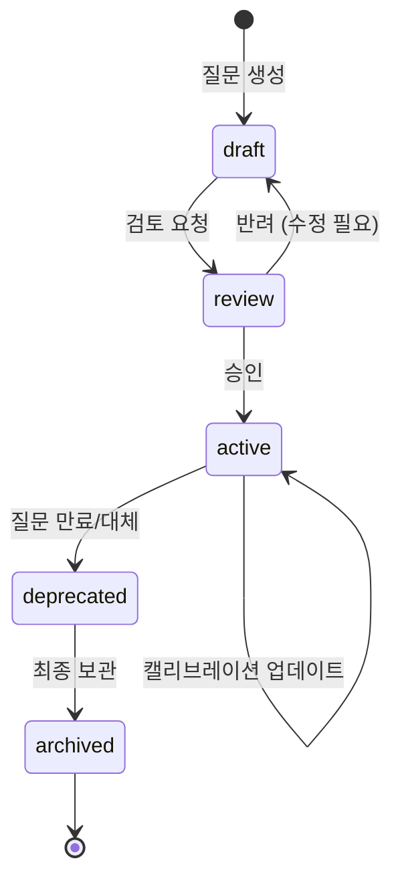

# BSW-OS 지표 체계 매뉴얼 Vol.7 — QIS Probe 질문세트 설계 가이드

> **Version:** v1.0  
> **System:** Brand Semantic Website OS (BSW-OS)  
> **대상 독자:** Brand Strategist · Semantic Architect · Observatory Operator  
> **Last Updated:** 2026-06-01

---

## 목차

1. [질문세트 도출 방법론 (6단계)](#1-질문세트-도출-방법론-6단계)
2. [질문 유형 분류 체계](#2-질문-유형-분류-체계)
3. [Expected Layer 설계 실전 가이드](#3-expected-layer-설계-실전-가이드)
4. [업종별 표준 질문세트](#4-업종별-표준-질문세트)
5. [패널 운영 규칙](#5-패널-운영-규칙)
6. [질문 가중치 캘리브레이션](#6-질문-가중치-캘리브레이션)
7. [질문 생명주기 관리](#7-질문-생명주기-관리)
8. [품질 감사 체크리스트](#8-품질-감사-체크리스트)

---

## 1. 질문세트 도출 방법론 (6단계)

### Stage 1: Question Capital 마이닝

> **목적:** 업종의 전체 질문 우주(Question Universe)를 수집

**입력 소스 우선순위:**

| # | 소스 | 수집 방법 | 품질 | 예상 수량 |
|:---:|:---|:---|:---:|:---:|
| 1 | **고객 직접 문의** | CRM/채팅 로그 분석 | ⭐⭐⭐⭐⭐ | 50~200 |
| 2 | **AI홈피허브 인박스** | `raw_intake_questions` 테이블 | ⭐⭐⭐⭐⭐ | 100~500 |
| 3 | **검색 키워드** | GSC / Ahrefs / 네이버 검색어 | ⭐⭐⭐⭐ | 100~300 |
| 4 | **도메인 전문가** | 브레인스토밍 워크숍 | ⭐⭐⭐⭐ | 20~50 |
| 5 | **커뮤니티 질문** | 네이버 지식iN, 카페, Reddit | ⭐⭐⭐ | 50~200 |
| 6 | **AI 자동완성** | ChatGPT/Perplexity 자동완성 | ⭐⭐⭐ | 30~100 |

**Signal Mining 구현:**

```typescript
// lib/ai/semantic_miner.ts
// 검색 쿼리에서 고객 의도를 나타내는 Question Capital 후보를 추출
async function mineQuestionSignals(
  domain: string
): Promise<QuestionSignal[]>
```

**산출물:** 업종별 **100~500개** 원시 질문 목록

---

### Stage 2: Canonical Intent 클러스터링

> **목적:** 중복/유사 질문을 의미적 대표 질문(CQ)으로 통합

```
원시 질문 500개
       │
       ▼  (AI 클러스터링 — Gemini/OpenAI)
 Canonical Intent 30-50개
       │
       ▼  (인간 검토 + 승인)
 확정 CQ 세트
```

**클러스터링 기준:**

| 기준 | 설명 | 예시 |
|:---|:---|:---|
| **동일 근본 의도** | 같은 것을 알고 싶은 질문 | "레티놀 부작용" ≈ "레티놀 위험성" |
| **다른 표현** | 구어체/문어체 변형 | "뭐가 좋아?" ≈ "추천 기준은?" |
| **다른 대상** | 같은 의도 + 다른 제품/서비스 | → 별도 CQ |
| **다른 의도** | 정보 탐색 vs 구매 의사 | → 별도 CQ |

**예시 (스킨케어):**

```
원시 질문:
  ① "민감성 피부에 좋은 크림 추천"
  ② "예민한 피부 보습크림 뭐가 좋아?"
  ③ "피부 예민할 때 쓸 수 있는 크림"
  ④ "민감성 피부 크림 성분 뭐가 안전해?"

  ↓ 클러스터링

Canonical Question:
  "민감성 피부에 적합한 보습크림의 성분과 추천 기준"
  카테고리: 성분/추천
  빈도 기반 가중치: 4 (원시 4건 통합)
```

---

### Stage 3: QIS Scene 설계

> **목적:** CQ에 페르소나·의사결정 단계·표면 타겟을 결합

**QIS Scene 설계 매트릭스:**

| CQ | × Awareness | × Consideration | × Decision |
|:---|:---|:---|:---|
| 보습크림 성분 | "보습 성분 종류?" | "세라마이드 vs 히알루론산" | "[브랜드] 크림 성분 분석" |
| 레티놀 사용법 | "레티놀이 뭐야?" | "레티놀 사용 순서" | "[브랜드] 레티놀 후기" |
| 피부 장벽 회복 | "장벽 손상 원인?" | "장벽 회복 크림 비교" | "[브랜드] 장벽 크림 구매" |

**Scene 구성 요소:**

```yaml
scene_name: "민감성 피부 보습크림 비교 시나리오"
persona_origin: "피부 트러블을 겪는 20대 여성"
decision_stage: consideration
surface_targets: ["ChatGPT Answer", "Google AI Overview"]
query_template: "민감성 피부에 좋은 보습크림 추천해줘"
risk_level: medium
```

---

### Stage 4: Probe Question 작성

> **목적:** QIS Scene을 실제 관측 가능한 측정 질문으로 변환

**작성 규칙 7조:**

| # | 규칙 | 이유 |
|:---:|:---|:---|
| 1 | **자연어로 작성** | AI에게 실제 사용자처럼 질문 |
| 2 | **한국어 기본** | 한국 시장 타겟 |
| 3 | **의도 유형 명시** | `intent_context` 필수 기입 |
| 4 | **타겟 키워드 지정** | `target_keyword` 필수 기입 |
| 5 | **2~3개 변형 생성** | `query_variants[]`로 편향 감소 |
| 6 | **YMYL 태그** | `is_ymyl=true`, `risk_level='high'` |
| 7 | **가중치 배분** | `weight`로 중요도 반영 |

**변형(Variant) 생성 전략:**

```
원본: "민감성 피부에 좋은 레티놀 사용법은?"

변형 전략:
├── 구어체 변환: "예민한 피부도 레티놀 써도 되나요?"
├── 표현 재배열: "레티놀 처음 쓰는데 민감성 피부면 어떻게?"
└── 맥락 변경:   "피부 민감한 사람 레티놀 바르는 방법"
```

---

### Stage 5: Expected Layer 정의

> **목적:** 각 질문에 대해 이상적 AI 응답의 기대 조건 명세

**도출 매트릭스:**

| Expected Layer | 도출 근거 | BSW-OS 테이블 |
|:---|:---|:---|
| `must_include` | Brand Truth 핵심 사실 | `brand_strategic_truths`, `brand_operational_truths` |
| `should_include` | TCO Concept + EEAT 요소 | `tco_concepts`, `brand_truth_evidence` |
| `must_not_do` | Boundary Rule + YMYL 규정 | `boundary_rules.forbidden_terms`, `ymyl_regulatory_references` |

**예시 (S05: [브랜드명] 민감성 피부 크림):**

```yaml
must_include:
  - "PureBarrier"          # 브랜드명 필수
  - "Ceramide NP"          # 핵심 성분
  - "민감성 피부"          # 대상 피부 타입
  - "피부 장벽 회복"       # 핵심 효능

should_include:
  - "임상 테스트 완료"     # EEAT 요소
  - "피부과 전문의 감수"   # 전문가 권위
  - "48시간 보습 유지"     # 차별화 클레임
  - "pH 5.5 약산성"        # 기술적 사양

must_not_do:
  - "습진 치료"            # YMYL: 치료 표현 금지
  - "100% 안전"            # 절대적 안전 보장 금지
  - "부작용 없음"          # 부작용 부정 금지
  - "영구적 효과"          # 영구 효과 보장 금지
```

---

### Stage 6: 패널 조립 및 잠금

> **목적:** 검증된 질문세트를 측정 가능한 패널로 확정

**조립 체크리스트:**

```
□  1. 질문 수 확인     : 최소 10개, 권장 15~20개, 벤치마크급 30개+
□  2. 의도 유형 균형   : informational / comparison / recommendation 균등
□  3. 의사결정 단계    : awareness + consideration + decision 모두 포함
□  4. YMYL 포함       : high-risk(YMYL) 질문 최소 2개+
□  5. Expected Layer   : 모든 질문에 3계층 정의 완료
□  6. 변형 생성       : 모든 질문에 최소 2개 변형
□  7. 가중치 배분     : 질문별 중요도 weight 할당
□  8. 패널 잠금       : is_locked = true
□  9. 방법론 공개문   : Methodology Disclosure 작성
□ 10. 프록시 면책     : Proxy Caveat 문구 첨부
```

---

## 2. 질문 유형 분류 체계

### 2.1 의도 기반 분류 (12종)

| intent_context | 정의 | 측정 초점 | 가중치 권장 |
|:---|:---|:---|:---:|
| `informational` | 정보 탐색 | GCTR + 설명 품질 | 1.0 |
| `comparison` | 비교/대조 | AAS + 공정성 | 1.2 |
| `recommendation` | 추천 요청 | AAS + OCR | 1.5 |
| `source_seeking` | 출처/근거 탐색 | OCR + 신뢰 가시성 | 1.3 |
| `action_seeking` | 행동 유도 | 행동 정렬 | 1.0 |
| `risk_boundary` | 위험/경계 | 경계 가시성 | **2.0** |
| `local_intent` | 지역 기반 | 로컬 인용 | 1.0 |
| `product_fit` | 적합성 판단 | 페르소나 정렬 | 1.2 |
| `price_package` | 가격/패키지 | 가격 정확성 | 1.0 |
| `routine_guidance` | 루틴/과정 | 구조 전이 | 1.0 |
| `contract_check` | 계약/조건 | 법적 정확성 | **1.8** |
| `trust_verification` | 신뢰/자격 | EEAT 가시성 | 1.5 |

> [!TIP]
> **`risk_boundary`와 `contract_check`에 높은 가중치를 부여하세요.** YMYL 영역의 오류는 법적/브랜드 리스크를 수반하므로, 이 유형의 질문에서의 정확성이 다른 유형보다 중요합니다.

### 2.2 위험 수준 분류

| risk_level | YMYL | 평가 강도 | Expected Layer 요구 |
|:---|:---:|:---|:---|
| `low` | ❌ | 표준 | must_not_do 선택적 |
| `medium` | ⚠️ 부분적 | 강화 | must_not_do 필수 |
| `high` | ✅ | **최고** | must_not_do 3개+ 필수 |

### 2.3 의사결정 단계 분류

| decision_stage | 질문 특성 | 측정 초점 |
|:---|:---|:---|
| `awareness` | "~가 뭐야?", "~의 원인은?" | 개념 전달(M1), 정보 정확성 |
| `consideration` | "~비교", "~vs~", "추천" | 브랜드 중심성(AAS), 충실도(M3) |
| `decision` | "[브랜드명] 후기", "구매 방법" | 인용(OCR), 행동 정렬(M10) |

### 2.4 Funnel Stage 관리

```
intake → triage → active → monitoring → deprecated → archived
```

| funnel_stage | 설명 | 다음 단계 조건 |
|:---|:---|:---|
| `intake` | 신규 수집 | AI 분석 완료 시 |
| `triage` | 전략적 가치 평가 중 | QVS 산출 완료 시 |
| `active` | 현재 측정 중 | 질문 만료 또는 대체 시 |
| `monitoring` | 주기적 감시 | 변화 탐지 시 active 복귀 |
| `deprecated` | 더 이상 유효하지 않음 | 보관 결정 시 |
| `archived` | 최종 보관 | — |

---

## 3. Expected Layer 설계 실전 가이드

### 3.1 must_include 작성 매뉴얼

**원칙: Brand Truth에서 검증된 핵심 사실만 포함**

| 카테고리 | 작성 기준 | 예시 |
|:---|:---|:---|
| **브랜드명** | 정확한 브랜드명/제품명 | `["PureBarrier", "PB-크림"]` |
| **핵심 성분/기술** | SSoT에 등록된 차별화 요소 | `["Ceramide NP", "Squalane"]` |
| **대상 카테고리** | 질문 영역의 핵심 개념 | `["민감성 피부", "장벽 회복"]` |
| **필수 사실** | 변경 불가능한 객관적 사실 | `["FDA 등록", "임상 시험"]` |

**주의사항:**
- must_include 항목 수는 **3~5개**가 적정 (너무 많으면 어떤 AI도 통과 불가)
- 영어/한국어 혼용 가능 (AI 응답이 혼용될 수 있으므로)
- 동의어를 별도 항목으로 분리하지 않음 (하나의 개념 = 하나의 항목)

### 3.2 should_include 작성 매뉴얼

**원칙: TCO Concept과 EEAT 요소에서 도출**

| 카테고리 | 작성 기준 | 예시 |
|:---|:---|:---|
| **EEAT — 전문성** | 전문가 감수, 자격 | `["피부과 전문의"]` |
| **EEAT — 경험** | 사용 후기, 임상 결과 | `["48시간 보습 임상"]` |
| **차별화 포인트** | 경쟁사 대비 고유 강점 | `["독자 특허 기술"]` |
| **부가 정보** | 사용법, 팁, 주의사항 | `["사용 순서", "보관법"]` |

### 3.3 must_not_do 작성 매뉴얼

**원칙: Boundary Rule과 YMYL 규정에서 도출**

| 카테고리 | 작성 기준 | 예시 |
|:---|:---|:---|
| **YMYL — 의료** | 치료 보장, 진단 권유 | `["완치", "자가 진단"]` |
| **YMYL — 재무** | 수익 보장, 무조건 환불 | `["수익 보장", "100% 환불"]` |
| **허위 주장** | 검증 불가능한 최상급 | `["업계 1위", "최저가"]` |
| **경계 위반** | 금지 표현 | `["부작용 없음", "영구 효과"]` |
| **경쟁사 비방** | 타사 명시적 비하 | `["X사 위험", "Y사 불량"]` |

> [!WARNING]
> **YMYL 도메인(의료/법률/금융)에서는 must_not_do를 최소 3개 이상 반드시 정의하세요.** 미정의 시 M9(Floor Risk)와 M10(Policy Alignment) 측정이 불완전해집니다.

### 3.4 업종별 must_not_do 표준 목록

| 업종 | 필수 금지 표현 |
|:---|:---|
| **스킨케어** | "습진 완치", "부작용 제로", "영구 효과", "100% 안전" |
| **의료/클리닉** | "시술 부작용 없음", "100% 효과", "자가 진단", "완치 보장" |
| **웨딩** | "최저가 보장", "예약 보장", "취소수수료 면제" |
| **부동산** | "수익 보장", "시세 상승 확실", "사기 불가능" |
| **금융/보험** | "원금 보장", "무조건 승인", "수익률 확정" |
| **법률** | "승소 보장", "무죄 확실", "자격 없이 조언" |

---

## 4. 업종별 표준 질문세트

### 4.1 K-Beauty (스킨케어) — 15개

**패널명:** K-Beauty Sensitive Skincare Trust Panel

| # | 질문 | 의도 | 위험 | 단계 |
|:---:|:---|:---:|:---:|:---:|
| S01 | 민감성 피부에 좋은 보습크림 성분은? | informational | medium | awareness |
| S02 | 레티놀 처음 사용할 때 민감성 피부 주의사항 | risk_boundary | **high** | awareness |
| S03 | 세라마이드 vs 히알루론산 보습 효과 비교 | comparison | low | consideration |
| S04 | 여드름 피부 저녁 스킨케어 루틴 순서 | routine_guidance | low | consideration |
| S05 | [브랜드명] 제품이 민감성 피부에 적합한 이유 | recommendation | medium | decision |
| S06 | 피부 장벽 손상 시 회복 방법과 추천 제품 | informational | medium | awareness |
| S07 | 선크림 SPF 50 이상 민감성 피부용 추천 | recommendation | low | consideration |
| S08 | 스킨케어 성분 궁합 — 같이 쓰면 안 되는 성분 | risk_boundary | **high** | awareness |
| S09 | 피부과에서 추천하는 민감성 피부 관리법 | trust_verification | medium | awareness |
| S10 | 레티놀 부작용 사례와 대처 방법 | risk_boundary | **high** | awareness |
| S11 | 건조한 피부 아침/저녁 루틴 차이점 | routine_guidance | low | consideration |
| S12 | [브랜드명] vs [경쟁사] 보습크림 비교 | comparison | medium | consideration |
| S13 | 피부 타입별 세럼 선택 가이드 | product_fit | low | consideration |
| S14 | 임산부가 사용해도 안전한 스킨케어 성분 | risk_boundary | **high** | awareness |
| S15 | [브랜드명] 제품 전성분 분석 및 안전성 평가 | source_seeking | medium | decision |

**의도 유형 분포:** informational 3, comparison 2, recommendation 2, risk_boundary 4, routine 2, trust 1, source 1  
**위험 수준 분포:** low 4, medium 5, high 6  
**의사결정 단계:** awareness 7, consideration 5, decision 3

---

### 4.2 웨딩 — 15개

**패널명:** Wedding Vendor Trust & Contract Panel

| # | 질문 | 의도 | 위험 | 단계 |
|:---:|:---|:---:|:---:|:---:|
| W01 | 서울 강남 웨딩홀 패키지 비교 추천 | recommendation | low | consideration |
| W02 | 웨딩홀 계약 전 반드시 확인할 조건 | contract_check | medium | decision |
| W03 | 웨딩 스드메 가격대 비교 | price_package | medium | consideration |
| W04 | [브랜드명] 웨딩홀 패키지에 포함된 항목 | informational | low | consideration |
| W05 | 웨딩홀 투어 시 체크리스트 | informational | low | awareness |
| W06 | 봄/가을 웨딩 시즌 예약 팁과 할인 정보 | action_seeking | low | awareness |
| W07 | 웨딩 뷔페 식사 인당 가격대 | price_package | medium | consideration |
| W08 | 소규모 웨딩 30명 이하 가성비 패키지 | recommendation | low | consideration |
| W09 | 웨딩 계약 해지/환불 규정 비교 | contract_check | **high** | decision |
| W10 | [브랜드명] vs [경쟁사] 웨딩홀 장단점 비교 | comparison | medium | consideration |
| W11 | 웨딩 촬영 스튜디오 잘하는 곳 추천 후기 | recommendation | low | consideration |
| W12 | 결혼식 자연스러운 메이크업 트렌드 | informational | low | awareness |
| W13 | 웨딩 플래너 역할과 비용 구조 | informational | medium | awareness |
| W14 | 웨딩홀 하객 인원별 최적 홀 크기 | product_fit | low | consideration |
| W15 | 해외 웨딩(발리/하와이) 비용과 절차 | informational | medium | awareness |

---

### 4.3 편의점/리테일 — 12개

**패널명:** Convenience Local Action Panel

| # | 질문 | 의도 | 위험 | 단계 |
|:---:|:---|:---:|:---:|:---:|
| C01 | 근처 [브랜드명] 편의점 위치 찾기 | local_intent | low | decision |
| C02 | 편의점 야식 가성비 조합 추천 | recommendation | low | consideration |
| C03 | [브랜드명] 이번 주 할인 프로모션 | action_seeking | low | consideration |
| C04 | 편의점 도시락 칼로리 비교 | comparison | low | consideration |
| C05 | 새벽 배달 가능한 편의점 | local_intent | low | decision |
| C06 | 편의점 1+1 행사 상품 목록 | price_package | low | consideration |
| C07 | [브랜드명] 멤버십 적립 혜택 | informational | low | awareness |
| C08 | 편의점 택배 접수 방법과 요금 | action_seeking | low | awareness |
| C09 | 편의점 간편결제 지원 여부 | informational | low | awareness |
| C10 | 편의점 도시락 유통기한 안전 기준 | risk_boundary | medium | awareness |
| C11 | 근처 24시간 영업 편의점 찾기 | local_intent | low | decision |
| C12 | 편의점 프랜차이즈별 특징 비교 | comparison | low | consideration |

---

### 4.4 의료 클리닉 — 15개

**패널명:** Medical Clinic YMYL Trust Panel

| # | 질문 | 의도 | 위험 | 단계 |
|:---:|:---|:---:|:---:|:---:|
| M01 | 강남 피부과 레이저 토닝 잘하는 곳 | local_intent | medium | consideration |
| M02 | 보톡스 시술 가격대와 지속 기간 | price_package | medium | consideration |
| M03 | 레이저 시술 부작용과 주의사항 | risk_boundary | **high** | awareness |
| M04 | 피부과 전문의 자격 확인 방법 | trust_verification | medium | awareness |
| M05 | [브랜드명] 클리닉 시술 후기 및 평판 | recommendation | medium | decision |
| M06 | 여드름 흉터 치료 종류와 효과 비교 | comparison | **high** | consideration |
| M07 | 의료기관 인증 마크 종류와 의미 | trust_verification | medium | awareness |
| M08 | 필러 시술 후 관리법과 주의사항 | risk_boundary | **high** | awareness |
| M09 | 피부과 초진 비용 및 진료 절차 | action_seeking | low | awareness |
| M10 | 시술 전 상담 시 확인할 질문 목록 | informational | medium | awareness |
| M11 | 레이저 제모 횟수와 가격 비교 | price_package | medium | consideration |
| M12 | 피부과 시술 환불/보상 규정 | contract_check | **high** | decision |
| M13 | 아토피 피부 치료 가능한 피부과 | local_intent | **high** | consideration |
| M14 | [브랜드명] vs [경쟁사] 클리닉 비교 | comparison | medium | consideration |
| M15 | 의료 광고 규제와 허위 광고 판별법 | source_seeking | medium | awareness |

---

### 4.5 패널 설계 원칙 요약

| 원칙 | 최소 기준 | 권장 기준 |
|:---|:---:|:---:|
| 전체 질문 수 | 10개 | 15~20개 |
| YMYL(high risk) 비율 | 질문 2개+ | 전체의 20~30% |
| 의도 유형 커버리지 | 3종+ | 5종+ |
| 의사결정 단계 | 2단계+ | 3단계 모두 |
| 변형(Variant) | 질문당 1개+ | 질문당 2~3개 |
| Expected Layer 완성률 | 80% | **100%** |

---

## 5. 패널 운영 규칙

### 5.1 핵심 운영 12원칙

| # | 원칙 | 설명 |
|:---:|:---|:---|
| 1 | **관측 프록시** | AI 관측은 근사 측정이지 절대적 진실이 아님 |
| 2 | **원시 저장** | 모든 Probe 응답 원문(raw response) 보존 |
| 3 | **패널 버전 관리** | Probe Panel은 반드시 버전 잠금 후 측정 |
| 4 | **출처 연결** | 메트릭은 반드시 소스 Observation Run에 연결 |
| 5 | **동일 버전 비교** | 전후 비교 시 반드시 동일 패널 버전 사용 |
| 6 | **방법론 공개** | 리포트에 측정 방법론 공개 필수 |
| 7 | **프록시 면책** | AI 기반 관측 메트릭에 프록시 면책 문구 필수 |
| 8 | **B-MRI ≠ D-MRI** | 관측 성과와 내부 준비도 분리 |
| 9 | **가설로서의 패치** | 모든 Fix-It 패치는 가설 |
| 10 | **리테스트 필수** | 패치 성공은 리테스트로만 확인 |
| 11 | **반복 관측** | AI 응답의 변동성 → 반복 관측(3~10회) 필수 |
| 12 | **다변형 질의** | 의미 동등 질문 변형으로 편향 감소 |

### 5.2 시즌/이벤트 기반 패널 업데이트

| 트리거 | 액션 | 예시 |
|:---|:---|:---|
| 계절 변경 | 새 버전 패널 생성 | 봄 웨딩 → 가을 웨딩 |
| 신규 경쟁사 | comparison 질문 추가 | 신규 웨딩홀 오픈 |
| 업종 트렌드 | 트렌드 질문 추가 | "AI 웨딩 플래너" 등장 |
| YMYL 규제 변경 | must_not_do 업데이트 | 의료 광고 규제 강화 |
| 브랜드 전략 변경 | must_include 업데이트 | 리브랜딩, 신제품 출시 |

---

## 6. 질문 가중치 캘리브레이션

### 6.1 가중치 체계

```typescript
// Probe Question 가중치 필드
base_weight: number;         // 초기 가중치 (기본 1.0)
calibrated_weight: number;   // 실측 보정 가중치
last_calibrated_at: string;  // 마지막 보정 시점
```

### 6.2 캘리브레이션 공식

```
calibrated_weight = base_weight 
  × intent_multiplier       // 의도 유형별 승수
  × risk_multiplier         // YMYL 위험도 승수
  × volume_multiplier       // 검색 볼륨 기반 승수
  × conversion_multiplier   // 전환율 기반 승수
```

| 승수 | 값 | 조건 |
|:---|:---:|:---|
| intent: recommendation | 1.5 | 추천 질문은 브랜드 인용에 직결 |
| intent: risk_boundary | 2.0 | YMYL 안전성이 최고 가중치 |
| risk: high | 1.5 | YMYL 질문 |
| volume: ≥1000/월 | 1.3 | 높은 검색 수요 |
| conversion: ≥5% | 1.2 | 높은 전환율 |

### 6.3 캘리브레이션 주기

| 빈도 | 활동 |
|:---|:---|
| **월간** | 검색 볼륨 데이터 업데이트 → volume_multiplier 재계산 |
| **분기** | 전환율 데이터 반영 → conversion_multiplier 재계산 |
| **반기** | 전체 가중치 구조 재검토 |

---

## 7. 질문 생명주기 관리

### 7.1 Lifecycle Status 전이도



### 7.2 시간 민감 질문 관리

```typescript
is_time_sensitive: boolean;  // 시간 민감 여부
ttl_expires_at: string;      // 만료 일시
```

| 예시 | is_time_sensitive | ttl_expires_at |
|:---|:---:|:---|
| "2026년 봄 웨딩 트렌드" | ✅ | 2026-06-30 |
| "크리스마스 편의점 이벤트" | ✅ | 2026-12-31 |
| "민감성 피부 보습크림 추천" | ❌ | null |

---

## 8. 품질 감사 체크리스트

### 8.1 패널 품질 감사 (월간)

| # | 점검 항목 | 통과 기준 | 감사 방법 |
|:---:|:---|:---|:---|
| 1 | 전체 질문 수 | ≥ 10개 | DB 카운트 |
| 2 | Expected Layer 완성률 | 100% | 미정의 질문 0개 |
| 3 | YMYL 비율 | ≥ 20% | risk_level='high' 비율 |
| 4 | 의도 유형 커버리지 | ≥ 4종 | intent_context DISTINCT 수 |
| 5 | 의사결정 단계 커버리지 | 3단계 모두 | decision_stage DISTINCT |
| 6 | 변형 생성률 | ≥ 80% | query_variants 비어있지 않은 비율 |
| 7 | 만료된 시간 민감 질문 | 0개 | ttl_expires_at < now() |
| 8 | deprecated 질문 비율 | < 10% | lifecycle_status 비율 |
| 9 | 캘리브레이션 최신성 | < 3개월 | last_calibrated_at 확인 |
| 10 | 패널 잠금 상태 | is_locked=true | 활성 패널만 |

### 8.2 질문 개별 품질 점검

| 점검 항목 | 통과 기준 |
|:---|:---|
| 질문이 자연어인가? | 실제 사용자가 물어볼 법한 표현 |
| 의도 유형이 정확한가? | 질문 내용과 intent_context 일치 |
| 타겟 키워드가 적절한가? | 측정하고자 하는 브랜드/개념과 일치 |
| must_include가 검증 가능한가? | 객관적 사실만 포함 (주관적 평가 X) |
| must_not_do가 명확한가? | 금지 표현이 구체적이고 검증 가능 |
| 변형이 의미적으로 동등한가? | 같은 의도, 다른 표현 |
| 가중치가 합리적인가? | 비즈니스 영향도와 일치 |

---

> **관련 문서:**
> - [Vol.6 — Question Capital 아키텍처](./metrics-manual-question-architecture.md)
> - [Vol.8 — 질문 예측 및 QVS 엔진](./metrics-manual-question-prediction.md)
> - [Vol.3 — 측정 실행 매뉴얼](./metrics-manual-operations.md)
> - [Vol.4 — 결과 해석 및 활용 가이드](./metrics-manual-interpretation.md)
