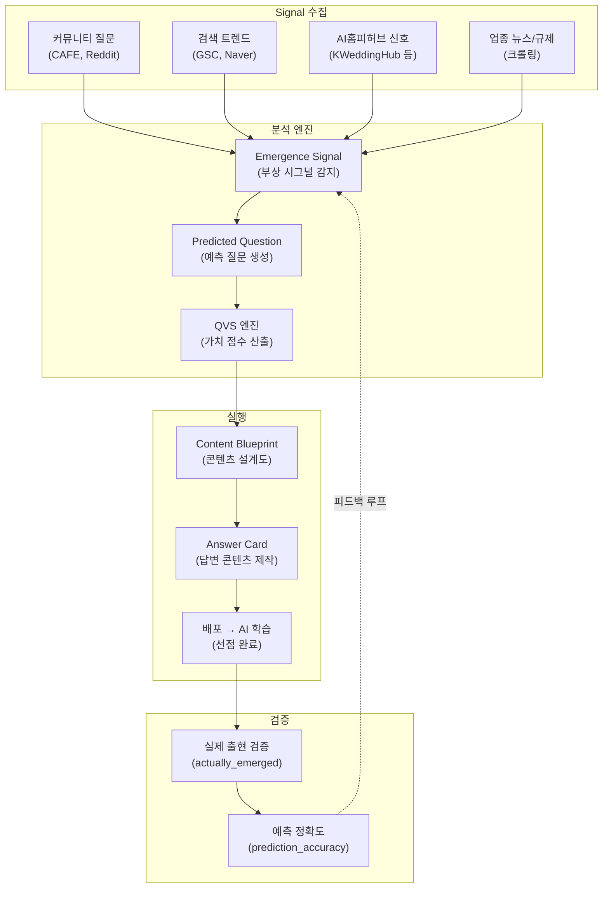
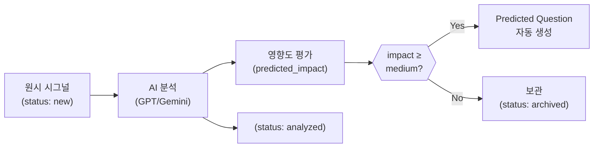
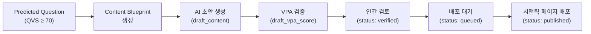
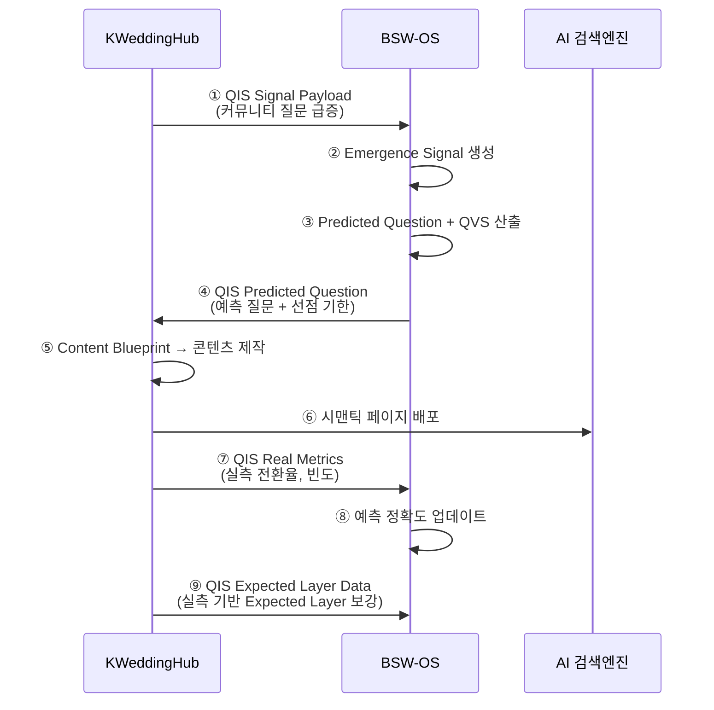

# BSW-OS 지표 체계 매뉴얼 Vol.8 — 질문 예측 및 QVS 엔진

> **Version:** v1.0  
> **System:** Brand Semantic Website OS (BSW-OS)  
> **대상 독자:** 전략가 · 허브 관리자 · 개발자  
> **Last Updated:** 2026-06-01

---

## 목차

1. [질문 예측 시스템 개요](#1-질문-예측-시스템-개요)
2. [Emergence Signal (부상 시그널)](#2-emergence-signal-부상-시그널)
3. [Predicted Question (예측 질문)](#3-predicted-question-예측-질문)
4. [QVS — Question Value Score (질문 가치 점수)](#4-qvs--question-value-score)
5. [Content Blueprint (콘텐츠 설계도)](#5-content-blueprint-콘텐츠-설계도)
6. [Question Funnel (질문 퍼널)](#6-question-funnel-질문-퍼널)
7. [외부 플랫폼 연동 — QIS 공유 스키마](#7-외부-플랫폼-연동--qis-공유-스키마)
8. [예측 정확도 검증 체계](#8-예측-정확도-검증-체계)
9. [실전 운영 시나리오](#9-실전-운영-시나리오)
10. [YMYL 규정 레퍼런스 연동](#10-ymyl-규정-레퍼런스-연동)

---

## 1. 질문 예측 시스템 개요

### 1.1 왜 질문을 예측하는가?

```
현재 패러다임: 고객이 질문 → 브랜드가 대응 (Reactive)
BSW-OS 패러다임: AI가 질문을 예측 → 브랜드가 선점 (Proactive)
```

AI 검색 환경에서 **질문 선점(Question Preemption)**은 결정적 경쟁 우위를 제공합니다:

| 타이밍 | 전략 | 효과 |
|:---|:---|:---|
| **대중 관심 전** | 답변 콘텐츠 사전 배포 | AI 학습 데이터에 우선 포함 |
| **관심 급등 시** | 이미 최적화된 콘텐츠 보유 | AAS/M1 자동 상승 |
| **관심 포화 후** | 경쟁사가 따라올 때 이미 우위 확보 | BAIR 선점 지위 |

### 1.2 시스템 아키텍처



### 1.3 핵심 개념 한눈에

| 개념 | 역할 | 비유 |
|:---|:---|:---|
| **Emergence Signal** | 업종 내 새로운 질문 트렌드 감지 | 지진 조기 경보 |
| **Predicted Question** | 아직 도래하지 않은 미래 질문 생성 | 기상 예보 |
| **QVS** | 질문의 경제적 가치 정량화 | 주식 밸류에이션 |
| **Content Blueprint** | 예측 질문에 대한 최적 콘텐츠 설계도 | 건축 설계 도면 |
| **Question Funnel** | 질문의 생명주기 전 단계 추적 | 세일즈 파이프라인 |

---

## 2. Emergence Signal (부상 시그널)

### 2.1 정의

Emergence Signal은 업종 내에서 **새롭게 부상하는 질문 트렌드**를 감지하는 시그널 데이터입니다.

### 2.2 스키마

```typescript
// lib/schema.ts — #78 Emergence Signal
export const emergenceSignalSchema = z.object({
  id: z.string().uuid().optional(),
  workspace_id: z.string().uuid().optional().nullable(),
  source_type: z.string().max(50),               // 시그널 소스 유형
  industry: z.string().max(100),                  // 업종
  raw_text: z.string().min(1),                    // 원시 시그널 텍스트
  source_url: z.string().url().optional(),        // 소스 URL
  ai_analysis: z.record(z.string(), z.any()),     // AI 분석 결과
  predicted_impact: z.enum(['low','medium','high','critical']),
  detected_at: z.string().optional(),             // 감지 시점
  expires_at: z.string().optional().nullable(),   // 시그널 유효 기한
  status: z.enum(['new','analyzed','archived']),   // 처리 상태
});
```

### 2.3 시그널 소스 유형

| source_type | 설명 | 수집 빈도 | 예시 |
|:---|:---|:---:|:---|
| `community_question` | 커뮤니티 Q&A | 실시간 | 네이버 카페 아고라 질문 |
| `verified_review` | 인증 후기 | 일간 | 안심 후기 키워드 분석 |
| `price_report` | 실거래가 제보 | 주간 | 웨딩 실거래가 변동 |
| `stress_pattern` | 감정/스트레스 데이터 | 주간 | WeddyCare 감정 패턴 |
| `deal_room_contract` | 계약 조건 변화 | 월간 | Deal Room 계약서 변경 |
| `style_dna_trend` | 스타일 트렌드 | 주간 | Style DNA 인기 스타일 |
| `event_intent` | 이벤트 검색 의도 | 실시간 | 파티 플래너 의도 |
| `newlywed_lifecycle` | 신혼 라이프 데이터 | 월간 | 신혼 구매 패턴 |
| `search_trend` | 검색 트렌드 급등 | 일간 | GSC 검색어 급등 |
| `regulatory_change` | 규제/법률 변경 | 월간 | YMYL 규정 변경 |

### 2.4 시그널 처리 파이프라인



### 2.5 시그널 만료 관리

```typescript
expires_at: z.string().optional().nullable()
```

| 시그널 유형 | 기본 유효 기간 | 근거 |
|:---|:---:|:---|
| 시즌 트렌드 | 90일 | 계절 변화 주기 |
| 규제 변경 | 365일 | 법률 적용 주기 |
| 이벤트 | 30일 | 이벤트 종료까지 |
| 가격 변동 | 60일 | 시장 안정화 기간 |

---

## 3. Predicted Question (예측 질문)

### 3.1 정의

Predicted Question은 Emergence Signal로부터 AI가 생성한 **아직 대중적으로 형성되지 않은 미래 질문**입니다.

### 3.2 스키마

```typescript
// lib/schema.ts — #79 Predicted Question
export const predictedQuestionSchema = z.object({
  id: z.string().uuid().optional(),
  workspace_id: z.string().uuid().optional().nullable(),
  signal_id: z.string().uuid().optional().nullable(),  // FK → Emergence Signal

  // 질문 정의
  question_text: z.string().min(5),                    // 예측 질문 텍스트
  question_variants: z.array(z.string()).default([]),   // 변형 질문 목록
  predicted_intent: z.string().min(2),                  // 예측 의도 유형
  industry: z.string().max(100),                        // 업종

  // AI 커버리지 분석
  predicted_volume: z.enum(['low','medium','high']),     // 예상 검색 볼륨
  current_ai_coverage: z.enum(['none','sparse','moderate','saturated']),
  
  // 선점 긴급도
  first_mover_window_days: z.number().int().default(30), // 선점 가능 기간 (일)
  preemption_urgency: z.enum(['low','medium','high','critical']),
  confidence: z.number().min(0).max(1).default(0.50),    // 예측 신뢰도

  // 자동 생성 Expected Layer
  auto_must_include: z.array(z.string()).default([]),
  auto_strongly_recommended: z.array(z.string()).optional(),
  auto_should_include: z.array(z.string()).default([]),
  auto_caution: z.array(z.string()).optional(),
  auto_must_not_do: z.array(z.string()).default([]),

  // 검증 필드 (사후)
  actually_emerged: z.boolean().optional().nullable(),   // 실제 출현 여부
  emerged_at: z.string().optional().nullable(),          // 실제 출현 시점
  prediction_accuracy: z.number().optional().nullable(), // 예측 정확도
  
  created_at: z.string().optional(),
});
```

### 3.3 핵심 필드 상세

#### 3.3.1 current_ai_coverage (현재 AI 커버리지)

| 값 | 정의 | 선점 기회 |
|:---|:---|:---:|
| `none` | AI가 이 질문에 대해 응답 불가 | ⭐⭐⭐⭐⭐ 최고 |
| `sparse` | AI 응답 있으나 피상적/부정확 | ⭐⭐⭐⭐ 높음 |
| `moderate` | 적당한 수준의 AI 응답 존재 | ⭐⭐ 보통 |
| `saturated` | 다수의 고품질 콘텐츠 존재 | ⭐ 낮음 |

#### 3.3.2 preemption_urgency (선점 긴급도)

```
preemption_urgency = f(
  predicted_volume,        // 예상 수요
  current_ai_coverage,     // 현재 AI 공백
  first_mover_window_days, // 선점 가능 기간
  confidence               // 예측 신뢰도
)
```

| urgency | 행동 기한 | 권장 액션 |
|:---|:---:|:---|
| `critical` | **7일 이내** | 즉시 Content Blueprint 생성 + 배포 |
| `high` | 14일 이내 | 우선 순위 Content Blueprint 생성 |
| `medium` | 30일 이내 | 분기 콘텐츠 계획에 포함 |
| `low` | 90일 이내 | 모니터링 유지 |

#### 3.3.3 자동 생성 Expected Layer (5계층)

Predicted Question은 **기존 3계층 Expected Layer를 5계층으로 확장**합니다:

```
┌──────────────────────────────────────────────┐
│  auto_must_include         (반드시 포함)       │ ← Brand Truth 기반
├──────────────────────────────────────────────┤
│  auto_strongly_recommended (강력 권장)         │ ← EEAT + 전문성
├──────────────────────────────────────────────┤
│  auto_should_include       (포함 권장)         │ ← 보너스 정보
├──────────────────────────────────────────────┤
│  auto_caution              (주의 사항)         │ ← 정확성 경고
├──────────────────────────────────────────────┤
│  auto_must_not_do          (절대 금지)         │ ← YMYL 경계
└──────────────────────────────────────────────┘
```

### 3.4 예측 질문 생성 예시

```yaml
# Emergence Signal
source_type: community_question
industry: wedding
raw_text: "결혼식 AI 사회자 써본 사람 있어요? 가격이 어떻게 되나요?"
predicted_impact: high

# → Predicted Question 자동 생성
question_text: "AI 사회자 결혼식 활용 방법과 비용"
question_variants:
  - "웨딩 AI MC 가격 비교"
  - "결혼식 AI 사회자 후기"
  - "AI 사회자 vs 전문 MC 비교"
predicted_intent: comparison
predicted_volume: medium
current_ai_coverage: none        # ← 아직 AI가 모름!
first_mover_window_days: 60
preemption_urgency: critical     # ← 즉시 선점 필요
confidence: 0.72

auto_must_include:
  - "AI 사회자"
  - "가격대"
  - "활용 방법"
auto_must_not_do:
  - "완벽한 대체"       # MC 완전 대체 표현 금지
  - "감정 교감 가능"     # AI 감정 표현 과장 금지
```

---

## 4. QVS — Question Value Score

### 4.1 정의

QVS(Question Value Score)는 **질문의 경제적 가치를 정량화**하는 종합 점수입니다. "어떤 질문부터 답해야 가장 효과적인가"를 판단하는 우선순위 엔진입니다.

### 4.2 스키마

```typescript
// lib/schema.ts — #77 Question Value Score
export const questionValueScoreSchema = z.object({
  id: z.string().uuid().optional(),
  workspace_id: z.string().uuid(),
  probe_question_id: z.string().uuid().optional(),     // 기존 질문
  predicted_question_id: z.string().uuid().optional(),  // 예측 질문
  
  // 5차원 점수
  volume_score: z.number().default(0),        // 검색 볼륨 기반
  conversion_score: z.number().default(0),    // 전환율 기반
  arpu_score: z.number().default(0),          // 고객 가치 기반
  first_mover_score: z.number().default(1.0), // 선점 기회 승수
  competition_score: z.number().default(0),   // 경쟁 강도 기반
  
  // 종합 점수
  qvs_composite: z.number().default(0),       // 종합 QVS
  estimated_monthly_value: z.number().default(0), // 월간 추정 경제 가치
  
  // 메타데이터
  preemption_deadline: z.string().optional(), // 선점 마감일
  industry: z.string().max(100),
  scoring_method: z.enum(['auto','manual']),
  scored_at: z.string().optional(),
});
```

### 4.3 QVS 산출 공식

```
QVS Composite = Volume × Conversion × ARPU × First-Mover × (1 / Competition)
```

**5차원 상세:**

| 차원 | 산출 방법 | 범위 | 비즈니스 의미 |
|:---|:---|:---:|:---|
| **Volume Score** | 월간 예상 검색량 정규화 | 0~100 | 이 질문을 얼마나 많은 사람이 하는가? |
| **Conversion Score** | 유사 질문의 과거 전환율 | 0~100 | 이 질문에 답하면 구매로 이어지는가? |
| **ARPU Score** | 전환 시 평균 거래 금액 | 0~100 | 한 건의 전환이 얼마의 매출인가? |
| **First-Mover Score** | AI 커버리지 공백 × 선점 기간 | 0.1~5.0 | 선점 기회가 얼마나 큰가? |
| **Competition Score** | 경쟁사 콘텐츠 포화도 | 0~100 | 경쟁이 얼마나 치열한가? |

### 4.4 First-Mover Score 산출

```
first_mover_score = coverage_gap_multiplier × urgency_multiplier
```

| current_ai_coverage | coverage_gap_multiplier |
|:---|:---:|
| `none` | 5.0 |
| `sparse` | 3.0 |
| `moderate` | 1.5 |
| `saturated` | 0.5 |

| first_mover_window_days | urgency_multiplier |
|:---|:---:|
| ≤ 7일 | 3.0 |
| 8~14일 | 2.0 |
| 15~30일 | 1.5 |
| 31~60일 | 1.2 |
| > 60일 | 1.0 |

### 4.5 QVS 등급 및 행동 가이드

| QVS 등급 | qvs_composite | 행동 |
|:---:|:---:|:---|
| 🏆 S | ≥ 90 | **즉시 선점** — Content Blueprint 생성 + 48시간 내 배포 |
| 🟢 A | 70~89 | **우선 대응** — 1주 내 콘텐츠 제작 |
| 🔵 B | 50~69 | **계획 편입** — 분기 콘텐츠 로드맵에 포함 |
| 🟡 C | 30~49 | **모니터링** — 볼륨/트렌드 변화 추적 |
| 🔴 D | < 30 | **보류** — 자원 투자 대비 효과 미흡 |

### 4.6 월간 추정 경제 가치

```
estimated_monthly_value = volume_score × conversion_rate × arpu × first_mover_score
```

**예시:**

```
질문: "AI 사회자 결혼식 활용 방법과 비용"
├── volume_score: 65 (예상 월 650회 검색)
├── conversion_score: 40 (예상 전환율 4%)
├── arpu_score: 85 (웨딩 평균 거래 350만원)
├── first_mover_score: 5.0 (coverage: none!)
├── competition_score: 15 (경쟁 거의 없음)
│
├── qvs_composite: 92 (🏆 S등급)
└── estimated_monthly_value: ₩910,000/월
```

---

## 5. Content Blueprint (콘텐츠 설계도)

### 5.1 정의

Content Blueprint는 예측 질문에 대한 **최적의 답변 콘텐츠 구조를 사전 설계**하는 문서입니다.

### 5.2 스키마

```typescript
// lib/schema.ts — #80 Content Blueprint
export const contentBlueprintSchema = z.object({
  id: z.string().uuid().optional(),
  workspace_id: z.string().uuid(),
  predicted_question_id: z.string().uuid(),   // FK → Predicted Question

  // 구조 설계
  recommended_structure: z.string().max(50),  // faq, how-to, comparison, listicle
  recommended_schema: z.array(z.record(z.string(), z.any())),  // Schema.org 매핑
  recommended_length: z.object({
    min: z.number().int().default(300),
    max: z.number().int().default(800),
    optimal: z.number().int().default(500),
  }),

  // 톤 & 스타일
  required_eeat_level: z.string().max(30),    // basic, professional, expert, authority
  target_vpa: z.number().default(75.00),       // 목표 Vibe-Page Alignment 점수
  tone_guidelines: z.array(z.string()),        // 톤 가이드라인
  forbidden_expressions: z.array(z.string()),  // 금지 표현
  brand_voice_keywords: z.array(z.string()),   // 브랜드 보이스 키워드

  // 초안 & 검증
  draft_content: z.string().optional(),        // AI 생성 초안
  draft_vpa_score: z.number().optional(),      // 초안의 VPA 점수
  status: z.enum(['draft','verified','queued','published']),
  tenant_bridge_id: z.string().uuid().optional(), // AI홈피허브 연동 ID
  created_at: z.string().optional(),
});
```

### 5.3 구조 유형 (recommended_structure)

| 구조 | 최적 질문 유형 | Schema.org | 예시 |
|:---|:---|:---|:---|
| `faq` | informational, trust | FAQPage | "레티놀 부작용은?" |
| `how-to` | routine_guidance, action | HowTo | "스킨케어 순서" |
| `comparison` | comparison | — | "A vs B 비교" |
| `listicle` | recommendation | ItemList | "추천 Top 5" |
| `review` | product_fit | Review | "[브랜드] 후기" |
| `local` | local_intent | LocalBusiness | "근처 매장 찾기" |

### 5.4 EEAT 수준 (required_eeat_level)

| 수준 | 요구 근거 | 적용 질문 유형 |
|:---|:---|:---|
| `basic` | 일반 정보, 검증 불필요 | informational (low risk) |
| `professional` | 업종 지식 기반, 출처 1개+ | comparison, recommendation |
| `expert` | 전문가 감수, 임상/연구 근거 | risk_boundary, source_seeking |
| `authority` | 공인 기관 인증, 법적 근거 | YMYL (high risk) |

### 5.5 Blueprint → 배포 워크플로우



---

## 6. Question Funnel (질문 퍼널)

### 6.1 정의

Question Funnel은 **질문의 생명주기 전 단계를 추적**하는 이벤트 로그 시스템입니다.

### 6.2 스키마

```typescript
// lib/schema.ts — #81 Question Funnel Event
export const questionFunnelEventSchema = z.object({
  id: z.string().uuid().optional(),
  workspace_id: z.string().uuid(),
  probe_question_id: z.string().uuid().optional(),     // 기존 질문
  predicted_question_id: z.string().uuid().optional(),  // 예측 질문
  from_stage: z.string().min(1),     // 이전 단계
  to_stage: z.string().min(1),       // 다음 단계
  event_metadata: z.record(z.string(), z.any()),
  created_at: z.string().optional(),
});
```

### 6.3 퍼널 단계

```
                    Signal Mining
                         │
                         ▼
┌──────────────────────────────────────────────┐
│  intake ──▶ triage ──▶ active ──▶ monitoring │
│                │                      │      │
│                ▼                      ▼      │
│           deprecated ◄──────── deprecated    │
│                │                             │
│                ▼                             │
│           archived                           │
└──────────────────────────────────────────────┘
```

| Stage | 설명 | 진입 조건 | 탈출 조건 |
|:---|:---|:---|:---|
| `intake` | 신규 수집 | Question Signal 생성 | AI 분석 완료 |
| `triage` | 가치 평가 | QVS 산출 시작 | QVS 확정 + 전략 승인 |
| `active` | 관측/제작 중 | 전략 승인 | 관측 완료 + 콘텐츠 배포 |
| `monitoring` | 주기적 감시 | 배포 후 유지보수 | 변화 탐지 또는 만료 |
| `deprecated` | 유효성 상실 | 트렌드 소멸 / 대체 | 보관 결정 |
| `archived` | 최종 보관 | deprecated 확정 | — |

### 6.4 퍼널 분석 활용

```sql
-- 전환율 분석: intake → active 전환율
SELECT 
  DATE_TRUNC('month', created_at) AS month,
  COUNT(CASE WHEN to_stage = 'active' THEN 1 END)::float / 
  COUNT(CASE WHEN from_stage = 'intake' THEN 1 END) AS conversion_rate
FROM question_funnel_events
WHERE workspace_id = $1
GROUP BY month
ORDER BY month;
```

| 퍼널 지표 | 산출 방법 | 건강 기준 |
|:---|:---|:---:|
| intake → triage 전환율 | triage 진입 / intake 수집 | ≥ 60% |
| triage → active 전환율 | active 승인 / triage 평가 | ≥ 40% |
| active → monitoring | monitoring 진입 / active 완료 | ≥ 80% |
| 평균 체류 시간 (intake) | avg(triage - intake) | ≤ 7일 |
| 평균 체류 시간 (triage) | avg(active - triage) | ≤ 14일 |

---

## 7. 외부 플랫폼 연동 — QIS 공유 스키마

### 7.1 개요

BSW-OS는 외부 AI홈피허브 플랫폼(예: KWeddingHub)과 **양방향 데이터 교환**을 수행합니다.

```
KWeddingHub ──────────▶ BSW-OS ──────────▶ KWeddingHub
  (실시간 신호 방출)     (예측 질문 생성)     (콘텐츠 배포)
```

### 7.2 공유 스키마 4종 (`lib/qis-shared-schemas.ts`)

#### ① QIS Signal Payload (Hub → BSW)

```typescript
export const qisSignalPayloadSchema = z.object({
  source_platform: z.literal('kweddinghub'),
  signal_type: z.enum([
    'community_question',     // CAFE 아고라 Q&A
    'verified_review',        // 안심 후기
    'price_report',           // 실거래가 제보
    'stress_pattern',         // WeddyCare 스트레스 데이터
    'deal_room_contract',     // Deal Room 계약 조건
    'deal_room_price',        // Deal Room 시세 데이터
    'style_dna_trend',        // Style DNA 트렌드
    'event_intent',           // 파티 플래너 의도
    'newlywed_lifecycle',     // 신혼 라이프 데이터
    'family_conflict',        // Family Bridge 갈등 패턴
  ]),
  industry: z.literal('wedding'),
  tenant_id: z.string().uuid().optional(),
  raw_text: z.string().min(1),
  metadata: z.record(z.string(), z.unknown()),
  predicted_impact: z.enum(['low','medium','high','critical']),
  detected_at: z.string(),
  expires_at: z.string().optional(),
});
```

#### ② QIS Predicted Question (BSW → Hub)

```typescript
export const qisPredictedQuestionSchema = z.object({
  bsw_question_id: z.string().uuid(),
  question_text: z.string().min(5),
  predicted_intent: z.string().min(2),
  predicted_volume: z.enum(['low','medium','high']),
  confidence: z.number().min(0).max(1),
  first_mover_window_days: z.number().int().positive(),
  current_ai_coverage: z.enum(['none','sparse','moderate','saturated']),
  auto_must_include: z.array(z.string()),
  auto_must_not_do: z.array(z.string()),
  qvs_composite: z.number().optional(),
});
```

#### ③ QIS Real Metrics (Hub → BSW)

```typescript
export const qisRealMetricsSchema = z.object({
  metric_type: z.enum([
    'question_frequency',    // 질문 빈도 실측
    'conversion_rate',       // 계약 전환율
    'average_transaction',   // 실거래 평균 단가
    'stress_seasonal',       // 감정 계절 패턴
    'question_emergence',    // 예측 질문 실제 출현 확인
  ]),
  industry: z.literal('wedding'),
  period_start: z.string(),
  period_end: z.string(),
  value: z.number(),
  sample_size: z.number().int().positive(),
  breakdown: z.record(z.string(), z.unknown()),
});
```

#### ④ QIS Expected Layer Data (Hub → BSW)

```typescript
export const qisExpectedLayerDataSchema = z.object({
  question_reference: z.string(),         // slug 또는 ID
  tier: z.enum([
    'must_include', 
    'strongly_recommended', 
    'should_include', 
    'caution', 
    'must_not_do'
  ]),
  content: z.string().min(1),
  source: z.enum([
    'verified_review',       // 인증 후기 기반
    'price_data',            // 실거래가 기반
    'contract_clause',       // 계약 조항 기반
    'safety_guard',          // 안전 기준 기반
    'community_consensus'    // 커뮤니티 합의 기반
  ]),
  confidence: z.number().min(0).max(1),
  sample_count: z.number().int(),
});
```

### 7.3 데이터 교환 흐름



---

## 8. 예측 정확도 검증 체계

### 8.1 검증 필드

```typescript
// Predicted Question 검증 필드
actually_emerged: z.boolean().optional();   // 실제 출현 여부
emerged_at: z.string().optional();          // 실제 출현 시점
prediction_accuracy: z.number().optional(); // 예측 정확도 (0~1)
```

### 8.2 정확도 산출 공식

```
prediction_accuracy = weighted_avg(
  emergence_accuracy × 0.4,    // 출현 예측 정확도
  timing_accuracy × 0.3,      // 시점 예측 정확도
  volume_accuracy × 0.3       // 볼륨 예측 정확도
)
```

| 컴포넌트 | 산출 방법 | 범위 |
|:---|:---|:---:|
| emergence_accuracy | actually_emerged == true → 1.0, false → 0.0 | 0/1 |
| timing_accuracy | 1 − abs(predicted_days − actual_days) / predicted_days | 0~1 |
| volume_accuracy | 1 − abs(predicted_vol − actual_vol) / max(predicted, actual) | 0~1 |

### 8.3 예측 정확도 KPI

| KPI | 산출 | 건강 기준 |
|:---|:---|:---:|
| 출현율 (Emergence Rate) | emerged / total_predicted | ≥ 60% |
| 시점 정확도 | avg(timing_accuracy) | ≥ 0.7 |
| 볼륨 정확도 | avg(volume_accuracy) | ≥ 0.5 |
| 종합 정확도 | avg(prediction_accuracy) | ≥ 0.6 |

### 8.4 검증 주기

| 빈도 | 활동 |
|:---|:---|
| **주간** | 새로 출현한 질문과 예측 질문 매칭 |
| **월간** | 출현율, 시점/볼륨 정확도 리포트 발행 |
| **분기** | 예측 모델 재캘리브레이션 |

---

## 9. 실전 운영 시나리오

### 9.1 시나리오 A: 신규 트렌드 선점

```
Day 0: KWeddingHub에서 "AI 사회자" 관련 커뮤니티 질문 급증
  ↓
Day 1: BSW-OS가 Emergence Signal 감지 (predicted_impact: high)
  ↓
Day 2: Predicted Question 자동 생성
       "AI 사회자 결혼식 활용 방법과 비용"
       current_ai_coverage: none → first_mover_score: 5.0
       QVS: 92 (🏆 S등급)
  ↓
Day 3: Content Blueprint 자동 생성
       recommended_structure: comparison
       recommended_schema: [FAQPage, HowTo]
       target_vpa: 85
  ↓
Day 5: AI 초안 생성 → 전문가 검토 → 시맨틱 페이지 배포
  ↓
Day 14: AI 검색엔진에 인덱싱 완료
  ↓
Day 30: "AI 사회자" 검색 급등 → 자사 콘텐츠가 AI 응답에 인용
         AAS: 0 → 75, M1: 0.0 → 0.82
```

### 9.2 시나리오 B: 계절 이벤트 사전 대응

```
매년 3월: "봄 웨딩 트렌드" 검색 급증 (과거 데이터 기반)
  ↓
1월: BSW-OS가 계절 패턴 시그널 감지
     signal_type: style_dna_trend
     predicted_impact: medium
  ↓
1월 중순: Predicted Questions 배치 생성
  "2026 봄 웨딩 트렌드 컬러"
  "봄 야외 웨딩 장소 추천"
  "3~5월 웨딩 시즌 가격 비교"
  ↓
2월: Content Blueprints 생성 → 콘텐츠 제작 → 배포
  ↓
3월: 검색 급증 시 이미 콘텐츠 보유 → 자동 선점
```

### 9.3 시나리오 C: YMYL 규제 변경 대응

```
Day 0: 보건복지부, 의료 광고 규제 강화 발표
  ↓
Day 1: Emergence Signal (source_type: regulatory_change)
       predicted_impact: critical
  ↓
Day 2: Predicted Questions 자동 생성
  "의료 광고 새 규제 내용 정리"
  "클리닉 광고 규정 위반 사례"
  "변경된 의료 광고 심의 기준"
  auto_must_not_do: ["이전 규정 기준 표현", "미승인 시술 홍보"]
  ↓
Day 3: 기존 패널의 must_not_do 업데이트 필요 → 새 버전 패널 생성
  ↓
Day 5: 기존 콘텐츠 규정 준수 감사 → 위반 콘텐츠 수정
  ↓
Day 7: 신규 규정 준수 콘텐츠 배포
```

---

## 10. YMYL 규정 레퍼런스 연동

### 10.1 YMYL Regulatory Reference 스키마

```typescript
// lib/schema.ts — #82 YMYL Regulatory Reference
export const ymylRegulatoryReferenceSchema = z.object({
  id: z.string().uuid().optional(),
  workspace_id: z.string().uuid(),
  regulation_name: z.string().min(3),       // 규정명
  issuing_authority: z.string().min(2),     // 발행 기관
  effective_date: z.string(),               // 시행일
  summary: z.string().min(10),              // 규정 요약
  forbidden_expressions: z.array(z.string()), // 금지 표현
  required_disclosures: z.array(z.string()), // 필수 공시
  industries: z.array(z.string()),          // 적용 업종
  is_active: z.boolean().default(true),
});
```

### 10.2 규정 → Expected Layer 자동 연동

```
YMYL Regulatory Reference
  ├── forbidden_expressions → must_not_do (자동 병합)
  ├── required_disclosures → must_include (자동 추가)
  └── effective_date → 기존 패널 만료 → 새 버전 패널 생성 트리거
```

### 10.3 Probe Question → YMYL 연결

```typescript
// Probe Question의 YMYL 필드
is_ymyl: z.boolean().default(false),
regulatory_ref_id: z.string().uuid().optional(), // FK → YMYL Regulatory Reference
```

| is_ymyl | regulatory_ref_id | 의미 |
|:---:|:---:|:---|
| true | 있음 | 특정 규정에 바인딩된 YMYL 질문 |
| true | null | YMYL이지만 특정 규정 미지정 |
| false | — | 일반 질문 |

---

> **관련 문서:**
> - [Vol.6 — Question Capital 아키텍처](./metrics-manual-question-architecture.md)
> - [Vol.7 — QIS Probe 질문세트 설계](./metrics-manual-question-design.md)
> - [Vol.1 — 아키텍처 총론](./metrics-manual-architecture.md)
> - [Vol.5 — API 및 함수 레퍼런스](./metrics-manual-api.md)
