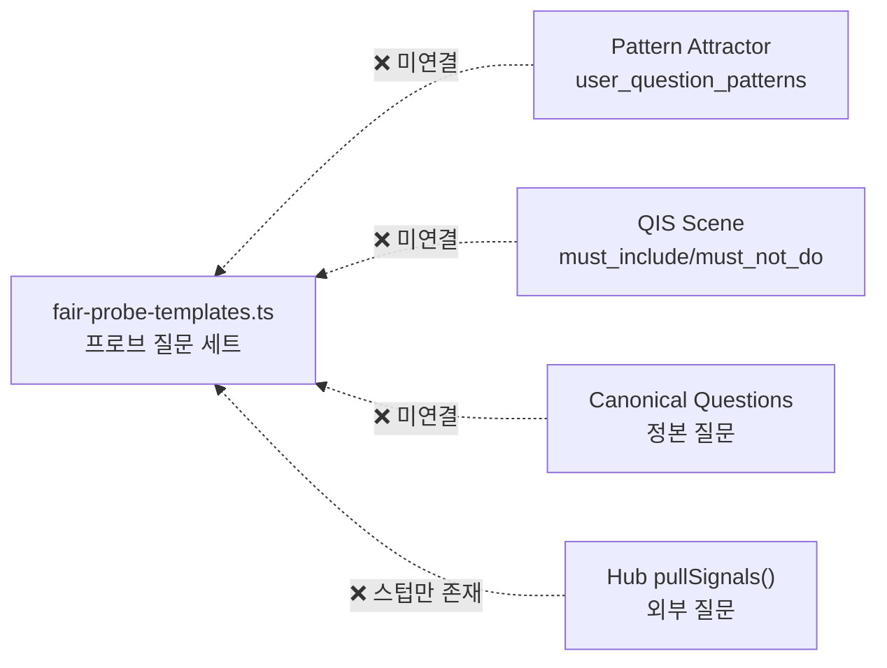
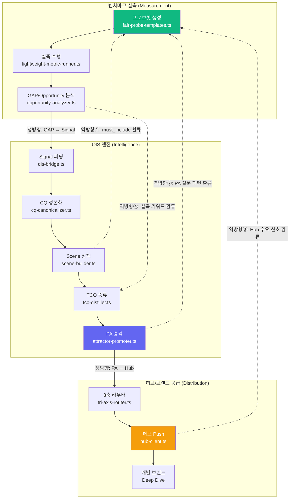

# 프로브셋 질문 ↔ QIS/Pattern Attractor 정방향·역방향 연계 분석

## 1. 현재 상태 진단

### 현재 구현된 정방향 흐름 (Probe → QIS)

```mermaid
graph LR
    A["fair-probe-templates.ts<br/>프로브 질문 생성"] --> B["lightweight-metric-runner.ts<br/>실측 수행"]
    B --> C["opportunity-analyzer.ts<br/>GAP/BlindSpot 발굴"]
    C --> D["qis-bridge.ts<br/>feedBenchmarkOpportunitiesToSignals()"]
    D --> E["question_signals 테이블<br/>시그널 등록"]
    E --> F["autoPromoteSignalToCQ()<br/>CQ 승격"]
    F --> G["QIS Scene + TCO 연결"]
    G --> H["attractor-promoter.ts<br/>Pattern Attractor 승격"]
```



> [!IMPORTANT]
> **이 정방향 파이프라인은 이미 코드로 구현되어 있습니다.** 다만 현재 벤치마크 스크립트(`run-benchmark.ts`)의 종료 후 자동으로 `qis-bridge` 호출이 트리거되지 않고 있어, **연결 고리가 끊어진 상태**입니다.

### 현재 구현된 역방향 흐름 (QIS → Probe) — ❌ 미구현



> [!CAUTION]
> **역방향 연결이 전혀 구현되어 있지 않습니다.** QIS에서 축적된 Scene 정책, TCO 제약 조건, Pattern Attractor의 `user_question_patterns`가 다음 벤치마크 프로브셋에 반영되지 못합니다. 이는 **측정과 운영이 단절된 '열린 루프(Open Loop)'** 상태입니다.

---

## 2. 정방향 연계 상세 (Benchmark → QIS → PA)

### 2-1. 이미 구현된 경로

| 단계 | 모듈 | 기능 | 상태 |
|------|------|------|------|
| ① 실측 | `lightweight-metric-runner.ts` | 질문별 응답 수집, 브랜드 언급/인용 분석 | ✅ 완료 |
| ② GAP 분석 | `opportunity-analyzer.ts` | gap, blind_spot, volatile, weak_mention 도출 | ✅ 완료 |
| ③ 시그널 피딩 | `qis-bridge.ts` → `feedBenchmarkOpportunitiesToSignals()` | `question_signals` 테이블에 자동 등록 | ✅ 코드 존재 |
| ④ CQ 승격 | `qis-bridge.ts` → `autoPromoteSignalToCQ()` | 시그널 → Capital Node → CQ → QIS Scene 생성 | ✅ 코드 존재 |
| ⑤ TCO 증류 | `tco-distiller.ts` | Scene에서 운영 TCO 개념 추출 | ✅ 코드 존재 |
| ⑥ PA 승격 | `attractor-promoter.ts` | CPS ≥ 68점 시 Pattern Attractor Spec 자동 생성 | ✅ 코드 존재 |
| ⑦ 3축 라우팅 | `tri-axis-router.ts` | Industry/Place/Vortex 축으로 허브 전달 | ✅ 코드 존재 |
| ⑧ 허브 Push | `hub-client.ts` → `pushPredictedQuestions()` | AIHompyHub로 질문 자산 전달 | ⚠️ 스텁만 존재 |

### 2-2. 끊어진 연결점 (3곳)

1. **`run-benchmark.ts` 종료 후 자동 피딩 미호출**: 벤치마크가 끝나면 `opportunity-analyzer`의 `auto_generated_signals`를 `qis-bridge`에 전달해야 하는데, 이 호출이 빠져있음
2. **`hub-client.ts`가 스텁**: 실제 API 엔드포인트 연결 부재
3. **LLM Judge 결과(`llm_cwr_winner`, `llm_bsf_score`)가 Opportunity 분석에 미반영**: 새로 추가한 LLM Judge 데이터가 GAP 판정 로직에 아직 활용되지 않음

---

## 3. 역방향 연계 설계 (QIS → Probe — 핵심 미구현 영역)

### 3-1. 설계 목표

**QIS/PA에서 축적된 "운영 지식"이 다음 벤치마크의 프로브 질문 품질을 자동 향상시키는 폐쇄 루프(Closed Loop).**



### 3-2. 역방향 환류 4개 채널

| 채널 | 원천 | 주입 대상 | 효과 |
|------|------|----------|------|
| **①** QIS Scene → Probe `must_include` | Scene의 `must_include`, `must_not_do` | `fair-probe-templates.ts` 질문 생성 시 TCO 키워드 자동 주입 | 프로브가 운영 현실(영업시간, 주차 등)을 반영 |
| **②** PA `user_question_patterns` → 신규 프로브 | Pattern Attractor의 trigger_state.user_question_patterns | 새로운 L2/L7 프로브 질문으로 동적 추가 | 실제 사용자가 묻는 패턴 기반 벤치마크 |
| **③** Hub 수요 신호 → 프로브 우선순위 | Hub `pullSignals()` 반환값 | 프로브 샘플링 가중치 조정 | 허브에서 많이 요청되는 질문 우선 측정 |
| **④** 실측 키워드 → TCO 보강 | Gemini `search_queries` + LLM Judge 응답 분석 | TCO Entity 자동 발견 및 기존 TCO 보강 | "흑돼지 숙성" 같은 새 TCO 자동 등록 |

---

## 4. 질문 자산(Question Asset) 획득 및 공급 파이프라인

### 4-1. "질문 자산"이란?

벤치마크 실측에서 자연 발생하는 다음 4가지 부산물이 곧 **질문 자산**입니다:

| 자산 유형 | 원천 | 가치 |
|----------|------|------|
| **Discovery Signal** | 실측 중 AI가 자발적으로 언급한 미등록 브랜드/키워드 | 새 고객 발굴 |
| **GAP Question** | 타겟 브랜드가 누락된 질문 | 콘텐츠 전략 처방전 |
| **Volatile Pattern** | 실측 간 응답이 바뀐 질문 | AI 불안정성 모니터링 |
| **CWR Winner Insight** | LLM Judge가 판정한 경쟁 우위 근거 | 경쟁 전략 인텔리전스 |

### 4-2. 공급 대상별 활용

```
┌─────────────────────────────────────────────────────────┐
│                    질문 자산 공급 체계                      │
├────────────┬────────────────────────────────────────────┤
│ 업종 허브   │ • GAP Question → 업종 공통 콘텐츠 미션 발행    │
│ (Industry) │ • Volatile Pattern → 업종 트렌드 리포트 생성    │
│            │ • Discovery Signal → 신규 브랜드 온보딩 리드    │
├────────────┼────────────────────────────────────────────┤
│ 지역 허브   │ • 제주 실측 GAP → 지역×업종 콘텐츠 미션        │
│ (Place)    │ • geo_keywords 기반 로컬 SEO 추천             │
│            │ • 3축 cross_axis → 지역+업종 교차 전략          │
├────────────┼────────────────────────────────────────────┤
│ 개별 브랜드  │ • 해당 브랜드의 GAP/BlindSpot → 처방전 카드      │
│ (Brand)    │ • CWR 패배 질문 → 경쟁 대응 콘텐츠 우선순위      │
│            │ • LLM Judge 근거 텍스트 → 콘텐츠 참고 자료       │
└────────────┴────────────────────────────────────────────┘
```

---

## 5. 현재 시스템의 구현 갭 요약

| 구분 | 항목 | 현재 상태 | 필요 작업 |
|------|------|----------|----------|
| 정방향 | 벤치마크 → Signal 피딩 | ⚠️ 코드 존재, 자동 호출 누락 | `run-benchmark.ts` 종료부에 `qis-bridge` 호출 추가 |
| 정방향 | Signal → CQ → Scene → PA | ✅ 완전 구현 | - |
| 정방향 | PA → Hub Push | ⚠️ 스텁 | `hub-client.ts` 실제 API 연동 |
| 역방향 | QIS Scene → Probe 환류 | ❌ 미구현 | `fair-probe-templates.ts`에 QIS 데이터 주입 로직 추가 |
| 역방향 | PA 패턴 → 프로브 동적 추가 | ❌ 미구현 | PA `user_question_patterns` → 프로브 변환기 신규 개발 |
| 역방향 | Hub Signal → 프로브 우선순위 | ❌ 미구현 | `pullSignals()` 실제 구현 + 샘플링 가중치 반영 |
| 자산 | 실측 키워드 → TCO 보강 | ❌ 미구현 | `search_queries` + LLM Judge → TCO 자동 발견 |
| 자산 | 질문 자산 → 허브/브랜드 공급 | ⚠️ 스텁 | 3축 라우터 + Hub Push 실제 연동 |
| 저장 | 실측 결과 DB 영구 저장 | ⚠️ 코드 존재, DB 연결 오류 | Supabase 인스턴스 활성화 |

> [!TIP]
> **핵심 인사이트:** 현재 시스템은 정방향 파이프라인의 코드가 대부분 준비되어 있지만 **"자동 트리거"가 누락**되어 있고, 역방향 환류는 **설계 자체가 부재**합니다. 이 두 가지를 해결하면 벤치마크 실측이 단순한 "측정"에서 **"질문 자산 생산 엔진"**으로 격상됩니다.
