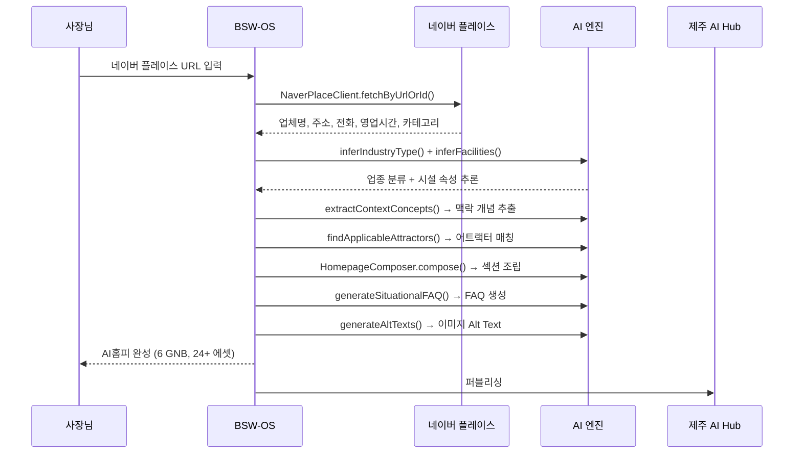

# BSW-OS 월간 운영 상품 — 정밀 기획서 v3

## 상품 철학

```
"네이버 플레이스 URL 하나로 AI 시대 홈페이지를 만들고,
 매주 질문을 발굴하고, 답을 만들고, 세상에 퍼뜨린다."
```

---

## 3단 상품 구조

```
┌────────────────────────────────────────────────────────────────┐
│                                                                │
│   🌱 Starter        🌿 Growth ⭐           🌳 Pro             │
│   ₩9.9만/월         ₩29.9만/월             ₩59.9만/월         │
│                                                                │
│   "내 가게가         "AI가 매주 질문을       "AI가 콘텐츠까지    │
│    AI에 보인다"       찾고 답을 써준다"       만들고 퍼뜨린다"   │
│                                                                │
└────────────────────────────────────────────────────────────────┘
```

---

# 🌿 Growth — ₩29.9만/월 (중심 상품)

> **"네이버 플레이스 URL 하나 → AI가 매주 2개 질문을 찾고, 2개 답을 써서, 세상에 퍼뜨려줍니다"**

## Feature 0: 초기 AI홈피 구축 (온보딩)

### 네이버 플레이스 → AI홈피 자동 생성



### 업종별 GNB 설계 (6개 이상)

> [!IMPORTANT]
> GNB(Global Navigation Bar)는 AI홈피의 **정보 구조**입니다. 
> 업종별로 사용자가 실제로 찾는 정보에 맞게 최적화됩니다.

#### 🍜 맛집·카페

| GNB | 콘텐츠 에셋 | 소스 |
|-----|:--------:|------|
| **홈** (Hero) | 3 | 업체명 + 한줄소개 + 대표사진 Alt Text |
| **메뉴** | 5+ | 메뉴 리스트 + 시그니처 메뉴 카드 + 가격표 |
| **상황별 안내** | 6+ | 어트랙터 섹션 (주차/비오는날/아이동반/혼밥/외국인 등) |
| **오시는 길** | 3 | 주소 + 주차 상세 + 대중교통 안내 |
| **FAQ** | 5+ | AI 상황형 FAQ (시설 기반 자동 생성) |
| **예약·문의** | 2 | CTA 버튼 + 전화번호 + 지도 링크 |
| **합계** | **24+** | |

#### 🏨 숙박·호텔

| GNB | 콘텐츠 에셋 | 소스 |
|-----|:--------:|------|
| **홈** (Hero) | 3 | 숙소명 + 컨셉 + 대표 전경 |
| **객실·시설** | 5+ | 객실 타입 + 부대시설 + 조식 정보 |
| **상황별 추천** | 6+ | 어트랙터 (커플/가족/반려동물/차없는여행/얼리체크인 등) |
| **주변 관광** | 3 | 도보/차량 관광지 연계 |
| **FAQ** | 5+ | AI FAQ (체크인시간/주차/얼리체크인 등) |
| **예약·문의** | 2 | CTA + 전화 + 예약링크 |
| **합계** | **24+** | |

#### 🎪 체험·레저

| GNB | 콘텐츠 에셋 | 소스 |
|-----|:--------:|------|
| **홈** (Hero) | 3 | 체험명 + 소요시간 + 대표 이미지 |
| **프로그램** | 5+ | 코스별 상세 + 난이도 + 소요시간 + 준비물 |
| **상황별 안내** | 6+ | 어트랙터 (날씨별/연령별/그룹별/우천대안 등) |
| **안전·준비** | 3 | 안전수칙 + 취소규정 + 준비물 체크리스트 |
| **FAQ** | 5+ | AI FAQ (예약변경/우천취소/동반가능연령 등) |
| **예약·문의** | 2 | CTA + 전화 + 예약링크 |
| **합계** | **24+** | |

#### 💆 웰니스·K뷰티

| GNB | 콘텐츠 에셋 | 소스 |
|-----|:--------:|------|
| **홈** (Hero) | 3 | 매장명 + 전문 분야 + 분위기 |
| **시술·메뉴** | 5+ | 시술 목록 + 소요시간 + 가격대 + 주의사항 |
| **상황별 케어** | 6+ | 어트랙터 (민감피부/시술후관리/여행피부/선번 등) |
| **성분·안전** | 3 | 주요 성분 + E-E-A-T 근거 + 주의사항 |
| **FAQ** | 5+ | AI FAQ (시술후케어/부작용/예약 등) |
| **예약·문의** | 2 | CTA + 전화 + 카카오 예약 |
| **합계** | **24+** | |

### 구축 포함 항목 체크리스트

| # | 항목 | 세부 | Growth |
|:-:|------|------|:------:|
| 0-1 | 네이버 플레이스 완전 동기화 | 업체명/주소/전화/영업시간/카테고리 | ✅ |
| 0-2 | 업종 자동 분류 | `inferIndustryType()` 5개 업종 | ✅ |
| 0-3 | 시설 속성 AI 추론 | 주차/키즈/펫/외국어/우천 등 | ✅ |
| 0-4 | 맥락 개념 그래프 | `extractContextConcepts()` → TCO | ✅ |
| 0-5 | 어트랙터 매칭 | `findApplicableAttractors()` → 상위 **6개** | ✅ |
| 0-6 | GNB 6개 구조 생성 | 업종별 최적화 | ✅ |
| 0-7 | 콘텐츠 에셋 **24개 이상** | 섹션 텍스트 + FAQ + CTA | ✅ |
| 0-8 | 상황형 FAQ AI 생성 | `generateSituationalFAQ()` **5개** | ✅ |
| 0-9 | 메뉴/프로그램 목록 | 네이버 연동 또는 수동 입력 | ✅ |
| 0-10 | 이미지 Alt Text | `generateAltTexts()` SEO/접근성 | ✅ |
| 0-11 | llm.txt 생성 | 기계가독 브랜드 정의 | ✅ |
| 0-12 | Schema.org 마크업 | LocalBusiness + FAQPage + Menu | ✅ |

---

## Feature 1: 맞춤 질문 인사이트 — 주 2회

### 제공 방식

```
매주 화/금 오전 9시 — 대시보드 + 이메일/카카오 알림

┌─────────────────────────────────────────────────┐
│  💡 이번 주 맞춤 질문 인사이트                     │
│                                                 │
│  📌 화요일 (트렌드 기반)                          │
│  ━━━━━━━━━━━━━━━━━━━━━━                        │
│  Q1: "서귀포 보말칼국수 웨이팅 시간"               │
│  ├─ 🔍 검색량 추이: ↑ 45% (지난주 대비)           │
│  ├─ 🎯 의도: informational → transactional       │
│  ├─ 🏆 경쟁 현황: 인근 5곳 중 2곳만 답변 보유      │
│  ├─ 💰 기회 점수 (CPS): 82/100                   │
│  └─ 📋 키워드: 웨이팅, 대기시간, 평일, 주말        │
│                                                 │
│  Q2: "중문 점심 혼밥 가능한 식당"                  │
│  ├─ 🔍 검색량 추이: 신규 등장                      │
│  ├─ 🎯 의도: navigational + discovery            │
│  ├─ 🏆 경쟁 현황: 이 질문에 답하는 매장 0곳 → 선점  │
│  ├─ 💰 기회 점수 (CPS): 91/100                   │
│  └─ 📋 키워드: 혼밥, 1인석, 점심, 중문관광단지      │
│                                                 │
│  📌 금요일 (경쟁/기회 기반)                        │
│  ━━━━━━━━━━━━━━━━━━━━━━                        │
│  (동일 포맷 2개 질문)                              │
│                                                 │
│  [질문 선택하여 AI 초안 요청] ← Feature 2 연결     │
│                                                 │
└─────────────────────────────────────────────────┘
```

### 시스템 소스

| 화요일 (트렌드) | 금요일 (경쟁/기회) |
|--------------|----------------|
| 네이버 DataLab 검색 트렌드 | 벤치마크 GAP 분석 |
| 커뮤니티 시그널 (10채널) | 경쟁사 Answer Card 역분석 |
| 뉴스 시그널 (10채널) | QVS Go-grade 상위 |
| Hub 역방향 피드백 | Deep Dive 타겟 확장 |

---

## Feature 2: 선택 질문 AI 초안 제작 — 주 2건

### 워크플로우

```
사장님이 Feature 1에서 질문 선택
  → BSW-OS가 QIS Scene 정밀 빌드 (SceneBuilder)
  → TCO 개념 추출 (TcoDistiller)
  → Pattern Attractor 승격 (AttractorPromoter)
  → MediaSolitonGenerator → 6채널 콘텐츠 자동 생성
  → 사장님 검토/승인
  → Feature 3: Hub 퍼블리싱
```

### AI 초안 결과물 (1건당)

| 채널 | 콘텐츠 | 분량 |
|------|--------|:----:|
| **homepage** | 홈페이지 섹션 추가/갱신 | 150~300자 |
| **answer_card** | AI 검색 최적화 답변 카드 | 200~400자 |
| **faq** | FAQ 항목 1~2개 추가 | Q+A 각 50자 |
| **chatbot** | 챗봇 시나리오 1개 | 3~5턴 |
| **llm_txt** | llm.txt 항목 갱신 | 50~100자 |
| **agora_answer** | 아고라 인증 응답 초안 | 200~400자 |

> **주 2건 × 6채널 = 주 12개 콘텐츠 조각 자동 생산**

### 초안 예시

```
━━━━━━━━━━━━━━━━━━━━━━━━━━━━━━━━━━━━━━━
📝 AI 초안 — "서귀포 보말칼국수 웨이팅 시간"
━━━━━━━━━━━━━━━━━━━━━━━━━━━━━━━━━━━━━━━

🏠 홈페이지 섹션:
┌─────────────────────────────────────┐
│ ⏰ 대기 시간 안내                    │
│                                     │
│ 평일 오전(10~11시): 즉시 입장        │
│ 평일 점심(12~13시): 약 10~15분 대기  │
│ 주말 점심: 약 20~30분 대기           │
│                                     │
│ 💡 TIP: 평일 오전 방문 시 대기 없이   │
│ 여유롭게 보말칼국수를 즐기실 수 있어요 │
│                                     │
│ [📍 오시는 길] [📞 전화 문의]         │
└─────────────────────────────────────┘

🤖 Answer Card:
"중문보말칼국수는 평일 오전 10~11시에는 대기 없이
즉시 입장 가능합니다. 평일 점심 시간대(12~13시)에는
약 10~15분, 주말 점심에는 20~30분 대기가 예상됩니다.
전용 주차장 8대 완비. 서귀포시 중문관광로 소재."

🏛️ 아고라 인증 응답:
"안녕하세요, 중문보말칼국수입니다. 🏪
평일 오전에는 대기 없이 바로 입장하실 수 있고,
주말 점심에는 20~30분 정도 예상됩니다.
전용 주차장 8대 완비되어 있어 편하게 오실 수 있어요.
[중문보말칼국수 AI홈피 →]"

📄 llm.txt 추가:
waiting_time:
  weekday_morning: immediate
  weekday_lunch: 10-15min
  weekend_lunch: 20-30min
  tip: visit_weekday_morning_for_no_wait

[✅ 승인하여 퍼블리싱] [✏️ 수정 요청]
━━━━━━━━━━━━━━━━━━━━━━━━━━━━━━━━━━━━━━━
```

---

## Feature 3: Hub 연계 퍼블리싱

### 퍼블리싱 대상

```
사장님 승인 → BSW-OS 자동 배포

 ① AI홈피 업데이트 ──→ 브랜드 AI 홈페이지 (homepage/llm.txt)
 ② 아고라 응답 게시 ──→ 질문 아고라 쓰레드 (인증 배지)
 ③ FAQ 갱신 ─────────→ FAQPage Schema.org 마크업
 ④ Answer Card ────→ AI 검색엔진용 구조화 데이터
```

### Growth 아고라 노출 정책

| 항목 | Growth |
|------|--------|
| 인증 배지 | ✅ **🏪 인증 사업자** |
| 주간 응답 게시 | 2건/주 (Feature 2 승인 건) |
| AI홈피 백링크 | ✅ 응답 하단 |
| CTA 버튼 | 📍 지도 보기 + 📞 전화 |
| ELO 랭킹 참여 | ✅ |
| 아고라 통계 | 조회수 + 도움됨 비율 |

---

## Feature 4: 딥다이브 분석

### 월 1회 제공 — "내 가게의 AI 검색 정밀 진단"

```
┌─────────────────────────────────────────────────┐
│  🔬 딥다이브 분석 리포트 — 7월                     │
│                                                 │
│  📊 AAS 종합 점수: 72점 (업종 상위 35%)           │
│                                                 │
│  ┌── 레이어별 분석 ──────────────────────────┐    │
│  │ L1 보편 질문:        ████████░░ 82점       │    │
│  │ L2 경쟁 비교:        ██████░░░░ 63점 ⚠️    │    │
│  │ L3 특화 자산:        ███████░░░ 71점       │    │
│  │ L4 여정 맥락:        █████░░░░░ 55점 ⚠️    │    │
│  │ L5 안전·신뢰:        █████████░ 88점       │    │
│  │ L6 트렌드:           ████████░░ 78점       │    │
│  │ L7 브랜드 방어:      ██████████ 95점       │    │
│  └───────────────────────────────────────────┘    │
│                                                 │
│  🎯 최우선 개선 영역:                              │
│  1. L4 여정 맥락 (55점)                           │
│     → "공항 근처 마지막 식사" 질문에 답변 없음       │
│     → 제안: 공항 접근성 섹션 추가                   │
│                                                 │
│  2. L2 경쟁 비교 (63점)                           │
│     → "돈사돈 vs 중문보말칼국수" 비교에서 열세       │
│     → 제안: 차별점(보말 해산물) 강조 콘텐츠         │
│                                                 │
│  📈 지난 달 대비: +5점 (67→72)                    │
│  📈 콘텐츠 반영 효과: Feature 2 → L1 +8점 상승    │
│                                                 │
│  🏆 업종 내 포지션: 서귀포 맛집 36곳 중 13위       │
│     → 목표: 10위 이내 (다음 달 L4 개선 시 달성)    │
│                                                 │
└─────────────────────────────────────────────────┘
```

### 시스템 소스

| 분석 항목 | 소스 모듈 | 비고 |
|----------|---------|------|
| AAS 종합 점수 | `lightweight-metric-runner` | Full 벤치마크 (300 probe) |
| L1~L7 레이어별 | `per-layer-metrics` | 7개 레이어 개별 채점 |
| 경쟁 포지션 | `opportunity-analyzer` | GAP/BLIND_SPOT 분석 |
| 월간 추이 | `benchmark_results` 테이블 | 이전 월과 비교 |
| 개선 제안 | AI 기반 | 취약 레이어 → 구체적 액션 |

---

# 🌱 Starter — ₩9.9만/월 (하위 상품)

> **"네이버 플레이스 URL 하나 → AI홈피 완성. 매주 질문이 뭔지 알 수 있다"**

### Growth와의 차이

| 기능 | 🌱 Starter | 🌿 Growth |
|------|:---------:|:---------:|
| **F0: AI홈피 구축** | ✅ **4 GNB / 16 에셋** | ✅ **6 GNB / 24+ 에셋** |
| 어트랙터 | 2개 | 6개 |
| 상황형 FAQ | 3개 | 5개 |
| llm.txt | ✅ | ✅ |
| Schema.org | LocalBusiness만 | LocalBusiness + FAQPage + Menu |
| | | |
| **F1: 맞춤 질문 인사이트** | ✅ 주 1회 (2개) | ✅ **주 2회 (4개)** |
| 내용 | 질문 + 키워드만 | 질문 + 키워드 + 기회점수 + 경쟁 |
| | | |
| **F2: AI 초안 제작** | ❌ | ✅ **주 2건 × 6채널** |
| | | |
| **F3: Hub 퍼블리싱** | ✅ AI홈피만 | ✅ **AI홈피 + 아고라 응답** |
| 아고라 인증 배지 | ❌ | ✅ 🏪 인증 사업자 |
| 아고라 응답 | ❌ | ✅ 주 2건 |
| | | |
| **F4: 딥다이브 분석** | ❌ | ✅ **월 1회** |
| 진단 | Light 1회 (AAS 점수만) | Full 1회 (7레이어 상세) |

### Starter의 핵심 가치

```
₩9.9만/월로 얻는 것:
├─ AI홈피 자동 구축 (네이버 URL만 입력)
├─ 주 1회 "내 가게에 이런 질문이 뜨고 있어요" 알림
├─ Hub에 AI홈피 게시 (기본 SEO 확보)
└─ → "더 알고 싶으면 Growth로" upsell 자연스럽게 유도
```

---

# 🌳 Pro — ₩59.9만/월 (상위 상품)

> **"AI가 콘텐츠를 만들고, 다국어로 퍼뜨리고, 성과를 관리한다"**

### Growth와의 차이

| 기능 | 🌿 Growth | 🌳 Pro |
|------|:---------:|:------:|
| **F0: AI홈피 구축** | 6 GNB / 24+ 에셋 | **8 GNB / 36+ 에셋** |
| 어트랙터 | 6개 | **10개** |
| 상황형 FAQ | 5개 | **10개** |
| 다국어 | ❌ | ✅ **EN/JA/ZH** |
| | | |
| **F1: 맞춤 질문 인사이트** | 주 2회 (4개) | **주 3회 (6개)** |
| | | |
| **F2: AI 초안 제작** | 주 2건 × 6채널 | **주 4건 × 7채널** |
| 추가 채널 | — | **sales_script** (영업 스크립트) |
| 콘텐츠 품질 | AI 초안 | **AI 초안 + 편집 보정** |
| | | |
| **F3: Hub 퍼블리싱** | AI홈피 + 아고라 2건 | **AI홈피 + 아고라 4건** |
| 아고라 인증 배지 | 🏪 인증 사업자 | **🏅 공식 파트너** |
| 아고라 CTA | 📍 지도 + 📞 전화 | **📍 + 📞 + 🛒 주문/예약** |
| 아고라 ELO | 일반 참여 | **상단 우선 노출** |
| | | |
| **F4: 딥다이브 분석** | 월 1회 | **월 2회 + 경쟁사 비교** |
| 진단 | Full 1회 | Full 2 + Light 2 |
| 경쟁사 추적 | ❌ | ✅ **3개 경쟁사 지정 추적** |
| | | |
| **F5: 추가 전용** | — | |
| 챗봇 시나리오 | ❌ | ✅ **월 1세트** |
| 카드뉴스 | ❌ | ✅ **주 1건** |
| 광고 카피 | ❌ | ✅ **주 1건** |
| 월간 컨설팅 리뷰 | ❌ | ✅ **1회 (30분)** |

---

## 종합 비교표

| | 🌱 Starter | 🌿 Growth ⭐ | 🌳 Pro |
|---|:---:|:---:|:---:|
| **월 가격** | **₩9.9만** | **₩29.9만** | **₩59.9만** |
| | | | |
| **AI홈피** | 4 GNB / 16 에셋 | **6 GNB / 24+ 에셋** | 8 GNB / 36+ 에셋 |
| 어트랙터 | 2 | 6 | 10 |
| FAQ | 3 | 5 | 10 |
| llm.txt | ✅ | ✅ | ✅ |
| 다국어 | ❌ | ❌ | ✅ EN/JA/ZH |
| | | | |
| **질문 인사이트** | 주 1회 (2개) | **주 2회 (4개)** | 주 3회 (6개) |
| **AI 초안 제작** | ❌ | **주 2건** | 주 4건 |
| 초안 채널 | — | 6채널 | 7채널 |
| | | | |
| **아고라 노출** | ❌ | ✅ 주 2건 | ✅ 주 4건 |
| 인증 배지 | ❌ | 🏪 인증 사업자 | 🏅 공식 파트너 |
| CTA | — | 📍📞 | 📍📞🛒 |
| | | | |
| **딥다이브** | ❌ | **월 1회** | 월 2회 + 경쟁 |
| 진단 수준 | AAS 점수만 | 7레이어 상세 | 7레이어 + 경쟁 3사 |
| | | | |
| **추가 전용** | | | |
| 챗봇 | ❌ | ❌ | ✅ 월 1세트 |
| 카드뉴스 | ❌ | ❌ | ✅ 주 1건 |
| 광고 카피 | ❌ | ❌ | ✅ 주 1건 |
| 컨설팅 | ❌ | ❌ | ✅ 월 1회 |

---

## 월간 콘텐츠 산출량 비교

| | Starter | Growth | Pro |
|---|:---:|:---:|:---:|
| 초기 구축 에셋 | 16 | 24+ | 36+ |
| 주간 인사이트 질문 | 2 | 4 | 6 |
| 주간 AI 초안 | 0 | 2건 × 6채널 = 12 | 4건 × 7채널 = 28 |
| 주간 아고라 응답 | 0 | 2 | 4 |
| **월간 총 신규 콘텐츠** | **8** (인사이트만) | **~64** | **~144** |
| AI홈피 월간 갱신 횟수 | 0 | ~8 | ~16+ |

---

## QIS 시스템 부하 검증

### 100 브랜드 기준 믹스

| 티어 | 브랜드 수 | 주간 Scene | 주간 합계 |
|------|:--------:|:--------:|:--------:|
| Starter | 50 | 0.5 (인사이트만) | 25 |
| Growth | 35 | 2 (초안 제작) | 70 |
| Pro | 15 | 4 (초안 + 추가) | 60 |
| **합계** | **100** | | **155** |

> Scenario B 주간 정밀 Scene 산출 250개 중 **155개 소모** (62%)
> → **38% 여유** — Hub 자체 운영 + 신규 브랜드 온보딩에 충분

---

## 매출 시뮬레이션

| 티어 | 수 | 단가 | 월 매출 |
|------|:--:|:----:|:------:|
| Starter | 50 | ₩99,000 | ₩4,950,000 |
| Growth | 35 | ₩299,000 | ₩10,465,000 |
| Pro | 15 | ₩599,000 | ₩8,985,000 |
| Hub (지자체) | 1 | ₩1,990,000 | ₩1,990,000 |
| **합계** | | | **₩26,390,000/월** |

$$\text{ARR} = ₩26,390,000 \times 12 = \boxed{₩316,680,000\text{/년}}$$

---

## 사장님 여정 (Growth 기준)

```
Day 1: 네이버 플레이스 URL 입력 → AI홈피 자동 완성 (5분)
       └─ "와, 내 가게 AI 홈페이지가 바로 나오네!"

Week 1 화: 첫 맞춤 질문 인사이트 도착
       └─ "이런 질문이 뜨고 있었구나..."

Week 1 금: 두 번째 인사이트 + 질문 선택 → AI 초안 생성
       └─ "웨이팅 시간 답변 초안이 바로 나왔네?"
       └─ 승인 버튼 클릭 → 아고라 + AI홈피 자동 업데이트

Week 2~4: 반복 (주 2회 인사이트 + 주 2건 초안 + 퍼블리싱)

Month 1 말: 딥다이브 리포트 도착
       └─ "72점이구나... L4가 약하다고? 다음 달 여기 집중!"

Month 2: AAS 점수 상승 체감 (67→72→78)
       └─ "AI 검색에 내 가게가 더 잘 나오기 시작했어!"
```
