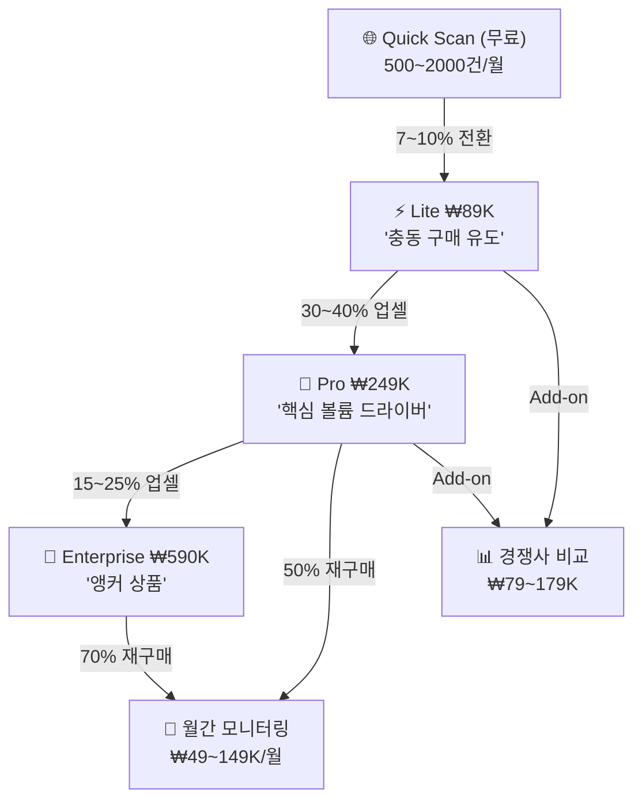

# BSW-OS 진단 상품 체계 고도화 설계안 v2.0

> 기존 3티어(Tier 0/1/2) 체계를 현재 구현 완료된 전 기능(V1 Surface Audit, V2 Parametric Persona, V3 Simulation & Fidelity, Deep-Dive Pipeline)을 반영하여 **4티어 체계**로 재설계합니다.

---

## 설계 원칙

1. **가치 사다리 명확화**: 각 티어가 "왜 더 비싼지"를 한 문장으로 설명할 수 있어야 한다
2. **비용 구조 안전**: 모든 유료 티어의 매출총이익률(Gross Margin) **≥ 85%** 유지
3. **고객 동선 설계**: Free → Lite(충동 구매) → Pro(핵심 볼륨) → Enterprise(앵커) 순서로 자연스러운 업셀 유도
4. **단일 티어 코드 매핑**: 각 상품이 코드의 `tier` 파라미터와 1:1 대응

---

## 상품 체계 총괄표

| | 🆓 **Quick Scan** | ⚡ **Lite** | 🔬 **Pro** | 🏢 **Enterprise** |
|---|---|---|---|---|
| **한줄 포지셔닝** | "우리 브랜드, AI가 알긴 하나?" | "AI가 우리를 어떻게 보는지 정밀 진단" | "브랜드 인지 구조를 통계적으로 해부" | "AI에서 우리 브랜드를 완벽 재현할 수 있는가?" |
| **코드 tier** | `free` | `tier1` | `tier1.5` | `tier3` |
| **가격 (VAT별도)** | **무료** | **₩89,000** (~$65) | **₩249,000** (~$185) | **₩590,000** (~$435) |
| **납품 형태** | 웹 대시보드 (즉시) | 웹 대시보드 + PDF 요약 | 웹 대시보드 + PDF 정밀 보고서 | 웹 대시보드 + 전략 보고서 (PDF 40p+) |
| **소요 시간** | ~30초 | ~3분 | ~8분 | ~15분 |
| **목표 고객** | 리드 생성 / 호기심 유저 | SMB · 1인 마케터 | 중견 브랜드 · 에이전시 | 대기업 · 컨설팅 |
| **API 원가** | ~₩0 | ~₩2,500 | ~₩18,000 | ~₩42,000 |
| **매출총이익률** | N/A | **97.2%** | **92.8%** | **92.9%** |

---

## 티어별 상세 기능 매트릭스

### A. Surface Audit (AI 검색 노출 진단)

| 기능 | Quick Scan | Lite | Pro | Enterprise |
|------|:---:|:---:|:---:|:---:|
| HTML-only 퀵 크롤링 (LLM 없음) | ✅ | ✅ | ✅ | ✅ |
| LLM 기반 Entity 추출 (상위 5페이지) | — | ✅ | ✅ | ✅ |
| 내장 지식 그래프 구성 | — | ✅ | ✅ | ✅ |
| AI 답변 카드 역설계 | — | ✅ | ✅ | ✅ |
| 프로브 생성 + QIS 교차 매핑 | — | ✅ | ✅ | ✅ |
| Entity Reflection (AI 반영 검증) | — | ✅ (5 probes) | ✅ (5 probes) | ✅ (5 probes) |
| **AEPI 종합 스코어** | 추정값 | ✅ 실측 | ✅ 실측 | ✅ 실측 |
| ERR 7축 레이더 차트 | 추정 | ✅ | ✅ | ✅ |
| Gap Quadrant 매트릭스 | — | ✅ | ✅ | ✅ |
| 최적화 처방전 목록 | — | ✅ | ✅ | ✅ |
| Temporal Trend (시계열 추적) | — | — | ✅ | ✅ |

### B. Parametric Persona (AI 브랜드 인지 진단)

| 기능 | Quick Scan | Lite | Pro | Enterprise |
|------|:---:|:---:|:---:|:---:|
| V1 관측 페르소나 (톤 벡터, 포지셔닝) | — | ✅ | — | — |
| V2 동적 프로브 생성 (업종 맞춤) | — | — | ✅ (B2C+B2B) | ✅ (B2C+B2B) |
| **통계적 반복 측정 (N회)** | — | — | **N=3** (72×2=144회) | **N=5** (120×2=240회) |
| 인지 강도 5요인 스코어링 | — | — | ✅ | ✅ |
| Vibe Drift Detection (정동 이탈 감지) | — | — | ✅ | ✅ |
| B2B vs B2C Gap Analysis | — | — | ✅ | ✅ |
| Cognitive Recall Map (자동 연상 키워드) | — | — | ✅ | ✅ |

### C. Persona Simulation & Fidelity (V3 심화 — Enterprise 전용)

| 기능 | Quick Scan | Lite | Pro | Enterprise |
|------|:---:|:---:|:---:|:---:|
| **PersonaSpec OS YAML 자동 생성** | — | — | — | ✅ |
| 16개 시뮬레이션 시나리오 동적 생성 | — | — | — | ✅ |
|  ↳ 12개 일반 (CUSTOMER/FAN/PRESS/CRISIS) | — | — | — | ✅ |
|  ↳ 4개 적대적 (BOUNDARY/PERSONA_BREAK/HALLUCINATION/COMPETITOR) | — | — | — | ✅ |
| **Actor-Judge Dual-LLM 시뮬레이션** | — | — | — | ✅ |
|  ↳ Baseline (사양서 없이) | — | — | — | ✅ |
|  ↳ Conditioned (사양서 적용) | — | — | — | ✅ |
| **8D Fidelity Score** | — | — | — | ✅ |
|  ↳ D1 정체성 일치도 | — | — | — | ✅ |
|  ↳ D2 정동 톤 매칭 | — | — | — | ✅ |
|  ↳ D3 모드 전환 정확도 | — | — | — | ✅ |
|  ↳ D4 근거 기반/환각 억제 | — | — | — | ✅ |
|  ↳ D5 금기/경계 준수율 | — | — | — | ✅ |
|  ↳ D6 Floor Risk (최저점 방어) | — | — | — | ✅ |
|  ↳ D8 Language DNA 일치도 | — | — | — | ✅ |
| **Delta Analysis** (Spec 효과 정량화) | — | — | — | ✅ |
| **Floor Risk Grade** (SAFE~CRITICAL) | — | — | — | ✅ |
| 최악 응답 Top-3 상세 분석 | — | — | — | ✅ |

### D. Deep-Dive Pipeline (질문 심층 분석)

| 기능 | Quick Scan | Lite | Pro | Enterprise |
|------|:---:|:---:|:---:|:---:|
| Diagnostic Engine (원인 진단) | — | — | ✅ (3회) | ✅ (무제한) |
| Target QIS Discovery (목표 질문 발굴) | — | — | ✅ (3회) | ✅ (무제한) |
| Deep-Dive Measurement (정밀 측정) | — | — | ✅ (3회) | ✅ (무제한) |
| Content Blueprint (콘텐츠 설계도) | — | — | — | ✅ |
| Impact Simulator (ROI 예측) | — | — | — | ✅ |
| CQ Auto-Registration (정규 질문 등록) | — | — | — | ✅ |

---

## LLM 호출 수 & 비용 상세 분석

### Quick Scan (무료)

```
LLM 호출: 0회
HTML 크롤링: 1~3 페이지
API 비용: ₩0
```

> [!NOTE]
> QuickSiteAnalyzer가 HTML만으로 AEPI를 추정합니다. LLM 비용 제로.

---

### Lite (₩89,000)

```
Step 1-6  크롤 + Entity + KG + AnswerCard + Probe + QIS : ~8 LLM 호출
Step 7    Entity Reflection (5 probes × 1 engine)       : ~5 LLM 호출
Step 8    AEPI 계산                                      : 0 (순수 연산)
Step 9    V1 Persona Analyze (1회)                       : ~2 LLM 호출
Step 10   Gap Analysis                                   : ~1 LLM 호출
────────────────────────────────────────────────────────────
합계                                                     : ~16 LLM 호출
```

| 항목 | 수량 | 단가 | 소계 |
|------|------|------|------|
| Gemini 2.5 Flash 입력 (평균 2K tokens) | 16 | ₩75 | ₩1,200 |
| Gemini 2.5 Flash 출력 (평균 1K tokens) | 16 | ₩75 | ₩1,200 |
| **API 원가 합계** | | | **~₩2,400** |
| 서버/인프라 (Vercel Pro 배분) | | | ~₩100 |
| **총 COGS** | | | **~₩2,500** |

> **매출총이익률: (89,000 − 2,500) / 89,000 = 97.2%**

---

### Pro (₩249,000)

```
Step 1-8  Surface Audit 전체                             : ~16 LLM 호출
Step 9    V2 Parametric Persona Pipeline:
          ├ Probe Generation (B2C + B2B)                 : 2 LLM 호출
          ├ Statistical Probing (24×3×2 = 144회)          : 144 LLM 호출
          ├ Cognitive Intensity Scoring                   : 0 (순수 연산)
          └ Vibe Drift Detection                         : 0 (순수 연산)
Step 10   Gap Analysis                                   : ~1 LLM 호출
Step 11   Temporal Trend                                 : 0 (연산)
Deep-Dive (3회 제한)                                     : ~9 LLM 호출
────────────────────────────────────────────────────────────
합계                                                     : ~172 LLM 호출
```

| 항목 | 수량 | 단가 | 소계 |
|------|------|------|------|
| Gemini 2.5 Flash 입력 | 172 | ₩75 | ₩12,900 |
| Gemini 2.5 Flash 출력 | 172 | ₩75 | ₩12,900 |
| Batch 병렬 할인 (추정 -30%) | | | -₩7,740 |
| **API 원가 합계** | | | **~₩18,060** |

> **매출총이익률: (249,000 − 18,060) / 249,000 = 92.7%**

---

### Enterprise (₩590,000)

```
Step 1-8  Surface Audit 전체                             : ~16 LLM 호출
Step 9    V2 Parametric Persona (N=5):
          ├ Probe Generation (B2C + B2B)                 : 2 LLM 호출
          ├ Statistical Probing (24×5×2 = 240회)          : 240 LLM 호출
          ├ Cognitive / Vibe 연산                         : 0
          V3 Simulation & Fidelity:
          ├ PersonaSpec YAML 자동 생성                    : 1 LLM 호출
          ├ Scenario Generation (16개)                    : 1 LLM 호출
          ├ Baseline Sim (16 actor + 16 judge)            : 32 LLM 호출
          └ Conditioned Sim (16 actor + 16 judge)         : 32 LLM 호출
Step 10   Gap Analysis                                   : ~1 LLM 호출
Deep-Dive (무제한, 평균 5회 가정)                          : ~15 LLM 호출
────────────────────────────────────────────────────────────
합계                                                     : ~340 LLM 호출
```

| 항목 | 수량 | 단가 | 소계 |
|------|------|------|------|
| Gemini 2.5 Flash 입력 | 340 | ₩75 | ₩25,500 |
| Gemini 2.5 Flash 출력 | 340 | ₩75 | ₩25,500 |
| Batch 병렬 할인 (추정 -30%) | | | -₩15,300 |
| PersonaSpec 생성 (고품질 모델 사용 시) | 1 | ₩2,000 | ₩2,000 |
| **API 원가 합계** | | | **~₩37,700** |
| 서버/인프라 (Vercel Pro 배분) | | | ~₩500 |
| PDF 전략 보고서 렌더링 | | | ~₩3,000 |
| **총 COGS** | | | **~₩41,200** |

> **매출총이익률: (590,000 − 41,200) / 590,000 = 93.0%**

---

## 가격 설계 근거

### 가격 앵커링 전략 (Decoy Effect 활용)

```
                Quick Scan     Lite          Pro           Enterprise
가격              ₩0          ₩89,000      ₩249,000       ₩590,000
LLM 호출 수         0            16           172            340
호출당 가격        N/A         ₩5,563        ₩1,448         ₩1,735
기능 수 (핵심)      3            11            22             35
기능당 가격        N/A         ₩8,091        ₩11,318       ₩16,857
```

> [!IMPORTANT]
> **Pro가 "호출당 가격" 기준으로 가장 저렴**하도록 설계하여, Pro를 **핵심 볼륨 티어(Volume Driver)**로 유도합니다.
> Enterprise는 "기능당 가격"은 높지만, **V3 시뮬레이션이라는 유일무이한 기능**이 가격 정당화의 핵심입니다.

### Lite → Pro 업셀 동기

| 비교 항목 | Lite | Pro | 차이 |
|-----------|------|-----|------|
| 가격 | ₩89K | ₩249K | **+₩160K (1.8배)** |
| LLM 호출 | 16 | 172 | **+156회 (10.8배)** |
| 핵심 기능 | 11 | 22 | **+11개 (2배)** |
| 페르소나 깊이 | V1 관측 (스냅샷) | V2 통계적 해부 | **질적 도약** |
| B2B/B2C 비교 | ❌ | ✅ | — |
| Deep-Dive | ❌ | ✅ (3회) | — |

> "1.8배 가격으로 10배의 분석 깊이" — 이 메시지가 Pro 전환의 핵심.

### Pro → Enterprise 업셀 동기

| 비교 항목 | Pro | Enterprise | 차이 |
|-----------|-----|------------|------|
| 가격 | ₩249K | ₩590K | **+₩341K (2.4배)** |
| 페르소나 | V2 (관찰자) | V3 (시뮬레이터) | **패러다임 전환** |
| PersonaSpec OS | ❌ | ✅ 자동 생성 | — |
| 8D Fidelity Score | ❌ | ✅ | — |
| 적대적 방어 테스트 | ❌ | ✅ Floor Risk | — |
| 콘텐츠 설계도 | ❌ | ✅ Blueprint | — |
| ROI 예측 | ❌ | ✅ Impact Sim | — |

> "AI가 우리 브랜드를 '알고 있는지'를 넘어, '완벽히 재현할 수 있는지'까지 증명" — 이것이 Enterprise의 가치 명제.

---

## 부가 상품 (Add-on)

### 🔄 월간 모니터링 서비스

| | Basic | Premium |
|---|---|---|
| **가격** | ₩49,000/월 | ₩149,000/월 |
| **적용 대상** | Pro 이상 구매 고객 | Enterprise 구매 고객 |
| **측정 주기** | 월 1회 자동 실행 | 월 2회 자동 실행 |
| **측정 범위** | Surface Audit + AEPI 재측정 | 전체 파이프라인 재실행 (Persona V2 포함) |
| **알림** | AEPI 10%+ 변동 시 이메일 | AEPI 5%+ 또는 Vibe Drift 감지 시 알림 |
| **트렌드 리포트** | ✅ 월별 ERR 추이 | ✅ 월별 ERR + Persona Drift 추이 |
| **API 원가** | ~₩5,000/회 | ~₩25,000/회 |
| **마진** | ~90% | ~83% |

### 📊 경쟁사 비교 분석 (Competitive Benchmark)

| | 기본 (2사 비교) | 확장 (5사 비교) |
|---|---|---|
| **가격** | ₩79,000 (1회) | ₩179,000 (1회) |
| **내용** | 자사 + 경쟁사 2개의 AEPI/ERR/Persona 비교 | 자사 + 경쟁사 5개 비교 |
| **적용 대상** | Lite 이상 구매 시 추가 옵션 | Pro 이상 구매 시 추가 옵션 |
| **API 원가** | ~₩5,000 | ~₩12,000 |

---

## 코드-상품 매핑 요약

```
┌─────────────────────────────────────────────────────────┐
│  상품명           코드 tier    price     LLM calls     │
├─────────────────────────────────────────────────────────┤
│  Quick Scan       'free'       ₩0           0          │
│  Lite             'tier1'      ₩89K        ~16         │
│  Pro              'tier1.5'    ₩249K      ~172         │
│  Enterprise       'tier3'      ₩590K      ~340         │
├─────────────────────────────────────────────────────────┤
│  (내부 테스트)     'tier2'      N/A        ~242         │
│  → tier2는 상품화하지 않고, 내부 QA/테스트 용도로 유지   │
└─────────────────────────────────────────────────────────┘
```

> [!TIP]
> 기존 `tier2`(N=5이지만 시뮬레이션 없음)는 별도 상품화하지 않습니다.
> Pro(tier1.5)에서 Enterprise(tier3)로의 **가치 점프**를 극대화하기 위해, 중간 단계를 의도적으로 비워둡니다. (Decoy Effect)

---

## 예상 수익 시나리오 (월 기준)

### 보수적 시나리오 (런칭 3개월 차)

| 티어 | 월 건수 | 단가 | 매출 | COGS | 매출총이익 |
|------|---------|------|------|------|------------|
| Quick Scan | 500 | ₩0 | ₩0 | ₩0 | ₩0 |
| Lite | 30 | ₩89K | ₩2,670K | ₩75K | ₩2,595K |
| Pro | 12 | ₩249K | ₩2,988K | ₩217K | ₩2,771K |
| Enterprise | 3 | ₩590K | ₩1,770K | ₩124K | ₩1,646K |
| 월간 모니터링 | 8 | ₩49~149K | ₩680K | ₩120K | ₩560K |
| **합계** | | | **₩8,108K** | **₩536K** | **₩7,572K** |

> 월 매출 ~810만원, 매출총이익률 **93.4%**

### 성장 시나리오 (런칭 12개월 차)

| 티어 | 월 건수 | 단가 | 매출 | COGS | 매출총이익 |
|------|---------|------|------|------|------------|
| Quick Scan | 2,000 | ₩0 | ₩0 | ₩0 | ₩0 |
| Lite | 120 | ₩89K | ₩10,680K | ₩300K | ₩10,380K |
| Pro | 45 | ₩249K | ₩11,205K | ₩813K | ₩10,392K |
| Enterprise | 10 | ₩590K | ₩5,900K | ₩412K | ₩5,488K |
| 월간 모니터링 | 35 | ₩49~149K | ₩2,800K | ₩490K | ₩2,310K |
| 경쟁사 비교 | 15 | ₩79~179K | ₩1,500K | ₩150K | ₩1,350K |
| **합계** | | | **₩32,085K** | **₩2,165K** | **₩29,920K** |

> 월 매출 ~3,200만원, 매출총이익률 **93.3%**

---

## 전환 퍼널 & GTM 전략



### 각 티어별 핵심 CTA (Call-to-Action)

| 단계 | CTA 메시지 | 전환 트리거 |
|------|-----------|------------|
| Quick Scan → Lite | "AI가 감지한 11개 약점 중 3개만 미리 보기로 표시됩니다. 전체 진단을 보시겠습니까?" | 정보 비대칭 해소 욕구 |
| Lite → Pro | "관측된 페르소나 '톤 벡터'가 업계 평균 대비 어긋나 있습니다. 통계적 정밀 분석으로 정확한 원인을 파악하세요." | 정밀도에 대한 불안 |
| Pro → Enterprise | "브랜드 인지 강도 72점. 하지만 AI가 실제로 이 브랜드를 '연기'하면 어떤 실수를 할까요? 시뮬레이션으로 확인하세요." | 위험 회피 동기 |

---

## 즉시 구현 가능 여부

| 기능 | 구현 상태 | 비고 |
|------|----------|------|
| Quick Scan (free) | ✅ 구현 완료 | `QuickSiteAnalyzer` |
| Lite (tier1) 전체 파이프라인 | ✅ 구현 완료 | Steps 1-10 + V1 Persona |
| Pro (tier1.5) 전체 파이프라인 | ✅ 구현 완료 | Steps 1-11 + V2 Parametric |
| Enterprise (tier3) 전체 파이프라인 | ✅ 구현 완료 | Steps 1-11 + V2 + V3 Simulation |
| Deep-Dive Pipeline | ✅ 구현 완료 | 8개 API 엔드포인트 |
| PDF 보고서 자동 생성 | ⬜ 미구현 | 3-5일 추가 개발 필요 |
| 결제 연동 (Stripe/토스) | ⬜ 미구현 | 2-3일 추가 개발 필요 |
| 월간 모니터링 Cron | ⬜ 미구현 | 1-2일 추가 개발 필요 |
| 경쟁사 비교 분석 | 🔶 부분 구현 | `competitors` 파라미터 있으나 확장 필요 |
| 고객 셀프서비스 UI (티어 선택) | ⬜ 미구현 | 3-5일 추가 개발 필요 |

> [!IMPORTANT]
> **핵심 진단 파이프라인(4개 티어 모두)은 100% 구현 완료 상태**입니다.
> 상품화에 필요한 추가 개발은 결제·PDF·모니터링 등 **주변 인프라**이며, 총 ~10-15일 정도 소요됩니다.
