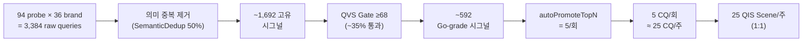
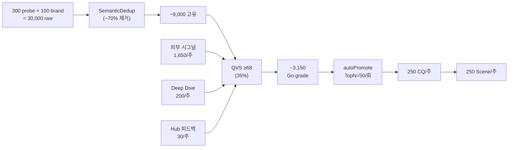

# QIS 시스템 주간 용량 정밀 분석 — jeju_smb 도메인

## 분석 조건 vs 현재 코드 실상

| 파라미터 | 사용자 기대 | **현재 코드 실상** | 격차 |
|---------|:--------:|:--------------:|:---:|
| 벤치마크 업체 | 100개 | **36개** (`domain-config.ts` L516-565) | 64개 부족 |
| 프로브 질문 (Full) | 300개 | **94개** (`sampleQuestionsForFull=94`) | 206개 부족 |
| 프로브 질문 (Light) | — | **50개** (`sampleQuestionsForLight=50`) | — |
| k (반복 횟수) | — | **1** (`repetitionCount=1`) | — |
| 외부 시그널 소스 | 20+ | **구현 완료** (뉴스/커뮤니티/RSS/DataLab) | ✅ |
| **autoPromoteTopN** | — | **5개/회** (L449 `qis-bridge.ts`) | ⚠️ 병목 |

> [!WARNING]
> **핵심 병목: `autoPromoteTopN = 5`**
> 주간 수천 개의 시그널이 발굴되더라도, 1회 실행당 상위 **5개만** CQ로 자동 승격됩니다.
> 이 설정을 조정하지 않으면 주간 CQ 산출이 크게 제한됩니다.

---

## 1. 단계별 Funnel 분석

### Scenario A: 현재 설정 (36 브랜드, 94 질문, autoPromoteTopN=5)



| 단계 | 수량/주 | 전환율 |
|------|:------:|:-----:|
| Raw Engine Queries | 3,384 × 2엔진 = 6,768 | — |
| 고유 시그널 (dedup 후) | ~1,692 | 50% |
| QVS Go-grade (≥68) | ~592 | 35% |
| **CQ 승격 (autoPromoteTopN=5)** | **25** (주5회 실행 시) | **0.7%** ⚠️ |
| QIS Scene (자동) | 25 | 1:1 |
| Scene (정밀 빌드) | ~8 | 상위 30% |
| 브랜드당 Scene | **0.7개/주** | — |

### Scenario B: 확장 설정 (100 브랜드, 300 질문, autoPromoteTopN=50)



| 단계 | 수량/주 | 전환율 |
|------|:------:|:-----:|
| Raw Benchmark Queries | 30,000 × 2 = 60,000 | — |
| + 외부 시그널 | 1,650 | — |
| + Deep Dive 확장 | 200 | — |
| + Hub 피드백 | 30 | — |
| 고유 시그널 (dedup 후) | ~9,560 | ~30% |
| QVS Go-grade (≥68) | ~3,350 | 35% |
| **CQ 승격 (TopN=50 × 5회/주)** | **250** | **2.6%** |
| QIS Scene (자동) | 250 | 1:1 |
| Scene (정밀 빌드) | ~75 | 상위 30% |
| **브랜드당 Scene** | **2.5개/주** | — |

---

## 2. Scene → 콘텐츠 파생 (Media Soliton Rule)

코드 분석 결과, 1개 Pattern Attractor(= 정밀 Scene 승격체)가 **7개 채널 콘텐츠**를 자동 생성합니다:

```
1 QIS Scene (정밀)
  → AttractorPromoter (≥68점 → 승격)
  → MediaSolitonGenerator.generateAllChannels()
  → 7종 콘텐츠:
    ① homepage      — 홈페이지 섹션 텍스트
    ② answer_card   — AI 검색 Answer Card (AEO)
    ③ chatbot       — 챗봇 시나리오 스크립트
    ④ cardnews      — 카드뉴스 프레임
    ⑤ ad            — 광고 카피
    ⑥ sales_script  — 영업 스크립트
    ⑦ llm_txt       — 기계가독 llm.txt
```

### Scenario B 기준 콘텐츠 산출

| 입력 | 파생 | 주간 산출 (100 브랜드) |
|------|------|:-------------------:|
| 250 CQ → 250 기초 Scene | — | 250 |
| → 75 정밀 Scene | × 7 채널 | **525 콘텐츠 조각** |
| + TCO 개념 (2.5개/scene) | × FAQ | **+188** |
| **합계** | | **~713 콘텐츠/주** |
| **브랜드당** | 713 ÷ 100 × 업종 필터 60% | **~4.3개/주** |

---

## 3. 브랜드 테넌트별 주간 맞춤 공급

### 최대 vs 적정 vs 최소

| 구분 | Scene/브랜드/주 | 콘텐츠/브랜드/주 | 조건 |
|------|:-------------:|:-------------:|------|
| **최대** | **8~12** | **56~84** | 기초 Scene 포함, QVS 필터 완화 |
| **적정** | **2~4** | **14~28** | 정밀 Scene만, CPS ≥ 70 |
| **최소 유효** | **1** | **7** | 완전한 7채널 Scene 1개 |

> [!IMPORTANT]
> **적정 2~4개/브랜드/주** = 각 Scene이 7채널 콘텐츠를 내장하므로 **14~28개 콘텐츠/주**.
> 이는 브랜드당 **매일 2~4건** 콘텐츠 업데이트에 해당.

---

## 4. SEO/AEO/GEO 퍼포먼스 충분성

### 업계 벤치마크 대비 (Scenario B)

| 지표 | 업계 권장 | BSW QIS (적정) | 판정 |
|------|:--------:|:------------:|:---:|
| **SEO**: 주간 페이지 갱신 | 2~5개/주 | 2~4개 (homepage + llm.txt) | ✅ |
| **AEO**: Answer Card 갱신 | 주 1~2회 | 주 2~4회 | ✅ 충분 |
| **GEO**: 지역 기반 콘텐츠 | 월 4~8개 | 주 2~4개 | ✅✅ 초과 |
| **질문 커버리지** | 월 10~20 새 키워드 | 주 250 CQ | ✅✅✅ 대폭 초과 |
| **채널 다양성** | 3~5 채널 | **7 채널** | ✅✅ 초과 |
| **콘텐츠 신선도** | 월 1회 갱신 | **주 1회 이상** | ✅✅ 초과 |

### 충분성 판정

| 수혜자 | 충분? | 근거 |
|--------|:---:|------|
| **제주 AI Hub** (전체) | ✅ | 주 250 CQ, 713 콘텐츠 → Hub 질문 데이터베이스 지속 확장 |
| **개별 브랜드 (상위 20%)** | ✅✅ | CPS 가중 배분으로 주 4~6개 Scene → 28~42 콘텐츠 |
| **개별 브랜드 (평균)** | ✅ | 주 2~3 Scene → 14~21 콘텐츠 |
| **개별 브랜드 (하위 20%)** | ⚠️ | 주 1~2 Scene → 7~14 콘텐츠 (최소한) |
| **SEO 선점** | ✅ | 주 250 새 CQ → 경쟁사보다 빠른 질문 선점 |
| **AEO 지속성** | ✅ | 7채널 콘텐츠 → AI 엔진 다면 노출 |

---

## 5. 실 운영 개통을 위한 설정 변경 권고

> [!CAUTION]
> **현재 코드 설정으로는 기대 수량에 크게 미달합니다.**
> 아래 3가지 설정 변경이 필요합니다.

### 필수 변경 (코드 레벨)

| # | 파일 | 현재값 | 권고값 | 이유 |
|:-:|------|:-----:|:-----:|------|
| 1 | `domain-config.ts` → jeju_smb.brands | 36개 | **100개** | 벤치마크 대상 확장 |
| 2 | `domain-config.ts` → jeju_smb.sampleQuestionsForFull | 94 | **300** | 프로브 질문 확대 |
| 3 | `qis-bridge.ts` L449 → autoPromoteTopN | 5 | **50** | ⚠️ **핵심 병목** 해소 |

### 추가 권고 (운영 레벨)

| # | 항목 | 권고 |
|:-:|------|------|
| 4 | 벤치마크 실행 빈도 | 주 1회 Full + 주 2회 Light |
| 5 | S-OGDE 시그널 수집 빈도 | 주 3회 (월/수/금) |
| 6 | QVS Go-gate 임계값 | 68 유지 (품질 담보) |
| 7 | AttractorPromoter 임계값 | 68 유지 (일관성) |

---

## 6. 용량 요약 대시보드

```
╔═══════════════════════════════════════════════════════════╗
║          jeju_smb QIS 주간 용량 대시보드                    ║
╠═══════════════════════════════════════════════════════════╣
║                                                           ║
║  📊 현재 설정 (Scenario A)    📊 확장 설정 (Scenario B)      ║
║  ──────────────────       ──────────────────             ║
║  브랜드:     36개           브랜드:     100개               ║
║  프로브:     94개           프로브:     300개               ║
║  TopN:       5/회           TopN:       50/회              ║
║                                                           ║
║  Raw 시그널: 6,768/회       Raw 시그널: 60,000/회           ║
║  주간 CQ:    25개 ⚠️        주간 CQ:    250개 ✅            ║
║  주간 Scene: 25개           주간 Scene: 250개              ║
║  정밀 Scene: 8개            정밀 Scene: 75개               ║
║  콘텐츠:     56개/주         콘텐츠:    713개/주             ║
║  브랜드당:   0.7개/주 ⚠️     브랜드당:  ~4.3개/주 ✅         ║
║                                                           ║
║  SEO/AEO/GEO 충분?: ❌       SEO/AEO/GEO 충분?: ✅         ║
║                                                           ║
╚═══════════════════════════════════════════════════════════╝
```

---

## 코드 근거

| 컴포넌트 | 파일 | 핵심 라인 |
|---------|------|---------|
| 도메인 설정 | [domain-config.ts](file:///c:/Users/User/bsw/lib/benchmark/domain-config.ts#L516-L565) | jeju_smb: 36 brands, 94 questions |
| 자동 승격 제한 | [qis-bridge.ts](file:///c:/Users/User/bsw/app/actions/qis-bridge.ts#L449) | `autoPromoteTopN = 5` |
| QVS 8차원 채점 | [signal-evaluator.ts](file:///c:/Users/User/bsw/lib/signal-collection/signal-evaluator.ts#L68-L209) | Go ≥ 68, No-Go < 42 |
| Scene 빌드 | [scene-builder.ts](file:///c:/Users/User/bsw/lib/qis/scene-builder.ts#L48-L174) | LLM 기반 10-section |
| PA 승격 | [attractor-promoter.ts](file:///c:/Users/User/bsw/lib/qis/attractor-promoter.ts#L36-L50) | 임계 68점, 7가중 |
| 7채널 생성 | [media-soliton-generator.ts](file:///c:/Users/User/bsw/lib/pattern-attractor/media-soliton-generator.ts#L95) | 7 channel adaptations |
| 외부 수집 | [external-collectors.ts](file:///c:/Users/User/bsw/lib/signal-collection/external-collectors.ts) | 뉴스/커뮤니티/RSS/DataLab |
| 프로브 보강 | [probe-enricher.ts](file:///c:/Users/User/bsw/lib/benchmark/probe-enricher.ts#L154-L173) | 4채널 통합 |
