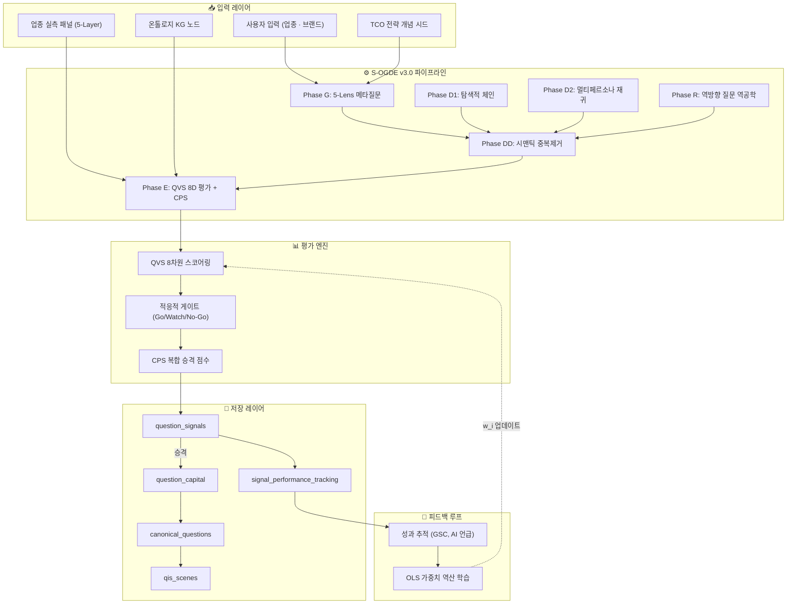
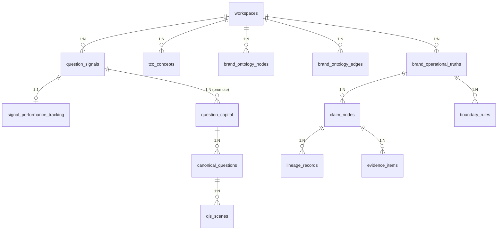

# QIS Full Pipeline 가이드북
## Question Intelligence System — 완전 운영 매뉴얼

> **Version**: 3.0 (S-OGDE v3.0 기반)  
> **Last Updated**: 2026-07-01  
> **대상 독자**: 시스템 운영자, 브랜드 마케터, SEO/AEO/GEO 실무자, 개발자

---

## 목차

1. [시스템 개요](#1-시스템-개요)
2. [아키텍처 총괄도](#2-아키텍처-총괄도)
3. [7단계 파이프라인 상세](#3-7단계-파이프라인-상세)
4. [QVS 8차원 평가 시스템](#4-qvs-8차원-평가-시스템)
5. [CPS 복합 승격 점수](#5-cps-복합-승격-점수)
6. [적응적 게이트 판정](#6-적응적-게이트-판정)
7. [TCO · KG · Claims 3중 실측 연동](#7-tco--kg--claims-3중-실측-연동)
8. [업종 실측 패널 5-Layer 그라운딩](#8-업종-실측-패널-5-layer-그라운딩)
9. [성과 피드백 루프 (Self-Learning)](#9-성과-피드백-루프-self-learning)
10. [데이터베이스 스키마 가이드](#10-데이터베이스-스키마-가이드)
11. [UI 페이지 가이드](#11-ui-페이지-가이드)
12. [운영 가이드](#12-운영-가이드)
13. [FAQ](#13-faq)
14. [용어 해설 사전](#14-용어-해설-사전)

---

## 1. 시스템 개요

### QIS란?

**QIS(Question Intelligence System)**는 AI 검색 시대의 **질문 자산(Question Asset)** 발굴·평가·관리·최적화를 위한 엔드투엔드 인텔리전스 시스템입니다.

기존 SEO가 "어떤 키워드를 타겟팅할 것인가"에 집중했다면, QIS는 **"소비자가 AI에게 어떤 질문을 할 것이며, 그 질문에 대한 답변에서 우리 브랜드가 어떻게 노출될 것인가"**를 과학적으로 분석합니다.

### QIS가 해결하는 문제

| 문제 | 기존 접근 | QIS 접근 |
|------|----------|---------|
| 질문 발굴 | 수동 키워드 리서치 | AI 5-Lens + 역방향 역공학 자동 발굴 |
| 가치 평가 | 볼륨/경쟁도 2차원 | SEO+AEO+GEO 8차원 + AHP 가중치 |
| 업종 적합성 | 범용 데이터 | TCO+KG+패널 3중 실측 그라운딩 |
| 평가 신뢰도 | 단일 LLM 출력 | N-회 반복 + σ 기반 통계적 신뢰도 |
| 가중치 고정 | 전문가 1회 설정 | 성과 피드백 OLS 자동 역산 학습 |
| 근거 추적 | 없음 | Claim-Evidence-Boundary SHA-256 인증 |

### 핵심 파이프라인 명칭: S-OGDE

**S-OGDE**(Signal-Organic Growth Discovery Engine)는 QIS의 핵심 질문 자산 발굴 엔진의 코드명입니다.

---

## 2. 아키텍처 총괄도



### 데이터 흐름 요약

```
업종+브랜드 입력
  │
  ├──→ Phase G: 25개 메타 질문 생성
  ├──→ Phase D1: 검색 기반 탐색 체인
  ├──→ Phase D2: 3-페르소나 재귀 트리
  └──→ Phase R: USP → 역추적 질문 경로
          │
          ▼
  Phase DD: 임베딩 클러스터링 중복 제거
          │
          ▼
  Phase E: QVS 8D (N-회 반복) + CPS + Gate
          │
          ├──[Go]──→ 자동 승격 → Capital → CQ → QIS Scene
          ├──[Watch]─→ 관찰 대기 (추후 재평가)
          └──[No-Go]─→ 폐기 (필터링)
                │
                ▼
        성과 추적 → OLS 가중치 학습 → QVS 가중치 자동 진화
```

---

## 3. 7단계 파이프라인 상세

### Phase 0: TCO/KG 부트스트랩

파이프라인 시작 전, 워크스페이스에 TCO 개념과 KG 노드가 존재하는지 확인합니다.

- **조건**: TCO 개념이 0건이면 자동 생성 트리거
- **동작**: `generateIndustryConcepts()` → 20개 업종 핵심 개념 AI 생성
- **소스**: ① 업종 패널 질문 ② 벤치마크 GAP 데이터 ③ 실시간 검색 그라운딩

```
[Phase 0 자동 판단 로직]
if (TCO concepts == 0) → 자동 생성
if (KG nodes == 0) → 자동 생성
if (둘 다 존재) → 스킵 (기존 데이터 활용)
```

---

### Phase G: 5-Lens 메타질문 엔진

소비자 심리학의 5가지 메타 관점으로 업종을 분석하여 **원시 시드 질문 25개**를 생성합니다.

| Lens | 관점명 | 분석 방향 | 예시 (스킨케어) |
|------|--------|----------|---------------|
| **Pattern** | 패턴 분석 | 반복되는 질문 구조 패턴 | "○○ vs ○○ 비교", "○○ 안전한가" |
| **Motivation** | 동기 분석 | 검색 뒤에 숨겨진 진짜 동기 | "피부 트러블 없이 효과 보고 싶다" |
| **Journey Stage** | 구매여정 | 인식→고려→구매→유지 단계별 | "레티놀 입문 추천 순서" |
| **Fear/Desire** | 공포/욕구 | 두려움과 강한 욕구 기반 | "레티놀 피부 벗겨짐 심하면" |
| **Counter** | 블라인드 스팟 | 아무도 묻지 않지만 물어야 할 질문 | "여드름약과 병용 가능 성분" |

> **TCO 시드 주입**: TCO 전략 개념이 존재하면 프롬프트에 가이드로 주입되어, 생성되는 질문이 업종 핵심 개념 체계를 반영하도록 유도합니다.

---

### Phase D1: Search-Grounded 탐색 체인

Phase G에서 생성된 시드 질문을 실제 AI 검색 엔진(Gemini Grounding API)에 질의하고, **실제 검색 결과의 정보 공백(Information Gap)**을 추출하여 후속 질문을 생성합니다.

```
[체인 흐름]
시드 질문 → AI 검색 결과 수신 → 정보 공백 추출 → 후속 질문 생성
                                                    ↓
                    후속 질문 → AI 검색 결과 수신 → 정보 공백 추출 → ...
                                                   (3-depth까지)
```

- **그라운딩 성공**: 실제 검색 데이터 기반 → `source: 'chain_grounded'`
- **그라운딩 실패**: LLM 자체 생성 폴백 → `source: 'chain_fallback'`
- 각 단계에서 `grounded: boolean` 플래그로 실측 여부 추적

> **핵심 차별점**: LLM이 "상상한" 질문이 아니라, 실제 AI 검색 결과에서 **빠져 있는 정보**를 기반으로 질문을 도출합니다.

---

### Phase D2: Multi-Persona 재귀 심화

3가지 소비자 페르소나가 **독립적으로** 질문 트리를 재귀적으로 확장합니다.

| 페르소나 | 한국어명 | 관점 | 질문 특성 |
|----------|---------|------|----------|
| **Skeptic** | 팩트체커 | 비판적 소비자 | 과학적 근거, 부작용, 함량 정확성 |
| **Pragmatist** | 가성비파 | 실용적 소비자 | 가격 비교, 대체품, 구매 채널 |
| **Novice** | 초보자 | 입문 소비자 | 사용 순서, 안전성, 기초 용어 |

```
[재귀 트리 구조]
씨앗 질문
  ├── Skeptic 분기: "레티놀 EWG 등급은?"
  │     ├── "레티놀 농도별 피부 자극 연구"
  │     └── "FDA 레티놀 사용 경고 사항"
  ├── Pragmatist 분기: "레티놀 세럼 가격대별 비교"
  │     ├── "다이소 레티놀 vs 브랜드 레티놀 차이"
  │     └── "레티놀 캡슐화 기술 가격 차이"
  └── Novice 분기: "레티놀 처음 쓸 때 순서"
        ├── "레티놀 사용 전 패치 테스트 방법"
        └── "레티놀 건조함 대처법"
```

- **maxDepth**: 3 (3단계까지 재귀)
- **branchFactor**: 3 (각 노드에서 3개 하위 질문)
- **maxTotalQuestions**: 15 (총 질문 수 상한)

---

### Phase R: 역방향 질문 역공학 (Reverse Question Engineering)

기존의 순방향(질문→답변→후속질문) 접근과 **반대 방향**으로 작동합니다.

```
[순방향]  질문 → 답변 → 후속질문 → 답변 → ...
[역방향]  타겟 답변(USP) ← 어떤 질문? ← 어떤 선행 질문? ← 최초 검색어?
```

**입력**: 브랜드의 USP(Unique Selling Proposition)  
**출력**: 해당 USP에 도달하기 위한 소비자의 3단계 질문 경로 5개

**예시** (USP: "DR.O 세럼은 특허 캡슐화 기술로 레티놀 자극을 80% 감소시킵니다"):

| 경로 | Step 1 (최초 검색) | Step 2 (중간 질문) | Step 3 (도달 질문) |
|------|-------------------|-------------------|-------------------|
| 경로 A | "민감 피부 레티놀 사용법" | "레티놀 자극 줄이는 기술" | "캡슐화 레티놀 세럼 추천" |
| 경로 B | "레티놀 부작용 최소화" | "레티놀 제형별 차이" | "특허 기술 레티놀 브랜드" |

> **핵심 차별점**: 마케팅 전환에 직결되는 질문 경로를 역설계하여, 콘텐츠 전략의 출발점으로 활용합니다.

---

### Phase DD: 시맨틱 중복 제거

앞선 모든 Phase에서 수집된 후보 질문을 **임베딩 벡터 공간**에서 클러스터링하여 의미적 중복을 제거합니다.

- **임베딩 모델**: Gemini text-embedding-004 (768차원)
- **클러스터링**: Agglomerative Clustering (코사인 유사도 ≥ 0.85)
- **대표 선정**: 클러스터 내 가장 간결한(shortest) 질문
- **가중치**: 클러스터 크기 = 해당 의도의 전략적 중요도 프록시

```
[중복 제거 예시]
입력: "나이아신아마이드 민감 피부" + "민감성 피부 나이아신아마이드 안전성" + "나이아신아마이드 자극 여부"
  → 코사인 유사도 0.91, 0.88 → 동일 클러스터
  → 대표: "나이아신아마이드 자극 여부" (가장 간결)
  → 클러스터 가중치: 3 (3개 변형 → 높은 전략 중요도)
```

---

### Phase E: QVS 8D 평가 + CPS 산출 + Gate 판정

중복 제거된 후보를 배치(5개씩) 단위로 다차원 평가합니다.

1. **볼륨 추정** (VolumeEstimator)
2. **패널 Layer 매칭** (업종 패널과 교차)
3. **QVS 8D 평가** (N-회 반복, CoT 포함)
4. **KG 커버리지 계산** (TcoKgMapper)
5. **TCO 개념 매칭** (자카드 유사도)
6. **YMYL 자동 감지** (패널 L5_ymyl 또는 risk_level=high)
7. **Gate 필터링** (No-Go/unfit 제거)
8. **CPS 복합 점수 산출** (Percentile Rank 정규화)

> 상세는 아래 섹션 4~6에서 설명합니다.

---

## 4. QVS 8차원 평가 시스템

### 평가 차원 상세

QVS는 **Quality-Volume Score**의 약자로, 질문의 다차원적 가치를 0~100 범위의 단일 스칼라로 정량화합니다.

#### SEO 전통 5차원

| # | 차원 | 가중치 | 측정 대상 |
|---|------|--------|----------|
| 1 | **Relevance** (관련성) | 0.18 | 브랜드 핵심 영역과의 부합도 |
| 2 | **Specificity** (구체성) | 0.10 | Long-tail 정도, 검색 의도 구체성 |
| 3 | **Urgency** (긴급성) | 0.07 | 고통 포인트, 즉시 해결 필요성 |
| 4 | **Opportunity** (기회도) | 0.12 | 검색 경쟁도의 역수 (블루오션 정도) |
| 5 | **Conversion** (전환력) | 0.18 | 상업적 전환으로 이어질 가능성 |

#### AEO/GEO 신규 3차원

| # | 차원 | 가중치 | 측정 대상 |
|---|------|--------|----------|
| 6 | **Snippet Fitness** (AEO) | 0.15 | AI Featured Snippet 직접 채택 적합도 |
| 7 | **Entity Clarity** (GEO) | 0.10 | 지식 그래프 엔티티 식별 명확도 |
| 8 | **Multi-Engine Consistency** (GEO) | 0.10 | 다중 AI 엔진 간 일관 답변 유도 가능성 |

### 가중치 산출 방법: AHP

가중치는 주관적 할당이 아닌, **AHP(Analytic Hierarchy Process)** 쌍비교 매트릭스의 고유벡터(eigenvector)에서 수학적으로 유도됩니다.

- 일관성 비율(CR) = 0.04 < 0.10 (허용 기준 충족)
- 가중치 합계 = 1.00

### N-회 반복 신뢰도 평가

LLM 평가의 확률적 불확실성을 통계적으로 제어합니다.

```
[3-회 반복 예시]
Run 1: QVS = 72.5
Run 2: QVS = 68.3
Run 3: QVS = 71.1
───────────────
평균 (μ) = 70.63
표준편차 (σ) = 2.16
신뢰도 = high (σ < 5.0)
```

| σ 범위 | 신뢰도 등급 | 의미 |
|--------|-----------|------|
| σ < 5.0 | **high** | LLM이 이 질문의 가치에 대해 확신 |
| 5.0 ≤ σ < 10.0 | **medium** | 어느 정도 불확실성 존재 |
| σ ≥ 10.0 | **low** | LLM이 이 질문의 가치를 판단하지 못함 |

---

## 5. CPS 복합 승격 점수

**CPS(Composite Promotion Score)**는 QVS 외에 볼륨, TCO 매칭, KG 커버리지, YMYL 위험도를 종합한 최종 승격 우선순위 점수입니다.

### CPS 공식

$$CPS = 0.30 \cdot P(QVS) + 0.25 \cdot P(Vol) + 0.20 \cdot \frac{TCO_{match}}{10} + 0.15 \cdot \frac{KG_{cov}}{10} + 0.10 \cdot W_{YMYL}$$

| 구성 요소 | 가중치 | 정규화 방법 | 설명 |
|----------|--------|-----------|------|
| QVS Total | 0.30 | Percentile Rank | 배치 내 상대 순위 |
| Volume | 0.25 | Percentile Rank | 추정 검색량 상대 순위 |
| TCO Match | 0.20 | 0~10 → 0~1 | TCO 개념 매칭 수 (최대 10) |
| KG Coverage | 0.15 | 0~10 → 0~1 | KG 노드 커버리지 (3개↑ = 만점) |
| YMYL Weight | 0.10 | 1.0 또는 0.5 | YMYL 해당 시 1.0, 비해당 0.5 |

### Percentile Rank 정규화

분포에 독립적인(distribution-agnostic) 정규화 방법입니다.

$$P(x) = \frac{|\{v \in S : v < x\}| + \frac{|\{v \in S : v = x\}|}{2}}{|S|}$$

---

## 6. 적응적 게이트 판정

QVS 평균과 브랜드 적합도를 결합한 3단계 판정입니다.

```
┌─────────────────────────────────────────────────┐
│              Gate 판정 로직                       │
├─────────────────────────────────────────────────┤
│                                                 │
│  if brand_fit == 'unfit':                       │
│      → 🔴 No-Go (브랜드 무관 즉시 제거)           │
│                                                 │
│  elif QVS_mean ≥ 68 AND brand_fit == 'fit':     │
│      → 🟢 Go (고가치 자산 즉시 승격)              │
│                                                 │
│  elif QVS_mean < 42:                            │
│      → 🔴 No-Go (저가치 자산 폐기)               │
│                                                 │
│  else:                                          │
│      → 🟡 Watch (관찰 대상, 추후 재판정)          │
│                                                 │
└─────────────────────────────────────────────────┘
```

| 판정 | 후속 조치 |
|------|----------|
| 🟢 **Go** | `status = 'promoted'` → Capital → CQ → QIS Scene 자동 생성 |
| 🟡 **Watch** | `status = 'mined'` → DB 저장, 수동 프로모션 가능 |
| 🔴 **No-Go** | 파이프라인에서 즉시 폐기 (DB 미저장) |

---

## 7. TCO · KG · Claims 3중 실측 연동

### 7.1 TCO (Thematic Concept Ontology) — 주제 개념 온톨로지

업종별 핵심 운영 개념을 구조화한 사전입니다.

**생성 방식**: 3-소스 그라운딩
1. 업종 패널 질문에서 TF-IDF 대표 질문 추출 → 개념 도출
2. 벤치마크 GAP 데이터에서 경쟁 열위 영역 추출
3. 실시간 검색 그라운딩에서 인용 도메인 키워드 추출

**활용**:
- Phase G 메타질문 생성 시 TCO 시드를 프롬프트에 주입 → 업종 깊이 확보
- Phase E 평가 시 TCO 매칭 점수 → CPS에 20% 가중치 반영
- 전략적 개념(is_strategic=true)만 시드로 사용 (최대 15개)

### 7.2 KG (Knowledge Graph) — 온톨로지 지식 그래프

브랜드의 지식 체계를 **7가지 노드 타입**과 **8가지 엣지 제약**으로 구조화합니다.

**노드 타입**:
| 타입 | 레벨 | 예시 |
|------|------|------|
| concept | class | "보습", "항산화" |
| product | instance | "DR.O 레티놀 세럼" |
| service | instance | "피부 상담 서비스" |
| concern | class | "자극감", "건조" |
| process | instance | "캡슐화 공정" |
| regulation | class | "화장품법 기준" |
| persona | instance | "민감 피부 20대" |

**자동 검증 (KGValidator)**:
1. 순환 참조 감지 (DFS 기반)
2. 고아 노드 감지 (연결 없는 노드)
3. 타입 제약 위반 검증 (도메인/레인지)
4. 필수 엣지 검증 (instance → is_a 필수)
5. 중복 엣지 감지

**자가 치유**: 위반 사항 자동 수정 (`validateAndFix()`)

### 7.3 Claims — 주장 리니지 추적

콘텐츠에 포함된 주장(Claim)의 **근거 체인**을 암호학적으로 검증합니다.

```
[6단계 검증 파이프라인]
1. Claim Node 조회
2. 상위 Operational Truth의 risk_level 확인
3. Lineage Record 연결 확인
4. Evidence Item 존재 + 검증 상태 확인
5. high/critical risk → Boundary Rule 필수 확인
6. 전체 통과 → SHA-256 암호 서명 발행
```

**Claim → Evidence → Boundary Rule 관계**:
```
Operational Truth (위험등급 보유)
    └── Claim Node (주장)
         ├── Evidence Item (근거 자료, 검증 상태)
         ├── Boundary Rule (YMYL 안전 규칙)
         └── Lineage Record (연결 기록)
              → SHA-256 Verification Signature
```

---

## 8. 업종 실측 패널 5-Layer 그라운딩

### 5-Layer 패널 구조

| Layer | 명칭 | 성격 | 위험등급 | 예시 |
|-------|------|------|---------|------|
| **L1** | Direct | 브랜드 직접 질문 | low | "DR.O 세럼 가격" |
| **L2** | Comparison | 경쟁 비교 | low~medium | "DR.O vs 이니스프리" |
| **L3** | Experience | 경험/후기 | medium | "레티놀 자극감 후기" |
| **L4** | Expert | 전문 지식 | medium | "캡슐화 기술 원리" |
| **L5** | YMYL | 의료·법률·금융 | **high** | "임산부 레티놀 안전성" |

### 패널 질문 메타데이터

각 패널 질문에는 풍부한 메타데이터가 부착됩니다:

```typescript
{
  question_text: "나이아신아마이드 민감 피부 안전성",
  intent_context: "성분 안전성 확인",
  target_keyword: "나이아신아마이드 민감피부",
  risk_level: "medium",
  decision_stage: "consideration",
  layer: "L3_experience",
  query_variants: ["니코틴아마이드 자극 여부", ...],
  must_include: ["임상 데이터", "농도 범위"],
  should_include: ["피부 타입별 권장"],
  must_not_do: ["의약품 효능 주장 금지"]
}
```

### 파이프라인 내 활용

1. **Phase E 패널 매칭**: 후보 질문과 패널 질문을 매칭하여 Layer 할당
2. **YMYL 자동 감지**: L5_ymyl 또는 risk_level=high → `is_ymyl = true`
3. **Claim 자동 생성**: 승격 시 패널의 `must_include` → Evidence, `must_not_do` → Boundary Rule

---

## 9. 성과 피드백 루프 (Self-Learning)

### 피드백 루프 아키텍처

```
시그널 승격 → 콘텐츠 발행 → 성과 측정(30일) → 가중치 학습 → QVS 재교정
     ↑                                                    │
     └────────────────────────────────────────────────────┘
```

### 추적 메트릭

| 메트릭 | 소스 | 설명 |
|--------|------|------|
| impressions_30d | GSC | 30일 누적 노출수 |
| clicks_30d | GSC | 30일 누적 클릭수 |
| ctr_30d | 계산 | 클릭률 |
| avg_position_30d | GSC | 평균 검색 순위 |
| ai_mention_rate | 벤치마크 | AI 응답 내 브랜드 언급률 |
| actual_conversion | 분석 | 검색→전환 비율 |

### 실현 가치 (Realized Value)

$$V_{realized} = clicks \times 2.0 + conversion \times 50.0 + ai\_mention \times 5.0$$

### OLS 가중치 역산

10건 이상의 성과 데이터가 축적되면 활성화:

1. QVS 8차원 점수($X$)와 실현 가치($Y$)의 공분산 산출
2. 음수 공분산 클리핑 (최소 0.01)
3. 합계 1.0 정규화 → 새 가중치 벡터
4. AHP 초기 가중치 대신 학습된 가중치 적용

> **효과**: 업종별·브랜드별 "실제로 성과가 나는 차원"에 자동으로 가중치가 집중됩니다.

---

## 10. 데이터베이스 스키마 가이드

### 핵심 테이블 관계



### question_signals 주요 컬럼

| 컬럼 | 타입 | 설명 |
|------|------|------|
| query | TEXT | 질문 텍스트 |
| volume | INTEGER | 추정 검색량 |
| intent | VARCHAR | 검색 의도 유형 |
| status | VARCHAR | mined / promoted / ignored |
| **qvs_total** | NUMERIC(5,3) | QVS 8차원 가중합 총점 |
| **qvs_dimensions** | JSONB | 8차원 세부 점수 |
| **cps_score** | NUMERIC(4,3) | CPS 복합 승격 점수 |
| **is_ymyl** | BOOLEAN | YMYL 해당 여부 |
| **gate_status** | VARCHAR(20) | Go/Watch/No-Go |
| **eval_confidence** | VARCHAR(20) | high/medium/low |
| **panel_layer** | VARCHAR(50) | L1~L5 패널 계층 |
| **source** | VARCHAR(100) | 소스 (organic_mining 등) |

---

## 11. UI 페이지 가이드

### 9개 핵심 페이지

| 페이지 | 경로 | 기능 |
|--------|------|------|
| **Dashboard** | `/semantic-core` | 전체 현황 + One-Click E2E 파이프라인 |
| **Signals** | `/semantic-core/signals` | 시그널 발굴, QVS/Gate 확인, 배치 승격 |
| **Question Capital** | `/semantic-core/capital` | 승격된 질문 자산 관리 |
| **Canonical Questions** | `/semantic-core/cq` | CQ 표준화 관리, SHA-256 서명 |
| **QIS Scenes** | `/semantic-core/qis` | Query-Intent-Scenario 씬 관리 |
| **TCO Concepts** | `/semantic-core/concepts` | 업종 핵심 개념 사전 관리 |
| **Knowledge Graph** | `/semantic-core/kg` | 온톨로지 KG 시각화, AI 생성 |
| **Claims** | `/semantic-core/claims` | Claim 리니지 추적, 검증 트리거 |
| **QIS Tri-Axis** | `/semantic-core/qis-tri-axis` | 3축 허브 교차 분석 |

### Signals 페이지 QVS/Gate 컬럼

| 컬럼 | 표시 | 색상 규칙 |
|------|------|----------|
| **QVS** | 0~100 숫자 | ≥70 🟢초록 / ≥40 🟡노랑 / <40 🔴빨강 |
| **GATE** | Go/Watch/No-Go 배지 | Go 🟢 / Watch 🟡 / No-Go 🔴 |
| **YMYL** | 오렌지 배지 | 의료·법률·금융 해당 시 표시 |

---

## 12. 운영 가이드

### 최초 셋업

1. **Supabase 마이그레이션 실행**: `db/migrations/0033_qis_advanced_columns.sql`
2. **업종 선택**: Dashboard에서 사전 정의 도메인 선택
3. **TCO 자동 생성**: 최초 E2E 파이프라인 실행 시 자동 (Phase 0)
4. **KG 자동 생성**: 동일하게 자동 (Phase 0)

### 일상 운영

```
[일일 운영 루틴]
1. Dashboard에서 One-Click E2E 실행
2. Signals 페이지에서 QVS/Gate 확인
3. Watch 시그널 중 유망한 것 수동 승격
4. Claims 페이지에서 새 Claim 검증 트리거
5. 주간: 성과 피드백 데이터 확인
```

### 벤치마크 기회 피딩

벤치마크 분석에서 발견된 경쟁 기회(GAP/BLIND_SPOT)를 자동으로 시그널에 주입합니다.

```
벤치마크 스냅샷 (GAP/BLIND_SPOT)
    → feedBenchmarkOpportunitiesToSignals()
    → question_signals에 자동 등록 (중복 제외)
```

---

## 13. FAQ

**Q: QVS 점수가 모두 비슷하게 나옵니다 (Central Tendency Bias).**
> A: CoT 앵커링이 적용되어 있으나, `repeatEval`을 3으로 설정하여 N-회 반복 평가로 분산을 확인하세요. σ가 낮다면 LLM이 확신하는 점수입니다.

**Q: TCO 개념이 업종과 맞지 않습니다.**
> A: `industryKey`가 올바르게 전달되는지 확인하세요. Dashboard에서 업종을 선택한 후 E2E를 실행하면 `domainConfig.industryType`이 자동 주입됩니다.

**Q: Gate에서 No-Go로 너무 많이 필터링됩니다.**
> A: 임계값(68/42)은 향후 워크스페이스 분포 기반 적응적 임계값(μ±1σ)으로 교체될 예정입니다. 현재는 `brand_fit='partial'`인 질문이 Go에 도달하려면 QVS≥68 필요합니다.

**Q: 시맨틱 중복 제거가 한국어에서 잘 작동하나요?**
> A: Gemini text-embedding-004는 다국어 지원 모델로, 한국어 시맨틱 유사도 계산에 적합합니다. 임계값 0.85는 한국어 환경에서 테스트된 값입니다.

**Q: 피드백 루프 가중치 학습은 언제 활성화되나요?**
> A: `signal_performance_tracking`에 10건 이상의 성과 데이터가 축적되면 `learnWeights()` 호출 시 자동 활성화됩니다. 그 전까지는 AHP 초기 가중치가 사용됩니다.

---

## 14. 용어 해설 사전

### A

| 용어 | 영문 | 설명 |
|------|------|------|
| **AEO** | Answer Engine Optimization | AI 검색 엔진의 직접 답변(Featured Snippet)에 콘텐츠가 채택되도록 최적화하는 전략 |
| **AHP** | Analytic Hierarchy Process | 의사결정 과학에서 쌍비교 매트릭스를 통해 가중치를 수학적으로 유도하는 방법론. 본 시스템에서는 QVS 8차원 가중치 산출에 사용 |
| **Agglomerative Clustering** | — | 하향식 계층적 군집화. 가장 유사한 요소부터 합쳐나가는 방식. Phase DD에서 시맨틱 중복 제거에 사용 |

### B

| 용어 | 영문 | 설명 |
|------|------|------|
| **Boundary Rule** | — | YMYL 콘텐츠에 대한 안전 규칙. 예: "의약품 효능 주장 금지". Claim 검증 시 high/critical 위험등급에서 필수 확인 |
| **Brand Fit** | — | 질문의 브랜드 적합도. fit(핵심 관련)/partial(간접 관련)/unfit(무관). unfit은 즉시 No-Go |

### C

| 용어 | 영문 | 설명 |
|------|------|------|
| **Claim Lineage** | — | 콘텐츠 주장(Claim)의 근거 체인. Operational Truth → Claim → Evidence → Boundary Rule의 연결 구조 |
| **CoT** | Chain-of-Thought | LLM이 최종 답변 전에 논리적 근거를 먼저 서술하도록 강제하는 프롬프팅 기법. QVS 평가의 앵커링 편향 방지에 사용 |
| **CPS** | Composite Promotion Score | QVS, 볼륨, TCO 매칭, KG 커버리지, YMYL을 통합한 복합 승격 우선순위 점수 (0~1) |
| **CQ** | Canonical Question | 표준화된 질문. SHA-256 서명으로 중복 방지. Question Capital에서 승격된 최종 질문 자산 |

### E

| 용어 | 영문 | 설명 |
|------|------|------|
| **E2E Pipeline** | End-to-End Pipeline | TCO/KG 부트스트랩부터 시그널 발굴, 평가, 승격, 성과 추적까지 전체를 한번에 실행하는 통합 파이프라인 |
| **Entity Clarity** | — | QVS 8차원 중 하나 (GEO). 지식 그래프에서 엔티티로 명확히 식별 가능한 정도 |
| **Evidence Item** | — | Claim의 근거 자료. 검증 상태(verified/pending/rejected) 관리 |

### F

| 용어 | 영문 | 설명 |
|------|------|------|
| **Feedback Loop** | — | 시그널의 실제 성과(노출, 클릭, AI 언급)를 추적하여 QVS 가중치를 자동 재교정하는 순환 구조 |
| **Featured Snippet** | — | 검색 결과 상단에 표시되는 직접 답변 박스. AEO의 핵심 타겟 |

### G

| 용어 | 영문 | 설명 |
|------|------|------|
| **Gate** | Gate Decision | 시그널의 최종 판정. Go(즉시 승격)/Watch(관찰)/No-Go(폐기) 3단계 |
| **GEO** | Generative Engine Optimization | ChatGPT, Gemini 등 생성형 AI 검색 엔진에서 브랜드가 인용되도록 최적화하는 전략 |
| **Grounding** | — | AI 생성 결과를 실제 데이터(검색 결과, 패널 데이터)에 기반시키는 것. Phase D1에서 실측 검색 그라운딩 사용 |

### I

| 용어 | 영문 | 설명 |
|------|------|------|
| **Industry Panel** | — | 업종별 실측 소비자 질문 패널 데이터. 5-Layer(L1~L5) 구조로 조직화 |
| **IndustryKey** | — | 업종을 식별하는 키 값 (예: 'skincare', 'wedding_studio'). `domainConfig.industryType`에서 추출 |

### K

| 용어 | 영문 | 설명 |
|------|------|------|
| **KG** | Knowledge Graph | 브랜드의 개념, 제품, 서비스, 관심사 간의 관계를 그래프로 구조화한 온톨로지 |
| **KG Coverage** | — | 질문 텍스트가 KG 노드를 얼마나 커버하는지의 정량 점수 (0~10) |
| **KGValidator** | — | LLM 생성 KG의 5가지 일관성 검증 + 자동 수정 엔진 |

### L

| 용어 | 영문 | 설명 |
|------|------|------|
| **L1~L5** | Layer 1~5 | 패널 질문의 5단계 계층. L1(직접)→L2(비교)→L3(경험)→L4(전문)→L5(YMYL) |
| **Lineage Record** | — | Claim과 Evidence/Boundary Rule을 연결하는 기록. SHA-256 검증 서명의 기반 |

### M

| 용어 | 영문 | 설명 |
|------|------|------|
| **Meta-Question** | — | 소비자 심리학 관점에서 분석된 상위 레벨 질문. Phase G에서 5가지 렌즈로 생성 |
| **MMR** | Maximal Marginal Relevance | 관련성과 다양성을 동시에 최적화하는 선택 알고리즘. 시그널 포트폴리오 편중 방지 |
| **Multi-Engine Consistency** | — | QVS 8차원 중 하나 (GEO). 여러 AI 검색 엔진이 일관된 답변을 생성하기 쉬운 정도 |

### O

| 용어 | 영문 | 설명 |
|------|------|------|
| **OLS** | Ordinary Least Squares | 최소제곱법. 성과 피드백 루프에서 QVS 가중치를 역산 학습하는 데 사용되는 회귀 분석 기법 |
| **Operational Truth** | — | 브랜드의 운영 진실. 위험등급(low/medium/high/critical) 보유. Claim의 상위 근거 |

### P

| 용어 | 영문 | 설명 |
|------|------|------|
| **Percentile Rank** | — | 분포 독립적 정규화. 전체 집합에서 해당 값의 상대적 위치를 0~1로 표현 |
| **Persona** | — | 소비자 유형. Skeptic(팩트체커), Pragmatist(가성비파), Novice(초보자). Phase D2에서 분기 탐색에 사용 |
| **Pipeline Phase** | — | S-OGDE 파이프라인의 개별 실행 단계. G→D1→D2→R→DD→E의 6개 위상으로 구성 |

### Q

| 용어 | 영문 | 설명 |
|------|------|------|
| **QIS** | Question Intelligence System | 질문 자산 인텔리전스 시스템. 본 가이드북의 주제 |
| **QIS Scene** | — | 질문(Query)·의도(Intent)·시나리오(Scenario) 3요소로 구성된 콘텐츠 대응 단위 |
| **Question Capital** | — | 승격된 질문 자산. 전략적 가중치(strategic_weight) 보유. 시그널에서 승격되어 생성 |
| **QVS** | Quality-Volume Score | 질문의 8차원 가치 점수. 0~100 범위. AHP 가중 합산 방식으로 산출 |
| **QVS 8D** | QVS 8-Dimensional | 8개 차원(관련성, 구체성, 긴급성, 기회도, 전환력, 스니펫적합도, 엔티티명확도, 멀티엔진일관성)으로 분해된 QVS |

### R

| 용어 | 영문 | 설명 |
|------|------|------|
| **Realized Value** | — | 시그널 승격 후 실제 달성된 가치. 클릭×2.0 + 전환×50.0 + AI언급×5.0으로 산출 |
| **Reverse Question Engineering** | — | USP→질문 역추적. 원하는 답변에 도달하기 위한 소비자 검색 경로를 3단계로 역공학하는 기법 |

### S

| 용어 | 영문 | 설명 |
|------|------|------|
| **S-OGDE** | Signal-Organic Growth Discovery Engine | QIS의 핵심 질문 발굴 엔진 코드명. v3.0은 TCO/KG 연동 + 8D 평가 + CPS 탑재 |
| **SHA-256** | Secure Hash Algorithm 256-bit | 암호학적 해시 함수. Claim 검증 서명과 CQ 중복 방지에 사용 |
| **Signal** | — | 소비자 검색 질문 시그널. 파이프라인의 기본 처리 단위. 발굴→평가→승격/폐기 생명주기 |
| **Snippet Fitness** | — | QVS 8차원 중 하나 (AEO). AI 검색의 직접 답변 박스로 채택되기 적합한 구조 여부 |

### T

| 용어 | 영문 | 설명 |
|------|------|------|
| **TCO** | Thematic Concept Ontology | 주제 개념 온톨로지. 업종별 핵심 운영 개념을 구조화한 사전 |
| **TCO Match Score** | — | 질문 텍스트와 TCO 전략 개념의 매칭 점수. 자카드 유사도 기반 (0~10) |
| **Temporal Decay** | — | 시간 경과에 따른 시그널 가치 감쇠. $e^{-\lambda \cdot \Delta t}$ 지수 감쇠 모델 |

### U

| 용어 | 영문 | 설명 |
|------|------|------|
| **USP** | Unique Selling Proposition | 브랜드의 고유 판매 제안. Phase R의 입력으로 사용되어 역방향 질문 경로를 생성 |

### V

| 용어 | 영문 | 설명 |
|------|------|------|
| **VOC** | Voice of Customer | 고객 의견 데이터 (리뷰, 설문 등). Phase G의 컨텍스트 주입에 사용 가능 |
| **Volume Estimator** | — | 검색 볼륨 추정기. 로그-선형 프록시 모델 + 결정적 해시 기반 로그-정규 분포 폴백 |

### Y

| 용어 | 영문 | 설명 |
|------|------|------|
| **YMYL** | Your Money or Your Life | 의료, 법률, 금융, 안전 관련 콘텐츠. Google/AI 검색에서 높은 품질 기준 적용. 패널 L5 또는 risk_level=high 시 자동 감지 |

---

> **본 가이드북은 BSW(Brand Semantic Workspace) 시스템의 QIS 파이프라인 v3.0을 기준으로 작성되었습니다.**  
> **소스코드 위치**: `c:\Users\User\bsw\lib\signal-collection\` (핵심 엔진), `c:\Users\User\bsw\app\actions\` (서버 액션)
