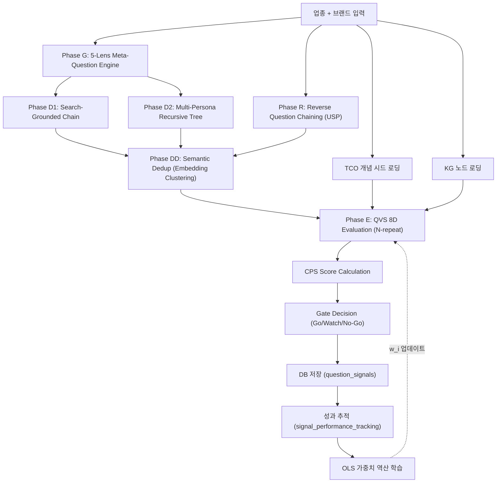

# 특허 명세서

## 발명의 명칭
**적응적 다차원 질문 가치 평가 및 지식 그래프 연동 기반 AI 검색 최적화 질문 자산 발굴·관리 시스템 및 방법**

> Adaptive Multi-Dimensional Question Value Scoring and Knowledge-Graph-Coupled AI Search Optimization System for Question Asset Discovery and Management

---

## 기술 분야

본 발명은 인공지능(AI) 검색 엔진 최적화 분야에 관한 것으로, 보다 구체적으로는 업종(산업 도메인)별 소비자 질문 시그널을 자동 발굴하고, 다차원 가치 평가와 온톨로지 지식 그래프(KG)를 연동하여 질문 자산의 전략적 가치를 정량화하며, 성과 피드백 루프를 통해 평가 모델의 가중치를 자동 교정하는 시스템 및 방법에 관한 것이다.

---

## 배경 기술

### 종래 기술의 문제점

1. **키워드 중심의 SEO 한계**: 기존 검색 엔진 최적화(SEO)는 단순 키워드 볼륨과 경쟁도에 의존하여, AI 기반 검색 엔진(ChatGPT, Gemini, Perplexity 등)에서의 응답 포함 가능성(Answer Engine Optimization, AEO) 및 생성형 검색 최적화(Generative Engine Optimization, GEO)를 고려하지 못한다.

2. **단일 차원 평가의 부정확성**: 종래의 질문/키워드 가치 평가는 검색볼륨, 경쟁도 등 1~2개 차원에 의존하여, 질문의 전환 잠재력, 엔티티 명확성, AI 응답 적합성 등 복합적 가치를 포착하지 못한다.

3. **업종 실측 데이터 부재**: 범용 질문 생성 도구들은 특정 업종의 실제 소비자 질문 패턴, YMYL(Your Money Your Life) 위험 수준, 전문 용어 체계(TCO: Thematic Concept Ontology)를 반영하지 못하여 산업 현장의 실용성이 부족하다.

4. **정적 평가 모델**: 기존 시스템은 한번 설정된 평가 가중치가 고정되어, 실제 콘텐츠 성과 데이터를 반영한 자기 교정(Self-Calibration)이 불가능하다.

5. **LLM 평가 불확실성**: 대규모 언어 모델(LLM) 기반 평가는 동일 입력에 대해 상이한 결과를 산출할 수 있으나, 종래 기술은 이러한 확률적 불확실성을 정량화하거나 통계적으로 제어하지 않는다.

---

## 발명의 상세한 설명

### 제1 발명: QVS 8차원 적응적 가치 평가 시스템 (Quality-Volume Score 8D Adaptive Evaluation)

#### 핵심 청구

소비자 검색 질문의 전략적 가치를 8개 독립 차원으로 분해하여 평가하되, AHP(Analytic Hierarchy Process) 쌍비교 매트릭스에서 유도된 가중치를 적용하여 단일 스칼라 점수(QVS Total)로 합산하는 시스템.

#### 상세 구성

##### 8개 평가 차원 (V₁~V₈)

| 차원 | 기호 | 정의 | AHP 가중치 |
|------|------|------|-----------|
| 관련성 (Relevance) | V_rel | 브랜드 핵심 영역과의 부합도 | 0.18 |
| 구체성 (Specificity) | V_spec | 검색 의도의 구체성 (long-tail 정도) | 0.10 |
| 긴급성 (Urgency) | V_urg | 고통 포인트 또는 긴급도 | 0.07 |
| 기회도 (Opportunity) | V_opp | 검색 노출 기회도 (10 − 경쟁도) | 0.12 |
| 전환 잠재력 (Conversion) | V_conv | 상업적 전환 가능성 | 0.18 |
| 스니펫 적합도 (Snippet Fitness) | V_snip | AI 답변 직접 채택 구조 적합성 (AEO) | 0.15 |
| 엔티티 명확도 (Entity Clarity) | V_ent | 지식 그래프 엔티티로서의 식별 명확성 (GEO) | 0.10 |
| 멀티엔진 일관성 (Multi-Engine Consistency) | V_mec | 다중 AI 검색 엔진 간 일관된 답변 유도 가능성 (GEO) | 0.10 |

##### 가중 합산 공식

$$QVS_{total} = \left(\sum_{i=1}^{8} w_i \cdot V_i\right) \times 10$$

여기서 $w_i$는 AHP 유도 가중치, $V_i$는 각 차원의 0~10 점수이며, 결과는 0~100 범위로 스케일된다.

##### CoT(Chain-of-Thought) 앵커링 보정

LLM이 각 차원을 평가하기 전에, 채점 논리적 근거(reasoning)를 먼저 생성하도록 강제함으로써 앵커링 편향을 방지한다. 이는 `reasoning` 필드를 `required` 스키마에 포함시켜 구조적으로 강제한다.

##### 차별화 요소

- SEO, AEO, GEO 3대 검색 패러다임을 단일 평가 체계에 통합한 최초의 8차원 모델
- AHP 쌍비교로부터 수학적으로 유도된 가중치 (주관적 할당이 아닌 의사결정 과학 기반)
- CoT 앵커링으로 LLM 평가의 체계적 편향(systematic bias) 감소

---

### 제2 발명: N-회 반복 불확실성 정량화 및 적응적 게이트 판정 시스템 (Statistical Confidence Gate)

#### 핵심 청구

LLM 기반 평가의 확률적 불확실성을 극복하기 위해, 동일 질문에 대해 N회(기본 3회) 독립 평가를 수행하고, 결과의 표준편차(σ)로 신뢰도 등급을 분류하며, 평균 QVS 점수와 브랜드 적합도를 결합한 3단계 적응적 게이트(Go/Watch/No-Go) 판정을 수행하는 방법.

#### 상세 구성

##### 신뢰도 등급 분류

$$\text{confidence} = \begin{cases} \text{high} & \text{if } \sigma < 5.0 \\ \text{medium} & \text{if } 5.0 \leq \sigma < 10.0 \\ \text{low} & \text{if } \sigma \geq 10.0 \end{cases}$$

##### 적응적 게이트 판정

```
if brand_fit == 'unfit':
    gate = 'No-Go'           ← 브랜드 무관 질문 즉시 제거
elif mean_QVS ≥ 68 AND brand_fit == 'fit':
    gate = 'Go'              ← 고가치 자산으로 즉시 승격
elif mean_QVS < 42:
    gate = 'No-Go'           ← 저가치 자산으로 폐기
else:
    gate = 'Watch'           ← 관찰 대상 (추가 데이터 수집 후 재판정)
```

##### 차별화 요소

- LLM 평가 결과를 **통계적 검정(statistical test)** 관점에서 처리하는 최초의 질문 평가 시스템
- σ 기반 신뢰도 분류로 "LLM이 확신하지 못하는 질문"을 자동 식별
- 임계값(68/42)은 향후 워크스페이스별 과거 데이터 분포에서 자동 교정 가능한 설계

---

### 제3 발명: S-OGDE 다단계 시그널 오케스트레이션 파이프라인 (Signal-OGDE Multi-Phase Pipeline)

#### 핵심 청구

소비자 질문 시그널을 5단계 위상(Phase)으로 자동 발굴·정제·평가하되, 각 위상이 독립적으로 실패해도 전체 파이프라인이 중단되지 않는 내결함성(fault-tolerant) 오케스트레이션 시스템.

#### 파이프라인 아키텍처

```
Phase G ─→ Phase D1 ─→ Phase D2 ─→ Phase R ─→ Phase DD ─→ Phase E
(Meta)    (Chain)     (Recursive)  (Reverse)  (Dedup)     (Evaluate)
 │          │            │            │          │           │
 ▼          ▼            ▼            ▼          ▼           ▼
5-Lens   Search-     Multi-Persona  USP→Question Embedding  QVS 8D +
Meta-Q   Grounded    Recursive     Reverse     Cosine      CPS Gate
Engine   Chain       Tree          Chaining    Clustering
```

| Phase | 명칭 | 입력 | 출력 | 핵심 알고리즘 |
|-------|------|------|------|-------------|
| **G** | 5-Lens Meta-Question | 업종명, 브랜드명, TCO 시드 | 25개 메타 질문 (5렌즈×5문) | 소비자심리 5관점 분석 |
| **D1** | Search-Grounded Chain | 시드 질문 | 그라운디드 후속 질문 | AI 검색 결과 기반 탐색 |
| **D2** | Multi-Persona Recursive | 시드 질문 | 재귀 트리 질문 | 3 페르소나 분기 탐색 |
| **R** | Reverse Chaining | 브랜드 USP | 역추적 질문 경로 | USP→질문 역공학 |
| **DD** | Semantic Dedup | 전체 후보 | 클러스터 대표 질문 | 임베딩 코사인 클러스터링 |
| **E** | Evaluate & Save | 중복 제거 후보 | Gate 판정 + DB 저장 | QVS 8D + CPS + Gate |

##### Phase G: 5-Lens Meta-Question Engine

소비자 심리학의 5가지 메타 관점(Pattern, Motivation, Journey Stage, Fear/Desire, Counter)으로 업종을 분석하여, 각 관점에서 5개씩 총 25개의 원시 질문을 생성한다. TCO 전략 개념 시드가 주입되면, 도메인 깊이를 확장하는 방향으로 질문 생성을 유도한다.

##### Phase D2: Multi-Persona Recursive Deepener

3가지 소비자 페르소나(Skeptic 팩트체커, Pragmatist 가성비파, Novice 초보자)가 독립적으로 질문 트리를 재귀적으로 확장한다. 각 페르소나는 고유한 시스템 프롬프트를 가지며, 동일 씨앗 질문에서 서로 다른 방향으로 분기한다.

##### Phase R: Reverse Question Chaining (역방향 질문 경로 추적)

종래의 순방향(질문→답변→후속질문) 접근과 달리, 브랜드의 USP(Unique Selling Proposition)를 입력으로 받아 "이 답변에 도달하려면 소비자가 어떤 질문을 검색했어야 하는가"를 3단계로 역추적한다.

##### 차별화 요소

- **역방향 질문 역공학(Reverse Question Engineering)**: 답변→질문 역추적은 기존 SEO/AEO 도구에 존재하지 않는 완전 신규 접근
- **Multi-Persona Branching**: 동일 질문에 대해 3가지 소비자 성격이 독립적으로 질문 트리를 확장하는 분기 탐색
- **내결함성 설계**: 각 Phase가 try-catch로 격리되어 개별 실패가 전체 파이프라인을 중단시키지 않음

---

### 제4 발명: TCO-KG 연동 질문 커버리지 정량화 시스템 (TCO-KG Coverage Quantification)

#### 핵심 청구

업종별 주제 개념 온톨로지(TCO: Thematic Concept Ontology)와 브랜드 지식 그래프(KG) 노드 간의 임베딩 기반 자동 매핑을 수행하고, 이를 기반으로 개별 질문 시그널의 지식 커버리지를 정량화하여 CPS(Composite Promotion Score) 산출에 반영하는 시스템.

#### 상세 구성

##### TCO-KG 임베딩 매핑

```
TCO Concepts ──embed──→ [벡터 768D]
                                    ├──cosine similarity──→ Mapping
KG Nodes ──────embed──→ [벡터 768D]

Mapping Type:
  sim ≥ 0.85 → 'exact'     (동일 개념)
  sim ≥ 0.75 → 'broader'   (상위/하위 관계)
  sim ≥ 0.70 → 'related'   (관련 개념)
  sim < 0.70 → unmapped     (무관)
```

##### KG 커버리지 점수 (Coverage Score)

$$\text{Coverage}(q) = \min\left(10, \left\lfloor\frac{|\{n \in KG : n.\text{name} \subseteq q\}|}{3} \times 10\right\rfloor\right)$$

질문 텍스트 $q$에 포함된 KG 노드 수를 기준으로, 3개 이상 매칭 시 만점(10)을 부여한다.

##### CPS 복합 승격 점수

$$CPS = 0.30 \cdot P(QVS) + 0.25 \cdot P(Vol) + 0.20 \cdot \frac{TCO_{match}}{10} + 0.15 \cdot \frac{KG_{cov}}{10} + 0.10 \cdot W_{ymyl}$$

여기서 $P(\cdot)$는 백분위 순위(Percentile Rank), $W_{ymyl}$은 YMYL 가중치(해당 시 1.0, 비해당 시 0.5)이다.

##### 차별화 요소

- 주제 개념(TCO)과 지식 그래프(KG)를 **임베딩 공간에서 자동 매핑**하는 최초의 SEO 시스템
- 매핑 결과를 **질문 단위 커버리지 점수**로 변환하여 질문 자산의 지식 완결성을 정량화
- CPS 공식에 QVS, 볼륨, TCO 매칭, KG 커버리지, YMYL 5가지 이질적 차원을 통합

---

### 제5 발명: 성과 피드백 루프 기반 QVS 가중치 자동 역산 학습 시스템 (OLS-Driven Weight Recalibration)

#### 핵심 청구

승격된 질문 시그널의 실제 검색/AI 유입 성과(노출수, 클릭수, AI 언급률, 전환률)를 추적하고, 성과 데이터와 QVS 8차원 점수 간의 공분산 분석을 통해 AHP 초기 가중치를 자동으로 재교정하는 온라인 학습 시스템.

#### 상세 구성

##### 성과 추적 메트릭

| 메트릭 | 설명 | 단위 |
|--------|------|------|
| impressions_30d | 30일 누적 노출수 | 건 |
| clicks_30d | 30일 누적 클릭수 | 건 |
| ctr_30d | 클릭률 (clicks/impressions) | 비율 |
| avg_position_30d | GSC 평균 순위 | 순위 |
| ai_mention_rate | AI 응답 내 브랜드 언급 비율 | 비율 |
| actual_conversion | 검색→전환 비율 | 비율 |

##### 실현 가치 (Realized Value) 산출

$$V_{realized} = (clicks \times 2.0) + (conversion \times 50.0) + (ai\_mention \times 5.0)$$

##### 가중치 역산 알고리즘

1. 성과 데이터가 10건 이상 축적된 워크스페이스에서 활성화
2. 각 QVS 차원($X_i$)과 실현 가치($Y$) 간의 공분산(Covariance) 계산:

$$\text{Cov}(X_i, Y) = \frac{1}{n}\sum_{j=1}^{n}(X_{ij} - \bar{X}_i)(Y_j - \bar{Y})$$

3. 음수 공분산은 최소값(0.01)으로 클리핑 후, 전체 합이 1.0이 되도록 정규화:

$$w_i^{new} = \frac{\max(0.01, \text{Cov}(X_i, Y))}{\sum_{k=1}^{8}\max(0.01, \text{Cov}(X_k, Y))}$$

##### 차별화 요소

- **자기 교정(Self-Calibrating) 평가 모델**: 업종별·브랜드별 실제 성과 데이터에 의해 가중치가 자동 진화
- 초기 AHP 가중치 → 성과 기반 공분산 가중치로의 점진적 전환 (Cold Start 문제 해결)
- 종래의 고정 가중치 SEO 도구와의 근본적 차별점

---

### 제6 발명: 업종 실측 패널 5-Layer 그라운딩 시스템 (Industry Panel 5-Layer Grounding)

#### 핵심 청구

업종별 실측 소비자 질문 패널 데이터를 5개 계층(L1~L5)으로 구조화하고, AI 시그널 파이프라인의 질문 생성·평가·분류 전 과정에 실측 그라운딩 레이어로 주입하여 질문 자산의 산업 현실 적합성을 보장하는 시스템.

#### 5-Layer 패널 구조

| Layer | 명칭 | 설명 | 예시 |
|-------|------|------|------|
| **L1** | Direct (직접 질문) | 브랜드/제품을 직접 언급하는 질문 | "DR.O 세럼 가격" |
| **L2** | Comparison (비교 질문) | 경쟁 제품과의 비교 | "DR.O vs 이니스프리 세럼" |
| **L3** | Experience (경험 질문) | 사용 후기, 효과, 부작용 관련 | "나이아신아마이드 자극감 후기" |
| **L4** | Expert (전문가 질문) | 성분 분석, 메커니즘, 전문 지식 | "레티놀 캡슐화 기술 원리" |
| **L5** | YMYL (고위험 질문) | 의료·법률·금융 안전 관련 | "민감 피부 레티놀 의사 상담" |

각 질문에는 `risk_level` (low/medium/high)이 할당되며, L5 또는 risk_level='high'인 질문은 자동으로 YMYL 플래그가 활성화되어 검수 임계값이 상향 적용된다.

##### 차별화 요소

- 업종별 **실제 소비자 패널 데이터**를 AI 파이프라인의 입력 그라운딩으로 사용하는 최초의 SEO 시스템
- 5-Layer 계층 구조로 질문의 업종 깊이(industry depth)를 체계적으로 보장
- YMYL 자동 감지로 의료·금융 등 고위험 콘텐츠의 품질 기준을 자동 상향

---

## 특허 청구 범위

### 독립 청구항

**청구항 1.** 소비자 검색 질문의 가치를 평가하는 컴퓨터 구현 방법으로서,
(a) 입력된 질문을 대규모 언어 모델(LLM)을 이용하여 관련성, 구체성, 긴급성, 기회도, 전환잠재력, 스니펫적합도, 엔티티명확도, 멀티엔진일관성의 8개 차원으로 각각 0~10 범위의 점수를 산출하는 단계;
(b) AHP(Analytic Hierarchy Process) 쌍비교 매트릭스로부터 유도된 가중치 벡터를 상기 8개 차원 점수에 적용하여 가중 합산 총점(QVS Total)을 산출하는 단계;
(c) 상기 (a)~(b) 단계를 N회(N≥2) 독립 반복하고, 반복 결과의 표준편차(σ)를 산출하여 신뢰도 등급(high/medium/low)을 분류하는 단계;
(d) 상기 QVS Total 평균값과 브랜드 적합도를 결합하여 Go/Watch/No-Go 3단계 게이트 판정을 수행하는 단계;
를 포함하는 방법.

**청구항 2.** 질문 시그널 자동 발굴 시스템으로서,
(a) 업종명과 브랜드명을 입력받아 소비자 심리학의 5가지 메타 관점(Pattern, Motivation, Journey Stage, Fear/Desire, Counter)으로 분석하여 원시 질문을 생성하는 5-Lens 메타질문 엔진;
(b) 생성된 시드 질문을 3가지 소비자 페르소나(Skeptic, Pragmatist, Novice)가 독립적으로 재귀적 트리 탐색하여 확장하는 Multi-Persona 재귀 심화 엔진;
(c) 브랜드의 USP(Unique Selling Proposition)를 입력받아, 해당 답변에 도달하기 위한 소비자 질문 경로를 3단계로 역추적하는 역방향 질문 역공학 엔진;
(d) 생성된 전체 후보 질문을 임베딩 벡터 공간에서 코사인 유사도 기반으로 클러스터링하여 시맨틱 중복을 제거하는 중복 제거 엔진;
(e) 상기 중복 제거된 질문을 청구항 1의 방법으로 평가하고, 업종별 TCO 개념 매칭 점수와 KG 노드 커버리지 점수를 결합한 CPS(Composite Promotion Score)를 산출하여 데이터베이스에 저장하는 평가·저장 엔진;
을 포함하며, 상기 (a)~(e)의 각 엔진은 독립적 오류 격리 구조로 구성되어 개별 엔진의 실패가 전체 시스템을 중단시키지 않는 것을 특징으로 하는 시스템.

**청구항 3.** 질문 시그널 평가 모델의 가중치를 자동 교정하는 방법으로서,
(a) 승격된 질문 시그널의 실제 검색 성과(노출수, 클릭수, CTR, AI 언급률, 전환률)를 소정 기간 동안 추적하는 단계;
(b) 추적된 성과 데이터로부터 실현 가치(Realized Value)를 산출하는 단계;
(c) 상기 실현 가치와 각 질문의 QVS 8차원 점수 간의 공분산을 산출하고, 공분산 비율을 정규화하여 새로운 차원별 가중치를 역산하는 단계;
(d) 역산된 가중치를 AHP 초기 가중치 대신 적용하여 이후 질문 평가에 반영하는 단계;
를 포함하며, 상기 (a)~(d)는 소정 주기로 반복 실행되어 평가 모델이 업종별·브랜드별 실제 성과에 점진적으로 적응하는 것을 특징으로 하는 방법.

### 종속 청구항

**청구항 4.** 청구항 1에 있어서, 상기 (a) 단계에서 LLM이 각 차원의 점수를 산출하기 전에 채점 논리적 근거(Chain-of-Thought reasoning)를 먼저 생성하도록 구조화된 출력 스키마에 reasoning 필드를 필수(required)로 포함시키는 것을 특징으로 하는 방법.

**청구항 5.** 청구항 1에 있어서, 상기 스니펫적합도(V_snip)는 질문이 AI 검색 엔진의 Featured Snippet 또는 직접 답변 박스로 채택되기에 적합한 구조를 갖추고 있는지를 평가하는 AEO(Answer Engine Optimization) 차원이며, 상기 엔티티명확도(V_ent)와 멀티엔진일관성(V_mec)은 지식 그래프 기반 생성형 검색 최적화(GEO: Generative Engine Optimization) 차원인 것을 특징으로 하는 방법.

**청구항 6.** 청구항 2에 있어서, 상기 5-Lens 메타질문 엔진은 업종별 TCO(Thematic Concept Ontology) 전략 개념 시드를 프롬프트에 주입하여, 생성되는 질문이 해당 업종의 핵심 개념 체계를 반영하도록 하는 것을 특징으로 하는 시스템.

**청구항 7.** 청구항 2에 있어서, 상기 역방향 질문 역공학 엔진은 브랜드 USP로부터 3단계 역추적 경로(step1_question → step2_question → step3_question)를 생성하되, 각 경로에 대해 해당 경로가 USP에 도달하는 논리적 근거(rationale)를 함께 출력하는 것을 특징으로 하는 시스템.

**청구항 8.** 청구항 2에 있어서, 상기 시맨틱 중복 제거 엔진은 코사인 유사도 임계값 0.85를 기준으로 Agglomerative Clustering(Single-linkage)을 수행하며, 각 클러스터에서 가장 간결한(shortest) 질문을 대표 질문으로 선정하는 것을 특징으로 하는 시스템.

**청구항 9.** 청구항 3에 있어서, 상기 (c) 단계에서 음수 공분산은 최소값(0.01)으로 클리핑하여 모든 차원이 양수 가중치를 유지하도록 하며, 정규화 후 전체 가중치의 합이 1.0이 되도록 하는 것을 특징으로 하는 방법.

**청구항 10.** 청구항 2에 있어서, 업종별 실측 소비자 질문 패널 데이터를 5개 계층(L1_direct, L2_comparison, L3_experience, L4_expert, L5_ymyl)으로 구조화하여 저장하고, 상기 평가·저장 엔진은 각 질문 시그널을 패널 계층과 매칭하여, L5_ymyl 또는 risk_level='high'에 해당하는 질문에 대해 YMYL 플래그를 자동 활성화하고 검수 임계값을 상향 적용하는 것을 특징으로 하는 시스템.

---

## 도면의 간단한 설명

### 도면 1: QIS 전체 파이프라인 아키텍처



### 도면 2: QVS 8차원 레이더 차트

```
         Relevance (0.18)
            ▲
           /|\
          / | \
Entity   /  |  \  Specificity
(0.10)  /   |   \ (0.10)
       /    |    \
      ◄─────┼─────► Urgency (0.07)
       \    |    /
Multi   \   |   /  Opportunity
Engine   \  |  /   (0.12)
(0.10)    \ | /
           \|/
            ▼
    Snippet      Conversion
    (0.15)       (0.18)
```

---

## 발명의 효과

1. **SEO+AEO+GEO 통합 평가**: 기존 SEO 볼륨/경쟁도 2차원을 8차원으로 확장하여, AI 검색 시대의 질문 가치를 포괄적으로 평가
2. **LLM 불확실성 극복**: N-회 반복 + σ 기반 신뢰도 분류로 LLM 평가의 확률적 오류를 통계적으로 제어
3. **자기 진화 모델**: 성과 피드백 루프에 의한 가중치 자동 교정으로, 사용할수록 정확도가 향상되는 학습 시스템
4. **업종 실측 그라운딩**: TCO+KG+5-Layer 패널의 3중 실측 데이터 기반으로 범용 AI 도구 대비 업종 적합성이 현저히 우수
5. **역방향 질문 역공학**: 종래에 없던 USP→질문 역추적으로 마케팅 전환에 직결되는 고가치 시그널 발굴
6. **내결함성 파이프라인**: 5개 독립 위상의 오류 격리 설계로 프로덕션 환경에서의 안정성 보장

---

## 발명자 정보

- **출원인**: (기업명)
- **발명자**: (발명자명)
- **출원일**: 2026년 7월

---

> 본 명세서의 실시예는 BSW(Brand Semantic Workspace) 시스템의 QIS(Question Intelligence System) 파이프라인으로 구현되어 있으며, 해당 소스코드는 `lib/signal-collection/` 디렉토리에 위치한다.
