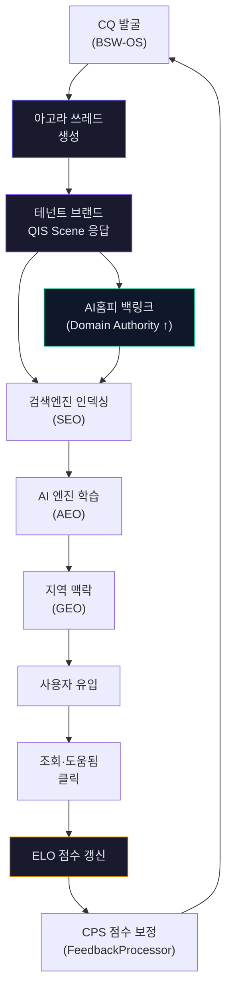
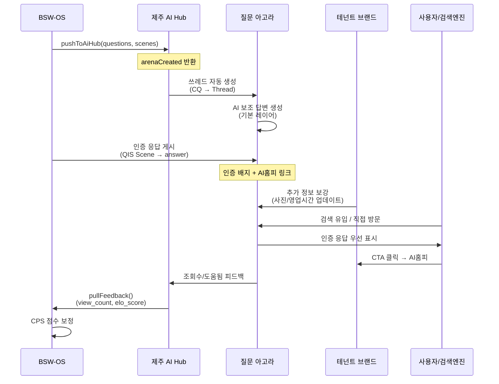

# 질문 아고라 (Question Agora) — 서비스 설계 및 상품 패키지 통합

## 핵심 인사이트

> **이미 코드에 Arena 구조가 내장되어 있습니다.**

| 기존 코드 | 파일 | 기능 |
|-----------|------|------|
| `ArenaTopAnswer` | [types.ts](file:///c:/Users/User/bsw/lib/hub-feedback/types.ts#L28-L33) | `thread_title`, `elo_score`, `helpful_ratio`, `best_layer` |
| `arenaCreated` | [hub-client.ts](file:///c:/Users/User/bsw/lib/qis/hub-client.ts#L40) | CQ Push 시 Arena 쓰레드 자동 생성 수 |
| `arena_thread_reply_count` | [types.ts](file:///c:/Users/User/bsw/lib/hub-feedback/types.ts#L25) | 쓰레드별 답변 수 |
| `emergence_source: 'cafe_agora'` | [qis-shared-schemas.ts](file:///c:/Users/User/bsw/lib/qis-shared-schemas.ts#L143) | 질문 출현 소스로 카페 아고라 이미 정의 |
| `hub_arena_elo` | [feedback-processor.ts](file:///c:/Users/User/bsw/lib/hub-feedback/feedback-processor.ts#L104) | ELO 점수를 CQ 메타데이터에 환류 |

→ **BSW-OS의 CQ → Hub Push → Arena Thread 생성 → 피드백 환류** 파이프라인의 골격이 이미 존재합니다.

---

## 1. 질문 아고라란?

```
┌──────────────────────────────────────────────────────────┐
│                  🏛️ 질문 아고라 (Question Agora)           │
│              "제주의 모든 질문에 답이 있는 광장"             │
├──────────────────────────────────────────────────────────┤
│                                                          │
│  ┌─ 질문 쓰레드 ─────────────────────────────────────┐    │
│  │ Q: "서귀포 보말칼국수 주차 가능한 곳 있나요?"       │    │
│  │                                                    │    │
│  │ 🏪 중문보말칼국수 (인증 응답) ──── ⭐ ELO 1,340    │    │
│  │ │ "네, 매장 앞 전용 주차장 8대 가능합니다.         │    │
│  │ │  주말에는 30분 이상 웨이팅 시 근처 공영주차장      │    │
│  │ │  무료 주차 안내도 도와드립니다."                  │    │
│  │ │                                                  │    │
│  │ │ 📍 [AI 홈페이지 보기] → 중문보말칼국수 AI홈피    │    │
│  │ │ 📞 [예약하기] → CTA                              │    │
│  │ └─────────────────────────────────────────────────│    │
│  │                                                    │    │
│  │ 🤖 AI 보조 답변 (커뮤니티) ──── ELO 1,180          │    │
│  │ │ "서귀포 중문 쪽 칼국수집 중 주차 편한 곳은..."    │    │
│  │ └─────────────────────────────────────────────────│    │
│  │                                                    │    │
│  │ 👥 방문자 리뷰 기반 ──── ELO 1,050                 │    │
│  │ │ "지난주 갔는데 주차장 넓더라구요..."              │    │
│  │ └─────────────────────────────────────────────────│    │
│  └────────────────────────────────────────────────────┘    │
│                                                          │
│  [관련 질문] [인기 질문] [최신 질문]                       │
│                                                          │
└──────────────────────────────────────────────────────────┘
```

### Quora와의 차별점

| | Quora/Naver 지식iN | **질문 아고라** |
|---|---|---|
| 질문 생성 | 사용자가 올림 | **QIS가 사전 발굴** + 사용자 질문 |
| 답변 | 불특정 사용자 | **인증 브랜드 QIS Scene 응답** + AI 보조 |
| 랭킹 | 추천/조회수 | **ELO 점수** (정확도·유용성 기반) |
| 연결 | 없음 | **브랜드 AI홈피 직링크 + CTA** |
| 데이터 환류 | 없음 | **CPS 점수 보정** + 시그널 재발굴 |
| SEO 가치 | 약함 | **구조화 데이터 + 지역 Schema.org** |

---

## 2. SEO/AEO/GEO 플라이휠 효과



### 플라이휠의 7가지 SEO/AEO/GEO 효과

| # | 효과 | 메커니즘 | 수혜자 |
|:-:|------|---------|--------|
| 1 | **인덱서블 Q&A 페이지** | 매주 250 CQ → 250 쓰레드 → 250개 인덱서블 페이지 | Hub SEO |
| 2 | **브랜드 백링크** | 인증 응답 → AI홈피 링크 → **Domain Authority 상승** | 테넌트 SEO |
| 3 | **AI 학습 데이터** | 구조화된 Q&A → LLM 크롤러(GPTBot, Googlebot) 학습 | 테넌트 AEO |
| 4 | **LocalBusiness Schema** | 쓰레드에 지역 Schema.org 자동 삽입 | 테넌트 GEO |
| 5 | **Long-tail 키워드 선점** | "서귀포 보말칼국수 주차" 같은 니치 질문 선점 | 테넌트 SEO |
| 6 | **E-E-A-T 신호** | 인증 사업자의 1차 정보 → Experience + Expertise | 테넌트 AEO |
| 7 | **CPS 환류 루프** | 조회수 → `hub_view_count_24h` → CPS 보정 → 더 정확한 CQ 발굴 | 시스템 진화 |

### 수치 추정 (Scenario B)

| 지표 | 주간 | 월간 | 연간 |
|------|:---:|:---:|:---:|
| 신규 인덱서블 페이지 | 250 | 1,000 | **12,000** |
| 브랜드 백링크 (인증 응답) | 250 | 1,000 | 12,000 |
| AI 학습 가능 Q&A 쌍 | 250 | 1,000 | 12,000 |
| Long-tail 키워드 커버리지 | +250/주 | 누적 4,000/4주 | — |

> [!IMPORTANT]
> **연간 12,000개 인덱서블 Q&A 페이지**는 제주 관광 도메인에서 **압도적인 콘텐츠 허브**를 형성합니다.
> 이는 네이버/구글의 제주 관련 질문형 검색에서 Hub 도메인이 **지속적으로 노출되는 효과**를 만듭니다.

---

## 3. 상품 패키지 통합 설계

### 아고라 노출 = 테넌트에게 "매체 가치"

아고라 쓰레드에 **인증 응답으로 노출되는 것** 자체가 브랜드에게는 광고 매체 가치를 가집니다.

```
매체 가치 = 노출 × 클릭률 × 전환율
         = (쓰레드 조회수) × (CTA 클릭률) × (예약/방문 전환)
```

이것을 상품에 반영합니다:

### 개정된 상품 라인업

| | 🌱 Starter | 🌿 Growth ⭐ | 🌳 Scale | 🏛️ Hub |
|---|:---:|:---:|:---:|:---:|
| **월 가격** | ₩49,000 | **₩109,000** | ₩199,000 | ₩1,290,000 |
| | | | | |
| **진단** | Light 1회 | Full 1 + Light 1 | Full 2 + Light 2 | Full × 100 |
| **주간 맞춤 질문** | 2개 | 2개 | 4개 | 2개 × 100 |
| **콘텐츠 브리프** | 키워드만 | 키워드+기회+제안 | 완성 원고 | 키워드+기회 |
| **AI홈피** | Basic | Pro | Premium | Basic × 100 |
| | | | | |
| **🏛️ 아고라 노출** | | | | |
| 인증 응답 배지 | ❌ | ✅ **인증 사업자** | ✅ **공식 파트너** | ✅ 전 브랜드 |
| 쓰레드 응답 자동 게시 | ❌ | ✅ 주 2건 | ✅ 주 4건 | ✅ 주 200건 |
| AI홈피 백링크 | ❌ | ✅ 응답 하단 | ✅ 응답 하단 + 사이드바 | ✅ |
| CTA 버튼 | ❌ | 📍 지도 보기 | 📍 + 📞 예약 + 🛒 주문 | 📍 지도 |
| ELO 랭킹 노출 | ❌ | ✅ | ✅ + 상단 고정 권한 | ✅ |
| 아고라 대시보드 | ❌ | 조회수만 | 조회+클릭+전환 | 전체 |

### 왜 Starter에서는 아고라가 없는가?

> **의도적 제외.** Starter는 "진단 + 학습" 단계입니다. 아고라 노출은 Growth로의 **업그레이드 동기**를 만들어줍니다.
> "내 질문이 발굴되었는데, Growth로 올리면 아고라에 인증 응답이 게시됩니다" → **upsell trigger**

---

## 4. 아고라 쓰레드 구조 상세

### 쓰레드 생성 파이프라인



### 응답 레이어 (기존 `best_layer` 활용)

| 레이어 | 소스 | 신뢰도 | 아고라 표시 |
|--------|------|:------:|-----------|
| `merchant_official` | 테넌트 QIS Scene | ⭐⭐⭐⭐⭐ | **🏪 인증 사업자 응답** |
| `ai_augmented` | AI Hub 자체 생성 | ⭐⭐⭐⭐ | 🤖 AI 추천 답변 |
| `community_verified` | 커뮤니티 시그널 | ⭐⭐⭐ | 👥 방문자 경험 |
| `external_source` | 뉴스/블로그 | ⭐⭐ | 📰 관련 정보 |

---

## 5. 가격 변동 근거

### 아고라 매체 가치 계산

```
인증 응답 1건의 매체 가치:
  = 쓰레드 월 평균 조회수 × CTA 클릭률 × CPC 환산
  = 200회/월 × 3% × ₩500/클릭
  = ₩3,000/건/월

Growth (주 2건 = 월 8건):
  매체 가치 = 8 × ₩3,000 = ₩24,000/월

Scale (주 4건 = 월 16건):
  매체 가치 = 16 × ₩3,000 = ₩48,000/월
```

### 기존 vs 개정 가격 비교

| 티어 | 기존 | 개정 | 차이 | 아고라 매체가치 |
|------|:----:|:----:|:---:|:-----------:|
| Starter | ₩39K | **₩49K** | +₩10K | ❌ (upsell 유도) |
| Growth | ₩89K | **₩109K** | +₩20K | ₩24K/월 (순이익 ₩4K) |
| Scale | ₩169K | **₩199K** | +₩30K | ₩48K/월 (순이익 ₩18K) |
| Hub | ₩990K | **₩1,290K** | +₩300K | ₩600K/월 (100 브랜드) |

> [!TIP]
> 아고라 추가로 인한 가격 인상분(+₩20K~30K)은 매체 가치(₩24K~48K)보다 **낮게** 설정되어, 테넌트에게 **순이익**이 발생합니다. 이것이 골디락스입니다.

---

## 6. 개정 매출 시뮬레이션

### 제주 100 브랜드 + 아고라

| 티어 | 수 | 단가 | 월 매출 |
|------|:--:|:----:|:------:|
| Starter | 50 | ₩49K | ₩2,450,000 |
| Growth | 35 | ₩109K | ₩3,815,000 |
| Scale | 15 | ₩199K | ₩2,985,000 |
| Hub | 1 | ₩1,290K | ₩1,290,000 |
| **합계** | | | **₩10,540,000/월** |

$$\text{개정 ARR} = ₩10,540,000 \times 12 = \boxed{₩126,480,000\text{/년}}$$

> 아고라 추가 전 대비 **+₩34.2M/년 (+37%)**

---

## 7. 구현 준비도

### 이미 있는 것 ✅

| 컴포넌트 | 파일 | 상태 |
|---------|------|:----:|
| Arena 쓰레드 생성 | `hub-client.ts` → `pushToAiHub()` → `arenaCreated` | ✅ API 정의 |
| ELO 점수 환류 | `feedback-processor.ts` → `hub_arena_elo` | ✅ 환류 로직 |
| 조회수 → CPS 보정 | `feedback-processor.ts` → `viewBoost` | ✅ 계산식 |
| `emergence_source: 'cafe_agora'` | `qis-shared-schemas.ts` | ✅ 스키마 |
| 7채널 콘텐츠 생성 | `media-soliton-generator.ts` | ✅ answer_card 포함 |

### 추가 구현 필요 🔨

| 컴포넌트 | 설명 | 난이도 |
|---------|------|:------:|
| **아고라 프론트엔드** | 쓰레드 목록/상세 페이지 (Next.js) | 중 |
| **인증 응답 게시 API** | QIS Scene → 아고라 쓰레드 응답 변환 | 하 |
| **인증 배지 시스템** | Growth/Scale 티어별 배지 UI | 하 |
| **CTA 버튼 모듈** | 지도/예약/주문 CTA 컴포넌트 | 하 |
| **SEO 메타/Schema.org** | QAPage, FAQPage 마크업 자동 삽입 | 중 |
| **아고라 대시보드** | 테넌트용 조회수/클릭/전환 통계 | 중 |
| **ELO 계산 엔진** | 도움됨/비도움됨 투표 → ELO 갱신 | 중 |

---

## 8. 최종 상품 구조 (아고라 포함)

```
BSW-OS 월간 운영 상품
├─ 🌱 Starter (₩49K/월)
│   ├─ AI 진단 Light 1회
│   ├─ 주간 맞춤 질문 2개 + 키워드 브리프
│   ├─ AI홈피 Basic (2채널)
│   └─ ❌ 아고라 (→ Growth upsell)
│
├─ 🌿 Growth (₩109K/월) ⭐ 골디락스
│   ├─ AI 진단 Full 1 + Light 1
│   ├─ 주간 맞춤 질문 2개 + 콘텐츠 브리프
│   ├─ AI홈피 Pro (6채널)
│   ├─ 경쟁 모니터링 주 1회
│   ├─ 🏛️ 아고라 인증 응답 주 2건
│   ├─ 🏛️ AI홈피 백링크
│   └─ 🏛️ 📍 지도 보기 CTA
│
├─ 🌳 Scale (₩199K/월)
│   ├─ Growth 전체 +
│   ├─ AI홈피 Premium (7채널 + 다국어)
│   ├─ 🏛️ 아고라 인증 응답 주 4건
│   ├─ 🏛️ 📍📞🛒 풀 CTA
│   ├─ 🏛️ ELO 상단 고정 권한
│   └─ 🏛️ 조회+클릭+전환 대시보드
│
└─ 🏛️ Hub (₩1,290K/월)
    ├─ 100 브랜드 Starter 일괄
    ├─ 지자체 종합 리포트
    ├─ 🏛️ 아고라 운영 (전 브랜드 인증)
    └─ 🏛️ 아고라 SEO → Hub 도메인 권위 축적
```
