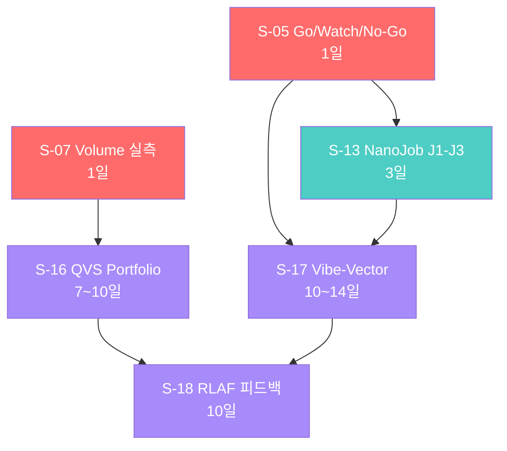
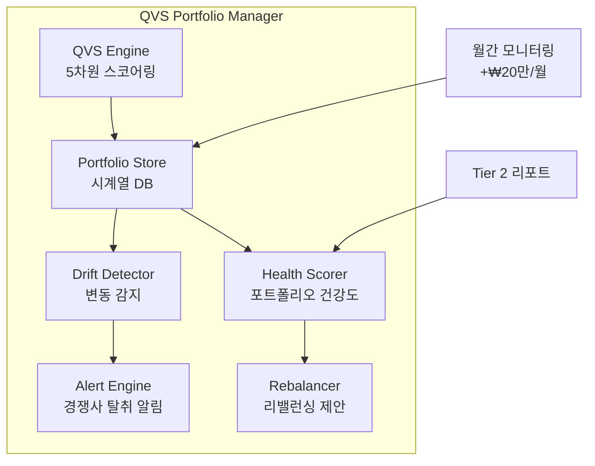
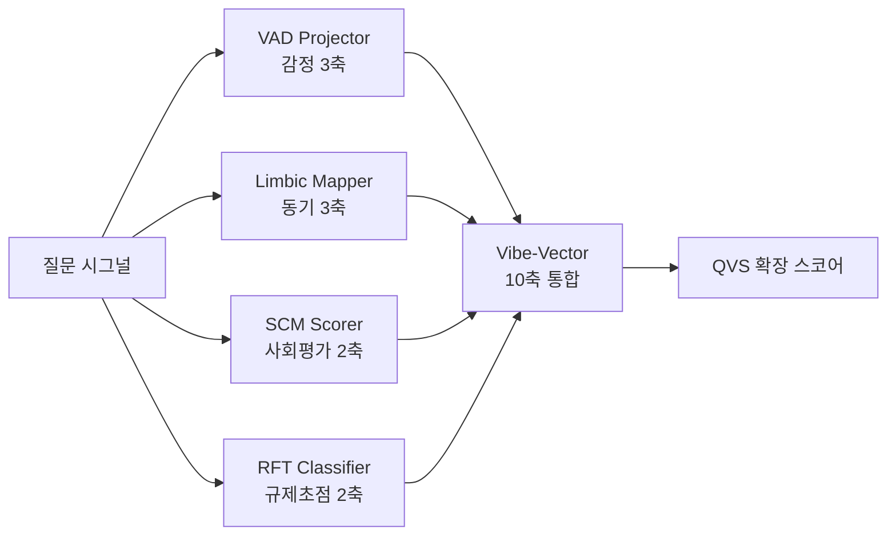
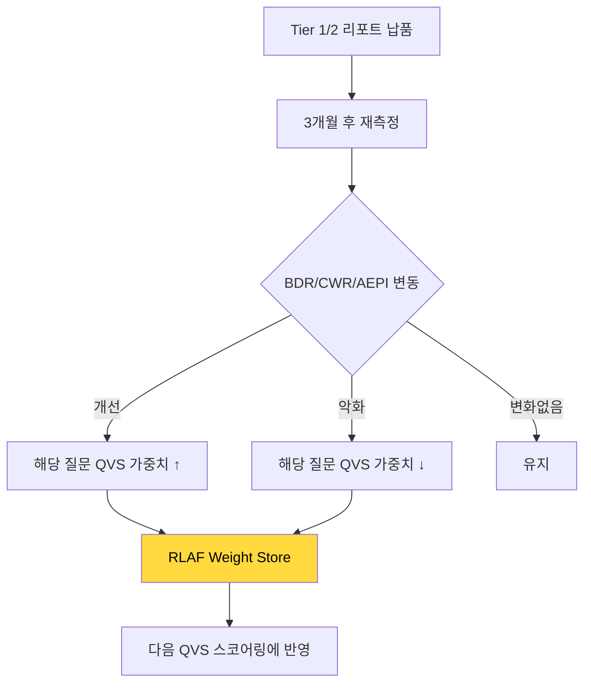

# QVS/QIS 시스템 정밀 고도화 구현 계획

> **대상 모듈**: `lib/signal-collection/`, aihompyhub QIS/VQS 통합
> **총 6개 항목**: S-05, S-07, S-13, S-16, S-17, S-18
> **총 예상 공수**: 34~48일
> **작성일**: 2026-06-18

---

## 의존성 DAG (실행 순서)



🔴 Phase 0 | 🟢 Phase 1 | 🟣 Phase 2

---

## P0-6. S-05 — Signal Evaluator → Go/Watch/No-Go 3-Tier Gate

### 현재 코드 분석

| 파일 | 크기 | 현재 평가 체계 |
|---|---|---|
| [signal-evaluator.ts](file:///c:/Users/User/bsw/lib/signal-collection/signal-evaluator.ts) | 63줄 | `brand_fit: strong/moderate/unfit` + `strategic_score: 1-10` + `is_ymyl: boolean` |

**현재 코드 (전문)**:
```typescript
export const signalEvaluationSchema = z.object({
  intent: z.enum(['informational', 'navigational', 'transactional', 'local']),
  brand_fit: z.enum(['strong', 'moderate', 'unfit']),
  strategic_score: z.number().min(1).max(10),
  is_ymyl: z.boolean(),
});
```

### 개선: 5차원 + 거버넌스 게이트

#### [MODIFY] `lib/signal-collection/signal-evaluator.ts` — 전면 교체

```typescript
import { generateObject } from 'ai';
import { z } from 'zod';
import type { RawSignalCandidate, EvaluatedSignal } from './types';
import { getModel } from '@/lib/ai/model-provider';

// ─── 신규: QVS 5차원 스코어링 스키마 ───
export const qvsEvaluationSchema = z.object({
  // 기존 3차원 유지
  intent: z.enum(['informational', 'navigational', 'transactional', 'local']),
  is_ymyl: z.boolean(),
  
  // 신규: QVS 5차원 (각 0~100)
  volume_potential: z.number().min(0).max(100).describe(
    '이 질문이 실제 소비자에게 검색될 가능성 (0=거의 없음, 100=매우 높음)'
  ),
  ai_coverage_gap: z.number().min(0).max(100).describe(
    '현재 AI 검색 엔진이 이 질문에 대해 불완전하게 답하는 정도 (0=완벽히 답함, 100=전혀 답 못함)'
  ),
  brand_relevance: z.number().min(0).max(100).describe(
    '이 질문이 해당 브랜드의 핵심 가치제안과 관련된 정도 (0=무관, 100=핵심)'
  ),
  competition_intensity: z.number().min(0).max(100).describe(
    '이 질문에 대해 경쟁사들이 이미 콘텐츠를 확보한 정도 (0=무경쟁, 100=치열)'
  ),
  conversion_proximity: z.number().min(0).max(100).describe(
    '이 질문이 실제 구매/전환과 가까운 정도 (0=순수 정보, 100=직접 구매 의도)'
  ),
  
  // 신규: 거버넌스 게이트
  compliance_risk: z.enum(['none', 'low', 'medium', 'high']).describe(
    '법적/규제 리스크 수준 (의료, 금융, 법률 분야 특히 주의)'
  ),
  claim_provability: z.enum(['proven', 'provable', 'unverifiable']).describe(
    '브랜드가 이 질문에 대해 근거 있는 답을 제공할 수 있는가'
  ),
});

export type QVSEvaluation = z.infer<typeof qvsEvaluationSchema>;

// ─── QVS Composite Score 계산 ───
export function calculateQVSComposite(eval_: QVSEvaluation): number {
  const weights = {
    volume_potential: 0.20,
    ai_coverage_gap: 0.25,
    brand_relevance: 0.25,
    competition_intensity: -0.15, // 경쟁 높을수록 감점
    conversion_proximity: 0.15,
  };
  
  const raw = Object.entries(weights).reduce((sum, [key, weight]) => {
    const value = eval_[key as keyof QVSEvaluation] as number;
    return sum + value * weight;
  }, 0);
  
  return Math.round(Math.max(0, Math.min(100, raw)));
}

// ─── 3-Tier Verdict ───
export type QVSVerdict = 'prime_target' | 'strategic_reserve' | 'monitor' | 'deprioritize';

export function determineVerdict(composite: number, eval_: QVSEvaluation): QVSVerdict {
  // No-Go: 높은 compliance 리스크 또는 증명 불가
  if (eval_.compliance_risk === 'high') return 'deprioritize';
  if (eval_.claim_provability === 'unverifiable' && eval_.is_ymyl) return 'deprioritize';
  
  // Go/Watch/No-Go 게이트 (aihompyhub QIS 방식)
  if (composite >= 70) return 'prime_target';       // Go (85+ → 70+ 조정, AEO 맥락)
  if (composite >= 50) return 'strategic_reserve';   // Watch
  if (composite >= 30) return 'monitor';
  return 'deprioritize';                             // No-Go
}

// ─── 메인 평가 함수 ───
export async function evaluateSignalQVS(
  signal: RawSignalCandidate,
  brandContext: { name: string; industry: string; competitors?: string[] }
): Promise<EvaluatedSignal> {
  const { object } = await generateObject({
    model: getModel('signal-evaluation'),
    schema: qvsEvaluationSchema,
    prompt: `당신은 AEO(Answer Engine Optimization) 전문 분석가입니다.
아래 질문 시그널을 "${brandContext.name}" 브랜드 (${brandContext.industry} 업종) 관점에서 평가하세요.
${brandContext.competitors?.length ? `주요 경쟁사: ${brandContext.competitors.join(', ')}` : ''}

질문: "${signal.query}"
출처: ${signal.source}

각 차원을 0~100으로 정밀하게 평가하세요.`,
  });
  
  const composite = calculateQVSComposite(object);
  const verdict = determineVerdict(composite, object);
  
  return {
    ...signal,
    evaluation: {
      ...object,
      // 하위 호환: 기존 brand_fit 매핑
      brand_fit: object.brand_relevance >= 70 ? 'strong' : object.brand_relevance >= 40 ? 'moderate' : 'unfit',
      strategic_score: Math.round(composite / 10),
      // 신규 필드
      qvs_composite: composite,
      qvs_verdict: verdict,
    },
  };
}
```

### 타입 변경

#### [MODIFY] `lib/signal-collection/types.ts`

```typescript
// 기존 SignalEvaluation 확장
export interface SignalEvaluation {
  // 기존 유지 (하위 호환)
  intent: 'informational' | 'navigational' | 'transactional' | 'local';
  brand_fit: 'strong' | 'moderate' | 'unfit';
  strategic_score: number;
  is_ymyl: boolean;
  
  // v2.0 추가: QVS 5차원
  volume_potential?: number;
  ai_coverage_gap?: number;
  brand_relevance?: number;
  competition_intensity?: number;
  conversion_proximity?: number;
  
  // v2.0 추가: 거버넌스
  compliance_risk?: 'none' | 'low' | 'medium' | 'high';
  claim_provability?: 'proven' | 'provable' | 'unverifiable';
  qvs_composite?: number;
  qvs_verdict?: 'prime_target' | 'strategic_reserve' | 'monitor' | 'deprioritize';
}
```

### 호출측 변경

| 파일 | 현재 | 변경 |
|---|---|---|
| `orchestrator.ts` | `evaluateSignal(signal, ctx)` | `evaluateSignalQVS(signal, ctx)` |

---

## P0-7. S-07 — Volume 추정값 실측 대체

### 현재 코드

| 파일 | 위치 | 현재 |
|---|---|---|
| [orchestrator.ts](file:///c:/Users/User/bsw/lib/signal-collection/orchestrator.ts) | L~85~95 | `volume: Math.floor(Math.random() * 500) + 50` |

### 개선: Search Grounding Proxy

#### [NEW] `lib/signal-collection/volume-estimator.ts`

```typescript
/**
 * Volume Proxy Estimator
 * 
 * 외부 API 없이 AI 검색 그라운딩 응답에서 volume 프록시 지표를 추출합니다.
 * 
 * 프록시 지표 3가지:
 * 1. related_questions_count: 그라운딩 응답에서 "관련 질문"/"다른 사람들이 묻는" 등의 수
 * 2. citation_source_count: 응답에 인용된 소스(URL) 수 — 많을수록 활발한 토픽
 * 3. response_length: 응답 길이 — 길수록 풍부한 정보 = 활발한 토픽
 * 
 * 이 세 지표를 가중 합산하여 0~1000 스케일의 volume_proxy를 생성합니다.
 */

export interface VolumeProxyInput {
  query: string;
  groundingResponse?: string;       // Search Grounding 응답 텍스트
  relatedQuestions?: string[];       // 그라운딩에서 추출된 관련 질문
  citationUrls?: string[];           // 그라운딩에서 추출된 인용 URL
}

export interface VolumeEstimate {
  volume_proxy: number;              // 0~1000 추정 볼륨
  confidence: 'high' | 'medium' | 'low';
  signals: {
    related_questions_count: number;
    citation_source_count: number;
    response_length: number;
    response_specificity: number;    // 응답이 얼마나 구체적인지 (0~1)
  };
}

export function estimateVolume(input: VolumeProxyInput): VolumeEstimate {
  const relatedCount = input.relatedQuestions?.length || 0;
  const citationCount = input.citationUrls?.length || 0;
  const responseLength = input.groundingResponse?.length || 0;
  
  // 응답 구체성: 숫자, 고유명사, 구체적 날짜 등의 밀도
  const specificity = input.groundingResponse
    ? (input.groundingResponse.match(/\d+|%|₩|\$|년|월|일/g)?.length || 0) / 
      Math.max(1, responseLength / 100)
    : 0;
  const normalizedSpecificity = Math.min(1, specificity / 5);
  
  // 가중 합산
  const raw = (
    Math.min(relatedCount, 10) * 60 +       // 관련 질문 (최대 600)
    Math.min(citationCount, 8) * 30 +         // 인용 소스 (최대 240)
    Math.min(responseLength / 500, 1) * 100 + // 응답 길이 (최대 100)
    normalizedSpecificity * 60                // 구체성 (최대 60)
  );
  
  const volume_proxy = Math.round(Math.min(1000, raw));
  
  const confidence = 
    (input.groundingResponse && relatedCount > 0 && citationCount > 0) ? 'high' :
    (input.groundingResponse || relatedCount > 0) ? 'medium' : 'low';
  
  return {
    volume_proxy,
    confidence,
    signals: {
      related_questions_count: relatedCount,
      citation_source_count: citationCount,
      response_length: responseLength,
      response_specificity: normalizedSpecificity,
    },
  };
}

/**
 * Search Grounding 응답에서 관련 질문과 인용 URL을 추출하는 헬퍼
 */
export function extractGroundingSignals(responseText: string): {
  relatedQuestions: string[];
  citationUrls: string[];
} {
  // 관련 질문 추출 (패턴: "다른 사람들이 묻는", "관련 검색어", "?" 포함 문장)
  const questionPatterns = responseText.match(/[^.!?\n]*\?/g) || [];
  const relatedQuestions = questionPatterns
    .filter(q => q.length > 10 && q.length < 200)
    .slice(0, 10);
  
  // URL 추출
  const urlPattern = /https?:\/\/[^\s\])"']+/g;
  const citationUrls = [...new Set(responseText.match(urlPattern) || [])];
  
  return { relatedQuestions, citationUrls };
}
```

### 수정: `orchestrator.ts`

```typescript
// 기존:
// volume: Math.floor(Math.random() * 500) + 50,

// 개선: Search Grounding 응답에서 volume proxy 추출
import { estimateVolume, extractGroundingSignals } from './volume-estimator';

// Search Chain phase에서 그라운딩 응답 저장
const searchResults = await runSearchGroundedChain(config);

// 각 시그널에 volume proxy 할당
const candidates: RawSignalCandidate[] = metaQuestions.map((q, i) => {
  // 해당 질문과 가장 가까운 search 결과의 그라운딩 응답 매칭
  const matchingSearch = searchResults.find(s => s.query.includes(q.slice(0, 20)));
  const groundingSignals = matchingSearch 
    ? extractGroundingSignals(matchingSearch.response)
    : { relatedQuestions: [], citationUrls: [] };
  
  const volumeEst = estimateVolume({
    query: q,
    groundingResponse: matchingSearch?.response,
    ...groundingSignals,
  });
  
  return {
    query: q,
    source: 'meta_question' as const,
    volume: volumeEst.volume_proxy,  // Math.random() 대체!
    metadata: { volume_confidence: volumeEst.confidence, volume_signals: volumeEst.signals },
  };
});
```

---

## P1-2. S-13 — NanoJob 다단계 질문 도출 (J1-J3)

### 현재 코드

| 파일 | 크기 | 현재 |
|---|---|---|
| [meta-question-engine.ts](file:///c:/Users/User/bsw/lib/signal-collection/meta-question-engine.ts) | 145줄 | 5-Lens 단일 LLM 호출 → 25개 질문 |

### 개선: `derivationMode` 옵션 추가

#### [MODIFY] `lib/signal-collection/meta-question-engine.ts`

```typescript
export interface MetaQuestionConfig {
  brandName: string;
  industry: string;
  seedKeyword: string;
  vocContext?: {
    recentReviews?: string[];
    commonComplaints?: string[];
    trendingTopics?: string[];
  };
  
  // v2.0 추가
  derivationMode?: '5-lens' | 'nanojob';
  competitors?: string[];
  targetPersonas?: string[];  // "30대 직장인 여성", "민감성 피부 고민자" 등
}

export async function generateMetaQuestions(config: MetaQuestionConfig): Promise<string[]> {
  if (config.derivationMode === 'nanojob') {
    return generateNanoJobQuestions(config);
  }
  return generate5LensQuestions(config); // 기존 로직
}

// ─── NanoJob 3단계 파이프라인 ───

async function generateNanoJobQuestions(config: MetaQuestionConfig): Promise<string[]> {
  const allQuestions: string[] = [];
  
  // J1: 페르소나 실제 어투 질문 (Consumer Voice)
  const j1Questions = await generateJ1PersonaVoice(config);
  allQuestions.push(...j1Questions);
  
  // J2: 경쟁 반격 시나리오 질문
  const j2Questions = await generateJ2CompetitiveCounter(config);
  allQuestions.push(...j2Questions);
  
  // J3: 도메인 전문가 심층 프로브
  const j3Questions = await generateJ3ExpertProbe(config);
  allQuestions.push(...j3Questions);
  
  return allQuestions;
}

async function generateJ1PersonaVoice(config: MetaQuestionConfig): Promise<string[]> {
  const personas = config.targetPersonas || [
    '처음 구매하는 초보 소비자',
    '기존 사용자 중 불만을 가진 사람',
    '전문적 지식을 가진 관심 소비자',
  ];
  
  const { object } = await generateObject({
    model: getModel('meta-question'),
    schema: z.object({ questions: z.array(z.string()) }),
    prompt: `당신은 "${config.industry}" 업종의 실제 소비자입니다.
아래 페르소나의 관점에서, "${config.seedKeyword}" 관련 "${config.brandName}" 브랜드에 대해
AI 검색 엔진(ChatGPT, Gemini)에 물어볼 법한 질문을 각 페르소나별 3개씩 생성하세요.

페르소나:
${personas.map((p, i) => `${i + 1}. ${p}`).join('\n')}

규칙:
- 실제 소비자가 입력하는 자연스러운 구어체 사용
- "최고의", "가장 좋은" 등 비교 표현 포함
- 구매 의사결정 단계 (인지 → 비교 → 결정)를 반영
${config.vocContext?.commonComplaints ? `\n실제 고객 불만: ${config.vocContext.commonComplaints.join(', ')}` : ''}`,
  });
  
  return object.questions;
}

async function generateJ2CompetitiveCounter(config: MetaQuestionConfig): Promise<string[]> {
  if (!config.competitors?.length) return [];
  
  const { object } = await generateObject({
    model: getModel('meta-question'),
    schema: z.object({ questions: z.array(z.string()) }),
    prompt: `당신은 "${config.industry}" 업종의 경쟁 분석가입니다.
"${config.brandName}"의 경쟁사는 ${config.competitors.join(', ')}입니다.

경쟁사가 AI 검색에서 우위를 점하려 할 때, "${config.brandName}"이 방어해야 할 질문을 8개 생성하세요.

패턴:
- "[경쟁사] vs [브랜드] 비교" 형태
- "[경쟁사] 대안" 형태
- "[브랜드]의 약점은?" 형태
- 경쟁사가 강하고 브랜드가 약한 영역의 질문`,
  });
  
  return object.questions;
}

async function generateJ3ExpertProbe(config: MetaQuestionConfig): Promise<string[]> {
  const expertDomains: Record<string, string> = {
    skincare: '피부과 전문의/화장품 성분 전문가',
    k_beauty: 'K-뷰티 트렌드 분석가/화학 엔지니어',
    medical: '의학 전문의/약학 교수',
    food_bev: '식품 영양학자/푸드 사이언티스트',
    legal: '법무법인 파트너/법학 교수',
    finance: '금융 애널리스트/공인재무사',
    education: '교육학 박사/커리큘럼 설계 전문가',
  };
  
  const expert = expertDomains[config.industry] || '해당 분야 전문가';
  
  const { object } = await generateObject({
    model: getModel('meta-question'),
    schema: z.object({ questions: z.array(z.string()) }),
    prompt: `당신은 ${expert}입니다.
"${config.seedKeyword}" 관련 "${config.brandName}" 브랜드를 전문적 관점에서 심층 검증하려 합니다.

전문가만 할 수 있는 심층 질문 6개를 생성하세요.

패턴:
- 성분/원료의 과학적 근거
- 규제/인증 관련 (FDA, KFDA, ISO 등)
- 업계 벤치마크 대비 성능
- 장기 사용 시 효과/부작용
- 최신 연구 동향 반영`,
  });
  
  return object.questions;
}
```

---

## P2-1. S-16 — QVS Portfolio Manager

### 아키텍처



### 신규 파일 구조

```
lib/qvs/
├── qvs-portfolio-store.ts    # 시계열 저장/조회
├── qvs-drift-detector.ts     # 변동 감지 + 경쟁사 탈취 알림
├── qvs-health-scorer.ts      # 포트폴리오 건강도 산출
├── qvs-rebalancer.ts         # 리밸런싱 제안 생성
└── types.ts                  # 공유 타입 정의
```

#### [NEW] `lib/qvs/types.ts`

```typescript
export interface QVSSnapshot {
  question_id: string;
  query: string;
  measured_at: Date;
  
  // 5차원 스코어
  volume_potential: number;
  ai_coverage_gap: number;
  brand_relevance: number;
  competition_intensity: number;
  conversion_proximity: number;
  
  // 합산
  composite: number;
  verdict: 'prime_target' | 'strategic_reserve' | 'monitor' | 'deprioritize';
  
  // 소유권
  owned_by: 'self' | 'competitor' | 'shared' | 'unclaimed';
  competitor_name?: string;
}

export interface PortfolioHealth {
  total_questions: number;
  prime_target_count: number;
  prime_target_ratio: number;
  avg_composite: number;
  owned_ratio: number;
  at_risk_count: number;        // 경쟁사 탈취 위험
  
  grade: 'A' | 'B' | 'C' | 'D' | 'F';
  summary: string;
}

export interface DriftEvent {
  question_id: string;
  query: string;
  event_type: 'competitor_takeover' | 'verdict_upgrade' | 'verdict_downgrade' | 'new_competitor';
  previous_state: Partial<QVSSnapshot>;
  current_state: Partial<QVSSnapshot>;
  detected_at: Date;
  severity: 'critical' | 'warning' | 'info';
}

export interface RebalanceRecommendation {
  action: 'attack' | 'defend' | 'abandon' | 'invest';
  question_id: string;
  query: string;
  reason: string;
  expected_impact: string;
  effort: 'low' | 'medium' | 'high';
}
```

#### [NEW] `lib/qvs/qvs-portfolio-store.ts`

```typescript
import type { QVSSnapshot } from './types';

export class QVSPortfolioStore {
  constructor(private workspaceId: string, private brandName: string) {}
  
  async saveSnapshot(snapshots: QVSSnapshot[]): Promise<void> {
    // DB batch insert with measured_at = now()
    await db.insert(qvsSnapshots).values(
      snapshots.map(s => ({
        ...s,
        workspace_id: this.workspaceId,
        brand_name: this.brandName,
        measured_at: new Date(),
      }))
    );
  }
  
  async getTimeline(questionId: string, limit: number = 12): Promise<QVSSnapshot[]> {
    return db.query.qvsSnapshots.findMany({
      where: (s, { eq, and }) => and(
        eq(s.workspace_id, this.workspaceId),
        eq(s.question_id, questionId)
      ),
      orderBy: (s, { desc }) => [desc(s.measured_at)],
      limit,
    });
  }
  
  async getLatestPortfolio(): Promise<QVSSnapshot[]> {
    // 각 질문의 최신 스냅샷만 조회 (DISTINCT ON)
    return db.execute(sql`
      SELECT DISTINCT ON (question_id) *
      FROM qvs_snapshots
      WHERE workspace_id = ${this.workspaceId}
        AND brand_name = ${this.brandName}
      ORDER BY question_id, measured_at DESC
    `);
  }
}
```

#### [NEW] `lib/qvs/qvs-drift-detector.ts`

```typescript
import type { QVSSnapshot, DriftEvent } from './types';

export function detectDrifts(
  previousSnapshots: QVSSnapshot[],
  currentSnapshots: QVSSnapshot[]
): DriftEvent[] {
  const events: DriftEvent[] = [];
  const prevMap = new Map(previousSnapshots.map(s => [s.question_id, s]));
  
  for (const current of currentSnapshots) {
    const prev = prevMap.get(current.question_id);
    if (!prev) continue;
    
    // 경쟁사 탈취
    if (prev.owned_by === 'self' && current.owned_by === 'competitor') {
      events.push({
        question_id: current.question_id,
        query: current.query,
        event_type: 'competitor_takeover',
        previous_state: { owned_by: prev.owned_by },
        current_state: { owned_by: current.owned_by, competitor_name: current.competitor_name },
        detected_at: new Date(),
        severity: current.verdict === 'prime_target' ? 'critical' : 'warning',
      });
    }
    
    // Verdict 하락
    const verdictRank = { prime_target: 4, strategic_reserve: 3, monitor: 2, deprioritize: 1 };
    if (verdictRank[current.verdict] < verdictRank[prev.verdict]) {
      events.push({
        question_id: current.question_id,
        query: current.query,
        event_type: 'verdict_downgrade',
        previous_state: { verdict: prev.verdict, composite: prev.composite },
        current_state: { verdict: current.verdict, composite: current.composite },
        detected_at: new Date(),
        severity: prev.verdict === 'prime_target' ? 'critical' : 'info',
      });
    }
  }
  
  return events;
}
```

#### [NEW] `lib/qvs/qvs-health-scorer.ts`

```typescript
import type { QVSSnapshot, PortfolioHealth } from './types';

export function scorePortfolioHealth(snapshots: QVSSnapshot[]): PortfolioHealth {
  if (snapshots.length === 0) {
    return { total_questions: 0, prime_target_count: 0, prime_target_ratio: 0, avg_composite: 0, owned_ratio: 0, at_risk_count: 0, grade: 'F', summary: '측정된 질문이 없습니다.' };
  }
  
  const primeTargets = snapshots.filter(s => s.verdict === 'prime_target');
  const owned = snapshots.filter(s => s.owned_by === 'self' || s.owned_by === 'shared');
  const atRisk = snapshots.filter(s => 
    s.owned_by === 'self' && s.competition_intensity >= 70
  );
  
  const avgComposite = snapshots.reduce((s, q) => s + q.composite, 0) / snapshots.length;
  const primeRatio = primeTargets.length / snapshots.length;
  const ownedRatio = owned.length / snapshots.length;
  
  // 등급 산정
  const score = primeRatio * 40 + (avgComposite / 100) * 30 + ownedRatio * 30;
  const grade = score >= 80 ? 'A' : score >= 65 ? 'B' : score >= 50 ? 'C' : score >= 35 ? 'D' : 'F';
  
  return {
    total_questions: snapshots.length,
    prime_target_count: primeTargets.length,
    prime_target_ratio: Math.round(primeRatio * 100),
    avg_composite: Math.round(avgComposite),
    owned_ratio: Math.round(ownedRatio * 100),
    at_risk_count: atRisk.length,
    grade,
    summary: `포트폴리오 건강도 ${grade}등급: prime_target ${primeTargets.length}건 (${Math.round(primeRatio * 100)}%), 평균 QVS ${Math.round(avgComposite)}, 소유 ${Math.round(ownedRatio * 100)}%, 위험 ${atRisk.length}건`,
  };
}
```

### DB 마이그레이션

```sql
-- db/migrations/0032_qvs_portfolio.sql
CREATE TABLE IF NOT EXISTS qvs_snapshots (
  id UUID PRIMARY KEY DEFAULT gen_random_uuid(),
  workspace_id UUID NOT NULL,
  brand_name TEXT NOT NULL,
  question_id TEXT NOT NULL,
  query TEXT NOT NULL,
  measured_at TIMESTAMPTZ DEFAULT NOW(),
  
  volume_potential SMALLINT DEFAULT 0,
  ai_coverage_gap SMALLINT DEFAULT 0,
  brand_relevance SMALLINT DEFAULT 0,
  competition_intensity SMALLINT DEFAULT 0,
  conversion_proximity SMALLINT DEFAULT 0,
  composite SMALLINT DEFAULT 0,
  verdict TEXT NOT NULL DEFAULT 'monitor',
  
  owned_by TEXT DEFAULT 'unclaimed',
  competitor_name TEXT
);

CREATE INDEX idx_qvs_portfolio ON qvs_snapshots(workspace_id, brand_name, measured_at DESC);
CREATE INDEX idx_qvs_question ON qvs_snapshots(question_id, measured_at DESC);
```

---

## P2-2. S-17 — Vibe-Vector Synthesizer 포팅

### 아키텍처



### 신규 파일

#### [NEW] `lib/qvs/vibe-vector-synthesizer.ts`

```typescript
import { generateObject } from 'ai';
import { z } from 'zod';
import { getModel } from '@/lib/ai/model-provider';

// ─── 10축 Vibe Vector ───
export interface VibeVector {
  // VAD (Valence-Arousal-Dominance)
  valence: number;     // -1(부정) ~ +1(긍정): 이 질문의 감정 톤
  arousal: number;     // 0(차분) ~ 1(흥분): 질문의 긴급도/감정 강도
  dominance: number;   // 0(무력) ~ 1(통제): 질문자의 권한 수준
  
  // Limbic Motive (Balance/Dominance/Stimulance)
  balance: number;     // 0~1: 안전/안정 추구 동기
  limbic_dominance: number; // 0~1: 성취/지위 추구 동기
  stimulance: number;  // 0~1: 새로움/탐험 추구 동기
  
  // SCM (Stereotype Content Model)
  warmth: number;      // 0~1: 따뜻함/친근함 기대
  competence: number;  // 0~1: 전문성/능력 기대
  
  // RFT (Regulatory Focus Theory)
  promotion: number;   // 0~1: 이득 추구 초점
  prevention: number;  // 0~1: 손실 회피 초점
}

const vibeVectorSchema = z.object({
  valence: z.number().min(-1).max(1),
  arousal: z.number().min(0).max(1),
  dominance: z.number().min(0).max(1),
  balance: z.number().min(0).max(1),
  limbic_dominance: z.number().min(0).max(1),
  stimulance: z.number().min(0).max(1),
  warmth: z.number().min(0).max(1),
  competence: z.number().min(0).max(1),
  promotion: z.number().min(0).max(1),
  prevention: z.number().min(0).max(1),
});

export async function projectVibeVector(
  query: string,
  industry: string,
  brandContext: string
): Promise<VibeVector> {
  const { object } = await generateObject({
    model: getModel('vibe-analysis'),
    schema: vibeVectorSchema,
    prompt: `당신은 소비자 심리 분석 전문가입니다.
아래 검색 질문을 10차원 심리 벡터로 분석하세요.

질문: "${query}"
업종: ${industry}
브랜드 맥락: ${brandContext}

각 축의 의미:
- valence(-1~+1): 질문의 감정 톤 (부정적 불만 vs 긍정적 기대)
- arousal(0~1): 질문의 긴급도 (차분한 정보 탐색 vs 급한 문제 해결)
- dominance(0~1): 질문자의 통제감 (무력한 초보 vs 능동적 전문가)
- balance(0~1): 안전/안정 추구 동기 (부작용, 검증, 보증 관련)
- limbic_dominance(0~1): 성취/지위 추구 동기 (최고, 프리미엄, 차별화 관련)
- stimulance(0~1): 새로움/탐험 추구 동기 (트렌드, 신기술, 혁신 관련)
- warmth(0~1): 브랜드에 따뜻함/친근함을 기대하는 정도
- competence(0~1): 브랜드에 전문성/능력을 기대하는 정도
- promotion(0~1): 이득 추구 초점 (더 좋은 결과를 원함)
- prevention(0~1): 손실 회피 초점 (위험/부작용을 피하고 싶음)`,
  });
  
  return object;
}

// ─── 포트폴리오 밸런스 체크 ───
export interface VibeBalance {
  limbic_distribution: { balance: number; dominance: number; stimulance: number };
  rft_ratio: { promotion: number; prevention: number };
  scm_center: { warmth: number; competence: number };
  is_balanced: boolean;
  recommendations: string[];
}

export function analyzeVibeBalance(vectors: VibeVector[]): VibeBalance {
  if (vectors.length === 0) {
    return { limbic_distribution: { balance: 0, dominance: 0, stimulance: 0 }, rft_ratio: { promotion: 0, prevention: 0 }, scm_center: { warmth: 0, competence: 0 }, is_balanced: false, recommendations: ['질문이 없습니다.'] };
  }
  
  const avg = (key: keyof VibeVector) => 
    vectors.reduce((s, v) => s + v[key], 0) / vectors.length;
  
  const limbic = {
    balance: avg('balance'),
    dominance: avg('limbic_dominance'),
    stimulance: avg('stimulance'),
  };
  
  const rft = { promotion: avg('promotion'), prevention: avg('prevention') };
  const scm = { warmth: avg('warmth'), competence: avg('competence') };
  
  const recommendations: string[] = [];
  
  // Limbic 33/33/33 균형 체크
  const limbicValues = Object.values(limbic);
  const limbicMax = Math.max(...limbicValues);
  const limbicMin = Math.min(...limbicValues);
  if (limbicMax - limbicMin > 0.3) {
    const weak = Object.entries(limbic).find(([, v]) => v === limbicMin)?.[0];
    recommendations.push(`${weak} 동기 관련 질문이 부족합니다. 관련 콘텐츠 보강 권장.`);
  }
  
  // RFT 50/50 균형 체크
  if (Math.abs(rft.promotion - rft.prevention) > 0.3) {
    const weak = rft.promotion < rft.prevention ? 'promotion(이득 추구)' : 'prevention(손실 회피)';
    recommendations.push(`${weak} 초점 질문이 부족합니다.`);
  }
  
  return {
    limbic_distribution: limbic,
    rft_ratio: rft,
    scm_center: scm,
    is_balanced: recommendations.length === 0,
    recommendations,
  };
}
```

### SignalEvaluation 확장

```typescript
// types.ts에 추가
export interface SignalEvaluation {
  // ... 기존 필드들 ...
  
  // v2.1 추가: Vibe-Vector
  vibe_vector?: VibeVector;
}
```

---

## P2-3. S-18 — RLAF 피드백 루프

### 아키텍처



### 신규 파일

#### [NEW] `lib/qvs/rlaf-calibrator.ts`

```typescript
/**
 * RLAF (Reinforcement Learning from Actual Feedback) Calibrator
 * 
 * QVS 스코어링 가중치를 실제 성과 데이터로 자동 조정합니다.
 * 
 * 학습 사이클:
 * 1. Tier 1/2 리포트 기반 전략 실행
 * 2. 3개월 후 BDR/CWR/AEPI 재측정
 * 3. 변동폭 기반 QVS 가중치 캘리브레이션
 */

export interface OutcomeRecord {
  workspace_id: string;
  brand_name: string;
  question_id: string;
  
  // 시점 A (리포트 시)
  initial_qvs_composite: number;
  initial_qvs_verdict: string;
  initial_bdr: number;
  initial_cwr: number;
  initial_aepi: number;
  
  // 시점 B (재측정 시)
  followup_bdr: number;
  followup_cwr: number;
  followup_aepi: number;
  
  // 실제 실행 여부
  action_taken: boolean;
  action_type?: 'content_created' | 'schema_added' | 'heading_improved' | 'eeat_strengthened';
}

export interface CalibrationResult {
  dimension_adjustments: Record<string, number>; // 각 QVS 차원의 가중치 조정값
  sample_size: number;
  confidence: 'low' | 'medium' | 'high';
  summary: string;
}

export function calibrateWeights(outcomes: OutcomeRecord[]): CalibrationResult {
  if (outcomes.length < 10) {
    return {
      dimension_adjustments: {},
      sample_size: outcomes.length,
      confidence: 'low',
      summary: `샘플 부족 (${outcomes.length}/10). 최소 10건의 리포트 성과 데이터가 필요합니다.`,
    };
  }
  
  // 성과 변동 계산
  const deltas = outcomes.map(o => ({
    question_id: o.question_id,
    qvs: o.initial_qvs_composite,
    bdr_delta: o.followup_bdr - o.initial_bdr,
    cwr_delta: o.followup_cwr - o.initial_cwr,
    aepi_delta: o.followup_aepi - o.initial_aepi,
    composite_delta: (o.followup_bdr - o.initial_bdr) * 0.3 + 
                     (o.followup_cwr - o.initial_cwr) * 0.3 + 
                     (o.followup_aepi - o.initial_aepi) * 0.4,
    action_taken: o.action_taken,
  }));
  
  // QVS 높았는데 성과 나빴으면 → 해당 차원 가중치 감소
  // QVS 낮았는데 성과 좋았으면 → 해당 차원 가중치 증가
  const highQvsLowResult = deltas.filter(d => d.qvs >= 70 && d.composite_delta < -5 && d.action_taken);
  const lowQvsHighResult = deltas.filter(d => d.qvs < 50 && d.composite_delta > 5 && d.action_taken);
  
  // 단순 선형 조정 (추후 gradient descent로 고도화 가능)
  const adjustments: Record<string, number> = {};
  const dimensions = ['volume_potential', 'ai_coverage_gap', 'brand_relevance', 'competition_intensity', 'conversion_proximity'];
  
  for (const dim of dimensions) {
    const overestimated = highQvsLowResult.length;
    const underestimated = lowQvsHighResult.length;
    adjustments[dim] = (underestimated - overestimated) * 0.01; // 1%씩 조정
  }
  
  return {
    dimension_adjustments: adjustments,
    sample_size: outcomes.length,
    confidence: outcomes.length >= 50 ? 'high' : outcomes.length >= 20 ? 'medium' : 'low',
    summary: `${outcomes.length}건 분석: 과대평가 ${highQvsLowResult.length}건, 과소평가 ${lowQvsHighResult.length}건. 가중치 미세 조정 적용.`,
  };
}
```

### DB 마이그레이션

```sql
-- db/migrations/0033_rlaf_outcomes.sql
CREATE TABLE IF NOT EXISTS rlaf_outcomes (
  id UUID PRIMARY KEY DEFAULT gen_random_uuid(),
  workspace_id UUID NOT NULL,
  brand_name TEXT NOT NULL,
  question_id TEXT NOT NULL,
  
  initial_qvs_composite SMALLINT,
  initial_qvs_verdict TEXT,
  initial_bdr REAL,
  initial_cwr REAL,
  initial_aepi SMALLINT,
  
  followup_bdr REAL,
  followup_cwr REAL,
  followup_aepi SMALLINT,
  
  action_taken BOOLEAN DEFAULT FALSE,
  action_type TEXT,
  
  initial_measured_at TIMESTAMPTZ,
  followup_measured_at TIMESTAMPTZ DEFAULT NOW(),
  
  created_at TIMESTAMPTZ DEFAULT NOW()
);

CREATE TABLE IF NOT EXISTS rlaf_weight_history (
  id UUID PRIMARY KEY DEFAULT gen_random_uuid(),
  calibrated_at TIMESTAMPTZ DEFAULT NOW(),
  sample_size INTEGER,
  confidence TEXT,
  adjustments JSONB,
  applied BOOLEAN DEFAULT FALSE
);
```

---

## Sprint 타임라인

| Sprint | 기간 | 항목 | 산출물 |
|---|---|---|---|
| **Sprint 1** | Day 1~2 | S-05, S-07 | QVS 5차원 스코어링, Volume 실측 |
| **Sprint 2** | Day 3~6 | S-13 | NanoJob J1-J3 다단계 질문 도출 |
| **Sprint 3** | Day 7~17 | S-16 | QVS Portfolio Manager (DB + Store + Drift + Health) |
| **Sprint 4** | Day 18~32 | S-17 | Vibe-Vector Synthesizer 10축 (VAD + Limbic + SCM + RFT) |
| **Sprint 5** | Day 33~42 | S-18 | RLAF 피드백 루프 (Outcome Tracking + Weight Calibration) |

---

## 전체 시스템 통합 테스트 매트릭스

| 테스트 | S-05 | S-07 | S-13 | S-16 | S-17 | S-18 |
|---|:---:|:---:|:---:|:---:|:---:|:---:|
| QVS 5차원 → Verdict 정확도 | ✅ | | | | | |
| Volume proxy → 실제 트렌드 상관 | | ✅ | | | | |
| NanoJob 질문 다양성 | | | ✅ | | | |
| 포트폴리오 건강도 산출 | | | | ✅ | | |
| Drift 감지 정확도 | | | | ✅ | | |
| Vibe 10축 → 포트폴리오 밸런스 | | | | | ✅ | |
| RLAF 가중치 수렴 | | | | | | ✅ |
| **E2E: 전체 파이프라인** | ✅ | ✅ | ✅ | ✅ | ✅ | ✅ |

### 검증 브랜드 (3개)

| 브랜드 | 업종 | 특징 |
|---|---|---|
| 이니스프리 | k_beauty | 대기업, 높은 AI 존재감 예상 |
| 닥터자르트 | skincare | 전문 브랜드, 중간 AI 존재감 예상 |
| 로컬 웨딩스튜디오 | wedding_studio | 소규모, 낮은 AI 존재감 예상 |

---

## 빌드 검증 체크리스트

```bash
# 1. TypeScript 컴파일
npx tsc --noEmit

# 2. 단위 테스트
npx vitest run lib/signal-collection/
npx vitest run lib/qvs/

# 3. DB 마이그레이션
npx drizzle-kit push

# 4. E2E 파이프라인 테스트
npx tsx scripts/test-qvs-pipeline.ts --brand "이니스프리" --industry "k_beauty"
```
