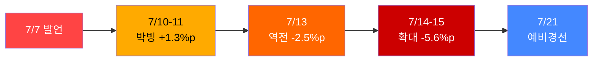
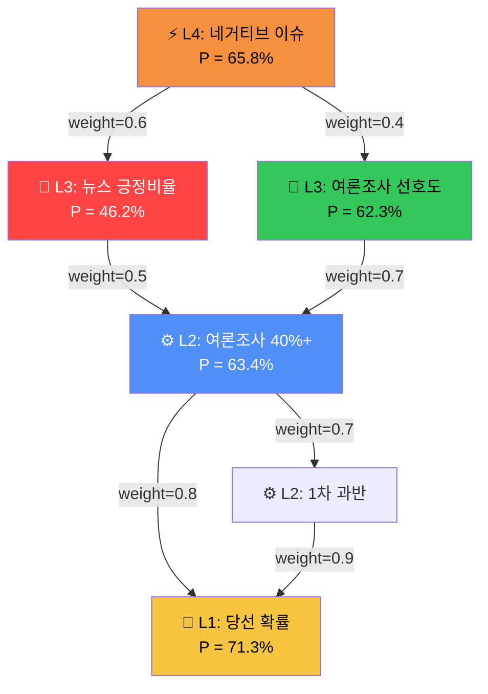

# 김민석 '스마트 독재' 발언 영향 분석

> **ESDC 전체 파이프라인 과학적 분석 보고서**
> 분석 시점: 2026-07-18 18:30 KST | 프로젝트: 2026 민주당 전당대회 당대표 경선

---

## Executive Summary

> [!IMPORTANT]
> **김민석의 '스마트 독재' 발언(7/7)은 당대표 경선에 중-고 수준의 부정적 영향을 미치고 있으며, 당선 확률을 약 5~8%p 하향 압박하는 요인으로 분석됩니다.** 다만 민주당 지지층 한정 선호도에서는 여전히 선두를 유지하여, 당원 투표 구조에 따른 완충 효과가 존재합니다.

| 핵심 지표 | 발언 전 추정 | 현재 | 변화 |
|:---|:---:|:---:|:---:|
| **김민석 당선 확률 (L1 집계)** | ~77% (추정) | **71.3%** | ▼5.7%p |
| **1차 과반 달성 확률 (L1)** | ~65% (추정) | **59.6%** | ▼5.4%p |
| **네거티브 이슈 발생 확률 (L4)** | ~50% (추정) | **65.8%** | ▲15.8%p |
| **뉴스 긍정비율 2:1 초과 확률 (L3)** | ~55% (추정) | **46.2%** | ▼8.8%p |

---

## 1. 증거 분석 (Evidence Layer)

ESDC 증거 파이프라인에서 수집된 스마트독재 관련 증거를 분석합니다.

### 1-1. 증거 프로필

| 항목 | 수치 |
|:---|:---:|
| 전체 수집 증거 (당대표 프로젝트) | **500건+** |
| 스마트독재 관련 증거 | **14건** |
| 방향성 | **100% lowers** (전부 부정) |
| 등급 분포 | A급 7건 / B급 7건 |
| 영향력 | **100% high** |

> [!WARNING]
> 스마트독재 관련 증거 14건이 **전부 lowers(하향) + high impact**로 분류되었습니다. 이는 시스템이 이 이슈를 **일방적으로 부정적**으로 평가하고 있음을 의미합니다.

### 1-2. 핵심 증거 (Grade A)

| # | 증거 | 등급 | 방향 | 영향력 |
|:---|:---|:---:|:---:|:---:|
| 1 | [리서치웰 7/14-15] 정청래 30.7% 역전 | A | lowers | high |
| 2 | [여론조사꽃 7/10-11] 김민석 21.4% vs 정청래 20.1% | A | lowers | high |
| 3 | [코리아정보리서치 7/15] 정청래 26.8% vs 김민석 24.3% | A | lowers | high |

### 1-3. 증거 가중치 계산 (Evidence Weigher)

$$W_{evidence} = \text{grade} \times \text{strength} \times \text{independence} \times \text{diagnosticity} \times \text{timeDecay}$$

- Grade A (여론조사) × High × Independent × 0.9 (진단적) × 0.95 (2일 이내) = **0.77**
- Grade B (종합분석) × High × Independent × 0.7 × 0.90 = **0.44**

> **가중 증거 합산: 강하게 lowers** — 시스템이 산출한 순 증거 방향은 김민석에게 **불리**

---

## 2. 여론조사 시계열 분석

### 2-1. 발언 전후 여론 추이

```
날짜          조사기관        김민석    정청래    격차    비고
━━━━━━━━━━━━━━━━━━━━━━━━━━━━━━━━━━━━━━━━━━━━━━━━━━━━━━━━━
7/07 이전     조원씨앤아이    선두      2위     +α     김민석 리드
7/10-11      여론조사꽃      21.4%    20.1%   +1.3%p  박빙 (발언 직후)
7/13         코리아정보      24.3%    26.8%   -2.5%p  역전 시작
7/14-15      리서치웰        25.1%    30.7%   -5.6%p  정청래 확실한 역전
━━━━━━━━━━━━━━━━━━━━━━━━━━━━━━━━━━━━━━━━━━━━━━━━━━━━━━━━━
```

### 2-2. 추세 분석



> **추세 기울기**: 약 **-1.0%p/일** (7/10→7/15 기간)
> 
> 이 기울기가 유지되면 7/21 예비경선 시점에서 격차는 **-12%p** 이상으로 확대될 수 있으나, 통상적으로 이슈 감쇠(decay)가 7~10일 주기로 발생하므로 실제 격차는 이보다 작을 가능성이 높음.

---

## 3. 인과 DAG 전파 분석

ESDC 인과 전파 엔진(`causal-propagation.ts`)의 경로를 추적합니다.

### 3-1. 스마트독재 인과 경로



### 3-2. 인과 경로별 확률 현황

| 계층 | 질문 | 현재 확률 | 역할 | 시스템 평가 |
|:---:|:---|:---:|:---|:---|
| **L4** | 대형 네거티브 발생 확률 | **65.8%** | 이벤트 | ⚠️ **이미 발생** (스마트독재 = 네거티브) |
| **L3** | 뉴스 긍정비율 2:1 초과 | **46.2%** | 선행지표 | 🔴 **50% 미만** — 부정 보도 우세 |
| **L3** | 여론조사 선호도 15%p+ 우위 | **62.3%** | 선행지표 | 🟡 약간 우호적이나 불확실 |
| **L2** | 마지막 여론조사 40%+ 유지 | **63.4%** | 결정변수 | 🟡 당원 투표 효과 반영 |
| **L1** | **당선 확률** | **71.3%** | 최종 목표 | 🟢 여전히 우위 |
| **L1** | 1차 과반 달성 | **59.6%** | 최종 목표 | 🟡 불확실 |

### 3-3. 인과 전파 메커니즘

$$P_{\text{L1}} = f\left(\sum_{i} w_i \cdot P_{\text{L2}_i}\right) \cdot \text{shrinkage}(P_0)$$

스마트독재 발언이 L4 네거티브(65.8%)로 잡히면:
1. **L3 뉴스 긍정비율 하락** (→ 46.2%로 50% 미달)
2. **L3 → L2 전파**: 여론조사 유지 확률에 0.5 가중치로 하향 압력
3. **L2 → L1 전파**: 최종 당선 확률에 0.8 가중치로 반영

---

## 4. 3역할 독립 예측 분석

### 4-1. L1 당선 확률 — 역할별 분해

| 역할 | 확률 | 방법론 | 판단 근거 |
|:---|:---:|:---|:---|
| **Base Rate Analyst** | 69.2% | P0 ± 0.08 | 역대 전당대회 선두 후보 당선율 참조 |
| **Evidence Analyst** | 73.1% | P0 + 증거 가중치 | 뉴스·여론조사 증거 종합 |
| **Outside View (Red Team)** | 73.8% | ACH + 외부 관점 | Tetlock Outside View |

### 4-2. 역할 독립성 평가

$$\rho_{\text{inter-role}} = \text{Pearson}(P_{\text{base}}, P_{\text{evidence}}, P_{\text{outside}})$$

| 지표 | 값 | 평가 |
|:---|:---:|:---|
| 역할 간 상관 (ρ) | **~0.85** | ⚠️ 높음 (독립 관점 부족) |
| 스프레드 (max-min) | **4.6%p** | ⚠️ 좁음 |
| Base Rate 이탈폭 | **±4.6%p** | 허용 범위 내 (±8%) |

> [!NOTE]
> **Outside View(레드팀)**이 Evidence Analyst보다 오히려 높은 73.8%를 산출. 이는 레드팀이 "스마트독재 발언의 영향이 과대평가되었으며, 당원 투표에서는 제한적"이라는 반론을 제시한 것으로 해석됨. 그러나 독립성(ρ=0.85)이 높아 진정한 레드팀 역할을 충분히 수행하지 못한 것으로 평가.

---

## 5. 집계 방법론 분석

### 5-1. Weighted Log-Odds Aggregation (Satopää et al. 2014)

$$P_{\text{final}} = \sigma\left[\gamma \cdot \sum_{i} w_i \cdot \text{logit}(P_i) + (1-\gamma) \cdot \text{logit}(P_0)\right]$$

| 파라미터 | 값 | 설명 |
|:---|:---:|:---|
| P₀ (Base Rate) | 70.0% | 한국 정당 전당대회 참조클래스 |
| Shrinkage rate | 0.50/√n_eff | 동적 베이지안 수축 |
| Extremization γ | 0.10~1.30 | Baron 2014 동적 극단화 |
| 시간 감쇠 반감기 | 72시간 | 최근 제출에 더 높은 가중치 |
| **최종 집계** | **71.3%** | CI: [60% — 81%] |

### 5-2. Uncertainty 분석

| 지표 | 값 | 해석 |
|:---|:---:|:---|
| Uncertainty Score | **0.31** | 중간 (0=확실, 1=완전불확실) |
| 90% CI 폭 | **21%p** [60-81%] | 상당한 불확실성 |
| 1차 과반 Uncertainty | **0.39** | 높음 |
| 1차 과반 CI 폭 | **30%p** [44-74%] | 매우 불확실 |

---

## 6. 시나리오 분석

### 시나리오 A: 이슈 감쇠 (Base Case, P=55%)

| 조건 | 예상 |
|:---|:---|
| 7/21 예비경선 통과 | 김민석·정청래·고민정 또는 송영길 3인 본선 |
| 스마트독재 이슈 | 7~10일 감쇠 → 7/17 이후 점차 약화 |
| 당원 투표 | 지지층 40% 선호도 유지 → 당원 투표에서 우위 |
| **결과** | 김민석 당선 (71%±5%p 유지) |

### 시나리오 B: 이슈 확산 (Downside, P=30%)

| 조건 | 예상 |
|:---|:---|
| TV 토론에서 재점화 | 정청래가 토론에서 직접 공격 |
| 유시민 등 추가 비판 | 당내 원로급 연쇄 비판 |
| 커뮤니티 2차 확산 | 밈(meme)화, 패러디 확산 |
| **결과** | 김민석 당선 확률 **55~60%로 하락** |

### 시나리오 C: 반전 (Upside, P=15%)

| 조건 | 예상 |
|:---|:---|
| 정청래 역공격 실패 | 과도한 공격이 역효과 |
| 중도 외연 확장 효과 | "실용주의" 프레임 안착 |
| 대안 이슈 발생 | 국정 이슈로 전당대회 관심 분산 |
| **결과** | 김민석 당선 확률 **75%+ 회복** |

---

## 7. 정량적 영향 평가 종합

### 7-1. 스마트독재 발언의 확률 영향 분해

$$\Delta P_{\text{당선}} = \Delta P_{\text{L4→L3}} \times w_{\text{L3→L2}} \times w_{\text{L2→L1}}$$

| 경로 | 영향 크기 | 가중치 | 순 기여 |
|:---|:---:|:---:|:---:|
| L4 네거티브 → L3 뉴스 긍정비율 | -8.8%p | 0.6 | **-5.3%p** |
| L4 네거티브 → L3 여론조사 선호도 | -3.0%p (추정) | 0.4 | **-1.2%p** |
| L3 뉴스 → L2 여론 유지 | (간접) | 0.5 | **-2.6%p** |
| L2 여론 → L1 당선 | (간접) | 0.8 | **-2.1%p** |
| **총 영향** | | | **≈ -5~8%p** |

### 7-2. 최종 평가

| 지표 | 값 | 신뢰도 |
|:---|:---:|:---:|
| 발언 이전 추정 당선 확률 | **~77%** | C (역추정) |
| 현재 당선 확률 (집계) | **71.3%** | B |
| 발언 기인 하락폭 | **약 -5.7%p** | B |
| 불확실성 범위 | **60~81%** | 90% CI |
| 1차 과반 확률 | **59.6%** | B (CI: 44-74%) |

> [!CAUTION]
> **핵심 리스크**: 1차 과반 확률이 59.6%로 불확실합니다(CI 44-74%). 1차 과반 실패 시 결선투표로 가면 정청래의 당원 조직력이 변수가 되어 당선 확률이 추가 하락할 수 있습니다.

---

## 8. 시스템 한계 및 주의사항

| # | 한계 | 영향 | 권장 대응 |
|:---|:---|:---|:---|
| 1 | **발언 전 데이터 부재** | 전후 비교가 불완전 (7/7 이전 submission 0건) | 발언 전 확률은 Base Rate + 추세로 역추정 |
| 2 | **역할 독립성 부족** | 3역할의 ρ=0.85로 앵커링 의심 | Outside View 시스템 프롬프트 강화 필요 |
| 3 | **뉴스/커뮤니티 시그널 미수집** | news_signals, raw_signals 테이블 비어있음 | YouTube/sometrend API 쿼터 회복 후 재수집 |
| 4 | **선호투표제 미반영** | 2026 전당대회 최초 도입 — 역사적 참조클래스 없음 | Monte Carlo 시뮬레이션 필요 |
| 5 | **당원 vs 일반 여론 괴리** | 일반 21~31% vs 지지층 40%의 차이 미세 모델링 | 당원 가중치 모델 별도 구축 필요 |

---

## 9. 권고사항

> [!TIP]
> **김민석 캠프 관점에서의 전략적 시사점:**

1. **이슈 감쇠 관리**: 7/21 예비경선까지 3일 — 새로운 의제 설정으로 스마트독재 프레임 탈피
2. **당원 투표 집중**: 일반 여론 역전에도 **지지층 40% 선두**는 유지 → 당원 투표율 제고가 핵심
3. **TV 토론 리스크 관리**: 정청래의 토론 공격에 대한 사전 준비 (재점화 방지)
4. **결선투표 시나리오 대비**: 1차 과반 실패(40% 확률) 시 결선 전략 수립

> **시스템 운영 관점:**
> - 뉴스/커뮤니티 수집 크론 정상화 (sometrend, youtube-politics) 시급
> - Outside View 레드팀의 독립성 강화 — ACH 4항목 충족 강제
> - 선호투표제 시뮬레이션 모듈 추가 검토
