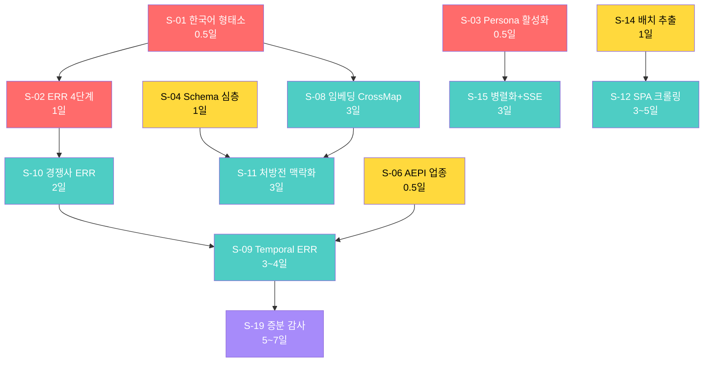

# Surface 역설계 시스템 정밀 고도화 구현 계획

> **대상 모듈**: `lib/surface/`, `lib/benchmark/`, `app/actions/site-audit.ts`
> **총 13개 항목**: S-01~S-04, S-06, S-08~S-12, S-14, S-15, S-19
> **총 예상 공수**: 30~42일
> **작성일**: 2026-06-18

---

## 의존성 DAG (실행 순서)



🔴 Phase 0 (즉시) | 🟡 Phase 0 (즉시, 저위험) | 🟢 Phase 1 (중기) | 🟣 Phase 2 (전략)

---

## P0-1. S-01 — 한국어 형태소 정규화

### 현재 코드 (수정 대상)

| 파일 | 위치 | 현재 코드 |
|---|---|---|
| `entity-reflection-runner.ts` | `isEntityReflected()` 함수 (L87~130) | `normalizedResponse.includes(normalizedName)` |

### 신규 파일

#### [NEW] `lib/benchmark/korean-normalizer.ts`

```typescript
/**
 * 한국어 텍스트 정규화 유틸리티
 * - 조사(particle) 스트리핑
 * - 복합 조사 처리 (에서, 까지, 부터, 마저, 조차, 이라도)
 * - 유니코드 자모 분리 fallback
 */

// 1글자 조사 (빈도순)
const SINGLE_PARTICLES = /[은는이가을를의에서로와과도만]/g;

// 2글자 복합 조사
const COMPOUND_PARTICLES = /(에서|까지|부터|마저|조차|이라|에게|한테|처럼|만큼|대로|밖에)$/g;

// 초성 분리 (ㄱ=0x3131, 가=0xAC00)
const CHOSUNG = ['ㄱ','ㄲ','ㄴ','ㄷ','ㄸ','ㄹ','ㅁ','ㅂ','ㅃ','ㅅ','ㅆ','ㅇ','ㅈ','ㅉ','ㅊ','ㅋ','ㅌ','ㅍ','ㅎ'];

export function normalizeKorean(text: string): string {
  return text
    .replace(COMPOUND_PARTICLES, '')
    .replace(SINGLE_PARTICLES, '')
    .replace(/\s+/g, ' ')
    .trim();
}

export function extractChosung(text: string): string {
  return [...text].map(ch => {
    const code = ch.charCodeAt(0);
    if (code >= 0xAC00 && code <= 0xD7A3) {
      return CHOSUNG[Math.floor((code - 0xAC00) / 588)];
    }
    return ch;
  }).join('');
}

/**
 * 3단계 한국어 퍼지 매칭
 * 1. 조사 제거 후 문자열 포함 검사
 * 2. 단어 분리 후 80% 매칭
 * 3. 초성 매칭 (최종 fallback)
 */
export function fuzzyKoreanMatch(target: string, response: string): boolean {
  const normTarget = normalizeKorean(target.toLowerCase());
  const normResponse = normalizeKorean(response.toLowerCase());
  
  // 1차: 정규화된 문자열 포함 검사
  if (normResponse.includes(normTarget)) return true;
  
  // 2차: 단어 단위 분리 후 80% 매칭
  const targetWords = normTarget.split(/\s+/).filter(w => w.length > 1);
  if (targetWords.length === 0) return false;
  const matchCount = targetWords.filter(w => normResponse.includes(w)).length;
  if (matchCount / targetWords.length >= 0.8) return true;
  
  // 3차: 초성 매칭 (마지막 fallback, 3글자 이상만)
  const chosungTarget = extractChosung(normTarget);
  const chosungResponse = extractChosung(normResponse);
  if (chosungTarget.length >= 3 && chosungResponse.includes(chosungTarget)) return true;
  
  return false;
}
```

### 수정 사항

| 파일 | 변경 | 상세 |
|---|---|---|
| `entity-reflection-runner.ts` | L1~5 import 추가 | `import { fuzzyKoreanMatch, normalizeKorean } from './korean-normalizer';` |
| `entity-reflection-runner.ts` | L92 Tier 1 매칭 | `normalizedResponse.includes(normalizedName)` → `fuzzyKoreanMatch(normalizedName, normalizedResponse)` |
| `entity-reflection-runner.ts` | L98~102 Tier 2 키워드 | `entity_content.split(/\s+/)` → `normalizeKorean(entity_content).split(/\s+/)` |

### 테스트 케이스

```
1. "나이아신아마이드" → "나이아신아마이드가 함유된 세럼" ⇒ true (조사 제거)
2. "히알루론산" → "히알루론산을 기반으로 한" ⇒ true (조사 제거)
3. "비타민C" → "비타민 C 성분" ⇒ true (공백 정규화)
4. "레티놀" → "레티날 성분" ⇒ false (다른 물질, 정상 거부)
5. "나이아신아마이드 세럼" → "이 세럼에는 나이아신아마이드 성분이" ⇒ true (단어 80%+)
6. 초성 매칭: "나이아신아마이드" → "ㄴㅇㅅㄴㅇㅁㅇㄷ" ⇒ true (fallback)
```

---

## P0-2. S-02 — ERR 4단계 반영 품질 (Binary → Granular)

### 의존성: S-01 완료 필요

### 타입 변경

#### [MODIFY] `lib/schema.ts` — EntityReflectionSnapshot 확장

```typescript
// 신규 타입 추가 (기존 스키마 #94 근처)
export type ReflectionQuality = 'exact' | 'partial' | 'distorted' | 'absent';

export interface EntityReflectionDetail {
  entity_id: string;
  entity_name: string;
  surface_type: string;
  quality: ReflectionQuality;
  matched_text?: string;         // AI 응답에서 실제 매칭된 텍스트 스니펫
  keyword_overlap: number;       // 0~1 키워드 겹침 비율
  competitor_mentioned?: string; // S-10과 연계
}
```

### 수정: `isEntityReflected()` → `classifyReflection()`

```typescript
// entity-reflection-runner.ts L87~130 전체 교체

function classifyReflection(
  entity: SurfaceEntity,
  responseText: string,
  brandDomains: string[]
): ReflectionQuality {
  const normResponse = normalizeKorean(responseText.toLowerCase());
  const normName = normalizeKorean(entity.entity_name.toLowerCase());
  
  // 키워드 오버랩 계산
  const entityKeywords = normalizeKorean(entity.entity_content.toLowerCase())
    .split(/\s+/).filter(w => w.length > 2);
  const keywordOverlap = entityKeywords.length > 0
    ? entityKeywords.filter(kw => normResponse.includes(kw)).length / entityKeywords.length
    : 0;
  
  // exact: 이름 포함 + 키워드 80%+
  if (fuzzyKoreanMatch(entity.entity_name, responseText)) {
    if (keywordOverlap >= 0.8) return 'exact';
    if (keywordOverlap >= 0.4) return 'partial';
    return 'partial'; // 이름은 있으나 내용 약함
  }
  
  // partial: 이름 없지만 키워드 60%+
  if (keywordOverlap >= 0.6) return 'partial';
  
  // distorted: 키워드 20~60% (부분적/왜곡된 정보)
  if (keywordOverlap >= 0.2) return 'distorted';
  
  // 도메인 인용 체크
  if (brandDomains.some(d => normResponse.includes(d))) return 'partial';
  
  return 'absent';
}
```

### ERR 차원 계산 가중치 변경

```typescript
// 기존: reflected / total (binary)
// 개선: 가중 합산
function calcDimensionERR(details: EntityReflectionDetail[]): number {
  if (details.length === 0) return 0;
  const QUALITY_WEIGHTS: Record<ReflectionQuality, number> = {
    exact: 1.0, partial: 0.6, distorted: 0.2, absent: 0.0,
  };
  const weightedSum = details.reduce((sum, d) => sum + QUALITY_WEIGHTS[d.quality], 0);
  return weightedSum / details.length;
}
```

### 반환 타입 변경

| 위치 | 기존 | 변경 |
|---|---|---|
| `runEntityReflection()` 반환 | `reflectedEntityIds: string[]` | `reflectionDetails: EntityReflectionDetail[]` |
| `gap-analyzer.ts` 입력 | `reflectedEntityIds: string[]` | `reflectionDetails: EntityReflectionDetail[]` |
| `site-audit.ts` 전달 | `reflectedEntityIds` | `reflectionDetails` |

---

## P0-3. S-03 — PersonaReverseEngineer 활성화

### 수정 대상

| 파일 | 위치 | 변경량 |
|---|---|---|
| `site-audit.ts` | L225~235 (Step 9) | ~15줄 |

### Before → After

```diff
- // Step 9: Persona Reverse Engineering (skipped for now)
- // TODO: Implement PersonaReverseEngineer integration
- // const persona = await reverseEngineerPersona({
- //   responses: allResponses,
- //   brandName: params.brandName,
- // });
- let persona = null;
+ // Step 9: Persona Reverse Engineering
+ params.onProgress?.({ step: 9, total: 10, message: 'Step 9: AI 브랜드 페르소나 역분석' });
+ let persona: ObservedPersona | null = null;
+ try {
+   if (allResponses.length >= 3) {
+     persona = await reverseEngineerPersona({
+       responses: allResponses,
+       brandName: params.brandName,
+       intendedPersona: params.intendedPersona,
+     });
+   }
+ } catch (error) {
+   console.warn('[Site Audit] Persona analysis failed, skipping:', error);
+ }
```

### 추가 import

```typescript
import { reverseEngineerPersona, type ObservedPersona } from '@/lib/surface/persona-reverse-engineer';
```

---

## P0-4. S-04 — Schema.org 심층 파싱

### 수정 대상

| 파일 | 함수 | 현재 L30~55 |
|---|---|---|
| `llm-entity-extractor.ts` | `extractSchemaOrgEntities()` | `@type` + `name`만 추출 |

### 타입별 핵심 속성 매핑

```typescript
const SCHEMA_DEEP_FIELDS: Record<string, string[]> = {
  'Product':       ['name','description','brand','offers','aggregateRating','image','sku','category'],
  'FAQPage':       ['mainEntity'],
  'HowTo':         ['name','step','totalTime','estimatedCost','supply','tool'],
  'LocalBusiness': ['name','address','telephone','openingHours','geo','priceRange','aggregateRating'],
  'Organization':  ['name','url','logo','contactPoint','sameAs','foundingDate'],
  'MedicalEntity': ['name','code','guideline','relevantSpecialty'],
  'Recipe':        ['name','recipeIngredient','recipeInstructions','nutrition','cookTime'],
  'Article':       ['headline','author','datePublished','publisher','wordCount'],
  'Review':        ['itemReviewed','reviewRating','author','reviewBody'],
};

function extractSchemaOrgDeep(page: CrawledPage): Partial<SurfaceEntity>[] {
  const entities: Partial<SurfaceEntity>[] = [];
  for (const schema of page.schemas || []) {
    const type = schema['@type'] as string;
    const fields = SCHEMA_DEEP_FIELDS[type] || ['name'];
    
    const extractedProps: Record<string, unknown> = {};
    const missingProps: string[] = [];
    
    for (const field of fields) {
      if (schema[field] !== undefined) extractedProps[field] = schema[field];
      else missingProps.push(field);
    }
    
    // FAQPage 특수 처리: mainEntity 배열에서 개별 질문 추출
    if (type === 'FAQPage' && Array.isArray(schema['mainEntity'])) {
      for (const faq of schema['mainEntity']) {
        entities.push({
          entity_name: faq.name || faq.question || 'FAQ',
          surface_type: 'schema_org',
          has_schema_support: true,
          entity_content: faq.acceptedAnswer?.text || '',
          completeness_score: 1.0,
        });
      }
    }
    
    entities.push({
      entity_name: (schema['name'] || schema['headline'] || type) as string,
      surface_type: 'schema_org',
      has_schema_support: true,
      entity_content: JSON.stringify(extractedProps).slice(0, 1000),
      completeness_score: Object.keys(extractedProps).length / fields.length,
      metadata: { schema_type: type, missing_fields: missingProps },
    });
  }
  return entities;
}
```

---

## P0-5. S-06 — AEPI 업종 프리셋 확장

### 수정 대상

| 파일 | 위치 | 현재 |
|---|---|---|
| `aepi-calculator.ts` | `INDUSTRY_WEIGHTS` (L3~16) | 4개 업종 |

### 추가 8개 업종 + Sub-Score Breakdown

```typescript
const INDUSTRY_WEIGHTS: Record<string, Record<string, number>> = {
  // 기존 4개 유지
  skincare:       { factoid:0.20, procedural:0.15, comparative:0.25, authority:0.15, schema_org:0.10, topical_cluster:0.10, local_geo:0.05 },
  wedding_studio: { factoid:0.10, procedural:0.10, comparative:0.15, authority:0.10, schema_org:0.10, topical_cluster:0.15, local_geo:0.30 },
  medical:        { factoid:0.25, procedural:0.20, comparative:0.10, authority:0.25, schema_org:0.10, topical_cluster:0.05, local_geo:0.05 },
  
  // v2.0 추가
  k_beauty:     { factoid:0.15, procedural:0.20, comparative:0.25, authority:0.10, schema_org:0.10, topical_cluster:0.15, local_geo:0.05 },
  food_bev:     { factoid:0.20, procedural:0.15, comparative:0.20, authority:0.10, schema_org:0.15, topical_cluster:0.10, local_geo:0.10 },
  education:    { factoid:0.25, procedural:0.15, comparative:0.15, authority:0.20, schema_org:0.10, topical_cluster:0.10, local_geo:0.05 },
  pet_care:     { factoid:0.20, procedural:0.20, comparative:0.20, authority:0.15, schema_org:0.10, topical_cluster:0.10, local_geo:0.05 },
  legal:        { factoid:0.15, procedural:0.15, comparative:0.10, authority:0.30, schema_org:0.10, topical_cluster:0.05, local_geo:0.15 },
  finance:      { factoid:0.20, procedural:0.15, comparative:0.15, authority:0.25, schema_org:0.10, topical_cluster:0.10, local_geo:0.05 },
  fashion:      { factoid:0.10, procedural:0.10, comparative:0.30, authority:0.10, schema_org:0.10, topical_cluster:0.25, local_geo:0.05 },
  travel:       { factoid:0.15, procedural:0.15, comparative:0.15, authority:0.10, schema_org:0.10, topical_cluster:0.10, local_geo:0.25 },
  real_estate:  { factoid:0.15, procedural:0.10, comparative:0.15, authority:0.15, schema_org:0.10, topical_cluster:0.05, local_geo:0.30 },
  
  default:      { factoid:0.15, procedural:0.15, comparative:0.15, authority:0.15, schema_org:0.15, topical_cluster:0.15, local_geo:0.10 },
};

// 신규 export: AEPI 세부 분석 반환
export interface AEPIBreakdown {
  composite: number;
  dimensions: Record<string, number>;
  tech_modifier: number;
  eeat_modifier: number;
  industry: string;
  weights_used: Record<string, number>;
}

export function calculateAEPIWithBreakdown(snapshot: EntityReflectionSnapshot, industry: string): AEPIBreakdown {
  const weights = INDUSTRY_WEIGHTS[industry] || INDUSTRY_WEIGHTS.default;
  const dimensions: Record<string, number> = {};
  let baseScore = 0;
  
  for (const [dim, weight] of Object.entries(weights)) {
    const errKey = `err_${dim}` as keyof EntityReflectionSnapshot;
    const dimScore = (snapshot[errKey] as number || 0) * 100;
    dimensions[dim] = Math.round(dimScore);
    baseScore += dimScore * weight;
  }
  
  return {
    composite: Math.round(baseScore * snapshot.tech_mod_score * snapshot.eeat_mod_score),
    dimensions,
    tech_modifier: snapshot.tech_mod_score,
    eeat_modifier: snapshot.eeat_mod_score,
    industry,
    weights_used: weights,
  };
}
```

---

## P1-1. S-08 — 임베딩 기반 QIS Cross-Mapping

### 의존성: S-01 완료 필요 (한국어 정규화)

### 수정 전략

기존 Jaccard를 **1차 빠른 필터**로 유지하고, 미매칭 건에 대해 **임베딩 유사도 2차 검사** 추가.

### 수정 대상

| 파일 | 함수 | 변경 |
|---|---|---|
| `qis-cross-mapper.ts` | `crossMap()` | async로 변경 + 임베딩 2차 검사 추가 |

```typescript
import { EmbeddingProvider } from '@/lib/ai/embedding-provider';
import { cosineSimilarity } from '@/lib/signal-collection/semantic-dedup'; // 기존 유틸 재활용

export async function semanticCrossMap(
  industryQuestions: string[],
  siteQuestions: string[],
  options: { jaccardThreshold?: number; embeddingThreshold?: number } = {}
): Promise<UnifiedQuestionMapping[]> {
  const { jaccardThreshold = 0.3, embeddingThreshold = 0.80 } = options;
  const results: UnifiedQuestionMapping[] = [];
  const unmatchedIndustry: { question: string; index: number }[] = [];
  
  // Phase 1: Jaccard 빠른 매칭 (~0ms per pair)
  for (const iq of industryQuestions) {
    let bestMatch: { question: string; score: number } | null = null;
    for (const sq of siteQuestions) {
      const score = jaccardSimilarity(iq, sq);
      if (score >= jaccardThreshold && (!bestMatch || score > bestMatch.score)) {
        bestMatch = { question: sq, score };
      }
    }
    if (bestMatch) {
      results.push({
        industry_question: iq, site_question: bestMatch.question,
        similarity_score: bestMatch.score, coverage_status: 'both', matched_keywords: [],
      });
    } else {
      unmatchedIndustry.push({ question: iq, index: results.length });
    }
  }
  
  // Phase 2: 미매칭 건 임베딩 유사도 (~50ms per batch)
  if (unmatchedIndustry.length > 0 && siteQuestions.length > 0) {
    const embedder = new EmbeddingProvider();
    const iqTexts = unmatchedIndustry.map(u => u.question);
    const [industryEmbeddings, siteEmbeddings] = await Promise.all([
      embedder.embedBatch(iqTexts),
      embedder.embedBatch(siteQuestions),
    ]);
    
    for (let i = 0; i < unmatchedIndustry.length; i++) {
      let bestIdx = -1, bestSim = 0;
      for (let j = 0; j < siteQuestions.length; j++) {
        const sim = cosineSimilarity(industryEmbeddings[i], siteEmbeddings[j]);
        if (sim > bestSim) { bestSim = sim; bestIdx = j; }
      }
      if (bestSim >= embeddingThreshold && bestIdx >= 0) {
        results.push({
          industry_question: unmatchedIndustry[i].question,
          site_question: siteQuestions[bestIdx],
          similarity_score: bestSim,
          coverage_status: 'both',
          matched_keywords: ['[semantic_match]'],
        });
      } else {
        results.push({
          industry_question: unmatchedIndustry[i].question,
          similarity_score: 0,
          coverage_status: 'industry_only',
          matched_keywords: [],
        });
      }
    }
  }
  
  // Phase 3: site_only 질문 (사이트에만 있고 업종 패널에 없는 것)
  const matchedSiteQs = new Set(results.filter(r => r.site_question).map(r => r.site_question));
  for (const sq of siteQuestions) {
    if (!matchedSiteQs.has(sq)) {
      results.push({ site_question: sq, similarity_score: 0, coverage_status: 'site_only', matched_keywords: [] });
    }
  }
  
  return results;
}
```

### 비용 영향

| 항목 | 비용 |
|---|---|
| 임베딩 API 호출 (40질문 × 2세트 = 80건) | ~₩100 |
| Jaccard 1차 필터로 ~70% 매칭 | 임베딩은 ~30%만 처리 |
| `site-audit.ts` 변경 | `crossMap()` → `await semanticCrossMap()` |

---

## P1-2. S-09 — Temporal ERR Tracking

### 신규 파일

#### [NEW] `lib/benchmark/err-timeline.ts`

```typescript
import type { EntityReflectionSnapshot } from '@/lib/schema';
import type { AEPIBreakdown } from './aepi-calculator';

export interface ERRTimelineEntry {
  snapshot_id: string;
  measured_at: Date;
  aepi_score: number;
  aepi_breakdown: AEPIBreakdown;
  err_dimensions: Record<string, number>;
  total_entities: number;
  reflected_count: number;
}

export interface ERRTrend {
  entries: ERRTimelineEntry[];
  aepi_delta: number;
  improving_dimensions: string[];
  declining_dimensions: string[];
  period_summary: string;
}

export function computeTrend(entries: ERRTimelineEntry[]): ERRTrend {
  if (entries.length < 2) {
    return { entries, aepi_delta: 0, improving_dimensions: [], declining_dimensions: [], period_summary: '데이터 부족 (최소 2회 측정 필요)' };
  }
  
  const [latest, previous] = entries;
  const aepi_delta = latest.aepi_score - previous.aepi_score;
  
  const improving: string[] = [];
  const declining: string[] = [];
  const dims = ['factoid','procedural','comparative','authority','schema_org','topical_cluster','local_geo'];
  
  for (const dim of dims) {
    const delta = (latest.err_dimensions[dim] || 0) - (previous.err_dimensions[dim] || 0);
    if (delta > 0.05) improving.push(dim);
    if (delta < -0.05) declining.push(dim);
  }
  
  return {
    entries,
    aepi_delta,
    improving_dimensions: improving,
    declining_dimensions: declining,
    period_summary: `AEPI ${aepi_delta >= 0 ? '+' : ''}${aepi_delta}p (${previous.aepi_score} → ${latest.aepi_score})`,
  };
}
```

### DB 마이그레이션

```sql
-- db/migrations/0030_err_timeline.sql
CREATE INDEX IF NOT EXISTS idx_err_snapshot_timeline 
  ON entity_reflection_snapshots(workspace_id, brand_name, measured_at DESC);
```

---

## P1-3. S-10 — 경쟁사 ERR 비교

### 의존성: S-02 (ERR 4단계) 완료 필요

### 수정 대상

| 파일 | 함수 | 추가 파라미터 |
|---|---|---|
| `entity-reflection-runner.ts` | `classifyReflection()` | `competitors: string[]` |

```typescript
function classifyReflectionWithCompetitor(
  entity: SurfaceEntity,
  responseText: string,
  brandDomains: string[],
  competitors: string[]
): EntityReflectionDetail {
  const quality = classifyReflection(entity, responseText, brandDomains);
  
  // 경쟁사 탈취 검사 (absent 또는 distorted일 때만)
  let competitor_mentioned: string | undefined;
  if (quality === 'absent' || quality === 'distorted') {
    for (const comp of competitors) {
      if (fuzzyKoreanMatch(comp, responseText)) {
        competitor_mentioned = comp;
        break;
      }
    }
  }
  
  return {
    entity_id: entity.id,
    entity_name: entity.entity_name,
    surface_type: entity.surface_type,
    quality,
    keyword_overlap: calcKeywordOverlap(entity.entity_content, responseText),
    competitor_mentioned,
  };
}
```

---

## P1-4. S-11 — 처방전 맥락화

### 의존성: S-04 (Schema 심층), S-08 (임베딩 CrossMap) 완료 필요

### 신규 타입

```typescript
export type YellowCause = 
  | 'missing_schema'
  | 'incomplete_schema'
  | 'weak_heading'
  | 'thin_content'
  | 'no_eeat_signal'
  | 'poor_internal_linking'
  | 'low_freshness';

export interface ContextualPrescription extends Prescription {
  cause: YellowCause;
  estimated_effort: 'low' | 'medium' | 'high';
  specific_action: string;
}
```

### 원인 진단 로직

```typescript
function diagnoseYellowCauses(entity: SurfaceEntity, page?: CrawledPage): YellowCause[] {
  const causes: YellowCause[] = [];
  
  if (!entity.has_schema_support) causes.push('missing_schema');
  else if ((entity.metadata?.missing_fields as string[])?.length > 2) causes.push('incomplete_schema');
  
  if (page && !page.headings?.some(h => h.level <= 2 && 
    fuzzyKoreanMatch(entity.entity_name, h.text))) causes.push('weak_heading');
  
  if ((entity.entity_content?.length || 0) < 300) causes.push('thin_content');
  if ((entity.eeat_strength || 0) < 0.3) causes.push('no_eeat_signal');
  
  return causes.length > 0 ? causes : ['no_eeat_signal'];
}

const CAUSE_PRESCRIPTIONS: Record<YellowCause, Omit<ContextualPrescription, 'cause'>> = {
  missing_schema: { type: 'add_schema', detail: 'Schema.org 마크업 추가', estimated_aepi_impact: 0.15, priority_score: 0.9, estimated_effort: 'low', specific_action: '' },
  incomplete_schema: { type: 'add_schema', detail: '기존 Schema에 누락 필드 추가', estimated_aepi_impact: 0.10, priority_score: 0.8, estimated_effort: 'low', specific_action: '' },
  weak_heading: { type: 'improve_heading', detail: 'H2/H3 헤딩 구조 개선', estimated_aepi_impact: 0.08, priority_score: 0.7, estimated_effort: 'low', specific_action: '' },
  thin_content: { type: 'create_content', detail: '콘텐츠 보강 (최소 1000자)', estimated_aepi_impact: 0.12, priority_score: 0.85, estimated_effort: 'high', specific_action: '' },
  no_eeat_signal: { type: 'add_eeat_signal', detail: 'E-E-A-T 신호 추가', estimated_aepi_impact: 0.10, priority_score: 0.75, estimated_effort: 'medium', specific_action: '' },
  poor_internal_linking: { type: 'improve_heading', detail: '내부 링크 추가', estimated_aepi_impact: 0.05, priority_score: 0.5, estimated_effort: 'low', specific_action: '' },
  low_freshness: { type: 'create_content', detail: '콘텐츠 최신화', estimated_aepi_impact: 0.08, priority_score: 0.6, estimated_effort: 'medium', specific_action: '' },
};
```

---

## P1-5. S-12 — SPA/JS 렌더링 크롤링 Fallback

### 의존성: 서버에 Playwright 설치 필요

```bash
npm install playwright-core
npx playwright install chromium
```

### 수정: `website-crawler.ts`

```typescript
async function fetchPageHtml(url: string): Promise<{ html: string; usedJs: boolean }> {
  // 1차: 순수 fetch
  try {
    const res = await fetch(url, {
      headers: { 'User-Agent': 'BSW-Crawler/2.0 (+https://bsw.kr)' },
      signal: AbortSignal.timeout(10000),
    });
    const html = await res.text();
    const bodyText = html.replace(/<script[\s\S]*?<\/script>/gi, '')
                         .replace(/<style[\s\S]*?<\/style>/gi, '')
                         .replace(/<[^>]*>/g, '').trim();
    
    if (bodyText.length >= 200) return { html, usedJs: false };
  } catch {}
  
  // 2차: Playwright fallback
  const { chromium } = await import('playwright-core');
  const browser = await chromium.launch({ headless: true });
  try {
    const page = await browser.newPage();
    await page.goto(url, { waitUntil: 'networkidle', timeout: 15000 });
    const html = await page.content();
    return { html, usedJs: true };
  } finally {
    await browser.close();
  }
}
```

### 추가: robots.txt + sitemap.xml

```typescript
async function discoverUrls(baseUrl: string, maxPages: number): Promise<string[]> {
  const urls: Set<string> = new Set([baseUrl]);
  
  // 1. sitemap.xml 시도
  try {
    const sitemapRes = await fetch(new URL('/sitemap.xml', baseUrl).href);
    const sitemapXml = await sitemapRes.text();
    const locMatches = sitemapXml.matchAll(/<loc>(.*?)<\/loc>/g);
    for (const m of locMatches) urls.add(m[1]);
  } catch {}
  
  // 2. 우선 크롤링 경로
  const priorityPaths = ['/about', '/products', '/faq', '/blog', '/company', '/services'];
  for (const path of priorityPaths) {
    urls.add(new URL(path, baseUrl).href);
  }
  
  // 3. robots.txt Disallow 체크
  const disallowed: string[] = [];
  try {
    const robotsRes = await fetch(new URL('/robots.txt', baseUrl).href);
    const robotsTxt = await robotsRes.text();
    for (const line of robotsTxt.split('\n')) {
      if (line.startsWith('Disallow:')) disallowed.push(line.slice(10).trim());
    }
  } catch {}
  
  return [...urls]
    .filter(u => !disallowed.some(d => new URL(u).pathname.startsWith(d)))
    .slice(0, maxPages);
}
```

---

## P1-6. S-14 — 엔티티 추출 배치 처리

### 수정: `llm-entity-extractor.ts`

```typescript
const BATCH_SIZE = 3;

async function extractEntitiesBatch(pages: CrawledPage[], workspaceId: string): Promise<SurfaceEntity[]> {
  const allEntities: SurfaceEntity[] = [];
  
  for (let i = 0; i < pages.length; i += BATCH_SIZE) {
    const batch = pages.slice(i, i + BATCH_SIZE);
    const combinedText = batch.map((p, idx) => 
      `---PAGE ${idx + 1}: ${p.url}---\nTitle: ${p.title}\n${p.bodyText.slice(0, 2000)}`
    ).join('\n\n===PAGE_BREAK===\n\n');
    
    const { object } = await generateObject({
      model: getModel('entity-extraction'),
      schema: batchEntitySchema,
      prompt: `Extract all knowledge entities from ${batch.length} pages below. For each entity, specify which page (1~${batch.length}) it came from.\n\n${combinedText}`,
    });
    
    for (const entity of object.entities) {
      const pageIdx = (entity.page_number || 1) - 1;
      allEntities.push({
        ...entity,
        workspace_id: workspaceId,
        source_url: batch[pageIdx]?.url,
      });
    }
  }
  
  return allEntities;
}
```

---

## P1-7. S-15 — 파이프라인 병렬화 + SSE

### 수정: `site-audit.ts` (Step 7~9 병렬화)

```typescript
// 기존: 직렬 (Step 7 → 8 → 9 → 10)
// 개선: Step 7 + Step 9 병렬 → Step 8 → Step 10

params.onProgress?.({ step: 7, total: 10, message: 'Step 7~9: ERR + Persona 동시 분석 중...' });

const [errResult, persona] = await Promise.all([
  runEntityReflection({
    entities, probeQuestions, brandDomains, engineNames, workspaceId,
    competitors: params.competitors || [],
  }),
  (allResponses.length >= 3 
    ? reverseEngineerPersona({ responses: allResponses, brandName: params.brandName })
    : Promise.resolve(null)
  ).catch(() => null),
]);

// AEPI는 ERR 완료 필요
params.onProgress?.({ step: 8, total: 10, message: 'Step 8: AEPI 산출' });
const aepiBreakdown = calculateAEPIWithBreakdown(errResult.snapshot, params.industry);

// Gap은 ERR + QIS 둘 다 필요
params.onProgress?.({ step: 10, total: 10, message: 'Step 10: 갭 분석' });
const gaps = analyzeGapsContextual({
  entities, reflectionDetails: errResult.reflectionDetails, qisMappings, pages,
});
```

### SSE 엔드포인트

#### [NEW] `app/api/site-audit/stream/route.ts`

```typescript
export async function POST(req: Request) {
  const params = await req.json();
  const stream = new TransformStream();
  const writer = stream.writable.getWriter();
  const encoder = new TextEncoder();
  
  runSiteAudit({
    ...params,
    onProgress: async (progress) => {
      await writer.write(encoder.encode(`data: ${JSON.stringify(progress)}\n\n`));
    },
  }).then(async (result) => {
    await writer.write(encoder.encode(`data: ${JSON.stringify({ type: 'complete', result })}\n\n`));
    await writer.close();
  }).catch(async (error) => {
    await writer.write(encoder.encode(`data: ${JSON.stringify({ type: 'error', error: error.message })}\n\n`));
    await writer.close();
  });
  
  return new Response(stream.readable, {
    headers: { 'Content-Type': 'text/event-stream', 'Cache-Control': 'no-cache' },
  });
}
```

---

## P2-1. S-19 — 증분 감사 (Incremental Audit)

### 신규 파일

#### [NEW] `lib/surface/audit-cache.ts`

```typescript
import { createHash } from 'crypto';
import type { CrawledPage } from './website-crawler';

export interface CachedPageState {
  url: string;
  content_hash: string;
  last_crawled_at: Date;
  entity_ids: string[];
}

export function computeContentHash(html: string): string {
  const normalized = html
    .replace(/<script[\s\S]*?<\/script>/gi, '')
    .replace(/<style[\s\S]*?<\/style>/gi, '')
    .replace(/\d{10,13}/g, '')
    .replace(/[a-f0-9]{32,}/gi, '')
    .trim();
  return createHash('sha256').update(normalized).digest('hex').slice(0, 16);
}

export function getChangedPages(
  currentPages: CrawledPage[],
  cachedStates: CachedPageState[]
): { changed: CrawledPage[]; unchanged: CachedPageState[] } {
  const cacheMap = new Map(cachedStates.map(s => [s.url, s]));
  const changed: CrawledPage[] = [];
  const unchanged: CachedPageState[] = [];
  
  for (const page of currentPages) {
    const cached = cacheMap.get(page.url);
    const currentHash = computeContentHash(page.html || '');
    
    if (cached && cached.content_hash === currentHash) {
      unchanged.push(cached);
    } else {
      changed.push(page);
    }
  }
  
  return { changed, unchanged };
}
```

### DB 마이그레이션

```sql
-- db/migrations/0031_audit_cache.sql
CREATE TABLE IF NOT EXISTS audit_page_cache (
  id UUID PRIMARY KEY DEFAULT gen_random_uuid(),
  workspace_id UUID NOT NULL,
  brand_name TEXT NOT NULL,
  url TEXT NOT NULL,
  content_hash TEXT NOT NULL,
  last_crawled_at TIMESTAMPTZ DEFAULT NOW(),
  entity_ids TEXT[] DEFAULT '{}',
  UNIQUE(workspace_id, brand_name, url)
);

CREATE INDEX idx_audit_cache_lookup ON audit_page_cache(workspace_id, brand_name);
```

---

## Sprint 타임라인

| Sprint | 기간 | 항목 | 산출물 |
|---|---|---|---|
| **Sprint 1** | Day 1~3 | S-01, S-03, S-06, S-04 | 한국어 정규화, Persona 활성화, AEPI 12업종, Schema 심층 |
| **Sprint 2** | Day 4~6 | S-02, S-14 | ERR 4단계, 배치 추출 |
| **Sprint 3** | Day 7~12 | S-08, S-10, S-11 | 임베딩 CrossMap, 경쟁사 ERR, 처방전 맥락화 |
| **Sprint 4** | Day 13~17 | S-09, S-15 | Temporal ERR Tracking, 파이프라인 병렬화+SSE |
| **Sprint 5** | Day 18~24 | S-12 | SPA 크롤링 (Playwright + robots.txt + sitemap) |
| **Sprint 6** | Day 25~32 | S-19 | 증분 감사 (audit-cache + incremental pipeline) |

---

## 검증 계획

| 검증 유형 | 방법 | 대상 항목 |
|---|---|---|
| **단위 테스트** | Vitest | `korean-normalizer.ts`, `err-timeline.ts`, `audit-cache.ts` |
| **통합 테스트** | 실제 브랜드 3곳 감사 | 이니스프리, 닥터자르트, 올리브영 |
| **회귀 테스트** | S-01/S-02 적용 전후 ERR 비교 | ERR 정확도 변동 추적 |
| **성능 테스트** | 실행 시간 측정 | S-14 배치 전/후, S-15 병렬 전/후 |
| **빌드 검증** | `npx tsc --noEmit` | 전체 TypeScript 컴파일 |
