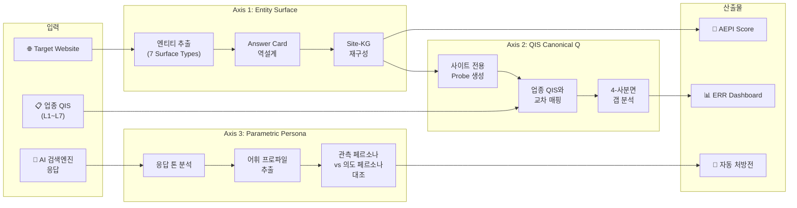

# Part 1 — 전략 아키텍처: 웹사이트 AEO/GEO 서피스 역설계 시스템

> BSW-OS의 기존 QIS · Canonical Question · PersonaSpec · TCO Concept 체계와  
> 완전히 정합하는 **Website Surface Reverse-Engineering System** 전략 설계서

---

## 0. 전체 시스템 위상 — BSW-OS 7-Layer 내에서의 좌표

```
BSW-OS 전체 아키텍처 (기존 스키마 #1~#90)

Layer 1 — Truth          OperationalTruth(#11) · EvidenceItem(#14) · BoundaryRule(#15)
                         "브랜드가 말하고 싶은 것"

Layer 2 — Semantic Core  QuestionSignal(#18) · QuestionCapitalNode(#19) · CanonicalQuestion(#20) · QisScene(#21)
                         "소비자가 묻는 것"

Layer 3 — Concept        TcoConcept(#22) · KgNode(#23) · KgEdge(#24) · ClaimNode(#25)
                         "브랜드 지식의 구조"

Layer 4 — Representation RepObject(#29) · SurfaceContract(#30) · SemanticPage(#31) · SchemaMapping(#34)
                         "웹사이트에 표현된 것"
                         ┌──────────────────────────────────────────────────────┐
                         │ ★ NEW: Surface Reverse-Engineering System            │
                         │                                                      │
                         │   Phase 1 — Layer 4를 외부 웹사이트에서 역추출        │
                         │   Phase 2 — Layer 5(Observation)와 교차하여 반영률 산출│
                         │   Phase 3 — Layer 2(QIS)와 교차하여 갭 분석           │
                         └──────────────────────────────────────────────────────┘

Layer 5 — Observation    ProbePanel(#44) · ProbeRun(#47) · ResponseJudgment(#48)
                         "AI가 실제로 말하는 것"

Layer 6 — Metric         MetricSnapshot(#56) · ConceptFidelitySnapshot(#89) · IndustryBenchmarkSnapshot(#91)
                         "세 레이어 간 간극의 정량화"

Layer 7 — Persona/Vibe   PersonaSpec(#37) · VibeSpec · PersonaEvalRun(#39)
                         "브랜드의 AI 표현 인격"
                         ┌──────────────────────────────────────────────────────┐
                         │ ★ NEW: Parametric Persona Reverse-Engineering        │
                         │                                                      │
                         │   AI 검색엔진이 브랜드를 "어떤 톤/페르소나"로         │
                         │   표현하는지를 역설계하여 PersonaSpec과 대조           │
                         └──────────────────────────────────────────────────────┘
```

---

## 1. 3대 역설계 축 — 통합 프레임워크

이 시스템은 **세 가지 역설계**를 하나의 파이프라인으로 통합합니다:

| # | 역설계 축 | 입력 | 출력 | BSW-OS 대응 스키마 |
|---|----------|------|------|-------------------|
| **Axis 1** | **Entity Surface** 역설계 | 웹사이트 HTML/콘텐츠 | Answer Card + KG | RepObject(#29), SurfaceContract(#30), SchemaMapping(#34) |
| **Axis 2** | **QIS Canonical Question** 역설계 | 추출된 엔티티 + 업종 QIS | 사이트 전용 프로브 질문 세트 | CanonicalQuestion(#20), QisScene(#21), ProbePanel(#44) |
| **Axis 3** | **Parametric Persona** 역설계 | AI 응답 톤/어휘/구조 분석 | 관측된 AI 페르소나 프로파일 | PersonaSpec(#37), PersonaEvalRun(#39) |



---

## 2. Axis 1 상세 — Entity Surface 역설계

### 2.1 BSW-OS 기존 스키마와의 매핑

웹사이트에서 추출하는 각 엔티티 타입은 BSW-OS의 기존 스키마에 **정확히 대응**합니다:

| 추출 Surface Type | BSW-OS 대응 | 역설계 의미 |
|-------------------|------------|-------------|
| **Factoid** (사실형) | `ClaimNode(#25)` + `EvidenceItem(#14)` | 웹사이트의 개별 사실 주장과 그 근거를 역추출 |
| **Procedural** (절차형) | `RepresentationObject(#29)` type='how_to' | HowTo 구조화 데이터로 표현 가능한 절차 지식 |
| **Comparative** (비교형) | `KgEdge(#24)` relation='competes_with' | 브랜드 간 비교 관계 그래프의 엣지 |
| **E-E-A-T Authority** | `EvidenceItem(#14)` type='certificate' | 신뢰 신호 증거물 |
| **Schema.org** | `SchemaMapping(#34)` | 구조화 데이터 매핑 역추출 |
| **Topical Cluster** | `TcoConcept(#22)` + `KgNode(#23)` | 주제 개념 노드와 그 계층 |
| **Local/Geo** | `RepresentationObject(#29)` type='location' | 지역 정보 표현 객체 |

> [!IMPORTANT]
> **핵심 인사이트**: 기존 BSW-OS는 이 스키마들을 **"브랜드가 직접 입력하는 것"**(inside-out)으로 설계했습니다.  
> 이 시스템은 동일한 스키마를 **"외부 웹사이트에서 LLM이 역추출하는 것"**(outside-in crawl)으로 확장합니다.  
> 따라서 **새 테이블보다는 기존 테이블에 `source` 필드를 추가**하여 'manual' vs 'crawled' 출처를 구분하는 것이 최적입니다.

### 2.2 Answer Card → QIS Scene 역설계

역설계된 Answer Card는 BSW-OS의 **QIS Scene(#21)**에 직접 매핑됩니다:

```
역설계 Answer Card                    BSW-OS QIS Scene (#21)
─────────────────                    ──────────────────────
card_type: 'how_to'           →     intent_model: 'procedural'
trigger_queries: [...]         →     query_template: '{trigger}'
headline: '...'                →     scene_name: '{headline}'
body_entities: [...]           →     ← RepObject refs
source_pages: [...]            →     scenario_context: '{source}'
completeness: 85%              →     risk_level: completeness < 50 ? 'high' : 'low'
```

Answer Card 1개 = **CanonicalQuestion(#20) 1개 + QisScene(#21) N개** 가 됩니다:

```typescript
// 역설계 Answer Card → BSW-OS 스키마 변환
function answerCardToCanonicalQuestion(card: ReversedAnswerCard): {
  canonicalQuestion: CanonicalQuestion;
  qisScenes: QisScene[];
} {
  // 1. 카드의 핵심 질문 → CanonicalQuestion
  const cq: CanonicalQuestion = {
    workspace_id: wsId,
    normalized_question: card.headline,
    slug: slugify(card.headline),
    signature: hashSignature(card.headline),
    // question_capital_node_id → 후속 연결
  };

  // 2. 카드의 트리거 쿼리들 → 각각 QisScene
  const scenes: QisScene[] = card.trigger_queries.map((trigger, i) => ({
    workspace_id: wsId,
    canonical_question_id: cq.id!,
    scene_name: `${card.headline} — variant ${i + 1}`,
    query_template: trigger,
    intent_model: card.card_type,
    scenario_context: `Source: ${card.source_pages.join(', ')}. Completeness: ${card.completeness_score}%`,
    risk_level: card.completeness_score < 50 ? 'high' : 'medium',
  }));

  return { canonicalQuestion: cq, qisScenes: scenes };
}
```

### 2.3 Site-KG → TCO Concept 그래프 매핑

```
사이트 KG 노드                        BSW-OS TCO Concept (#22) + KG Node (#23)
───────────                          ──────────────────────────────────────────
entity: "나이아신아마이드"      →     TcoConcept { concept_name: '나이아신아마이드', slug: 'niacinamide' }
                                     KgNode { node_label: '나이아신아마이드', attributes: { concentration: '5%' } }

relationship: "contains"       →     KgEdge (#24) { relation_type: 'contains', weight: 1.0 }

entity: "민감 피부"            →     TcoConcept { concept_name: '민감 피부', classification: 'skin_concern' }
                                     KgNode { node_label: '민감 피부' }
```

---

## 3. Axis 2 상세 — QIS Canonical Question 역설계

### 3.1 이중 질문 세트 구조

이 시스템에서는 **두 종류의 질문 세트**가 교차합니다:

```
┌─────────────────────────────────────────────────────────────────────┐
│                                                                     │
│  Set A: 업종 표준 QIS Probe Set (Outside-In)                        │
│  ═══════════════════════════════════════════                         │
│  출처: questions-data.ts 의 L1~L7 (예: skincare 155Q, wedding 80Q)  │
│  성격: 업종 내 모든 브랜드에 공통 적용                                │
│  관점: "이 업종에서 소비자가 묻는 것"                                 │
│  용도: AAS, OCR, BAIR 등 업종 벤치마크 측정                          │
│                                                                     │
│  Set B: 사이트 전용 Surface Probe Set (Inside-Out)                   │
│  ════════════════════════════════════════════════                    │
│  출처: 웹사이트 크롤링 → Answer Card 역설계 → 자동 생성              │
│  성격: 특정 웹사이트의 지식 서피스에서 파생                           │
│  관점: "이 웹사이트가 답할 수 있는 것"                               │
│  용도: ERR (Entity Reflection Rate) 측정                            │
│                                                                     │
│  교차점: Set A ∩ Set B                                              │
│  ═══════════════════                                                │
│  = "업종에서 중요한 질문 중 이 웹사이트가 답할 수 있는 것"            │
│  → 이 교차 영역의 크기와 반영률이 AEPI의 핵심                       │
│                                                                     │
└─────────────────────────────────────────────────────────────────────┘
```

### 3.2 CanonicalQuestion 정규화 — 이중 세트 통합

Set A와 Set B의 질문들을 **CanonicalQuestion(#20)으로 정규화**하여 통합합니다:

```typescript
interface UnifiedQuestionMapping {
  canonical_question_id: string;      // CanonicalQuestion(#20) FK
  
  // Set A 출처 (업종 QIS)
  industry_probe_id?: string;         // questions-data.ts 의 항목 ID
  industry_layer: string;             // 'L1_universal' ~ 'L7_brand'
  
  // Set B 출처 (사이트 Surface)
  answer_card_id?: string;            // 역설계 Answer Card ID
  surface_type: string;               // 'factoid', 'procedural', ...
  
  // 교차 상태
  coverage_status: 
    | 'both'          // Set A ∩ Set B: 업종 QIS에도 있고 사이트에도 있음
    | 'industry_only'  // Set A \ Set B: 업종에는 있으나 사이트에 없음 (RED)
    | 'site_only'      // Set B \ Set A: 사이트에는 있으나 업종 표준에 없음 (사이트 고유 강점)
    ;
    
  // 반영 상태 (측정 후 갱신)
  is_reflected_chatgpt: boolean;
  is_reflected_gemini: boolean;
  reflection_score: number;           // 0-100
}
```

### 3.3 QuestionCapitalNode — 지식 자산 계층 구조

역설계된 토피컬 클러스터를 `QuestionCapitalNode(#19)`의 계층 구조에 매핑합니다:

```
QuestionCapitalNode 계층 (droanswer.com)

root: "DR.O 지식 자산"
├── "민감 피부" (strategic_weight: 90)
│   ├── "민감 피부 세안법"     ← CQ #1, #2
│   ├── "민감 피부 성분 선택"   ← CQ #3, #4, #5
│   ├── "민감 피부 루틴"       ← CQ #6, #7
│   └── "민감 피부 계절 관리"   ← CQ #8    ← RED: 사이트 미커버!
├── "더마리셋 라인" (strategic_weight: 85)
│   ├── "세럼 성분·효능"       ← CQ #10, #11
│   ├── "사용법"               ← CQ #12
│   └── "vs 경쟁 제품"         ← CQ #13, #14
└── "브랜드 신뢰" (strategic_weight: 70)
    ├── "전문가 감수"          ← CQ #20   ← YELLOW: 사이트에 있으나 미반영
    ├── "임상 테스트"          ← CQ #21
    └── "구매처 정보"          ← CQ #22
```

---

## 4. Axis 3 상세 — Parametric Persona 역설계

### 4.1 개념: AI가 브랜드를 "어떻게 말하는가"를 역추출

BSW-OS의 `PersonaSpec(#37)`은 브랜드가 **"AI에게 이렇게 말하라"**고 지시하는 것입니다:

```typescript
// 기존 PersonaSpec(#37) — 브랜드 의도 페르소나
{
  persona_name: 'DR.O 민감피부 전문가',
  governance_layer: { tone: 'empathetic_expert', formality: 0.7 },
  authority_scope: ['dermatology', 'sensitive_skin'],
  legal_guardrails: ['의약품 아닌 화장품 명시', '치료 표현 금지'],
  prompt_text: '...'
}
```

**Parametric Persona 역설계**는 AI 검색엔진이 실제로 브랜드를 **어떤 톤/구조/어휘로 표현하는지**를 관측하여, 의도 페르소나와의 간극을 측정합니다.

### 4.2 관측 페르소나 프로파일 추출

AI 검색엔진의 응답을 LLM으로 분석하여 **Observed Parametric Persona**를 추출합니다:

```typescript
interface ObservedParametricPersona {
  // ── 톤 벡터 ──
  tone_vector: {
    warmth: number;          // 0-1: 차가운(0) ↔ 따뜻한(1)
    formality: number;       // 0-1: 구어체(0) ↔ 격식체(1)
    confidence: number;      // 0-1: 조심스러운(0) ↔ 확신적(1)
    expertise_display: number;// 0-1: 일반인(0) ↔ 전문가(1)
    empathy: number;         // 0-1: 사무적(0) ↔ 공감적(1)
  };
  
  // ── 어휘 프로파일 ──
  lexical_profile: {
    brand_terminology_usage: number;  // 0-100: 브랜드 고유 용어 사용 빈도
    technical_term_ratio: number;     // 0-100: 전문 용어 비율
    hedging_ratio: number;            // 0-100: "~일 수 있다", "~로 알려져" 등 완화 표현 비율
    superlative_ratio: number;        // 0-100: "최고의", "가장" 등 최상급 표현 비율
    brand_name_frequency: number;     // 브랜드명 등장 빈도 (per 100 tokens)
  };
  
  // ── 구조 프로파일 ──
  structural_profile: {
    avg_response_length: number;      // 평균 응답 길이 (토큰)
    list_usage: boolean;              // 목록 구조 사용 여부
    citation_position: 'inline' | 'footnote' | 'none';
    evidence_presentation: 'proactive' | 'on_demand' | 'absent';
  };
  
  // ── 포지셔닝 프로파일 ──
  positioning_profile: {
    category_placement: string;       // AI가 브랜드를 분류한 카테고리
    competitive_frame: string[];      // AI가 함께 언급하는 경쟁 브랜드
    sentiment_valence: number;        // -1 ~ +1: 부정(-1) ↔ 긍정(+1)
    recommendation_strength: number;  // 0-100: 추천 강도
  };
}
```

### 4.3 의도 vs 관측 페르소나 델타 분석

```
                의도 PersonaSpec (#37)        관측 ObservedPersona         Delta
                ────────────────────        ─────────────────────        ─────
warmth:         0.8 (따뜻하게)               0.4 (사무적으로 말함)         -0.4 ⚠
formality:      0.7 (다소 격식)              0.6 (비슷)                    -0.1 ✓
confidence:     0.6 (적당히 조심)            0.3 (너무 조심스러움)          -0.3 ⚠
expertise:      0.9 (전문가 톤)              0.5 (일반인 수준)             -0.4 ⚠
empathy:        0.7 (공감적)                 0.3 (사무적)                  -0.4 ⚠

→ Persona Alignment Score = 1 - avg(|deltas|) = 1 - 0.32 = 68%

처방:
  ① 전문가 감수 표시 강화 → expertise_display ↑
  ② FAQ 콘텐츠에 공감 표현 추가 → warmth, empathy ↑
  ③ Schema.org Person (author) 마크업 추가 → confidence ↑
```

### 4.4 PersonaSpec 패치 자동 생성

관측된 간극에 기반하여 `PersonaPatch(#41)` 후보를 자동 생성합니다:

```typescript
function generatePersonaPatch(
  intended: PersonaSpec,
  observed: ObservedParametricPersona,
  deltas: PersonaDelta
): PersonaPatch {
  const suggestions: string[] = [];
  
  if (deltas.warmth < -0.3) {
    suggestions.push('콘텐츠에 "함께", "걱정 마세요" 등 공감 표현을 FAQ 및 가이드에 추가');
  }
  if (deltas.expertise_display < -0.3) {
    suggestions.push('모든 가이드 페이지에 "피부과 전문의 감수" 뱃지 및 저자 Schema.org Person 마크업 추가');
  }
  if (deltas.confidence < -0.3) {
    suggestions.push('"~일 수 있습니다" 완화 표현을 "~입니다 (출처: 임상시험)"로 교체하여 확신도 상승');
  }
  
  return {
    workspace_id: intended.workspace_id!,
    persona_spec_id: intended.id!,
    proposed_patch_text: suggestions.join('\n'),
    status: 'candidate',
  };
}
```

---

## 5. 통합 데이터 플로우 — 7단계 파이프라인

```
Step 1 ─ CRAWL
  Input:  Target URL (예: droanswer.com)
  Tool:   Headless browser + LLM 의미 파싱
  Output: Raw page data + Schema.org + meta tags
  ↓
Step 2 ─ EXTRACT
  Input:  Raw page data
  Tool:   LLM Entity Extractor (Gemini Flash)
  Output: SurfaceEntity[] (7 types) → BSW-OS: RepObject(#29), ClaimNode(#25), EvidenceItem(#14)
  ↓
Step 3 ─ ASSEMBLE KG
  Input:  SurfaceEntity[]
  Tool:   KG Builder (dedup + relation inference)
  Output: Site-KG → BSW-OS: TcoConcept(#22), KgNode(#23), KgEdge(#24)
  ↓
Step 4 ─ REVERSE ANSWER CARDS
  Input:  Site-KG + Schema data
  Tool:   Answer Card Reverser (LLM)
  Output: ReversedAnswerCard[] → BSW-OS: CanonicalQuestion(#20), QisScene(#21)
  ↓
Step 5 ─ GENERATE PROBES + MAP QIS
  Input:  Answer Cards + 업종 QIS (L1~L7)
  Tool:   Probe Generator + QIS Cross-Mapper
  Output: Set B (사이트 전용 프로브) + UnifiedQuestionMapping[] + 4-사분면 갭
  ↓
Step 6 ─ OBSERVE + MEASURE
  Input:  통합 프로브 질문 세트
  Tool:   LightweightMetricRunner (기존) + EntityReflectionRunner (신규)
  Output: ERR 7-차원 + AAS/OCR/BSF + Observed Parametric Persona
  ↓
Step 7 ─ SCORE + PRESCRIBE
  Input:  ERR + TechAudit + EEATAudit + PersonaDelta
  Tool:   AEPI Calculator + Gap Analyzer + Persona Patch Generator
  Output: AEPI Score + 자동 처방전 + PersonaPatch 후보
```

---

## 6. 비용·복잡도 최적화 전략

### 6.1 LLM 호출 최소화 원칙

| 단계 | LLM 필요? | 빈도 | 비용 최적화 |
|------|----------|------|-------------|
| Step 1-2 (크롤링+추출) | ✅ Gemini Flash | **월 1회** | 결과 캐싱. 사이트 변경 시에만 재크롤링 |
| Step 3 (KG 조립) | ❌ 순수 연산 | 추출 직후 | 비용 0 |
| Step 4 (카드 역설계) | ✅ Gemini Flash | **월 1회** | 엔티티 수 기반 배칭 |
| Step 5 (프로브 생성) | ✅ 1회 LLM | **분기 1회** | 카드 변경 시에만 재생성 |
| Step 6 (측정) | ❌ 텍스트 매칭 | **일/주간** | 기존 LightweightRunner 공유 |
| Step 7 (스코어) | ❌ 순수 연산 | 측정 직후 | 비용 0 |

### 6.2 예상 비용 (droanswer.com 100페이지 기준)

```
월간 비용 산출:
  Step 1-2: 100 pages × 2K tokens × $0.075/1M = $0.015
  Step 4:   50 cards × 500 tokens × $0.075/1M = $0.002
  Step 6:   기존 측정 비용에 포함 (추가 0)
  ──────────────────────────────────────────────
  Total Surface 비용: ~$0.02/month  ← 사실상 무료

  Step 5 (분기): 250 probes × 200 tokens = $0.004/quarter

  Persona 분석 (월 1회): 50 응답 × 500 tokens = $0.002/month
  ──────────────────────────────────────────────
  Total 추가 비용: ~$0.03/month (기존 측정 비용에 추가)
```

> [!TIP]
> **핵심**: Surface 역설계는 **월 1회 배치 처리**이고, 일간 측정은 기존 경량 엔진을 공유하므로 추가 비용이 거의 없습니다.

---

## 7. 전략적 고려사항

### 7.1 크롤링 윤리 & robots.txt 준수

- 자사 웹사이트: 제한 없음 (소유권)
- 경쟁사 웹사이트: `robots.txt` 준수, 공개 페이지만 크롤링
- 크롤링 빈도: 월 1회 이하, 서버 부하 최소화
- User-Agent: 명확한 봇 식별자 사용

### 7.2 데이터 신선도 관리

```
Surface Data TTL:
  ├── Schema.org markup   → 월 1회 재크롤링 (구조 변경 드뭄)
  ├── Page content        → 월 1회 또는 sitemap lastmod 기반
  ├── Product data        → 주 1회 (가격/재고 변동)
  └── Blog/Guide          → 신규 URL 발견 시 즉시 크롤링
```

### 7.3 정확도 보장 — Entity Extraction 품질

LLM 엔티티 추출의 정확도를 보장하기 위한 3단계 검증:

1. **Schema.org 앵커**: 이미 구조화된 데이터는 LLM 추출보다 Schema 파싱 우선
2. **LLM 추출 + 자기 검증**: 추출 후 "이 엔티티가 원문에 정말 존재하는가?" 재확인
3. **Human-in-the-loop**: 최초 크롤링 결과를 사용자가 검토·보정 가능

---

## 8. 이 시스템의 BSW-OS 제품 내 위치

```
BSW-OS 제품 메뉴 구조 (확장 후):

📊 SBS Index           — 기존 메트릭 대시보드
📈 Industry Benchmark  — 업종별 공개 리더보드 (현재 구현 완료)
🔬 Site Audit          — ★ NEW: 웹사이트 AEO/GEO 서피스 감사
  ├── Surface Map       — 추출된 엔티티 전체 맵
  ├── Answer Cards      — 역설계 Answer Card 목록
  ├── ERR Dashboard     — 7-차원 반영률 레이더 차트
  ├── Gap Analysis      — 4-사분면 진단 매트릭스
  ├── Persona Delta     — 의도 vs 관측 페르소나 대조
  └── Prescriptions     — 자동 처방전 목록
🎯 DR.O Workspace      — 개별 브랜드 작업 공간
```
