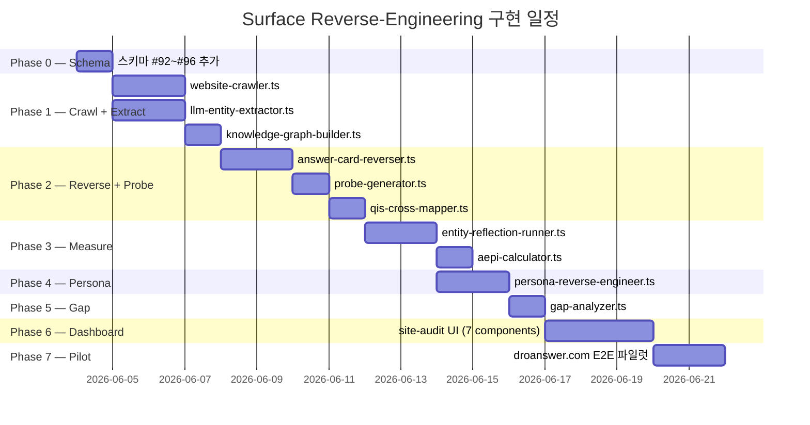

# Part 2 — 구현 계획: 웹사이트 AEO/GEO 서피스 역설계 시스템

> Part 1(전략 아키텍처)에 기반한 **파일 수준 상세 구현 계획서**

---

## Phase 0: 스키마 확장 (#92~#96)

기존 BSW-OS 스키마(#1~#91) 뒤에 5개 스키마를 추가합니다.  
핵심 원칙: **기존 스키마와 FK 관계를 유지**하여 전체 시스템이 유기적으로 연결되도록 합니다.

---

### [MODIFY] [schema.ts](file:///C:/Users/User/bsw/lib/schema.ts)

#### #92. SurfaceEntity — 추출된 엔티티

```typescript
export const surfaceEntitySchema = z.object({
  id: z.string().uuid().optional(),
  workspace_id: z.string().uuid(),
  
  // ─ 크롤링 출처 ─
  website_url: z.string().url(),                       // 대상 웹사이트 루트 URL
  source_page_url: z.string().url(),                   // 추출된 페이지 URL
  
  // ─ 엔티티 분류 ─
  surface_type: z.enum([
    'factoid', 'procedural', 'comparative', 'authority',
    'schema_org', 'topical_cluster', 'local_geo'
  ]),
  entity_name: z.string().min(1).max(500),
  entity_content: z.record(z.string(), z.any()).default({}),
  
  // ─ BSW-OS 기존 스키마 연결 ─
  linked_claim_node_id: z.string().uuid().optional().nullable(),        // ClaimNode(#25) FK
  linked_rep_object_id: z.string().uuid().optional().nullable(),        // RepObject(#29) FK
  linked_tco_concept_id: z.string().uuid().optional().nullable(),       // TcoConcept(#22) FK
  linked_evidence_item_id: z.string().uuid().optional().nullable(),     // EvidenceItem(#14) FK
  linked_schema_mapping_id: z.string().uuid().optional().nullable(),    // SchemaMapping(#34) FK
  
  // ─ 품질 평가 ─
  completeness_score: z.number().min(0).max(100).default(0),
  eeat_strength: z.number().min(0).max(100).default(0),
  has_schema_support: z.boolean().default(false),
  
  // ─ 메타 ─
  extraction_model: z.string().default('gemini-flash'),                 // 추출에 사용된 모델
  extraction_confidence: z.number().min(0).max(100).default(0),
  extracted_at: z.string(),
  created_at: z.string().optional(),
});
```

> [!NOTE]
> `linked_*_id` 필드들이 핵심입니다. 외부 크롤링으로 추출된 엔티티를 BSW-OS의 기존 스키마에 즉시 연결할 수 있어, **"사이트에서 추출된 성분 정보(SurfaceEntity)" → "우리가 등록한 성분 주장(ClaimNode)" → "그 주장의 증거(EvidenceItem)"** 경로가 완성됩니다.

#### #93. ReversedAnswerCard — 역설계된 Answer Card

```typescript
export const reversedAnswerCardSchema = z.object({
  id: z.string().uuid().optional(),
  workspace_id: z.string().uuid(),
  website_url: z.string().url(),
  
  // ─ 카드 유형 ─
  card_type: z.enum(['direct_answer', 'how_to', 'comparison', 'list', 'faq', 'product', 'local']),
  headline: z.string().min(1).max(500),
  
  // ─ 트리거 질문 ─
  trigger_queries: z.array(z.string()).default([]),
  
  // ─ 구성 엔티티 ─
  body_entity_ids: z.array(z.string().uuid()).default([]),             // SurfaceEntity(#92) FK[]
  source_page_urls: z.array(z.string()).default([]),
  
  // ─ BSW-OS 스키마 연결 ─
  linked_canonical_question_id: z.string().uuid().optional().nullable(), // CanonicalQuestion(#20) FK
  linked_qis_scene_ids: z.array(z.string().uuid()).default([]),          // QisScene(#21) FK[]
  
  // ─ 품질 평가 ─
  completeness_score: z.number().min(0).max(100).default(0),
  eeat_strength: z.number().min(0).max(100).default(0),
  schema_support_level: z.enum(['full', 'partial', 'none']).default('none'),
  optimization_status: z.enum(['optimized', 'partial', 'raw', 'missing']).default('raw'),
  
  created_at: z.string().optional(),
});
```

#### #94. EntityReflectionSnapshot — 엔티티 반영률 스냅샷

```typescript
export const entityReflectionSnapshotSchema = z.object({
  id: z.string().uuid().optional(),
  workspace_id: z.string().uuid(),
  website_url: z.string().url(),
  engine_name: z.string().min(1).max(100),              // 'chatgpt_search' | 'gemini_grounding' | 'composite'
  
  // ─ 7-차원 ERR ─
  err_factoid: z.number().min(0).max(100).default(0),
  err_procedural: z.number().min(0).max(100).default(0),
  err_comparative: z.number().min(0).max(100).default(0),
  err_authority: z.number().min(0).max(100).default(0),
  err_schema: z.number().min(0).max(100).default(0),
  err_topical: z.number().min(0).max(100).default(0),
  err_geo: z.number().min(0).max(100).default(0),
  
  // ─ 복합 지수 ─
  aepi_score: z.number().min(0).max(100).default(0),
  tech_mod_score: z.number().min(0).max(100).default(0),
  eeat_mod_score: z.number().min(0).max(100).default(0),
  
  // ─ 감사 상세 ─
  tech_audit: z.record(z.string(), z.any()).default({}),
  eeat_audit: z.record(z.string(), z.any()).default({}),
  
  // ─ 측정 메타 ─
  total_entities_checked: z.number().int().default(0),
  total_entities_reflected: z.number().int().default(0),
  measured_at: z.string(),
  created_at: z.string().optional(),
});
```

#### #95. ObservedParametricPersona — 관측된 AI 페르소나 프로파일

```typescript
export const observedParametricPersonaSchema = z.object({
  id: z.string().uuid().optional(),
  workspace_id: z.string().uuid(),
  website_url: z.string().url(),
  engine_name: z.string().min(1).max(100),
  
  // ─ BSW-OS 연결 ─
  linked_persona_spec_id: z.string().uuid().optional().nullable(),     // PersonaSpec(#37) FK
  linked_vibe_spec_id: z.string().uuid().optional().nullable(),        // VibeSpec(#42) FK
  
  // ─ 톤 벡터 (0.0 ~ 1.0) ─
  tone_warmth: z.number().min(0).max(1).default(0.5),
  tone_formality: z.number().min(0).max(1).default(0.5),
  tone_confidence: z.number().min(0).max(1).default(0.5),
  tone_expertise: z.number().min(0).max(1).default(0.5),
  tone_empathy: z.number().min(0).max(1).default(0.5),
  
  // ─ 어휘 프로파일 (0-100) ─
  brand_term_usage: z.number().min(0).max(100).default(0),
  technical_term_ratio: z.number().min(0).max(100).default(0),
  hedging_ratio: z.number().min(0).max(100).default(0),
  
  // ─ 포지셔닝 ─
  category_placement: z.string().default(''),
  competitive_frame: z.array(z.string()).default([]),
  sentiment_valence: z.number().min(-1).max(1).default(0),
  recommendation_strength: z.number().min(0).max(100).default(0),
  
  // ─ 정합도 ─
  persona_alignment_score: z.number().min(0).max(100).nullable().default(null),
  vibe_alignment_score: z.number().min(0).max(100).nullable().default(null),
  
  // ─ 상세 ─
  analysis_details: z.record(z.string(), z.any()).default({}),
  sample_size: z.number().int().default(0),
  measured_at: z.string(),
  created_at: z.string().optional(),
});
```

#### #96. SurfaceGapAnalysis — 4-사분면 갭 분석

```typescript
export const surfaceGapAnalysisSchema = z.object({
  id: z.string().uuid().optional(),
  workspace_id: z.string().uuid(),
  website_url: z.string().url(),
  
  // ─ 엔티티 식별 ─
  entity_name: z.string().min(1).max(500),
  entity_type: z.string().min(1).max(100),
  
  // ─ 4-사분면 분류 ─
  quadrant: z.enum(['green', 'yellow', 'red', 'white']),
  // green:  사이트에 있고 AI에 반영됨 (Keep)
  // yellow: 사이트에 있으나 AI에 미반영 (Fix — AEO 최적화)
  // red:    업종 QIS에 있으나 사이트에 없음 (Gap — 콘텐츠 개발)
  // white:  양쪽 모두 없음 (Opportunity — 블루오션)
  
  // ─ QIS 교차 정보 ─
  industry_qis_layer: z.string().optional().nullable(),    // 'L1_universal' ~ 'L7_brand'
  linked_canonical_question_id: z.string().uuid().optional().nullable(),
  linked_surface_entity_id: z.string().uuid().optional().nullable(),
  
  // ─ 처방전 ─
  prescription_type: z.enum([
    'add_schema', 'improve_heading', 'add_eeat_signal',
    'create_content', 'improve_internal_linking',
    'add_faq_markup', 'improve_meta', 'opportunity_content'
  ]).optional().nullable(),
  prescription_detail: z.string().optional().nullable(),
  estimated_aepi_impact: z.number().min(0).max(100).default(0),
  priority_score: z.number().min(0).max(100).default(0),
  
  analyzed_at: z.string(),
  created_at: z.string().optional(),
});
```

---

## Phase 1: 크롤링 + 엔티티 추출

### [NEW] [website-crawler.ts](file:///C:/Users/User/bsw/lib/surface/website-crawler.ts)

Headless 크롤링 + 구조 데이터 파싱:

```
기능:
  ① Sitemap.xml / robots.txt 파싱 → 크롤링 대상 URL 수집
  ② 각 URL에 대해 Headless fetch (fetch API 기반, 브라우저 불필요)
  ③ HTML → 구조 추출:
      - <title>, <meta description>, <meta og:*>
      - <h1>~<h6> 계층 구조
      - <script type="application/ld+json"> Schema.org 파싱
      - <main>/<article> 본문 텍스트 추출
  ④ 결과를 CrawledPage[] 배열로 반환

의존성:
  - fetch (Node.js 내장)
  - cheerio (HTML 파싱, 이미 프로젝트에 있을 가능성)
  - 없으면 node-html-parser (경량 대안)

비용: AI 호출 0. 순수 HTTP + HTML 파싱.
```

### [NEW] [llm-entity-extractor.ts](file:///C:/Users/User/bsw/lib/surface/llm-entity-extractor.ts)

LLM 기반 의미론적 엔티티 추출:

```
기능:
  ① CrawledPage 1개를 입력받아 LLM에 프롬프트 전송
  ② 프롬프트 설계:
  
  ```
  당신은 웹사이트 분석 전문가입니다. 다음 페이지에서 AI 검색엔진이
  Answer Card/Knowledge Graph에 활용할 수 있는 엔티티를 추출하세요.

  각 엔티티를 다음 7가지 유형으로 분류하세요:
  1. factoid: 사실형 (성분명, 수치, 사실 주장)
  2. procedural: 절차형 (사용법, 루틴, 단계)
  3. comparative: 비교형 (vs 경쟁 제품, 대안)
  4. authority: 권위 신호 (인증, 전문가, 수상)
  5. schema_org: Schema.org에 이미 구조화된 정보
  6. topical_cluster: 주제 클러스터 (카테고리, 하위 주제)
  7. local_geo: 지역/지리 정보 (위치, 구매처)

  또한 각 엔티티의:
  - completeness_score (0-100): 정보의 완전성
  - eeat_strength (0-100): E-E-A-T 신호 강도
  를 평가하세요.

  페이지 URL: {url}
  페이지 제목: {title}
  Schema.org 데이터: {schema_json}
  본문 텍스트: {body_text}
  ```
  
  ③ LLM 응답을 SurfaceEntity(#92)[] 배열로 파싱
  ④ Schema.org 데이터가 있으면 LLM 추출보다 우선 (앵커)

모델 선택: Gemini 2.5 Flash (가성비 최적)
배칭: 페이지 5개씩 묶어서 1회 호출 (토큰 절약)
```

### [NEW] [knowledge-graph-builder.ts](file:///C:/Users/User/bsw/lib/surface/knowledge-graph-builder.ts)

추출 엔티티 → Site-KG 조립:

```
기능:
  ① SurfaceEntity[] 입력 → 중복 제거 (entity_name 유사도 매칭)
  ② 엔티티 간 관계 추론:
      - co-occurrence: 같은 페이지에 등장하면 관련성 1.0
      - semantic: LLM으로 관계 유형 추론 (contains, treats, competes_with 등)
  ③ BSW-OS 스키마로 변환:
      - 엔티티 → TcoConcept(#22), KgNode(#23)
      - 관계 → KgEdge(#24)
  ④ QuestionCapitalNode(#19) 계층에 자동 매핑

AI 호출: 관계 추론에 1회 LLM 호출 (엔티티 목록 기반 배치)
비용: ~$0.01/사이트
```

---

## Phase 2: Answer Card 역설계 + 프로브 생성

### [NEW] [answer-card-reverser.ts](file:///C:/Users/User/bsw/lib/surface/answer-card-reverser.ts)

```
기능:
  ① Site-KG + SurfaceEntity[] 입력
  ② LLM 프롬프트:
  
  ```
  다음 웹사이트의 지식 엔티티와 Knowledge Graph를 분석하여,
  AI 검색엔진(ChatGPT, Gemini)이 이 사이트 정보로 생성할 수 있는
  이상적 Answer Card를 역설계하세요.

  각 Answer Card에 대해:
  1. card_type: 카드 유형
  2. headline: 카드 제목
  3. trigger_queries: 이 카드를 호출할 수 있는 소비자 질문 5개
  4. body_entities: 카드 본문에 포함될 엔티티 ID 목록
  5. completeness_score: 정보 충분도 (0-100)
  6. optimization_status: 'optimized' | 'partial' | 'raw'
  
  엔티티 목록: {entities_json}
  KG 관계: {edges_json}
  ```
  
  ③ LLM 응답 → ReversedAnswerCard(#93)[] 파싱
  ④ 각 카드를 CanonicalQuestion(#20) + QisScene(#21)으로 변환
      (Part 1 §2.2의 answerCardToCanonicalQuestion 로직)

AI 호출: 1회 (배치)
비용: ~$0.005/사이트
```

### [NEW] [probe-generator.ts](file:///C:/Users/User/bsw/lib/surface/probe-generator.ts)

```
기능:
  ① ReversedAnswerCard[] 입력
  ② 카드별 trigger_queries를 기본 프로브로 사용
  ③ 추가 파생 질문 생성 (LLM 1회):
      - 비교 질문: "{브랜드} vs {경쟁}" 패턴
      - 심화 질문: "왜?", "어떻게?" 패턴
      - 계절/시기 변형: "여름에는?", "2026년에는?"
  ④ 결과를 SeedProbeQuestion[] 형식으로 반환
      → questions-data.ts의 기존 형식과 호환
      → must_include에 해당 엔티티의 핵심 용어 자동 포함

생성되는 프로브 규모: ~5개/카드 × 30~50카드 = 150~250 프로브
  → 이것이 "Set B: 사이트 전용 Surface Probe Set"
```

### [NEW] [qis-cross-mapper.ts](file:///C:/Users/User/bsw/lib/surface/qis-cross-mapper.ts)

Set A(업종 QIS) × Set B(사이트 프로브) 교차 매핑:

```
기능:
  ① Set A: INDUSTRY_PANELS_DATA[industryType].questions 로드
  ② Set B: probe-generator가 생성한 프로브 로드
  ③ 의미론적 유사도 매칭:
      - 1차: target_keyword 기반 문자열 매칭 (AI 0호출)
      - 2차: must_include 교집합 비율 (AI 0호출)
      - 3차: (선택) Embedding 유사도 (AI 1회 배치 호출)
  ④ 매핑 결과로 UnifiedQuestionMapping[] 생성
  ⑤ coverage_status 자동 분류:
      - 'both': Set A와 Set B 양쪽에 매칭
      - 'industry_only': Set A에만 존재 → 사이트 콘텐츠 공백 (RED)
      - 'site_only': Set B에만 존재 → 사이트 고유 강점

비용: 대부분 텍스트 매칭 (AI 0호출). Embedding 사용 시 ~$0.01
```

---

## Phase 3: 반영률 측정 + AEPI 산출

### [NEW] [entity-reflection-runner.ts](file:///C:/Users/User/bsw/lib/benchmark/entity-reflection-runner.ts)

기존 `LightweightMetricRunner` 확장:

```
기능:
  ① 통합 프로브 질문 세트 (Set A ∪ Set B) 입력
  ② 기존 SearchProviderFactory.runMultiEngine() 활용
  ③ 각 응답에서 SurfaceEntity별 등장 여부 매칭:
      - entity_name 포함 여부 (텍스트 매칭, AI 0호출)
      - must_include 키워드 매칭
      - 도메인 Citations 매칭
  ④ 7-차원 ERR 산출:
      ERR_factoid = factoid 엔티티 중 반영된 수 / 전체 factoid 수
      ERR_procedural = ... (동일 패턴)
  ⑤ EntityReflectionSnapshot(#94) 저장

기존 코드 재활용:
  - SearchProviderFactory.runMultiEngine() → 그대로 사용
  - LightweightMetricRunner._sampleQuestions() → 샘플링 로직 공유
  - calcAAS(), calcOCR() → 기존 함수 확장

추가 AI 호출: 0 (순수 텍스트 매칭)
```

### [NEW] [aepi-calculator.ts](file:///C:/Users/User/bsw/lib/benchmark/aepi-calculator.ts)

```
기능:
  ① EntityReflectionSnapshot(#94)의 7-차원 ERR 입력
  ② 업종별 가중치 프리셋 적용:
      AEPI = Σ(ERR_i × W_i × TechMod_i × EEATMod_i)
  ③ TechMod: website-crawler에서 추출한 기술 감사 결과
      - schema_coverage, heading_hierarchy, meta_quality 등
  ④ EEATMod: llm-entity-extractor에서 추출한 E-E-A-T 감사 결과
      - expert_authorship, certification_display 등
  ⑤ 가중치 프리셋:

      const WEIGHT_PRESETS: Record<string, number[]> = {
        skincare:       [0.25, 0.15, 0.15, 0.20, 0.10, 0.10, 0.05],
        wedding_studio: [0.10, 0.10, 0.20, 0.15, 0.10, 0.15, 0.20],
        medical:        [0.30, 0.15, 0.10, 0.25, 0.10, 0.05, 0.05],
      };
      // [factoid, procedural, comparative, authority, schema, topical, geo]

AI 호출: 0 (순수 수학)
```

---

## Phase 4: Parametric Persona 역설계

### [NEW] [persona-reverse-engineer.ts](file:///C:/Users/User/bsw/lib/surface/persona-reverse-engineer.ts)

```
기능:
  ① AI 검색엔진 응답 텍스트 N개 입력 (ProbeRun(#54)에서 수집)
  ② LLM에 페르소나 분석 프롬프트 전송:
  
  ```
  다음은 AI 검색엔진이 브랜드 "{brand_name}"에 대해 생성한 응답 {N}개입니다.
  
  이 응답들을 종합 분석하여 AI가 이 브랜드를 어떤 "인격"으로 표현하는지
  Parametric Persona Profile을 추출하세요:
  
  1. 톤 벡터 (각 0.0~1.0):
     - warmth: 차가운(0) ↔ 따뜻한(1)
     - formality: 구어체(0) ↔ 격식체(1)
     - confidence: 조심스러운(0) ↔ 확신적(1)
     - expertise_display: 일반인(0) ↔ 전문가(1)
     - empathy: 사무적(0) ↔ 공감적(1)
  
  2. 어휘 프로파일 (각 0-100):
     - brand_term_usage: 브랜드 고유 용어 사용 빈도
     - technical_term_ratio: 전문 용어 비율
     - hedging_ratio: "~일 수 있다" 등 완화 표현 비율
  
  3. 포지셔닝:
     - category_placement: AI가 이 브랜드를 분류한 카테고리
     - competitive_frame: 함께 언급되는 경쟁 브랜드
     - sentiment_valence: -1(부정) ~ +1(긍정)
     - recommendation_strength: 추천 강도 0~100
  
  응답 목록:
  {responses_text}
  ```
  
  ③ LLM 응답 → ObservedParametricPersona(#95) 파싱
  ④ PersonaSpec(#37)과 Delta 계산:
      persona_alignment_score = 1 - avg(|intended_i - observed_i|) × 100
  ⑤ VibeSpec(#42)과도 정합도 계산:
      vibe_alignment_score = cosine_similarity(target_vector, observed_tone_vector) × 100

AI 호출: 1회 (응답 배치 분석)
비용: ~$0.01/측정
```

---

## Phase 5: 갭 분석 + 자동 처방전

### [NEW] [gap-analyzer.ts](file:///C:/Users/User/bsw/lib/benchmark/gap-analyzer.ts)

```
기능:
  ① UnifiedQuestionMapping[] (Phase 2 결과)
  ② EntityReflectionSnapshot(#94) (Phase 3 결과)
  ③ 4-사분면 자동 분류:

      for (entity of allEntities) {
        const onSite = entity.surface_entity_id !== null;
        const reflected = reflectionData[entity.id]?.is_reflected === true;
        const inQIS = entity.industry_qis_match !== null;
        
        if (onSite && reflected)   → GREEN  (Keep)
        if (onSite && !reflected)  → YELLOW (Fix — AEO 최적화)
        if (!onSite && inQIS)      → RED    (Gap — 콘텐츠 개발)
        if (!onSite && !inQIS)     → WHITE  (Opportunity)
      }

  ④ 처방전 자동 생성:
  
      YELLOW 처방 (사이트에 있으나 미반영):
        - has_schema_support === false → "Schema.org 마크업 추가"
        - eeat_strength < 50           → "전문가 감수 표시 추가"
        - heading_hierarchy 불량       → "H2를 질문형으로 변경"
        - no FAQ pattern              → "FAQ 구조 콘텐츠 추가"
      
      RED 처방 (업종 QIS에 있으나 사이트 없음):
        - 해당 QIS의 must_include로 토픽 제안
        - 경쟁사 참조 URL (크롤링 데이터에서)
        - 예상 AEPI 상승치 추정

  ⑤ priority_score 산출:
      priority = (qis_weight × 0.4) + (err_gap × 0.3) + (eeat_impact × 0.3)

  ⑥ SurfaceGapAnalysis(#96)[] 저장

AI 호출: 0 (순수 연산 + 규칙 기반 처방)
```

---

## Phase 6: 대시보드 UI

### [NEW] [app/[locale]/site-audit/page.tsx](file:///C:/Users/User/bsw/app/%5Blocale%5D/site-audit/page.tsx)

Server Component. 사이트 감사 결과를 DB에서 조회하여 클라이언트에 전달.

### [NEW] [components/site-audit/](file:///C:/Users/User/bsw/components/site-audit/)

```
components/site-audit/
  ├── SiteAuditDashboard.tsx        — 메인 레이아웃 + 탭
  ├── SurfaceMapPanel.tsx           — 추출된 엔티티 전체 맵 (트리뷰 또는 그래프)
  ├── AnswerCardList.tsx            — 역설계 Answer Card 카드형 목록
  ├── ERRRadarChart.tsx             — 7-차원 ERR 레이더 차트 (SVG)
  ├── GapQuadrantMatrix.tsx         — 4-사분면 매트릭스 시각화
  ├── PersonaDeltaPanel.tsx         — 의도 vs 관측 페르소나 비교
  ├── PrescriptionList.tsx          — 처방전 우선순위 목록
  └── AEPIScoreCard.tsx             — AEPI 통합 점수 + 구성 요소 분해
```

핵심 UI 컴포넌트 설계:

#### ERR 레이더 차트 (7-차원)

```
          Factoid (38%)
             /\
            /  \
   Geo     /    \    Procedural
  (40%)   /      \     (20%)
         /   AEPI  \
        /   41.2    \
       /      pt     \
Topical ──────────── Comparative
 (25%)                 (12%)

  Authority   Schema
    (10%)     (55%)
```

#### Persona Delta 레이더 (5-차원)

```
        Warmth
     0.8 vs 0.4 ⚠
         /\
        /  \
Empathy/    \Formality
0.7/0.3     0.7/0.6
       \    /
        \  /
  Expertise  Confidence
  0.9/0.5    0.6/0.3
     ⚠          ⚠

■ 의도 PersonaSpec (외곽선)
● 관측 ObservedPersona (채우기)
```

---

## Phase 7: E2E 파일럿 — droanswer.com

### [NEW] [scripts/pilot-dro-surface-audit.ts](file:///C:/Users/User/bsw/scripts/pilot-dro-surface-audit.ts)

```
E2E 파일럿 스크립트:

① droanswer.com 크롤링 (website-crawler.ts)
   → CrawledPage[] 수집 (예상: 30~100페이지)

② 엔티티 추출 (llm-entity-extractor.ts)
   → SurfaceEntity[] (예상: 80~200개)

③ KG 조립 (knowledge-graph-builder.ts)
   → TcoConcept[], KgNode[], KgEdge[] 생성

④ Answer Card 역설계 (answer-card-reverser.ts)
   → ReversedAnswerCard[] (예상: 20~50개)

⑤ 프로브 생성 + QIS 교차 (probe-generator + qis-cross-mapper)
   → Set B 생성 + skincare 155Q와 교차 매핑

⑥ 반영률 측정 (entity-reflection-runner.ts)
   → ERR 7-차원 산출

⑦ AEPI 산출 (aepi-calculator.ts)
   → 통합 스코어 발행

⑧ Persona 역설계 (persona-reverse-engineer.ts)
   → ObservedParametricPersona 추출 + PersonaSpec Delta

⑨ 갭 분석 (gap-analyzer.ts)
   → 4-사분면 + 처방전 목록

⑩ 보고서 출력 (콘솔 + JSON)
```

### 검증 기준

| 항목 | 기대값 | 검증 방법 |
|------|--------|----------|
| 크롤링 완료 | 30+ 페이지 | 페이지 수 확인 |
| 엔티티 추출 | 80+ 엔티티 | 7 타입 분포 확인 |
| Answer Card | 20+ 카드 | 카드 유형 분포 확인 |
| ERR 7-차원 | 각 0~100 | 합리적 범위 확인 |
| AEPI | 0~100 | 스킨케어 가중치 적용 확인 |
| Persona Delta | ±0.5 이내 | PersonaSpec 대비 확인 |
| 4-사분면 | GREEN+YELLOW+RED+WHITE = 100% | 합산 100% |
| TypeScript 무결성 | 0 errors | `npx tsc --noEmit` |

---

## 전체 파일 목록 요약

| Phase | 파일 | 역할 | AI 호출 |
|-------|------|------|---------|
| **P0** | `lib/schema.ts` (+26줄) | #92~#96 스키마 추가 | 0 |
| **P1** | `lib/surface/website-crawler.ts` | Headless 크롤링 + HTML 파싱 | 0 |
| **P1** | `lib/surface/llm-entity-extractor.ts` | LLM 엔티티 추출 | **1회/사이트** |
| **P1** | `lib/surface/knowledge-graph-builder.ts` | Site-KG 조립 | **1회/사이트** |
| **P2** | `lib/surface/answer-card-reverser.ts` | Answer Card 역설계 | **1회/사이트** |
| **P2** | `lib/surface/probe-generator.ts` | 사이트 전용 프로브 생성 | **1회/분기** |
| **P2** | `lib/surface/qis-cross-mapper.ts` | 업종 QIS × 사이트 프로브 교차 | 0 |
| **P3** | `lib/benchmark/entity-reflection-runner.ts` | ERR 7-차원 측정 | 0 (텍스트 매칭) |
| **P3** | `lib/benchmark/aepi-calculator.ts` | AEPI 복합 지수 산출 | 0 |
| **P4** | `lib/surface/persona-reverse-engineer.ts` | 관측 페르소나 추출 | **1회/측정** |
| **P5** | `lib/benchmark/gap-analyzer.ts` | 4-사분면 갭 분석 + 처방전 | 0 |
| **P6** | `app/[locale]/site-audit/page.tsx` | 대시보드 Server Component | 0 |
| **P6** | `components/site-audit/*.tsx` (7파일) | 대시보드 UI 컴포넌트 | 0 |
| **P7** | `scripts/pilot-dro-surface-audit.ts` | E2E 파일럿 스크립트 | 기존 측정 포함 |

**총 신규 파일: 14개 (+ schema.ts 수정)**

---

## 구현 순서 및 의존성 그래프



> **총 예상: 18~20일 (직렬 기준). 병렬 진행 시 12~14일.**

---

## 비용 종합 (droanswer.com 기준)

| 단계 | 빈도 | AI 모델 | 토큰 | 비용 |
|------|------|---------|------|------|
| 크롤링 | 월 1회 | 없음 | 0 | $0 |
| 엔티티 추출 | 월 1회 | Gemini Flash | ~200K | $0.015 |
| KG 관계 추론 | 월 1회 | Gemini Flash | ~50K | $0.004 |
| Answer Card 역설계 | 월 1회 | Gemini Flash | ~100K | $0.008 |
| 프로브 생성 | 분기 1회 | Gemini Flash | ~100K | $0.008 |
| ERR 측정 | 주 1회 | 없음 (텍스트 매칭) | 0 | $0 |
| AEPI 산출 | 주 1회 | 없음 (수학) | 0 | $0 |
| 페르소나 분석 | 월 1회 | Gemini Flash | ~100K | $0.008 |
| 갭 분석 | 월 1회 | 없음 (규칙) | 0 | $0 |
| **월간 합계** | | | | **~$0.04** |

> [!TIP]
> **ERR 일간/주간 측정**은 기존 `LightweightMetricRunner`의 API 호출을 공유하므로 추가 Search API 비용만 발생합니다. Surface 역설계 자체의 LLM 비용은 **월 $0.04 수준**으로 사실상 무료입니다.

---

## Open Questions

> [!IMPORTANT]
> **Q1**: Phase 0~7을 전체 일괄 구현할까요, 아니면 Phase 0~2 (크롤링+역설계)만 먼저 구현하고 결과를 보신 후 확장할까요?

> [!IMPORTANT]
> **Q2**: droanswer.com 크롤링은 실제 사이트를 대상으로 할까요, 아니면 테스트용 mock 데이터로 먼저 진행할까요?

> [!IMPORTANT]
> **Q3**: Persona 역설계(Phase 4)를 기존 PersonaSpec(#37)이 등록된 브랜드에만 적용할까요, 아니면 PersonaSpec 없이도 독립적으로 관측 페르소나만 추출할까요?
