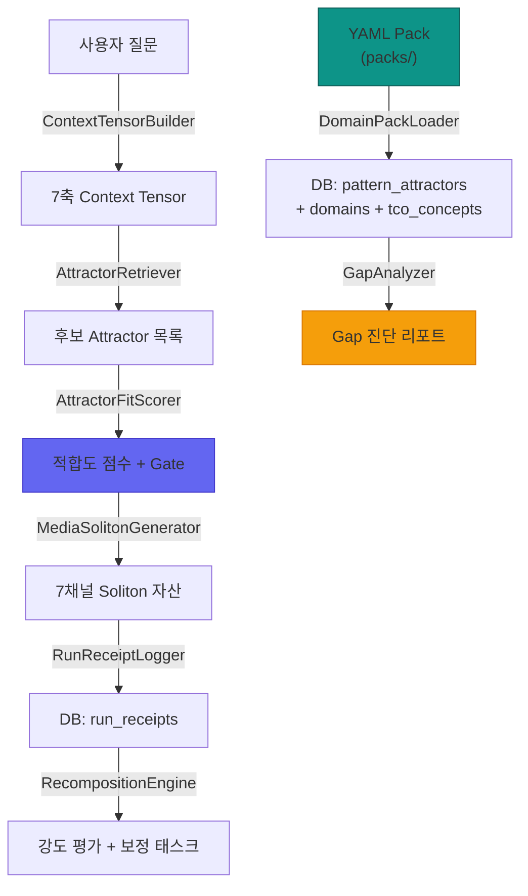

# Pattern Attractor Foundry — E2E 정밀 감사 보고서

> 감사 일시: 2026-07-02 | 감사 범위: 전체 PAF 코드베이스 (19개 파일, ~3,200 LOC)

---

## 총평

| 등급 | 건수 | 요약 |
|------|------|------|
| 🔴 크래시/치명적 | **5건** | 런타임 크래시, RLS 보안 무효화, 레이스 컨디션 |
| 🟠 기능 결함 | **8건** | 미구현 Gap 유형, 게이트 미재계산, 에러 무시 등 |
| 🟡 설계 결함 | **11건** | 낙관적 폴백, 타입 안전 미비, 스코어 클램핑 부재 등 |
| 🟢 경미/스타일 | **7건** | 미사용 import, 중복 CSS 클래스 등 |

---

## 🔴 크리티컬 (즉시 수정 필요)

### C-1. `attractors/page.tsx:316` — 트리거 패턴 미렌더링
```tsx
// 현재 (BUG): 리터럴 문자열 "{p}" 출력
"{p}"
// 수정: JSX 표현식으로 변수 값 출력
{p}
```
**영향**: 모든 어트랙터의 트리거 패턴이 `{p}`로 동일하게 표시됨.

---

### C-2. `domain-packs/page.tsx:12,14` — 미존재 Lucide 아이콘 import
```tsx
import { ..., FolderSync, DatabaseZap, ... } from "lucide-react";
//           ^^^^^^^^^^  ^^^^^^^^^^^  존재하지 않는 아이콘
```
**영향**: `DatabaseZap`은 JSX에서 실제 사용(L180)되므로 **런타임 크래시** 발생.

---

### C-3. `run-receipt-logger.ts:60-74` — Read-Modify-Write 레이스 컨디션
```typescript
// 현재: 동시 요청 시 activation_count 유실
const count = (att?.activation_count || 0) + 1;
await supabase.update({ activation_count: count })
// 수정: 원자적 증가 연산 사용
await supabase.rpc('increment_activation_count', { attractor_id: ... })
```
**영향**: 동시 2건 이상 Receipt 로깅 시 카운트 1건 유실.

---

### C-4. `run-receipt-logger.ts:27` — brand_id에 domain slug 할당
```typescript
brand_id: receipt.context_tensor.domain, // "skincare" ← UUID가 아님!
```
**영향**: `brand_id` 컬럼에 UUID 대신 slug 문자열 삽입. JOIN 쿼리 전체 실패.

---

### C-5. `0026_pattern_attractor_foundry.sql:154-161` — RLS 정책 무효화
```sql
create policy "workspace_isolation" on pattern_attractors
  for all using (workspace_id = auth.uid() or true);
--                                         ^^^^^^^ 항상 true
```
**영향**: **모든 사용자가 모든 워크스페이스의 데이터에 접근 가능** — 테넌트 격리 완전 무효.

---

## 🟠 기능 결함 (High)

### H-1. `attractor-retriever.ts:119` — Context Tensor 필터링 미구현
TODO 주석만 존재하며 실제 코드 없음. Risk/Intent/Evidence 축 불일치 후보가 걸러지지 않음.

### H-2. `gap-analyzer.ts` — 8개 Gap 유형 중 4개만 구현
구현: `missing_attractor`, `weak_attractor`, `misaligned_attractor`, `unsafe_attractor`
**미구현**: `overused_attractor`, `broken_media_soliton`, `conversion_gap`, `trust_gap`

### H-3. `gap-analyzer.ts:88-90` — portfolio_score가 missing만 반영
약한/위험/불일치 어트랙터는 점수에 불이익 없음. 전부 unsafe여도 100점 가능.

### H-4. `gap-analyzer.ts:15-20` — Supabase 쿼리 에러 무시
`error` 필드를 destructure하지 않아, 네트워크 장애 시 모든 어트랙터를 '누락'으로 오진단.

### H-5. `attractor-fit-scorer.ts:91-98` — breakdown 값 클램핑 미적용
LLM이 `concept_match: 50` (최대 20)을 반환해도 그대로 전달.

### H-6. `attractor-fit-scorer.ts:100` — gate 값 LLM 신뢰 (재계산 안함)
`total_score` 클램핑 후에도 gate는 LLM 원본 그대로. 점수-게이트 불일치 가능.

### H-7. `domain-pack-loader.ts:123-128` — domainErr 미확인
DB 오류 시 기존 도메인 조회 실패를 무시하고 중복 도메인 생성.

### H-8. `domain-pack-loader.ts:160-192` — 개념 upsert 에러 무시
insert/update 실패가 조용히 무시되어 동기화 결과가 부정확.

---

## 🟡 설계 결함 (Medium)

| # | 파일 | 이슈 |
|---|------|------|
| M-1 | `context-tensor-builder.ts:53` | risk_state 기본값이 `'low'` — YMYL 도메인 위험 |
| M-2 | `content-generator.ts:82-88` | 스키마 소문자 타입 (`'object'`) — Gemini 프로바이더 호환 불가 |
| M-3 | `content-generator.ts:96` | mustNotDo 대소문자 민감 감지 + 대소문자 무시 치환 불일치 |
| M-4 | `content-generator.ts:99` | mustNotDo 값이 정규식 특수문자 미이스케이프 |
| M-5 | `recomposition-engine.ts:41-43` | 트렌드 감지가 스냅샷 기반 (역사적 비교 아님) |
| M-6 | `recomposition-engine.ts:110-128` | `rewrite_cta` 태스크 중복 생성 가능 |
| M-7 | `vibe-alignment-checker.ts:6` | `targetSignature` 파라미터 사용 안 됨 (Dead Parameter) |
| M-8 | `media-soliton-generator.ts, vibe-layer-scorer.ts` | 에러 폴백 스코어가 0.8~0.95로 낙관적 |
| M-9 | `attractor-gap/page.tsx:259,299` | Recomposition 실행 버튼이 `alert()` 스텁 |
| M-10 | `semantic.ts:1819-2295` | PAF 함수에 workspace 권한 체크 누락 |
| M-11 | `attractors/page.tsx:77` | workspace 미발견 시 무한 스피너 |

---

## 🟢 경미 (Low)

| # | 파일 | 이슈 |
|---|------|------|
| L-1 | `types.ts:33` | `valence` 타입이 `string` — union 제약 없음 |
| L-2 | `types.ts:190-201` | `DomainPackYaml` 타입 미사용 (Dead Code) |
| L-3 | `run-receipt-logger.ts:124` | `select('*')` 대신 필요 컬럼만 조회해야 함 |
| L-4 | `attractor-gap/page.tsx:84` | brand_id 하드코딩 `"brand_default"` |
| L-5 | `domain-packs/page.tsx:174` | `font-bold` CSS 클래스 중복 |
| L-6 | `attractors/page.tsx:16-18,24` | 미사용 import (`Play`, `Settings`, `calculatePortfolioScore`) |
| L-7 | `semantic-core/page.tsx:570-621` | PAF 섹션 i18n 키 미사용 (한국어 하드코딩) |

---

## 데이터 흐름 E2E 추적 결과



> **검증 결과**: 데이터 흐름 자체는 올바르게 설계되어 있으나, 각 노드에서 **에러 전파 누락**(gap-analyzer, domain-pack-loader)과 **낙관적 폴백**(media-soliton, vibe-layer)이 잘못된 품질 신호를 전달할 위험이 있음.
