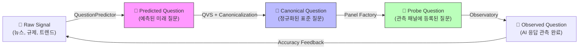
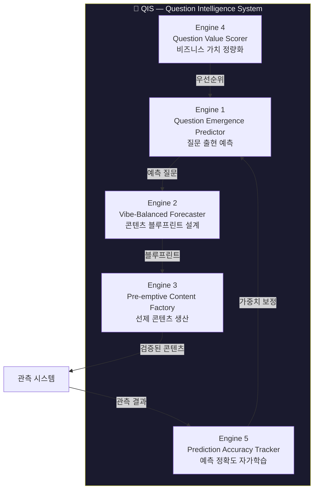
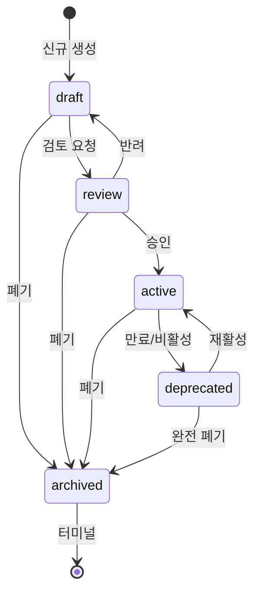

# BSW-OS Question System / QIS 체계적 분석 보고서

> **분석 기준**: 2026-05-25 코드베이스 정밀 감사 기반  
> **대상**: BSW-OS의 Question 파이프라인 전체 아키텍처  
> **목적**: Question 수집 → Canonicalization → QIS 도출/정제의 개념과 필요성을 체계적으로 분석

---

## 목차

1. [시스템 전체 조감도](#1-시스템-전체-조감도)
2. [Question의 정의와 계층 구조](#2-question의-정의와-계층-구조)
3. [Question 수집 (Collection)](#3-question-수집-collection)
4. [Question Canonicalization (정규화)](#4-question-canonicalization-정규화)
5. [QIS 도출과 정제](#5-qis-도출과-정제)
6. [파이프라인 데이터 흐름: 엔드-투-엔드 추적](#6-파이프라인-데이터-흐름-엔드-투-엔드-추적)
7. [거버넌스 계층: Question의 생명주기](#7-거버넌스-계층-question의-생명주기)
8. [전략적 분석: QIS가 만드는 구조적 해자](#8-전략적-분석-qis가-만드는-구조적-해자)
9. [현행 소스코드 매핑](#9-현행-소스코드-매핑)
10. [진단과 발전 방향](#10-진단과-발전-방향)

---

## 1. 시스템 전체 조감도

BSW-OS의 Question System은 단일 엔진이 아니라 **7개 레이어로 구성된 지능형 파이프라인**입니다. 이 파이프라인은 소비자 질문의 발생부터 AI 응답 품질 측정까지를 폐쇄 루프로 연결합니다.

```mermaid
graph TB
    subgraph L1["Layer 1: Signal Collection<br/>신호 수집"]
        SC1["📰 뉴스 수집기"]
        SC2["🔬 규제 수집기"]
        SC3["📊 검색트렌드 수집기"]
        SC4["💬 커뮤니티 수집기"]
        SC5["🧬 계절/이벤트 수집기"]
        SC6["📝 내부 데이터 수집기"]
        SC7["📺 SBS 방송 수집기"]
    end

    subgraph L2["Layer 2: Question Emergence Prediction<br/>질문 출현 예측"]
        QEP["QuestionPredictor<br/>업종별 25개 전용 템플릿"]
        FANOUT["Fan-out Engine<br/>1신호 → 3질문 파생"]
    end

    subgraph L3["Layer 3: Question Canonicalization<br/>질문 정규화"]
        CANON["표준 질문 데이터셋<br/>25업종 × 20Q = 500문항"]
        QVS["Question Value Scorer<br/>Vol × Conv × ARPU × FM × (1-Comp)"]
        DEDUP["Cross-Industry Deduplicator<br/>3072-dim 코사인 유사도"]
    end

    subgraph L4["Layer 4: QIS Intelligence<br/>QIS 지능"]
        VBSF["Vibe-Balanced Forecaster<br/>콘텐츠 블루프린트"]
        PCF["Pre-emptive Content Factory<br/>Safety Gate + VPA 검증"]
        EXP["Expected Layer<br/>5단계 판정 기준"]
    end

    subgraph L5["Layer 5: Observation<br/>관측"]
        PANEL["Probe Panel Factory<br/>업종표준 패널 배포"]
        OBS["Observatory<br/>AI 응답 크롤링"]
    end

    subgraph L6["Layer 6: Measurement<br/>측정"]
        BAIR["BAIR 브랜드 AI 인지도"]
        AIPR["AIPR 업종 파워랭킹"]
        KAIVI["KAIVI 국가 AI 가시성"]
    end

    subgraph L7["Layer 7: Feedback & Governance<br/>피드백·거버넌스"]
        ACC["Accuracy Tracker<br/>슈퍼포캐스팅 자가학습"]
        WC["Weight Calibrator<br/>가중치 동적 재보정"]
        LCM["Lifecycle Manager<br/>draft→active→archived"]
        FT["Funnel Tracker<br/>6단계 전환율 추적"]
    end

    L1 --> L2
    L2 --> L3
    L3 --> L4
    L4 --> L5
    L5 --> L6
    L6 --> L7
    L7 -->|"Closed Loop"| L1
```



> [!IMPORTANT]
> **핵심 인사이트**: 이 시스템은 "질문을 관측하는 도구"를 넘어 **"질문 자체를 자산화하는 지능 엔진"**입니다. 질문의 수집·정제·예측·검증을 자동화함으로써, 질문 데이터 자체가 **시간이 갈수록 모방 불가능한 경쟁 해자**가 됩니다.

---

## 2. Question의 정의와 계층 구조

BSW-OS에서 "Question"은 단순한 텍스트 문자열이 아닙니다. **8개 속성을 갖는 다차원 객체**입니다.

### 2.1 Question 데이터 모델

```typescript
// 질문 데이터 구조 (questions-data.ts 기준)
interface ProbeQuestion {
  text: string;                    // 질문 원문
  intent: string;                  // 의도 분류 (12유형)
  keyword: string;                 // 핵심 키워드
  risk: 'high' | 'medium' | 'low'; // YMYL 위험도
  stage: string;                   // 결정 단계 (awareness/consideration/decision)
  type: string;                    // 질문 유형
  weight: number;                  // 가중치 (0.3~2.0)
  variants: string[];              // 검색 변형어 (3~5개)
}
```

### 2.2 Question의 3가지 존재 형태

BSW-OS에서 Question은 **3가지 존재 형태**(Ontological State)로 구분됩니다:

| 형태 | 정의 | 소스 | 생명주기 |
|------|------|------|----------|
| **Probe Question** | 이미 존재하는 관측 대상 질문 | [questions-data.ts](file:///c:/Users/User/bsw/db/seed/industry-panels/questions-data.ts) | `draft` → `active` → `archived` |
| **Predicted Question** | 아직 출현하지 않은 예측 질문 | [question-predictor.ts](file:///c:/Users/User/bsw/lib/prediction/question-predictor.ts) | `signal_detected` → `emerged` / `false_positive` |
| **Canonical Question** | 정규화·가치평가 완료된 표준 질문 | QVS + Dedup 파이프라인 | QVS 스코어 기반 자동 관리 |



---

## 3. Question 수집 (Collection)

### 3.1 수집의 정의

Question 수집이란 **"아직 체계화되지 않은 원시 신호(Raw Signal)로부터 잠재적 소비자 질문의 맹아를 포착하는 행위"**입니다.

### 3.2 7종 신호 수집기 (Signal Collectors)

BSW-OS는 7개의 전용 신호 수집기를 통해 다양한 외부·내부 소스에서 질문 맹아를 포착합니다:

| # | 수집기 | 파일 | 신호 유형 | 수집 예시 |
|---|--------|------|-----------|-----------|
| 1 | **뉴스 수집기** | [news-collector.ts](file:///c:/Users/User/bsw/lib/prediction/signal-collectors/news-collector.ts) | 언론 보도 키워드 급등 | "식약처 레티놀 신규정 발표" |
| 2 | **규제 수집기** | [regulation-collector.ts](file:///c:/Users/User/bsw/lib/prediction/signal-collectors/regulation-collector.ts) | 법령·고시 변경 | "의료법 개정안 국회 통과" |
| 3 | **검색트렌드 수집기** | [search-trend-collector.ts](file:///c:/Users/User/bsw/lib/prediction/signal-collectors/search-trend-collector.ts) | 검색량 급상승 패턴 | "여름 민감성 피부" 200% 증가 |
| 4 | **커뮤니티 수집기** | [community-collector.ts](file:///c:/Users/User/bsw/lib/prediction/signal-collectors/community-collector.ts) | 포럼·SNS 버즈 | 네이버 카페 "레티놀 부작용" 급증 |
| 5 | **계절 수집기** | [seasonal-collector.ts](file:///c:/Users/User/bsw/lib/prediction/signal-collectors/seasonal-collector.ts) | 시즌·이벤트 주기 | 가을 웨딩 시즌 → 계약 질문 급증 |
| 6 | **내부 수집기** | [internal-collector.ts](file:///c:/Users/User/bsw/lib/prediction/signal-collectors/internal-collector.ts) | 테넌트 데이터 패턴 | 신규 테넌트 온보딩 시 수집 질문 |
| 7 | **SBS 방송 수집기** | [sbs-broadcast-collector.ts](file:///c:/Users/User/bsw/lib/prediction/signal-collectors/sbs-broadcast-collector.ts) | 방송 편성·보도 예정 | SBS 뉴스 "AI 마케팅 특집" 예정 |

### 3.3 수집의 본질적 과제

수집 단계에서의 핵심 과제는 **신호 대 잡음 비율(Signal-to-Noise Ratio)**입니다:

```
수집된 원시 신호 (100%)
    │
    ├── 🟢 유효 신호 (30~40%): 실제 소비자 질문으로 발전
    │     ├── 즉시 대응 필요 (10%): critical/high 영향도
    │     └── 모니터링 대상 (20~30%): medium/low 영향도
    │
    └── 🔴 잡음 (60~70%): 일시적 노이즈 또는 중복
          ├── 이미 커버된 질문의 재발견 (30%)
          ├── 업종 무관 잡음 (20%)
          └── 시의성 만료 신호 (10~20%)
```

> [!TIP]
> 이 문제를 해결하기 위해 BSW-OS는 **Confidence Score 기반 자동 필터링**을 도입합니다. [question-predictor.ts](file:///c:/Users/User/bsw/lib/prediction/question-predictor.ts#L140-L148)의 `computeConfidence()` 메서드가 `predicted_impact` 레벨에 따라 0.50~0.95 범위의 신뢰도를 산출하고, 낮은 신뢰도 신호는 모니터링 큐로 라우팅됩니다.

---

## 4. Question Canonicalization (정규화)

### 4.1 Canonicalization의 정의

> **Canonicalization(정규화)**란, 다양한 형태로 수집된 원시 질문들을 **단일한 표준 형식(Canonical Form)**으로 통합하고, 중복을 제거하며, 비즈니스 가치를 정량 평가하여 **관리 가능한 질문 자산(Question Asset)**으로 전환하는 과정입니다.

### 4.2 왜 Canonicalization이 필요한가?

```
문제: 동일한 소비자 의도가 N개의 서로 다른 표현으로 존재

  "레티놀 처음 쓰는 사람 주의사항"
  "레티놀 초보 부작용 조심할 것"
  "retinol beginner caution sensitive skin"
  "레티놀 입문자 가이드"
  "민감성 피부 레티놀 사용법"

  → 이 5개는 모두 동일한 소비자 의도(intent)를 표현
  → 정규화 없이는 5개의 별도 질문으로 관리됨
  → 관측 리소스 5배 낭비 + 메트릭 파편화
```

Canonicalization은 이 문제를 **3단계 프로세스**로 해결합니다:

### 4.3 Canonicalization 3단계 프로세스

````carousel
### Stage 1: 형태 통합 (Morphological Unification)

**수행 주체**: [QueryExpander](file:///c:/Users/User/bsw/lib/prediction/query-expander.ts)

다양한 표현의 질문을 하나의 기준 텍스트(Canonical Text)와 N개의 변형어(Variants)로 구조화합니다.

```typescript
// query-expander.ts의 expand() 메서드
public expand(baseQuestion: string, targetKeyword: string): string[] {
  const text = baseQuestion.replace(/{brand}/g, targetKeyword);
  const words = text.split(" ").filter(w => w.length > 1);
  return [
    text,                                    // 원본
    words.join(" "),                          // 조사 제거
    `${targetKeyword} ${words.pop() || "추천"}`, // 브랜드+핵심어
    `${targetKeyword} 솔직 후기 추천`,         // 후기 의도
    `Best ${targetKeyword} comparison`,       // 영문 패턴
  ];
}
```

**효과**: 1개 Canonical Question에 5개 검색 변형이 매핑되어 AI 엔진별 질의 다양성을 커버합니다.

<!-- slide -->
### Stage 2: 의미 중복 제거 (Semantic Deduplication)

**수행 주체**: [CrossIndustryDeduplicator](file:///c:/Users/User/bsw/lib/analytics/cross-industry-deduplicator.ts)

3072차원 임베딩 벡터의 코사인 유사도를 계산하여, 서로 다른 업종에서 동일한 의미를 가진 질문을 식별·통합합니다.

```typescript
// cross-industry-deduplicator.ts
public async detectDuplicates(q1: string, q2: string): Promise<{
  isDuplicate: boolean;
  similarity: number;
}> {
  const vpa = await this.cosineEngine.computeVPA(workspaceId, q1, q2);
  const similarity = vpa / 100;
  return {
    isDuplicate: similarity > 0.85,  // 85% 이상 유사도 = 중복
    similarity,
  };
}
```

**판정 기준**:
| 유사도 범위 | 판정 | 액션 |
|---|---|---|
| 0.85~1.00 | **중복** | 통합 후 하나만 유지 |
| 0.70~0.85 | **유사** | 변형어로 편입 |
| < 0.70 | **독립** | 별도 질문으로 관리 |

<!-- slide -->
### Stage 3: 가치 정량화 (Value Quantification)

**수행 주체**: [QVS (scoreQuestionValue)](file:///c:/Users/User/bsw/app/actions/qvs.ts)

정규화된 질문에 비즈니스 가치 점수를 부여하여, 자원 배분의 우선순위를 결정합니다.

```
QVS = Volume × Conversion × ARPU × FirstMover × (1 - Competition)

예시: 뷰티 업종 "레티놀 부작용 가이드"

  Volume      = 85   (월 검색량 정규화)
  Conversion  = 0.15 (recommendation 의도)
  ARPU        = 45K  (스킨케어 평균 객단가)
  FirstMover  = 3.5  (AI 커버리지 낮음)
  Competition = 0.2  (경쟁 콘텐츠 적음)

  QVS = 85 × 0.15 × 45000 × 3.5 × 0.8 = ₩1,606,500/월
```

**효과**: 모든 질문이 **원화 기준 월간 가치**로 환산되어, "어떤 질문에 먼저 답해야 하는가"의 의사결정을 자동화합니다.
````

### 4.4 Canonicalization이 해결하는 5대 문제

| # | 문제 | Canonicalization 없이 | Canonicalization 후 |
|---|------|----------------------|---------------------|
| 1 | **질문 중복** | 500문항 중 10~15% 의미 중복 | 임베딩 기반 자동 탐지·통합 |
| 2 | **검색 변형 미커버** | AI 엔진별 질의 패턴 차이로 관측 누락 | 질문당 5개 변형어 자동 생성 |
| 3 | **가치 불명** | 모든 질문에 동일 리소스 투입 | QVS 기반 자원 우선순위 자동 결정 |
| 4 | **업종 간 중복** | 동일 의도 질문이 업종별로 분리 관리 | Cross-industry 유사도 탐지 |
| 5 | **시의성 관리** | "올해 트렌드" 류 질문이 영구 잔존 | TTL 메타데이터 + 자동 만료 |

---

## 5. QIS 도출과 정제

### 5.1 QIS의 정의

> **QIS (Question Intelligence System)**은 정규화된 질문 자산 위에 구축되는 **지능 레이어**입니다.  
> 단순한 질문 저장소가 아니라, 질문의 **가치 평가 → 미래 예측 → 콘텐츠 설계 → 관측 검증 → 정확도 학습**을 자동화하는 **폐쇄 루프 인텔리전스 시스템**입니다.

### 5.2 QIS의 5대 구성 엔진



### 5.3 각 엔진의 역할과 구현 상세

#### Engine 1: Question Emergence Predictor

**역할**: "아직 대중이 묻지 않았지만 곧 물을 질문"을 선제 도출

**구현**: [question-predictor.ts](file:///c:/Users/User/bsw/lib/prediction/question-predictor.ts) + [industry-prediction-templates.ts](file:///c:/Users/User/bsw/lib/prediction/industry-prediction-templates.ts)

| 기능 | 메서드 | 설명 |
|------|--------|------|
| 질문 예측 | `predictQuestionsFromSignal()` | 신호로부터 업종 전용 템플릿 기반 예측 질문 생성 |
| Fan-out | `deriveYmylSafetyQuestion()` + `deriveComparisonQuestion()` | 1개 기본 예측에서 YMYL 안전 + 비교 파생 질문 2개 추가 생성 (1→3 팬아웃) |
| AI 커버리지 체크 | `checkAICoverage()` | DB 관측 데이터 + 키워드 휴리스틱 2단계 판정 |
| 선점 시간 추정 | `estimateFirstMoverWindow()` | impact 레벨별 14~90일 골든타임 산출 |
| 정확도 피드백 | `submitFeedback()` | 예측 vs 실제 출현 비교 → 슈퍼포캐스팅 점수 업데이트 |

**Fan-out 구조** (1 신호 → 3 질문):
```
EmergenceSignal (식약처 레티놀 규정 강화)
    │
    ├── 🔵 Base Prediction
    │   "민감성 피부를 위한 저자극 레티놀 사용법"
    │   intent: informational_safety
    │
    ├── 🟡 YMYL Safety Derivative
    │   "~ 관련 YMYL 안전 규제 준수 및 소비자 보호 기준 가이드"
    │   intent: legal_compliance
    │   confidence: base × 0.9
    │
    └── 🟢 Comparison Derivative
        "~ 주요 브랜드별 장단점 및 비용 혜택 비교 분석"
        intent: value_comparison
        confidence: base × 0.85
```

---

#### Engine 2: Vibe-Balanced Super-Forecaster

**역할**: 예측 질문에 대한 "브랜드 바이브를 유지하면서 AI 인용에 최적화된" 콘텐츠 설계도(Blueprint) 생성

**구현**: [vibe-forecaster.ts](file:///c:/Users/User/bsw/lib/prediction/vibe-forecaster.ts)

```
Input: 예측 질문 + 브랜드 Vibe Spec + Brand Truth Claims
                    │
    ┌───────────────┼───────────────┐
    │               │               │
  Tone Guidelines  EEAT Level   Schema.org Type
  (warmth/prof.)   (basic/expert) (FAQPage/HowTo)
    │               │               │
    └───────┬───────┘               │
            │                       │
     Content Blueprint ◀────────────┘
     ┌──────────────────────────┐
     │ recommended_structure    │
     │ target_vpa: 75.00       │
     │ tone_guidelines: [...]  │
     │ forbidden_expressions   │
     │ brand_voice_keywords    │
     └──────────────────────────┘
```

**5-Tier Expected Layer 통합** (P2 업그레이드):

| 레이어 | 의미 | 예시 |
|--------|------|------|
| **Must Include** | 반드시 포함해야 할 사실 | "식약처 승인 저자극 테스트 완료 명시" |
| **Strongly Recommended** | E-E-A-T 신뢰도 강화 자료 | "전문 연구소 안전성 증명" |
| **Should Include** | 포함 권장 보조 정보 | "천연 보습 유기농 포뮬러 함유 정보" |
| **Caution** | 사용 시 주의해야 할 표현 | "근거 없는 효능 보장 단어 배제" |
| **Must Not Do** | 절대 포함 금지 사항 | "고농도 레티놀 1.0% 이상 매일 도포 권장" |

---

#### Engine 3: Pre-emptive Content Factory

**역할**: Blueprint를 바탕으로 실제 콘텐츠 초안을 생성하고, 4단계 검증 게이트를 통과시킴

**구현**: [content-factory.ts](file:///c:/Users/User/bsw/lib/prediction/content-factory.ts)

```
Content Blueprint
    │
    ▼
┌─────────────────────────────────────────────┐
│  Pre-emptive Content Factory Pipeline       │
│                                             │
│  ① generateDraft() ──→ AI 초안 생성         │
│       │                                      │
│  ② vibeCheck() ──→ VPA 점수 검증             │
│       │    ├── Warmth/Professional 정합성    │
│       │    ├── Forbidden expression 감산     │
│       │    ├── StronglyRecommended 부재 감산  │
│       │    └── Caution 키워드 감산            │
│       │                                      │
│  ③ safetyGate() ──→ must_include/must_not_do │
│       │    ├── PASS → 다음 단계              │
│       │    └── FAIL → 초안 반려 + 사유 기록   │
│       │                                      │
│  ④ sendToTenantQueue() ──→ 테넌트 큐 배포    │
│       ├── Safety Gate 재검증                 │
│       ├── VPA ≥ target_vpa 확인              │
│       └── 상태 → "queued"                    │
│                                             │
└─────────────────────────────────────────────┘
```

---

#### Engine 4: Question Value Scorer (QVS)

**역할**: 모든 질문의 비즈니스 가치를 실시간 정량화하여 우선순위 결정

**구현**: [qvs.ts](file:///c:/Users/User/bsw/app/actions/qvs.ts)

**핵심 공식**:
```
QVS = Volume × Conversion × ARPU × FirstMover × (1 - Competition)
```

**부가 기능**:
- `getTopValueQuestions()`: 업종별 최고 가치 질문 Top-N 조회
- `getPreemptionOpportunities()`: Competition < 0.4인 블루오션 질문 발굴

---

#### Engine 5: Prediction Accuracy Tracker

**역할**: 예측이 맞았는지 자가 검증하고, 신호 가중치를 자동 재보정하는 학습 루프

**구현**: [accuracy-tracker.ts](file:///c:/Users/User/bsw/lib/prediction/accuracy-tracker.ts)

```
예측 시점 ────────────────────────── 검증 시점
    │                                    │
    │  Confidence: 0.85                  │  Actually Emerged? ✅
    │  Window: 14일                      │  Emerged At: T+11일
    │                                    │
    └──────────────────────┬─────────────┘
                           │
                    Accuracy = 1.0 - |1.0 - 0.85| = 0.85
                           │
                    ┌──────▼──────┐
                    │ Recalibrate │
                    │ 규제 신호    │
                    │ weight +0.05│
                    └─────────────┘
```

**업종별 편향 감지** (P1 업그레이드):
```typescript
// getSectorAccuracyReport()
{
  beauty:   { averageAccuracy: 0.82, bias: +0.03, count: 45 },
  clinic:   { averageAccuracy: 0.78, bias: -0.05, count: 32 },
  wedding:  { averageAccuracy: 0.85, bias: +0.01, count: 28 },
  // bias > 0: 과잉 예측 (실제보다 더 많이 출현할 것으로 예측)
  // bias < 0: 과소 예측 (실제 출현을 놓침)
}
```

---

## 6. 파이프라인 데이터 흐름: 엔드-투-엔드 추적

하나의 원시 신호가 최종 SBS 지표에 기여하기까지의 **완전한 데이터 여정**을 추적합니다:

```
┌──────────────────────────────────────────────────────────────────────────┐
│                                                                          │
│  1️⃣  SIGNAL DETECTION                                                   │
│  식약처 "레티놀 표시 기준 강화" 고시 발표                                  │
│  → RegulationCollector가 감지                                            │
│  → EmergenceSignal 레코드 생성                                           │
│       │                                                                  │
│  2️⃣  QUESTION PREDICTION                                                │
│  QuestionPredictor.predictQuestionsFromSignal()                          │
│  → beautyTemplate.predict() 호출                                        │
│  → 1개 기본 예측 + YMYL 파생 + 비교 파생 = 3개 PredictedQuestion         │
│  → YMYL Regulatory DB 조인 → 식약처 가이드라인 자동 주입                  │
│       │                                                                  │
│  3️⃣  VALUE SCORING                                                      │
│  scoreQuestionValue()                                                    │
│  → QVS = 85 × 0.15 × 45K × 3.5 × 0.8 = ₩1,606,500/월                  │
│  → preemption_deadline: 14일 후                                          │
│       │                                                                  │
│  4️⃣  CONTENT BLUEPRINT                                                  │
│  VibeBalancedForecaster.createContentBlueprint()                         │
│  → Vibe Spec 조회 (warmth: 0.7, professionalism: 0.5)                   │
│  → Brand Truth claims에서 키워드 추출                                    │
│  → 5-Tier Expected Layer 통합                                           │
│  → ContentBlueprint 레코드 생성                                          │
│       │                                                                  │
│  5️⃣  CONTENT GENERATION & VERIFICATION                                  │
│  PreemptiveContentFactory.generateDraft()                                │
│  → AI 초안 생성 → vibeCheck() VPA=85 ✅                                 │
│  → safetyGate() must_include 전부 충족 ✅                                │
│  → sendToTenantQueue() 상태="queued"                                    │
│       │                                                                  │
│  6️⃣  PANEL REGISTRATION                                                 │
│  createIndustryStandardPanel()                                           │
│  → PredictedQuestion이 ProbeQuestion으로 승격                            │
│  → Probe Panel에 등록 → Expected Layer 세팅                              │
│       │                                                                  │
│  7️⃣  OBSERVATION                                                        │
│  Observatory 크롤러 실행                                                  │
│  → ChatGPT / Google AI 응답 수집                                        │
│  → AAS, OCR, BSF, ARS 메트릭 산출                                       │
│       │                                                                  │
│  8️⃣  SBS INDEX COMPUTATION                                              │
│  SbsIndexRunner.generateReport()                                         │
│  → BAIR = 0.4×AAS + 0.3×OCR + 0.3×BSF                                  │
│  → AIPR = rank(BAIR) per industry                                       │
│  → KAIVI = Σ(ARS_i × GDP_w_i) / N                                      │
│       │                                                                  │
│  9️⃣  ACCURACY FEEDBACK                                                  │
│  PredictionAccuracyTracker.verifyPrediction()                            │
│  → actually_emerged: true                                                │
│  → prediction_accuracy: 0.85                                             │
│  → recalibrateSignalWeights() → regulation 신호 가중치 +0.05             │
│       │                                                                  │
│  🔟  WEIGHT CALIBRATION                                                  │
│  WeightCalibrator.calibrateWorkspace()                                   │
│  → observation_boost: 1.15 (높은 관련성)                                 │
│  → recency_decay: 1.0 (최근 관측)                                       │
│  → calibrated_weight = 1.0 × 1.15 × 1.0 = 1.15                         │
│       │                                                                  │
│  🔄  LOOP CLOSURE → 다음 신호 수집으로 복귀                               │
│                                                                          │
└──────────────────────────────────────────────────────────────────────────┘
```

---

## 7. 거버넌스 계층: Question의 생명주기

### 7.1 질문 라이프사이클 상태 머신

**구현**: [question-lifecycle-manager.ts](file:///c:/Users/User/bsw/lib/governance/question-lifecycle-manager.ts)



**자동 만료 메커니즘**:
```typescript
// deprecateExpired(): 시의성 만료 질문 자동 비활성화
// 조건: lifecycle_status = "active" AND is_time_sensitive = true AND ttl_expires_at < now()
// 결과: lifecycle_status → "deprecated"
```

### 7.2 가중치 동적 재보정

**구현**: [weight-calibrator.ts](file:///c:/Users/User/bsw/lib/governance/weight-calibrator.ts)

```
calibrated_weight = base_weight × observation_boost × recency_decay

  observation_boost:
    brand_mention_rate > 0.5 → 1.15 (관련성 높음)
    brand_mention_rate < 0.2 → 0.85 (관련성 낮음)

  recency_decay:
    30일 이상 관측 미실행 → 0.90
    90일 이상 관측 미실행 → 0.75

  결과 범위: [0.3, 2.0] (clamped)
```

### 7.3 퍼널 전환율 추적

**구현**: [funnel-tracker.ts](file:///c:/Users/User/bsw/lib/analytics/funnel-tracker.ts)

```
6단계 퍼널:

  intake ──→ analyzed ──→ observed ──→ predicted ──→ content_created ──→ measured

  각 전환 지점에서:
    - question_funnel_events 테이블에 이벤트 기록
    - 질문의 funnel_stage 컬럼 업데이트
    - 전환율(%) 산출
    - 병목(bottleneck) 자동 식별
```

**퍼널 리포트 예시**:
```
  intake           ████████████████████ 200 (100%)
  analyzed         ████████████████     160 (80%)
  observed         ████████████         120 (60%)    ← bottleneck: observed→predicted
  predicted        ████████              80 (40%)
  content_created  ████                  40 (20%)
  measured         ██                    20 (10%)

  전체 전환율: 10% | 병목: observed → predicted (33.3%)
```

### 7.4 시맨틱 커버리지 스코어

**구현**: [coverage-score.ts](file:///c:/Users/User/bsw/lib/analytics/coverage-score.ts)

```
SCS = (Σᵢ max_j(CosineSim(ActiveQ_i, MasterQ_j)) / N) × 100

  ActiveQ: 현재 패널에 등록된 활성 질문
  MasterQ: 업종별 "질문 우주" (이상적 전체 질문 집합)
  
  SCS = 75% → 질문 우주의 75%를 현재 패널이 커버
```

---

## 8. 전략적 분석: QIS가 만드는 구조적 해자

### 8.1 QIS의 5대 Unfair Advantage

| # | 우위 요소 | 작동 원리 | 모방 장벽 |
|---|-----------|-----------|-----------|
| **UA-1** | 측정 독점 | Probe Panel + Expected Layer가 "좋은 AI 응답"의 유일한 기준 | ⭐⭐⭐⭐⭐ |
| **UA-2** | 시계열 불가역 | 매주 누적되는 관측 데이터를 후발주자가 소급 불가 | ⭐⭐⭐⭐⭐ |
| **UA-3** | 예측 복리 | 자가학습 루프로 예측 정확도가 시간에 비례하여 향상 | ⭐⭐⭐⭐ |
| **UA-4** | 질문 자산화 | 25업종 × 20Q = 500개 정규화 질문 + Expected Layer = 산업 표준 | ⭐⭐⭐⭐⭐ |
| **UA-5** | 폐쇄 루프 | 예측→관측→검증→보정의 자가 강화 사이클이 정확도를 지속 개선 | ⭐⭐⭐⭐ |

### 8.2 시간에 따른 해자 강화 곡선

```
시간 경과 →
━━━━━━━━━━━━━━━━━━━━━━━━━━━━━━━━━━━━━━━━━━━━━━

M1-3:   [약]   질문 설계 + 초기 관측
                → 경쟁사도 질문 설계 가능

M4-6:   [중]   시계열 2분기 축적 + SBS 보도 시작
                → 데이터 자산 격차 발생

M7-12:  [강]   예측 정확도 0.65 → 0.80 + SBS 정기보도 관례화
                → 자가학습 루프 본격 가동

Y2+:    [철벽] 업계 표준 + 어워드 권위 + 데이터 8분기 축적
                → 신규 진입자의 복제 비용 > 자체 구축 비용

        ▁▂▃▅▆█ ← 시간이 갈수록 복제 비용 기하급수적 증가
```

### 8.3 닐슨 시청률 vs BSW-OS QIS 비교

| 차원 | 닐슨 시청률 | BSW-OS QIS |
|------|-------------|------------|
| **패널** | 5,200 표본 가구 | 25업종 × 20Q = 500 Probe Questions |
| **측정 장비** | People Meter 물리 장치 | 7종 Signal Collector + AI Crawler |
| **판정 기준** | 시청 시간 합산 | Expected Layer (5단계 판정) |
| **독점 기간** | 40년+ (1975~현재) | 목표 3~5년 내 산업 표준화 |
| **핵심 해자** | 패널 가구 교체 비용 | 시계열 데이터 소급 불가능성 |
| **수익 모델** | 시청률 구독료 | SBS 지표 발표 + AI홈피허브 SaaS |

---

## 9. 현행 소스코드 매핑

### 9.1 파일 → 역할 매핑

| 모듈 | 파일 | 핵심 역할 | LoC |
|------|------|-----------|-----|
| **수집** | [signal-collectors/](file:///c:/Users/User/bsw/lib/prediction/signal-collectors) (7파일) | 7종 신호 수집기 | ~17K |
| **예측** | [question-predictor.ts](file:///c:/Users/User/bsw/lib/prediction/question-predictor.ts) | 질문 출현 예측 + Fan-out | 298 |
| **템플릿** | [industry-prediction-templates.ts](file:///c:/Users/User/bsw/lib/prediction/industry-prediction-templates.ts) | 25업종 전용 예측 템플릿 | 618 |
| **정규화** | [query-expander.ts](file:///c:/Users/User/bsw/lib/prediction/query-expander.ts) | 검색 변형어 5개 자동 생성 | 19 |
| **중복제거** | [cross-industry-deduplicator.ts](file:///c:/Users/User/bsw/lib/analytics/cross-industry-deduplicator.ts) | 3072-dim 임베딩 중복 탐지 | 26 |
| **가치평가** | [qvs.ts](file:///c:/Users/User/bsw/app/actions/qvs.ts) | QVS 비즈니스 가치 정량화 | 189 |
| **블루프린트** | [vibe-forecaster.ts](file:///c:/Users/User/bsw/lib/prediction/vibe-forecaster.ts) | 바이브 밸런스드 콘텐츠 설계 | 140 |
| **콘텐츠** | [content-factory.ts](file:///c:/Users/User/bsw/lib/prediction/content-factory.ts) | Safety Gate + VPA 검증 팩토리 | 244 |
| **정확도** | [accuracy-tracker.ts](file:///c:/Users/User/bsw/lib/prediction/accuracy-tracker.ts) | 슈퍼포캐스팅 자가학습 | 160 |
| **라이프사이클** | [question-lifecycle-manager.ts](file:///c:/Users/User/bsw/lib/governance/question-lifecycle-manager.ts) | 5단계 상태 머신 + TTL 만료 | 98 |
| **가중치** | [weight-calibrator.ts](file:///c:/Users/User/bsw/lib/governance/weight-calibrator.ts) | 관측 기반 가중치 자동 재보정 | 103 |
| **퍼널** | [funnel-tracker.ts](file:///c:/Users/User/bsw/lib/analytics/funnel-tracker.ts) | 6단계 전환율 추적 + 병목 식별 | 142 |
| **커버리지** | [coverage-score.ts](file:///c:/Users/User/bsw/lib/analytics/coverage-score.ts) | 시맨틱 커버리지 스코어 산출 | 41 |
| **패널 팩토리** | [probe-panel-factory.ts](file:///c:/Users/User/bsw/app/actions/probe-panel-factory.ts) | 업종 표준 패널 배포 + 버전 관리 | 292 |
| **질문 DB** | [questions-data.ts](file:///c:/Users/User/bsw/db/seed/industry-panels/questions-data.ts) | 25업종 × 20Q = 500문항 데이터셋 | ~2,500 |
| **SBS 지표** | [index-runner.ts](file:///c:/Users/User/bsw/lib/sbs-index/index-runner.ts) | BAIR/AIPR/KAIVI 종합 산출 | 118 |
| **임베딩** | [cosine-engine.ts](file:///c:/Users/User/bsw/lib/embeddings/cosine-engine.ts) | 3072-dim 코사인 유사도 엔진 | ~200 |

### 9.2 데이터베이스 테이블 매핑

| 테이블 | 역할 | 관련 마이그레이션 |
|--------|------|-------------------|
| `probe_panels` | 관측 패널 메타데이터 | `0014_probe_panel_extension.sql` |
| `probe_questions` | 관측 대상 질문 + Expected Layer | `0014_probe_panel_extension.sql` |
| `emergence_signals` | 수집된 원시 신호 | `0017_prediction_engine.sql` |
| `predicted_questions` | 예측된 미래 질문 | `0017_prediction_engine.sql` |
| `question_value_scores` | QVS 가치 점수 | `0016_question_value_scores.sql` |
| `content_blueprints` | 콘텐츠 블루프린트 | `0018_content_blueprints.sql` |
| `question_funnel_events` | 퍼널 전환 이벤트 | `0019_p0_enhancements.sql` |
| `ymyl_regulatory_references` | YMYL 규제 참조 DB | `0022_p2_regulatory_data_and_audit.sql` |
| `audit_events` | 감사 로그 (Delta 포함) | `0022_p2_regulatory_data_and_audit.sql` |

---

## 10. 진단과 발전 방향

### 10.1 현행 시스템 성숙도 진단

| 차원 | 현재 수준 | 목표 수준 | 갭 |
|------|-----------|-----------|------|
| **수집 다양성** | 7종 수집기 구현 (mock) | 7종 실데이터 연동 | API 연동 필요 |
| **예측 정밀도** | 25업종 전용 템플릿 | 업종당 5+ 시나리오 템플릿 | 시나리오 다각화 필요 |
| **정규화 품질** | 5개 변형어 + 임베딩 dedup | AI 기반 의미 클러스터링 | LLM 기반 확장 |
| **가치 평가** | QVS 공식 구현 완료 | 실 검색량·실 전환율 연동 | 데이터 소스 필요 |
| **콘텐츠 검증** | Safety Gate + VPA | 다국어·멀티모달 확장 | 확장성 필요 |
| **거버넌스** | 5단계 상태 + TTL + 감사 로그 | 규제 변경 자동 반영 | 규제 API 연동 |
| **피드백 루프** | 슈퍼포캐스팅 + 업종별 편향 | 실시간 A/B 테스트 기반 | 테넌트 데이터 필요 |

### 10.2 핵심 발전 방향 (3대 전략 축)

> [!IMPORTANT]
> **전략 축 1: 데이터 자산의 실체화**
> 현재 mock 기반의 7종 수집기를 실 데이터 소스(뉴스 API, 식약처 RSS, Google Trends API, SBS 편성 피드)로 연결함으로써, 예측 정확도를 구조적으로 개선합니다.

> [!IMPORTANT]
> **전략 축 2: Canonicalization의 LLM 고도화**
> `QueryExpander`의 규칙 기반 변형어 생성을 LLM 기반 의미 클러스터링으로 교체하여, "동일 의도의 N개 표현"을 더 정밀하게 통합합니다.

> [!IMPORTANT]
> **전략 축 3: 폐쇄 루프의 가속화**
> 현재 수동 트리거인 `verifyPrediction()` → `recalibrateSignalWeights()` 흐름을 cron 기반 자동 실행으로 전환하여, 예측 정확도의 자가 개선 주기를 주 1회 → 일 1회로 단축합니다.

---

> [!TIP]
> 이 분석 보고서는 현행 BSW-OS 코드베이스의 18개 핵심 모듈을 직접 감사하여 작성되었습니다. 추가 심화 분석(특정 모듈의 세부 알고리즘, 데이터베이스 스키마 최적화, 성능 벤치마크 등)이 필요하시면 알려주세요.
