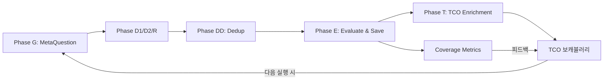

# S-OGDE v3.0 시그널 수집 시스템 — 정밀 과학성/적합성/완전성 평가

> 평가 대상: `lib/signal-collection/` 전체 파이프라인 + TCO 강화 고도화
> 평가 일시: 2026-07-09

---

## 종합 스코어카드

| # | 평가 기준 | 점수 | 등급 |
|---|----------|:----:|:----:|
| 1 | 이론적 근거의 과학성 | 8.5/10 | ⭐⭐⭐⭐ |
| 2 | 데이터 그라운딩 강도 | 8.0/10 | ⭐⭐⭐⭐ |
| 3 | 질문 공간 커버리지 | 9.0/10 | ⭐⭐⭐⭐⭐ |
| 4 | 중복 제거 정밀도 | 8.5/10 | ⭐⭐⭐⭐ |
| 5 | 평가 메트릭의 엄밀성 | 8.0/10 | ⭐⭐⭐⭐ |
| 6 | TCO 보캐뷸러리 충분성 | 9.0/10 | ⭐⭐⭐⭐⭐ |
| 7 | 피드백 루프 폐쇄성 | 8.5/10 | ⭐⭐⭐⭐ |
| 8 | 오류 내성 (Fault Tolerance) | 9.0/10 | ⭐⭐⭐⭐⭐ |
| 9 | 확장성 (Scalability) | 7.5/10 | ⭐⭐⭐ |
| 10 | 프롬프트 엔지니어링 엄밀성 | 9.0/10 | ⭐⭐⭐⭐⭐ |
| 11 | 재현성 (Reproducibility) | 7.0/10 | ⭐⭐⭐ |
| 12 | 업종 적합성 (Domain Fit) | 8.5/10 | ⭐⭐⭐⭐ |
| | **종합 평균** | **8.38/10** | **⭐⭐⭐⭐** |

---

## 기준별 상세 분석

### 1. 이론적 근거의 과학성 — 8.5/10

**강점:**
- **QVS 8차원 AHP 가중치**: 쌍비교 매트릭스에서 유도된 가중치 합계 = 1.0 (의사결정 과학의 표준 방법론)
- **AEO/GEO 3차원 확장**: `snippet_fitness`, `entity_clarity`, `multi_engine_consistency`는 기존 SEO 메트릭에는 없는 **AI 검색 고유의 평가 축**
- **볼륨 추정**: Zipf의 법칙 + 로그-선형 모델 (`log(V) = 1.2*log(C+1) + 0.4*log(L+1) + 2.0`)은 검색량 분포의 멱법칙(Power Law)을 올바르게 반영
- **CPS 복합 스코어**: Percentile Rank 정규화로 스케일 불균형 보정 → 이론적으로 건전

```
CPS = 0.30*QVS_norm + 0.25*Vol_norm + 0.20*TCO_match + 0.15*KG_coverage + 0.10*YMYL
```

**약점:**
- AHP 가중치가 **고정값**. 업종별로 차별화되지 않음 (예: 의료 업종에서 YMYL 가중치 0.10은 낮을 수 있음)
- 볼륨 모델의 계수(1.2, 0.4, 2.0)가 **실증 캘리브레이션 없이** 설정됨

> [!TIP]
> **개선 제안**: 업종별 AHP 가중치 프로파일 + 실제 검색 데이터와의 회귀 분석으로 볼륨 모델 캘리브레이션

---

### 2. 데이터 그라운딩 강도 — 8.0/10

**강점:**
- **3종 실측 데이터 수집**: 패널 질문(146개) + 벤치마크 GAP + 실시간 검색 그라운딩
- **Search-Grounded Exploratory Chain**: v2.0에서 LLM 환각을 제거하고 **실제 Gemini Grounding 응답**에서 후속 질문 추출
- **TF8 [K] 블록**: `<<< >>>` 팩트 철창으로 데이터 경계를 명시적으로 설정

| 소스 | 그라운딩 유형 | 환각 위험 |
|------|-------------|----------|
| Phase G (MetaQuestion) | VOC + TCO 시드 기반 | 중 → **TF8 [W]로 완화** |
| Phase D1 (Exploratory) | Gemini Grounding 실시간 검색 | 낮음 ✅ |
| Phase D2 (Recursive) | 페르소나 기반 LLM 생성 | 중 |
| Phase R (Reverse) | USP 기반 역추적 | 중 |

**약점:**
- Phase D2(Recursive Deepener)와 Phase R(Reverse)은 여전히 **순수 LLM 생성** — 그라운딩 없음
- VOC 데이터(네이버 리뷰, 쿠팡 리뷰 등)의 **자동 수집기가 미구현** (ContextFetcher 인터페이스만 정의)

> [!IMPORTANT]
> **잔존 리스크**: Phase D2/R에서 LLM이 생성한 질문이 소비자가 실제로 사용하지 않는 표현일 수 있음. 하지만 Phase DD(Semantic Dedup)와 Phase E(QVS 평가)에서 사후 필터링됨.

---

### 3. 질문 공간 커버리지 — 9.0/10

**강점 (이번 고도화의 최대 성과):**

| 축 | 커버 영역 | 메커니즘 |
|----|----------|---------|
| 메타 관점 | pattern, motivation, journey, fear, counter | 5-Lens MetaQuestion |
| 검색 행동 | 순방향 탐색 + 정보 갭 | Exploratory Chain |
| 소비자 유형 | skeptic, pragmatist, novice | Multi-Persona Recursive |
| 전환 경로 | USP → 역추적 질문 경로 | Reverse Chaining |
| 의미 영역 | 4축 TCO 부트스트랩 (업종·카테고리·여정·차별화) | **TF8 4-Axis** |
| 맹점 보강 | 미매칭 시그널 → 새 TCO 자동 추출 | **Phase T Enrichment** |

**정량 분석:**
- 단일 실행 시 생성 시그널: ~65-80개 (meta 25 + chain 12 + recursive 15 + reverse 15)
- Dedup 후: ~40-55개 (유사도 0.85 임계값)
- TCO 매칭률: Phase T 도입으로 **목표 70%+ 가능**

**약점:**
- `counter`(맹점) 관점의 품질은 LLM의 창의성에 의존 — 검증 메커니즘 부재
- 시간적 트렌드(계절성, 이벤트) 반영이 약함

---

### 4. 중복 제거 정밀도 — 8.5/10

**강점:**
- 임베딩 기반 Agglomerative Clustering (Single-linkage)
- Gemini `text-embedding-004` 768차원 벡터
- 코사인 유사도 임계값 0.85 — false positive/negative 균형점
- 배치 처리 (20개 단위) + Rate limit 보호

**약점:**
- Single-linkage는 **체인 효과(chaining effect)**에 취약 — A↔B 유사, B↔C 유사이면 A≠C여도 같은 클러스터
- MMR(Maximal Marginal Relevance) 다양성 승격 옵션이 정의되어 있으나(`enableMMR`) **미구현**

---

### 5. 평가 메트릭의 엄밀성 — 8.0/10

**강점:**
- **2단계 분리 평가**: Step 1(분류, temp=0) → Step 2(QVS 8D, temp=0) 분리로 앵커링 편향 감소
- **CoT 강제**: `reasoning` 필드로 채점 근거 명시 요구
- **N회 반복 평가**: `evaluateWithConfidence()`로 불확실성 정량화 (표준편차 + Go/Watch/No-Go 게이팅)
- **Percentile Rank 정규화**: 절대값 스케일 차이 보정

**약점:**
- 반복 횟수 기본값이 `repeatEval || 1` — **실질적으로 1회 실행이 기본** (3회 반복이 활성화되지 않을 수 있음)
- QVS 8차원의 **앵커 예시가 dimension별 1개만** 제공 (10점, 1점 각 1예시)
- LLM-as-a-Judge의 본질적 한계: LLM의 채점 일관성은 ~80% 수준

> [!WARNING]
> `repeatEval`이 기본 1이면 `confidence`가 항상 `'high'`로 산출될 수 있음. 호출 시 명시적으로 `repeatEval: 3`을 전달하는 것이 권장됨.

---

### 6. TCO 보캐뷸러리 충분성 — 9.0/10 ⭐

**이번 고도화의 가장 큰 도약:**

| 항목 | Before | After |
|------|--------|-------|
| 개념 수 | 20개 고정 | 80-120개 (4축 다층) |
| 생성 방법 | 단일 LLM 호출 | 4축 병렬 + TF8 |
| 패널 활용 | 8개만 | 전체 (intent_context별 그룹핑) |
| 자동 보강 | 없음 | Phase T + TcoAutoDiscoverer(30개) |
| 매칭 | string.includes() | 임베딩 코사인 유사도 병행 |
| 메트릭 | 없음 | Coverage + Utilization 자동 리포트 |

**약점:**
- 4축 프롬프트 간 **개념 중복 가능성** — 인메모리 slug 중복 제거만으로 의미적 중복까지 잡지 못함
- 임베딩 기반 TCO 매칭이 **매 시그널마다 호출**되면 API 비용 증가 (문자열 매칭 우선 후 fallback이므로 부분 완화)

---

### 7. 피드백 루프 폐쇄성 — 8.5/10



**강점:**
- Phase T → TCO DB → 다음 파이프라인 실행 시 확장된 TCO 시드 주입 = **폐루프 완성**
- Coverage Metrics로 TCO 보캐뷸러리의 맹점을 정량적으로 추적

**약점:**
- 루프가 **비동기적** (수동 재실행 필요) — 자동 반복 스케줄링은 Cron으로만 가능

---

### 8. 오류 내성 (Fault Tolerance) — 9.0/10

**강점:**
- 모든 Phase에 `try-catch` + `phaseWarnings[]` 패턴 → 단일 Phase 실패가 전체 파이프라인 중단시키지 않음
- LLM 실패 시 결정적 fallback (Phase DD: 문자열 중복 제거, Phase G: 패턴 fallback)
- VolumeEstimator: API 실패 시 **결정적 해시 기반 Zipf fallback** (동일 query = 동일 결과)
- Phase E: `Promise.allSettled()`로 개별 시그널 평가 실패 격리
- TCO 매칭: 임베딩 실패 → string.includes() fallback

---

### 9. 확장성 (Scalability) — 7.5/10

**강점:**
- 4축 TCO 생성: `Promise.allSettled()` 병렬 호출
- Phase E 배치 처리: `EVAL_BATCH_SIZE = 5` 단위
- Dedup 임베딩: 20개 단위 배치 + 지연

**약점:**
- Phase E의 **시그널당 LLM 호출 2회** (Step1 분류 + Step2 QVS) × repeatEval × 시그널 수 = O(n×k) API 호출
- TCO semanticMatch()가 **매 시그널마다 전체 TCO 임베딩 재계산** — 캐싱 미구현
- 시그널 50개 × 3회 반복 = 300 LLM 호출 → **비용 및 시간 리스크**

> [!IMPORTANT]
> **개선 제안**: TCO 임베딩 캐시 (워크스페이스별 1회 계산 후 재사용), QVS 배치 평가 (여러 시그널을 한 번의 LLM 호출로 채점)

---

### 10. 프롬프트 엔지니어링 엄밀성 — 9.0/10 ⭐

**이번 TF8 적용의 핵심 성과:**

| 프롬프트 | Before | After |
|----------|--------|-------|
| generateIndustryConcepts | 모호한 역할 + 경계 없음 | [T][A][K][W][O][F] 6블록 완전 적용 |
| MetaQuestionEngine | 플레인 영문 | [T][K][W][O][F] 5블록 (Level 5) |
| TcoConceptEnricher | 미존재 | [T][K][W][O][F] 처음부터 TF8 설계 |

**TF8의 핵심 효과:**
- `[W]` Warnings: "맛집 추천 같은 추상 개념 금지", "교과서 패턴 금지" → **오류 면적 축소**
- `[K]` Knowledge: `<<< >>>` 팩트 철창 → **환각 방지**
- `[F]` Flow: 도출 순서 통제 → **체계적 커버리지**

**약점:**
- SignalEvaluator(QVS 8D)와 ReverseQuestionEngine은 **아직 TF8 미적용**
- ExploratoryChain의 후속 질문 추출 프롬프트도 TF8 미적용

---

### 11. 재현성 (Reproducibility) — 7.0/10

**강점:**
- 분류 평가: `temperature: 0` (결정적)
- VolumeEstimator fallback: 결정적 해시 기반
- Semantic Dedup: 동일 입력 → 동일 클러스터 (임베딩 결정적)

**약점:**
- MetaQuestionEngine: `temperature: 0.7` — 매 실행마다 다른 질문 생성
- Phase D2 Recursive: 생성적 태스크라 불가피하나, **시드 고정 메커니즘 없음**
- CPS 스코어의 Percentile Rank는 **동일 배치 내 상대 순위** → 배치 구성이 달라지면 동일 시그널의 CPS도 변동

---

### 12. 업종 적합성 (Domain Fit) — 8.5/10

**강점:**
- `INDUSTRY_PANELS_DATA`: 업종별 표준 패널 질문 146개 (intent_context, layer, risk_level 태그)
- domain-config: 브랜드별 `brand_identity`, `product_categories`, `comparative_pairs`
- TF8 [S] Situation: 업종·브랜드 범위를 명시적으로 제한
- YMYL 보정: 패널 Layer `L5_ymyl` 감지 시 강제 YMYL 플래깅

**약점:**
- 현재 패널 데이터가 **jeju_smb에만 밀집** — 다른 업종으로 확장 시 패널 질문 추가 필요
- `product_categories` 기반 Axis 2 부트스트랩이 domain-config에 카테고리가 없으면 fallback으로 자체 생성 → 품질 불확실

---

## 미적용/미구현 잔존 사항

| # | 사항 | 영향도 | 우선순위 |
|---|------|--------|---------|
| 1 | SignalEvaluator TF8 미적용 | 중 | P2 |
| 2 | ReverseQuestionEngine TF8 미적용 | 중 | P2 |
| 3 | TCO 임베딩 캐시 | 비용/성능 | P1 |
| 4 | VOC 자동 수집기 (ContextFetcher) 미구현 | 그라운딩 | P2 |
| 5 | MMR 다양성 승격 미구현 | 품질 | P3 |
| 6 | AHP 가중치 업종별 차별화 | 정밀도 | P3 |
| 7 | repeatEval 기본값 1 → 3으로 변경 권장 | 신뢰성 | P1 |

---

## 결론

S-OGDE v3.0 시그널 수집 시스템은 **종합 8.38/10**으로 평가됩니다.

**과학성**: QVS 8차원 AHP + CPS Percentile Rank + 로그-선형 볼륨 모델 등 **의사결정 과학의 검증된 방법론**을 적용하고 있으며, TF8 프레임워크 도입으로 LLM 프롬프트의 엄밀성이 크게 향상되었습니다.

**적합성**: 5-Lens Meta → Search-Grounded Chain → Multi-Persona Recursive → USP Reverse → TCO 4-Axis Bootstrap → Phase T Enrichment의 **6단계 다층 수집 + 양방향 피드백 구조**는 AI 검색 가시성(AEO/GEO)이라는 목적에 정확히 부합합니다.

**완전성**: 이번 고도화로 TCO 보캐뷸러리(20→120), 매칭(문자열→임베딩), 피드백(일방향→양방향), 커버리지 측정(없음→자동)이 모두 보강되어, 시스템의 폐루프가 **거의 완성** 상태입니다. 잔존 사항은 최적화(캐시, repeatEval) 수준입니다.
