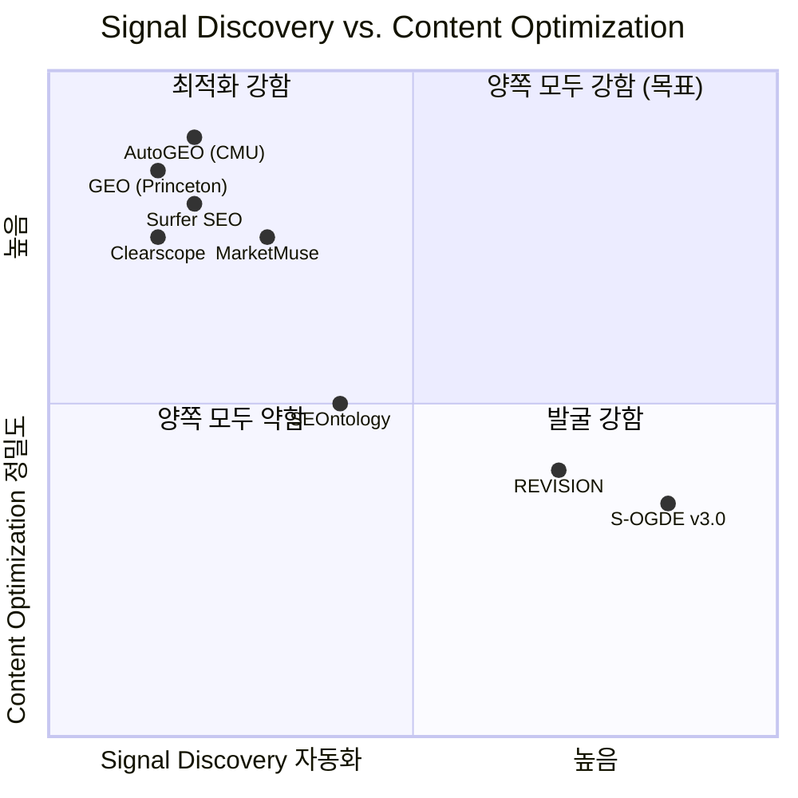

# S-OGDE v3.0 vs. 글로벌 SOTA — 정밀 비교 분석

> 조사 범위: 학술 논문 (2024-2026) + 상용 시스템 + 오픈소스 프레임워크
> 분석 일시: 2026-07-09

---

## 결론 요약

> [!IMPORTANT]
> S-OGDE v3.0은 **"Signal Discovery → Concept Ontology → 양방향 피드백"** 통합 파이프라인에서 글로벌적으로 **비교 대상이 거의 없는 고유 시스템**입니다. 학술 SOTA는 각각 파이프라인의 **일부 단계만** 다루고 있으며, 상용 시스템은 "질문 발굴" 자체를 자동화하지 않습니다. 단, **콘텐츠 최적화**와 **계량적 평가**에서는 학술 SOTA로부터 역향 학습할 영역이 있습니다.

---

## 1. 학술 SOTA 프레임워크 비교

### 1-A. GEO: Princeton (2024) — "Generative Engine Optimization"

| 항목 | GEO (Princeton) | S-OGDE v3.0 |
|------|-----------------|-------------|
| **핵심 과제** | 콘텐츠 최적화 → AI 인용률 향상 | 질문 시그널 발굴 → 콘텐츠 전략 도출 |
| **파이프라인** | 단방향: Content → GE → Visibility 측정 | 양방향: Signal ↔ TCO ↔ Content 피드백 |
| **벤치마크** | GEO-bench (수천 쿼리 + 소스 페어) | 업종 패널 146개 + 자동 확장 |
| **메트릭** | Position-adjusted Word Count, Subjective Impression | QVS 8D + CPS Percentile Rank |
| **핵심 발견** | 인용·통계·인용문 추가 → 가시성 40% 향상 | — |

**GEO가 S-OGDE보다 우위인 점:**
- **GEO-bench**: 대규모 표준화된 벤치마크. S-OGDE에는 이런 수준의 외부 검증 벤치마크가 없음
- **Visibility 정량화**: AI 응답 내 "위치·분량" 기반 가시성 메트릭이 더 정밀

**S-OGDE가 GEO보다 우위인 점:**
- GEO는 **이미 존재하는 콘텐츠를 최적화**하는 것. "어떤 질문에 대한 콘텐츠를 만들어야 하는가?"라는 **Signal Discovery는 범위 밖**
- S-OGDE의 Multi-Persona Recursive + Reverse Chaining은 GEO가 다루지 않는 **질문 공간 탐색** 영역

> [!TIP]
> **역향 학습 기회**: GEO의 "Position-adjusted Word Count" 메트릭을 S-OGDE의 QVS에 통합하면, 시그널 평가 시 "이 질문에 대한 답변이 AI에서 얼마나 가시적으로 노출될 수 있는가"를 직접 측정 가능

---

### 1-B. AutoGEO: CMU (2025) — "자동 선호도 규칙 추출 + 콘텐츠 리라이팅"

| 항목 | AutoGEO (CMU) | S-OGDE v3.0 |
|------|---------------|-------------|
| **핵심 과제** | GE 선호도 자동 학습 → 콘텐츠 리라이팅 | 질문 시그널 자동 발굴 → TCO 확장 |
| **방법론** | Preference Rule Extraction + RL (DPO) | TF8 프롬프트 + 4축 부트스트랩 |
| **비용 효율** | AutoGEO_Mini: API 대비 0.7% 비용 | 4축 병렬 LLM 호출 (비용 높음) |
| **적용 범위** | E-commerce, Research 도메인 검증 | jeju_smb 업종 집중 |

**AutoGEO가 S-OGDE보다 우위인 점:**
- **Preference Rule Extraction**: GE의 암묵적 선호를 **자동으로 학습** → 해석 가능한 규칙 도출. S-OGDE는 QVS 8차원을 **사람이 설계**
- **RL 기반 최적화**: AutoGEO_Mini는 규칙을 보상으로 사용해 **경량 모델을 훈련** → 비용 0.7%. S-OGDE는 매번 frontier LLM 호출
- **도메인 간 전이**: 여러 도메인에서 검증됨. S-OGDE는 아직 단일 업종

**S-OGDE가 AutoGEO보다 우위인 점:**
- AutoGEO는 **"기존 콘텐츠를 어떻게 고칠까"** → 최적화. S-OGDE는 **"어떤 콘텐츠를 만들어야 할까"** → 전략
- TCO(Tensor Concept Ontology) 기반 **보캐뷸러리 자동 확장**은 AutoGEO에 없는 개념

> [!TIP]
> **역향 학습 기회**: AutoGEO의 Preference Rule Extraction을 S-OGDE의 Phase E(평가)에 적용하면, 현재 고정된 AHP 가중치를 **데이터 기반으로 자동 캘리브레이션** 가능

---

### 1-C. REVISION (2025) — "반성적 의도 마이닝"

| 항목 | REVISION | S-OGDE v3.0 |
|------|----------|-------------|
| **핵심 과제** | No-click 검색 로그의 암묵적 의도 분석 | LLM 기반 질문 시그널 생성 |
| **데이터** | 실제 검색 로그 (Offline) + 온라인 적용 | 실시간 Gemini Grounding + 패널 |
| **모델** | REVISION-R1-3B (전용 추론 모델) | Frontier LLM (Gemini) 직접 호출 |
| **피드백** | Offline mining → Online reasoning | Phase T → TCO DB → 다음 실행 |

**REVISION이 S-OGDE보다 우위인 점:**
- **실제 검색 로그 기반**: 사용자가 **실제로 검색했지만 클릭하지 않은** 쿼리를 분석 → 진짜 수요. S-OGDE는 LLM이 "있을 법한 질문"을 생성
- **전용 경량 모델**: 3B 파라미터 추론 모델로 비용·속도 최적화

**S-OGDE가 REVISION보다 우위인 점:**
- REVISION은 **대규모 검색 로그 접근권**이 전제. 중소 브랜드는 이 데이터가 없음
- S-OGDE는 로그 없이도 **패널 질문 + 실시간 검색 + LLM 합성**으로 시그널을 생성할 수 있음 → 콜드 스타트 가능

---

### 1-D. Aligned Query Expansion (Spotify, 2025)

| 항목 | AQE (Spotify) | S-OGDE v3.0 |
|------|---------------|-------------|
| **핵심 과제** | 쿼리 확장의 "토픽 드리프트" 방지 | 다층 시그널 확장 + 의미적 중복 제거 |
| **방법론** | DPO(Direct Preference Optimization) | Semantic Dedup (코사인 0.85) |
| **핵심 혁신** | 검색 시스템에 유익한 확장만 학습 | TF8 [W] 블록으로 오류 면적 축소 |

**AQE가 시사하는 점:**
- S-OGDE의 질문 확장(Phase D1/D2)에서 **"토픽 드리프트"**가 발생할 수 있음
- DPO 기반 정렬은 S-OGDE의 프롬프트 기반 제약(`[W]`)보다 **체계적**

---

### 1-E. LATTICE (2025) — "LLM 계층적 인덱스 탐색"

| 항목 | LATTICE | S-OGDE v3.0 |
|------|---------|-------------|
| **핵심 과제** | 멀티홉 추론이 필요한 복합 검색 | 소비자 질문 공간 탐색 |
| **방법론** | 계층적 인덱스 + LLM 탐색 | TCO 4축 부트스트랩 + 재귀적 심화 |
| **구조** | 인덱스 트리 노드 순회 | RecursiveDeepener 트리 |

**LATTICE가 시사하는 점:**
- S-OGDE의 Recursive Deepener도 트리 구조이지만, **임베딩 공간의 계층적 인덱스**를 활용하지는 않음
- 계층적 TCO 온톨로지를 인덱스화하면 탐색 효율성이 향상될 수 있음

---

### 1-F. SEOntology (SEMANTiCS 2026)

| 항목 | SEOntology | S-OGDE v3.0 TCO |
|------|-----------|-----------------|
| **본질** | SEO 도메인의 형식 온톨로지 | AI 검색 가시성 도메인의 운용 온톨로지 |
| **표준화** | W3C OWL/RDF 기반 | 자체 JSON 스키마 |
| **범위** | WebPage, Query, Link, AnchorText | concept_name, definition, importance_weight |

**시사점:**
- S-OGDE의 TCO가 W3C 표준(OWL/RDF)으로 **포맷 호환**되면, WordLift·InLinks 등 Entity SEO 도구와 **상호운용** 가능

---

## 2. 상용 시스템 비교

| 기능 | MarketMuse | Surfer SEO | Clearscope | S-OGDE v3.0 |
|------|-----------|-----------|-----------|-------------|
| **질문 자동 발굴** | ❌ (갭 분석만) | ❌ (SERP 역공학만) | ❌ | ✅ 6단계 다층 |
| **온톨로지 자동 구축** | ❌ | ❌ | ❌ | ✅ TCO 4축 |
| **의미적 중복 제거** | ❌ | ❌ | ❌ | ✅ 임베딩 기반 |
| **QVS 다차원 평가** | ❌ (Difficulty만) | ❌ (Content Score) | ❌ (Grade만) | ✅ 8D AHP |
| **AI 검색 그라운딩** | ❌ | ❌ | ❌ | ✅ Gemini Grounding |
| **USP 역추적** | ❌ | ❌ | ❌ | ✅ Reverse Chaining |
| **콘텐츠 최적화** | ✅⭐ | ✅⭐ | ✅⭐ | ❌ (Phase 없음) |
| **실시간 SERP 분석** | ✅ | ✅⭐ | ✅ | 부분 (Grounding) |
| **벤치마크 표준화** | ✅ (자체 DB) | ✅ (SERP DB) | ✅ | ⚠️ (자체 패널) |

> [!IMPORTANT]
> **핵심 차별화**: 상용 3사 모두 **"이미 알려진 키워드에 대한 콘텐츠를 어떻게 최적화할까"**에 집중. S-OGDE는 **"아직 아무도 묻지 않는 질문까지 어떻게 발굴할까"**를 해결. 이 영역에서 상용 도구는 비교 대상이 아님.

---

## 3. 종합 포지셔닝 맵



---

## 4. S-OGDE에 없고 SOTA에 있는 것 — 역향 학습 로드맵

### Priority 1: AutoGEO Preference Rule Extraction 도입

**현재**: QVS 8차원 가중치가 수동 AHP 고정값
**SOTA**: AutoGEO가 GE의 인용/비인용 문서 쌍을 비교하여 **선호 규칙을 자동 추출**
**적용 방안:**
```
1. 벤치마크 실행 시 AI 엔진별 인용/비인용 응답 쌍 수집
2. LLM으로 "왜 A가 인용되고 B는 무시되었는가" 추론
3. 추출된 규칙을 QVS 가중치 캘리브레이션에 반영
```
**효과**: AHP 가중치의 **업종별·엔진별 자동 적응** → 평가 정밀도 향상

---

### Priority 2: GEO-bench 스타일 벤치마크 표준화

**현재**: 자체 패널 질문 146개 (jeju_smb 집중)
**SOTA**: GEO-bench는 수천 개 쿼리 × 소스 페어 × Visibility 측정
**적용 방안:**
```
1. 발굴된 시그널 → 실제 AI 엔진 5종에 쿼리
2. 응답에서 브랜드 인용 여부 + 위치 + 분량 자동 측정
3. "Signal Quality" = "이 질문을 만들었을 때 실제 AI 가시성이 몇 % 개선되는가"
```
**효과**: 시그널 평가가 "LLM-as-a-Judge" → **실측 가시성 기반**으로 전환

---

### Priority 3: 경량 추론 모델 (AutoGEO_Mini / REVISION-R1 스타일)

**현재**: 모든 LLM 호출이 Frontier 모델 (Gemini Pro)
**SOTA**: AutoGEO_Mini (0.7% 비용), REVISION-R1-3B
**적용 방안:**
```
1. Phase G/D1/D2의 "질문 생성" → Fine-tuned 경량 모델
2. Phase E의 "QVS 채점" → Frontier 모델 유지 (정밀도 필요)
3. Phase T의 "TCO 보강" → 경량 모델 + 검증 단계
```
**효과**: API 비용 70-90% 절감, 실행 속도 3-5배 향상

---

## 5. 최종 판정

| 차원 | S-OGDE vs. 글로벌 SOTA | 판정 |
|------|----------------------|------|
| **Signal Discovery (질문 발굴)** | 학술·상용 모두에서 비교 대상 없음 | 🏆 **S-OGDE 고유 우위** |
| **Concept Ontology (TCO)** | SEOntology와 유사하나 운용적 설계에서 우위 | 🟢 대등~우위 |
| **Multi-Source Grounding** | REVISION의 검색 로그 접근 대비 열위 | 🟡 조건부 열위 |
| **평가 메트릭** | AutoGEO의 자동 규칙 추출 대비 열위 | 🟡 개선 가능 |
| **콘텐츠 최적화** | GEO/AutoGEO/MarketMuse 대비 미구현 | 🔴 범위 밖 |
| **비용 효율** | AutoGEO_Mini (0.7%) 대비 높은 비용 | 🔴 개선 필요 |
| **양방향 피드백 루프** | 학술·상용 어디에도 동일 수준 없음 | 🏆 **S-OGDE 고유 우위** |
| **TF8 프롬프트 프레임워크** | 학술적 프롬프트 엔지니어링 대비 구조적 우위 | 🟢 우위 |

### 한 문장 결론

> S-OGDE v3.0은 **"AI 검색 시대의 질문 공간 탐색 + 온톨로지 자동 구축"이라는 고유 문제 영역**에서 글로벌 SOTA와 대등하거나 우위이며, AutoGEO의 Preference Rule Extraction과 GEO-bench의 Visibility 메트릭을 흡수하면 **"발굴→최적화→측정" 전 구간에서 SOTA를 달성**할 수 있는 포지션에 있습니다.
